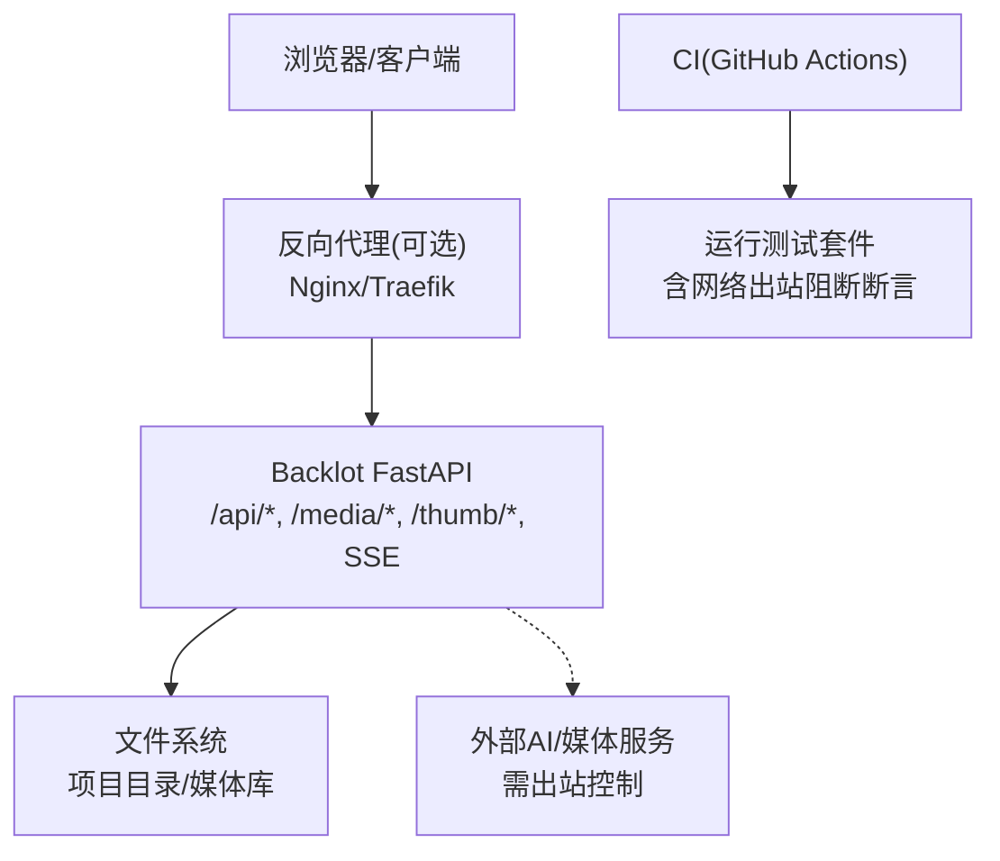
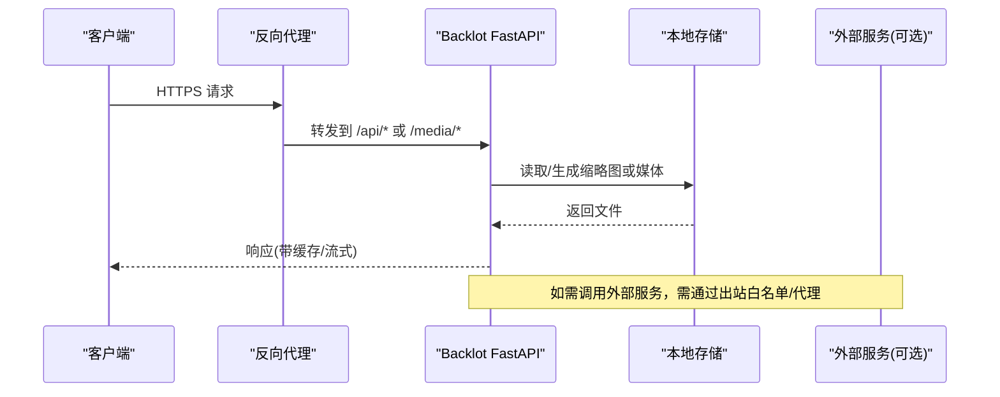
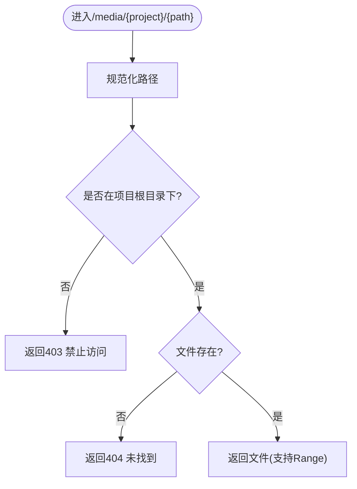
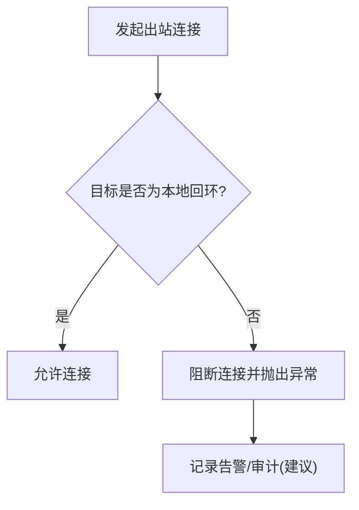
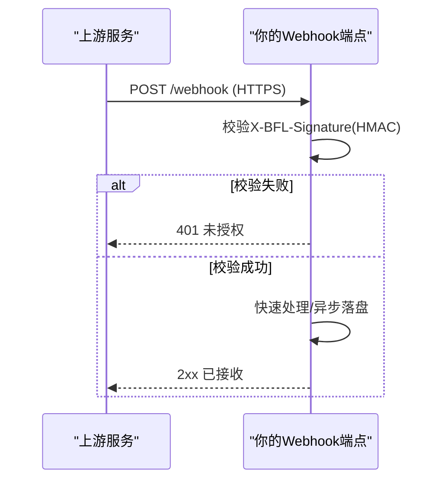
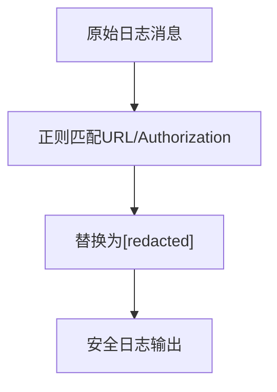
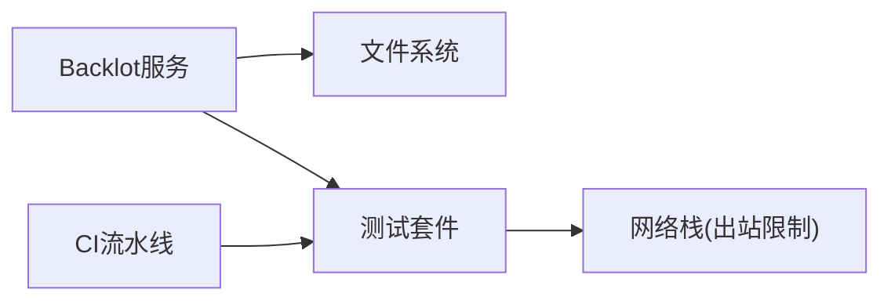

# 网络安全配置

<cite>
**本文引用的文件**
- [backlot/server.py](file://backlot/server.py)
- [config.yaml](file://config.yaml)
- [tests/test_network_guard.py](file://tests/test_network_guard.py)
- [tools/video/seedance_ark.py](file://tools/video/seedance_ark.py)
- [.agents/skills/bfl-api/references/webhook-integration.md](file://.agents/skills/bfl-api/references/webhook-integration.md)
- [.agents/skills/agents/references/agent-configuration.md](file://.agents/skills/agents/references/agent-configuration.md)
- [.github/workflows/ci.yml](file://.github/workflows/ci.yml)
</cite>

## 目录
1. [简介](#简介)
2. [项目结构](#项目结构)
3. [核心组件](#核心组件)
4. [架构总览](#架构总览)
5. [详细组件分析](#详细组件分析)
6. [依赖分析](#依赖分析)
7. [性能考虑](#性能考虑)
8. [故障排查指南](#故障排查指南)
9. [结论](#结论)
10. [附录](#附录)

## 简介
本指南面向OpenMontage的部署与运维人员，聚焦网络安全配置与实践。内容涵盖HTTPS证书与SSL/TLS、CORS跨域、反向代理、网络隔离、Docker容器网络、云服务网络架构、安全监控与流量分析、常见攻击防护与DDoS缓解等。文档同时结合仓库中的Backlot Web服务、网络出站限制测试、Webhook安全要求以及日志脱敏实践，给出可操作的落地建议。

## 项目结构
OpenMontage包含一个FastAPI驱动的Backlot服务（用于项目管理与媒体访问）、全局配置、CI流水线以及若干技能参考文档。与安全相关的要点包括：
- Backlot服务暴露REST API与SSE事件流，提供健康检查、项目状态、媒体与缩略图访问能力。
- 通过测试用例验证出站网络被默认阻断，防止误用付费API产生费用。
- Webhook集成要求强制HTTPS并校验签名。
- 日志中自动对URL与Authorization头进行脱敏，降低敏感信息泄露风险。
- CI在GitHub Actions中执行Python环境安装与测试，便于在受控环境中运行安全相关测试。

图表来源
- [backlot/server.py:165-307](file://backlot/server.py#L165-L307)
- [tests/test_network_guard.py:16-45](file://tests/test_network_guard.py#L16-L45)

章节来源
- [backlot/server.py:165-307](file://backlot/server.py#L165-L307)
- [tests/test_network_guard.py:16-45](file://tests/test_network_guard.py#L16-L45)

## 核心组件
- Backlot Web服务
  - 提供健康检查、项目列表、项目状态、SSE事件流、静态UI资源、缩略图与媒体访问。
  - 对媒体路径进行严格校验，防止路径穿越；为SSE设置合适的缓存控制与缓冲头。
- 网络出站限制
  - 通过测试断言证明默认环境下对外部网络的连接被阻止，仅允许本地回环通信，避免意外调用付费API。
- Webhook安全
  - 生产环境要求使用HTTPS，并对请求体进行HMAC签名校验，快速响应以避免重试风暴。
- 日志与敏感信息保护
  - 自动对URL查询参数与Authorization头进行脱敏处理，减少日志泄露风险。
- 配置与CI
  - 全局配置集中管理输出与路径；CI在标准Linux环境安装依赖并运行测试，确保变更的安全回归。

章节来源
- [backlot/server.py:165-307](file://backlot/server.py#L165-L307)
- [tests/test_network_guard.py:16-45](file://tests/test_network_guard.py#L16-L45)
- [.agents/skills/bfl-api/references/webhook-integration.md:207-225](file://.agents/skills/bfl-api/references/webhook-integration.md#L207-L225)
- [tools/video/seedance_ark.py:1438-1473](file://tools/video/seedance_ark.py#L1438-L1473)
- [config.yaml:1-34](file://config.yaml#L1-L34)
- [.github/workflows/ci.yml:18-47](file://.github/workflows/ci.yml#L18-L47)

## 架构总览
下图展示典型部署下的网络边界与数据流：客户端经反向代理访问Backlot，媒体与缩略图从本地存储读取；外部AI/媒体服务调用需通过出站白名单或代理网关；CI在隔离环境中运行测试以保障安全策略有效。

图表来源
- [backlot/server.py:165-307](file://backlot/server.py#L165-L307)

## 详细组件分析

### Backlot Web服务安全要点
- 路径校验与访问控制
  - 媒体与缩略图接口对目标路径进行规范化与相对性校验，拒绝越界访问未知项目或系统路径。
- SSE事件流
  - 为SSE端点设置无缓存与禁用代理缓冲，确保实时性与可靠性；心跳机制维持长连接健康。
- 中间件与缓存
  - UI与页面资源启用no-cache以确保更新及时生效；媒体与缩略图保持正常缓存策略以提升性能。

图表来源
- [backlot/server.py:242-276](file://backlot/server.py#L242-L276)

章节来源
- [backlot/server.py:165-307](file://backlot/server.py#L165-L307)

### 网络出站限制与防误计费
- 默认阻断外部网络
  - 测试覆盖socket直连、create_connection与requests库，均预期抛出异常，表明出站被拦截。
- 本地通信保留
  - 允许127.0.0.1回环地址通信，保证本地服务与测试夹具正常工作。
- 付费工具防护
  - 即使环境变量中存在密钥，测试也断言不会触发实际计费，确保“零成本”运行。

图表来源
- [tests/test_network_guard.py:16-45](file://tests/test_network_guard.py#L16-L45)

章节来源
- [tests/test_network_guard.py:16-45](file://tests/test_network_guard.py#L16-L45)

### Webhook安全与HTTPS要求
- 强制HTTPS
  - 生产环境Webhook必须使用HTTPS，否则上游不会投递。
- 签名校验
  - 使用HMAC-SHA256对请求体进行签名校验，采用时序安全比较避免侧信道。
- 快速响应与重试策略
  - 2xx响应并在限定时间内完成；上游具备指数退避的重试策略，应保证处理器轻量且幂等。

图表来源
- [.agents/skills/bfl-api/references/webhook-integration.md:152-225](file://.agents/skills/bfl-api/references/webhook-integration.md#L152-L225)

章节来源
- [.agents/skills/bfl-api/references/webhook-integration.md:152-225](file://.agents/skills/bfl-api/references/webhook-integration.md#L152-L225)

### 日志与敏感信息脱敏
- URL与令牌脱敏
  - 自动识别并隐藏URL查询参数与Authorization头中的Bearer令牌，降低日志泄露风险。
- 适用场景
  - 适用于调试日志、错误堆栈、第三方回调日志等可能包含敏感信息的文本。

图表来源
- [tools/video/seedance_ark.py:1438-1473](file://tools/video/seedance_ark.py#L1438-L1473)

章节来源
- [tools/video/seedance_ark.py:1438-1473](file://tools/video/seedance_ark.py#L1438-L1473)

### 配置与CI安全基线
- 全局配置
  - 统一输出格式、编码、分辨率、帧率等；路径配置集中管理，便于审计与迁移。
- CI流水线
  - 在Ubuntu环境安装ffmpeg与Python依赖，执行lint与测试，确保代码与依赖变更不引入安全问题。

章节来源
- [config.yaml:1-34](file://config.yaml#L1-L34)
- [.github/workflows/ci.yml:18-47](file://.github/workflows/ci.yml#L18-L47)

## 依赖分析
- 组件耦合
  - Backlot服务依赖文件系统与可选的外部服务；测试模块依赖网络栈抽象以验证出站限制。
- 外部依赖
  - FastAPI框架、SSE流式响应、静态文件服务；CI依赖GitHub Actions与系统包管理器。
- 潜在循环依赖
  - 当前结构清晰，未见循环导入；服务与测试解耦良好。

图表来源
- [backlot/server.py:165-307](file://backlot/server.py#L165-L307)
- [tests/test_network_guard.py:16-45](file://tests/test_network_guard.py#L16-L45)
- [.github/workflows/ci.yml:18-47](file://.github/workflows/ci.yml#L18-L47)

章节来源
- [backlot/server.py:165-307](file://backlot/server.py#L165-L307)
- [tests/test_network_guard.py:16-45](file://tests/test_network_guard.py#L16-L45)
- [.github/workflows/ci.yml:18-47](file://.github/workflows/ci.yml#L18-L47)

## 性能考虑
- SSE心跳与节流
  - 定期心跳避免空闲连接超时；批量合并变更事件，减少前端刷新压力。
- 缩略图缓存
  - 基于文件元数据与尺寸生成唯一键，缓存JPEG缩略图，提升媒体浏览性能。
- 反向代理优化
  - 建议在Nginx/Traefik层开启gzip压缩、HTTP/2、TLS会话复用与合理的超时设置。

章节来源
- [backlot/server.py:183-240](file://backlot/server.py#L183-L240)
- [backlot/server.py:325-365](file://backlot/server.py#L325-L365)

## 故障排查指南
- 无法访问媒体或缩略图
  - 检查项目ID合法性与路径是否在项目根目录下；确认文件存在且可读。
- SSE连接中断
  - 检查代理是否允许text/event-stream；确认Cache-Control与X-Accel-Buffering头未被篡改。
- 出站连接被阻断
  - 若确需访问外部服务，请在运行时通过环境变量或网络策略显式放行；否则保持默认阻断以防误计费。
- Webhook未收到回调
  - 确认使用HTTPS；校验签名算法与密钥；确保快速返回2xx并实现幂等处理。
- 日志中出现敏感信息
  - 确认已启用URL与Authorization脱敏逻辑；必要时在应用层二次过滤。

章节来源
- [backlot/server.py:242-276](file://backlot/server.py#L242-L276)
- [backlot/server.py:183-240](file://backlot/server.py#L183-L240)
- [tests/test_network_guard.py:16-45](file://tests/test_network_guard.py#L16-L45)
- [.agents/skills/bfl-api/references/webhook-integration.md:207-225](file://.agents/skills/bfl-api/references/webhook-integration.md#L207-L225)
- [tools/video/seedance_ark.py:1438-1473](file://tools/video/seedance_ark.py#L1438-L1473)

## 结论
OpenMontage在网络与安全防护方面提供了坚实基础：Backlot服务具备严格的文件访问控制与SSE最佳实践；默认出站阻断有效防止误用付费API；Webhook集成强调HTTPS与签名校验；日志脱敏降低敏感信息泄露风险。结合反向代理、防火墙规则、容器网络与云原生安全策略，可构建端到端的网络安全体系。

## 附录

### HTTPS证书与SSL/TLS配置建议
- 证书管理
  - 使用自动化证书颁发与续期（如Let’s Encrypt），确保证书有效期与权限最小化。
- TLS版本与套件
  - 启用TLS 1.2+，禁用弱加密套件；优先选择ECDHE与AES-GCM组合。
- 反向代理
  - 在Nginx/Traefik层终止TLS，配置HSTS、OCSP Stapling与安全的Cookie属性。

### CORS跨域请求配置
- 白名单与凭证
  - 仅允许可信源；谨慎使用credentials模式，避免携带敏感Cookie。
- 预检请求
  - 合理设置Access-Control-Max-Age以减少OPTIONS风暴。
- 方法头限制
  - 仅开放必要方法与头部，遵循最小权限原则。

### 反向代理与网络隔离
- 入口网关
  - 使用反向代理统一鉴权、限流、WAF与审计日志。
- 内网隔离
  - 将Backlot置于私有子网，仅开放必要端口；数据库与对象存储通过内网访问。
- 出站控制
  - 默认拒绝所有出站，按需放行域名/IP；对外部AI/媒体服务调用走企业代理并记录审计。

### Docker容器网络配置
- 网络模式
  - 使用自定义bridge网络隔离容器；仅暴露必要端口。
- 环境变量与密钥
  - 通过Secrets或外部密钥管理服务注入敏感信息，避免写入镜像。
- 只读根文件系统
  - 尽可能将容器根文件系统设为只读，仅挂载必要的写目录。

### 云服务网络架构设计
- 分层架构
  - 公网入口（负载均衡/WAF）→ 应用层（Backlot）→ 数据层（数据库/对象存储）。
- 区域与可用区
  - 多可用区部署提高可用性；跨区域复制关键数据。
- 身份与访问
  - 使用IAM最小权限；服务间通信通过内部网络与短期凭据。

### 网络安全监控方案
- 指标与日志
  - 采集HTTP状态码、延迟、错误率；集中化日志与结构化字段。
- 告警与演练
  - 针对异常峰值、认证失败、路径穿越尝试设置告警；定期进行渗透与应急演练。
- 合规与审计
  - 保留审计日志不少于规定期限；定期审查访问与变更。

### 常见网络攻击防护
- 输入校验与输出编码
  - 对所有输入进行严格校验；输出时进行编码与上下文转义。
- 速率限制与防重放
  - 对API与Webhook实施速率限制；对幂等操作添加nonce或时间戳校验。
- 最小暴露面
  - 关闭不必要的端口与服务；定期扫描漏洞并修补。

### DDoS防护
- 多层缓解
  - 使用CDN/WAF进行流量清洗；后端启用连接数与请求频率限制。
- 弹性与降级
  - 自动扩缩容；非关键功能降级以保证核心业务可用。
- 监控与响应
  - 实时监控流量特征；建立自动化封禁与人工处置流程。

### 网络流量分析
- 全量与抽样
  - 关键链路全量抓包；常规流量采样分析。
- 可视化与溯源
  - 使用分布式追踪关联请求；结合日志与指标定位瓶颈与异常。
- 安全联动
  - 与SIEM/SOAR集成，实现威胁检测与自动响应。