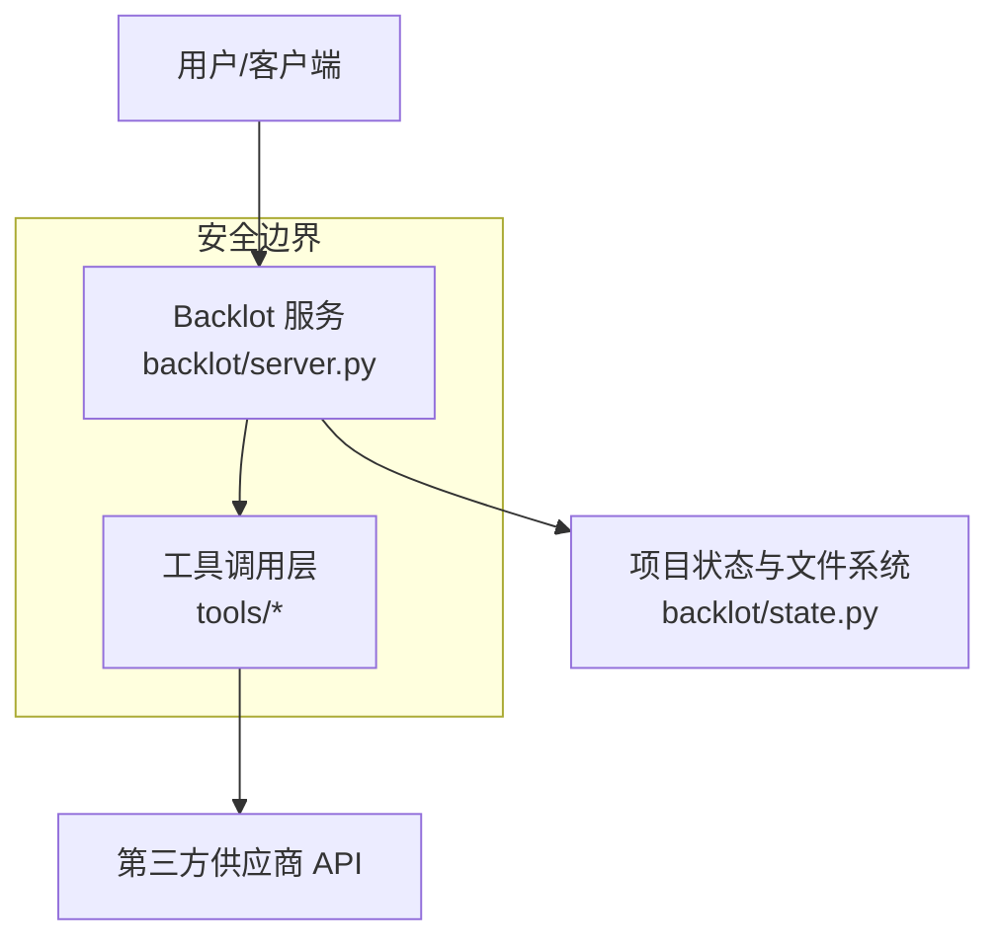
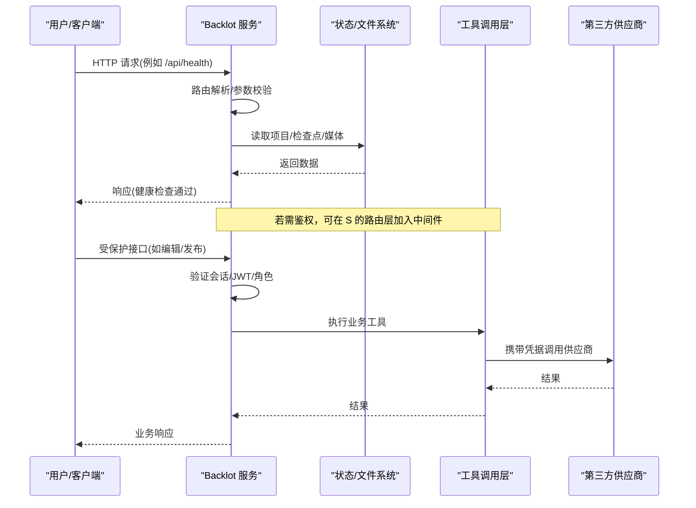
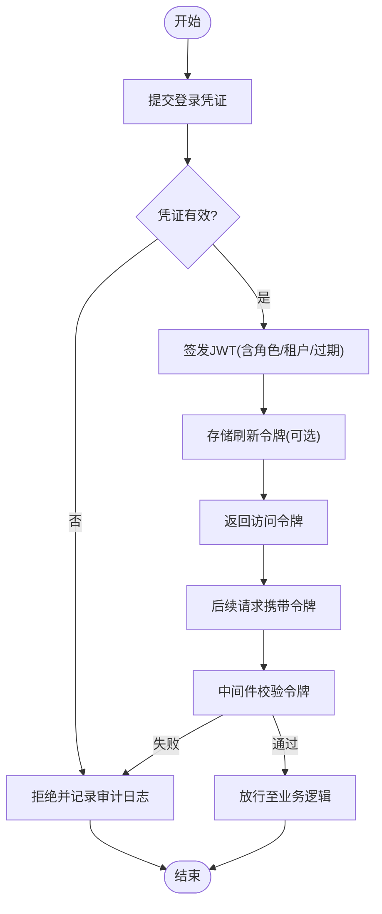
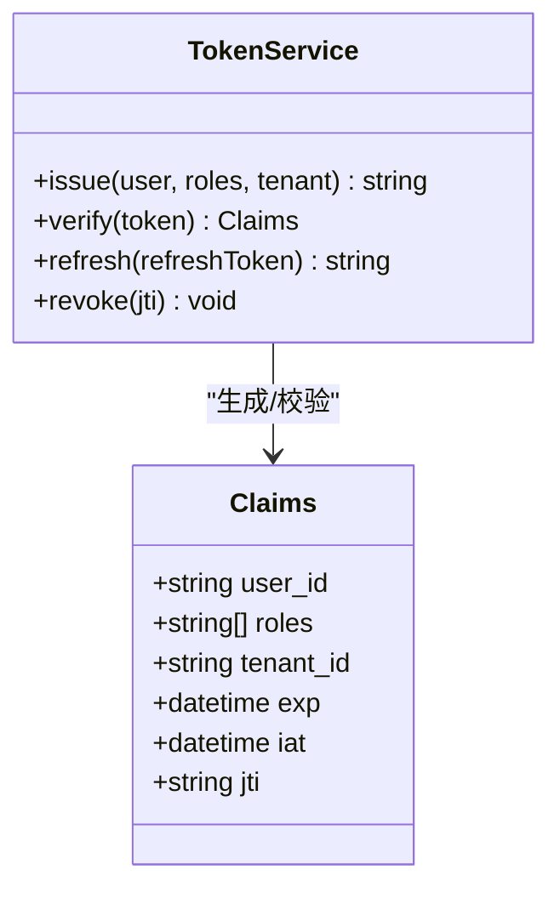
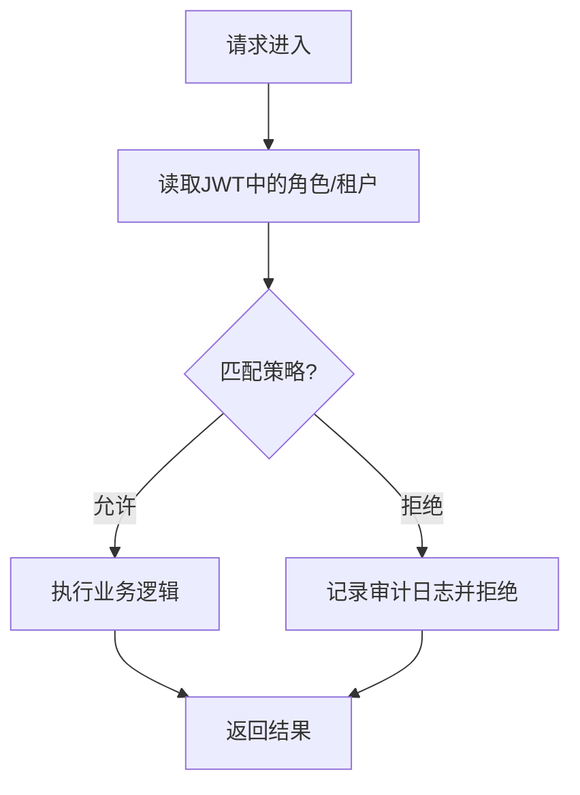
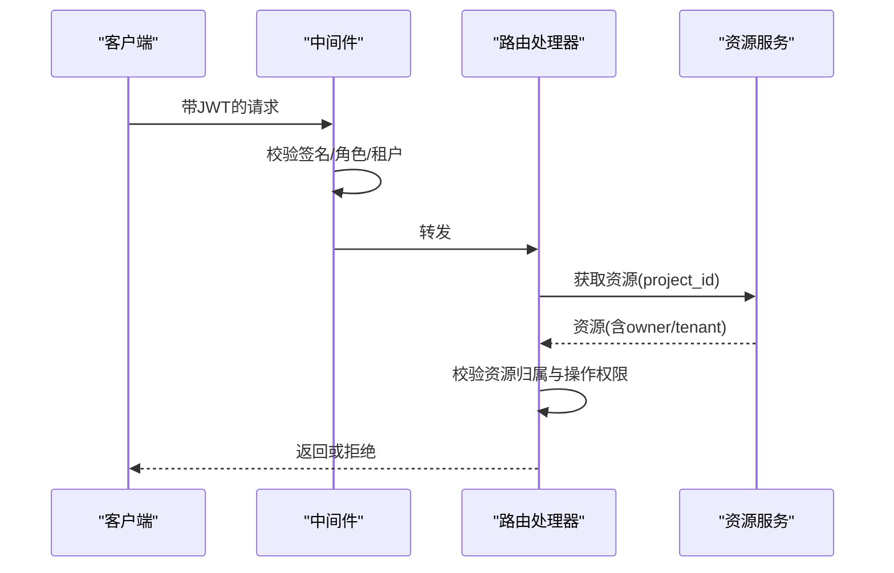
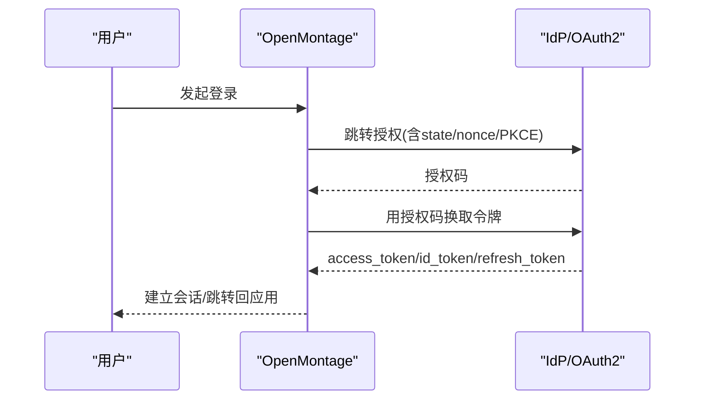
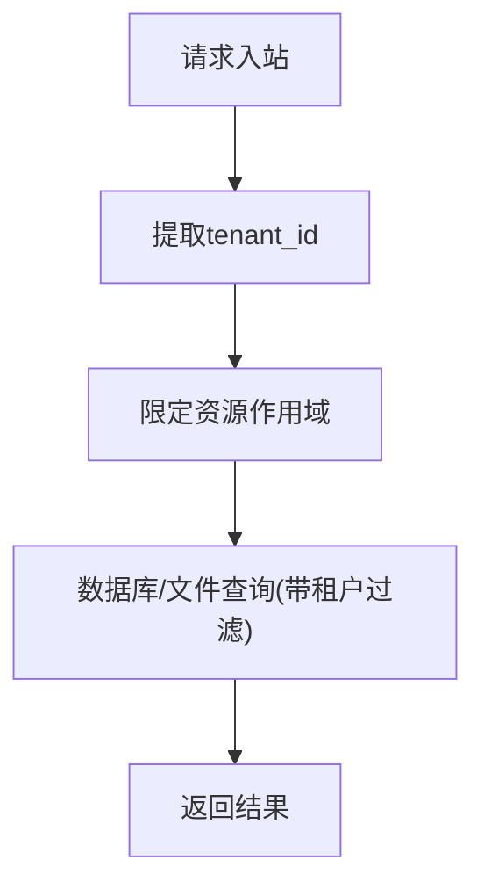
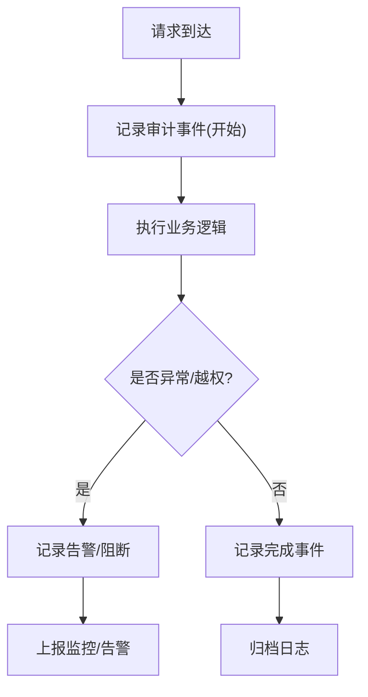
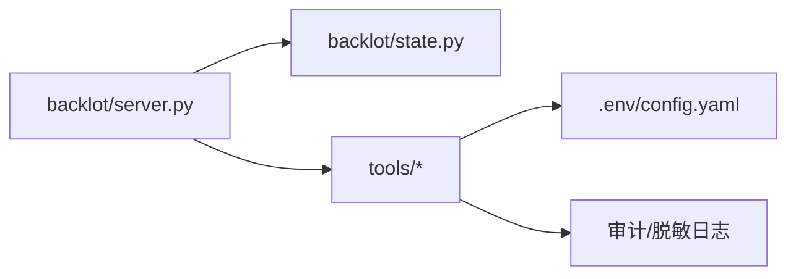

# 身份认证与授权

<cite>
**本文引用的文件**
- [README.md](file://README.md)
- [config.yaml](file://config.yaml)
- [backlot/server.py](file://backlot/server.py)
- [backlot/state.py](file://backlot/state.py)
- [tests/backlot/test_server.py](file://tests/backlot/test_server.py)
- [tools/video/seedance_ark.py](file://tools/video/seedance_ark.py)
</cite>

## 目录
1. [简介](#简介)
2. [项目结构](#项目结构)
3. [核心组件](#核心组件)
4. [架构总览](#架构总览)
5. [详细组件分析](#详细组件分析)
6. [依赖关系分析](#依赖关系分析)
7. [性能与安全考量](#性能与安全考量)
8. [故障排查指南](#故障排查指南)
9. [结论](#结论)
10. [附录](#附录)

## 简介
本文件聚焦 OpenMontage 的身份认证与授权机制，结合仓库中现有的后端服务（Backlot）与工具调用链路，梳理当前实现的安全边界、会话与令牌处理现状，并给出可扩展的 RBAC、API 权限、资源访问控制、OAuth2/SSO、多租户隔离以及安全审计与异常检测的落地方案。OpenMontage 的核心是“以 Agent 编排的生产管线”，其本地服务 Backlot 主要用于项目管理与可视化看板；认证与授权能力可在该服务之上扩展，并在外部 API 网关或代理层统一治理。

## 项目结构
OpenMontage 采用“管线 + 技能 + 工具”的分层组织：
- tools：生产工具集（视频、音频、图像、增强、分析等）
- pipeline_defs：流水线清单（YAML）
- skills：阶段指导与知识（Markdown）
- backlot：本地 Web 服务与状态管理（FastAPI 风格）
- lib：配置加载、检查点、管道装载等基础设施
- tests：契约测试与集成测试

图表来源
- [backlot/server.py:1-200](file://backlot/server.py#L1-L200)
- [backlot/state.py:1-200](file://backlot/state.py#L1-L200)
- [tools/video/seedance_ark.py:1438-1473](file://tools/video/seedance_ark.py#L1438-L1473)

章节来源
- [README.md:450-475](file://README.md#L450-L475)
- [config.yaml:1-34](file://config.yaml#L1-L34)

## 核心组件
- Backlot 服务：提供健康检查、项目浏览、媒体与缩略图服务、Range 请求等接口，用于本地开发调试与演示。
- 状态模块：维护项目根目录、检查点、制品路径等，所有读写基于受控的文件系统路径。
- 工具调用层：封装各供应商 SDK/HTTP 客户端，负责鉴权头注入、限流、缓存与日志脱敏。
- 配置中心：集中式 YAML 配置，定义 LLM、预算、输出格式、路径等。

章节来源
- [backlot/server.py:1-200](file://backlot/server.py#L1-L200)
- [backlot/state.py:1-200](file://backlot/state.py#L1-L200)
- [config.yaml:1-34](file://config.yaml#L1-L34)

## 架构总览
下图展示了从客户端到工具调用的典型请求路径，以及当前未内置认证时的默认开放策略与可插入的安全点。

图表来源
- [backlot/server.py:1-200](file://backlot/server.py#L1-L200)
- [tests/backlot/test_server.py:88-92](file://tests/backlot/test_server.py#L88-L92)
- [tools/video/seedance_ark.py:1438-1473](file://tools/video/seedance_ark.py#L1438-L1473)

## 详细组件分析

### 1) 身份认证流程（建议与现状）
- 现状：Backlot 的健康检查接口已暴露，便于探针探测；其他接口在测试中按无鉴权模式运行。
- 建议流程：
  - 登录：前端将用户名/密码或第三方凭证发送至后端，后端校验后签发 JWT（含用户ID、角色、租户ID、过期时间）。
  - 鉴权：后续请求携带 Authorization: Bearer <JWT>，服务端中间件校验签名、有效期与声明。
  - 会话：可选使用短期会话 Cookie 配合刷新令牌，减少频繁重登。
  - 注销：使旧令牌失效或进入黑名单（Redis/内存），强制前端清除本地令牌。

图表来源
- [backlot/server.py:1-200](file://backlot/server.py#L1-L200)
- [tests/backlot/test_server.py:88-92](file://tests/backlot/test_server.py#L88-L92)

章节来源
- [tests/backlot/test_server.py:88-92](file://tests/backlot/test_server.py#L88-L92)

### 2) JWT 令牌管理
- 载荷设计：user_id、role(s)、tenant_id、scope、exp、iat、jti（唯一标识）。
- 生命周期：短 TTL（如 15 分钟）+ 刷新令牌（长 TTL，可轮换）。
- 存储：服务端不持久化访问令牌，仅对刷新令牌做黑名单/撤销表。
- 传输：仅 HTTPS，禁止日志泄露；对敏感头进行脱敏。

图表来源
- [backlot/server.py:1-200](file://backlot/server.py#L1-L200)

### 3) 会话管理机制
- 服务端会话：可选 Redis 会话存储，绑定设备指纹/IP 白名单。
- 客户端会话：HttpOnly Cookie + CSRF 保护；或使用无状态 JWT。
- 并发与会话清理：空闲超时回收、主动登出清理、跨设备登出策略。

章节来源
- [backlot/server.py:1-200](file://backlot/server.py#L1-L200)

### 4) 基于角色的访问控制（RBAC）
- 角色模型：admin、operator、viewer、pipeline_runner 等。
- 权限粒度：接口级（读/写/执行）、资源级（项目/流水线/资产）、操作级（创建/审批/发布）。
- 决策点：路由中间件 + 控制器方法级注解 + 资源级校验（对象归属/租户隔离）。

图表来源
- [backlot/server.py:1-200](file://backlot/server.py#L1-L200)

### 5) API 权限管理与资源访问控制
- 接口级：按路由分组设置最小权限集合（如 /api/projects 仅 operator+）。
- 资源级：校验资源归属（project_id 是否属于当前用户/租户），防止越权。
- 操作级：对高风险操作（删除、发布、共享）要求更高角色或二次确认。

图表来源
- [backlot/server.py:1-200](file://backlot/server.py#L1-L200)

### 6) OAuth2 集成方案
- 授权码模式：适用于 Web/移动端，后端交换 access_token/refresh_token。
- 客户端凭证模式：机器对机器调用（如内部微服务）。
- 单点登录：对接企业 IdP（Keycloak、Azure AD、Okta），使用 OIDC 发现文档。
- 安全要点：state 防 CSRF、nonce 防重放、PKCE 提升安全性、最小 scope 原则。

图表来源
- [backlot/server.py:1-200](file://backlot/server.py#L1-L200)

### 7) 单点登录（SSO）配置
- 启用 OIDC 发现，配置 issuer、client_id、client_secret、redirect_uri。
- 映射外部角色到内部 RBAC 角色（通过 claims 映射）。
- 支持多 IdP 切换与租户级 IdP 绑定。

章节来源
- [backlot/server.py:1-200](file://backlot/server.py#L1-L200)

### 8) 多租户权限隔离
- 租户标识：JWT 中 tenant_id，请求上下文注入。
- 数据隔离：查询条件强制附加 tenant_id；文件系统按租户目录隔离。
- 资源共享：跨租户共享需显式授权与审计。

图表来源
- [backlot/state.py:1-200](file://backlot/state.py#L1-L200)

### 9) 安全审计日志、操作追踪与异常检测
- 审计日志：登录成功/失败、令牌签发/刷新/撤销、关键操作（创建/删除/发布）记录主体、资源、IP、UA、时间戳。
- 操作追踪：为每个请求分配 trace_id，贯穿中间件、服务、工具调用。
- 异常检测：阈值告警（错误率、失败登录、越权尝试）、速率限制、WAF/网关防护。
- 日志脱敏：对外部请求/响应中的敏感信息（如 Authorization 头、URL 查询参数）进行脱敏。

图表来源
- [tools/video/seedance_ark.py:1438-1473](file://tools/video/seedance_ark.py#L1438-L1473)

章节来源
- [tools/video/seedance_ark.py:1438-1473](file://tools/video/seedance_ark.py#L1438-L1473)

## 依赖关系分析
- Backlot 服务依赖状态模块进行项目与检查点管理。
- 工具调用层依赖环境变量/配置文件注入密钥，并在日志中脱敏敏感信息。
- 测试覆盖健康检查与基础 API 行为，可作为接入鉴权后的回归基线。

图表来源
- [backlot/server.py:1-200](file://backlot/server.py#L1-L200)
- [backlot/state.py:1-200](file://backlot/state.py#L1-L200)
- [config.yaml:1-34](file://config.yaml#L1-L34)
- [tools/video/seedance_ark.py:1438-1473](file://tools/video/seedance_ark.py#L1438-L1473)

章节来源
- [tests/backlot/test_server.py:88-92](file://tests/backlot/test_server.py#L88-L92)
- [config.yaml:1-34](file://config.yaml#L1-L34)

## 性能与安全考量
- 性能
  - 令牌校验应轻量且可缓存（公钥/密钥元数据）。
  - 会话存储选择高性能 KV（Redis），避免阻塞主流程。
  - 批量操作引入队列与幂等键，避免重复计费与重试风暴。
- 安全
  - 全链路 HTTPS，禁用明文传输。
  - 最小权限原则与零信任网络。
  - 输入校验与输出编码，防御注入与 XSS。
  - 密钥管理：使用密钥管理服务（Vault/KMS），禁止硬编码。
  - 日志脱敏：对 Authorization、URL 查询参数等进行掩码处理。

## 故障排查指南
- 常见问题
  - 健康检查失败：检查端口占用、进程存活、依赖服务可用性。
  - 鉴权失败：核对 JWT 签名、过期时间、角色/租户声明。
  - 越权访问：确认资源归属校验是否生效、租户过滤是否强制。
  - 供应商调用失败：检查 API Key、限流、重试与退避策略。
- 定位步骤
  - 查看审计日志与 Trace ID，复现问题链路。
  - 开启调试日志（注意脱敏），定位具体失败点。
  - 使用测试用例作为基线对比（如健康检查）。

章节来源
- [tests/backlot/test_server.py:88-92](file://tests/backlot/test_server.py#L88-L92)
- [tools/video/seedance_ark.py:1438-1473](file://tools/video/seedance_ark.py#L1438-L1473)

## 结论
当前 OpenMontage 的 Backlot 服务提供了稳定的本地管理能力与健康检查能力，但尚未内置完整的认证与授权中间件。建议在 Backlot 服务层引入统一的鉴权中间件，结合 JWT、RBAC、资源级校验与审计日志，形成端到端的安全闭环。同时，在工具调用层保持对敏感信息的脱敏与最小权限访问，确保供应链安全。对于企业场景，可通过 OAuth2/OIDC 对接现有 IdP，实现 SSO 与多租户隔离。

## 附录
- 参考实践
  - 服务器动作与服务端鉴权最佳实践（Next.js 风格）：强调在每个服务端入口进行鉴权与授权校验，避免仅依赖前端或中间件。
  - 安全提示：不要在客户端暴露密钥，服务端生成一次性令牌，使用认证中间件保护令牌端点。

章节来源
- [README.md:450-475](file://README.md#L450-L475)
- [tools/video/seedance_ark.py:1438-1473](file://tools/video/seedance_ark.py#L1438-L1473)