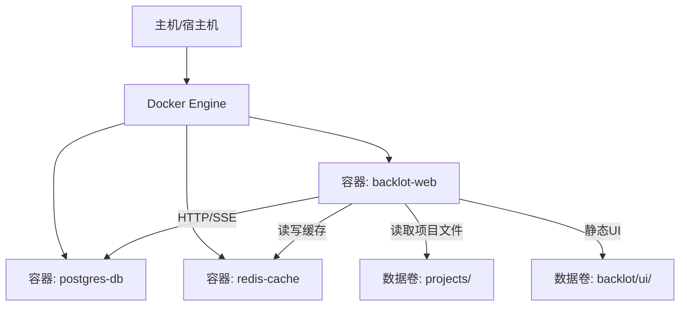
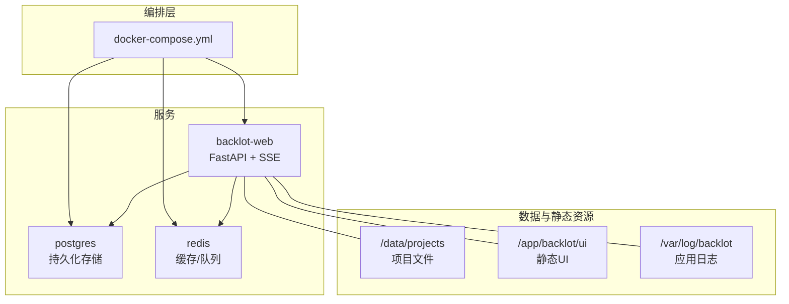
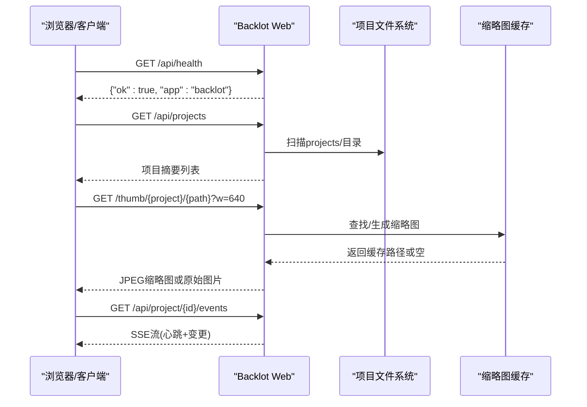
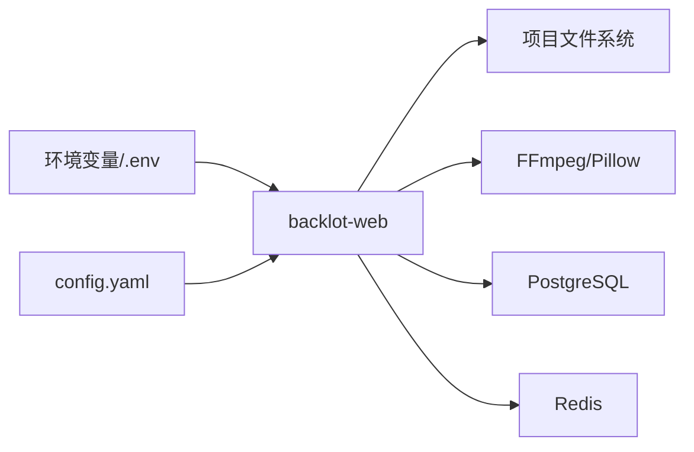

# Docker Compose编排

<cite>
**本文引用的文件**
- [backlot/server.py](file://backlot/server.py)
- [backlot/README.md](file://backlot/README.md)
- [Makefile](file://Makefile)
- [config.yaml](file://config.yaml)
- [.env.example](file://.env.example)
- [tests/backlot/test_ui_bug_bash.py](file://tests/backlot/test_ui_bug_bash.py)
</cite>

## 目录
1. [简介](#简介)
2. [项目结构](#项目结构)
3. [核心组件](#核心组件)
4. [架构总览](#架构总览)
5. [详细组件分析](#详细组件分析)
6. [依赖关系分析](#依赖关系分析)
7. [性能与可靠性](#性能与可靠性)
8. [故障排查指南](#故障排查指南)
9. [结论](#结论)
10. [附录：一键部署与常用运维命令](#附录：一键部署与常用运维命令)

## 简介
本文件为OpenMontage的Docker Compose编排文档，聚焦于Backlot Web服务、数据库、缓存等容器的编排方式，解释服务间通信、网络、数据卷挂载、环境变量注入、配置文件注入、日志收集与健康检查、重启策略、资源限制等关键概念。同时给出开发环境与生产环境的差异建议，并提供一键部署脚本与常用运维命令，帮助快速落地与稳定运行。

## 项目结构
OpenMontage包含一个本地看板服务Backlot（FastAPI），用于实时展示生产管线状态；以及通过Makefile提供的一键安装、演示与GPU加速能力。当前仓库未内置Docker或Compose文件，但可基于现有服务与配置快速构建容器化编排。

**图示来源**
- [backlot/server.py:165-307](file://backlot/server.py#L165-L307)
- [backlot/README.md:8-12](file://backlot/README.md#L8-L12)

**章节来源**
- [backlot/server.py:165-307](file://backlot/server.py#L165-L307)
- [backlot/README.md:8-12](file://backlot/README.md#L8-L12)
- [Makefile:54-76](file://Makefile#L54-L76)

## 核心组件
- Backlot Web服务：基于FastAPI的只读看板服务，提供健康检查、项目列表、项目状态、SSE事件流、缩略图与媒体访问、静态UI页面等接口。
- 数据库（可选）：PostgreSQL，用于持久化项目元数据、审计日志、成本快照等结构化信息。
- 缓存（可选）：Redis，用于SSE订阅队列、缩略图缓存、项目摘要缓存等高性能读写场景。
- 运行时依赖：FFmpeg（缩略图生成）、Pillow（图片处理）、watchfiles（文件系统监听）。

**章节来源**
- [backlot/server.py:165-307](file://backlot/server.py#L165-L307)
- [backlot/server.py:325-365](file://backlot/server.py#L325-L365)
- [backlot/README.md:14-33](file://backlot/README.md#L14-L33)

## 架构总览
下图展示了Backlot在Compose中的角色与外部依赖交互：Web服务暴露HTTP与SSE，连接数据库与缓存，并通过数据卷读取项目文件与提供静态UI。

**图示来源**
- [backlot/server.py:165-307](file://backlot/server.py#L165-L307)
- [backlot/server.py:325-365](file://backlot/server.py#L325-L365)

## 详细组件分析

### Backlot Web服务
- 启动入口：通过Python模块方式启动服务，支持指定端口。
- 健康检查：提供/api/health端点，返回应用标识与可用性。
- 项目与状态：提供项目列表、项目状态查询接口。
- 实时事件：通过SSE向浏览器推送项目变更与心跳，保持看板“活”的状态。
- 媒体与缩略图：提供媒体访问与缩略图生成（依赖FFmpeg/Pillow），并缓存到磁盘。
- 静态UI：挂载UI目录并提供无缓存策略，确保前端更新即时生效。

**图示来源**
- [backlot/server.py:170-240](file://backlot/server.py#L170-L240)
- [backlot/server.py:242-276](file://backlot/server.py#L242-L276)
- [backlot/server.py:325-365](file://backlot/server.py#L325-L365)

**章节来源**
- [backlot/server.py:165-307](file://backlot/server.py#L165-L307)
- [backlot/server.py:325-365](file://backlot/server.py#L325-L365)
- [backlot/README.md:8-12](file://backlot/README.md#L8-L12)

### 数据库与缓存（推荐）
- 数据库（PostgreSQL）：用于持久化项目元数据、审计日志、成本快照等结构化信息，便于检索与分析。
- 缓存（Redis）：用于SSE订阅队列、项目摘要缓存、缩略图缓存等高频读写场景，降低对磁盘与数据库的压力。
- 连接方式：通过环境变量注入连接字符串与凭据，服务启动时建立连接池。

**章节来源**
- [backlot/server.py:165-307](file://backlot/server.py#L165-L307)
- [config.yaml:1-34](file://config.yaml#L1-L34)

### 环境变量与配置注入
- 环境变量：
  - OPENMONTAGE_PROJECTS_DIR：指定项目根目录，供Backlot扫描与SSE监听。
  - 数据库与缓存连接串：如POSTGRES_URL、REDIS_URL等（由Compose注入）。
  - API密钥：通过.env文件注入，避免硬编码。
- 配置文件：
  - config.yaml：全局配置（LLM、预算、输出、路径等），可在容器中以只读卷挂载。
  - .env.example：示例环境文件，测试保证不包含假凭证。

**章节来源**
- [tests/backlot/test_ui_bug_bash.py:135-167](file://tests/backlot/test_ui_bug_bash.py#L135-L167)
- [config.yaml:1-34](file://config.yaml#L1-L34)
- [.env.example](file://.env.example)

### 网络设置
- 内部网络：将web、db、cache置于同一自定义网络，仅暴露必要端口到宿主机。
- 端口映射：
  - backlot-web: 8000 -> 宿主8000（或反向代理端口）
  - postgres: 5432（不直接暴露）
  - redis: 6379（不直接暴露）

### 数据卷挂载
- projects：挂载项目目录，供Backlot读取与SSE监听变更。
- ui：挂载静态UI目录，便于热更新与调试。
- log：挂载应用日志目录，集中收集。
- db/data：PostgreSQL数据持久化。
- cache/data：Redis数据持久化（可选）。

### 健康检查与就绪探针
- 健康检查：/api/health返回{"ok": true}，可作为liveness probe。
- 就绪探针：等待数据库/缓存连通、项目目录存在、FFmpeg可用后标记ready。

### 重启策略与资源限制
- 重启策略：restart: unless-stopped或on-failure，配合重试次数与退避。
- 资源限制：CPU与内存上限，防止单实例占用过多资源。
- 超时与并发：调整SSE心跳间隔、请求超时、线程/进程数。

## 依赖关系分析
Backlot服务依赖以下组件与环境：
- 文件系统：projects目录、ui静态资源、缩略图缓存目录。
- 外部工具：FFmpeg（视频帧提取）、Pillow（图像处理）。
- 可选服务：PostgreSQL（持久化）、Redis（缓存/队列）。
- 环境变量：OPENMONTAGE_PROJECTS_DIR、数据库/缓存连接串、API密钥。

**图示来源**
- [backlot/server.py:165-307](file://backlot/server.py#L165-L307)
- [backlot/server.py:325-365](file://backlot/server.py#L325-L365)
- [config.yaml:1-34](file://config.yaml#L1-L34)

**章节来源**
- [backlot/server.py:165-307](file://backlot/server.py#L165-L307)
- [backlot/server.py:325-365](file://backlot/server.py#L325-L365)
- [config.yaml:1-34](file://config.yaml#L1-L34)

## 性能与可靠性
- 性能优化
  - 使用Redis缓存项目摘要与缩略图，减少磁盘IO与重复计算。
  - 合理设置SSE心跳与批量合并变更，降低频繁通知开销。
  - 限制缩略图尺寸与并发，避免大文件渲染阻塞。
- 可靠性保障
  - 健康检查与就绪探针确保服务可用性。
  - 重启策略与资源限制防止雪崩与资源耗尽。
  - 日志集中收集与轮转，便于问题定位与审计。

## 故障排查指南
- 常见问题
  - 项目目录不存在或权限不足：检查OPENMONTAGE_PROJECTS_DIR与卷挂载。
  - FFmpeg不可用：确认容器内已安装FFmpeg且可执行。
  - SSE无响应：检查网络、防火墙与Nginx缓冲配置。
  - 缩略图生成失败：检查Pillow与FFmpeg版本兼容性。
- 诊断步骤
  - 查看健康检查：curl http://localhost:8000/api/health
  - 查看项目列表：curl http://localhost:8000/api/projects
  - 查看SSE事件：浏览器开发者工具或curl --no-buffer
  - 检查日志：容器日志与挂载日志目录

**章节来源**
- [backlot/server.py:170-240](file://backlot/server.py#L170-L240)
- [backlot/server.py:242-276](file://backlot/server.py#L242-L276)
- [backlot/server.py:325-365](file://backlot/server.py#L325-L365)

## 结论
通过Docker Compose编排OpenMontage的Backlot服务，结合数据库与缓存，可实现高可用、可扩展的生产级看板系统。借助健康检查、重启策略、资源限制与日志收集，能够保障服务的稳定性与可维护性。建议在开发环境简化依赖，在生产环境引入数据库与缓存以提升性能与可靠性。

## 附录：一键部署与常用运维命令

### 一键部署脚本（示例）
以下为推荐的docker-compose.yml要点与脚本思路（非代码片段，仅提供结构与说明）：
- 服务定义
  - backlot-web：镜像基于Python/FastAPI，挂载projects与ui目录，暴露8000端口，设置健康检查与重启策略。
  - postgres-db：镜像PostgreSQL，挂载数据卷，设置密码与数据库名。
  - redis-cache：镜像Redis，挂载数据卷（可选）。
- 环境变量
  - 通过.env文件注入数据库与缓存连接串、项目目录、API密钥等。
- 网络
  - 自定义网络backlot-net，服务间互通，仅暴露Web端口。
- 数据卷
  - projects、ui、log、db/data、cache/data。

常用命令
- 启动：docker compose up -d
- 停止：docker compose down
- 查看日志：docker compose logs -f backlot-web
- 健康检查：curl http://localhost:8000/api/health
- 进入容器：docker compose exec backlot-web bash
- 重建镜像：docker compose build --no-cache
- 升级依赖：docker compose pull && docker compose up -d

**章节来源**
- [backlot/server.py:165-307](file://backlot/server.py#L165-L307)
- [backlot/README.md:8-12](file://backlot/README.md#L8-L12)
- [Makefile:54-76](file://Makefile#L54-L76)