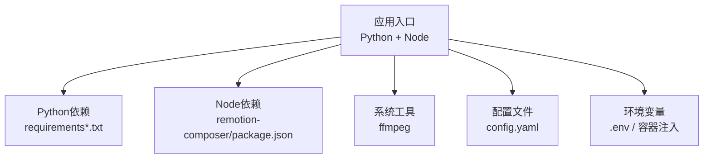
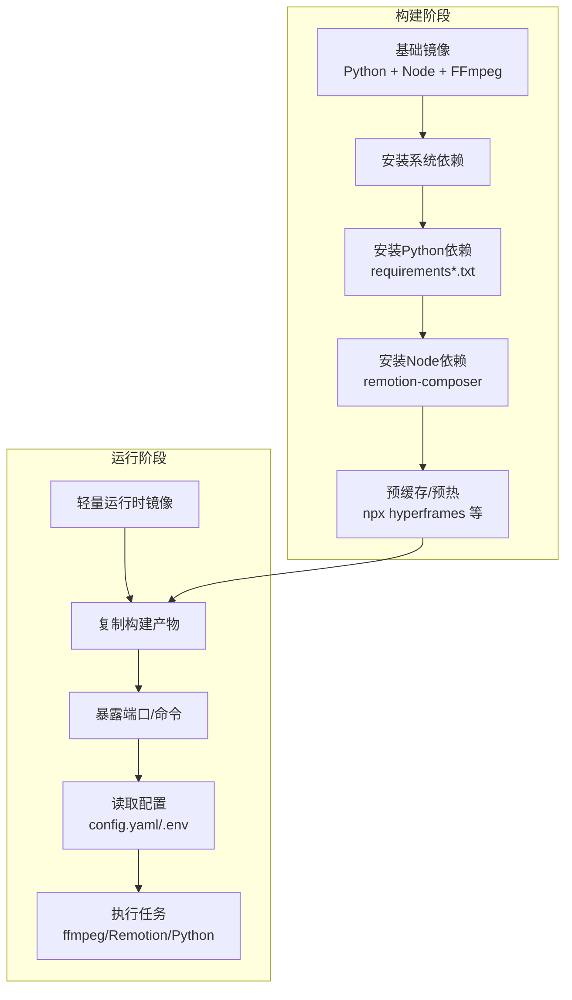
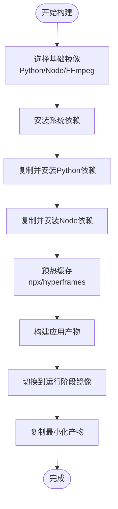
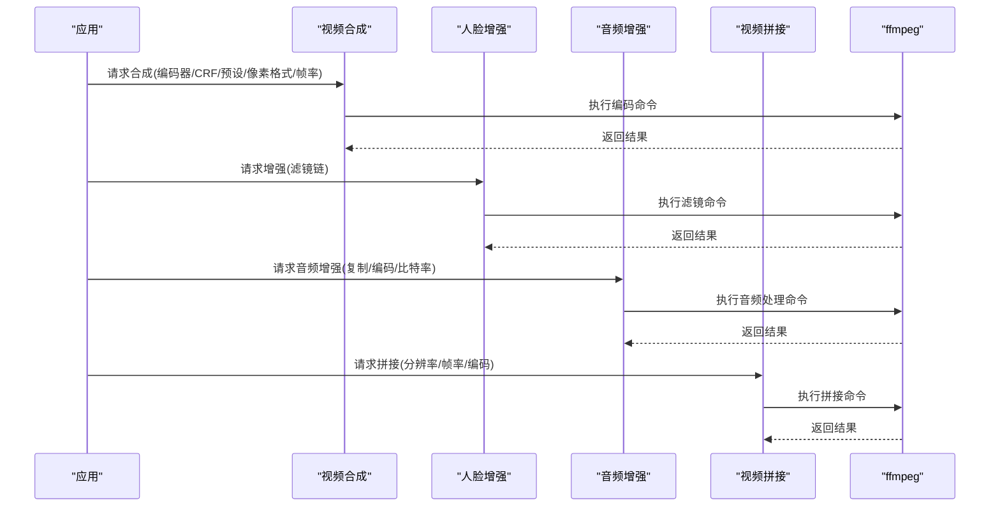
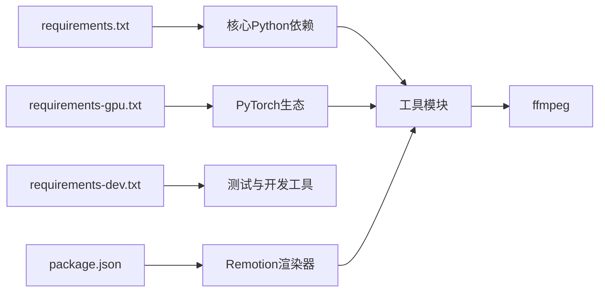

# Docker镜像构建

<cite>
**本文引用的文件**
- [Makefile](file://Makefile)
- [requirements.txt](file://requirements.txt)
- [requirements-gpu.txt](file://requirements-gpu.txt)
- [requirements-dev.txt](file://requirements-dev.txt)
- [config.yaml](file://config.yaml)
- [remotion-composer/package.json](file://remotion-composer/package.json)
- [tools/video/video_compose.py](file://tools/video/video_compose.py)
- [tools/enhancement/face_enhance.py](file://tools/enhancement/face_enhance.py)
- [tools/audio/audio_enhance.py](file://tools/audio/audio_enhance.py)
- [tools/video/video_stitch.py](file://tools/video/video_stitch.py)
- [tests/contracts/test_env_example.py](file://tests/contracts/test_env_example.py)
</cite>

## 目录
1. [简介](#简介)
2. [项目结构](#项目结构)
3. [核心组件](#核心组件)
4. [架构总览](#架构总览)
5. [详细组件分析](#详细组件分析)
6. [依赖关系分析](#依赖关系分析)
7. [性能与缓存优化](#性能与缓存优化)
8. [故障排查指南](#故障排查指南)
9. [结论](#结论)
10. [附录：Dockerfile最佳实践清单](#附录dockerfile最佳实践清单)

## 简介
本文件面向OpenMontage的Docker镜像构建，围绕多阶段构建策略、基础镜像选择、依赖安装优化、缓存层设计、Python环境配置、Node.js依赖处理、FFmpeg集成、GPU支持（NVIDIA Container Toolkit）、构建参数与环境变量管理、镜像大小与安全扫描、多架构支持等主题提供系统化指导。文档中的实现细节均基于仓库中现有的依赖声明、构建脚本与工具调用路径，确保可落地与可验证。

## 项目结构
OpenMontage的运行时依赖由Python与Node.js两部分组成：
- Python侧：核心库与工具通过requirements系列文件声明；GPU相关依赖单独列出；开发测试依赖独立维护。
- Node.js侧：Remotion渲染器位于remotion-composer子目录，使用npm包管理与脚本。
- FFmpeg：视频编解码、滤镜、转码等能力在多处工具中以命令行方式调用ffmpeg。
- 配置：全局配置集中于config.yaml，包含输出格式、编码、分辨率、帧率等默认值。
- 环境变量：通过python-dotenv加载.env，测试用例保证示例模板不含注释型凭据。

**章节来源**
- [requirements.txt:1-17](file://requirements.txt#L1-L17)
- [requirements-gpu.txt:1-6](file://requirements-gpu.txt#L1-L6)
- [requirements-dev.txt:1-6](file://requirements-dev.txt#L1-L6)
- [remotion-composer/package.json:1-36](file://remotion-composer/package.json#L1-L36)
- [config.yaml:1-34](file://config.yaml#L1-L34)
- [tests/contracts/test_env_example.py:1-19](file://tests/contracts/test_env_example.py#L1-L19)

## 核心组件
- Python运行环境与依赖
  - 基础依赖：pyyaml、pydantic、jsonschema、python-dotenv、Pillow、numpy、requests、google-auth、google-genai、openai等。
  - GPU依赖：torch、torchaudio、torchvision（需与CUDA驱动匹配）。
  - 开发依赖：pytest、pytest-asyncio、httpx等。
- Node.js与Remotion
  - Remotion CLI用于渲染动画与合成，依赖集中在remotion-composer/package.json。
- FFmpeg集成
  - 多处工具以命令行调用ffmpeg进行音视频处理（编码、滤镜、转码、拼接等），需要系统级安装并可用。
- 配置与环境
  - config.yaml定义输出默认值（格式、编码器、分辨率、帧率、CRF等）。
  - .env通过python-dotenv加载，测试保障示例模板不包含注释型凭据。

**章节来源**
- [requirements.txt:1-17](file://requirements.txt#L1-L17)
- [requirements-gpu.txt:1-6](file://requirements-gpu.txt#L1-L6)
- [requirements-dev.txt:1-6](file://requirements-dev.txt#L1-L6)
- [remotion-composer/package.json:1-36](file://remotion-composer/package.json#L1-L36)
- [tools/video/video_compose.py:582-631](file://tools/video/video_compose.py#L582-L631)
- [tools/enhancement/face_enhance.py:118-158](file://tools/enhancement/face_enhance.py#L118-L158)
- [tools/audio/audio_enhance.py:151-186](file://tools/audio/audio_enhance.py#L151-L186)
- [config.yaml:1-34](file://config.yaml#L1-L34)
- [tests/contracts/test_env_example.py:1-19](file://tests/contracts/test_env_example.py#L1-L19)

## 架构总览
下图展示Docker多阶段构建的总体流程：构建阶段负责安装Python与Node依赖、预编译缓存与FFmpeg；运行阶段仅拷贝产物与最小化运行时依赖，并通过环境变量与挂载卷完成配置与数据交换。

[该图为概念性架构图，不直接映射具体源码文件]

## 详细组件分析

### 多阶段构建策略与分层设计
- 基础镜像选择
  - Python阶段：建议使用官方python:3.10-slim或带特定CUDA版本的镜像（如nvidia/cudagl）以适配GPU需求。
  - Node阶段：使用node:lts-slim作为Remotion构建基础，减少体积。
  - FFmpeg：优先使用系统包管理器安装，避免重复打包二进制。
- 分层与缓存
  - 将系统依赖、Python依赖、Node依赖分步安装，利用Docker缓存加速增量构建。
  - 先复制依赖清单再复制源码，确保依赖变更时触发相应层重建。
- 产物裁剪
  - 构建阶段保留完整依赖与缓存；运行阶段仅拷贝必要文件，移除构建工具与临时文件。

[该图为概念性流程图，不直接映射具体源码文件]

### Python环境配置与依赖安装优化
- 依赖分组
  - 生产依赖：requirements.txt
  - GPU依赖：requirements-gpu.txt（仅在GPU环境下安装）
  - 开发依赖：requirements-dev.txt（构建/测试阶段使用）
- 安装顺序与缓存
  - 先安装requirements.txt，再按需安装requirements-gpu.txt或requirements-dev.txt，充分利用层缓存。
- 虚拟环境与隔离
  - Makefile已提供venv创建与激活逻辑，可在Docker中复用相同策略，确保环境一致。

**章节来源**
- [requirements.txt:1-17](file://requirements.txt#L1-L17)
- [requirements-gpu.txt:1-6](file://requirements-gpu.txt#L1-L6)
- [requirements-dev.txt:1-6](file://requirements-dev.txt#L1-L6)
- [Makefile:13-48](file://Makefile#L13-L48)

### Node.js依赖处理与Remotion渲染
- 依赖管理
  - remotion-composer/package.json集中声明Remotion及相关依赖，构建时使用npm install。
- 构建与渲染
  - 通过npx remotion render执行渲染，建议在构建阶段预装依赖并缓存node_modules。
- 预热策略
  - 参考Makefile中对hyperframes的npx缓存预热思路，可在构建阶段执行一次渲染或doctor命令以降低冷启动延迟。

**章节来源**
- [remotion-composer/package.json:1-36](file://remotion-composer/package.json#L1-L36)
- [Makefile:54-76](file://Makefile#L54-L76)

### FFmpeg集成与视频处理链路
- 调用方式
  - 视频合成、增强、音频处理、拼接等模块均以命令行方式调用ffmpeg，涉及编码器、滤镜链、音频重采样等参数。
- 关键路径
  - 视频合成：设置编码器、CRF、预设、像素格式、帧率等。
  - 人脸增强：构建滤镜链并调用ffmpeg进行视频处理。
  - 音频增强：根据输入类型决定是否复制视频流，设置音频编码与比特率。
  - 视频拼接：根据媒体配置或目标分辨率计算输出参数。
- 建议
  - 在镜像中预编译或安装系统级ffmpeg，确保所有工具链可用。
  - 对常用滤镜与编码器进行预检，失败时给出明确错误信息。

**图表来源**
- [tools/video/video_compose.py:582-631](file://tools/video/video_compose.py#L582-L631)
- [tools/enhancement/face_enhance.py:118-158](file://tools/enhancement/face_enhance.py#L118-L158)
- [tools/audio/audio_enhance.py:151-186](file://tools/audio/audio_enhance.py#L151-L186)
- [tools/video/video_stitch.py:410-439](file://tools/video/video_stitch.py#L410-L439)

**章节来源**
- [tools/video/video_compose.py:582-631](file://tools/video/video_compose.py#L582-L631)
- [tools/enhancement/face_enhance.py:118-158](file://tools/enhancement/face_enhance.py#L118-L158)
- [tools/audio/audio_enhance.py:151-186](file://tools/audio/audio_enhance.py#L151-L186)
- [tools/video/video_stitch.py:410-439](file://tools/video/video_stitch.py#L410-L439)

### 配置与环境变量管理
- 全局配置
  - config.yaml定义输出默认格式、编码器、分辨率、帧率、CRF等，便于统一控制渲染质量与兼容性。
- 环境变量
  - 通过python-dotenv加载.env，测试用例确保示例模板不包含注释型凭据，避免误用。
- 容器注入
  - 在运行阶段通过环境变量注入API密钥、模型端点、路径等敏感或动态配置。

**章节来源**
- [config.yaml:1-34](file://config.yaml#L1-L34)
- [tests/contracts/test_env_example.py:1-19](file://tests/contracts/test_env_example.py#L1-L19)

### GPU支持与NVIDIA Container Toolkit集成
- 依赖说明
  - requirements-gpu.txt声明torch、torchaudio、torchvision，需在具备CUDA环境的镜像中安装。
- 驱动与版本匹配
  - 若出现NVML状态不一致或OOM异常，需确保内核模块与用户态库版本匹配，必要时重启或调整精度/分辨率。
- 容器集成
  - 使用nvidia/cuda基础镜像或nvidia-container-toolkit在宿主机启用GPU直通。
  - 在Docker Compose或编排平台中声明device: nvidia，并传递必要的CUDA环境变量。

**章节来源**
- [requirements-gpu.txt:1-6](file://requirements-gpu.txt#L1-L6)
- [tools/video/_wan_engine.py:910-929](file://tools/video/_wan_engine.py#L910-L929)

## 依赖关系分析
- Python依赖层级
  - 基础依赖（requirements.txt）→ GPU依赖（requirements-gpu.txt，可选）→ 开发依赖（requirements-dev.txt，构建/测试阶段）
- Node依赖层级
  - remotion-composer/package.json → npm install → node_modules缓存
- 外部工具依赖
  - ffmpeg：系统级安装，被多个工具模块调用
  - HyperFrames：通过npx缓存预热，降低首次渲染延迟

**图表来源**
- [requirements.txt:1-17](file://requirements.txt#L1-L17)
- [requirements-gpu.txt:1-6](file://requirements-gpu.txt#L1-L6)
- [requirements-dev.txt:1-6](file://requirements-dev.txt#L1-L6)
- [remotion-composer/package.json:1-36](file://remotion-composer/package.json#L1-L36)

**章节来源**
- [requirements.txt:1-17](file://requirements.txt#L1-L17)
- [requirements-gpu.txt:1-6](file://requirements-gpu.txt#L1-L6)
- [requirements-dev.txt:1-6](file://requirements-dev.txt#L1-L6)
- [remotion-composer/package.json:1-36](file://remotion-composer/package.json#L1-L36)

## 性能与缓存优化
- 构建缓存
  - 分层安装依赖：系统依赖→Python依赖→Node依赖→源码，最大化利用Docker层缓存。
  - 预缓存npx/hyperframes，减少首次渲染冷启动时间。
- 镜像体积优化
  - 使用slim基础镜像；移除构建工具与临时文件；仅复制运行所需文件。
  - 合并RUN指令，减少层数。
- 安全扫描
  - 在CI中集成镜像漏洞扫描（如Trivy），阻断高危镜像发布。
- 多架构支持
  - 使用buildx构建多架构镜像（amd64/arm64），注意CUDA与Node二进制兼容性问题。
- 资源限制
  - 为GPU工作负载设置显存上限与超时，避免OOM导致整体失败。

[本节为通用优化建议，不直接分析具体文件]

## 故障排查指南
- FFmpeg不可用或参数错误
  - 检查系统是否安装ffmpeg及版本；确认编码器与滤镜链是否受支持。
  - 参考视频合成、增强、拼接等模块的命令构造逻辑定位问题。
- GPU相关错误
  - NVML状态不一致或OOM：核对驱动版本，调整精度/分辨率；必要时重启以加载匹配内核模块。
- 环境变量与配置
  - 确保.env正确加载且不含注释型凭据；config.yaml中的输出参数与实际渲染需求一致。
- 构建失败
  - 检查依赖版本冲突；确认Node与Python版本匹配；清理缓存后重试。

**章节来源**
- [tools/video/video_compose.py:582-631](file://tools/video/video_compose.py#L582-L631)
- [tools/enhancement/face_enhance.py:118-158](file://tools/enhancement/face_enhance.py#L118-L158)
- [tools/audio/audio_enhance.py:151-186](file://tools/audio/audio_enhance.py#L151-L186)
- [tools/video/video_stitch.py:410-439](file://tools/video/video_stitch.py#L410-L439)
- [tools/video/_wan_engine.py:910-929](file://tools/video/_wan_engine.py#L910-L929)
- [tests/contracts/test_env_example.py:1-19](file://tests/contracts/test_env_example.py#L1-L19)

## 结论
OpenMontage的Docker镜像构建应围绕“多阶段、分层缓存、最小运行时”的原则展开：构建阶段安装并缓存Python与Node依赖，预热渲染工具；运行阶段仅保留必要产物与系统工具。通过严格的依赖管理、配置与环境变量治理，以及FFmpeg与GPU的正确集成，可实现稳定、高效、安全的视频生成流水线。结合安全扫描与多架构构建，可进一步提升交付质量与部署灵活性。

[本节为总结性内容，不直接分析具体文件]

## 附录：Dockerfile最佳实践清单
- 基础镜像
  - 生产：python:3.10-slim 或 nvidia/cuda:xx.x.x-runtime（GPU场景）
  - Node：node:lts-slim（仅构建阶段）
- 分层与缓存
  - 先复制依赖清单，再复制源码；合并RUN指令；删除不必要的中间文件
- 依赖安装
  - 按requirements.txt→requirements-gpu.txt→requirements-dev.txt顺序安装
  - Node依赖在独立阶段安装并缓存node_modules
- 工具集成
  - 预装ffmpeg；预热npx/hyperframes；校验工具可用性
- 配置与环境
  - 使用config.yaml统一管理输出参数；通过.env与容器环境变量注入敏感配置
- 安全与合规
  - 非root用户运行；定期扫描镜像漏洞；最小权限原则
- 多架构与发布
  - 使用buildx构建多架构镜像；标签化管理版本；发布前执行端到端测试

[本节为通用最佳实践清单，不直接分析具体文件]