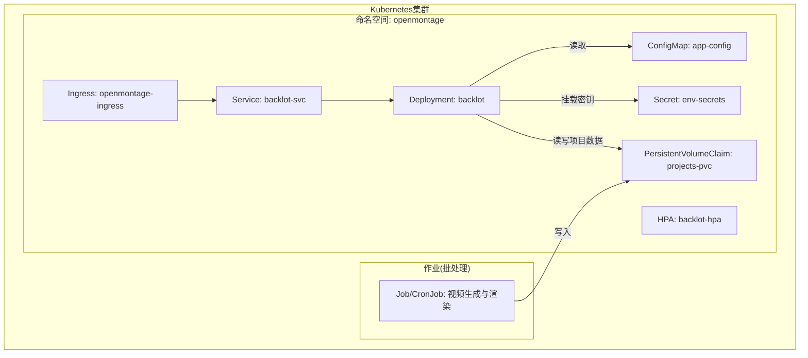
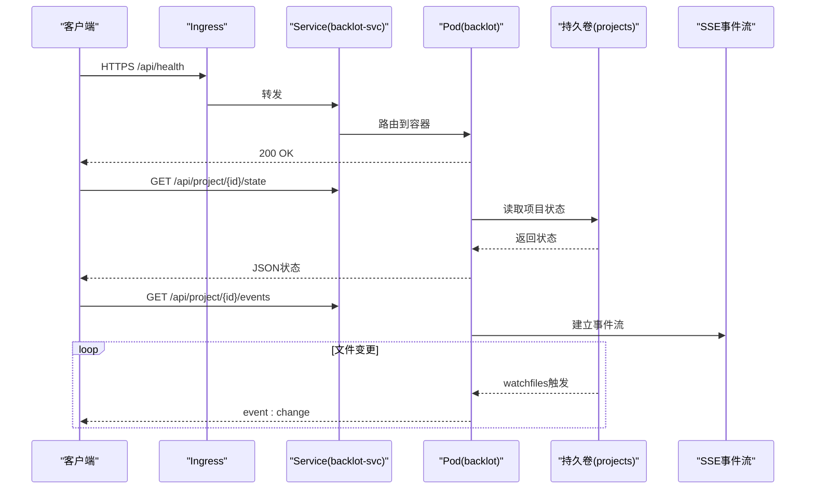
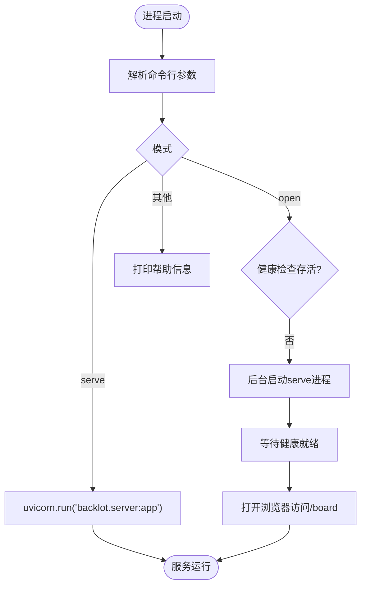
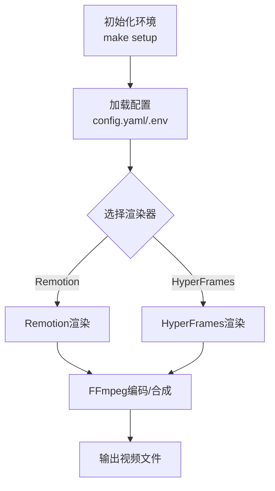
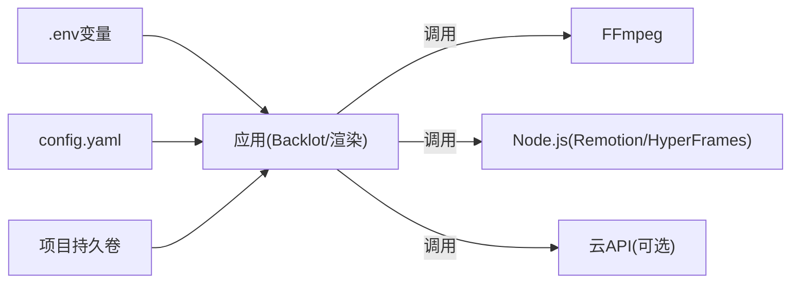

# Kubernetes部署

<cite>
**本文引用的文件**
- [README.md](file://README.md)
- [config.yaml](file://config.yaml)
- [.env.example](file://.env.example)
- [Makefile](file://Makefile)
- [setup.py](file://setup.py)
- [PROJECT_CONTEXT.md](file://PROJECT_CONTEXT.md)
- [backlot/__main__.py](file://backlot/__main__.py)
- [backlot/server.py](file://backlot/server.py)
</cite>

## 目录
1. [简介](#简介)
2. [项目结构](#项目结构)
3. [核心组件](#核心组件)
4. [架构总览](#架构总览)
5. [详细组件分析](#详细组件分析)
6. [依赖分析](#依赖分析)
7. [性能考虑](#性能考虑)
8. [故障排查指南](#故障排查指南)
9. [结论](#结论)
10. [附录](#附录)

## 简介
本文件面向在Kubernetes上部署OpenMontage的工程与运维团队，目标是提供一套可落地的部署清单与最佳实践。内容覆盖：
- Deployment、Service、ConfigMap、Secret等核心资源定义建议
- Pod调度策略、资源请求/限制、滚动更新配置
- Ingress、TLS证书管理、负载均衡设置
- 监控与日志（Prometheus指标导出、ELK日志聚合）
- HPA自动扩缩容与故障转移策略
- Helm Chart模板与值文件管理、版本控制

OpenMontage是一个AI编排的视频生产平台，包含Python工具链、Remotion/HyperFrames渲染、以及一个用于可视化生产进度的Backlot服务。其运行依赖包括Python环境、Node.js（Remotion/HyperFrames）、FFmpeg、以及可选的GPU与各类云API密钥。

**章节来源**
- [README.md:180-278](file://README.md#L180-L278)
- [PROJECT_CONTEXT.md:9-19](file://PROJECT_CONTEXT.md#L9-L19)

## 项目结构
从Kubernetes视角看，OpenMontage主要包含两类工作负载：
- 视频生产与渲染任务（批处理/长时任务）：由Python脚本驱动，调用工具链与渲染器（Remotion/HyperFrames/FFmpeg），可能涉及GPU加速
- Backlot服务（Web UI + API）：基于FastAPI的轻量HTTP服务，提供项目状态查询、SSE事件流、媒体与缩略图访问

**图示来源**
- [backlot/server.py:165-307](file://backlot/server.py#L165-L307)
- [backlot/__main__.py:82-86](file://backlot/__main__.py#L82-L86)

**章节来源**
- [PROJECT_CONTEXT.md:59-87](file://PROJECT_CONTEXT.md#L59-L87)
- [README.md:450-475](file://README.md#L450-L475)

## 核心组件
- Backlot服务
  - 入口：通过命令行子命令启动，支持后台守护与端口配置
  - Web接口：FastAPI应用，提供健康检查、项目列表、项目状态、SSE事件流、媒体与缩略图服务
  - 静态UI：内嵌HTML/CSS/JS，按版本化资源加载
- 视频生产与渲染
  - Python工具链与配置：全局配置、环境变量、路径与输出参数
  - 渲染器：Remotion（React/Node.js）与HyperFrames（HTML/GSAP/Node.js），底层使用FFmpeg进行编码与合成
  - GPU与本地模型：可选启用本地视频生成模型（需GPU与相应依赖）

**章节来源**
- [backlot/__main__.py:1-110](file://backlot/__main__.py#L1-L110)
- [backlot/server.py:1-369](file://backlot/server.py#L1-L369)
- [config.yaml:1-34](file://config.yaml#L1-L34)
- [.env.example:1-135](file://.env.example#L1-L135)
- [Makefile:54-76](file://Makefile#L54-L76)
- [README.md:607-617](file://README.md#L607-L617)

## 架构总览
下图展示Kubernetes中OpenMontage的核心组件交互关系：Ingress暴露Backlot服务；Service将流量转发到Pod；Pod挂载ConfigMap与Secret；持久卷保存项目数据；HPA根据CPU/内存或自定义指标自动扩缩容；批处理作业写入同一持久卷供Backlot消费。

**图示来源**
- [backlot/server.py:170-240](file://backlot/server.py#L170-L240)
- [backlot/server.py:242-276](file://backlot/server.py#L242-L276)

**章节来源**
- [backlot/server.py:165-307](file://backlot/server.py#L165-L307)

## 详细组件分析

### Backlot服务（FastAPI）
- 启动方式
  - 通过`python -m backlot serve --port <端口>`前台运行
  - 通过`python -m backlot open [project-id]`自动拉起后台服务并打开浏览器
- 关键API
  - 健康检查：GET /api/health
  - 项目列表：GET /api/projects
  - 项目状态：GET /api/project/{project_id}/state
  - SSE事件流：GET /api/project/{project_id}/events、GET /api/library/events
  - 媒体与缩略图：GET /media/{project_id}/{file_path}、GET /thumb/{project_id}/{file_path}
- 特性
  - 使用watchfiles监听项目目录变更，通过SSE推送变化
  - 缩略图缓存与视频首帧提取（依赖FFmpeg）
  - 静态UI资源版本化与no-cache策略

**图示来源**
- [backlot/__main__.py:82-105](file://backlot/__main__.py#L82-L105)
- [backlot/__main__.py:55-79](file://backlot/__main__.py#L55-L79)

**章节来源**
- [backlot/__main__.py:1-110](file://backlot/__main__.py#L1-L110)
- [backlot/server.py:165-307](file://backlot/server.py#L165-L307)

### 视频生产与渲染（批处理/长时任务）
- 执行入口
  - 通过Makefile提供的目标安装依赖、初始化环境、准备渲染运行时（Remotion/HyperFrames）
  - 可通过render_demo.py快速渲染示例视频
- 配置与环境
  - 全局配置：config.yaml（LLM、预算、检查点、输出格式、路径）
  - 环境变量：.env.example（各云API密钥、本地模型开关、ComfyUI地址等）
- 渲染流程
  - 选择渲染器（Remotion或HyperFrames），最终通过FFmpeg完成编码与合成
  - 支持GPU本地模型（需额外依赖与显存）

**图示来源**
- [Makefile:54-76](file://Makefile#L54-L76)
- [config.yaml:1-34](file://config.yaml#L1-L34)
- [.env.example:85-106](file://.env.example#L85-L106)
- [README.md:607-617](file://README.md#L607-L617)

**章节来源**
- [Makefile:54-76](file://Makefile#L54-L76)
- [config.yaml:1-34](file://config.yaml#L1-L34)
- [.env.example:1-135](file://.env.example#L1-L135)
- [README.md:607-617](file://README.md#L607-L617)

## 依赖分析
- 运行时依赖
  - Python >= 3.10（setup.py声明）
  - Node.js（Remotion/HyperFrames）
  - FFmpeg（视频编码与缩略图提取）
  - 可选GPU与本地模型依赖（diffusers/transformers/accelerate）
- 外部集成
  - 多种云API密钥（图像/视频/TTS/音乐等），通过环境变量注入
  - 可选ComfyUI服务器地址
- 内部模块耦合
  - Backlot服务与项目文件系统强耦合（通过watchfiles监听）
  - 渲染器与FFmpeg强耦合（编码/合成）
  - 配置与路径由config.yaml集中管理

**图示来源**
- [.env.example:1-135](file://.env.example#L1-L135)
- [config.yaml:1-34](file://config.yaml#L1-L34)
- [setup.py:1-20](file://setup.py#L1-L20)
- [Makefile:86-88](file://Makefile#L86-L88)

**章节来源**
- [setup.py:1-20](file://setup.py#L1-L20)
- [Makefile:86-88](file://Makefile#L86-L88)
- [.env.example:1-135](file://.env.example#L1-L135)
- [config.yaml:1-34](file://config.yaml#L1-L34)

## 性能考虑
- 资源请求与限制
  - Backlot服务：CPU 0.5-1核，内存512MB-1Gi；适合小流量与低延迟
  - 渲染任务：CPU 2-8核，内存4-16Gi；GPU实例（如NVIDIA T4/A10）视模型而定
- 滚动更新
  - 推荐maxSurge=1、maxUnavailable=0，确保零停机升级
  - 对长时渲染任务建议使用Job/CronJob，避免Pod重启导致中断
- 存储I/O
  - 使用高性能块存储（如SSD）承载项目目录，提升缩略图生成与媒体读取速度
- 网络
  - Ingress层开启连接复用与超时调优；SSE流保持合理的心跳间隔
- 扩展性
  - HPA基于CPU/内存或自定义指标（如队列长度、渲染任务数）自动扩缩容
  - 渲染任务采用队列+Worker池模式，避免单Pod过载

[本节为通用指导，不直接分析具体文件]

## 故障排查指南
- Backlot服务不可用
  - 检查健康端点：GET /api/health
  - 确认端口绑定与防火墙规则
  - 查看容器日志定位启动失败原因
- 项目状态无法加载
  - 确认持久卷已正确挂载且可读
  - 检查项目目录结构与权限
- SSE事件不推送
  - 确认watchfiles可用且项目目录有变更
  - 检查SSE心跳与代理缓冲（X-Accel-Buffering）
- 缩略图缺失
  - 确认FFmpeg可用且能提取视频首帧
  - 检查缩略图缓存目录权限
- 渲染失败
  - 检查Node.js与npm依赖是否安装完整
  - 确认环境变量中的API密钥有效
  - 查看渲染日志与ffprobe校验结果

**章节来源**
- [backlot/server.py:170-240](file://backlot/server.py#L170-L240)
- [backlot/server.py:242-276](file://backlot/server.py#L242-L276)
- [Makefile:103-110](file://Makefile#L103-L110)
- [README.md:656-661](file://README.md#L656-L661)

## 结论
OpenMontage在Kubernetes上的部署应以“服务+作业”分离为原则：Backlot作为常驻服务提供可视化与API能力；视频生产与渲染以Job/CronJob形式运行，充分利用弹性与隔离。通过合理的资源配置、滚动更新、持久化存储与监控日志体系，可实现稳定、可扩展的生产级部署。

[本节为总结性内容，不直接分析具体文件]

## 附录

### 部署清单建议（概念性说明）
- Deployment（Backlot）
  - 副本数：1-3（依据并发与高可用需求）
  - 资源：CPU 0.5-1，内存512MB-1Gi
  - 探针：liveness/readiness指向/api/health
  - 滚动更新：maxSurge=1，maxUnavailable=0
- Service（Backlot）
  - ClusterIP或LoadBalancer，暴露80/443
- Ingress
  - 域名与TLS证书（Let's Encrypt或自有证书）
  - 路径：/、/api/*、/media/*、/thumb/*
- ConfigMap
  - 非敏感配置（如BACKLOT_PORT、项目根路径等）
- Secret
  - 环境变量中的敏感键（API密钥、令牌等）
- PersistentVolumeClaim
  - 容量：根据项目规模评估（建议起步50Gi，按需扩容）
  - 访问模式：ReadWriteMany（多Pod共享）
- HPA
  - 指标：CPU利用率、内存使用率、自定义指标（如SSE订阅数）
  - 目标：CPU 60%-70%，最小副本1，最大副本N
- Job/CronJob（渲染）
  - 资源：CPU 2-8，内存4-16Gi，GPU（可选）
  - 重试策略：失败重试、指数退避
  - 输出：写入持久卷，供Backlot消费

[本节为概念性说明，不直接分析具体文件]

### Helm Chart模板与值文件管理（概念性说明）
- Chart结构
  - templates/deployment.yaml、service.yaml、ingress.yaml、configmap.yaml、secret.yaml、hpa.yaml、job.yaml
- values.yaml
  - 区分环境：dev/staging/prod
  - 配置项：副本数、资源限制、存储大小、Ingress域名、TLS证书、监控开关
- 版本控制
  - Chart与values纳入Git仓库，使用语义化版本
  - 发布前通过helm lint与dry-run验证

[本节为概念性说明，不直接分析具体文件]

### Ingress、TLS与负载均衡（概念性说明）
- Ingress
  - 使用Nginx或云厂商Ingress Controller
  - 路径重写与限流策略
- TLS
  - 自动证书续期（cert-manager）
  - 强制HTTPS与HSTS
- 负载均衡
  - 会话保持（如需）
  - 健康检查与后端剔除

[本节为概念性说明，不直接分析具体文件]

### 监控与日志（概念性说明）
- Prometheus
  - 暴露指标：HTTP请求量、错误率、SSE连接数、渲染任务队列长度
  - 抓取：Prometheus Operator或自建
- Grafana
  - 仪表盘：服务健康、资源使用、渲染吞吐
- ELK/EFK
  - 日志采集：Filebeat/Fluent Bit
  - 索引策略：按服务与时间分片
  - 告警：错误日志阈值、慢请求告警

[本节为概念性说明，不直接分析具体文件]

### HPA自动扩缩容与故障转移（概念性说明）
- HPA
  - CPU/内存阈值触发扩缩容
  - 自定义指标：SSE订阅数、渲染任务积压
- 故障转移
  - 多副本+健康检查
  - 节点故障时自动迁移
  - 渲染任务幂等设计，支持断点续跑

[本节为概念性说明，不直接分析具体文件]