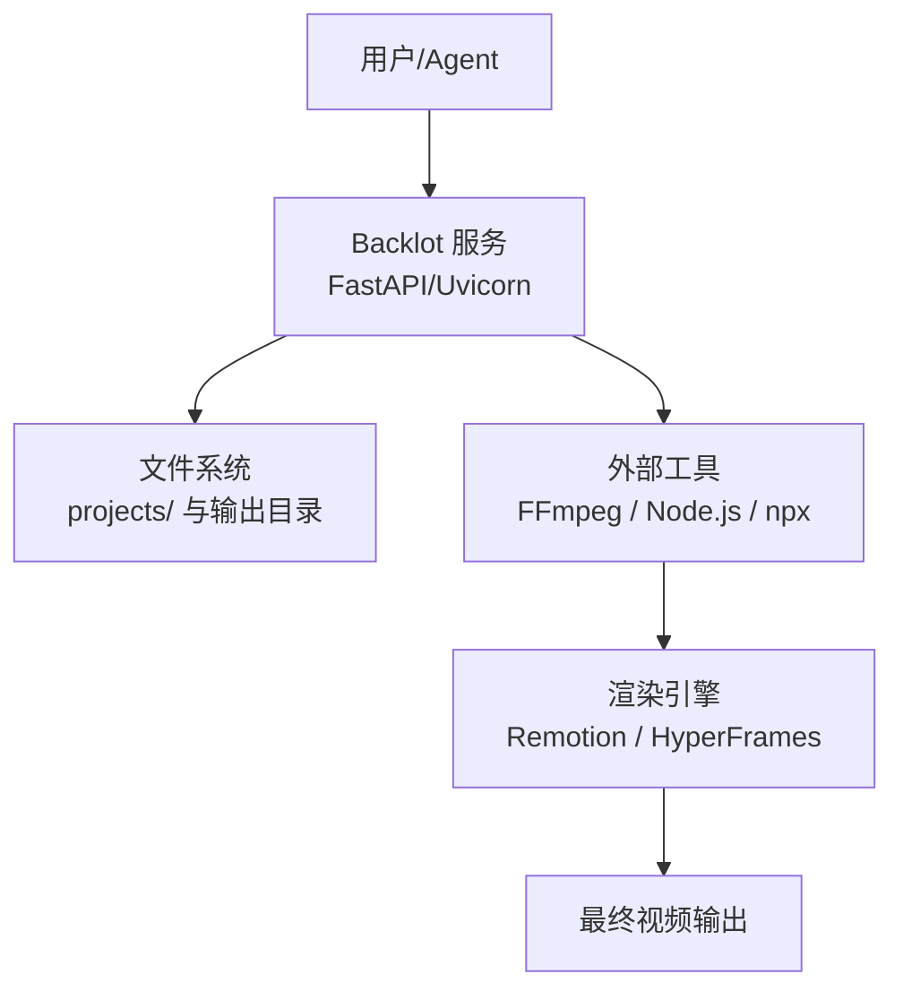
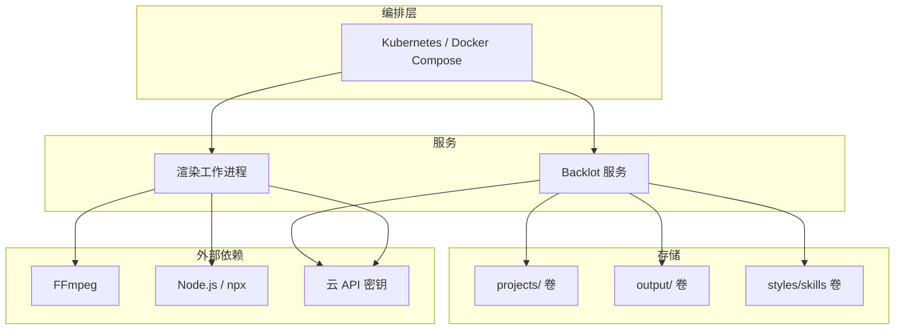
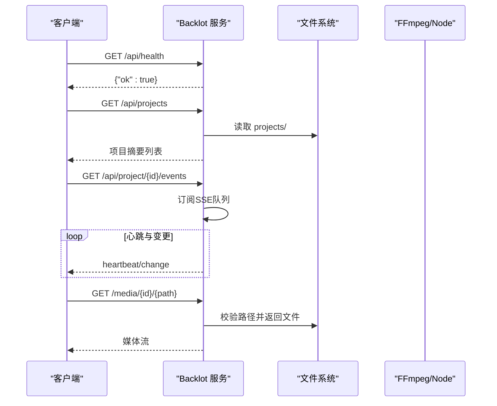
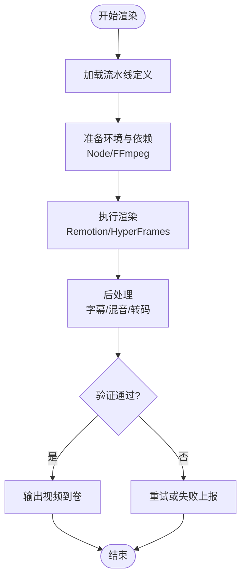
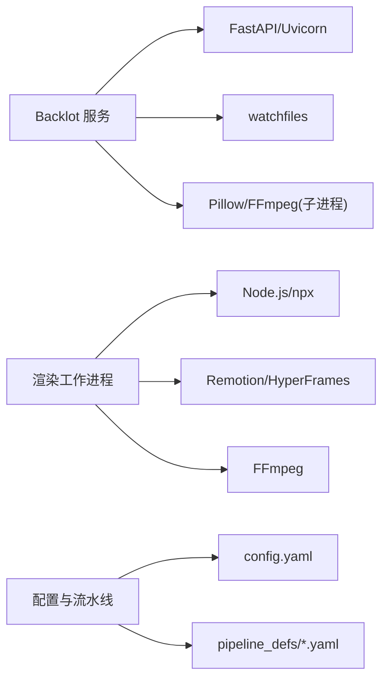

# 容器化部署

<cite>
**本文引用的文件**
- [README.md](file://README.md)
- [requirements.txt](file://requirements.txt)
- [setup.py](file://setup.py)
- [Makefile](file://Makefile)
- [config.yaml](file://config.yaml)
- [backlot/server.py](file://backlot/server.py)
- [backlot/__main__.py](file://backlot/__main__.py)
- [pipeline_defs/documentary-montage.yaml](file://pipeline_defs/documentary-montage.yaml)
</cite>

## 目录
1. [简介](#简介)
2. [项目结构](#项目结构)
3. [核心组件](#核心组件)
4. [架构总览](#架构总览)
5. [详细组件分析](#详细组件分析)
6. [依赖关系分析](#依赖关系分析)
7. [性能与资源限制](#性能与资源限制)
8. [故障排查指南](#故障排查指南)
9. [结论](#结论)
10. [附录](#附录)

## 简介
本方案为 OpenMontage 提供完整的容器化部署指南，覆盖镜像构建（多阶段构建、体积优化、安全加固）、编排（Docker Compose、服务通信、数据持久化）、Kubernetes 清单（Deployment/Service/ConfigMap/Secret/HPA/VPA）、监控与日志（指标导出、日志聚合、健康检查），以及高可用与可扩展性策略。OpenMontage 是一个由 AI 驱动的端到端视频生产系统，包含 Python 后端、Node.js 渲染器（Remotion/HyperFrames）与 FFmpeg 等外部工具，适合以容器方式在本地或云端运行。

## 项目结构
- 运行时依赖：Python 3.10+、Node.js 18+、FFmpeg；可选 GPU 加速依赖通过独立 requirements 安装。
- 应用组件：
  - Backlot Web 服务：基于 FastAPI + Uvicorn，提供看板、SSE 事件流、媒体与缩略图访问。
  - 渲染管线：Remotion（React）与 HyperFrames（HTML/CSS/GSAP）作为视频合成引擎，配合 FFmpeg 完成编码与混音。
  - 配置与流水线：YAML 配置文件与管道定义驱动生产流程。
- 关键入口：
  - Backlot 服务启动：python -m backlot serve
  - 一键初始化：make setup（安装 Python 依赖、Remotion、HyperFrames 缓存、生成 .env）

图表来源
- [backlot/server.py:165-307](file://backlot/server.py#L165-L307)
- [backlot/__main__.py:82-86](file://backlot/__main__.py#L82-L86)
- [Makefile:54-76](file://Makefile#L54-L76)

章节来源
- [README.md:180-216](file://README.md#L180-L216)
- [Makefile:54-76](file://Makefile#L54-L76)
- [requirements.txt:1-17](file://requirements.txt#L1-L17)

## 核心组件
- Backlot 服务
  - 提供健康检查、项目列表、项目状态、SSE 事件流、媒体与缩略图访问。
  - 使用 watchfiles 监听 projects/ 变更并广播事件。
  - 静态 UI 资源挂载与 no-cache 策略确保前端及时刷新。
- 渲染与工具链
  - Remotion 用于 React 程序化视频；HyperFrames 用于 HTML/GSAP 动效；FFmpeg 负责编码、字幕烧录、音频混音。
  - 通过 Makefile 的 setup 目标自动安装依赖并预热 npx 缓存。
- 配置与流水线
  - config.yaml 管理 LLM、预算、检查点、输出参数与路径。
  - pipeline_defs/*.yaml 描述各生产管道的阶段、工具与验收标准。

章节来源
- [backlot/server.py:165-307](file://backlot/server.py#L165-L307)
- [backlot/__main__.py:82-86](file://backlot/__main__.py#L82-L86)
- [config.yaml:1-34](file://config.yaml#L1-L34)
- [pipeline_defs/documentary-montage.yaml:1-179](file://pipeline_defs/documentary-montage.yaml#L1-L179)
- [Makefile:54-76](file://Makefile#L54-L76)

## 架构总览
OpenMontage 容器化后通常包含以下服务：
- backlot：Web 服务，暴露 API 与 UI，监听项目目录变化并通过 SSE 推送更新。
- render-worker：执行渲染任务（Remotion/HyperFrames + FFmpeg），可水平扩展。
- 存储卷：持久化 projects/、output/、styles/、skills/ 等数据。
- 环境变量与密钥：通过 ConfigMap/Secret 注入 API Key 与平台配置。

[此图为概念架构图，不直接映射具体源码文件]

## 详细组件分析

### 镜像构建策略（多阶段构建与体积优化）
- 基础镜像选择
  - 推荐 Debian Slim 或 Alpine 作为基础镜像，减少冗余包。
  - 若需 GPU 支持，使用 NVIDIA CUDA 基础镜像并在第二阶段安装驱动与库。
- 多阶段构建
  - 构建阶段：安装 Python 依赖、Node.js 依赖、npx 缓存 HyperFrames、编译原生扩展。
  - 运行阶段：仅复制必要产物与运行时依赖，删除构建缓存与临时文件。
- 体积控制
  - 使用 .dockerignore 排除 node_modules/.git/__pycache__ 等。
  - 合并 RUN 指令、清理 apt/yarn/npm 缓存。
  - 将大模型或外部资源放入只读卷或对象存储，避免打入镜像。
- 安全加固
  - 非 root 用户运行容器。
  - 最小权限原则：仅开放必要端口（如 8000）。
  - 定期扫描镜像漏洞，锁定依赖版本。

[本节为通用实践说明，不直接引用具体源码文件]

### Backlot 服务容器化
- 入口命令：python -m backlot serve --port 8000
- 健康检查：GET /api/health
- 关键能力：
  - 项目列表与状态查询
  - SSE 事件流（项目变更通知）
  - 媒体与缩略图访问（含范围请求）
  - 静态 UI 资源与 no-cache 策略
- 数据卷挂载：
  - projects/：存放项目状态与中间产物
  - output/：最终视频输出
  - styles/skills：样式与技能文件
- 环境变量：
  - BACKLOT_PORT：服务端口
  - 其他通过 ConfigMap/Secret 注入的 API Key

图表来源
- [backlot/server.py:165-307](file://backlot/server.py#L165-L307)
- [backlot/__main__.py:82-86](file://backlot/__main__.py#L82-L86)

章节来源
- [backlot/server.py:165-307](file://backlot/server.py#L165-L307)
- [backlot/__main__.py:82-86](file://backlot/__main__.py#L82-L86)

### 渲染工作进程（Remotion/HyperFrames + FFmpeg）
- 职责：根据流水线定义执行场景合成、转码、字幕烧录、音频混音。
- 触发方式：可由 Backlot 调度或直接通过 CLI/消息队列触发。
- 依赖：
  - Node.js 与 npx（Remotion/HyperFrames）
  - FFmpeg（编码、滤镜、混音）
  - 可选 GPU 加速（CUDA/cuDNN）
- 资源隔离：每个渲染任务在独立容器中运行，避免资源争用。

[此图为概念流程图，不直接映射具体源码文件]

### 数据持久化与共享
- 建议挂载卷：
  - projects/：项目状态、中间产物
  - output/：最终视频
  - styles/skills：样式与技能文件
  - .backlot/thumbs：缩略图缓存
- 多副本策略：
  - 使用分布式文件系统或对象存储（如 S3/OSS）共享 output/ 与 projects/。
  - 缩略图缓存可本地化以提升性能。

[本节为通用实践说明，不直接引用具体源码文件]

### 服务间通信
- Backlot 与渲染工作进程：
  - 通过文件系统（projects/output）或消息队列（如 RabbitMQ/Kafka）解耦。
  - SSE 用于实时看板更新。
- 外部 API：
  - 通过环境变量注入 API Key（如 FAL_KEY、OPENAI_API_KEY 等）。
  - 建议使用 Secret 管理敏感信息。

[本节为通用实践说明，不直接引用具体源码文件]

## 依赖关系分析
- Python 依赖：PyYAML、Pydantic、jsonschema、python-dotenv、Pillow、numpy、requests、google-genai、openai、fastapi、uvicorn、watchfiles。
- Node.js 依赖：Remotion、HyperFrames（通过 npx 安装与缓存）。
- 外部工具：FFmpeg（视频处理）、可选 GPU 运行时。

图表来源
- [requirements.txt:1-17](file://requirements.txt#L1-L17)
- [Makefile:54-76](file://Makefile#L54-L76)
- [config.yaml:1-34](file://config.yaml#L1-L34)
- [pipeline_defs/documentary-montage.yaml:1-179](file://pipeline_defs/documentary-montage.yaml#L1-L179)

章节来源
- [requirements.txt:1-17](file://requirements.txt#L1-L17)
- [Makefile:54-76](file://Makefile#L54-L76)
- [config.yaml:1-34](file://config.yaml#L1-L34)
- [pipeline_defs/documentary-montage.yaml:1-179](file://pipeline_defs/documentary-montage.yaml#L1-L179)

## 性能与资源限制
- CPU/内存限制
  - Backlot：轻量 Web 服务，建议 0.5-1 CPU、512MB-1GB 内存。
  - 渲染工作进程：根据任务复杂度设置更高资源，建议 2-8 CPU、4-16GB 内存。
- GPU 支持
  - 如需本地视频生成，启用 CUDA/cuDNN 并分配显存。
  - 使用专用节点池隔离 GPU 任务。
- 自动扩缩容
  - HPA：基于 CPU/内存或自定义指标（如队列长度）扩缩渲染工作进程。
  - VPA：根据历史资源使用调整请求与限制。
- 并发与批处理
  - 渲染任务按流水线并行执行，注意磁盘 I/O 与网络带宽。
  - 对大文件传输使用分块与断点续传。

[本节为通用实践说明，不直接引用具体源码文件]

## 故障排查指南
- 健康检查
  - 使用 /api/health 确认 Backlot 服务状态。
  - 检查 SSE 连接是否建立与心跳是否正常。
- 常见问题
  - FFmpeg 未安装或版本不兼容：确保容器内已安装并可通过 PATH 访问。
  - Node.js 依赖缺失：检查 npx 缓存与 npm 源配置。
  - API Key 缺失：通过 ConfigMap/Secret 注入环境变量。
  - 权限问题：确保容器用户有读写挂载卷的权限。
- 日志收集
  - 收集 Backlot 与渲染进程的 stdout/stderr。
  - 集中到 ELK/Loki 等日志系统，便于检索与分析。

章节来源
- [backlot/server.py:165-307](file://backlot/server.py#L165-L307)
- [backlot/__main__.py:82-86](file://backlot/__main__.py#L82-L86)

## 结论
通过多阶段构建、安全加固与资源隔离，OpenMontage 可在容器环境中稳定运行。结合 Docker Compose 与 Kubernetes 实现本地开发与生产部署的统一体验。借助 HPA/VPA、持久化卷与日志监控，系统具备高可用与可扩展性。建议在生产环境引入 CI/CD 流水线自动化构建与发布，并持续优化镜像体积与资源利用率。

[本节为总结性内容，不直接引用具体源码文件]

## 附录

### Docker Compose 示例
- 服务定义
  - backlot：暴露 8000 端口，挂载 projects/output/styles/skills 卷。
  - render-worker：无状态渲染进程，按需扩展。
- 环境变量
  - 通过 env_file 或 inline 注入 API Key 与平台配置。
- 健康检查
  - 使用 curl 检查 /api/health。

[本节为通用实践说明，不直接引用具体源码文件]

### Kubernetes 清单要点
- Deployment
  - backlot：副本数 1-2，探针配置就绪与存活检查。
  - render-worker：副本数弹性伸缩，资源限制明确。
- Service
  - backlot：ClusterIP 或 Ingress 暴露。
- ConfigMap/Secret
  - 注入环境变量与配置文件。
- HPA/VPA
  - 基于 CPU/内存或自定义指标自动扩缩容。
- PersistentVolumeClaim
  - 持久化 projects/output/styles/skills 等数据。

[本节为通用实践说明，不直接引用具体源码文件]

### 监控与日志
- 指标导出
  - Backlot 可集成 Prometheus 客户端暴露指标。
  - 渲染进程可记录任务耗时与错误率。
- 日志聚合
  - 使用 Filebeat/Fluent Bit 采集日志并发送到 Elasticsearch/Loki。
- 告警
  - 基于错误率、延迟与资源使用设置告警规则。

[本节为通用实践说明，不直接引用具体源码文件]