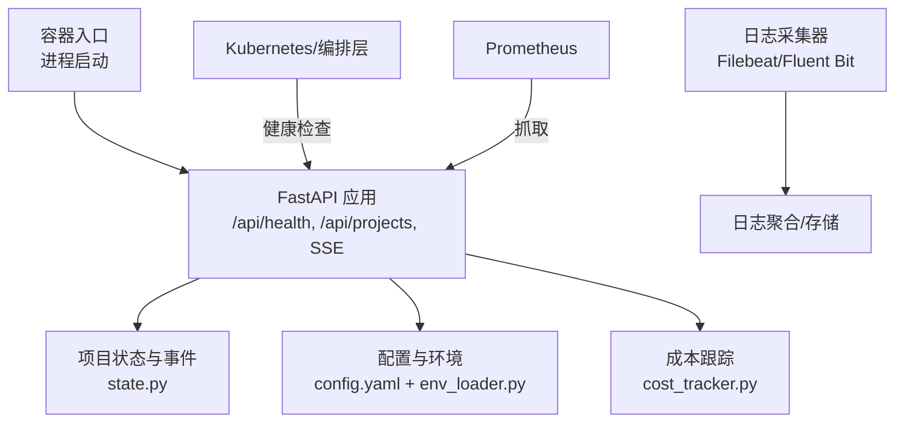
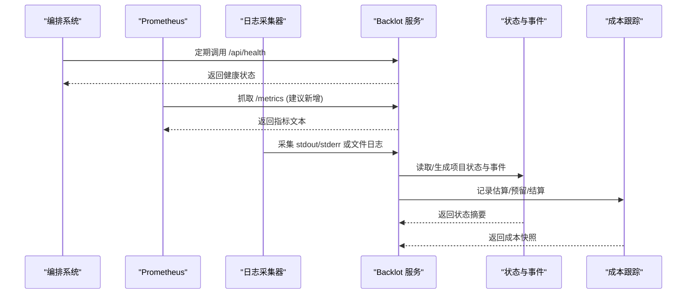
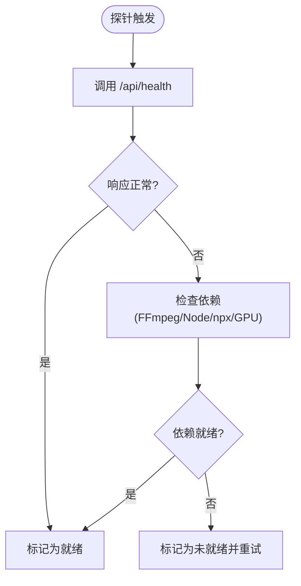
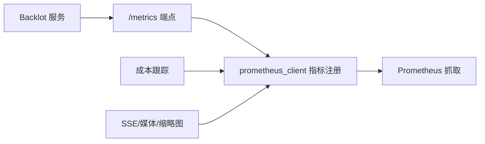
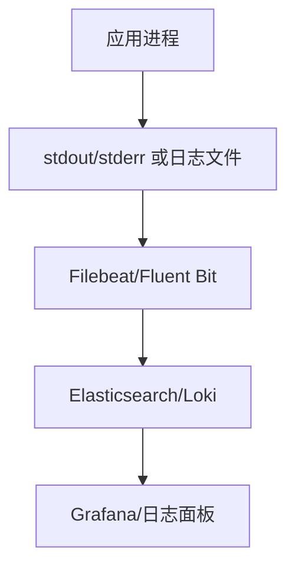
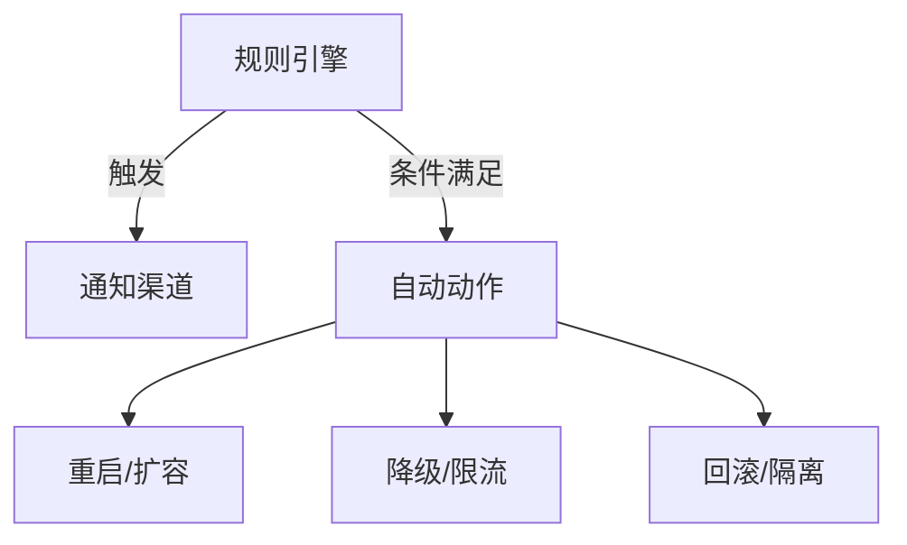
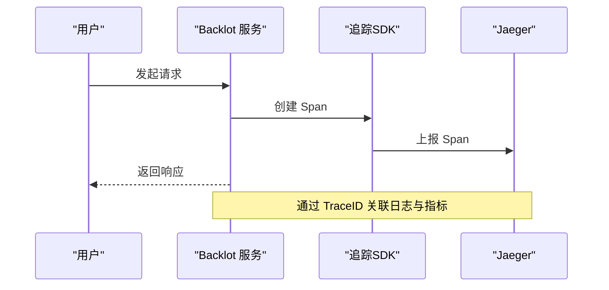
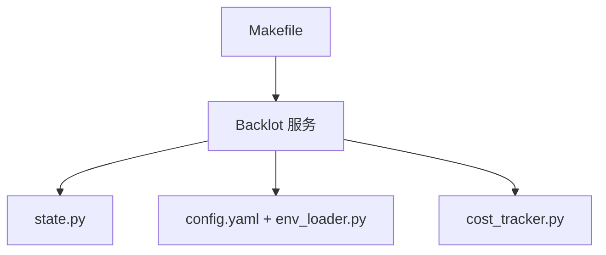

# 容器监控与日志

<cite>
**本文引用的文件**
- [backlot/server.py](file://backlot/server.py)
- [backlot/state.py](file://backlot/state.py)
- [lib/env_loader.py](file://lib/env_loader.py)
- [lib/config_model.py](file://lib/config_model.py)
- [config.yaml](file://config.yaml)
- [tools/cost_tracker.py](file://tools/cost_tracker.py)
- [Makefile](file://Makefile)
- [.claude/launch.json](file://.claude/launch.json)
</cite>

## 目录
1. [简介](#简介)
2. [项目结构](#项目结构)
3. [核心组件](#核心组件)
4. [架构总览](#架构总览)
5. [详细组件分析](#详细组件分析)
6. [依赖关系分析](#依赖关系分析)
7. [性能考量](#性能考量)
8. [故障排查指南](#故障排查指南)
9. [结论](#结论)
10. [附录](#附录)

## 简介
本方案面向 OpenMontage 的容器化部署，提供一套可落地的监控与日志收集设计。内容涵盖：
- 应用指标导出（Prometheus 格式、自定义业务指标、性能指标）
- 日志采集架构（结构化日志、聚合、轮转）
- 健康检查端点与就绪探针
- 告警规则、通知渠道与故障自愈机制
- 分布式追踪集成（Jaeger/OpenTelemetry）
- 监控仪表板模板与常见场景配置

OpenMontage 当前已具备基础 HTTP 服务（Backlot）、运行时配置与环境变量加载、成本跟踪等能力，可作为监控与日志方案的扩展基座。

## 项目结构
从监控视角看，关键位置如下：
- Backlot FastAPI 服务：提供健康检查、SSE 事件流、媒体与缩略图接口，适合作为 Prometheus 指标暴露与健康探测入口
- 配置与环境：集中式 YAML 配置 + .env 环境变量加载，便于在容器中注入监控相关参数
- 成本跟踪：记录预算与花费，可作为业务指标来源
- 构建与运行：Makefile 与启动脚本定义了运行方式，便于编排容器生命周期

**图示来源**
- [backlot/server.py:165-212](file://backlot/server.py#L165-L212)
- [backlot/state.py:588-658](file://backlot/state.py#L588-L658)
- [lib/env_loader.py:15-34](file://lib/env_loader.py#L15-L34)
- [lib/config_model.py:65-93](file://lib/config_model.py#L65-L93)
- [tools/cost_tracker.py:1-41](file://tools/cost_tracker.py#L1-L41)

**章节来源**
- [backlot/server.py:165-212](file://backlot/server.py#L165-L212)
- [backlot/state.py:588-658](file://backlot/state.py#L588-L658)
- [lib/env_loader.py:15-34](file://lib/env_loader.py#L15-L34)
- [lib/config_model.py:65-93](file://lib/config_model.py#L65-L93)
- [tools/cost_tracker.py:1-41](file://tools/cost_tracker.py#L1-L41)

## 核心组件
- 健康检查端点：/api/health 返回应用标识与可用性，适合用作存活/就绪探针
- 项目状态与事件：通过 state.py 读取 checkpoint、artifacts、events 等，形成看板数据；SSE 推送变更事件
- 配置与环境：YAML 配置项（LLM、预算、输出、路径等）+ .env 环境变量加载，支持容器化注入
- 成本跟踪：估算、预留、结算与持久化，可用于业务指标（花费、成功率、失败率）

**章节来源**
- [backlot/server.py:170-212](file://backlot/server.py#L170-L212)
- [backlot/state.py:588-658](file://backlot/state.py#L588-L658)
- [lib/config_model.py:65-93](file://lib/config_model.py#L65-L93)
- [lib/env_loader.py:15-34](file://lib/env_loader.py#L15-L34)
- [tools/cost_tracker.py:1-41](file://tools/cost_tracker.py#L1-L41)

## 架构总览
下图展示容器内服务与外部监控系统的交互关系：

**图示来源**
- [backlot/server.py:170-212](file://backlot/server.py#L170-L212)
- [backlot/state.py:588-658](file://backlot/state.py#L588-L658)
- [tools/cost_tracker.py:485-523](file://tools/cost_tracker.py#L485-L523)

## 详细组件分析

### 健康检查与就绪探针
- 存活探针：调用 /api/health，若返回正常则判定进程存活
- 就绪探针：除 /api/health 外，可扩展为检查依赖资源（如 FFmpeg、Node、npx、GPU 可用性等），确保服务真正可处理请求
- 建议：在容器启动后延迟就绪，等待依赖初始化完成

**章节来源**
- [backlot/server.py:170-173](file://backlot/server.py#L170-L173)
- [tools/video/hyperframes_compose.py:365-387](file://tools/video/hyperframes_compose.py#L365-L387)

### 指标导出（Prometheus）
- 目标指标类别
  - 通用指标：HTTP 请求计数、错误率、延迟分位、连接数
  - 业务指标：项目数量、进行中任务数、阶段状态分布、成本花费、成功率/失败率
  - 性能指标：CPU/内存/磁盘 IO、GPU 利用率、渲染耗时、模型调用耗时
- 实现建议
  - 在 FastAPI 应用中增加 /metrics 端点，使用 prometheus_client 暴露指标
  - 将 cost_tracker 的成本数据作为业务指标导出（如 total_spent_usd、reserved_usd、entries_count）
  - 对关键路径（SSE 订阅、缩略图生成、媒体访问）埋点计时与计数
- 采集与存储
  - Prometheus 定时抓取 /metrics
  - 指标标签包含 project_id、stage、tool、provider 等维度，便于多维查询

**章节来源**
- [backlot/server.py:165-212](file://backlot/server.py#L165-L212)
- [tools/cost_tracker.py:485-523](file://tools/cost_tracker.py#L485-L523)

### 日志采集架构
- 结构化日志
  - 建议在关键路径输出 JSON 格式日志，包含时间戳、级别、模块、请求 ID、项目 ID、阶段、工具、提供者、耗时、错误码等字段
  - 统一日志前缀与键名，便于聚合与分析
- 日志聚合
  - 容器 stdout/stderr 由编排平台收集，或使用 Filebeat/Fluent Bit 采集本地日志文件
  - 将日志发送至 Elasticsearch/Loki/云厂商日志服务
- 日志轮转
  - 基于文件大小或时间进行轮转，保留策略按合规要求设置
  - 避免写入过大日志影响性能

**章节来源**
- [backlot/server.py:165-212](file://backlot/server.py#L165-L212)
- [tools/cost_tracker.py:485-523](file://tools/cost_tracker.py#L485-L523)

### 告警规则与通知
- 建议规则
  - 健康检查失败：连续 N 次 /api/health 失败
  - 指标异常：HTTP 错误率 > 阈值、延迟 P95/P99 超阈值、SSE 订阅断开频繁
  - 业务异常：进行中任务长时间无活动（停滞检测）、成本超预算
  - 资源异常：CPU/内存/磁盘使用率过高、GPU 不可用
- 通知渠道
  - Webhook、邮件、IM（企业微信/钉钉/Slack）、电话
- 自愈机制
  - 自动重启：Pod 崩溃或健康检查失败时由编排系统重启
  - 降级：当依赖不可用时切换至只读模式或缓存响应
  - 限流：高负载时对非关键路径限流，保障核心功能

**章节来源**
- [backlot/server.py:170-212](file://backlot/server.py#L170-L212)
- [tools/cost_tracker.py:1-41](file://tools/cost_tracker.py#L1-L41)

### 分布式追踪（Jaeger/OpenTelemetry）
- 集成要点
  - 在关键路径（SSE 订阅、媒体访问、缩略图生成、模型调用）插入 Span
  - 使用 OpenTelemetry SDK 注入 TraceID/SpanID，关联日志与指标
  - 将 Trace 数据上报至 Jaeger 或云厂商追踪服务
- 链路视图
  - 可视化请求端到端耗时、瓶颈定位、错误传播
  - 与日志、指标联动，提升排障效率

**章节来源**
- [backlot/server.py:165-212](file://backlot/server.py#L165-L212)

### 监控仪表板模板与常见场景
- 仪表板建议
  - 概览：服务健康、QPS、错误率、延迟、成本花费
  - 项目视图：项目数量、阶段状态、进行中任务、停滞检测
  - 性能视图：CPU/内存/磁盘/GPU、渲染耗时、模型调用耗时
  - 日志视图：错误日志、警告日志、关键操作审计
- 常见场景
  - 高并发渲染：关注队列长度、延迟、资源使用
  - 模型调用失败：统计失败率、重试次数、错误类型
  - 成本超支：监控预算、预留、实际花费，触发告警

[本节为概念性内容，不直接分析具体文件]

## 依赖关系分析
- Backlot 服务依赖 state.py 读取项目状态与事件，依赖 SSE 推送变更
- 配置与环境通过 config.yaml 与 env_loader.py 加载，支持容器化注入
- 成本跟踪独立模块，提供预算治理与持久化，可作为业务指标来源
- Makefile 与启动脚本定义运行方式，便于编排容器生命周期

**图示来源**
- [backlot/server.py:165-212](file://backlot/server.py#L165-L212)
- [backlot/state.py:588-658](file://backlot/state.py#L588-L658)
- [lib/config_model.py:65-93](file://lib/config_model.py#L65-L93)
- [lib/env_loader.py:15-34](file://lib/env_loader.py#L15-L34)
- [tools/cost_tracker.py:485-523](file://tools/cost_tracker.py#L485-L523)
- [Makefile:54-76](file://Makefile#L54-L76)

**章节来源**
- [backlot/server.py:165-212](file://backlot/server.py#L165-L212)
- [backlot/state.py:588-658](file://backlot/state.py#L588-L658)
- [lib/config_model.py:65-93](file://lib/config_model.py#L65-L93)
- [lib/env_loader.py:15-34](file://lib/env_loader.py#L15-L34)
- [tools/cost_tracker.py:485-523](file://tools/cost_tracker.py#L485-L523)
- [Makefile:54-76](file://Makefile#L54-L76)

## 性能考量
- 指标采集开销：避免高频采样导致额外负载，合理设置抓取间隔
- 日志写入：采用异步写入与批量发送，减少 I/O 阻塞
- 资源限制：为容器设置合理的 CPU/内存/GPU 限制，防止资源争用
- 缓存与降级：对昂贵计算（如缩略图生成）引入缓存，必要时降级

[本节为通用指导，不直接分析具体文件]

## 故障排查指南
- 健康检查失败：检查 /api/health 响应与依赖资源（FFmpeg/Node/npx/GPU）
- 指标缺失：确认 /metrics 端点是否启用，Prometheus 抓取是否正常
- 日志丢失：检查采集器配置与日志轮转策略，确认输出路径与权限
- 成本异常：查看 cost_log.json 中的条目与预算状态，定位超支原因
- 停滞检测：关注 in_progress 阶段长时间无活动，结合事件与日志定位问题

**章节来源**
- [backlot/server.py:170-212](file://backlot/server.py#L170-L212)
- [backlot/state.py:630-638](file://backlot/state.py#L630-L638)
- [tools/cost_tracker.py:485-523](file://tools/cost_tracker.py#L485-L523)

## 结论
本方案以 OpenMontage 现有服务为基础，提出完整的监控与日志采集设计。通过健康检查、指标导出、结构化日志、告警与自愈、分布式追踪等手段，可在容器化环境中实现对应用的全面观测与快速排障。建议优先落地健康检查与指标导出，逐步完善日志聚合与告警机制，最终形成闭环的运维体系。

[本节为总结性内容，不直接分析具体文件]

## 附录
- 环境配置示例：通过 .env 注入 API Key 与监控相关参数
- 启动命令：参考 Makefile 与 .claude/launch.json 中的端口与运行方式
- 依赖检查：HyperFrames 运行时检查（Node/FFmpeg/npx）

**章节来源**
- [lib/env_loader.py:15-34](file://lib/env_loader.py#L15-L34)
- [Makefile:54-76](file://Makefile#L54-L76)
- [.claude/launch.json:1-17](file://.claude/launch.json#L1-L17)
- [tools/video/hyperframes_compose.py:365-387](file://tools/video/hyperframes_compose.py#L365-L387)