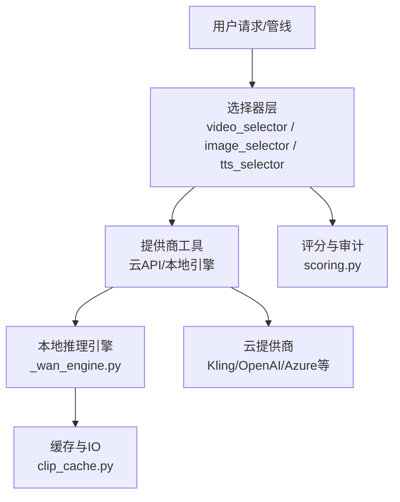
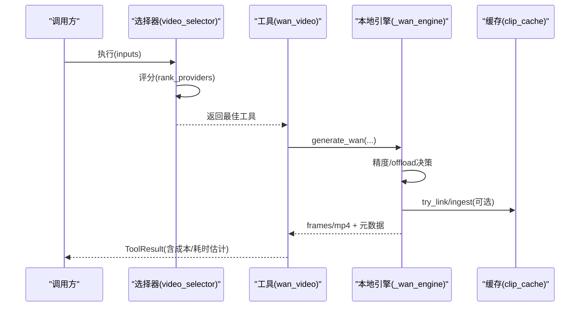
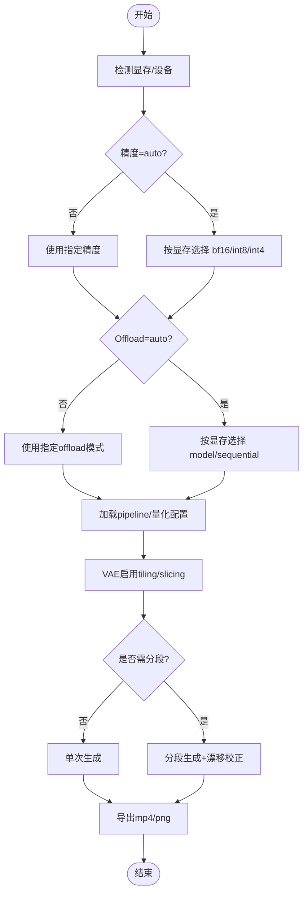
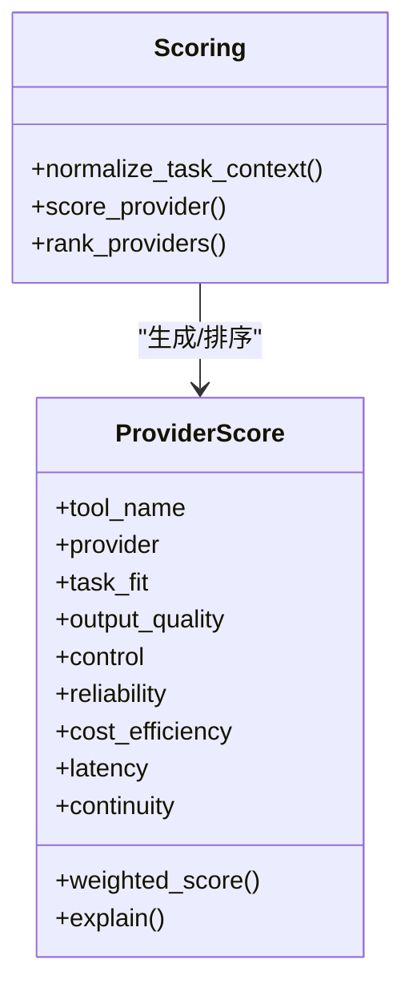
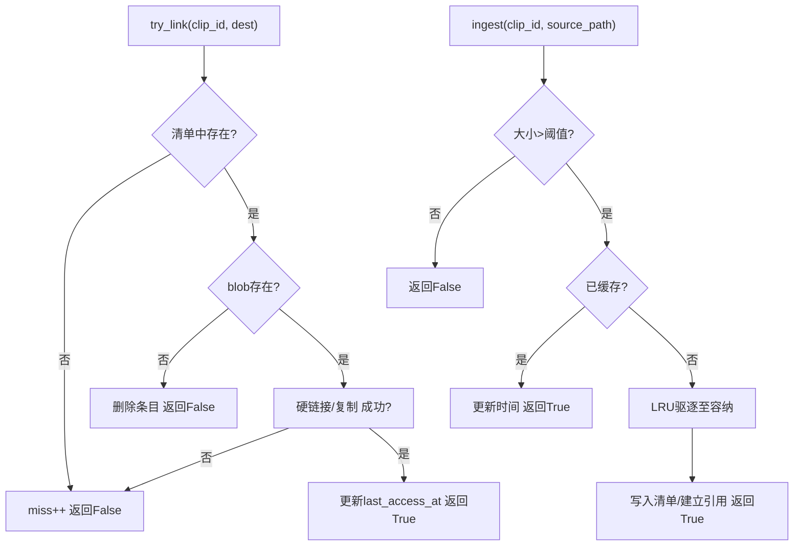
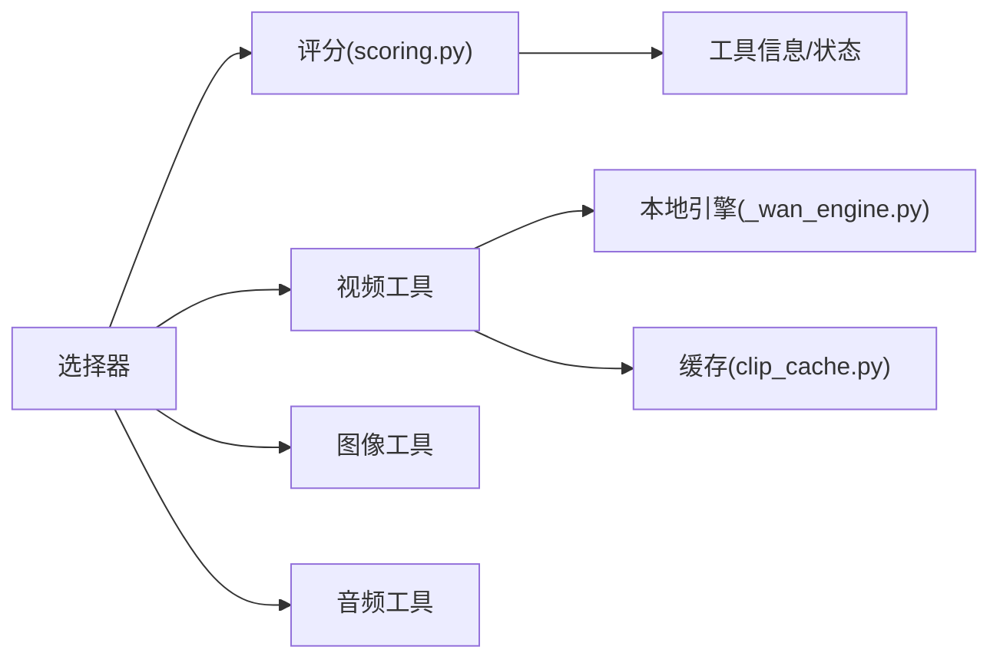

# AI模型优化

<cite>
**本文引用的文件**
- [README.md](file://README.md)
- [PROVIDERS.md](file://docs/PROVIDERS.md)
- [_wan_engine.py](file://tools/video/_wan_engine.py)
- [clip_cache.py](file://tools/video/clip_cache.py)
- [scoring.py](file://lib/scoring.py)
- [video_selector.py](file://tools/video/video_selector.py)
- [image_selector.py](file://tools/graphics/image_selector.py)
- [tts_selector.py](file://tools/audio/tts_selector.py)
- [wan_video.py](file://tools/video/wan_video.py)
- [test_wan_video.py](file://tests/contracts/test_wan_video.py)
</cite>

## 目录
1. [简介](#简介)
2. [项目结构](#项目结构)
3. [核心组件](#核心组件)
4. [架构总览](#架构总览)
5. [详细组件分析](#详细组件分析)
6. [依赖关系分析](#依赖关系分析)
7. [性能考量](#性能考量)
8. [故障排查指南](#故障排查指南)
9. [结论](#结论)
10. [附录](#附录)

## 简介
本指南面向OpenMontage的AI模型加载与推理优化，覆盖模型预热、批处理、内存管理、不同提供商（Kling视频生成、OpenAI图像生成、Azure语音合成等）的性能调优策略，以及模型缓存机制（版本管理与失效策略）、GPU资源优化（显存管理、多GPU并行、模型量化）和推理性能监控与分析。目标是帮助你在本地或云端稳定、高效地运行大规模媒体生成任务，并在成本、质量与延迟之间取得平衡。

## 项目结构
OpenMontage将“工具”按能力分层组织：视频、音频、图形、增强、分析、字幕等；通过评分选择器统一路由到具体提供商；本地推理由专用引擎（如Wan 2.x）提供高性能实现；共享缓存用于减少重复下载与I/O开销。

图表来源
- [video_selector.py:294-440](file://tools/video/video_selector.py#L294-L440)
- [image_selector.py:320-375](file://tools/graphics/image_selector.py#L320-L375)
- [tts_selector.py:272-298](file://tools/audio/tts_selector.py#L272-L298)
- [_wan_engine.py:179-272](file://tools/video/_wan_engine.py#L179-L272)
- [clip_cache.py:177-473](file://tools/video/clip_cache.py#L177-L473)
- [scoring.py:21-70](file://lib/scoring.py#L21-L70)

章节来源
- [README.md:450-475](file://README.md#L450-L475)

## 核心组件
- 选择器与评分系统：基于多维权重对可用提供商进行打分与排序，支持“首选提供商+分数阈值”的柔性控制，并输出可解释的选择原因与备选清单。
- 本地推理引擎（Wan 2.x）：自动精度选择、CPU offload、VAE分块解码、片段拼接、错误自愈提示。
- 共享缓存：进程安全的LRU缓存，硬链接优先、原子写入、容量上限与驱逐策略，降低网络与磁盘压力。
- 提供商文档：各云服务的密钥配置、能力边界、定价与最佳实践。

章节来源
- [scoring.py:21-70](file://lib/scoring.py#L21-L70)
- [_wan_engine.py:112-176](file://tools/video/_wan_engine.py#L112-L176)
- [clip_cache.py:177-473](file://tools/video/clip_cache.py#L177-L473)
- [PROVIDERS.md:29-81](file://docs/PROVIDERS.md#L29-L81)

## 架构总览
下图展示一次典型视频生成的端到端流程：选择器根据任务上下文评分并挑选提供商；若为本地Wan模型，则进入本地引擎进行精度与offload决策、片段化生成与导出；同时记录成本与运行时估计，便于预算与性能治理。

图表来源
- [video_selector.py:294-440](file://tools/video/video_selector.py#L294-L440)
- [wan_video.py:196-215](file://tools/video/wan_video.py#L196-L215)
- [_wan_engine.py:477-671](file://tools/video/_wan_engine.py#L477-L671)
- [clip_cache.py:318-473](file://tools/video/clip_cache.py#L318-L473)

## 详细组件分析

### 本地推理引擎（Wan 2.x）：精度、Offload与内存管理
- 自动精度选择：依据可见显存与模型规模，在bf16/int8/int4间自适应切换，避免OOM并兼顾质量。
- Offload模式：model（整体组件驻留，速度快）与sequential（逐子模块流式加载，释放更多显存给激活值）。
- VAE优化：启用tiling/slicing以降低长片段解码峰值显存。
- 片段拼接：当目标时长超过单次生成长度时，使用上一段的最后一帧作为下一段起点，保持连贯性并进行色彩漂移校正。
- 错误自愈：遇到OOM时给出明确建议（切换到sequential、降低分辨率、减少segment_frames、降级精度）。

图表来源
- [_wan_engine.py:112-176](file://tools/video/_wan_engine.py#L112-L176)
- [_wan_engine.py:179-272](file://tools/video/_wan_engine.py#L179-L272)
- [_wan_engine.py:477-671](file://tools/video/_wan_engine.py#L477-L671)

章节来源
- [_wan_engine.py:112-176](file://tools/video/_wan_engine.py#L112-L176)
- [_wan_engine.py:179-272](file://tools/video/_wan_engine.py#L179-L272)
- [_wan_engine.py:477-671](file://tools/video/_wan_engine.py#L477-L671)
- [test_wan_video.py:364-396](file://tests/contracts/test_wan_video.py#L364-L396)

### 提供商选择与评分：可解释、可审计
- 多维评分：任务契合度、输出质量、可控性、可靠性、成本效率、延迟、连续性，加权得出最终得分。
- 上下文归一化：从prompt、风格、平台、需求等字段提取意图与风格关键词，提升匹配精度。
- 首选提供商容差：允许指定“首选提供商”，但仅当其分数接近最优时才生效，避免盲目偏置。
- 结果可追溯：返回所选工具、备选清单与评分解释，便于审计与复盘。

图表来源
- [scoring.py:21-70](file://lib/scoring.py#L21-L70)
- [scoring.py:297-359](file://lib/scoring.py#L297-L359)
- [scoring.py:373-542](file://lib/scoring.py#L373-L542)

章节来源
- [scoring.py:21-70](file://lib/scoring.py#L21-L70)
- [scoring.py:297-359](file://lib/scoring.py#L297-L359)
- [scoring.py:373-542](file://lib/scoring.py#L373-L542)
- [video_selector.py:294-440](file://tools/video/video_selector.py#L294-L440)
- [image_selector.py:320-375](file://tools/graphics/image_selector.py#L320-L375)
- [tts_selector.py:272-298](file://tools/audio/tts_selector.py#L272-L298)

### 模型缓存机制：版本管理与失效策略
- 存储与访问：以clip_id为键，持久化到JSONL清单；每次命中更新最近访问时间，驱动LRU驱逐。
- 原子性与并发：写清单采用临时文件+原子替换；所有变更受锁保护，避免竞态。
- 容量与驱逐：默认20GB上限，超限时按最近最少使用原则驱逐；支持环境变量调整路径与上限。
- 版本与失效：清单包含source/source_id/source_url/license等元数据；当源文件或清单漂移时自动清理并回退到重新下载。
- 适用场景：适用于素材下载与复用阶段，加速后续项目构建与批量检索。

图表来源
- [clip_cache.py:318-473](file://tools/video/clip_cache.py#L318-L473)
- [clip_cache.py:478-516](file://tools/video/clip_cache.py#L478-L516)

章节来源
- [clip_cache.py:177-473](file://tools/video/clip_cache.py#L177-L473)

### 不同AI提供商的优化策略
- Kling视频生成（官方API与fal.ai网关）
  - 直接官方API：适合需要明确模型权限、区域端点与元素级参考的工作流；注意回调URL与轮询策略，结合评分选择器在成本与质量间权衡。
  - fal.ai网关：单Key覆盖多模型，适合快速试错与批量生成；关注超时与重试策略，合理设置并发与节流。
- OpenAI图像生成
  - 通过选择器纳入评分，结合任务上下文（风格、尺寸、数量）与预算剩余，自动选择合适模型与参数；必要时限制allowed_providers聚焦特定供应商。
- Azure语音合成（TTS）
  - 使用SSML控制语速、音高与情感风格；同一Speech资源可同时开启STT与TTS；注意TTS主机与STT主机差异，按需配置AZURE_TTS_ENDPOINT。
- 其他云提供商（Google、DashScope、Hunyuan、MiniMax、Seedance等）
  - 遵循各自异步提交-查询模式；利用estimate_cost与estimate_runtime进行预算与时间规划；结合评分系统选择最合适的提供商组合。

章节来源
- [PROVIDERS.md:433-473](file://docs/PROVIDERS.md#L433-L473)
- [PROVIDERS.md:705-760](file://docs/PROVIDERS.md#L705-L760)
- [PROVIDERS.md:256-291](file://docs/PROVIDERS.md#L256-L291)
- [PROVIDERS.md:584-655](file://docs/PROVIDERS.md#L584-L655)
- [PROVIDERS.md:191-253](file://docs/PROVIDERS.md#L191-L253)

### GPU资源优化：显存、并行与量化
- 显存管理
  - 自动精度与offload：在显存不足时自动降级精度或切换sequential offload，显著降低峰值占用。
  - VAE分块与切片：长片段解码的关键优化，避免OOM。
  - 管道缓存与释放：同一时刻仅保留一个Wan pipeline，必要时主动释放并清空CUDA缓存。
- 多GPU并行
  - 当前引擎以单卡为主；如需多卡，可在上层调度多个实例或使用分布式推理框架（不在本仓库内），并通过选择器与预算控制分摊负载。
- 模型量化
  - 使用bitsandbytes进行int8/int4量化，仅在transformer上应用，文本编码器与VAE按需offload以减少反量化开销。
- 估算与监控
  - estimate_runtime与estimate_cost在工具层暴露，便于管线编排与预算治理；结合评分系统的历史延迟与质量指标做持续优化。

章节来源
- [_wan_engine.py:112-176](file://tools/video/_wan_engine.py#L112-L176)
- [_wan_engine.py:179-272](file://tools/video/_wan_engine.py#L179-L272)
- [wan_video.py:196-215](file://tools/video/wan_video.py#L196-L215)

### 推理性能监控与分析
- 选择器输出：包含selected_tool、alternatives_considered、provider_score与selection_reason，便于定位瓶颈与替代方案。
- 成本与耗时估计：每个工具提供estimate_cost与estimate_runtime，用于预算与SLA管理。
- 本地引擎日志：generate_wan返回包含precision、offload_mode、segments、num_inference_steps、width/height等关键元数据，可用于后分析与回归测试。
- 评估与基准：可通过评测脚本与合同测试验证性能变化与稳定性。

章节来源
- [image_selector.py:320-375](file://tools/graphics/image_selector.py#L320-L375)
- [video_selector.py:294-440](file://tools/video/video_selector.py#L294-L440)
- [_wan_engine.py:634-671](file://tools/video/_wan_engine.py#L634-L671)

## 依赖关系分析
- 选择器依赖评分系统，评分系统依赖工具的能力描述与状态；视频/图像/TTS选择器分别封装各自领域工具集。
- 本地引擎依赖diffusers与torch，量化依赖bitsandbytes；缓存依赖filelock与标准库。
- 提供商文档提供环境配置与能力约束，指导选择器与工具的正确使用。

图表来源
- [video_selector.py:294-440](file://tools/video/video_selector.py#L294-L440)
- [image_selector.py:320-375](file://tools/graphics/image_selector.py#L320-L375)
- [tts_selector.py:272-298](file://tools/audio/tts_selector.py#L272-L298)
- [scoring.py:21-70](file://lib/scoring.py#L21-L70)
- [_wan_engine.py:179-272](file://tools/video/_wan_engine.py#L179-L272)
- [clip_cache.py:177-473](file://tools/video/clip_cache.py#L177-L473)

章节来源
- [video_selector.py:294-440](file://tools/video/video_selector.py#L294-L440)
- [scoring.py:21-70](file://lib/scoring.py#L21-L70)

## 性能考量
- 预热与缓存
  - 首次加载会触发权重下载与初始化，建议在启动阶段预加载常用模型或复用进程以避免冷启动开销。
  - 使用clip_cache减少重复下载与拷贝，显著提升批量构建速度。
- 批处理
  - 对于云API，合理设置并发与限流，结合estimate_runtime预估总耗时；对于本地引擎，优先使用分段生成与VAE分块以降低峰值显存。
- 精度与Offload
  - 在显存紧张时优先尝试sequential offload与int8/int4量化；长片段务必启用VAE tiling/slicing。
- 预算与SLA
  - 通过estimate_cost与评分系统控制成本；结合per-action审批与总预算上限避免意外支出。
- 监控与回归
  - 收集选择器评分、工具返回元数据与运行时估计，定期对比基线，识别退化与瓶颈。

[本节为通用指导，不直接分析具体文件]

## 故障排查指南
- OOM问题
  - 现象：生成时报CUDA out of memory。
  - 建议：切换到offload_mode="sequential"、降低分辨率、减少segment_frames、降级精度（bf16→int8→int4）。
  - 参考：错误自愈逻辑会给出具体提示。
- NVML驱动不匹配
  - 现象：nvmlInit失败导致误报OOM或量化无法加载。
  - 建议：重启以加载匹配的kernel模块；临时保持在bf16并降低分辨率。
- 缓存锁定与驱逐
  - 现象：并发写入冲突或磁盘空间不足。
  - 建议：检查filelock后端与磁盘配额；确认OPENMONTAGE_CACHE_MAX_GB设置合理。
- 提供商不可用
  - 现象：选择器未找到可用工具或评分过低。
  - 建议：检查API Key与环境变量；放宽preferred_provider或调整allowed_providers；查看评分解释定位短板。

章节来源
- [_wan_engine.py:910-947](file://tools/video/_wan_engine.py#L910-L947)
- [test_wan_video.py:364-396](file://tests/contracts/test_wan_video.py#L364-L396)
- [clip_cache.py:214-256](file://tools/video/clip_cache.py#L214-L256)
- [PROVIDERS.md:29-81](file://docs/PROVIDERS.md#L29-L81)

## 结论
OpenMontage通过“评分选择器 + 本地引擎 + 共享缓存”的组合，实现了跨提供商的统一接入与高性能推理。针对本地Wan模型，提供了自动精度与offload、VAE优化与片段拼接；针对云提供商，提供了详尽的配置与优化建议。借助成本与耗时估计、选择器可解释输出与缓存机制，可以在保证质量的同时有效控制成本与延迟。建议在生产环境中结合监控与回归测试持续优化，并根据业务需求选择合适的提供商组合与参数配置。

[本节为总结，不直接分析具体文件]

## 附录
- 快速开始与提供商配置：参见提供商文档的环境变量与能力说明。
- 本地GPU安装与模型选择：启用本地视频生成并选择合适的模型变体。
- 评估与测试：使用合同测试与基准脚本验证性能与稳定性。

章节来源
- [PROVIDERS.md:29-81](file://docs/PROVIDERS.md#L29-L81)
- [README.md:267-278](file://README.md#L267-L278)