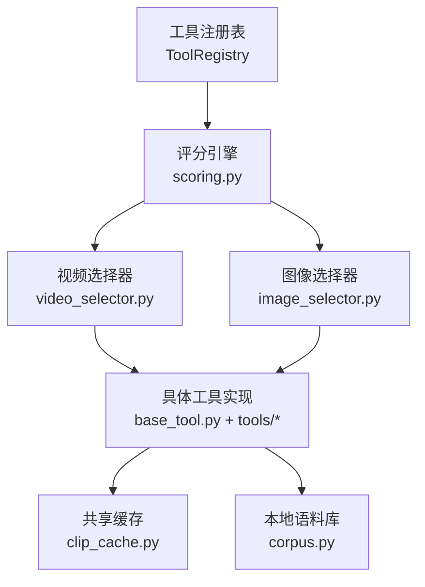
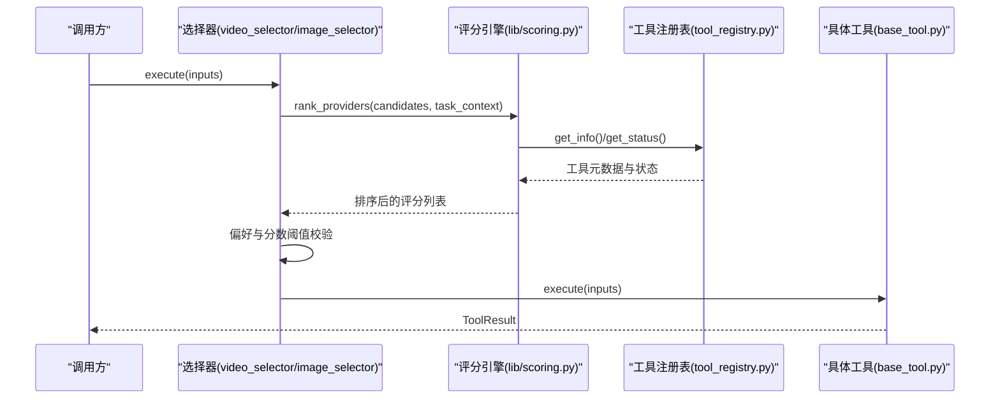
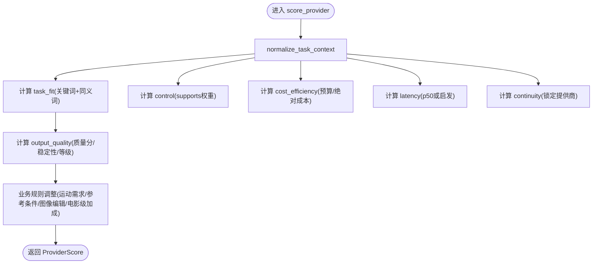
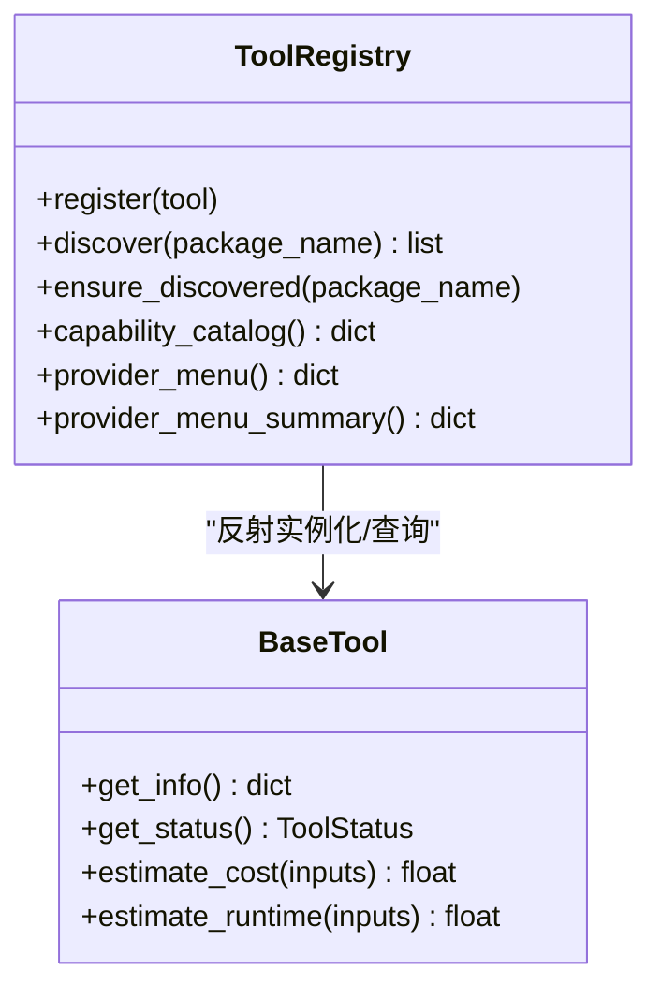
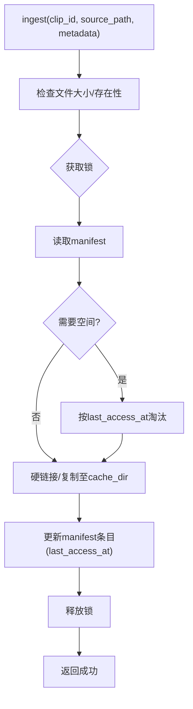
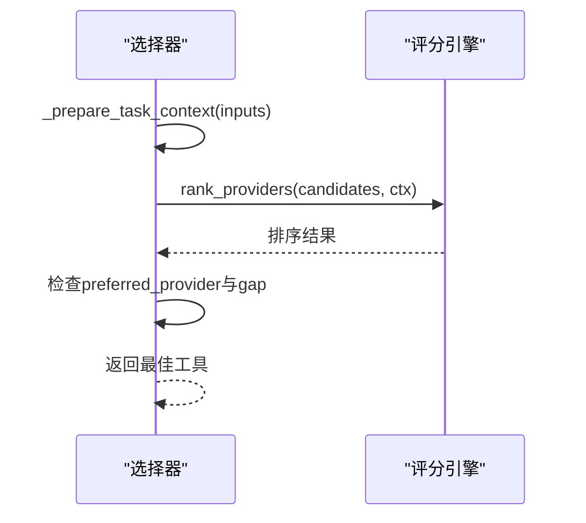
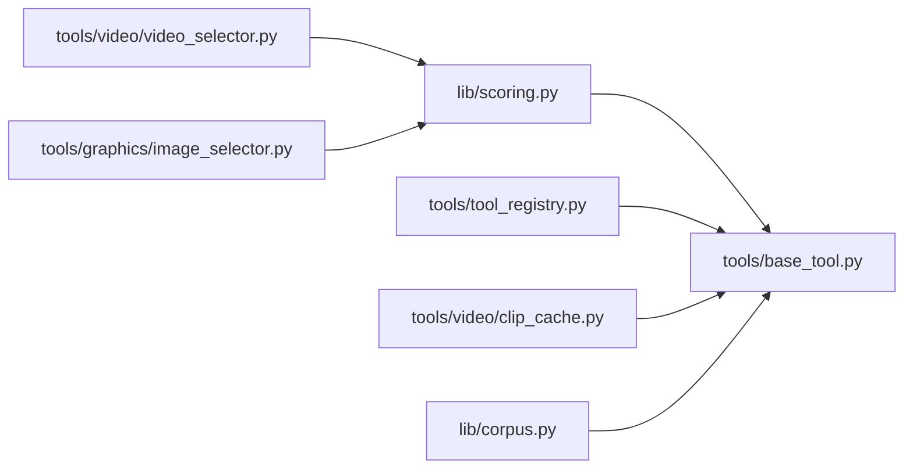

# 代码优化

<cite>
**本文引用的文件**
- [lib/scoring.py](file://lib/scoring.py)
- [tools/tool_registry.py](file://tools/tool_registry.py)
- [tools/base_tool.py](file://tools/base_tool.py)
- [tools/video/clip_cache.py](file://tools/video/clip_cache.py)
- [lib/corpus.py](file://lib/corpus.py)
- [tools/video/video_selector.py](file://tools/video/video_selector.py)
- [tools/graphics/image_selector.py](file://tools/graphics/image_selector.py)
- [tests/tools/test_scoring.py](file://tests/tools/test_scoring.py)
</cite>

## 目录
1. [简介](#简介)
2. [项目结构](#项目结构)
3. [核心组件](#核心组件)
4. [架构总览](#架构总览)
5. [详细组件分析](#详细组件分析)
6. [依赖关系分析](#依赖关系分析)
7. [性能考量](#性能考量)
8. [故障排查指南](#故障排查指南)
9. [结论](#结论)
10. [附录](#附录)

## 简介
本指南面向OpenMontage的Python代码性能优化，聚焦以下目标：
- 算法复杂度与内存管理优化
- 缓存策略（本地磁盘LRU、进程内缓存）
- 评分引擎的性能优化（ProviderScore、ProductionPathScore、关键词匹配）
- 工具注册表的发现与动态加载调优
- 并发处理优化（线程池、进程池、限流）
- 代码剖析与性能分析（profiling）方法与实践

## 项目结构
OpenMontage将“能力发现—评分选择—执行”解耦为三层：
- 工具注册与发现：集中式注册表扫描并加载工具模块，提供按能力/提供商/状态的查询接口
- 评分与选择：基于多维指标对候选工具打分排序，结合任务上下文做决策
- 执行与缓存：工具执行路径中引入共享缓存（如视频片段缓存），减少重复I/O与网络开销

图表来源
- [tools/tool_registry.py:118-134](file://tools/tool_registry.py#L118-L134)
- [lib/scoring.py:373-542](file://lib/scoring.py#L373-L542)
- [tools/video/video_selector.py:308-440](file://tools/video/video_selector.py#L308-L440)
- [tools/graphics/image_selector.py:349-375](file://tools/graphics/image_selector.py#L349-L375)
- [tools/base_tool.py:227-372](file://tools/base_tool.py#L227-L372)
- [tools/video/clip_cache.py:177-472](file://tools/video/clip_cache.py#L177-L472)
- [lib/corpus.py:73-181](file://lib/corpus.py#L73-L181)

章节来源
- [tools/tool_registry.py:118-134](file://tools/tool_registry.py#L118-L134)
- [lib/scoring.py:373-542](file://lib/scoring.py#L373-L542)
- [tools/video/video_selector.py:308-440](file://tools/video/video_selector.py#L308-L440)
- [tools/graphics/image_selector.py:349-375](file://tools/graphics/image_selector.py#L349-L375)
- [tools/base_tool.py:227-372](file://tools/base_tool.py#L227-L372)
- [tools/video/clip_cache.py:177-472](file://tools/video/clip_cache.py#L177-L472)
- [lib/corpus.py:73-181](file://lib/corpus.py#L73-L181)

## 核心组件
- 评分引擎（lib/scoring.py）
  - ProviderScore：对单一供应商在特定任务上下文的加权评分
  - ProductionPathScore：对整条生产路径的综合评分
  - 关键词匹配：使用重叠系数与同义词簇，避免Jaccard对宽泛描述的不利惩罚
  - 归一化上下文：从松散的任务上下文构造标准化输入
- 工具注册表（tools/tool_registry.py）
  - 自动发现：遍历包下模块，反射注册BaseTool子类
  - 能力目录：按能力/提供商分组，生成菜单与摘要
- 基础工具（tools/base_tool.py）
  - 统一契约：状态、资源画像、重试策略、成本/时长估算、幂等键
  - 执行插桩：自动注入事件埋点，便于追踪耗时与成本
- 共享缓存（tools/video/clip_cache.py）
  - 进程安全、LRU淘汰、原子写入、硬链接优先
- 本地语料库（lib/corpus.py）
  - 追加式索引、向量嵌入对齐、持久化与一致性保护

章节来源
- [lib/scoring.py:21-107](file://lib/scoring.py#L21-L107)
- [lib/scoring.py:114-231](file://lib/scoring.py#L114-L231)
- [lib/scoring.py:297-359](file://lib/scoring.py#L297-L359)
- [lib/scoring.py:373-542](file://lib/scoring.py#L373-L542)
- [tools/tool_registry.py:55-134](file://tools/tool_registry.py#L55-L134)
- [tools/base_tool.py:110-139](file://tools/base_tool.py#L110-L139)
- [tools/base_tool.py:227-372](file://tools/base_tool.py#L227-L372)
- [tools/video/clip_cache.py:177-472](file://tools/video/clip_cache.py#L177-L472)
- [lib/corpus.py:73-181](file://lib/corpus.py#L73-L181)

## 架构总览
评分引擎是“选择层”的核心。选择器在调用前准备任务上下文，调用rank_providers进行排序，再根据偏好与分数阈值挑选最终工具。

图表来源
- [tools/video/video_selector.py:308-440](file://tools/video/video_selector.py#L308-L440)
- [tools/graphics/image_selector.py:349-375](file://tools/graphics/image_selector.py#L349-L375)
- [lib/scoring.py:373-542](file://lib/scoring.py#L373-L542)
- [tools/tool_registry.py:198-230](file://tools/tool_registry.py#L198-L230)
- [tools/base_tool.py:296-372](file://tools/base_tool.py#L296-L372)

## 详细组件分析

### 评分引擎优化（ProviderScore / ProductionPathScore）
- 加权评分设计
  - ProviderScore：任务契合度、输出质量、可控性、可靠性、成本效率、延迟、连续性
  - ProductionPathScore：交付契合、质量契合、能力置信、回退完整性、预算契合、速度契合、可控性、一致性契合
- 关键词匹配优化
  - 使用重叠系数替代Jaccard，避免“宽泛描述被惩罚”的问题
  - 同义词簇扩展（电影/动画/企业风格等），提升语义匹配鲁棒性
  - 词法分词正则，忽略标点干扰
- 上下文归一化
  - 从intent/style/brief/goal/platform/needs等多源文本聚合，构建style_keywords与布尔信号（如prefers_generated_visuals）
- 运行时启发
  - 可靠性：历史成功率 > 可用性状态；控制力：supports特征加权；成本效率：预算剩余与绝对成本映射；延迟：p50或运行时代码启发；连续性：锁定提供商加分

图表来源
- [lib/scoring.py:205-231](file://lib/scoring.py#L205-L231)
- [lib/scoring.py:234-294](file://lib/scoring.py#L234-L294)
- [lib/scoring.py:297-359](file://lib/scoring.py#L297-L359)
- [lib/scoring.py:373-530](file://lib/scoring.py#L373-L530)

章节来源
- [lib/scoring.py:21-107](file://lib/scoring.py#L21-L107)
- [lib/scoring.py:114-231](file://lib/scoring.py#L114-L231)
- [lib/scoring.py:297-359](file://lib/scoring.py#L297-L359)
- [lib/scoring.py:373-530](file://lib/scoring.py#L373-L530)
- [tests/tools/test_scoring.py:35-48](file://tests/tools/test_scoring.py#L35-L48)

### 工具注册表性能调优（发现机制与动态加载）
- 自动发现
  - 通过importlib与pkgutil遍历包，反射识别BaseTool子类并实例化注册
  - 支持跳过内部模块（base_tool、tool_registry）以避免循环导入
- 按需发现
  - ensure_discovered保证仅首次加载，后续查询复用内存中的工具集合
- 能力目录与菜单
  - capability_catalog/provider_menu按能力/提供商分组，排序后供上层展示
  - provider_menu_summary聚合可用/不可用提供商、安装提示、运行时警告，便于快速定位配置问题
- 环境加载
  - 启动时加载.env到环境变量，确保工具可访问API密钥

图表来源
- [tools/tool_registry.py:55-134](file://tools/tool_registry.py#L55-L134)
- [tools/tool_registry.py:198-230](file://tools/tool_registry.py#L198-L230)
- [tools/tool_registry.py:249-471](file://tools/tool_registry.py#L249-L471)
- [tools/base_tool.py:227-372](file://tools/base_tool.py#L227-L372)

章节来源
- [tools/tool_registry.py:55-134](file://tools/tool_registry.py#L55-L134)
- [tools/tool_registry.py:198-230](file://tools/tool_registry.py#L198-L230)
- [tools/tool_registry.py:249-471](file://tools/tool_registry.py#L249-L471)
- [tools/base_tool.py:227-372](file://tools/base_tool.py#L227-L372)

### 共享缓存与内存管理（ClipCache）
- 进程安全与并发
  - 使用filelock或O_EXCL回退实现互斥锁，保护manifest与blob操作
- LRU淘汰与容量控制
  - 默认20GB上限，可通过环境变量调整；按last_access_at淘汰最少使用项
- 原子写入与一致性
  - manifest采用JSONL，写入临时文件后原子替换；崩溃不破坏旧版本
- 硬链接优先
  - 同盘硬链接零拷贝，跨盘回退copy2；降低磁盘占用与IO时间
- 统计与可观测性
  - stats返回命中率、淘汰计数、使用率、后端类型等

图表来源
- [tools/video/clip_cache.py:367-443](file://tools/video/clip_cache.py#L367-L443)
- [tools/video/clip_cache.py:478-516](file://tools/video/clip_cache.py#L478-L516)
- [tools/video/clip_cache.py:523-543](file://tools/video/clip_cache.py#L523-L543)

章节来源
- [tools/video/clip_cache.py:177-472](file://tools/video/clip_cache.py#L177-L472)
- [tools/video/clip_cache.py:478-543](file://tools/video/clip_cache.py#L478-L543)

### 本地语料库（Corpus）与向量检索
- 追加式索引：避免删除导致行号漂移
- 嵌入对齐：JSONL与.npy严格对齐，load时自动截断不一致部分
- 持久化：JSONL先写，.npy后写，崩溃恢复安全

章节来源
- [lib/corpus.py:73-181](file://lib/corpus.py#L73-L181)

### 选择器与评分集成（video_selector / image_selector）
- 准备任务上下文：normalize_task_context整合prompt、operation、capability
- 评分排序：调用rank_providers得到有序候选
- 偏好与阈值：允许指定preferred_provider，但需满足与top分数的gap阈值
- 选择策略：优先返回符合偏好的最高分工具，否则返回全局最高分

图表来源
- [tools/video/video_selector.py:294-306](file://tools/video/video_selector.py#L294-L306)
- [tools/video/video_selector.py:308-440](file://tools/video/video_selector.py#L308-L440)
- [tools/graphics/image_selector.py:349-375](file://tools/graphics/image_selector.py#L349-L375)
- [lib/scoring.py:373-542](file://lib/scoring.py#L373-L542)

章节来源
- [tools/video/video_selector.py:294-306](file://tools/video/video_selector.py#L294-L306)
- [tools/video/video_selector.py:308-440](file://tools/video/video_selector.py#L308-L440)
- [tools/graphics/image_selector.py:349-375](file://tools/graphics/image_selector.py#L349-L375)
- [lib/scoring.py:373-542](file://lib/scoring.py#L373-L542)

## 依赖关系分析
- 低耦合高内聚
  - 选择器依赖评分引擎，评分引擎依赖工具元数据（get_info/get_status）
  - 注册表负责发现与查询，不直接参与执行
- 外部依赖
  - filelock用于缓存并发安全
  - numpy用于语料库嵌入存储与运算
- 潜在循环风险
  - 注册表显式跳过base_tool与tool_registry模块，避免循环导入

图表来源
- [lib/scoring.py:373-542](file://lib/scoring.py#L373-L542)
- [tools/video/video_selector.py:308-440](file://tools/video/video_selector.py#L308-L440)
- [tools/graphics/image_selector.py:349-375](file://tools/graphics/image_selector.py#L349-L375)
- [tools/tool_registry.py:118-134](file://tools/tool_registry.py#L118-L134)
- [tools/base_tool.py:227-372](file://tools/base_tool.py#L227-L372)
- [tools/video/clip_cache.py:177-472](file://tools/video/clip_cache.py#L177-L472)
- [lib/corpus.py:73-181](file://lib/corpus.py#L73-L181)

章节来源
- [lib/scoring.py:373-542](file://lib/scoring.py#L373-L542)
- [tools/video/video_selector.py:308-440](file://tools/video/video_selector.py#L308-L440)
- [tools/graphics/image_selector.py:349-375](file://tools/graphics/image_selector.py#L349-L375)
- [tools/tool_registry.py:118-134](file://tools/tool_registry.py#L118-L134)
- [tools/base_tool.py:227-372](file://tools/base_tool.py#L227-L372)
- [tools/video/clip_cache.py:177-472](file://tools/video/clip_cache.py#L177-L472)
- [lib/corpus.py:73-181](file://lib/corpus.py#L73-L181)

## 性能考量
- 算法复杂度优化
  - 关键词匹配使用集合交集与最小集大小作为分母，时间复杂度近似O(|A|+|B|)，优于多次字符串分割与比较
  - 同义词簇扩展仅在命中时合并，避免全量展开
- 内存管理
  - ClipCache使用硬链接减少重复数据占用；LRU淘汰控制峰值内存/磁盘
  - Corpus使用追加式写入与数组切片对齐，避免大规模重排
- 缓存策略
  - 共享缓存：跨项目复用下载内容，显著降低网络与磁盘IO
  - 进程内缓存：注册表ensure_discovered避免重复导入与实例化
- 并发处理建议
  - 批量请求：使用线程池（ThreadPoolExecutor）并发发起独立请求，注意API限流与错误隔离
  - 队列模型：高吞吐场景使用Queue+固定数量worker线程，限制并发度，避免雪崩
  - 进程池：CPU密集型任务（如嵌入计算）建议使用多进程规避GIL限制
  - 重试与退避：为不稳定API设置指数退避与最大重试次数
- 执行插桩与度量
  - BaseTool.execute自动注入事件埋点，记录start/finish/error与duration_s、cost_usd，便于定位热点与瓶颈
  - 建议在关键路径添加计时与日志，结合系统profiler（cProfile、line_profiler）定位热点函数

[本节为通用指导，不直接分析具体文件]

## 故障排查指南
- 工具不可用/降级
  - 检查dependencies/env依赖是否满足；查看provider_menu_summary中的capabilities与setup_offers
  - 关注runtime_warnings（如hyperframes npm解析失败）
- 评分异常
  - 确认工具get_info/stability/runtime字段正确；检查best_for与意图/风格的关键词匹配
  - 使用测试用例验证tokenize_text与cinematic_bonus行为
- 缓存问题
  - 若try_link失败，检查manifest与blob一致性；查看stats命中率与淘汰计数
  - 跨盘复制失败时，确认权限与文件系统支持
- 并发与锁
  - 若出现锁超时，检查filelock后端与竞争情况；必要时增大timeout或减少并发

章节来源
- [tools/tool_registry.py:249-471](file://tools/tool_registry.py#L249-L471)
- [lib/scoring.py:373-530](file://lib/scoring.py#L373-L530)
- [tests/tools/test_scoring.py:35-48](file://tests/tools/test_scoring.py#L35-L48)
- [tools/video/clip_cache.py:318-365](file://tools/video/clip_cache.py#L318-L365)
- [tools/video/clip_cache.py:445-472](file://tools/video/clip_cache.py#L445-L472)

## 结论
OpenMontage通过“注册表—评分—选择—执行—缓存”的分层架构，实现了可扩展、可解释且高性能的工具编排。评分引擎以多维度加权与语义匹配的关键词匹配为核心，结合上下文归一化与运行时启发，做出稳健选择；注册表提供高效发现与查询；共享缓存与语料库有效降低I/O与网络开销。配合合理的并发策略与profiling实践，可在复杂媒体流水线中持续获得稳定与高效的性能表现。

[本节为总结，不直接分析具体文件]

## 附录
- 常用优化清单
  - 使用集合与正则进行文本匹配，避免重复split与正则编译
  - 对热路径缓存对象属性与方法引用
  - 大数组操作尽量使用numpy向量化
  - 对长耗时任务使用线程池/进程池，合理设置并发度与超时
  - 对I/O密集任务使用异步或协程，减少阻塞
  - 对昂贵计算引入LRU/TTL缓存，注意失效策略
  - 使用cProfile/line_profiler/sketchy profiling定位热点
  - 在关键路径记录耗时与成本，建立回归基线

[本节为通用指导，不直接分析具体文件]