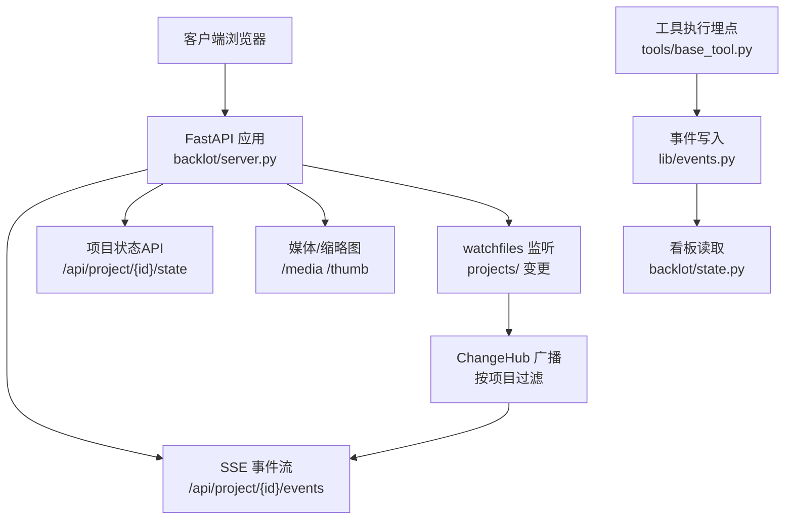
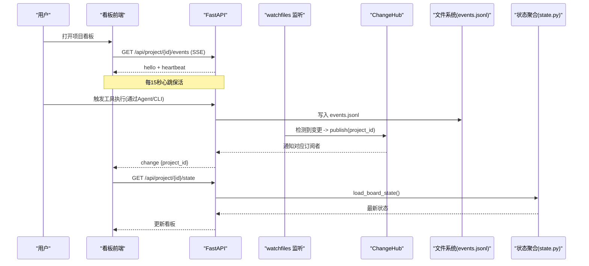
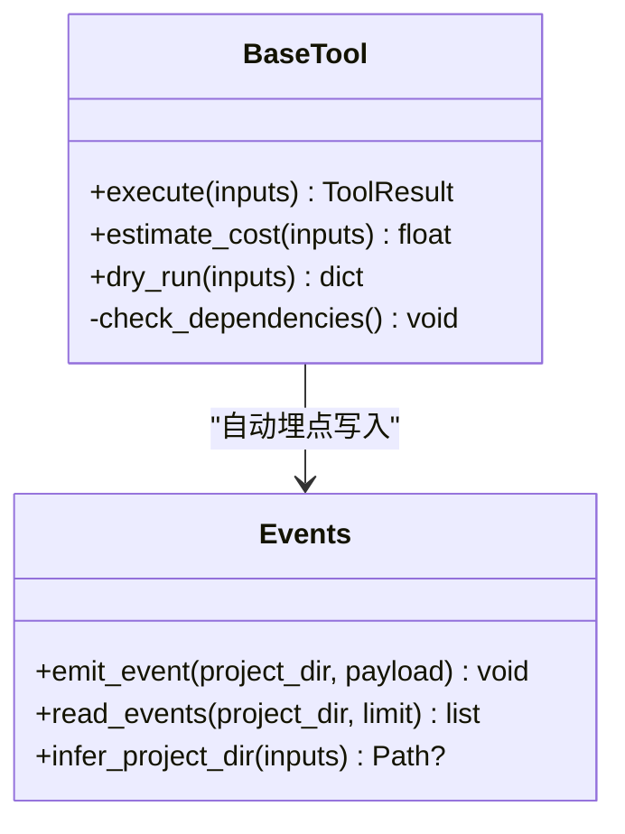
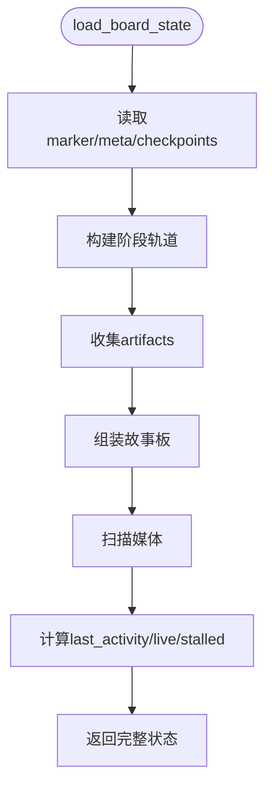
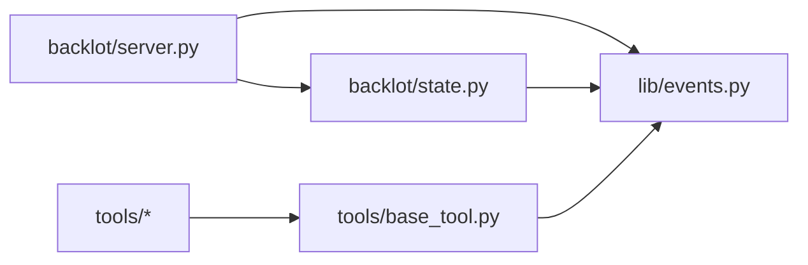

# 并发与负载均衡

<cite>
**本文引用的文件**
- [README.md](file://README.md)
- [config.yaml](file://config.yaml)
- [backlot/server.py](file://backlot/server.py)
- [backlot/__main__.py](file://backlot/__main__.py)
- [backlot/state.py](file://backlot/state.py)
- [lib/events.py](file://lib/events.py)
- [tools/base_tool.py](file://tools/base_tool.py)
</cite>

## 目录
1. [简介](#简介)
2. [项目结构](#项目结构)
3. [核心组件](#核心组件)
4. [架构总览](#架构总览)
5. [详细组件分析](#详细组件分析)
6. [依赖关系分析](#依赖关系分析)
7. [性能考量](#性能考量)
8. [故障排查指南](#故障排查指南)
9. [结论](#结论)
10. [附录](#附录)

## 简介
本指南聚焦于OpenMontage的并发处理与负载均衡实践，围绕以下目标展开：
- 异步编程模式：事件驱动、后台任务、SSE流式推送、阻塞IO隔离。
- FastAPI服务器并发配置：工作进程数、请求超时、连接池等生产化建议。
- 负载均衡策略：API限流、重试退避、健康检查、故障转移。
- 消息队列与流水线：在视频生成/转码/合成等长耗时任务中的队列化与解耦思路。
- 分布式扩展性：微服务拆分、数据分片、缓存策略与可观测性。

说明：仓库中Backlot是一个基于FastAPI的本地可视化看板服务；工具层通过事件日志与文件系统实现“无锁”的事件驱动流水线；外部AI/媒体服务调用普遍采用异步提交+轮询或回调的模式。

## 项目结构
OpenMontage将“编排（Agent + 技能）”和“执行（工具 + 渲染）”解耦，Backlot作为轻量级Web服务提供实时看板与媒体访问能力。关键路径：
- backlot/server.py：FastAPI应用、SSE事件流、静态资源、缩略图与媒体路由。
- backlot/__main__.py：CLI入口，使用uvicorn启动单进程服务。
- lib/events.py：追加式事件日志（events.jsonl），用于看板活动追踪。
- tools/base_tool.py：工具基类与自动埋点，统一执行生命周期与成本估算。
- config.yaml：全局配置（LLM、预算、输出参数、路径）。



图表来源
- [backlot/server.py:151-240](file://backlot/server.py#L151-L240)
- [lib/events.py:77-119](file://lib/events.py#L77-L119)
- [backlot/state.py:588-658](file://backlot/state.py#L588-L658)

章节来源
- [README.md:150-176](file://README.md#L150-L176)
- [backlot/server.py:1-369](file://backlot/server.py#L1-L369)
- [backlot/__main__.py:1-110](file://backlot/__main__.py#L1-L110)
- [config.yaml:1-34](file://config.yaml#L1-L34)

## 核心组件
- Backlot FastAPI服务：提供健康检查、项目列表、项目状态、SSE事件流、媒体与缩略图服务。
- 事件系统：append-only JSONL事件日志，支持线程安全写入与容错读取。
- 工具基类：统一execute生命周期、成本估算、依赖检查、子进程执行封装，并自动注入事件埋点。
- 看板状态聚合：从checkpoint/artifacts/events推导阶段轨道、故事板、媒体索引与活跃状态。

章节来源
- [backlot/server.py:165-307](file://backlot/server.py#L165-L307)
- [lib/events.py:1-119](file://lib/events.py#L1-L119)
- [tools/base_tool.py:148-236](file://tools/base_tool.py#L148-L236)
- [backlot/state.py:588-658](file://backlot/state.py#L588-L658)

## 架构总览
OpenMontage采用“事件驱动 + 文件系统持久化”的轻量分布式模式：
- Agent通过工具执行产生事件，写入events.jsonl。
- Backlot通过watchfiles监听projects目录变化，向订阅者广播变更。
- 前端通过SSE拉取变更，刷新看板UI。
- 媒体与缩略图通过FastAPI直接提供，避免额外服务。



图表来源
- [backlot/server.py:183-240](file://backlot/server.py#L183-L240)
- [backlot/server.py:132-149](file://backlot/server.py#L132-L149)
- [lib/events.py:77-119](file://lib/events.py#L77-L119)
- [backlot/state.py:588-658](file://backlot/state.py#L588-L658)

## 详细组件分析

### Backlot FastAPI服务与SSE事件流
- 健康检查：/api/health返回应用状态，便于外部探针进行存活检测。
- SSE事件流：/api/project/{id}/events与/api/library/events提供细粒度变更推送，内置心跳与去抖合并。
- 背景任务：_watch_projects使用watchfiles监听projects目录，批量变更时仅广播受影响的项目ID。
- 静态资源与缓存控制：/ui与页面强制no-cache，媒体响应保持正常缓存。

```mermaid
flowchart TD
Start(["请求进入"]) --> CheckPath{"路径匹配?"}
CheckPath --> |/api/health| Health["返回健康状态"]
CheckPath --> |/api/project/{id}/events| SSE["建立SSE流"]
CheckPath --> |/api/project/{id}/state| State["读取项目状态"]
CheckPath --> |/media /thumb| Media["返回媒体/缩略图"]
SSE --> Heartbeat{"心跳超时?"}
Heartbeat --> |是| SendHB["发送heartbeat"]
Heartbeat --> |否| Drain["合并队列事件"]
Drain --> SendChange["发送change"]
SendHB --> SSE
SendChange --> SSE
```

图表来源
- [backlot/server.py:170-240](file://backlot/server.py#L170-L240)
- [backlot/server.py:299-307](file://backlot/server.py#L299-L307)

章节来源
- [backlot/server.py:151-307](file://backlot/server.py#L151-L307)

### 事件系统与工具埋点
- 工具执行自动埋点：BaseTool对execute包装，记录start/finish/error到events.jsonl，包含工具名、场景ID、深度、耗时与成本。
- 事件写入：线程锁保证同进程内顺序写入；跨进程写入不保证原子行，但读取会跳过损坏行，确保看板不崩溃。
- 项目归属推断：根据输入参数中的路径或显式project_dir推断所属项目，避免误写。



图表来源
- [tools/base_tool.py:148-236](file://tools/base_tool.py#L148-L236)
- [lib/events.py:46-119](file://lib/events.py#L46-L119)

章节来源
- [tools/base_tool.py:148-236](file://tools/base_tool.py#L148-L236)
- [lib/events.py:1-119](file://lib/events.py#L1-L119)

### 看板状态聚合与活跃检测
- 阶段轨道：从manifest或回退阶段集合构建stage rail，标注gated、status、历史版本与人工审批审计。
- 故事板：关联scene_plan、script、asset_manifest与live events，计算每个场景的视觉/音频资产、生成态与时长。
- 媒体索引：扫描renders/snapshots/music等目录，提供poster选择逻辑。
- 活跃与停滞检测：基于最后活动时间与阈值判断live/stalled。



图表来源
- [backlot/state.py:588-658](file://backlot/state.py#L588-L658)
- [backlot/state.py:403-495](file://backlot/state.py#L403-L495)
- [backlot/state.py:502-562](file://backlot/state.py#L502-L562)

章节来源
- [backlot/state.py:588-658](file://backlot/state.py#L588-L658)

### 启动方式与工作进程
- CLI：python -m backlot serve [--port N] 使用uvicorn运行单进程服务。
- 健康探测：open命令会检查/api/health以确认服务就绪。
- 生产建议：如需多进程/多worker，可通过环境变量或命令行参数调整uvicorn worker数量（例如 --workers），并结合反向代理（Nginx/Caddy）做负载均衡与健康检查。

章节来源
- [backlot/__main__.py:82-86](file://backlot/__main__.py#L82-L86)
- [backlot/__main__.py:30-36](file://backlot/__main__.py#L30-L36)

## 依赖关系分析
- FastAPI服务依赖watchfiles、uvicorn、PIL/FFmpeg（缩略图）、以及lib.events与backlot.state。
- 工具层通过BaseTool抽象统一接口，所有具体工具继承后自动获得事件埋点与执行生命周期管理。
- 看板状态聚合依赖pipeline manifest、checkpoint、artifacts与events.jsonl。



图表来源
- [backlot/server.py:165-307](file://backlot/server.py#L165-L307)
- [tools/base_tool.py:227-373](file://tools/base_tool.py#L227-L373)
- [backlot/state.py:588-658](file://backlot/state.py#L588-L658)

章节来源
- [backlot/server.py:165-307](file://backlot/server.py#L165-L307)
- [tools/base_tool.py:227-373](file://tools/base_tool.py#L227-L373)
- [backlot/state.py:588-658](file://backlot/state.py#L588-L658)

## 性能考量
- 事件写入与读取：
  - 写入使用线程锁串行化，避免同进程竞争；读取容忍损坏行，保障看板可用性。
  - 建议在高吞吐场景下考虑独立事件总线（如Redis Streams/Kafka）以降低磁盘I/O压力。
- SSE心跳与去抖：
  - 固定心跳间隔减少空转；队列合并降低突发流量对前端的冲击。
- 缩略图与媒体：
  - 缩略图缓存至磁盘，避免重复转码；大文件建议使用Range请求与CDN加速。
- 阻塞IO隔离：
  - 使用asyncio.to_thread将同步操作（如PIL/FFmpeg）放入线程池，避免阻塞事件循环。
- 外部API调用：
  - 推荐异步HTTP客户端（aiohttp/httpx）+ 指数退避重试 + 熔断器，结合速率限制与配额监控。

[本节为通用性能建议，不直接分析具体文件]

## 故障排查指南
- 服务不可用：
  - 检查/api/health是否返回200；确认端口未被占用；查看uvicorn日志。
- 看板不更新：
  - 确认watchfiles已安装且能监听projects目录；检查events.jsonl是否被写入；验证SSE连接是否断开。
- 媒体无法显示：
  - 确认文件在项目目录内且后缀合法；缩略图生成失败时会降级为原始文件或404。
- 工具执行异常：
  - 查看events.jsonl中的error条目；检查依赖是否满足（二进制/模块/环境变量）；核对子进程执行错误信息。

章节来源
- [backlot/server.py:170-173](file://backlot/server.py#L170-L173)
- [backlot/server.py:244-276](file://backlot/server.py#L244-L276)
- [lib/events.py:77-119](file://lib/events.py#L77-L119)
- [tools/base_tool.py:304-328](file://tools/base_tool.py#L304-L328)

## 结论
OpenMontage通过“事件驱动 + 文件系统持久化”的轻量架构实现了高可用的看板与流水线可观测性。FastAPI服务提供SSE实时推送与媒体服务，工具层统一执行生命周期与埋点，配合watchfiles实现低耦合的状态同步。面向生产环境，建议引入多进程/多worker、反向代理、连接池、限流与熔断机制，并在高吞吐场景下将事件系统迁移至消息队列，以提升可扩展性与稳定性。

[本节为总结性内容，不直接分析具体文件]

## 附录

### 异步编程模式与实践
- 事件驱动：watchfiles监听文件系统变更，ChangeHub按项目广播，SSE推送给前端。
- 后台任务：_watch_projects作为独立协程运行，随应用生命周期启停。
- 阻塞IO隔离：同步操作通过asyncio.to_thread执行，避免阻塞事件循环。
- 长任务处理：外部API采用提交+轮询或回调模式，工具层通过事件记录进度与结果。

章节来源
- [backlot/server.py:132-149](file://backlot/server.py#L132-L149)
- [backlot/server.py:151-163](file://backlot/server.py#L151-L163)
- [backlot/server.py:174-181](file://backlot/server.py#L174-L181)
- [lib/events.py:77-119](file://lib/events.py#L77-L119)

### FastAPI服务器并发配置建议
- 工作进程数：默认单进程；生产环境可通过uvicorn --workers设置多进程，结合反向代理做负载均衡。
- 请求超时：根据业务设置超时（如媒体上传/转码），避免长连接占用过多资源。
- 连接池：对外部HTTP调用使用连接池（aiohttp/httpx），复用TCP连接，降低握手开销。
- 静态资源：启用CDN与缓存头，减轻后端压力。

[本节为通用配置建议，不直接分析具体文件]

### 负载均衡策略
- API限流：客户端侧实现令牌桶/漏桶，结合服务端429响应与Retry-After头进行退避。
- 重试与退避：指数退避+最大重试次数，避免雪崩。
- 健康检查：定期探测/api/health，失败则剔除节点。
- 故障转移：多实例部署，健康检查失败时切换至备用实例。

[本节为通用策略建议，不直接分析具体文件]

### 消息队列与流水线
- 适用场景：视频生成、转码、合成等长耗时任务，建议通过队列解耦生产者与消费者。
- 技术选型：RabbitMQ/Kafka/Redis Streams，结合Celery或自定义Worker消费任务。
- 可靠性：幂等设计、死信队列、重试与补偿机制。
- 可观测性：任务指标、延迟分布、错误率与资源使用监控。

[本节为通用架构建议，不直接分析具体文件]

### 分布式扩展性设计
- 微服务拆分：将Backlot、工具执行、媒体处理、事件总线拆分为独立服务，通过API/消息通信。
- 数据分片：按project_id或pipeline_type分片存储，提升读写性能与隔离性。
- 缓存策略：热点项目状态、缩略图、模型元数据使用Redis缓存，降低数据库/磁盘压力。
- 可观测性：集中日志、指标采集与链路追踪，支撑容量规划与故障定位。

[本节为通用设计建议，不直接分析具体文件]