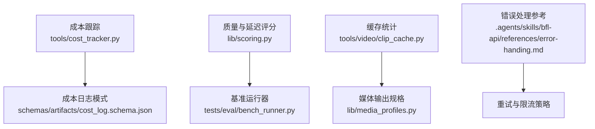
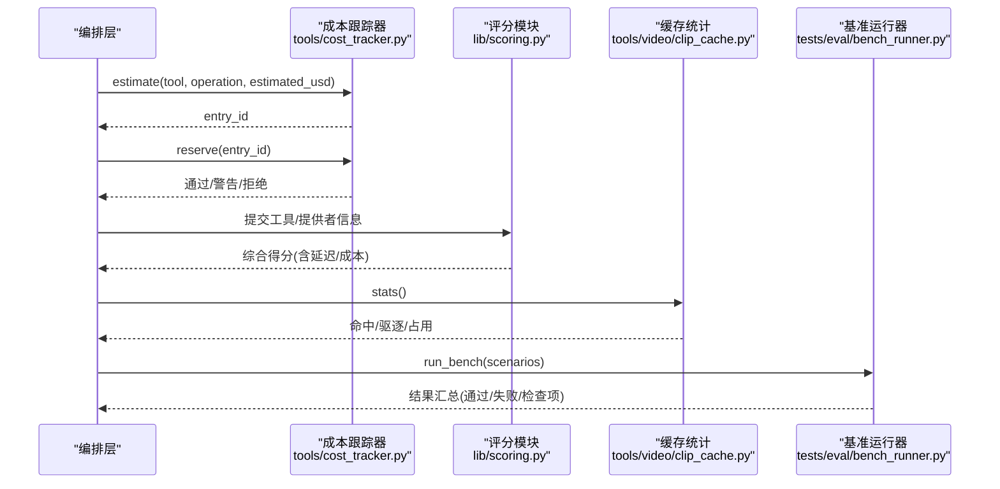
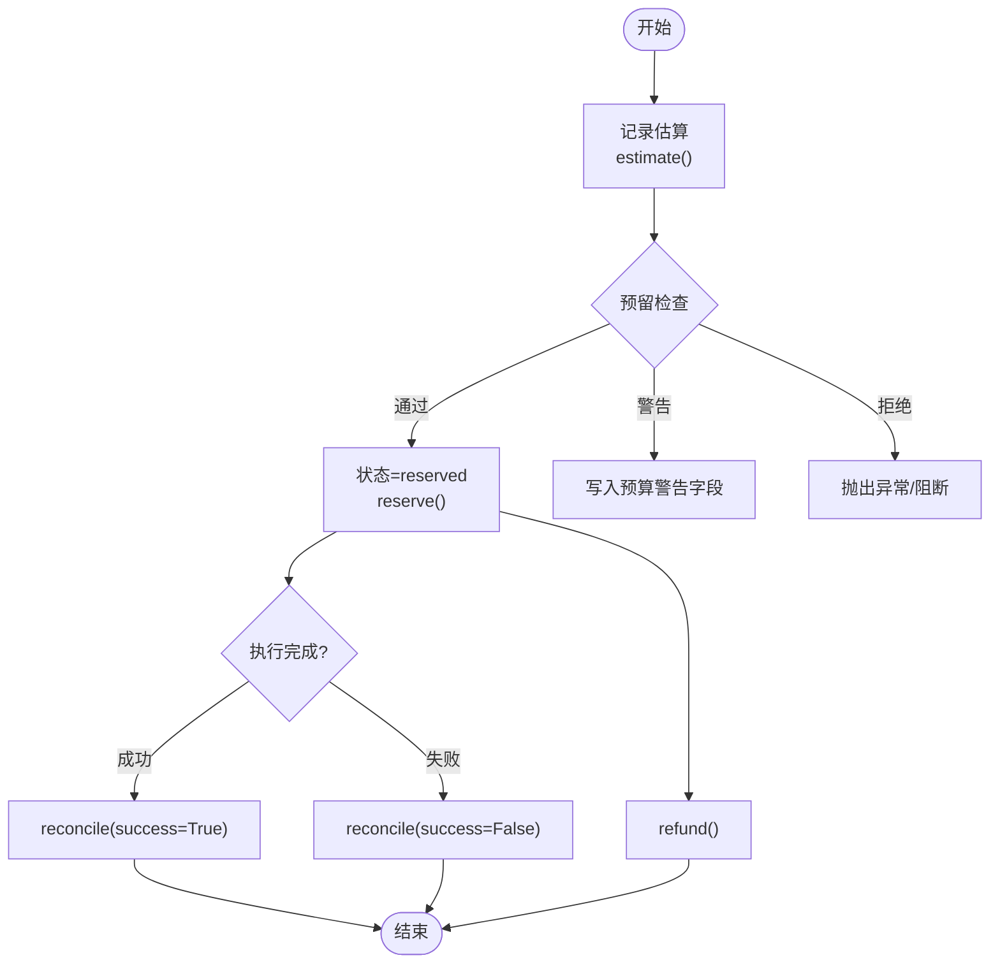
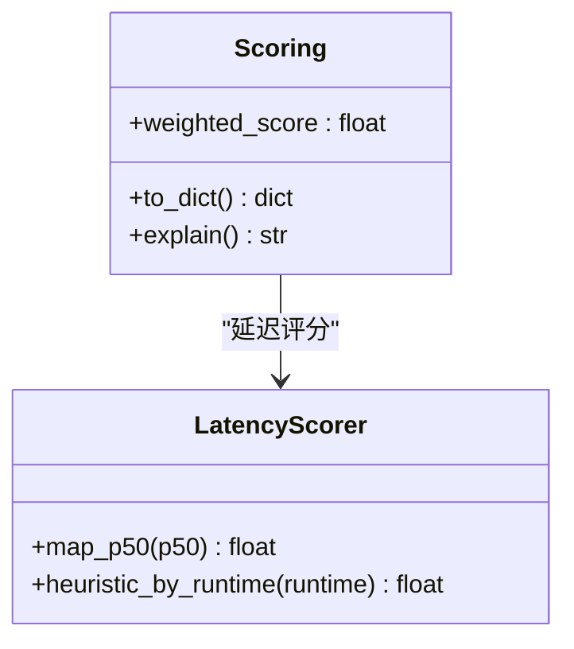
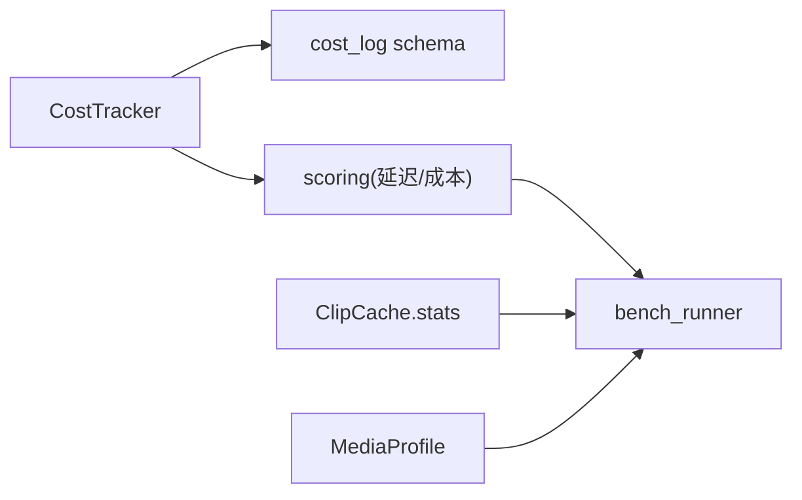

# 性能监控

<cite>
**本文引用的文件**
- [tools/cost_tracker.py](file://tools/cost_tracker.py)
- [schemas/artifacts/cost_log.schema.json](file://schemas/artifacts/cost_log.schema.json)
- [lib/scoring.py](file://lib/scoring.py)
- [tests/eval/bench_runner.py](file://tests/eval/bench_runner.py)
- [tools/video/clip_cache.py](file://tools/video/clip_cache.py)
- [lib/media_profiles.py](file://lib/media_profiles.py)
- [.agents/skills/bfl-api/references/error-handling.md](file://.agents/skills/bfl-api/references/error-handling.md)
</cite>

## 目录
1. [简介](#简介)
2. [项目结构](#项目结构)
3. [核心组件](#核心组件)
4. [架构总览](#架构总览)
5. [详细组件分析](#详细组件分析)
6. [依赖关系分析](#依赖关系分析)
7. [性能考量](#性能考量)
8. [故障排查指南](#故障排查指南)
9. [结论](#结论)
10. [附录](#附录)

## 简介
本指南面向OpenMontage的性能监控与可观测性建设，聚焦以下目标：
- 定义并采集关键性能指标：响应时间、吞吐量、错误率、成本与预算使用等。
- 设计并实现监控系统：结合Prometheus与Grafana进行指标暴露与可视化（集成建议）。
- 提供Python性能剖析工具的使用建议：如cProfile、memory_profiler等（实践建议）。
- 配置日志记录与分布式追踪：结构化日志、链路追踪（实践建议）。
- 建立告警机制：阈值告警、异常检测、自动恢复（实践建议）。
- 制定性能测试与基准测试最佳实践：场景化压测、回归基线、结果对比。

本指南严格基于仓库现有能力与约定进行说明，并在需要处给出工程化落地建议。

## 项目结构
OpenMontage在性能相关方面提供了以下基础能力：
- 成本与预算治理：通过CostTracker对估算、预留、实际花费进行全生命周期管理，并持久化到cost_log.json。
- 质量与延迟评分：scoring模块将延迟、可靠性、成本效率等维度纳入综合评分，便于横向比较不同工具/提供者。
- 缓存统计：ClipCache提供命中/未命中/驱逐等运行时统计快照，用于评估I/O与存储压力。
- 媒体输出规格：MediaProfile集中平台渲染参数，有助于控制资源消耗与输出一致性。
- 基准运行器：bench_runner提供场景化执行与结果汇总，适合构建性能回归基线。



**图示来源**
- [tools/cost_tracker.py:1-524](file://tools/cost_tracker.py#L1-L524)
- [schemas/artifacts/cost_log.schema.json:1-35](file://schemas/artifacts/cost_log.schema.json#L1-L35)
- [lib/scoring.py:35-75](file://lib/scoring.py#L35-L75)
- [tests/eval/bench_runner.py:1-200](file://tests/eval/bench_runner.py#L1-L200)
- [tools/video/clip_cache.py:445-472](file://tools/video/clip_cache.py#L445-L472)
- [lib/media_profiles.py:1-166](file://lib/media_profiles.py#L1-L166)
- [.agents/skills/bfl-api/references/error-handling.md:148-264](file://.agents/skills/bfl-api/references/error-handling.md#L148-L264)

**章节来源**
- [tools/cost_tracker.py:1-524](file://tools/cost_tracker.py#L1-L524)
- [schemas/artifacts/cost_log.schema.json:1-35](file://schemas/artifacts/cost_log.schema.json#L1-L35)
- [lib/scoring.py:35-75](file://lib/scoring.py#L35-L75)
- [tests/eval/bench_runner.py:1-200](file://tests/eval/bench_runner.py#L1-L200)
- [tools/video/clip_cache.py:445-472](file://tools/video/clip_cache.py#L445-L472)
- [lib/media_profiles.py:1-166](file://lib/media_profiles.py#L1-L166)
- [.agents/skills/bfl-api/references/error-handling.md:148-264](file://.agents/skills/bfl-api/references/error-handling.md#L148-L264)

## 核心组件
- 成本跟踪器（CostTracker）
  - 功能：估算、预留、结算、退款；支持观察/警告/封顶三种模式；单动作审批与新增付费工具审批；持久化到cost_log.json。
  - 关键指标：已花费、已预留、剩余可用预算、单次操作成本是否超阈。
  - 适用场景：外部API调用、本地推理任务的成本治理与审计。
- 质量与延迟评分（scoring）
  - 功能：将任务适配度、输出质量、可控性、可靠性、成本效率、延迟、连续性等加权计算为综合得分；延迟评分支持历史p50或运行时启发式。
  - 适用场景：工具/提供者选择、回归对比、SLA评估。
- 缓存统计（ClipCache.stats）
  - 功能：返回缓存条目数、占用空间、命中率、驱逐次数等快照。
  - 适用场景：I/O热点识别、容量规划、吞吐优化。
- 媒体输出规格（MediaProfile）
  - 功能：统一平台分辨率、帧率、编码、CRF、时长/大小限制等。
  - 适用场景：控制渲染资源消耗、保证输出一致性与合规。
- 基准运行器（bench_runner）
  - 功能：按标签筛选场景矩阵执行，汇总通过/失败与检查项，支持详细输出。
  - 适用场景：性能回归、质量门禁、变更影响评估。

**章节来源**
- [tools/cost_tracker.py:40-180](file://tools/cost_tracker.py#L40-L180)
- [lib/scoring.py:35-75](file://lib/scoring.py#L35-L75)
- [lib/scoring.py:424-451](file://lib/scoring.py#L424-L451)
- [tools/video/clip_cache.py:445-472](file://tools/video/clip_cache.py#L445-L472)
- [lib/media_profiles.py:22-166](file://lib/media_profiles.py#L22-L166)
- [tests/eval/bench_runner.py:1-200](file://tests/eval/bench_runner.py#L1-L200)

## 架构总览
下图展示OpenMontage在性能监控方面的数据流与组件交互：成本估算与结算驱动预算治理；质量评分融合延迟与成本；缓存统计反映I/O压力；基准运行器串联场景执行与结果汇总。



**图示来源**
- [tools/cost_tracker.py:101-179](file://tools/cost_tracker.py#L101-L179)
- [lib/scoring.py:35-75](file://lib/scoring.py#L35-L75)
- [lib/scoring.py:424-451](file://lib/scoring.py#L424-L451)
- [tools/video/clip_cache.py:445-472](file://tools/video/clip_cache.py#L445-L472)
- [tests/eval/bench_runner.py:478-491](file://tests/eval/bench_runner.py#L478-L491)

## 详细组件分析

### 成本跟踪器（CostTracker）
- 职责
  - 估算：记录工具与操作的预估成本，生成唯一ID。
  - 预留：校验单动作审批、新增付费工具审批、可用预算；在警告模式下标记预算警告。
  - 结算：根据执行成功与否更新实际花费，释放预留额度。
  - 退款：取消预留且不执行。
  - 持久化：写入cost_log.json，遵循schema约束。
- 关键流程


**图示来源**
- [tools/cost_tracker.py:101-179](file://tools/cost_tracker.py#L101-L179)

**章节来源**
- [tools/cost_tracker.py:101-179](file://tools/cost_tracker.py#L101-L179)
- [schemas/artifacts/cost_log.schema.json:1-35](file://schemas/artifacts/cost_log.schema.json#L1-L35)

### 质量与延迟评分（scoring）
- 职责
  - 多维度加权评分：任务适配度、输出质量、可控性、可靠性、成本效率、延迟、连续性。
  - 延迟评分：优先使用历史p50，否则按运行时类型启发式打分。
- 适用场景
  - 工具/提供者选择、SLA达成评估、回归对比。



**图示来源**
- [lib/scoring.py:35-75](file://lib/scoring.py#L35-L75)
- [lib/scoring.py:424-451](file://lib/scoring.py#L424-L451)

**章节来源**
- [lib/scoring.py:35-75](file://lib/scoring.py#L35-L75)
- [lib/scoring.py:424-451](file://lib/scoring.py#L424-L451)

### 缓存统计（ClipCache.stats）
- 职责
  - 提供缓存命中/未命中/驱逐/占用等运行时快照，辅助定位I/O瓶颈与容量规划。
- 关键指标
  - 条目数、总字节、会话内命中/未命中/驱逐计数、驱逐字节、锁后端类型。

```mermaid
flowchart TD
S(["进入stats()"]) --> Read["读取清单"]
Read --> Sum["累计字节/计算占比"]
Sum --> Build["组装快照字典"]
Build --> Return(["返回统计"))
```

**图示来源**
- [tools/video/clip_cache.py:445-472](file://tools/video/clip_cache.py#L445-L472)

**章节来源**
- [tools/video/clip_cache.py:445-472](file://tools/video/clip_cache.py#L445-L472)

### 媒体输出规格（MediaProfile）
- 职责
  - 集中平台渲染参数（分辨率、帧率、编码、CRF、时长/大小限制），确保输出一致性与资源可控。
- 适用场景
  - 渲染管线参数标准化、容量与带宽预估、合规性检查。

**章节来源**
- [lib/media_profiles.py:22-166](file://lib/media_profiles.py#L22-L166)

### 基准运行器（bench_runner）
- 职责
  - 按标签筛选场景矩阵执行，汇总通过/失败与检查项，支持详细输出；失败时以非零退出码反馈。
- 适用场景
  - 性能回归、质量门禁、变更影响评估。

**章节来源**
- [tests/eval/bench_runner.py:1-200](file://tests/eval/bench_runner.py#L1-L200)
- [tests/eval/bench_runner.py:478-491](file://tests/eval/bench_runner.py#L478-L491)

## 依赖关系分析
- 成本跟踪器依赖预算模式与持久化schema，确保成本数据的规范与可追溯。
- 评分模块依赖延迟与成本信息，形成“性能-成本”联合评估。
- 缓存统计独立于业务逻辑，提供通用I/O观测点。
- 基准运行器作为编排入口，串联各组件产出，形成闭环验证。



**图示来源**
- [tools/cost_tracker.py:101-179](file://tools/cost_tracker.py#L101-L179)
- [schemas/artifacts/cost_log.schema.json:1-35](file://schemas/artifacts/cost_log.schema.json#L1-L35)
- [lib/scoring.py:35-75](file://lib/scoring.py#L35-L75)
- [tests/eval/bench_runner.py:478-491](file://tests/eval/bench_runner.py#L478-L491)
- [tools/video/clip_cache.py:445-472](file://tools/video/clip_cache.py#L445-L472)
- [lib/media_profiles.py:22-166](file://lib/media_profiles.py#L22-L166)

**章节来源**
- [tools/cost_tracker.py:101-179](file://tools/cost_tracker.py#L101-L179)
- [schemas/artifacts/cost_log.schema.json:1-35](file://schemas/artifacts/cost_log.schema.json#L1-L35)
- [lib/scoring.py:35-75](file://lib/scoring.py#L35-L75)
- [tests/eval/bench_runner.py:478-491](file://tests/eval/bench_runner.py#L478-L491)
- [tools/video/clip_cache.py:445-472](file://tools/video/clip_cache.py#L445-L472)
- [lib/media_profiles.py:22-166](file://lib/media_profiles.py#L22-L166)

## 性能考量
- 指标定义与采集建议
  - 响应时间：在关键路径（估算、预留、结算、渲染、I/O）埋点，采集p50/p95/p99。
  - 吞吐量：单位时间内处理的请求/任务数，区分成功与失败。
  - 错误率：按错误分类统计（认证、限流、超时、内部错误），结合重试策略评估。
  - 成本与预算：通过CostTracker的已花费/已预留/剩余预算，结合评分模块的延迟与成本效率维度。
  - I/O与缓存：通过ClipCache.stats获取命中/未命中/驱逐，指导缓存扩容与淘汰策略。
- 资源与输出控制
  - 使用MediaProfile统一渲染参数，避免过度资源消耗与不一致输出。
- 基准与回归
  - 使用bench_runner构建场景矩阵，定期执行并对比结果，发现性能退化。

[本节为通用指导，不直接分析具体文件]

## 故障排查指南
- 错误分类与重试
  - 参考错误处理文档中的重试策略与错误分类，针对429/5xx等可重试错误实施指数退避与抖动。
  - 对于不可重试错误（如认证失败、内容违规）快速失败并上报。
- 预算超限与审批
  - 当预留金额超过可用预算或在封顶模式下，会抛出预算超限异常；警告模式下记录预算警告。
  - 单动作审批阈值与新增付费工具审批可在非观察模式下触发阻断。
- 日志与上下文
  - 建议在关键路径记录结构化日志（请求、负载、错误上下文），便于问题定位与根因分析。

**章节来源**
- [.agents/skills/bfl-api/references/error-handling.md:148-264](file://.agents/skills/bfl-api/references/error-handling.md#L148-L264)
- [tools/cost_tracker.py:117-157](file://tools/cost_tracker.py#L117-L157)

## 结论
OpenMontage已具备成本治理、质量评分、缓存统计与基准运行的基础能力。围绕这些能力，可以构建完整的性能监控体系：
- 指标层：响应时间、吞吐量、错误率、成本与预算、I/O与缓存。
- 采集层：在关键路径埋点，结合CostTracker与ClipCache.stats输出结构化指标。
- 可视化层：对接Prometheus与Grafana，建立仪表盘与看板。
- 告警层：基于阈值与异常检测设置告警，结合重试与自动恢复策略。
- 评测层：通过bench_runner持续回归，保障性能稳定与可预期。

[本节为总结性内容，不直接分析具体文件]

## 附录
- Prometheus与Grafana集成建议（实践建议）
  - 指标暴露：在服务端暴露HTTP /metrics端点，导出自定义指标（如预算使用、命中率、延迟分位）。
  - 抓取与存储：使用Prometheus定期抓取，长期存储至TSDB。
  - 可视化：在Grafana中创建仪表盘，展示关键指标趋势与分布。
  - 告警：配置阈值告警（如错误率突增、延迟P99超标、预算使用接近上限）。
- Python性能剖析工具（实践建议）
  - cProfile：用于CPU热点定位，结合火焰图分析函数调用开销。
  - memory_profiler：用于内存使用分析，识别泄漏与峰值。
  - 结合日志与追踪：在关键路径记录结构化日志与链路ID，便于跨服务追踪。
- 分布式追踪（实践建议）
  - 采用OpenTelemetry或类似方案，注入trace/span，关联外部API调用与本地处理。
  - 将trace ID与日志关联，提升问题定位效率。
- 性能测试与基准测试最佳实践
  - 场景化：覆盖典型与边界场景，包含高并发与长尾延迟。
  - 基线化：建立性能基线与回归阈值，自动化执行并报告。
  - 对比分析：关注变化趋势与显著性差异，避免误报。

[本节为通用指导，不直接分析具体文件]