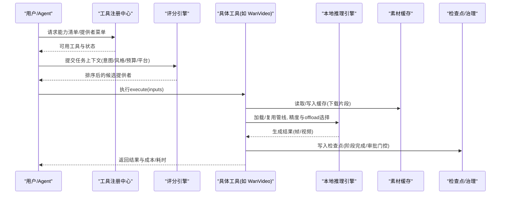
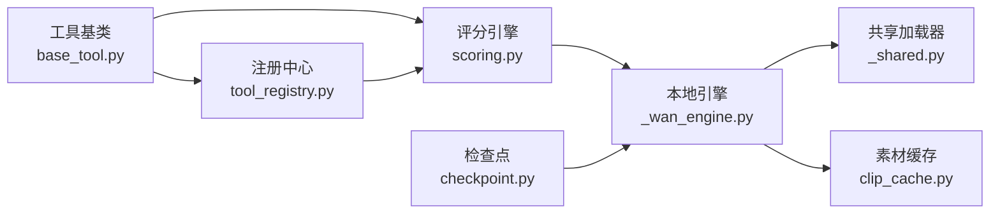

# 性能调优

<cite>
**本文引用的文件**
- [README.md](file://README.md)
- [config.yaml](file://config.yaml)
- [tools/base_tool.py](file://tools/base_tool.py)
- [tools/tool_registry.py](file://tools/tool_registry.py)
- [lib/scoring.py](file://lib/scoring.py)
- [lib/checkpoint.py](file://lib/checkpoint.py)
- [tools/video/_wan_engine.py](file://tools/video/_wan_engine.py)
- [tools/video/clip_cache.py](file://tools/video/clip_cache.py)
- [tools/video/_shared.py](file://tools/video/_shared.py)
- [tests/contracts/test_wan_video.py](file://tests/contracts/test_wan_video.py)
</cite>

## 目录
1. [简介](#简介)
2. [项目结构](#项目结构)
3. [核心组件](#核心组件)
4. [架构总览](#架构总览)
5. [详细组件分析](#详细组件分析)
6. [依赖关系分析](#依赖关系分析)
7. [性能考量](#性能考量)
8. [故障排查指南](#故障排查指南)
9. [结论](#结论)
10. [附录](#附录)

## 简介
本指南面向OpenMontage的生产与运维团队，聚焦高负载下的系统稳定性与响应速度。内容覆盖：
- Python代码优化、数据库/外部API调用优化（含并发与重试）
- 缓存策略（本地LRU、进程安全缓存、模型管线缓存）
- AI模型加载与推理优化（精度选择、显存管理、分段生成、批处理思路）
- 资源配置建议（CPU、内存、GPU分配与调度）
- 并发与负载均衡（线程池、队列、连接复用）
- 性能监控与分析（执行埋点、耗时统计、瓶颈识别、优化建议）

## 项目结构
OpenMontage以“工具+编排”为核心：工具层提供音视频生成、编辑、增强等能力；编排层通过管道定义、技能说明与评分引擎驱动生产流程。关键路径包括：
- 工具注册与发现：自动扫描并注册所有工具，暴露能力清单与状态
- 评分与选择：基于多维指标对候选提供者打分，兼顾质量、成本、延迟与连续性
- 检查点与治理：阶段化持久化、前置校验、人类审批门控
- 本地视频生成：Wan系列模型的精度自适应、显存卸载、分段拼接

```mermaid
graph TB
A["工具注册中心<br/>tools/tool_registry.py"] --> B["提供者评分引擎<br/>lib/scoring.py"]
B --> C["具体工具实现<br/>tools/* (如 WanVideo)"]
C --> D["本地推理引擎<br/>tools/video/_wan_engine.py"]
C --> E["素材缓存<br/>tools/video/clip_cache.py"]
C --> F["共享加载器<br/>tools/video/_shared.py"]
G["基类与执行埋点<br/>tools/base_tool.py"] --> C
H["检查点与治理<br/>lib/checkpoint.py"] --> C
```

图表来源
- [tools/tool_registry.py:118-134](file://tools/tool_registry.py#L118-L134)
- [lib/scoring.py:373-542](file://lib/scoring.py#L373-L542)
- [tools/video/_wan_engine.py:179-272](file://tools/video/_wan_engine.py#L179-L272)
- [tools/video/clip_cache.py:177-216](file://tools/video/clip_cache.py#L177-L216)
- [tools/video/_shared.py:330-365](file://tools/video/_shared.py#L330-L365)
- [tools/base_tool.py:227-236](file://tools/base_tool.py#L227-L236)
- [lib/checkpoint.py:422-564](file://lib/checkpoint.py#L422-L564)

章节来源
- [README.md:450-475](file://README.md#L450-L475)

## 核心组件
- 工具基类与执行埋点：统一接口、依赖检查、耗时与成本记录、Backlot事件上报
- 工具注册中心：动态发现、能力汇总、可用性报告、GPU/网络需求统计
- 评分引擎：任务匹配、输出质量、控制力、可靠性、成本效率、延迟、连续性加权打分
- 检查点与治理：阶段顺序、先决条件、人类审批门控、决策日志合并
- 本地视频引擎：精度自适应、显存卸载、VAE切片/平铺、分段生成、OOM诊断与建议
- 素材缓存：进程安全的LRU缓存，按容量淘汰，支持并发锁

章节来源
- [tools/base_tool.py:25-60](file://tools/base_tool.py#L25-L60)
- [tools/base_tool.py:148-236](file://tools/base_tool.py#L148-L236)
- [tools/tool_registry.py:55-134](file://tools/tool_registry.py#L55-L134)
- [lib/scoring.py:21-70](file://lib/scoring.py#L21-L70)
- [lib/scoring.py:373-542](file://lib/scoring.py#L373-L542)
- [lib/checkpoint.py:422-564](file://lib/checkpoint.py#L422-L564)
- [tools/video/_wan_engine.py:101-176](file://tools/video/_wan_engine.py#L101-L176)
- [tools/video/clip_cache.py:177-216](file://tools/video/clip_cache.py#L177-L216)

## 架构总览
下图展示一次典型视频生成的端到端流程，涵盖工具选择、评分、执行、缓存与检查点。



图表来源
- [tools/tool_registry.py:249-314](file://tools/tool_registry.py#L249-L314)
- [lib/scoring.py:373-542](file://lib/scoring.py#L373-L542)
- [tools/base_tool.py:148-236](file://tools/base_tool.py#L148-L236)
- [tools/video/_wan_engine.py:179-272](file://tools/video/_wan_engine.py#L179-L272)
- [tools/video/clip_cache.py:177-216](file://tools/video/clip_cache.py#L177-L216)
- [lib/checkpoint.py:422-564](file://lib/checkpoint.py#L422-L564)

## 详细组件分析

### 工具基类与执行埋点（Python代码优化与监控）
- 自动装饰execute：每个工具的execute被包装为可观测调用，记录start/finish/error、耗时、成本，并写入项目事件流，便于看板与回溯
- 依赖检查与状态上报：统一检测命令、环境变量、Python模块依赖，避免运行时失败
- 资源与重试策略：声明式资源轮廓与重试策略，便于调度器做容量规划
- 子进程调用标准化：跨平台解析可执行名、UTF-8解码、错误信息聚合，减少异常分支导致的性能抖动

优化要点
- 将昂贵I/O或计算放入独立工具，利用装饰器统一计时与错误上报
- 在execute中尽早失败（参数校验、依赖检查），减少无效计算
- 使用dry_run进行预检，提前估算成本与耗时，辅助排队与限流

章节来源
- [tools/base_tool.py:148-236](file://tools/base_tool.py#L148-L236)
- [tools/base_tool.py:296-328](file://tools/base_tool.py#L296-L328)
- [tools/base_tool.py:411-454](file://tools/base_tool.py#L411-L454)

### 工具注册中心（并发与负载均衡入口）
- 动态发现：导入tools包树，自动注册所有BaseTool子类，避免手工维护
- 能力视图：按能力/提供者/层级分组，输出“可用/不可用”清单，支撑前端菜单与Agent预检
- GPU/网络需求统计：快速筛选需要GPU或网络的工具，便于资源隔离与调度

优化要点
- 首次discover后缓存已发现包，避免重复导入开销
- 使用provider_menu_summary生成紧凑摘要，降低大对象序列化与传输成本
- 结合评分引擎，优先选择“可用且成本低”的提供者，提升吞吐

章节来源
- [tools/tool_registry.py:118-134](file://tools/tool_registry.py#L118-L134)
- [tools/tool_registry.py:249-314](file://tools/tool_registry.py#L249-L314)
- [tools/tool_registry.py:476-488](file://tools/tool_registry.py#L476-L488)

### 评分引擎（选择最优提供者，兼顾质量与成本）
- 多维度打分：任务匹配、输出质量、控制力、可靠性、成本效率、延迟、连续性
- 语义扩展：同义词簇与关键词重叠，提高匹配鲁棒性
- 预算感知：根据剩余预算调整成本效率得分，避免超支
- 连续性偏好：倾向与已有决策一致的提供者，减少风格漂移

优化要点
- 将高频任务上下文规范化，减少重复计算
- 对稳定工具赋予更高可靠性得分，降低波动风险
- 对“电影级/预告片”等场景给予额外加分，提升体验一致性

章节来源
- [lib/scoring.py:21-70](file://lib/scoring.py#L21-L70)
- [lib/scoring.py:205-232](file://lib/scoring.py#L205-L232)
- [lib/scoring.py:373-542](file://lib/scoring.py#L373-L542)

### 检查点与治理（阶段推进与审计）
- 阶段顺序与先决条件：仅允许已完成且通过审批的前置阶段推进
- 人类审批门控：强制awaiting_human状态，防止跳过审核直接完成
- 决策日志合并：多阶段决策累积到项目级日志，便于审计与回放
- 原子写入与历史归档：临时文件写入后替换，旧版本归档至history

优化要点
- 将长耗时阶段拆分为可检查点的小步骤，便于中断恢复
- 对频繁读写的检查点文件采用轻量格式与合理索引
- 结合评分与预算，限制高风险阶段的自动推进

章节来源
- [lib/checkpoint.py:251-346](file://lib/checkpoint.py#L251-L346)
- [lib/checkpoint.py:422-564](file://lib/checkpoint.py#L422-L564)

### 本地视频引擎（AI模型加载与推理优化）
- 精度自适应：根据显存与模型规模选择bf16/int8/int4，平衡质量与显存占用
- 显存卸载：model/sequential两种模式，小显存卡启用sequential释放激活空间
- VAE切片/平铺：降低长片段解码峰值内存，避免OOM
- 分段生成：当目标时长超过单次生成上限时，链式拼接片段，保持首帧一致
- OOM诊断：区分驱动不匹配与真实OOM，给出分辨率、精度、offload模式调整建议

优化要点
- 预热管线：启动时按需加载常用模型，减少冷启动延迟
- 批处理思路：同一批次内复用管线实例，减少重复加载
- 内存管理：及时释放中间张量，必要时触发gc与CUDA缓存清理
- 参数裁剪：按设备能力自动对齐帧数与分辨率，避免无效计算

章节来源
- [tools/video/_wan_engine.py:101-176](file://tools/video/_wan_engine.py#L101-L176)
- [tools/video/_wan_engine.py:179-272](file://tools/video/_wan_engine.py#L179-L272)
- [tools/video/_wan_engine.py:891-947](file://tools/video/_wan_engine.py#L891-L947)
- [tests/contracts/test_wan_video.py:328-396](file://tests/contracts/test_wan_video.py#L328-L396)

### 共享加载器（通用Diffusers管线加载）
- 设备与精度选择：CUDA优先bf16，否则float16；CPU强制float32
- 注意力切片：降低显存峰值，提升稳定性
- 统一封装：屏蔽不同pipeline差异，简化上层调用

优化要点
- 复用已加载管线，避免重复from_pretrained
- 在非GPU环境关闭不必要的优化开关

章节来源
- [tools/video/_shared.py:330-365](file://tools/video/_shared.py#L330-L365)

### 素材缓存（下载与复用）
- 进程安全：基于文件锁保护清单读写，避免并发竞争
- LRU淘汰：按总字节数限制，超出则按最近最少使用策略驱逐
- 运行期计数：命中/未命中/驱逐计数，便于评估缓存效果

优化要点
- 针对热点素材设置更大缓存上限
- 结合CDN或镜像源减少下载时间
- 定期清理过期或损坏条目

章节来源
- [tools/video/clip_cache.py:177-216](file://tools/video/clip_cache.py#L177-L216)

## 依赖关系分析
- 工具注册中心依赖工具基类，获取工具元数据与状态
- 评分引擎依赖工具能力描述与运行时信息，产出排序结果
- 本地视频引擎依赖共享加载器与硬件探测，决定精度与offload策略
- 检查点模块依赖管道定义与样式播放列表，确保阶段推进合规
- 素材缓存独立于推理链路，但显著影响端到端延迟



图表来源
- [tools/base_tool.py:227-236](file://tools/base_tool.py#L227-L236)
- [tools/tool_registry.py:118-134](file://tools/tool_registry.py#L118-L134)
- [lib/scoring.py:373-542](file://lib/scoring.py#L373-L542)
- [tools/video/_wan_engine.py:179-272](file://tools/video/_wan_engine.py#L179-L272)
- [tools/video/_shared.py:330-365](file://tools/video/_shared.py#L330-L365)
- [tools/video/clip_cache.py:177-216](file://tools/video/clip_cache.py#L177-L216)
- [lib/checkpoint.py:422-564](file://lib/checkpoint.py#L422-L564)

## 性能考量

### Python代码优化
- 尽早失败：在execute入口处校验参数与依赖，避免进入昂贵路径
- 减少重复计算：复用常量、缓存函数结果、避免循环内重复属性查找
- 并行化：无依赖的I/O与计算尽量并发执行（参考异步最佳实践）
- 子进程调用：统一编码与错误处理，避免Unicode解码失败导致的中断

章节来源
- [tools/base_tool.py:148-236](file://tools/base_tool.py#L148-L236)
- [tools/base_tool.py:411-454](file://tools/base_tool.py#L411-L454)

### 数据库/外部API调用优化
- 连接复用：对外部API使用连接池或会话复用，减少握手开销
- 重试与退避：指数退避+抖动，避免雪崩；对幂等操作可重试
- 批量请求：合并可批处理的查询/生成请求，降低往返次数
- 超时与熔断：设置合理超时，失败快速降级

章节来源
- [tools/video/_wan_engine.py:891-947](file://tools/video/_wan_engine.py#L891-L947)

### 缓存策略
- 本地LRU：按容量淘汰，适合热点素材与中间结果
- 进程安全：文件锁保护清单，避免并发写冲突
- 模型管线缓存：按(model_id, pipeline, precision, offload)键缓存，避免重复加载
- 请求去重：相同输入的去重键，避免重复计算

章节来源
- [tools/video/clip_cache.py:177-216](file://tools/video/clip_cache.py#L177-L216)
- [tools/video/_wan_engine.py:51-54](file://tools/video/_wan_engine.py#L51-L54)
- [tools/base_tool.py:384-391](file://tools/base_tool.py#L384-L391)

### AI模型加载与推理优化
- 精度自适应：根据显存与模型规模选择bf16/int8/int4
- 显存卸载：小显存卡启用sequential模式，释放激活空间
- VAE切片/平铺：降低长片段解码峰值内存
- 分段生成：链式拼接，保持首帧一致，达到目标时长
- 预热与批处理：启动时加载常用模型；同一批次复用管线实例

章节来源
- [tools/video/_wan_engine.py:101-176](file://tools/video/_wan_engine.py#L101-L176)
- [tools/video/_wan_engine.py:179-272](file://tools/video/_wan_engine.py#L179-L272)
- [tests/contracts/test_wan_video.py:328-396](file://tests/contracts/test_wan_video.py#L328-L396)

### 资源配置建议
- CPU：为I/O密集型工具（下载、转码）预留足够核心，避免阻塞推理
- 内存：为模型权重与激活预留余量，开启offload时注意主机内存压力
- GPU：根据模型规模选择精度与offload模式；大模型优先int8/int4或sequential
- 存储：高速SSD用于临时渲染与缓存，降低I/O等待

章节来源
- [tools/video/_wan_engine.py:101-176](file://tools/video/_wan_engine.py#L101-L176)
- [config.yaml:20-26](file://config.yaml#L20-L26)

### 并发处理与负载均衡
- 线程池：对独立I/O任务使用线程池，提升吞吐
- 队列：对高并发API调用使用队列限流，避免超限
- 连接池：复用HTTP/DB连接，减少建立开销
- 负载均衡：按提供者能力与状态分发请求，避免单点过载

章节来源
- [tools/tool_registry.py:249-314](file://tools/tool_registry.py#L249-L314)
- [lib/scoring.py:373-542](file://lib/scoring.py#L373-L542)

### 性能监控与分析
- 执行埋点：每个工具execute自动记录开始/结束/错误、耗时、成本
- 看板与回放：Backlot实时显示活动与阶段状态，支持回放
- 瓶颈识别：关注耗时占比高的阶段，结合评分与预算调整策略
- 优化建议：依据OOM诊断与资源告警，调整精度、分辨率、offload模式

章节来源
- [tools/base_tool.py:148-236](file://tools/base_tool.py#L148-L236)
- [tools/video/_wan_engine.py:891-947](file://tools/video/_wan_engine.py#L891-L947)

## 故障排查指南
- OOM问题：优先尝试sequential offload、降低分辨率、切换更低精度；若提示驱动不匹配，需重启以加载匹配的驱动模块
- 依赖缺失：检查命令、环境变量、Python模块是否安装；使用get_status快速定位不可用工具
- 阶段推进失败：确认前置阶段已完成并通过人类审批；查看检查点历史与决策日志
- 缓存失效：检查缓存目录权限与锁文件；清理损坏条目后重试

章节来源
- [tools/video/_wan_engine.py:891-947](file://tools/video/_wan_engine.py#L891-L947)
- [tools/base_tool.py:296-328](file://tools/base_tool.py#L296-L328)
- [lib/checkpoint.py:251-346](file://lib/checkpoint.py#L251-L346)

## 结论
通过统一的工具抽象、评分选择、检查点治理与本地推理优化，OpenMontage在高负载下仍能保持稳定与高效。建议在生产环境中：
- 启用执行埋点与看板，持续监控关键路径耗时
- 根据设备能力配置精度与offload模式，避免OOM
- 使用缓存与批处理减少重复计算与加载开销
- 结合评分与预算，动态选择最优提供者，提升整体性价比

## 附录
- 全局配置项（输出格式、编解码器、分辨率、帧率、CRF等）可通过配置文件调整，以匹配不同平台的渲染需求
- 管道阶段与治理规则由检查点模块保障，确保生产流程的可追溯性与可控性

章节来源
- [config.yaml:20-26](file://config.yaml#L20-L26)
- [lib/checkpoint.py:422-564](file://lib/checkpoint.py#L422-L564)