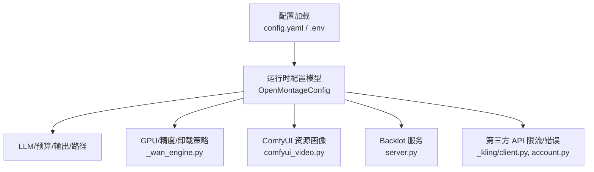
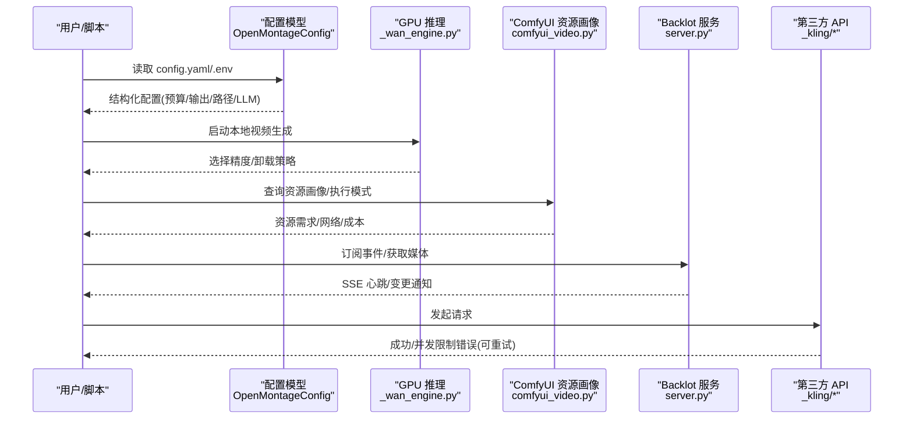
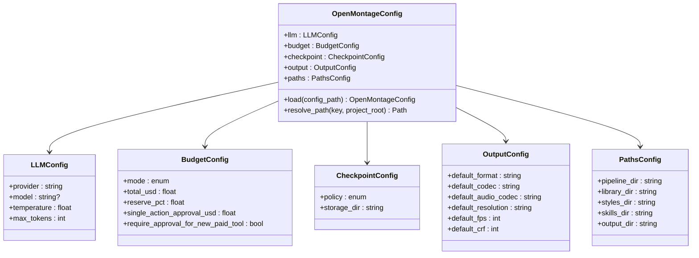
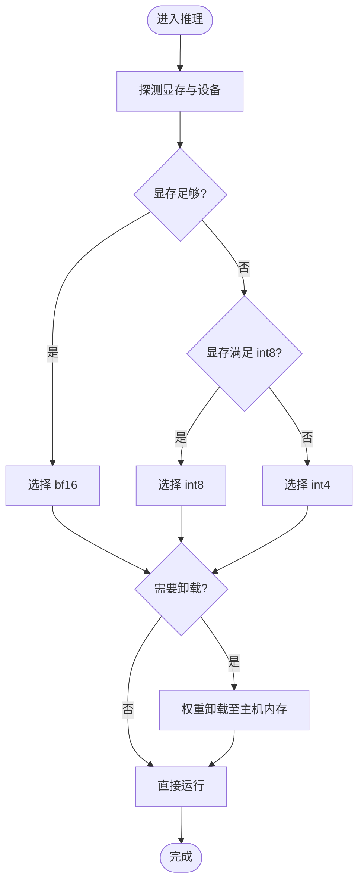
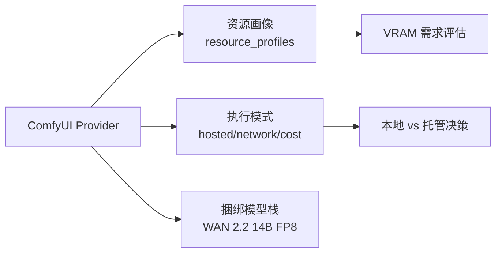
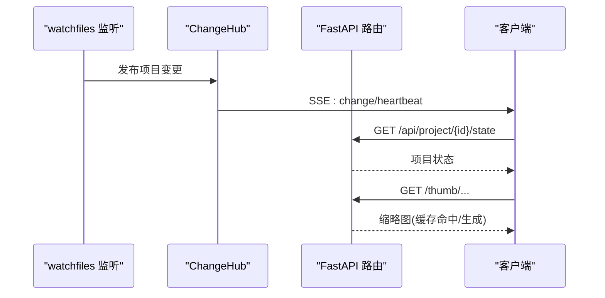
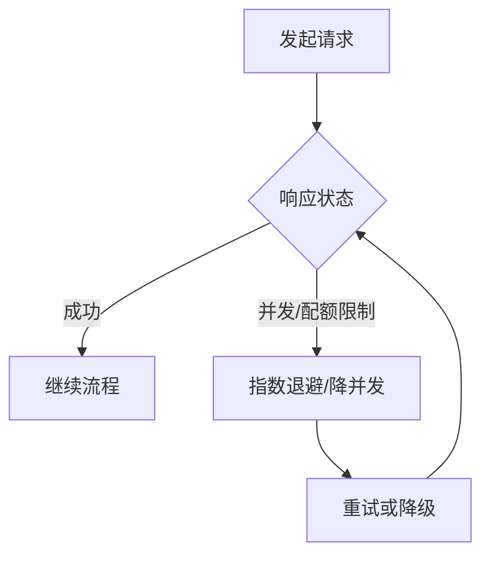
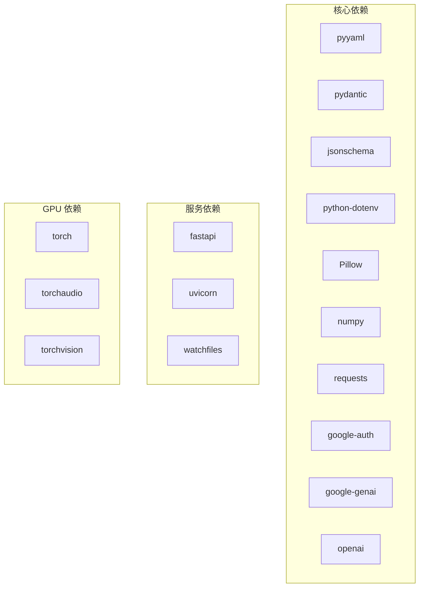

# 资源配置

<cite>
**本文引用的文件**
- [config.yaml](file://config.yaml)
- [lib/config_model.py](file://lib/config_model.py)
- [.env.example](file://.env.example)
- [requirements.txt](file://requirements.txt)
- [requirements-gpu.txt](file://requirements-gpu.txt)
- [backlot/server.py](file://backlot/server.py)
- [tools/video/_wan_engine.py](file://tools/video/_wan_engine.py)
- [tools/video/comfyui_video.py](file://tools/video/comfyui_video.py)
- [tools/_kling/client.py](file://tools/_kling/client.py)
- [tools/_kling/account.py](file://tools/_kling/account.py)
</cite>

## 目录
1. [简介](#简介)
2. [项目结构](#项目结构)
3. [核心组件](#核心组件)
4. [架构总览](#架构总览)
5. [详细组件分析](#详细组件分析)
6. [依赖关系分析](#依赖关系分析)
7. [性能考虑](#性能考虑)
8. [故障排查指南](#故障排查指南)
9. [结论](#结论)
10. [附录](#附录)

## 简介
本指南聚焦 OpenMontage 的资源配置与优化，覆盖 CPU、内存、GPU 的分配与调度策略；解释配置文件结构与关键选项（预算控制、输出参数、路径等）；说明 API 调用限制、并发连接与超时设置；提供开发/测试/生产环境的差异化建议；并给出容器化部署（Docker、Kubernetes）的资源配额实践。同时包含资源监控与自动扩缩容的可落地方案。

## 项目结构
OpenMontage 的资源相关能力由以下部分构成：
- 全局配置模型与 YAML 配置：集中管理 LLM、预算、检查点、输出与路径等。
- 环境变量：用于接入各类外部服务（图像/视频生成、TTS、语音识别、云服务）。
- GPU 推理与精度选择：根据显存自动选择精度与卸载策略。
- ComfyUI 工作流资源画像：声明不同执行模式的资源需求与网络依赖。
- Backlot 本地看板服务：基于 FastAPI + SSE 的事件推送与媒体服务。
- 第三方 API 限流与并发控制：针对特定供应商的错误提示与重试策略。

图表来源
- [lib/config_model.py:1-93](file://lib/config_model.py#L1-L93)
- [config.yaml:1-34](file://config.yaml#L1-L34)
- [tools/video/_wan_engine.py:101-133](file://tools/video/_wan_engine.py#L101-L133)
- [tools/video/comfyui_video.py:348-380](file://tools/video/comfyui_video.py#L348-L380)
- [backlot/server.py:1-369](file://backlot/server.py#L1-L369)
- [tools/_kling/client.py:199-216](file://tools/_kling/client.py#L199-L216)
- [tools/_kling/account.py:1-107](file://tools/_kling/account.py#L1-L107)

章节来源
- [config.yaml:1-34](file://config.yaml#L1-L34)
- [lib/config_model.py:1-93](file://lib/config_model.py#L1-L93)
- [.env.example:1-135](file://.env.example#L1-L135)

## 核心组件
- 全局配置模型
  - 通过 Pydantic 模型对 YAML 进行类型校验与默认值管理，支持相对路径解析。
  - 关键模块：LLM、预算、检查点、输出、路径。
- 环境变量
  - 统一承载各供应商密钥与端点覆盖，便于多环境切换。
- GPU 推理与精度选择
  - 根据可见显存大小自动选择 bf16/int8/int4，并决定权重卸载策略。
- ComfyUI 资源画像
  - 暴露资源需求、执行模式（本地/托管）、网络依赖与成本信息。
- Backlot 服务
  - 基于 FastAPI 提供健康检查、项目状态、SSE 事件流、缩略图与媒体访问。
- 第三方 API 限流与错误处理
  - 针对并发/资源包限制等错误进行友好提示与可重试标记。

章节来源
- [lib/config_model.py:1-93](file://lib/config_model.py#L1-L93)
- [.env.example:1-135](file://.env.example#L1-L135)
- [tools/video/_wan_engine.py:101-133](file://tools/video/_wan_engine.py#L101-L133)
- [tools/video/comfyui_video.py:348-380](file://tools/video/comfyui_video.py#L348-L380)
- [backlot/server.py:1-369](file://backlot/server.py#L1-L369)
- [tools/_kling/client.py:199-216](file://tools/_kling/client.py#L199-L216)
- [tools/_kling/account.py:1-107](file://tools/_kling/account.py#L1-L107)

## 架构总览
下图展示了从配置到运行时的资源流转：配置加载后驱动 LLM/预算/输出/路径；GPU 推理按显存自适应精度；ComfyUI 工作流按资源画像执行；Backlot 提供实时事件与媒体服务；第三方 API 在遇到并发或配额限制时返回可诊断错误。

图表来源
- [lib/config_model.py:1-93](file://lib/config_model.py#L1-L93)
- [tools/video/_wan_engine.py:101-133](file://tools/video/_wan_engine.py#L101-L133)
- [tools/video/comfyui_video.py:348-380](file://tools/video/comfyui_video.py#L348-L380)
- [backlot/server.py:1-369](file://backlot/server.py#L1-L369)
- [tools/_kling/client.py:199-216](file://tools/_kling/client.py#L199-L216)

## 详细组件分析

### 配置模型与 YAML 结构
- 顶层字段
  - llm：提供商、模型、温度、最大 token 数。
  - budget：预算模式（观察/警告/封顶）、总额、预留比例、单次审批阈值、是否要求新付费工具审批。
  - checkpoint：检查点策略、存储目录。
  - output：默认格式、编解码器、分辨率、帧率、CRF。
  - paths：pipeline/library/styles/skills/output 目录。
- 运行时行为
  - 使用 Pydantic 模型校验与默认值填充；支持相对路径解析。
  - 可通过环境变量覆盖（结合 .env.example 中的键名）。

图表来源
- [lib/config_model.py:1-93](file://lib/config_model.py#L1-L93)
- [config.yaml:1-34](file://config.yaml#L1-L34)

章节来源
- [lib/config_model.py:1-93](file://lib/config_model.py#L1-L93)
- [config.yaml:1-34](file://config.yaml#L1-L34)

### GPU 推理与精度选择
- 显存探测：检测 CUDA 可用性与显存总量。
- 精度选择：根据显存与模型参数量自动选择 bf16/int8/int4。
- 卸载策略：当显存不足时，将权重卸载至主机内存以降低峰值占用。

图表来源
- [tools/video/_wan_engine.py:101-133](file://tools/video/_wan_engine.py#L101-L133)

章节来源
- [tools/video/_wan_engine.py:101-133](file://tools/video/_wan_engine.py#L101-L133)

### ComfyUI 资源画像与执行模式
- 资源画像：声明不同工作流的 VRAM 需求与推荐规格。
- 执行模式：区分本地计算与托管节点，标注网络依赖与计费方式。
- 注意事项：顶级 resource_profile 为“地板”约束，并非保证所有工作流都能适配低显存。

图表来源
- [tools/video/comfyui_video.py:348-380](file://tools/video/comfyui_video.py#L348-L380)

章节来源
- [tools/video/comfyui_video.py:348-380](file://tools/video/comfyui_video.py#L348-L380)

### Backlot 服务：SSE 与资源消耗
- 事件推送：SSE 心跳间隔、队列容量与去抖合并，避免高负载下消息风暴。
- 资源使用：缩略图生成（ffmpeg/PIL）与缓存；媒体范围请求；静态资源无缓存头。
- 健康检查：/api/health 快速存活探针。

图表来源
- [backlot/server.py:1-369](file://backlot/server.py#L1-L369)

章节来源
- [backlot/server.py:1-369](file://backlot/server.py#L1-L369)

### 第三方 API 限流与并发控制
- 并发/资源包限制：错误码与消息中包含并发限制提示，便于上层重试与退避。
- 账户用量查询：带进程内缓存与节流保护，降低频繁查询开销。
- 最佳实践：客户端侧并发上限、队列缓冲、指数退避、监控 429/配额告警。

图表来源
- [tools/_kling/client.py:199-216](file://tools/_kling/client.py#L199-L216)
- [tools/_kling/account.py:1-107](file://tools/_kling/account.py#L1-L107)

章节来源
- [tools/_kling/client.py:199-216](file://tools/_kling/client.py#L199-L216)
- [tools/_kling/account.py:1-107](file://tools/_kling/account.py#L1-L107)

## 依赖关系分析
- 基础依赖：pyyaml、pydantic、jsonschema、python-dotenv、Pillow、numpy、requests、google-auth、google-genai、openai。
- 服务依赖：fastapi、uvicorn、watchfiles（Backlot 看板）。
- GPU 依赖：torch、torchaudio、torchvision（仅在 requirements-gpu.txt 中列出）。

图表来源
- [requirements.txt:1-17](file://requirements.txt#L1-L17)
- [requirements-gpu.txt:1-6](file://requirements-gpu.txt#L1-L6)

章节来源
- [requirements.txt:1-17](file://requirements.txt#L1-L17)
- [requirements-gpu.txt:1-6](file://requirements-gpu.txt#L1-L6)

## 性能考虑
- CPU 与内存
  - 合理设置 LLM 的 max_tokens 与 temperature，减少不必要的大文本生成。
  - 使用预算模式（observe/warn/cap）控制总体花费与单步审批阈值。
  - 调整输出分辨率与 CRF，平衡质量与编码耗时。
- GPU 与显存
  - 依据 _wan_engine 的精度选择逻辑，优先启用 bf16；显存不足时回退至 int8/int4。
  - 对于 ComfyUI 工作流，遵循其资源画像建议，避免超配导致 OOM。
- 并发与网络
  - 对第三方 API 实施客户端并发上限与指数退避，避免触发配额限制。
  - 利用 SSE 心跳与队列去抖，降低服务端压力与客户端重连风暴。
- 存储与 I/O
  - 缩略图与媒体缓存减少重复计算；合理设置磁盘空间与清理策略。

[本节为通用指导，不直接分析具体文件]

## 故障排查指南
- 预算与审批
  - 若触发预算封顶或需审批，检查 budget.mode、total_usd、single_action_approval_usd 与 require_approval_for_new_paid_tool。
- 输出异常
  - 检查 output.default_codec、default_audio_codec、default_resolution、default_fps、default_crf 是否与下游兼容。
- GPU 推理失败
  - 确认 torch 已安装且 CUDA/MPS 可用；根据显存调整精度与卸载策略。
- 第三方 API 限流
  - 关注并发/资源包限制错误，适当降低并发或增加退避时间；必要时切换区域或供应商。
- Backlot 事件延迟
  - 检查 watchfiles 是否可用；确认 SSE 心跳与队列容量；查看日志中是否有阻塞操作。

章节来源
- [lib/config_model.py:1-93](file://lib/config_model.py#L1-L93)
- [config.yaml:1-34](file://config.yaml#L1-L34)
- [tools/video/_wan_engine.py:101-133](file://tools/video/_wan_engine.py#L101-L133)
- [tools/_kling/client.py:199-216](file://tools/_kling/client.py#L199-L216)
- [backlot/server.py:1-369](file://backlot/server.py#L1-L369)

## 结论
OpenMontage 通过统一的配置模型与环境变量管理，结合 GPU 自适应精度、ComfyUI 资源画像与 Backlot 实时事件，提供了灵活且可扩展的资源配置体系。在生产环境中，应结合预算控制、并发限流、缓存与监控，实现稳定高效的媒体生成流水线。

[本节为总结性内容，不直接分析具体文件]

## 附录

### 环境差异化的配置建议
- 开发环境
  - 预算模式：observe；较低 total_usd；开启更详细的日志。
  - 输出：较低分辨率与较高 CRF，缩短迭代周期。
  - GPU：优先使用较小模型或量化模式，确保本地可跑通。
- 测试环境
  - 预算模式：warn；中等 total_usd；引入自动化用例与回归测试。
  - 并发：适度提高并发以验证稳定性；记录 429 与超时情况。
  - 输出：固定分辨率与编码参数，便于结果对比。
- 生产环境
  - 预算模式：cap；严格 total_usd 与 reserve_pct；开启审批流程。
  - 并发：结合供应商限额设置上限与退避；启用熔断与降级。
  - 输出：高质量编码参数；启用 CDN 与缓存策略。

[本节为通用指导，不直接分析具体文件]

### 容器化部署的资源限制
- Docker
  - 使用 --cpus、--memory、--gpus 限制 CPU、内存与 GPU 资源。
  - 挂载 pipeline/output 目录持久化产物；设置合适的卷权限。
- Kubernetes
  - 在 Pod/Deployment 中设置 requests/limits 的 cpu/memory；GPU 使用 nvidia.com/gpu 或厂商资源类型。
  - 使用 HorizontalPodAutoscaler 基于 CPU/内存/自定义指标（如队列长度、429 比率）进行扩缩容。
  - 配置 Liveness/Readiness Probe 指向 /api/health；使用 ConfigMap/Secret 注入 .env 变量。

[本节为通用指导，不直接分析具体文件]

### 资源监控与自动扩缩容
- 监控指标
  - 系统：CPU、内存、GPU 利用率、显存占用、I/O 吞吐。
  - 应用：SSE 连接数、队列长度、429 比率、任务成功率、平均延迟。
  - 业务：预算消耗、单次动作成本、产出时长。
- 告警与自愈
  - 当 429 比率或任务失败率超过阈值时触发告警；自动降低并发或切换到备用供应商。
  - 预算接近封顶时暂停非关键任务，等待审批或扩容。
- 自动扩缩容
  - 基于 HPA/VPA 动态调整副本数与资源配额；结合队列深度与延迟目标调优。

[本节为通用指导，不直接分析具体文件]