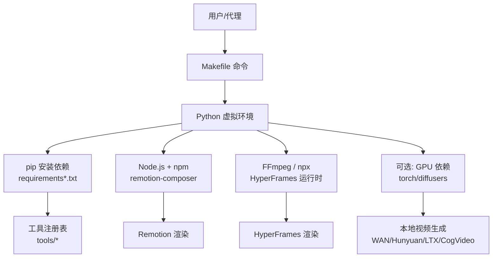
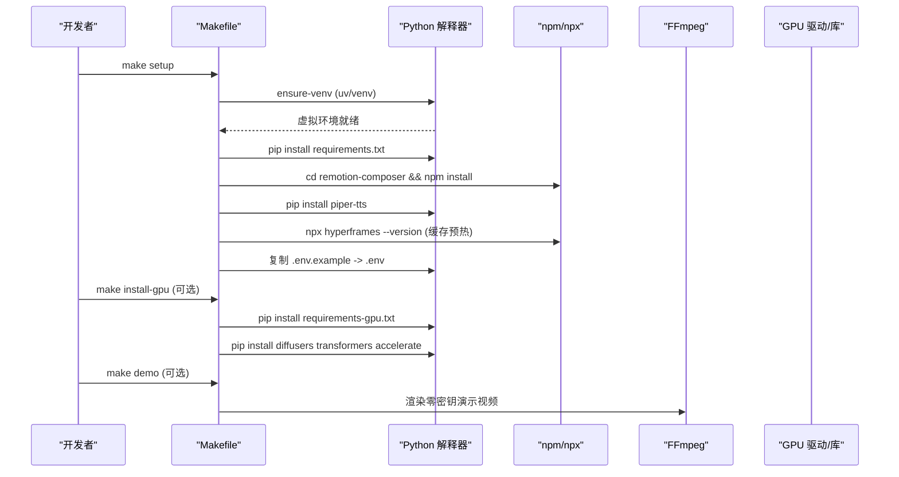
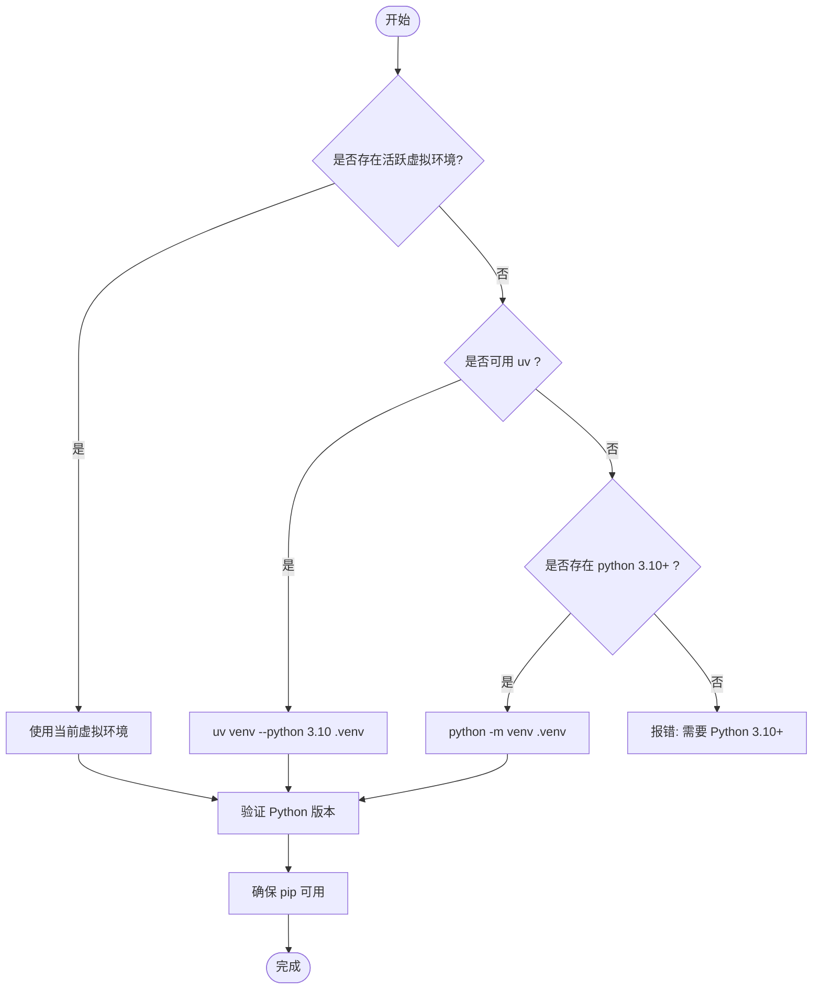
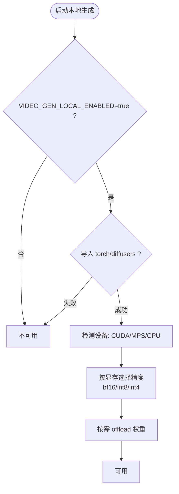
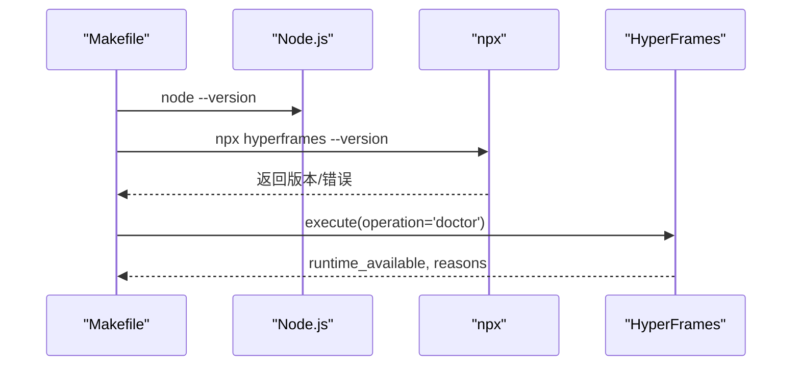
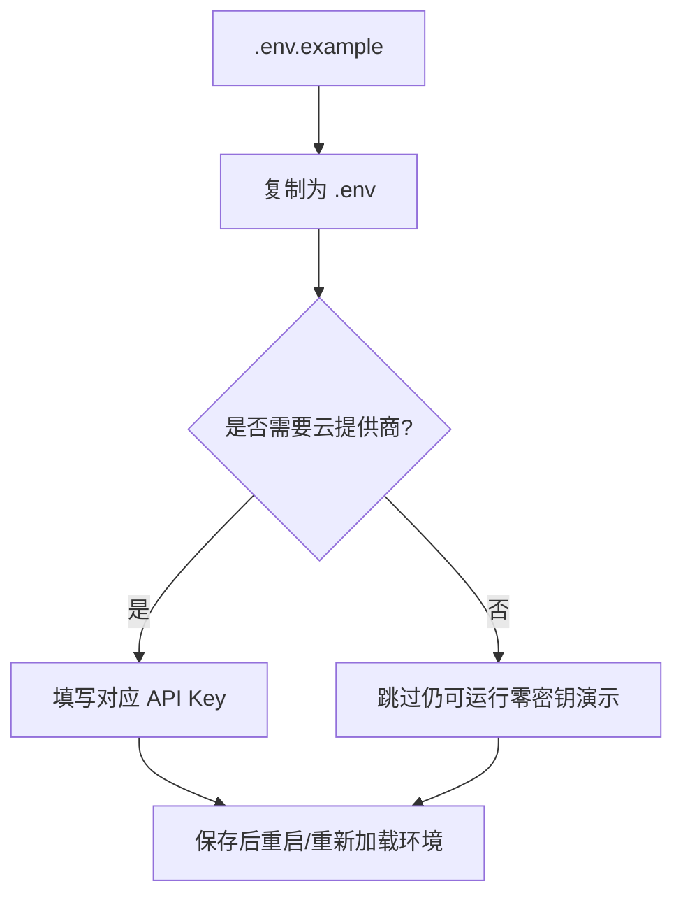
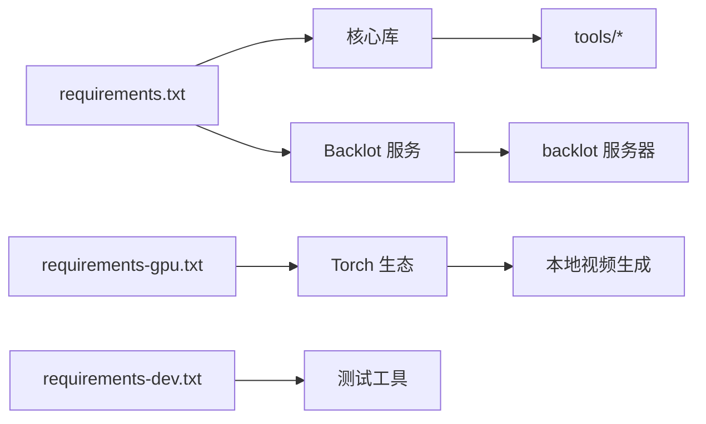

# 环境部署

<cite>
**本文引用的文件**
- [Makefile](file://Makefile)
- [requirements.txt](file://requirements.txt)
- [requirements-gpu.txt](file://requirements-gpu.txt)
- [requirements-dev.txt](file://requirements-dev.txt)
- [setup.py](file://setup.py)
- [.env.example](file://.env.example)
- [README.md](file://README.md)
- [config.yaml](file://config.yaml)
- [tools/video/_shared.py](file://tools/video/_shared.py)
- [tools/video/_wan_engine.py](file://tools/video/_wan_engine.py)
- [tools/video/hyperframes_compose.py](file://tools/video/hyperframes_compose.py)
- [docs/PROVIDERS.md](file://docs/PROVIDERS.md)
</cite>

## 目录
1. [简介](#简介)
2. [项目结构](#项目结构)
3. [核心组件](#核心组件)
4. [架构总览](#架构总览)
5. [详细组件分析](#详细组件分析)
6. [依赖关系分析](#依赖关系分析)
7. [性能考虑](#性能考虑)
8. [故障排查指南](#故障排查指南)
9. [结论](#结论)
10. [附录](#附录)

## 简介
本指南面向OpenMontage的环境部署，覆盖开发环境与生产环境的搭建步骤、Python与系统要求、虚拟环境配置、依赖安装、环境变量配置（API密钥与提供商）、跨平台（Windows/Linux/macOS）注意事项，以及GPU支持的安装与配置。目标是确保部署过程可重复、可维护，并便于在不同环境中稳定运行。

## 项目结构
OpenMontage采用“工具+流水线+技能”的分层组织：
- tools：生产工具集（视频生成、音频、图像、后期处理等）
- pipeline_defs：流水线清单（YAML），定义阶段、工具与质量门禁
- skills：指令式知识（Markdown），指导AI代理如何执行各阶段
- remotion-composer：基于React/Remotion的本地渲染引擎
- lib：核心基础设施（配置、检查点、流水线加载器）
- tests：契约测试与集成测试

图表来源
- [Makefile:1-130](file://Makefile#L1-L130)
- [requirements.txt:1-17](file://requirements.txt#L1-L17)
- [requirements-gpu.txt:1-6](file://requirements-gpu.txt#L1-L6)
- [tools/video/hyperframes_compose.py:252-286](file://tools/video/hyperframes_compose.py#L252-L286)

章节来源
- [README.md:180-216](file://README.md#L180-L216)
- [Makefile:1-130](file://Makefile#L1-L130)

## 核心组件
- Python 版本与环境管理
  - 最低要求：Python 3.10+（由 setup.py 与 Makefile 共同约束）
  - 自动创建或复用虚拟环境（优先 uv，其次 venv；支持 Conda）
- 依赖包
  - 基础依赖：requirements.txt（PyYAML、Pydantic、jsonschema、python-dotenv、Pillow、numpy、requests、google-auth、google-genai、openai、FastAPI、Uvicorn、watchfiles）
  - GPU 依赖：requirements-gpu.txt（torch、torchaudio、torchvision）
  - 开发依赖：requirements-dev.txt（pytest、pytest-asyncio、httpx）
- Node.js 与 FFmpeg
  - Node.js 18+（Remotion 渲染）
  - FFmpeg（编码、字幕烧录、音频混音）
  - npx（HyperFrames 运行时缓存与校验）
- 环境变量
  - .env.example 提供所有可选 API 密钥模板
  - 通过 python-dotenv 在运行时加载

章节来源
- [setup.py:1-20](file://setup.py#L1-L20)
- [Makefile:1-130](file://Makefile#L1-L130)
- [requirements.txt:1-17](file://requirements.txt#L1-L17)
- [requirements-gpu.txt:1-6](file://requirements-gpu.txt#L1-L6)
- [requirements-dev.txt:1-6](file://requirements-dev.txt#L1-L6)
- [.env.example:1-135](file://.env.example#L1-L135)

## 架构总览
部署流程围绕 Makefile 的自动化任务展开，统一处理虚拟环境、依赖安装、运行时检测与演示脚本调用。

图表来源
- [Makefile:54-89](file://Makefile#L54-L89)
- [Makefile:113-120](file://Makefile#L113-L120)

章节来源
- [Makefile:54-89](file://Makefile#L54-L89)
- [Makefile:113-120](file://Makefile#L113-L120)

## 详细组件分析

### 虚拟环境与依赖安装
- 自动环境选择
  - 优先使用已激活的 VIRTUAL_ENV 或 CONDA_PREFIX
  - 若不存在则尝试 uv 创建，否则回退到 Python venv
  - 校验 Python 版本是否满足 >= 3.10
- 一键安装
  - setup：安装 Python 依赖、Remotion 前端依赖、离线 TTS（piper-tts）、HyperFrames 运行时缓存、生成 .env
  - install：仅安装 Python 依赖
  - install-dev：安装开发依赖
  - install-gpu：安装 GPU 依赖及 diffusers/transformers/accelerate

图表来源
- [Makefile:13-48](file://Makefile#L13-L48)

章节来源
- [Makefile:13-48](file://Makefile#L13-L48)

### GPU 支持与设备选择
- 安装选项
  - 运行 make install-gpu 安装 torch/torchaudio/torchvision，并额外安装 diffusers/transformers/accelerate
  - 设置 VIDEO_GEN_LOCAL_ENABLED=true 与 VIDEO_GEN_LOCAL_MODEL 以启用本地视频生成
- 设备优先级
  - CUDA > MPS（Apple Silicon）> CPU
  - 当 torch.backends.mps 不可用或构建不支持时，回退至 CPU
- 精度与显存自适应
  - 根据可见显存大小自动选择 bf16/int8/int4
  - 支持 offload 模式以降低显存占用

图表来源
- [tools/video/_shared.py:257-294](file://tools/video/_shared.py#L257-L294)
- [tools/video/_wan_engine.py:101-133](file://tools/video/_wan_engine.py#L101-L133)
- [.env.example:101-106](file://.env.example#L101-L106)

章节来源
- [tools/video/_shared.py:257-294](file://tools/video/_shared.py#L257-L294)
- [tools/video/_wan_engine.py:101-133](file://tools/video/_wan_engine.py#L101-L133)
- [.env.example:101-106](file://.env.example#L101-L106)

### 渲染运行时（Remotion 与 HyperFrames）
- Remotion
  - 通过 npm install 安装 remotion-composer 依赖
  - 用于数据驱动的动画、图表、卡片、字幕等场景
- HyperFrames
  - 通过 npx hyperframes 进行运行时探测与缓存预热
  - 对 Node.js 版本、FFmpeg、npx 可用性进行检查
  - 首次渲染前会拉取 hyperframes 包到本地 npx 缓存，避免冷启动延迟

图表来源
- [tools/video/hyperframes_compose.py:252-286](file://tools/video/hyperframes_compose.py#L252-L286)
- [Makefile:54-76](file://Makefile#L54-L76)

章节来源
- [tools/video/hyperframes_compose.py:252-286](file://tools/video/hyperframes_compose.py#L252-L286)
- [Makefile:54-76](file://Makefile#L54-L76)

### 环境变量与提供商配置
- 基本步骤
  - 运行 make setup 会自动从 .env.example 复制生成 .env（若不存在）
  - 在 .env 中填入所需 API 密钥（均为可选）
- 常用密钥分类
  - 图像/视频网关：FAL_KEY、ATLASCLOUD_API_KEY
  - 官方直连：KLING_API_KEY、ARK_API_KEY、HEYGEN_API_KEY、RUNWAY_API_KEY
  - 免费素材：PEXELS_API_KEY、PIXABAY_API_KEY、UNSPLASH_ACCESS_KEY
  - 音乐：SUNO_API_KEY
  - 语音与图像：ELEVENLABS_API_KEY、OPENAI_API_KEY、XAI_API_KEY、GOOGLE_API_KEY
  - 本地视频生成：VIDEO_GEN_LOCAL_ENABLED、VIDEO_GEN_LOCAL_MODEL
- 更多提供商与定价说明见 PROVIDERS.md

图表来源
- [.env.example:1-135](file://.env.example#L1-L135)
- [Makefile:70-76](file://Makefile#L70-L76)
- [docs/PROVIDERS.md:29-81](file://docs/PROVIDERS.md#L29-L81)

章节来源
- [.env.example:1-135](file://.env.example#L1-L135)
- [Makefile:70-76](file://Makefile#L70-L76)
- [docs/PROVIDERS.md:29-81](file://docs/PROVIDERS.md#L29-L81)

### 不同操作系统特定安装指导
- Windows
  - 使用 PowerShell：创建虚拟环境、激活、安装依赖、进入 remotion-composer 执行 npm install
  - 若 npm install 报类型参数错误，改用 npx --yes npm install
  - 注意路径分隔符与激活脚本位置（Scripts\Activate.ps1）
- macOS
  - 推荐通过 Homebrew 安装 FFmpeg 与 Node.js
  - Apple Silicon 可使用 MPS 加速（无需 CUDA）
- Linux
  - 通过包管理器安装 FFmpeg、Node.js
  - 若使用 NVIDIA GPU，需安装对应驱动与 CUDA 工具链（由 torch 自动适配）

章节来源
- [README.md:180-216](file://README.md#L180-L216)
- [tools/video/_shared.py:257-294](file://tools/video/_shared.py#L257-L294)

### Makefile 命令说明
- setup：创建/确认虚拟环境，安装 Python 依赖、Remotion 前端依赖、离线 TTS、HyperFrames 运行时缓存，并生成 .env
- install：仅安装 Python 依赖
- install-dev：安装开发依赖（测试、HTTP 客户端等）
- install-gpu：安装 GPU 依赖与相关推理库
- test/test-contracts：运行全部测试或契约测试
- preflight：打印可用提供商菜单
- hyperframes-doctor：诊断 HyperFrames 运行时（Node/FFmpeg/npx）
- hyperframes-warm：刷新 HyperFrames 的 npx 缓存
- demo/demo-list：渲染零密钥演示视频或列出可用演示
- lint/clean：基础语法检查与清理缓存

章节来源
- [Makefile:54-130](file://Makefile#L54-L130)

## 依赖关系分析
- Python 依赖
  - 基础：pyyaml、pydantic、jsonschema、python-dotenv、Pillow、numpy、requests、google-auth、google-genai、openai
  - Backlot 服务：fastapi、uvicorn、watchfiles
- GPU 依赖
  - torch、torchaudio、torchvision（配合 diffusers/transformers/accelerate）
- Node.js 生态
  - remotion-composer（npm install）
  - hyperframes（npx 缓存与运行时）

图表来源
- [requirements.txt:1-17](file://requirements.txt#L1-L17)
- [requirements-gpu.txt:1-6](file://requirements-gpu.txt#L1-L6)
- [requirements-dev.txt:1-6](file://requirements-dev.txt#L1-L6)

章节来源
- [requirements.txt:1-17](file://requirements.txt#L1-L17)
- [requirements-gpu.txt:1-6](file://requirements-gpu.txt#L1-L6)
- [requirements-dev.txt:1-6](file://requirements-dev.txt#L1-L6)

## 性能考虑
- 渲染引擎选择
  - Remotion：适合数据驱动、图表、卡片、字幕等
  - HyperFrames：适合动效密集、HTML/GSAP 风格内容
- 本地视频生成
  - 根据显存自动选择精度（bf16/int8/int4）
  - 合理配置 offload 模式以降低显存压力
- 运行时预热
  - 使用 make hyperframes-warm 刷新 npx 缓存，减少首次渲染延迟
- 资源隔离
  - 始终在虚拟环境中运行，避免全局污染
  - 使用 clean 定期清理 __pycache__ 与 .pyc 文件

[本节为通用性能建议，不直接分析具体文件]

## 故障排查指南
- Python 版本不符
  - 现象：make setup 提示需要 Python 3.10+
  - 解决：安装并激活符合版本的 Python，或移除旧虚拟环境
- 虚拟环境无法创建
  - 现象：ensure-venv 失败
  - 解决：安装 uv 或确保系统具备 venv 支持
- Node.js/FFmpeg/npx 缺失
  - 现象：hyperframes-doctor 报告不可用
  - 解决：安装 Node.js 18+、FFmpeg，并确保 PATH 正确
- GPU 不可用
  - 现象：本地视频生成显示不可用
  - 解决：安装 GPU 依赖，设置 VIDEO_GEN_LOCAL_ENABLED=true，并确保驱动/库可用
- 提供商密钥未配置
  - 现象：部分工具不可选或调用失败
  - 解决：在 .env 中补充对应 API Key，并重启/重新加载环境

章节来源
- [Makefile:13-48](file://Makefile#L13-L48)
- [tools/video/hyperframes_compose.py:252-286](file://tools/video/hyperframes_compose.py#L252-L286)
- [tools/video/_shared.py:257-294](file://tools/video/_shared.py#L257-L294)
- [.env.example:1-135](file://.env.example#L1-L135)

## 结论
通过 Makefile 的统一入口，OpenMontage 提供了可重复、可维护的部署体验。遵循本指南的步骤，可在不同操作系统上快速搭建开发与生产环境，并根据需求启用 GPU 与本地视频生成。环境变量与提供商配置灵活可扩展，结合 Remotion 与 HyperFrames 两种渲染引擎，满足不同风格的视频制作需求。

[本节为总结性内容，不直接分析具体文件]

## 附录
- 全局配置
  - config.yaml 定义了 LLM、预算、检查点策略、输出格式与路径等
- 参考文档
  - docs/PROVIDERS.md 提供完整提供商指南与密钥汇总

章节来源
- [config.yaml:1-34](file://config.yaml#L1-L34)
- [docs/PROVIDERS.md:1-200](file://docs/PROVIDERS.md#L1-L200)