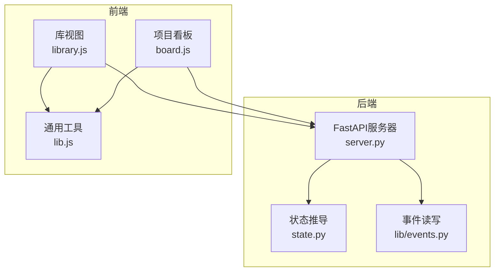
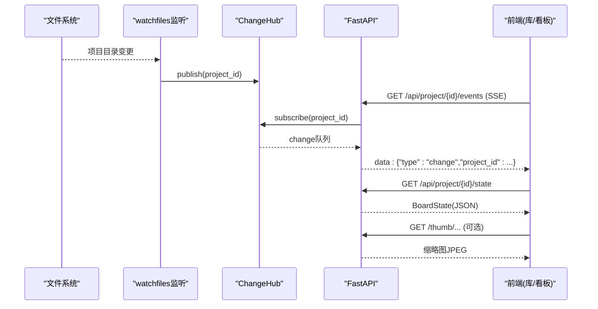
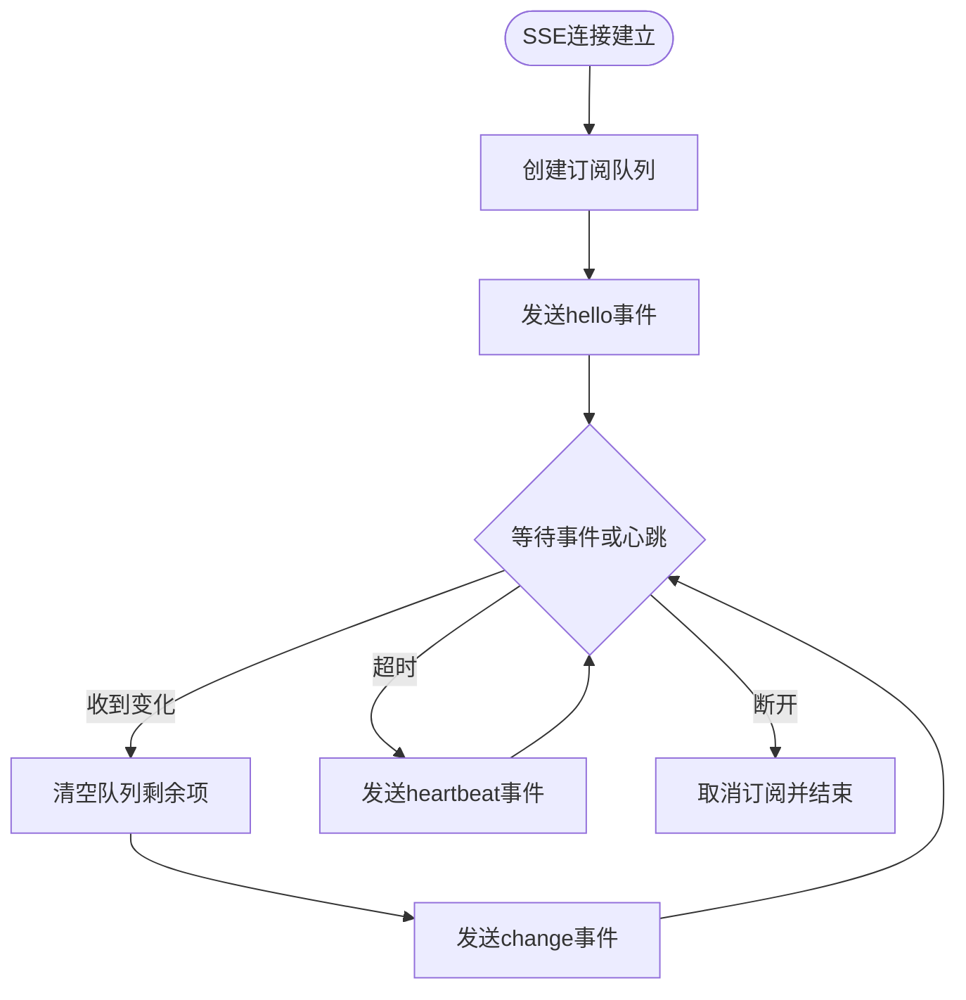
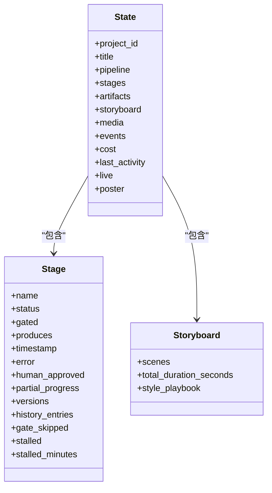
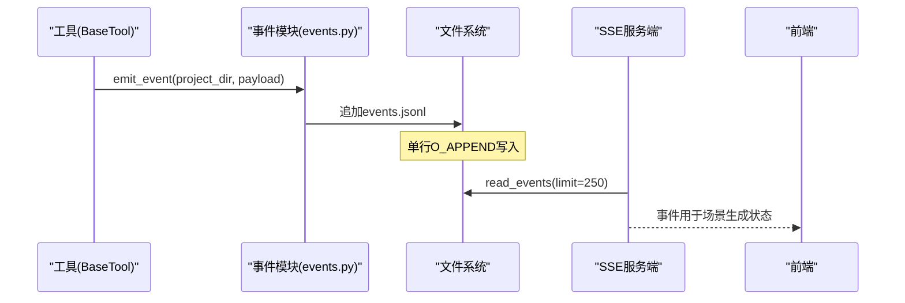
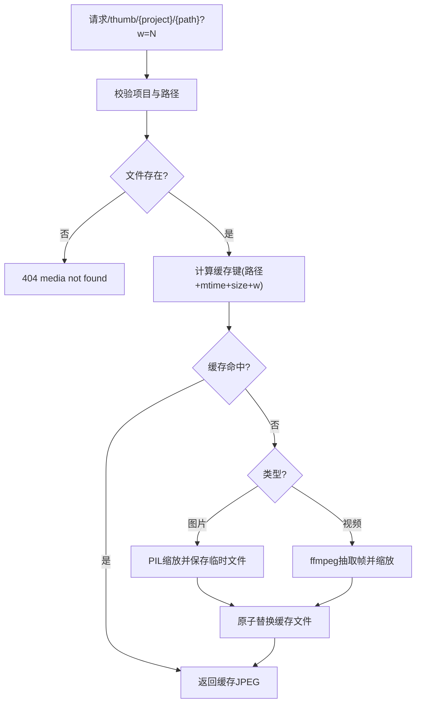
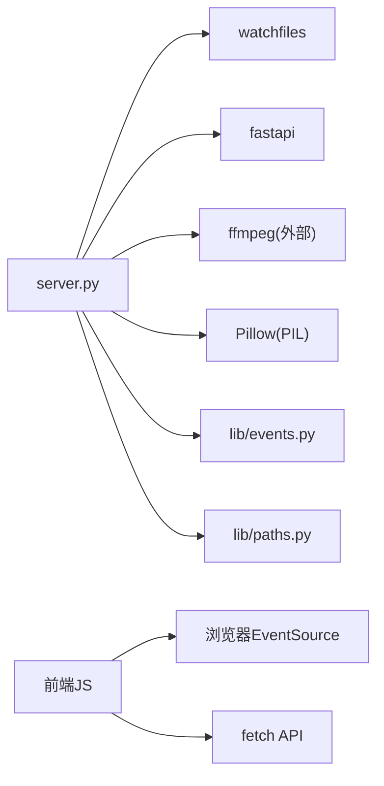

# Backlot监控界面

<cite>
**本文引用的文件**
- [server.py](file://backlot/server.py)
- [state.py](file://backlot/state.py)
- [__main__.py](file://backlot/__main__.py)
- [README.md](file://backlot/README.md)
- [board.html](file://backlot/ui/board.html)
- [board.js](file://backlot/ui/board.js)
- [library.js](file://backlot/ui/library.js)
- [lib.js](file://backlot/ui/lib.js)
- [events.py](file://lib/events.py)
</cite>

## 目录
1. [简介](#简介)
2. [项目结构](#项目结构)
3. [核心组件](#核心组件)
4. [架构总览](#架构总览)
5. [详细组件分析](#详细组件分析)
6. [依赖关系分析](#依赖关系分析)
7. [性能考量](#性能考量)
8. [故障排查指南](#故障排查指南)
9. [结论](#结论)
10. [附录：API端点文档](#附录api端点文档)

## 简介
Backlot是一个只读的本地“活看板”，用于实时观察视频生产管线在磁盘上的进展。它通过文件系统监听、SSE（Server-Sent Events）事件推送、以及媒体缩略图服务，将项目状态、阶段进度、错误诊断与媒体资源以可视化方式呈现给前端。其设计原则是“永不阻塞、永不崩溃”——即使数据不完整或解析失败，看板也会优雅降级。

## 项目结构
- 后端FastAPI应用：提供REST API、SSE事件流、静态UI资源与媒体访问
- 状态推导模块：从项目目录读取checkpoint、artifacts、events等，构建BoardState
- 事件日志模块：工具执行时追加事件到events.jsonl，供看板回放与活动指示
- 前端页面：库视图（所有项目）、项目看板（单项目），通过SSE保持实时刷新

图表来源
- [server.py:165-307](file://backlot/server.py#L165-L307)
- [state.py:588-658](file://backlot/state.py#L588-L658)
- [events.py:77-119](file://lib/events.py#L77-L119)
- [library.js:76-91](file://backlot/ui/library.js#L76-L91)
- [board.js:1-200](file://backlot/ui/board.js#L1-L200)
- [lib.js:65-81](file://backlot/ui/lib.js#L65-L81)

章节来源
- [README.md:1-43](file://backlot/README.md#L1-L43)
- [server.py:1-369](file://backlot/server.py#L1-L369)
- [state.py:1-716](file://backlot/state.py#L1-L716)
- [events.py:1-119](file://lib/events.py#L1-L119)
- [board.html:1-16](file://backlot/ui/board.html#L1-L16)
- [board.js:1-200](file://backlot/ui/board.js#L1-L200)
- [library.js:1-92](file://backlot/ui/library.js#L1-L92)
- [lib.js:1-104](file://backlot/ui/lib.js#L1-L104)

## 核心组件
- FastAPI服务器：健康检查、项目列表、项目状态、SSE事件订阅、缩略图与媒体服务、UI路由
- 项目状态管理：读取checkpoint、历史、artifacts、events，组装BoardState，计算活跃/空闲/停滞状态
- SSE事件推送：基于watchfiles的变更监听，按项目过滤广播，心跳保活，去抖合并
- 媒体服务：安全的相对路径访问、范围请求支持、缩略图生成与缓存
- 前端界面：库视图网格、项目看板阶段轨道、场景胶卷、成本与活跃度指示、主题切换

章节来源
- [server.py:165-307](file://backlot/server.py#L165-L307)
- [state.py:588-658](file://backlot/state.py#L588-L658)
- [lib.js:65-81](file://backlot/ui/lib.js#L65-L81)
- [library.js:76-91](file://backlot/ui/library.js#L76-L91)
- [board.js:50-153](file://backlot/ui/board.js#L50-L153)

## 架构总览
系统由后端FastAPI与纯前端组成，前后端通过REST与SSE通信。后端通过watchfiles监听项目目录变更，触发SSE通知；前端使用EventSource订阅并拉取最新状态。

图表来源
- [server.py:132-149](file://backlot/server.py#L132-L149)
- [server.py:183-240](file://backlot/server.py#L183-L240)
- [server.py:244-262](file://backlot/server.py#L244-L262)
- [lib.js:65-81](file://backlot/ui/lib.js#L65-L81)

## 详细组件分析

### FastAPI服务器与SSE实现
- 生命周期管理：启动后台任务监听项目目录，关闭时取消任务
- 变更监听：使用watchfiles递归监听，忽略噪声目录，聚合变更并广播
- SSE连接：每个订阅者拥有独立队列，按项目过滤消息；超时发送心跳；批量去抖
- 安全校验：项目ID白名单校验，路径越界拒绝；媒体访问限制在项目目录内

图表来源
- [server.py:183-240](file://backlot/server.py#L183-L240)
- [server.py:43-74](file://backlot/server.py#L43-L74)

章节来源
- [server.py:151-163](file://backlot/server.py#L151-L163)
- [server.py:132-149](file://backlot/server.py#L132-L149)
- [server.py:183-240](file://backlot/server.py#L183-L240)
- [server.py:310-318](file://backlot/server.py#L310-L318)

### 项目状态管理
- 阶段轨道：从pipeline manifest或回退阶段定义构建阶段顺序，标注门控、产出物
- 检查点与历史：收集当前checkpoint与history版本，计算状态轨迹与门控审计
- 故事板：关联scene_plan、script、asset_manifest，结合events推断生成中场景
- 媒体发现：扫描renders、snapshots、music，选择最佳海报
- 活动与停滞：根据最近活动时间判断live/idle，长时间无活动标记stalled

图表来源
- [state.py:145-224](file://backlot/state.py#L145-L224)
- [state.py:403-495](file://backlot/state.py#L403-L495)
- [state.py:588-658](file://backlot/state.py#L588-L658)

章节来源
- [state.py:118-224](file://backlot/state.py#L118-L224)
- [state.py:246-349](file://backlot/state.py#L246-L349)
- [state.py:403-495](file://backlot/state.py#L403-L495)
- [state.py:502-581](file://backlot/state.py#L502-L581)
- [state.py:588-658](file://backlot/state.py#L588-L658)

### 事件系统与监听器
- 事件写入：工具执行后追加一行JSON到events.jsonl，线程锁保证单行原子性
- 事件读取：按时间顺序读取，容忍损坏行，支持limit裁剪
- 项目归属：从输入参数推断所属项目目录，仅允许projects根下的路径
- 看板联动：SSE变更触发前端重新拉取状态，事件用于场景级“生成中”指示

图表来源
- [events.py:77-119](file://lib/events.py#L77-L119)
- [state.py:608-610](file://backlot/state.py#L608-L610)

章节来源
- [events.py:1-119](file://lib/events.py#L1-L119)
- [state.py:608-610](file://backlot/state.py#L608-L610)

### 缩略图生成与缓存机制
- 图片处理：PIL打开图像，转换为RGB，thumbnail缩放，保存为JPEG
- 视频帧提取：ffmpeg抽取第1.5秒一帧，按目标宽度缩放，输出JPEG
- 缓存策略：基于源文件路径、mtime、size与目标宽度的SHA1键，持久化到磁盘缓存目录
- 并发安全：每次生成使用唯一临时文件名，完成后原子替换缓存文件
- 容错：任何异常返回None，视频无法提取时直接404，非视频图片原样返回

图表来源
- [server.py:244-262](file://backlot/server.py#L244-L262)
- [server.py:325-365](file://backlot/server.py#L325-L365)

章节来源
- [server.py:244-262](file://backlot/server.py#L244-L262)
- [server.py:325-365](file://backlot/server.py#L325-L365)

### 前端界面功能
- 库视图：展示所有项目卡片，显示活跃状态、阶段轨道、最近活动时间；通过SSE自动刷新
- 项目看板：顶部信息条（管线类型、场景数、风格剧本）、阶段轨道（完成/进行中/等待人工/失败/停滞）、成本进度条
- 场景胶卷：按scene_plan组织，显示视觉素材、音频、生成中状态；支持回放模式
- 主题切换：暗色/亮色主题，存储于localStorage
- 媒体播放：通过/media与/thumb接口获取视频与缩略图

章节来源
- [library.js:1-92](file://backlot/ui/library.js#L1-L92)
- [board.js:1-200](file://backlot/ui/board.js#L1-L200)
- [lib.js:1-104](file://backlot/ui/lib.js#L1-L104)
- [board.html:1-16](file://backlot/ui/board.html#L1-L16)

## 依赖关系分析
- 后端依赖：
  - watchfiles：文件系统变更监听
  - fastapi/starlette：HTTP与SSE
  - ffmpeg/PIL：缩略图生成
  - lib.events：事件日志读写
  - lib.paths：项目根与仓库根路径
- 前端依赖：
  - EventSource：SSE客户端
  - fetch：REST API调用
  - localStorage：主题偏好

图表来源
- [server.py:132-149](file://backlot/server.py#L132-L149)
- [server.py:325-365](file://backlot/server.py#L325-L365)
- [events.py:77-119](file://lib/events.py#L77-L119)
- [lib.js:65-81](file://backlot/ui/lib.js#L65-L81)

章节来源
- [server.py:132-149](file://backlot/server.py#L132-L149)
- [server.py:325-365](file://backlot/server.py#L325-L365)
- [events.py:77-119](file://lib/events.py#L77-L119)
- [lib.js:65-81](file://backlot/ui/lib.js#L65-L81)

## 性能考量
- 变更聚合：watchfiles批量回调，按项目去重后再广播，避免频繁SSE风暴
- 摘要缓存：项目列表摘要按项目缓存，变更时失效，减少重复解析
- 轻量状态：库视图仅加载摘要，详情按需拉取
- 缩略图缓存：磁盘缓存避免重复生成，临时文件原子替换保证并发安全
- 事件限流：前端对SSE change事件进行250ms去抖，降低渲染频率
- 只读设计：服务端不写项目目录，降低竞争与锁开销

[本节为一般性指导，无需特定文件引用]

## 故障排查指南
- 健康检查：GET /api/health 确认服务可用
- 项目不存在：访问项目状态或媒体时若404，检查项目ID与路径
- 路径逃逸：403表示尝试访问项目外路径，检查传入参数
- SSE断连：浏览器EventSource自动重连，关注控制台错误
- 缩略图缺失：视频无法提取帧时返回404，检查ffmpeg是否可用
- 卡顿/停滞：看板中标记“STALLED?”，检查最后活动时间与阶段状态
- 事件丢失：events.jsonl可能因并发写入出现损坏行，read_events会跳过

章节来源
- [server.py:170-182](file://backlot/server.py#L170-L182)
- [server.py:244-276](file://backlot/server.py#L244-L276)
- [server.py:310-318](file://backlot/server.py#L310-L318)
- [events.py:98-119](file://lib/events.py#L98-L119)
- [state.py:630-638](file://backlot/state.py#L630-L638)

## 结论
Backlot通过简洁的后端架构与纯前端实现，提供了强大的项目监控能力。其核心优势在于：
- 实时性：文件系统监听+SSE推送，低延迟更新
- 健壮性：只读设计、优雅降级、错误容忍
- 可维护性：模块化清晰、缓存优化、前端去抖
- 可扩展性：易于添加新阶段、新资产类型与新可视化元素

[本节为总结性内容，无需特定文件引用]

## 附录：API端点文档

### 健康检查
- 方法：GET
- 路径：/api/health
- 响应：{"ok": true, "app": "backlot"}
- 用途：服务可用性探测

章节来源
- [server.py:170-173](file://backlot/server.py#L170-L173)

### 项目列表
- 方法：GET
- 路径：/api/projects
- 响应：项目摘要数组，包含project_id、title、pipeline_type、stage_states、live、last_activity等
- 用途：库视图数据源

章节来源
- [server.py:174-177](file://backlot/server.py#L174-L177)
- [state.py:661-683](file://backlot/state.py#L661-L683)

### 项目状态
- 方法：GET
- 路径：/api/project/{project_id}/state
- 响应：完整BoardState对象，包含stages、artifacts、storyboard、media、events、cost等
- 用途：项目看板数据源

章节来源
- [server.py:178-182](file://backlot/server.py#L178-L182)
- [state.py:588-658](file://backlot/state.py#L588-L658)

### 项目事件订阅（SSE）
- 方法：GET
- 路径：/api/project/{project_id}/events
- 内容类型：text/event-stream
- 事件类型：
  - hello：连接建立确认
  - heartbeat：心跳保活（默认15秒间隔）
  - change：项目变更通知（去抖合并）
- 用途：项目看板实时更新

章节来源
- [server.py:183-212](file://backlot/server.py#L183-L212)
- [lib.js:65-81](file://backlot/ui/lib.js#L65-L81)

### 库事件订阅（SSE）
- 方法：GET
- 路径：/api/library/events
- 内容类型：text/event-stream
- 事件类型：
  - hello：连接建立确认
  - heartbeat：心跳保活
  - change：任意项目变更（包含project_id）
- 用途：库视图自动刷新

章节来源
- [server.py:214-240](file://backlot/server.py#L214-L240)
- [library.js:89-91](file://backlot/ui/library.js#L89-L91)

### 缩略图服务
- 方法：GET
- 路径：/thumb/{project_id}/{file_path}?w={width}
- 响应：JPEG图片或原始图片（不可缩略时）
- 行为：
  - 图片：PIL缩放缓存
  - 视频：ffmpeg提取帧并缓存
  - 缓存：基于文件元数据与目标宽度的SHA1键
- 错误：404表示媒体不存在或视频无可用帧

章节来源
- [server.py:244-262](file://backlot/server.py#L244-L262)
- [server.py:325-365](file://backlot/server.py#L325-L365)

### 媒体服务
- 方法：GET
- 路径：/media/{project_id}/{file_path}
- 响应：原始媒体文件（支持Range请求）
- 安全：限制在项目目录内，防止路径逃逸

章节来源
- [server.py:266-276](file://backlot/server.py#L266-L276)
- [server.py:310-318](file://backlot/server.py#L310-L318)

### UI路由
- 项目看板：GET /p/{project_id} 或 /p/{project_path}
- 库视图：GET /
- 静态资源：/ui/*（CSS/JS）

章节来源
- [server.py:280-305](file://backlot/server.py#L280-L305)
- [board.html:1-16](file://backlot/ui/board.html#L1-L16)