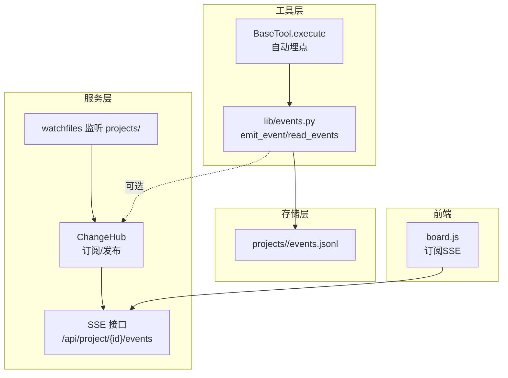
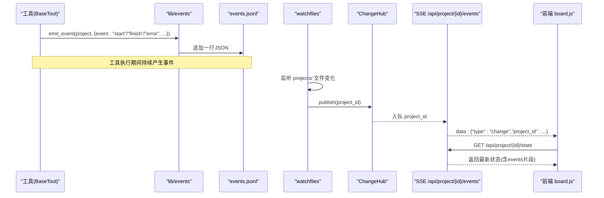
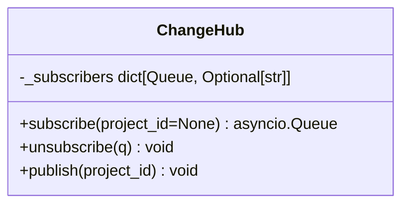
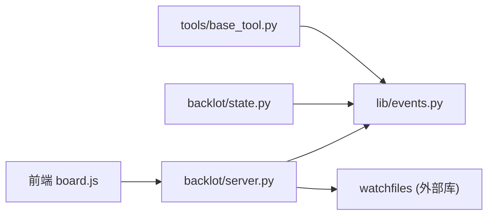

# 事件系统

<cite>
**本文引用的文件**
- [lib/events.py](file://lib/events.py)
- [backlot/server.py](file://backlot/server.py)
- [tools/base_tool.py](file://tools/base_tool.py)
- [backlot/state.py](file://backlot/state.py)
- [tests/contracts/test_backlot_contract.py](file://tests/contracts/test_backlot_contract.py)
</cite>

## 目录
1. [简介](#简介)
2. [项目结构](#项目结构)
3. [核心组件](#核心组件)
4. [架构总览](#架构总览)
5. [详细组件分析](#详细组件分析)
6. [依赖关系分析](#依赖关系分析)
7. [性能与内存考量](#性能与内存考量)
8. [故障排查与监控](#故障排查与监控)
9. [使用示例](#使用示例)
10. [结论](#结论)

## 简介
本技术文档聚焦 OpenMontage 的事件系统，围绕“事件定义、发布订阅模式、事件处理流程”展开，重点解释 ChangeHub 的实现机制（事件队列管理、订阅者过滤、消息分发），并说明事件类型（项目变更事件、工具执行事件、状态更新事件等）。同时给出监听器的注册/注销、异步队列管理、内存优化、连接管理等实践要点，并提供调试与监控方法以及实际使用示例。

## 项目结构
OpenMontage 的事件系统由两部分组成：
- 工具侧事件写入：BaseTool 在执行生命周期中自动注入事件埋点，将 start/finish/error 等事件追加到项目的 events.jsonl 文件中。
- Backlot 服务端事件分发：ChangeHub 维护 SSE 订阅者的异步队列，基于文件系统变化或工具事件驱动，向订阅端推送项目变更通知；UI 通过 SSE 实时刷新看板。

图表来源
- [tools/base_tool.py:148-224](file://tools/base_tool.py#L148-L224)
- [lib/events.py:77-118](file://lib/events.py#L77-L118)
- [backlot/server.py:132-149](file://backlot/server.py#L132-L149)
- [backlot/server.py:183-212](file://backlot/server.py#L183-L212)

章节来源
- [tools/base_tool.py:148-224](file://tools/base_tool.py#L148-L224)
- [lib/events.py:1-119](file://lib/events.py#L1-L119)
- [backlot/server.py:43-74](file://backlot/server.py#L43-L74)
- [backlot/server.py:132-149](file://backlot/server.py#L132-L149)
- [backlot/server.py:183-212](file://backlot/server.py#L183-L212)

## 核心组件
- BaseTool 自动埋点：在 execute 前后自动记录 start/finish/error 事件，并推断所属项目目录，写入 events.jsonl。
- lib/events：提供 emit_event、read_events、infer_project_dir 三个核心能力，负责事件落盘与读取。
- ChangeHub：面向 SSE 的 fan-out 中心，按项目维度过滤，向订阅者推送变更。
- Backlot 状态聚合：读取 events.jsonl 并结合 checkpoint/artifact 构建看板状态，支持“最近活动”和“卡顿检测”。

章节来源
- [tools/base_tool.py:148-224](file://tools/base_tool.py#L148-L224)
- [lib/events.py:46-118](file://lib/events.py#L46-L118)
- [backlot/server.py:43-74](file://backlot/server.py#L43-L74)
- [backlot/state.py:600-658](file://backlot/state.py#L600-L658)

## 架构总览
事件流分为两条主线：
- 工具执行事件线：BaseTool -> lib/events -> events.jsonl -> Backlot 状态聚合 -> 前端展示。
- 项目变更通知线：watchfiles 监听 projects/ -> ChangeHub -> SSE -> 前端刷新。

图表来源
- [tools/base_tool.py:148-224](file://tools/base_tool.py#L148-L224)
- [lib/events.py:77-118](file://lib/events.py#L77-L118)
- [backlot/server.py:132-149](file://backlot/server.py#L132-L149)
- [backlot/server.py:183-212](file://backlot/server.py#L183-L212)

## 详细组件分析

### 事件写入与读取（lib/events.py）
- infer_project_dir：从输入参数推断项目根目录，仅接受 projects/ 下的路径，避免误写外部目录。
- emit_event：线程安全地以 O_APPEND 方式追加一行 JSON 到 events.jsonl，异常吞掉保证不中断业务。
- read_events：顺序读取 events.jsonl，跳过损坏行，支持 limit 限制条数。

复杂度与特性
- 写入：O(1) 追加，跨进程无锁但单行原子性良好；读：O(n) 顺序扫描，容忍损坏行。
- 线程安全：写锁保护并发写入；读无锁，容忍部分损坏。

章节来源
- [lib/events.py:46-118](file://lib/events.py#L46-L118)

### 工具执行埋点（tools/base_tool.py）
- _instrument_execute：装饰 execute，自动注入 start/finish/error 事件，并计算耗时、成本、场景ID等上下文。
- 深度控制：threading.local 维护嵌套深度，便于上层调用链去重统计。
- 容错设计：事件层失败不影响工具执行；未归属项目时静默跳过。

章节来源
- [tools/base_tool.py:148-224](file://tools/base_tool.py#L148-L224)

### ChangeHub 与 SSE 分发（backlot/server.py）
- subscribe/unsubscribe：为每个订阅者创建有界队列（maxsize=64），可指定仅接收某 project_id。
- publish：遍历订阅者，按项目过滤后 put_nowait；队列满则丢弃（已保证至少一次唤醒）。
- SSE 接口：
  - /api/project/{project_id}/events：按项目订阅，心跳保活，合并突发，断开自动退订。
  - /api/library/events：全局订阅，广播所有项目变更。

图表来源
- [backlot/server.py:43-74](file://backlot/server.py#L43-L74)

章节来源
- [backlot/server.py:43-74](file://backlot/server.py#L43-L74)
- [backlot/server.py:183-212](file://backlot/server.py#L183-L212)
- [backlot/server.py:214-240](file://backlot/server.py#L214-L240)

### 状态聚合与事件消费（backlot/state.py）
- load_board_state：读取 checkpoints、artifacts、media，并读取 events（limit=250）用于故事板与活动追踪。
- last_activity 与卡顿检测：根据最后活动时间判断 live 状态，并对长时间无更新的 in_progress 阶段标记 stalled。

章节来源
- [backlot/state.py:600-658](file://backlot/state.py#L600-L658)

## 依赖关系分析
- BaseTool 依赖 lib/events 进行事件落盘；Backlot server 依赖 watchfiles 监听文件系统变化并通过 ChangeHub 分发。
- state.py 依赖 lib/events 读取事件，结合 checkpoint 生成看板状态。
- 测试覆盖事件推断、工具埋点、事件读写等关键路径。

图表来源
- [tools/base_tool.py:148-224](file://tools/base_tool.py#L148-L224)
- [backlot/server.py:132-149](file://backlot/server.py#L132-L149)
- [backlot/state.py:600-658](file://backlot/state.py#L600-L658)

章节来源
- [tests/contracts/test_backlot_contract.py:169-244](file://tests/contracts/test_backlot_contract.py#L169-L244)

## 性能与内存考量
- 事件写入采用 O_APPEND 追加，避免随机写开销；单行 JSON 格式利于快速解析与截断恢复。
- ChangeHub 使用有界队列（maxsize=64），防止积压导致内存膨胀；队列满时丢弃多余通知，因已存在 pending wake-up。
- SSE 心跳间隔固定（SSE_HEARTBEAT_SECONDS），超时发送心跳保持连接活跃；批量消费队列元素以减少频繁响应。
- 状态聚合对 events 限制读取条数（limit=250），降低大项目 IO 压力。

[本节为通用性能建议，无需特定文件引用]

## 故障排查与监控
- 事件日志定位：查看 projects/<project>/events.jsonl，确认 start/finish/error 序列是否完整，检查 duration_s、cost_usd、scene_id 等字段。
- 工具埋点验证：通过单元测试断言事件序列（如 ["start","finish"] 或 ["start","error"]）确保埋点生效。
- SSE 连接健康：观察 /api/project/{id}/events 是否周期性收到 heartbeat；若长时间无 change，检查 watchfiles 任务与 ChangeHub.publish 是否触发。
- 卡顿检测：当 stage 处于 in_progress 且 last_activity 超过阈值，会被标记 stalled_minutes，辅助定位阻塞环节。
- 常见错误：
  - 事件写入失败：被静默忽略，不会中断工具执行；可通过检查 events.jsonl 是否存在及权限问题排查。
  - 项目归属失败：infer_project_dir 无法识别项目目录时不会写入事件；需确保输出路径位于 projects/ 下或使用 project_dir 显式指定。

章节来源
- [tests/contracts/test_backlot_contract.py:190-244](file://tests/contracts/test_backlot_contract.py#L190-L244)
- [backlot/state.py:630-658](file://backlot/state.py#L630-L658)

## 使用示例
以下示例展示如何在工具开发中使用事件系统进行状态同步与进度通知。注意：BaseTool 已自动埋点 start/finish/error，通常无需手动调用 emit_event；如需自定义中间态或进度，可在工具内部直接写入 events.jsonl 或通过扩展埋点逻辑实现。

- 自动埋点（推荐）
  - 继承 BaseTool 并实现 execute，返回 ToolResult；框架会自动记录 start/finish/error，并推断项目目录。
  - 参考测试用例中的 FakeTool/BoomTool 行为，验证事件序列与字段。

- 手动事件（高级用法）
  - 在脚本或工具中调用 emit_event(project_dir, payload)，payload 包含 tool、event、scene_id、duration_s 等字段。
  - 读取事件使用 read_events(project_dir, limit=N) 获取最近 N 条事件用于 UI 或诊断。

- SSE 订阅与刷新
  - 前端通过 /api/project/{id}/events 建立 SSE 连接，收到 change 后拉取 /api/project/{id}/state 刷新看板。
  - 心跳保活：服务器定期发送 heartbeat，客户端据此维持连接。

章节来源
- [tools/base_tool.py:148-224](file://tools/base_tool.py#L148-L224)
- [lib/events.py:77-118](file://lib/events.py#L77-L118)
- [backlot/server.py:183-212](file://backlot/server.py#L183-L212)
- [tests/contracts/test_backlot_contract.py:190-244](file://tests/contracts/test_backlot_contract.py#L190-L244)

## 结论
OpenMontage 的事件系统通过“工具自动埋点 + 文件事件日志 + 服务端 SSE 分发”的解耦设计，实现了高可用、低侵入的项目级状态同步与实时看板。ChangeHub 以有界队列与项目过滤保障性能与隔离性；BaseTool 的装饰器化埋点确保零额外负担；state.py 的状态聚合与卡顿检测提升了可观测性。对于工具开发者，优先依赖 BaseTool 自动埋点，必要时再按需扩展事件语义，即可高效实现状态同步与进度通知。