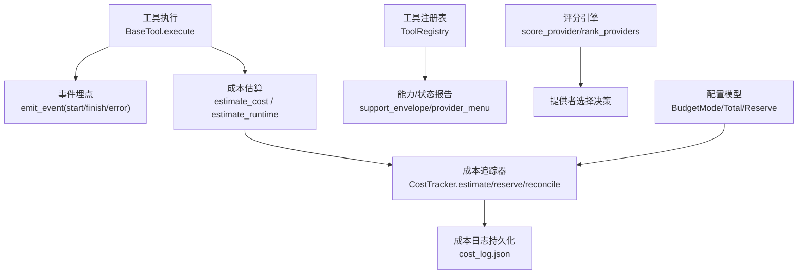
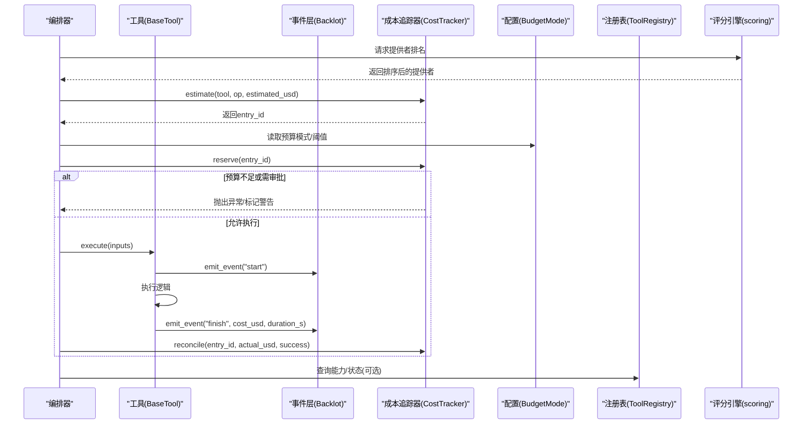
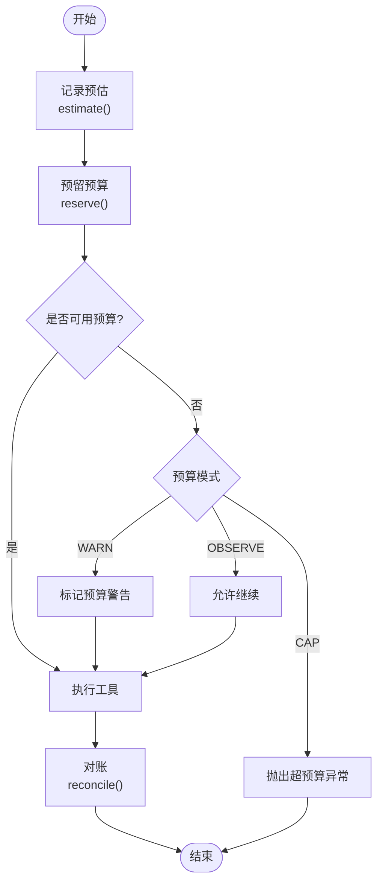
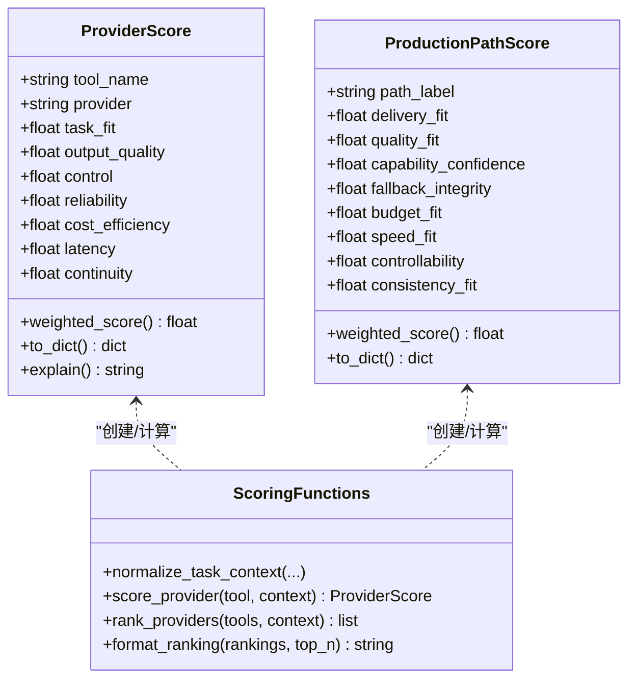
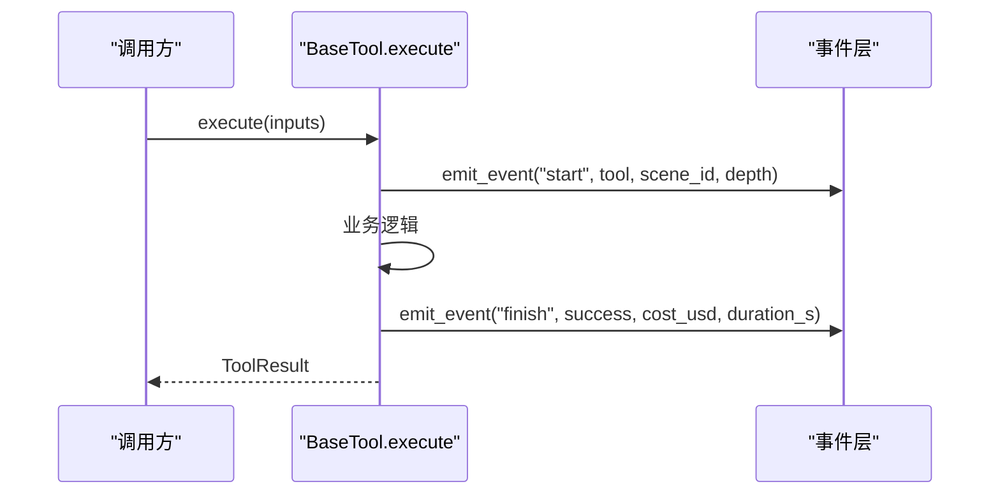
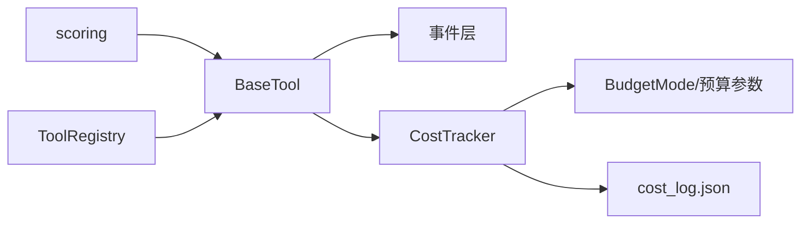

# 性能监控

<cite>
**本文引用的文件**
- [tools/cost_tracker.py](file://tools/cost_tracker.py)
- [lib/scoring.py](file://lib/scoring.py)
- [lib/config_model.py](file://lib/config_model.py)
- [tools/base_tool.py](file://tools/base_tool.py)
- [tools/tool_registry.py](file://tools/tool_registry.py)
- [schemas/artifacts/cost_log.schema.json](file://schemas/artifacts/cost_log.schema.json)
- [tests/tools/test_cost_tracker_governance.py](file://tests/tools/test_cost_tracker_governance.py)
- [tests/contracts/test_phase0_contracts.py](file://tests/contracts/test_phase0_contracts.py)
</cite>

## 目录
1. [简介](#简介)
2. [项目结构](#项目结构)
3. [核心组件](#核心组件)
4. [架构总览](#架构总览)
5. [详细组件分析](#详细组件分析)
6. [依赖关系分析](#依赖关系分析)
7. [性能考量](#性能考量)
8. [故障排查指南](#故障排查指南)
9. [结论](#结论)
10. [附录](#附录)

## 简介
本文件面向OpenMontage的性能监控系统，聚焦以下目标：
- 成本追踪器：API调用计费、资源消耗统计、预算控制（观察/警告/封顶）与持久化。
- 性能指标收集机制：工具执行耗时、成本、状态等事件埋点；资源需求声明（CPU/内存/GPU/网络）。
- 评分引擎：提供者选择的多维加权评分，解释性与可审计性。
- 监控数据存储与分析：成本日志的Schema约束、时间序列与聚合能力。
- 性能调优指南：瓶颈识别、资源优化、并发控制最佳实践。
- 监控仪表板使用：如何解读数据并定位问题。

## 项目结构
围绕性能监控的关键代码分布在如下位置：
- 成本追踪与预算治理：tools/cost_tracker.py
- 评分引擎：lib/scoring.py
- 运行时配置（预算模式等）：lib/config_model.py
- 工具基类与执行埋点：tools/base_tool.py
- 工具注册与能力报告：tools/tool_registry.py
- 成本日志数据模型：schemas/artifacts/cost_log.schema.json
- 行为验证测试：tests/tools/test_cost_tracker_governance.py、tests/contracts/test_phase0_contracts.py

图表来源
- [tools/base_tool.py:148-224](file://tools/base_tool.py#L148-L224)
- [tools/cost_tracker.py:101-179](file://tools/cost_tracker.py#L101-L179)
- [tools/tool_registry.py:198-230](file://tools/tool_registry.py#L198-L230)
- [lib/scoring.py:373-542](file://lib/scoring.py#L373-L542)
- [lib/config_model.py:16-40](file://lib/config_model.py#L16-L40)

章节来源
- [tools/base_tool.py:148-224](file://tools/base_tool.py#L148-L224)
- [tools/cost_tracker.py:101-179](file://tools/cost_tracker.py#L101-L179)
- [tools/tool_registry.py:198-230](file://tools/tool_registry.py#L198-L230)
- [lib/scoring.py:373-542](file://lib/scoring.py#L373-L542)
- [lib/config_model.py:16-40](file://lib/config_model.py#L16-L40)

## 核心组件
- 成本追踪器（CostTracker）
  - 职责：记录预估、预留与实际花费；按预算模式进行控制；支持参考驱动的成本估算；持久化到JSON。
  - 关键能力：estimate/reserve/reconcile/refund；usable_budget计算；审批阈值与单动作阈值控制。
- 评分引擎（scoring）
  - 职责：对候选提供者进行多维打分与排序；输出可解释的评分原因。
  - 关键能力：任务匹配度、质量、可控性、可靠性、成本效率、延迟、连续性等维度加权。
- 工具基类（BaseTool）
  - 职责：统一工具契约；自动为execute注入事件埋点；提供成本/时长估算接口；资源需求声明。
- 工具注册表（ToolRegistry）
  - 职责：发现与登记工具；生成能力/状态报告；提供GPU/网络需求工具列表。
- 配置模型（config_model）
  - 职责：加载预算模式、总额、预留比例、单动作审批阈值等配置。
- 成本日志Schema（cost_log.schema.json）
  - 职责：定义成本日志的数据结构与校验规则。

章节来源
- [tools/cost_tracker.py:40-179](file://tools/cost_tracker.py#L40-L179)
- [lib/scoring.py:21-107](file://lib/scoring.py#L21-L107)
- [tools/base_tool.py:227-397](file://tools/base_tool.py#L227-L397)
- [tools/tool_registry.py:55-230](file://tools/tool_registry.py#L55-L230)
- [lib/config_model.py:16-40](file://lib/config_model.py#L16-L40)
- [schemas/artifacts/cost_log.schema.json:1-36](file://schemas/artifacts/cost_log.schema.json#L1-L36)

## 架构总览
系统通过“工具执行→事件埋点→成本追踪→评分选择→注册表能力”形成闭环：
- 工具执行时自动记录start/finish/error事件，附带耗时与成本。
- 成本追踪器在调用前进行预估与预留，并在完成后对账。
- 评分引擎基于工具信息与上下文进行多维度打分，辅助选择最优提供者。
- 注册表汇总工具能力与状态，支撑上层编排与展示。

图表来源
- [tools/base_tool.py:148-224](file://tools/base_tool.py#L148-L224)
- [tools/cost_tracker.py:101-179](file://tools/cost_tracker.py#L101-L179)
- [lib/config_model.py:16-40](file://lib/config_model.py#L16-L40)
- [lib/scoring.py:373-542](file://lib/scoring.py#L373-L542)
- [tools/tool_registry.py:198-230](file://tools/tool_registry.py#L198-L230)

## 详细组件分析

### 成本追踪器（CostTracker）
- 设计要点
  - 三阶段生命周期：预估→预留→对账；失败/退款路径清晰。
  - 预算模式：观察（仅记录）、警告（标记超支）、封顶（直接阻止）。
  - 审批策略：新付费工具首次使用需审批；单动作超过阈值需审批。
  - 参考驱动估算：基于视频分析简报与目标时长，估算场景数、运动比例、TTS字数、图像/视频片段数量，给出成本区间与置信度。
- 复杂度与性能
  - 估算过程涉及场景计数、运动比例推断、重试缓冲计算，整体线性于输入规模（场景数、词数），开销较低。
  - 持久化采用JSON写入，适合中小规模日志；高频写入时可考虑批处理或异步落盘。
- 错误处理
  - 超预算在封顶模式下抛出异常；警告模式下记录warning字段；未找到条目抛KeyError。
- 存储与Schema
  - 遵循cost_log.schema.json的结构，包含版本、预算、条目数组等。

图表来源
- [tools/cost_tracker.py:101-179](file://tools/cost_tracker.py#L101-L179)
- [lib/config_model.py:16-40](file://lib/config_model.py#L16-L40)

章节来源
- [tools/cost_tracker.py:40-179](file://tools/cost_tracker.py#L40-L179)
- [schemas/artifacts/cost_log.schema.json:1-36](file://schemas/artifacts/cost_log.schema.json#L1-L36)
- [tests/tools/test_cost_tracker_governance.py:15-56](file://tests/tools/test_cost_tracker_governance.py#L15-L56)
- [tests/contracts/test_phase0_contracts.py:475-506](file://tests/contracts/test_phase0_contracts.py#L475-L506)

### 评分引擎（scoring）
- 设计要点
  - 多维评分：任务匹配度、输出质量、可控性、可靠性、成本效率、延迟、连续性。
  - 语义扩展：同义词簇与分词器提升意图匹配精度。
  - 成本效率：结合剩余预算与绝对成本启发式打分。
  - 连续性：优先选择已锁定提供者以保持一致性。
  - 输出解释：提供人类可读的评分原因摘要。
- 复杂度与性能
  - 评分函数为常数级权重计算，主要开销在文本分词与集合运算，整体高效。
- 集成点
  - 从工具信息中获取稳定性、历史成功率、延迟P50、质量分数等指标；结合上下文动态调整。

图表来源
- [lib/scoring.py:21-107](file://lib/scoring.py#L21-L107)
- [lib/scoring.py:373-542](file://lib/scoring.py#L373-L542)

章节来源
- [lib/scoring.py:21-107](file://lib/scoring.py#L21-L107)
- [lib/scoring.py:373-542](file://lib/scoring.py#L373-L542)

### 工具基类与执行埋点（BaseTool）
- 设计要点
  - 自动为execute注入事件埋点：记录start/finish/error，附带耗时与成本。
  - 资源需求声明：CPU核数、内存、显存、磁盘、网络需求。
  - 成本/时长估算接口：供评分引擎与成本追踪器使用。
  - 状态检查：依赖检测与可用性上报。
- 性能影响
  - 事件埋点轻量且非致命，不影响主流程；可通过depth去重避免重复统计。
- 集成点
  - 与注册表配合，提供能力与状态报告；与评分引擎共享工具元数据。

图表来源
- [tools/base_tool.py:148-224](file://tools/base_tool.py#L148-L224)
- [tools/base_tool.py:227-397](file://tools/base_tool.py#L227-L397)

章节来源
- [tools/base_tool.py:148-224](file://tools/base_tool.py#L148-L224)
- [tools/base_tool.py:227-397](file://tools/base_tool.py#L227-L397)

### 工具注册表（ToolRegistry）
- 设计要点
  - 自动发现与登记工具；按能力/提供商/层级/状态查询。
  - 生成能力包络与提供商菜单，用于编排与用户展示。
  - 提供GPU/网络需求工具列表，辅助资源规划。
- 性能影响
  - 发现过程仅在首次确保时执行；后续查询为内存索引，开销低。

章节来源
- [tools/tool_registry.py:55-230](file://tools/tool_registry.py#L55-L230)
- [tools/tool_registry.py:476-488](file://tools/tool_registry.py#L476-L488)

### 配置模型（config_model）
- 设计要点
  - 预算模式：observe/warn/cap。
  - 预算参数：总额、预留比例、单动作审批阈值、新付费工具审批开关。
  - 路径与输出配置：便于定位日志与产物。

章节来源
- [lib/config_model.py:16-40](file://lib/config_model.py#L16-L40)

## 依赖关系分析
- 组件耦合
  - BaseTool与事件层松耦合，事件失败不阻塞主流程。
  - CostTracker依赖配置模型与JSON持久化，无外部服务依赖。
  - 评分引擎依赖工具元数据与上下文，无外部I/O。
  - 注册表依赖BaseTool的能力声明，集中管理工具生态。
- 外部依赖
  - JSON文件读写（成本日志）。
  - 环境变量与依赖检测（命令/模块/二进制）。

图表来源
- [tools/base_tool.py:148-224](file://tools/base_tool.py#L148-L224)
- [tools/cost_tracker.py:101-179](file://tools/cost_tracker.py#L101-L179)
- [lib/config_model.py:16-40](file://lib/config_model.py#L16-L40)
- [tools/tool_registry.py:198-230](file://tools/tool_registry.py#L198-L230)
- [lib/scoring.py:373-542](file://lib/scoring.py#L373-L542)

章节来源
- [tools/base_tool.py:148-224](file://tools/base_tool.py#L148-L224)
- [tools/cost_tracker.py:101-179](file://tools/cost_tracker.py#L101-L179)
- [lib/config_model.py:16-40](file://lib/config_model.py#L16-L40)
- [tools/tool_registry.py:198-230](file://tools/tool_registry.py#L198-L230)
- [lib/scoring.py:373-542](file://lib/scoring.py#L373-L542)

## 性能考量
- 成本追踪
  - 预估与预留应在执行前完成，避免超额消费；对账及时释放预留额度。
  - 在高并发场景下，建议将JSON写入改为批量或异步落盘，减少IO竞争。
- 评分引擎
  - 文本分词与集合运算开销小；可在批量评分时缓存分词结果。
  - 利用历史成功率与延迟P50提升选择准确性。
- 工具执行
  - 事件埋点为非致命操作，但应避免在热点路径中进行昂贵序列化。
  - 资源需求声明应准确，便于上游进行容量规划与调度。
- 存储与分析
  - 成本日志适合短期回溯；长期趋势分析建议导出至时序数据库或数据仓库。
  - 聚合统计可按工具、提供商、时间段进行，便于识别高成本项。

[本节为通用指导，无需特定文件引用]

## 故障排查指南
- 常见错误
  - 预算超限：在封顶模式下会抛出异常；检查预算模式与可用预算。
  - 审批缺失：新付费工具首次使用或单动作超阈值需审批；使用approve_tool或通过配置降低阈值。
  - 条目不存在：对账时若ID无效会抛KeyError；确认estimate返回的ID正确传递。
- 诊断步骤
  - 查看成本日志entries，核对estimated/reserved/actual与状态流转。
  - 检查事件埋点中的duration_s与cost_usd，定位慢调用或高成本调用。
  - 使用注册表的provider_menu_summary快速了解各能力配置情况与运行警告。
- 恢复策略
  - 调整预算模式为观察或警告，先收集数据再收紧控制。
  - 对频繁失败的提供者启用回退工具或降低优先级。

章节来源
- [tools/cost_tracker.py:117-179](file://tools/cost_tracker.py#L117-L179)
- [tests/tools/test_cost_tracker_governance.py:15-56](file://tests/tools/test_cost_tracker_governance.py#L15-L56)
- [tests/contracts/test_phase0_contracts.py:475-506](file://tests/contracts/test_phase0_contracts.py#L475-L506)
- [tools/tool_registry.py:316-471](file://tools/tool_registry.py#L316-L471)

## 结论
OpenMontage的性能监控体系以成本追踪为核心，结合工具执行埋点、评分引擎与注册表能力报告，形成可观测、可控制、可解释的闭环。通过合理的预算模式与审批策略，可在保证质量的同时控制成本；通过事件与日志，可实现时间序列分析与趋势洞察。建议在大规模部署中引入异步落盘与外部时序存储，进一步提升可扩展性与分析能力。

[本节为总结，无需特定文件引用]

## 附录
- 监控仪表板使用建议
  - 关注指标：总花费、预留金额、剩余预算、单次耗时、成本分布。
  - 解读方法：对比不同提供商的cost_efficiency与latency，结合quality_score与historical_success_rate评估性价比。
  - 问题定位：通过事件埋点的tool与scene_id关联具体场景；结合注册表的状态报告定位不可用或降级工具。
- 最佳实践
  - 合理设置预算模式与阈值，逐步收紧控制。
  - 为高成本工具配置回退与重试策略。
  - 定期导出成本日志进行分析，识别优化机会。

[本节为补充说明，无需特定文件引用]