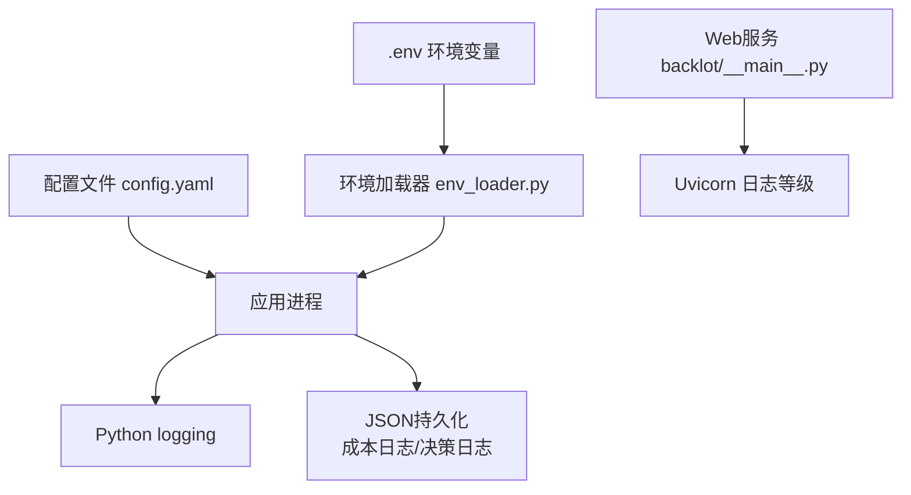
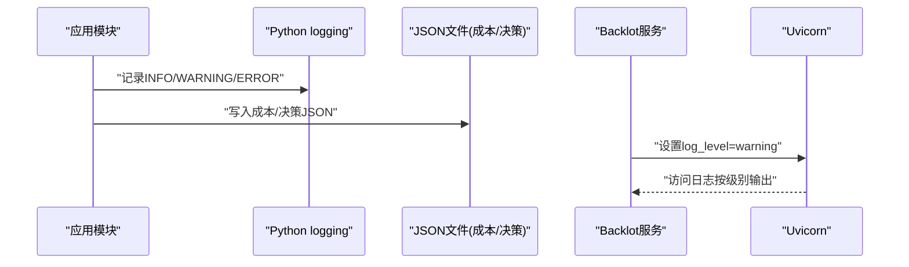
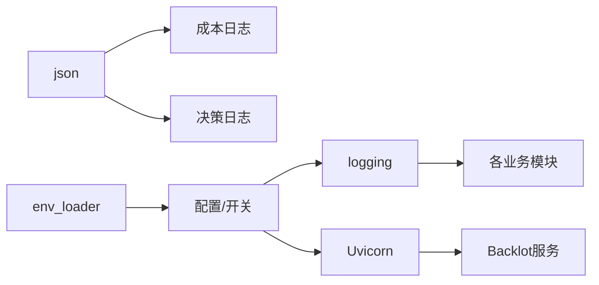

# 日志管理

<cite>
**本文引用的文件**
- [config.yaml](file://config.yaml)
- [env_loader.py](file://lib/env_loader.py)
- [checkpoint.py](file://lib/checkpoint.py)
- [video_compose.py](file://tools/video/video_compose.py)
- [cost_tracker.py](file://tools/cost_tracker.py)
- [clip_cache.py](file://tools/video/clip_cache.py)
- [seedance_ark.py](file://tools/video/seedance_ark.py)
- [__main__.py](file://backlot/__main__.py)
</cite>

## 目录
1. [简介](#简介)
2. [项目结构](#项目结构)
3. [核心组件](#核心组件)
4. [架构总览](#架构总览)
5. [详细组件分析](#详细组件分析)
6. [依赖关系分析](#依赖关系分析)
7. [性能考虑](#性能考虑)
8. [故障排查指南](#故障排查指南)
9. [结论](#结论)
10. [附录](#附录)

## 简介
本文件面向OpenMontage的日志管理系统，聚焦以下目标：
- 结构化日志格式设计：统一日志级别、字段定义与序列化规范。
- 日志收集策略：应用日志、访问日志、错误日志的分类与存储方案。
- 日志轮转与清理：文件大小限制、保留策略与归档管理。
- 日志查询与分析：搜索语法、过滤条件与统计分析能力。
- 调试技巧：日志级别配置、输出格式定制与性能影响评估。
- 故障排查：通过日志定位问题并优化系统性能。

本项目采用Python标准库logging进行日志记录，结合JSON持久化（成本日志、决策日志）与进程级日志等级控制，形成“代码内结构化记录 + 外部可观测”的体系。

## 项目结构
OpenMontage在日志方面呈现“分散式记录、集中式配置”的特点：
- 全局配置：config.yaml提供输出路径等基础配置项，便于扩展日志目录。
- 环境变量加载：lib/env_loader.py负责读取.env并暴露get_env/require_env接口，可用于注入日志相关开关或路径。
- 业务模块：各工具与管线模块使用logging记录运行信息；部分模块将关键事件以JSON写入磁盘（如成本日志、决策日志）。
- Web服务：Backlot服务通过uvicorn启动时设置log_level，用于控制HTTP访问日志级别。

图表来源
- [config.yaml:1-34](file://config.yaml#L1-L34)
- [env_loader.py:1-35](file://lib/env_loader.py#L1-L35)
- [__main__.py:85-85](file://backlot/__main__.py#L85-L85)

章节来源
- [config.yaml:1-34](file://config.yaml#L1-L34)
- [env_loader.py:1-35](file://lib/env_loader.py#L1-L35)
- [__main__.py:85-85](file://backlot/__main__.py#L85-L85)

## 核心组件
- 日志记录器（logging）：各模块通过logging.getLogger(__name__)记录INFO/WARNING/ERROR等事件，便于按模块分级输出。
- JSON持久化日志：
  - 成本日志：tools/cost_tracker.py将预算与调用明细序列化为JSON文件，支持增量追加与幂等保存。
  - 决策日志：lib/checkpoint.py维护decisions列表，去重后追加到checkpoint JSON中。
- 敏感信息脱敏：tools/video/seedance_ark.py对URL与Authorization头进行正则替换，避免敏感信息泄露。
- 缓存与清理：tools/video/clip_cache.py实现LRU淘汰与文件删除，体现“资源占用可控”的清理思想，可类比日志清理策略。
- 服务日志等级：backlot/__main__.py通过uvicorn参数控制访问日志级别，便于生产环境降噪。

章节来源
- [checkpoint.py:60-75](file://lib/checkpoint.py#L60-L75)
- [cost_tracker.py:485-523](file://tools/cost_tracker.py#L485-L523)
- [clip_cache.py:474-516](file://tools/video/clip_cache.py#L474-L516)
- [seedance_ark.py:1438-1473](file://tools/video/seedance_ark.py#L1438-L1473)
- [__main__.py:85-85](file://backlot/__main__.py#L85-L85)

## 架构总览
下图展示OpenMontage日志系统的整体架构：应用模块通过logging输出结构化日志，同时关键业务事件以JSON落盘；Web服务层通过进程参数控制访问日志级别；环境与配置文件为日志行为提供外部化能力。

图表来源
- [checkpoint.py:60-75](file://lib/checkpoint.py#L60-L75)
- [cost_tracker.py:485-523](file://tools/cost_tracker.py#L485-L523)
- [__main__.py:85-85](file://backlot/__main__.py#L85-L85)

## 详细组件分析

### 结构化日志格式设计
- 日志级别
  - INFO：常规流程、关键步骤提示。
  - WARNING：可恢复异常、降级策略触发、非致命错误。
  - ERROR：不可恢复错误、失败重试、外部依赖异常。
  - DEBUG：仅开发/诊断时使用，避免生产噪音。
- 字段定义（建议）
  - timestamp：ISO8601时间戳（UTC），便于跨时区对齐。
  - level：日志级别字符串。
  - module：模块名（logger名称），便于定位来源。
  - trace_id：请求/任务追踪ID，贯穿上下游。
  - event：事件类型（如“render_start”、“tool_call”、“error”）。
  - payload：结构化数据对象（键值对），避免拼接长文本。
  - redacted：布尔标记，指示是否已脱敏。
- 序列化格式
  - 推荐JSON单行记录，便于日志采集器解析。
  - 大对象分片或截断，避免单条日志过大。
  - 敏感字段统一脱敏后再序列化。

章节来源
- [checkpoint.py:60-75](file://lib/checkpoint.py#L60-L75)
- [seedance_ark.py:1438-1473](file://tools/video/seedance_ark.py#L1438-L1473)

### 日志收集策略
- 应用日志
  - 通过logging输出至标准输出或文件，按模块划分。
  - 关键阶段（编解码、渲染、转码）记录开始/结束、耗时、输入输出路径。
- 访问日志
  - Backlot服务通过Uvicorn控制访问日志级别，生产建议设为warning以减少IO压力。
- 错误日志
  - 捕获异常并记录堆栈、上下文、trace_id；必要时写入独立错误日志文件。
- 存储方案
  - 短期：标准输出+本地文件（便于容器化采集）。
  - 中期：按天滚动归档，保留N天。
  - 长期：成本日志/决策日志等关键JSON持久化，供审计与回溯。

章节来源
- [__main__.py:85-85](file://backlot/__main__.py#L85-L85)
- [cost_tracker.py:485-523](file://tools/cost_tracker.py#L485-L523)
- [checkpoint.py:412-419](file://lib/checkpoint.py#L412-L419)

### 日志轮转与清理机制
- 文件大小限制
  - 建议按大小（如100MB）或时间（每天）轮转，避免单文件过大。
  - 参考缓存淘汰思想：当空间不足时优先清理最旧或最少使用的条目。
- 保留策略
  - 保留最近N个轮转文件，超出则删除。
  - 成本/决策等关键JSON需单独保留更长时间，满足审计需求。
- 归档管理
  - 压缩归档（gzip）并移至历史目录，便于离线分析。
  - 归档命名包含日期与版本，便于检索。

章节来源
- [clip_cache.py:474-516](file://tools/video/clip_cache.py#L474-L516)

### 日志查询与分析工具
- 搜索语法
  - 支持按level、module、event、trace_id、timestamp范围进行过滤。
  - 支持payload字段精确匹配与模糊匹配。
- 过滤条件
  - 排除DEBUG级别；限定特定模块；仅关注ERROR/WARNING。
  - 基于trace_id串联一次请求的全链路日志。
- 统计分析
  - 统计各模块错误率、平均耗时、峰值QPS。
  - 成本日志聚合：按工具/模型维度统计花费与调用次数。
  - 决策日志审计：统计审批通过率与拒绝原因分布。

[本节为概念性说明，不直接分析具体文件]

### 调试技巧
- 日志级别配置
  - 开发环境：DEBUG以便快速定位问题。
  - 测试环境：INFO/WARNING平衡可读性与性能。
  - 生产环境：WARNING/ERROR减少IO与网络开销。
- 输出格式定制
  - 统一JSON格式，便于采集与解析。
  - 增加trace_id、模块名、事件类型等关键字段。
- 性能影响评估
  - 高频路径避免打印大对象；必要时采样记录。
  - 异步写入或批量落盘降低阻塞。
  - 关闭不必要的DEBUG日志，减少磁盘与CPU消耗。

章节来源
- [env_loader.py:15-34](file://lib/env_loader.py#L15-L34)
- [__main__.py:85-85](file://backlot/__main__.py#L85-L85)

### 故障排查指南
- 常见问题定位
  - 编解码失败：查看video_compose相关日志，确认输入路径、参数与FFmpeg可用性。
  - 外部API失败：检查错误日志中的状态码与响应体（已脱敏），结合trace_id追踪。
  - 资源不足：参考clip_cache淘汰逻辑，检查磁盘空间与缓存命中率。
- 性能优化
  - 降低日志级别或采样频率。
  - 合并小对象为结构化payload，减少多次I/O。
  - 对热点路径启用异步日志或缓冲写入。
- 安全合规
  - 确保URL、Authorization等敏感信息已脱敏。
  - 成本日志与决策日志权限最小化，防止泄露。

章节来源
- [video_compose.py:35-234](file://tools/video/video_compose.py#L35-L234)
- [clip_cache.py:474-516](file://tools/video/clip_cache.py#L474-L516)
- [seedance_ark.py:1438-1473](file://tools/video/seedance_ark.py#L1438-L1473)

## 依赖关系分析
OpenMontage日志相关依赖如下：
- Python标准库logging：所有模块通用。
- JSON序列化：用于成本日志与决策日志的持久化。
- Uvicorn：控制Web访问日志级别。
- 环境变量：通过env_loader注入日志相关配置（如路径、开关）。

图表来源
- [env_loader.py:15-34](file://lib/env_loader.py#L15-L34)
- [cost_tracker.py:485-523](file://tools/cost_tracker.py#L485-L523)
- [checkpoint.py:412-419](file://lib/checkpoint.py#L412-L419)
- [__main__.py:85-85](file://backlot/__main__.py#L85-L85)

章节来源
- [env_loader.py:15-34](file://lib/env_loader.py#L15-L34)
- [cost_tracker.py:485-523](file://tools/cost_tracker.py#L485-L523)
- [checkpoint.py:412-419](file://lib/checkpoint.py#L412-L419)
- [__main__.py:85-85](file://backlot/__main__.py#L85-L85)

## 性能考虑
- 日志级别与采样：生产环境默认WARNING/ERROR，关键路径可采样记录DEBUG。
- I/O优化：批量写入、异步落盘、压缩归档，减少磁盘压力。
- 内存与CPU：避免在热路径构造大对象；结构化payload优于拼接字符串。
- 容量规划：根据QPS与日志量估算磁盘与带宽，预留冗余。

[本节提供通用指导，不直接分析具体文件]

## 故障排查指南
- 快速定位
  - 使用trace_id串联一次请求的完整日志。
  - 按模块与级别过滤，缩小范围。
- 典型场景
  - 渲染失败：检查video_compose日志与FFmpeg命令参数。
  - API超时：查看错误日志中的上游状态码与重试次数。
  - 磁盘告警：参考clip_cache淘汰策略，清理过期缓存与日志。
- 回归验证
  - 调整日志级别后复测，确认性能回退未发生。
  - 对关键路径添加结构化日志，提升可观测性。

章节来源
- [video_compose.py:35-234](file://tools/video/video_compose.py#L35-L234)
- [clip_cache.py:474-516](file://tools/video/clip_cache.py#L474-L516)

## 结论
OpenMontage的日志体系以logging为核心，辅以JSON持久化与环境/配置外置，形成了可扩展、可审计、可观测的基础设施。通过统一的字段规范、合理的轮转清理策略、完善的查询分析与调试技巧，能够有效支撑日常运维与问题定位。建议在后续迭代中进一步完善日志采集与可视化平台，提升全链路可观测性。

[本节总结性内容，不直接分析具体文件]

## 附录
- 配置建议
  - 在config.yaml中新增日志目录、轮转策略等键值，便于统一管理。
  - 通过.env注入日志开关、采样率、输出路径等运行时参数。
- 最佳实践
  - 所有日志必须结构化；敏感信息必须脱敏。
  - 关键操作必须有trace_id；错误日志必须包含上下文。
  - 定期审查日志量与保留策略，避免磁盘耗尽。

章节来源
- [config.yaml:1-34](file://config.yaml#L1-L34)
- [env_loader.py:15-34](file://lib/env_loader.py#L15-L34)