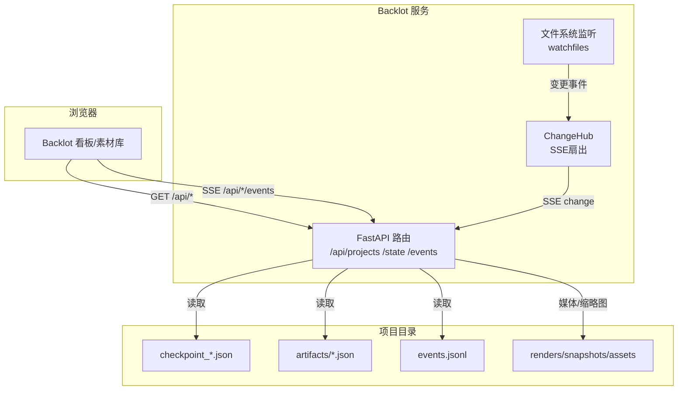
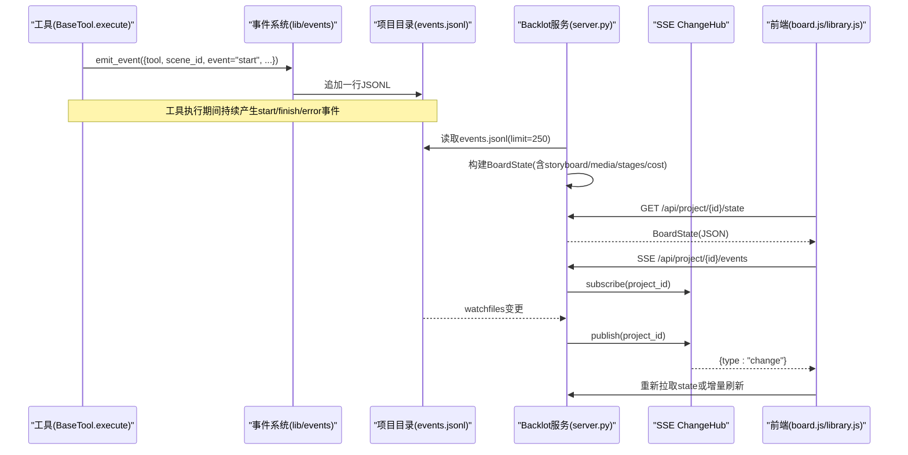
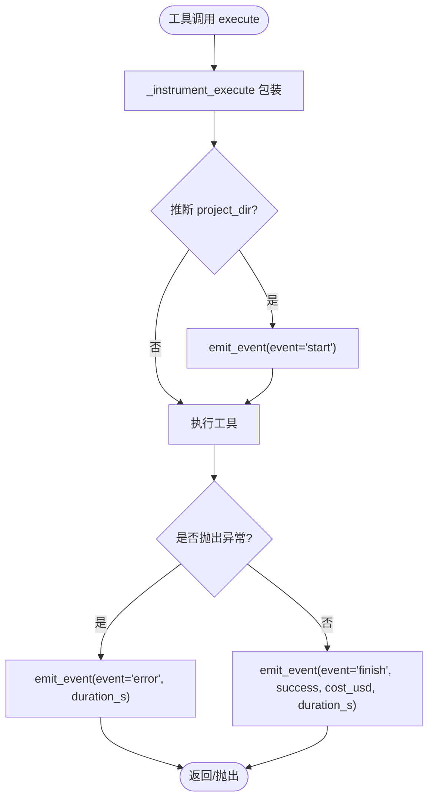
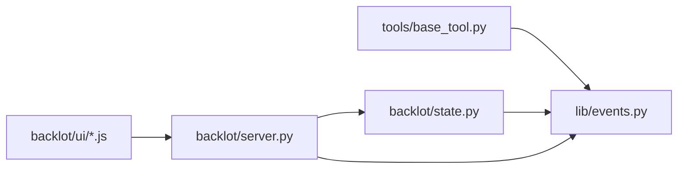

# 监控与日志

<cite>
**本文引用的文件**
- [backlot/server.py](file://backlot/server.py)
- [backlot/state.py](file://backlot/state.py)
- [lib/events.py](file://lib/events.py)
- [tools/base_tool.py](file://tools/base_tool.py)
- [backlot/ui/board.js](file://backlot/ui/board.js)
- [backlot/ui/lib.js](file://backlot/ui/lib.js)
- [backlot/ui/library.js](file://backlot/ui/library.js)
</cite>

## 目录
1. [简介](#简介)
2. [项目结构](#项目结构)
3. [核心组件](#核心组件)
4. [架构总览](#架构总览)
5. [详细组件分析](#详细组件分析)
6. [依赖关系分析](#依赖关系分析)
7. [性能考量](#性能考量)
8. [故障排查指南](#故障排查指南)
9. [结论](#结论)
10. [附录](#附录)

## 简介
本文件面向OpenMontage的监控与日志系统，重点说明Backlot监控界面的功能与使用方法、事件系统的架构设计、以及当前可观测性能力。文档同时给出可扩展建议，帮助团队在现有基础上完善CPU/内存/GPU等关键指标的采集与展示、结构化日志轮转与查询、告警规则与通知机制，确保监控系统的完整性与可用性。

## 项目结构
Backlot由后端服务、状态推导、事件流与前端界面组成：
- 后端服务（FastAPI）提供REST API与SSE事件流，负责监听项目目录变更并推送更新。
- 状态推导模块将项目目录中的checkpoint、artifacts、events等聚合为BoardState供UI渲染。
- 事件系统以append-only的JSONL文件记录工具执行事件，支持按项目自动归因。
- 前端通过SSE订阅变更，实时刷新看板、时间线、素材库等视图。

图表来源
- [backlot/server.py:165-307](file://backlot/server.py#L165-L307)
- [backlot/state.py:588-658](file://backlot/state.py#L588-L658)
- [lib/events.py:77-118](file://lib/events.py#L77-L118)

章节来源
- [backlot/server.py:1-369](file://backlot/server.py#L1-L369)
- [backlot/state.py:1-716](file://backlot/state.py#L1-L716)
- [lib/events.py:1-119](file://lib/events.py#L1-L119)

## 核心组件
- Backlot服务端：提供健康检查、项目列表、项目状态、SSE事件流、媒体与缩略图服务；后台任务监听项目目录变更并通过ChangeHub广播。
- 状态推导：从checkpoint、artifacts、events、media等构建BoardState，包含流水线阶段、故事板、成本、活动状态、停滞检测等。
- 事件系统：工具执行时自动写入events.jsonl，支持start/finish/error事件，带时间戳、工具名、场景ID、耗时、成本等字段。
- 前端界面：看板页与素材库页通过SSE订阅变更，实时显示进度、错误、生成中状态、决策日志、活动流等。

章节来源
- [backlot/server.py:165-307](file://backlot/server.py#L165-L307)
- [backlot/state.py:588-658](file://backlot/state.py#L588-L658)
- [lib/events.py:77-118](file://lib/events.py#L77-L118)
- [backlot/ui/board.js:1-800](file://backlot/ui/board.js#L1-L800)
- [backlot/ui/lib.js:1-104](file://backlot/ui/lib.js#L1-L104)
- [backlot/ui/library.js:1-92](file://backlot/ui/library.js#L1-L92)

## 架构总览
下图展示了从工具执行到前端展示的完整链路：

图表来源
- [tools/base_tool.py:148-224](file://tools/base_tool.py#L148-L224)
- [lib/events.py:77-118](file://lib/events.py#L77-L118)
- [backlot/server.py:132-240](file://backlot/server.py#L132-L240)
- [backlot/state.py:588-658](file://backlot/state.py#L588-L658)
- [backlot/ui/lib.js:66-81](file://backlot/ui/lib.js#L66-L81)

## 详细组件分析

### Backlot监控界面（看板与素材库）
- 实时状态查看：
  - 看板顶部显示“LIVE/IDLE/AWAITING YOU/STALLED?”状态，结合last_activity与阶段状态判断。
  - 左侧阶段轨显示各阶段状态（pending/in_progress/completed/awaiting_human/failed），支持点击展开查看产物与评审信息。
  - 右侧面板展示“决策日志”和“活动流”，活动流基于events.jsonl解析start/finish/error，显示运行中、完成、失败及耗时、成本。
- 进度跟踪：
  - 故事板胶片条显示每个场景的视觉资产、音频、生成中状态（generating）、多take对比、叙事文本与播放。
  - 生成中状态由事件驱动：最近一条顶层start未匹配finish/error即视为仍在生成。
- 错误诊断：
  - 阶段失败时显示错误摘要；停滞检测基于最后活动时间超过阈值标记stalled。
  - 缺失资源或不可渲染资产会回退到规格描述或快照。
- 使用方式：
  - 打开项目看板：/p/{project_id}
  - 打开素材库：/ （显示所有项目卡片，支持SSE实时更新）
  - 主题切换、静态模式（?static=1）禁用SSE

章节来源
- [backlot/ui/board.js:50-153](file://backlot/ui/board.js#L50-L153)
- [backlot/ui/board.js:610-658](file://backlot/ui/board.js#L610-L658)
- [backlot/ui/board.js:671-800](file://backlot/ui/board.js#L671-L800)
- [backlot/ui/library.js:32-92](file://backlot/ui/library.js#L32-L92)
- [backlot/server.py:280-307](file://backlot/server.py#L280-L307)

### 事件系统架构
- 事件类型：
  - start：工具开始执行，携带tool、scene_id、depth、output_path等。
  - finish：工具结束，携带success、duration_s、cost_usd等。
  - error：工具异常，携带error、duration_s等。
- 事件写入：
  - BaseTool对execute进行装饰器包装，自动注入事件发射逻辑；写入项目目录下的events.jsonl，线程安全追加。
  - 项目归属推断：优先显式project_dir/project_path，其次从输出/输入路径推断projects根下的项目。
- 事件消费：
  - 状态推导读取events.jsonl（限制条数），用于构建storyboard的生成中状态与活动流。
  - 服务端SSE接口根据文件系统变更广播change事件，前端订阅后刷新。

图表来源
- [tools/base_tool.py:148-224](file://tools/base_tool.py#L148-L224)
- [lib/events.py:46-95](file://lib/events.py#L46-L95)

章节来源
- [tools/base_tool.py:148-224](file://tools/base_tool.py#L148-L224)
- [lib/events.py:46-118](file://lib/events.py#L46-L118)
- [backlot/state.py:588-658](file://backlot/state.py#L588-L658)

### 性能监控方案（现状与建议）
- 现状：
  - 无内置CPU/内存/GPU指标采集与展示。
  - 工具元数据包含resource_profile（cpu_cores、ram_mb、vram_mb、disk_mb、network_required），可用于容量规划与提示。
  - 事件包含duration_s与cost_usd，可间接反映吞吐与成本。
- 建议扩展：
  - 在BaseTool装饰器中采集运行时指标（如psutil获取进程CPU/内存，nvidia-ml获取GPU利用率），写入独立metrics.jsonl或通过Prometheus客户端暴露。
  - 在服务端增加/api/metrics端点，供Grafana/Prometheus抓取。
  - 在前端增加“性能面板”，展示最近N次工具调用的耗时分布、成本趋势、资源峰值。

章节来源
- [tools/base_tool.py:110-118](file://tools/base_tool.py#L110-L118)
- [tools/base_tool.py:329-372](file://tools/base_tool.py#L329-L372)
- [lib/events.py:77-118](file://lib/events.py#L77-L118)

### 日志收集与分析策略（现状与建议）
- 现状：
  - 事件采用append-only JSONL格式（events.jsonl），每行一个事件对象，便于流式处理与离线分析。
  - 服务端对UI资源启用no-cache，避免缓存导致的状态不一致。
- 建议扩展：
  - 统一结构化日志：在服务层与工具层输出JSON日志（包含trace_id、project_id、tool、event、duration_s、cost_usd等）。
  - 日志轮转：按天或大小轮转，保留策略（如30天），压缩归档。
  - 日志查询：接入ELK/Loki/ClickHouse，提供按project_id、tool、event、时间范围过滤的查询界面。
  - 审计与合规：敏感字段脱敏，访问日志留存。

章节来源
- [lib/events.py:77-118](file://lib/events.py#L77-L118)
- [backlot/server.py:299-307](file://backlot/server.py#L299-L307)

### 告警规则配置与通知机制（现状与建议）
- 现状：
  - 无内置告警与通知。
  - 看板已具备“停滞检测”（in_progress且长时间无活动）与“等待人工审批”提示，可作为告警触发条件。
- 建议扩展：
  - 规则示例：
    - 阶段停滞超过阈值（如10分钟）→ 发送Slack/邮件告警。
    - 连续失败率超过阈值（如5分钟内error占比>30%）→ 告警。
    - 成本超支（累计cost_usd超过预算）→ 告警。
  - 通知渠道：Webhook、邮件、IM（Slack/钉钉/飞书）。
  - 告警收敛与去抖：同一项目/阶段合并告警，避免风暴。

章节来源
- [backlot/state.py:626-638](file://backlot/state.py#L626-L638)
- [backlot/ui/board.js:60-74](file://backlot/ui/board.js#L60-L74)

## 依赖关系分析
- 组件耦合：
  - server.py依赖state.py构建BoardState，依赖lib.events读取事件；前端依赖server.py提供的API与SSE。
  - tools.base_tool.py通过装饰器自动注入事件发射，与lib.events解耦。
- 外部依赖：
  - FastAPI、watchfiles（可选）、FFmpeg（缩略图）、PIL（图片处理）。
- 潜在循环依赖：
  - 无明显循环；事件系统仅被base_tool与state引用，server不反向依赖工具层。

图表来源
- [tools/base_tool.py:148-224](file://tools/base_tool.py#L148-L224)
- [lib/events.py:77-118](file://lib/events.py#L77-L118)
- [backlot/state.py:588-658](file://backlot/state.py#L588-L658)
- [backlot/server.py:165-307](file://backlot/server.py#L165-L307)

章节来源
- [tools/base_tool.py:148-224](file://tools/base_tool.py#L148-L224)
- [lib/events.py:77-118](file://lib/events.py#L77-L118)
- [backlot/state.py:588-658](file://backlot/state.py#L588-L658)
- [backlot/server.py:165-307](file://backlot/server.py#L165-L307)

## 性能考量
- 文件系统监听：
  - 使用watchfiles批量处理变更，忽略噪声目录（node_modules/.git/__pycache__/.cache），减少无效广播。
  - ChangeHub为每个订阅者维护队列，支持按项目过滤，避免无关项目风暴。
- 缩略图与媒体：
  - 缩略图缓存至磁盘，视频通过FFmpeg抽取帧，图片使用PIL缩放，降低带宽与渲染开销。
  - 媒体响应支持Range请求，提升大文件播放体验。
- 状态推导：
  - 阶段元数据缓存（lru_cache），摘要缓存（_summary_cache）减少重复计算。
  - 事件读取限制条数（limit=250），避免大文件拖慢。
- 前端优化：
  - SSE消息节流（250ms防抖），批量drain队列，减少频繁刷新。
  - 资源按需加载（lazy loading），失败回退到规格描述。

章节来源
- [backlot/server.py:27-31](file://backlot/server.py#L27-L31)
- [backlot/server.py:43-74](file://backlot/server.py#L43-L74)
- [backlot/server.py:132-149](file://backlot/server.py#L132-L149)
- [backlot/server.py:242-276](file://backlot/server.py#L242-L276)
- [backlot/server.py:325-365](file://backlot/server.py#L325-L365)
- [backlot/state.py:63-94](file://backlot/state.py#L63-L94)
- [backlot/state.py:588-658](file://backlot/state.py#L588-L658)
- [backlot/ui/lib.js:66-81](file://backlot/ui/lib.js#L66-L81)

## 故障排查指南
- 常见问题定位：
  - 项目无法识别：检查project_id是否合法（不含/ \ :），项目目录是否存在。
  - 媒体不可用：确认文件在项目目录下且后缀受支持；视频需能抽取帧。
  - 事件丢失：检查events.jsonl是否可写；多线程写入有锁保护，跨进程未同步但单行追加通常安全。
  - 停滞误报：确认last_activity是否更新（checkpoint/artifacts/events.jsonl）；必要时调整STALL_WINDOW_SECONDS。
- 调试步骤：
  - 查看服务端健康检查：/api/health
  - 拉取项目状态：/api/project/{id}/state
  - 订阅事件流：/api/project/{id}/events（浏览器开发者工具Network面板）
  - 检查events.jsonl内容，确认start/finish/error配对是否正确
- 恢复措施：
  - 修复权限问题（events.jsonl可写）
  - 清理损坏的checkpoint或artifacts
  - 重启服务以重建watchers与缓存

章节来源
- [backlot/server.py:310-318](file://backlot/server.py#L310-L318)
- [backlot/server.py:242-276](file://backlot/server.py#L242-L276)
- [lib/events.py:77-118](file://lib/events.py#L77-L118)
- [backlot/state.py:626-638](file://backlot/state.py#L626-L638)

## 结论
OpenMontage的Backlot监控与日志系统以“事件驱动+文件系统监听+SSE”为核心，提供了开箱即用的项目看板、实时进度跟踪与基础错误诊断。事件系统轻量可靠，前端交互直观。当前尚未内置CPU/内存/GPU等性能指标采集与告警通知，建议在BaseTool装饰器与服务端扩展指标采集、结构化日志、轮转与查询、告警规则与通知通道，以形成完整的可观测性闭环。

## 附录
- 常用端点：
  - GET /api/health：服务健康检查
  - GET /api/projects：项目列表（摘要）
  - GET /api/project/{id}/state：项目完整状态
  - GET /api/project/{id}/events：SSE事件流
  - GET /api/library/events：全局SSE事件流
  - GET /thumb/{id}/{path}?w={width}：缩略图
  - GET /media/{id}/{path}：媒体文件
- 事件字段参考：
  - tool：工具名称
  - scene_id：场景ID
  - depth：嵌套深度（selector→provider）
  - event：start/finish/error
  - output_path：输出路径
  - success：是否成功
  - duration_s：耗时（秒）
  - cost_usd：成本（美元）

章节来源
- [backlot/server.py:170-240](file://backlot/server.py#L170-L240)
- [lib/events.py:77-118](file://lib/events.py#L77-L118)