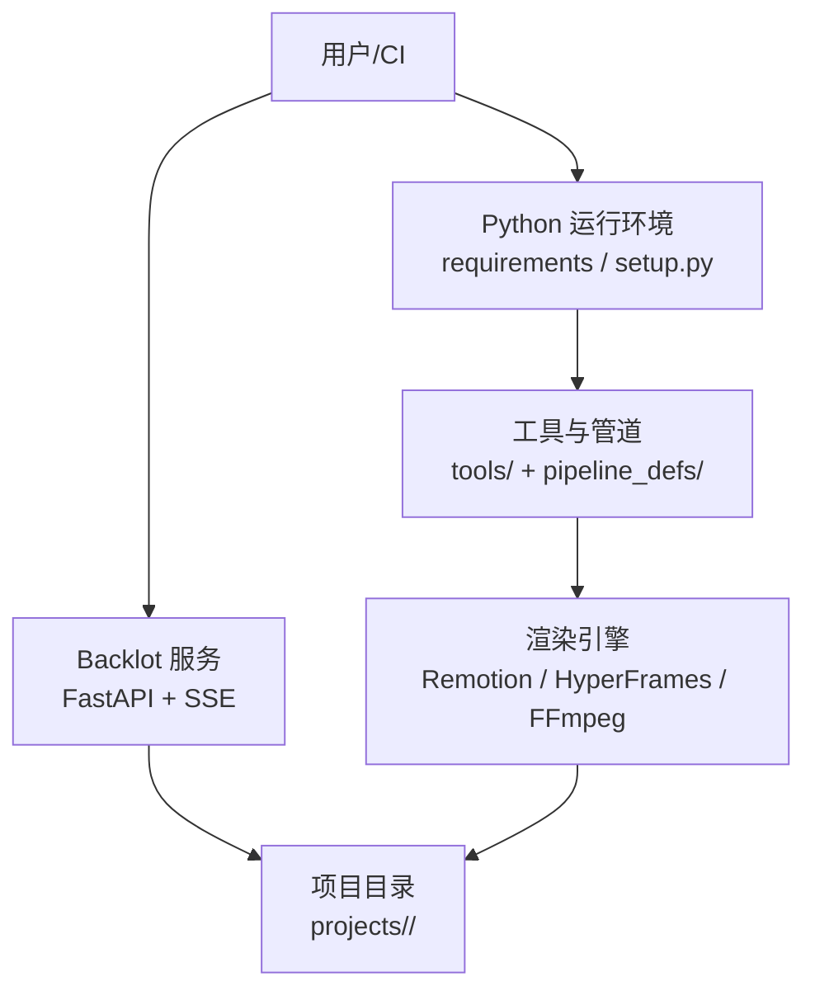
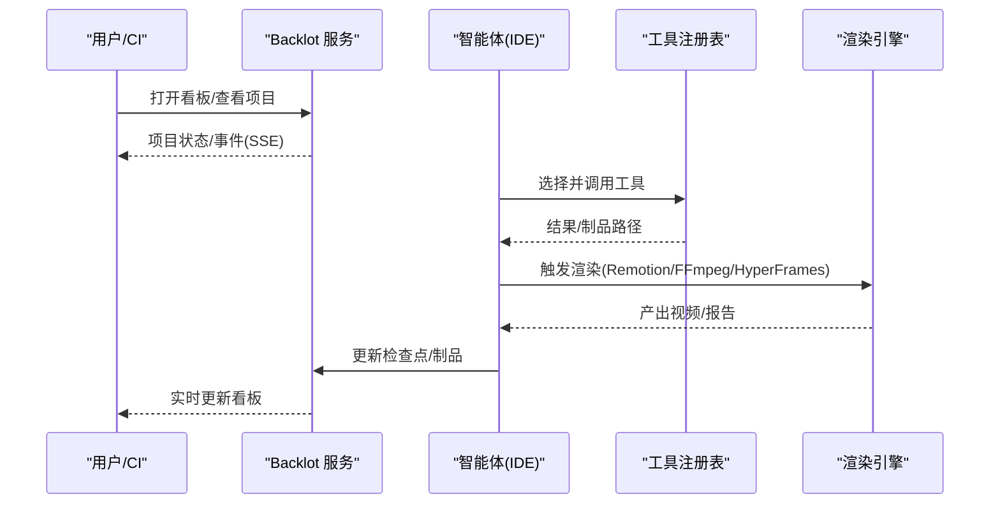
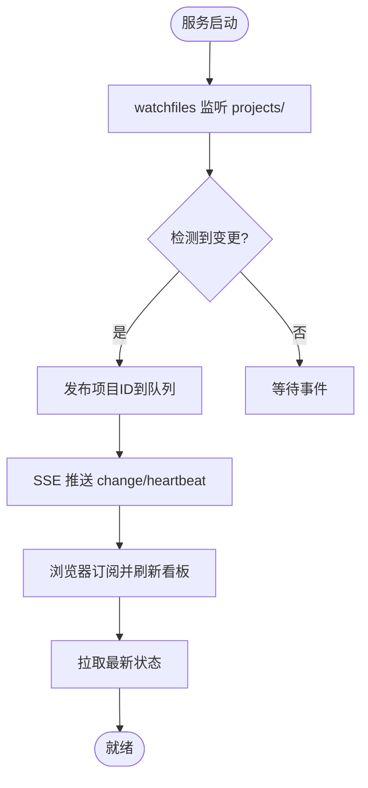
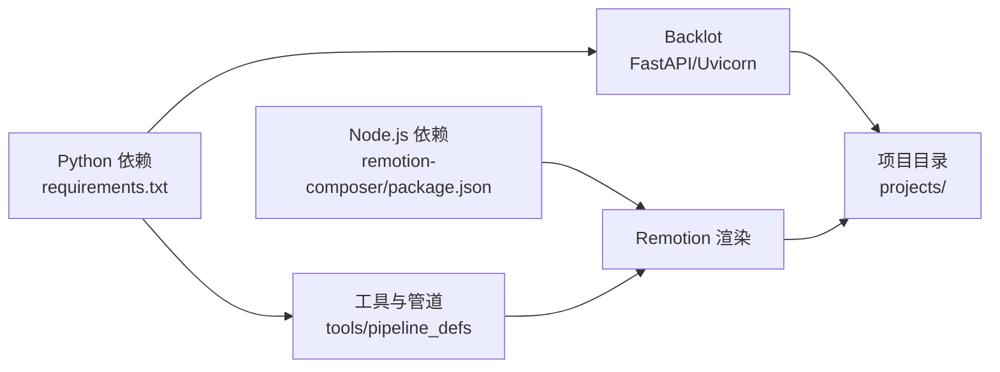

# 部署与运维

<cite>
**本文引用的文件**
- [README.md](file://README.md)
- [Makefile](file://Makefile)
- [config.yaml](file://config.yaml)
- [requirements.txt](file://requirements.txt)
- [setup.py](file://setup.py)
- [backlot/server.py](file://backlot/server.py)
- [backlot/README.md](file://backlot/README.md)
- [lib/env_loader.py](file://lib/env_loader.py)
- [remotion-composer/package.json](file://remotion-composer/package.json)
- [docs/ARCHITECTURE.md](file://docs/ARCHITECTURE.md)
</cite>

## 目录
1. [简介](#简介)
2. [项目结构](#项目结构)
3. [核心组件](#核心组件)
4. [架构总览](#架构总览)
5. [详细组件分析](#详细组件分析)
6. [依赖分析](#依赖分析)
7. [性能考虑](#性能考虑)
8. [故障排查指南](#故障排查指南)
9. [结论](#结论)
10. [附录](#附录)

## 简介
本指南面向生产环境，提供 OpenMontage 的部署与运维最佳实践。内容涵盖服务器配置、环境变量管理、依赖安装与校验、容器化与编排思路、云原生（Kubernetes）部署要点、监控与日志收集、备份与恢复策略、故障排查与常见问题、性能调优与容量规划等。OpenMontage 以“智能体驱动 + 工具注册表 + 管道清单”的方式组织视频生产流程，后端服务包含本地可视化看板 Backlot（FastAPI），渲染引擎包括 Remotion（Node.js/React）与 FFmpeg/HyperFrames。

## 项目结构
- Python 核心：依赖通过 requirements.txt/setup.py 管理；全局配置在 config.yaml；环境变量由 lib/env_loader.py 加载。
- 渲染与前端：Remotion 子项目在 remotion-composer（package.json 定义脚本与依赖）。
- 本地看板：Backlot 基于 FastAPI，提供项目状态 API、SSE 事件流、媒体与缩略图服务。
- 管道与技能：pipeline_defs 定义流水线，skills 提供阶段指令与知识，tools 提供可执行能力。

**图示来源**
- [backlot/server.py:165-307](file://backlot/server.py#L165-L307)
- [Makefile:54-76](file://Makefile#L54-L76)
- [remotion-composer/package.json:1-33](file://remotion-composer/package.json#L1-L33)
- [docs/ARCHITECTURE.md:31-76](file://docs/ARCHITECTURE.md#L31-L76)

**章节来源**
- [README.md:180-216](file://README.md#L180-L216)
- [Makefile:54-76](file://Makefile#L54-L76)
- [docs/ARCHITECTURE.md:31-76](file://docs/ARCHITECTURE.md#L31-L76)

## 核心组件
- 环境与配置
  - .env 变量加载：lib/env_loader.py 提供 load_env/get_env/require_env。
  - 全局配置：config.yaml 定义 LLM、预算、检查点策略、输出参数与路径。
- 依赖与环境准备
  - Python 依赖：requirements.txt（含 FastAPI、uvicorn、watchfiles 等）。
  - Node.js 依赖：remotion-composer/package.json（Remotion CLI、React、插件）。
  - 一键安装：Makefile 提供 setup/install/install-gpu/demo 等目标。
- 本地看板服务
  - FastAPI 应用：backlot/server.py 提供健康检查、项目列表、SSE 事件流、媒体与缩略图、UI 静态资源。
  - 实时性：watchfiles 监听 projects/ 变更，SSE 推送变化通知。
- 渲染引擎
  - Remotion：Node.js/React 渲染，scripts 提供 studio/build。
  - FFmpeg/HyperFrames：作为备选或特定风格渲染路径。

**章节来源**
- [lib/env_loader.py:1-35](file://lib/env_loader.py#L1-L35)
- [config.yaml:1-34](file://config.yaml#L1-L34)
- [requirements.txt:1-17](file://requirements.txt#L1-L17)
- [remotion-composer/package.json:1-33](file://remotion-composer/package.json#L1-L33)
- [Makefile:54-76](file://Makefile#L54-L76)
- [backlot/server.py:165-307](file://backlot/server.py#L165-L307)

## 架构总览
OpenMontage 的生产链路由“智能体读取管道清单与阶段技能 → 调用工具 → 写入检查点 → 质量门禁 → 渲染输出”构成。Backlot 作为只读看板，通过文件系统监听与 SSE 将进度推送到浏览器。

**图示来源**
- [docs/ARCHITECTURE.md:9-27](file://docs/ARCHITECTURE.md#L9-L27)
- [backlot/server.py:170-240](file://backlot/server.py#L170-L240)
- [Makefile:54-76](file://Makefile#L54-L76)

## 详细组件分析

### 环境与配置（生产建议）
- 环境变量
  - 使用 .env 集中管理第三方密钥（如 ElevenLabs、OpenAI、Kling、Atlas Cloud 等），通过 lib/env_loader.py 加载。
  - 关键变量示例（按需启用）：ELEVENLABS_API_KEY、OPENAI_API_KEY、FAL_KEY、KLING_API_KEY、PEXELS_API_KEY、PIXABAY_API_KEY、GOOGLE_API_KEY、RUNWAY_API_KEY、HIGGSFIELD_*、MODAL_LTX2_ENDPOINT_URL、VIDEO_GEN_LOCAL_ENABLED、VIDEO_GEN_LOCAL_MODEL。
- 全局配置
  - config.yaml 中设置 LLM 提供商、温度、最大令牌数；预算模式（observe/warn/cap）、总额度、单次行动审批阈值；检查点策略（guided/manual_all/auto_noncreative）；输出格式、编码、分辨率、帧率、CRF；各目录路径。
- 安全与最小权限
  - 仅注入必要的环境变量；在生产容器中通过密钥管理服务注入；避免将 .env 提交到版本库。

**章节来源**
- [lib/env_loader.py:15-35](file://lib/env_loader.py#L15-L35)
- [config.yaml:1-34](file://config.yaml#L1-L34)
- [docs/ARCHITECTURE.md:382-414](file://docs/ARCHITECTURE.md#L382-L414)

### 依赖管理与安装
- Python 依赖
  - 使用 requirements.txt 安装核心包；GPU 扩展使用 requirements-gpu.txt；开发依赖 requirements-dev.txt。
  - Makefile 提供 ensure-venv、install、install-gpu、demo 等目标，自动创建虚拟环境并安装依赖。
- Node.js 依赖
  - remotion-composer 子项目通过 package.json 管理 Remotion 相关依赖；Makefile 在安装阶段执行 npm install。
- 外部二进制
  - FFmpeg 为必需；HyperFrames 通过 npx 缓存加速首次渲染；Piper TTS 可选用于离线语音。

**章节来源**
- [requirements.txt:1-17](file://requirements.txt#L1-L17)
- [Makefile:54-76](file://Makefile#L54-L76)
- [Makefile:80-89](file://Makefile#L80-L89)
- [remotion-composer/package.json:1-33](file://remotion-composer/package.json#L1-L33)

### 本地看板服务（Backlot）
- 功能
  - 健康检查：/api/health
  - 项目列表：/api/projects
  - 项目状态：/api/project/{project_id}/state
  - 事件流：/api/project/{project_id}/events、/api/library/events（SSE）
  - 媒体与缩略图：/media、/thumb（带范围请求与缓存）
  - UI：/、/p/{project_id}
- 实时机制
  - watchfiles 监听 projects/ 目录变更，按项目过滤并发出 SSE 心跳与变更事件。
- 部署要点
  - 使用 uvicorn 启动 FastAPI 应用；暴露端口需通过反向代理（Nginx/Caddy）并开启 HTTPS；对 SSE 连接保持长连接进行超时与缓冲控制。

**图示来源**
- [backlot/server.py:132-149](file://backlot/server.py#L132-L149)
- [backlot/server.py:183-240](file://backlot/server.py#L183-L240)
- [backlot/README.md:14-30](file://backlot/README.md#L14-L30)

**章节来源**
- [backlot/server.py:165-307](file://backlot/server.py#L165-L307)
- [backlot/README.md:1-43](file://backlot/README.md#L1-L43)

### 渲染引擎（Remotion/FFmpeg/HyperFrames）
- Remotion
  - scripts：start（studio）、build（render out/video.mp4）、upgrade。
  - 依赖：@remotion/cli、captions、transitions、google-fonts、media、player 等。
- FFmpeg/HyperFrames
  - FFmpeg 负责封装、字幕烧录、音频混音、色彩校正等。
  - HyperFrames 通过 npx hyperframes 工作，支持多格式输出、GPU 编码、HDR/SDR 切换、多 worker 并行。
- 选择策略
  - 在提案阶段确定 render_runtime 并在编辑决策中锁定；若运行时不可用，工具会返回结构化阻塞信息。

**章节来源**
- [remotion-composer/package.json:1-33](file://remotion-composer/package.json#L1-L33)
- [docs/ARCHITECTURE.md:448-475](file://docs/ARCHITECTURE.md#L448-L475)

### 容器化部署方案（Docker）
- 镜像分层建议
  - 基础层：操作系统 + Python 3.10+ + FFmpeg。
  - 依赖层：requirements.txt 安装；Node.js + remotion-composer 依赖。
  - 应用层：复制代码与配置；挂载数据卷到 projects/、output/、pipeline/。
  - 运行时：uvicorn 启动 Backlot；必要时单独进程运行 Remotion 构建。
- 环境变量注入
  - 通过容器编排平台注入 .env 中的密钥；避免硬编码。
- 存储与缓存
  - 持久化 projects/、output/、pipeline/；npx/Node 模块缓存可独立卷以提升冷启动速度。
- 健康检查
  - 使用 /api/health 探测服务可用性；结合探针实现重启与滚动升级。

[本节为概念性说明，不直接引用具体源码]

### 容器编排与服务发现（Kubernetes）
- Deployment/Service
  - 部署 Backlot 服务，暴露 HTTP 端口；配置 liveness/readiness 探针指向 /api/health。
  - 使用 ConfigMap/Secret 管理 config.yaml 与 .env。
- 存储
  - 使用 PVC 挂载 projects/、output/、pipeline/，确保跨 Pod 共享与持久化。
- 扩缩容
  - 根据 CPU/内存与请求量设置 HPA；注意 SSE 长连接与负载均衡器超时配置。
- 服务发现
  - 通过 Service DNS 访问 Backlot；对外通过 Ingress 暴露 HTTPS。

[本节为概念性说明，不直接引用具体源码]

### 云原生部署选项（Kubernetes 特性）
- 负载均衡
  - Ingress 控制器处理 TLS 终止与路由；对 SSE 连接设置合理超时与缓冲。
- 自动扩缩容
  - HPA 基于 CPU/内存或自定义指标（如请求速率）调整副本数。
- 配置管理
  - 使用 Secret 管理 API Key；ConfigMap 管理非敏感配置。
- 可观测性
  - 集成 Prometheus/Grafana 采集指标；集中式日志（ELK/Loki）收集应用与系统日志。

[本节为概念性说明，不直接引用具体源码]

### 监控与日志收集
- 指标
  - Backlot 健康检查、SSE 连接数、项目状态变更频率；渲染任务耗时与失败率。
- 日志
  - 应用日志（FastAPI 访问日志、错误堆栈）；渲染日志（Remotion/FFmpeg/HyperFrames）；系统日志（内核、磁盘 I/O）。
- 告警
  - 健康检查失败、SSE 连接异常断开、渲染失败率升高、磁盘空间不足。

[本节为概念性说明，不直接引用具体源码]

### 备份与恢复策略
- 备份范围
  - projects/（项目制品与中间态）、output/（最终产物）、pipeline/（检查点）、styles/（样式）、配置（config.yaml、.env）。
- 备份频率
  - 增量备份每日一次；全量备份每周一次；重大变更前手动备份。
- 恢复演练
  - 定期验证备份可恢复性与一致性；记录恢复步骤与回滚预案。

[本节为概念性说明，不直接引用具体源码]

### 故障排查指南
- 常见症状与定位
  - 看板无更新：检查 watchfiles 是否可用、projects/ 目录权限、SSE 连接是否被代理中断。
  - 渲染失败：确认 FFmpeg/Node.js/Remotion/HyperFrames 依赖；查看渲染日志与输出路径。
  - 密钥缺失：通过 require_env 抛出错误；核对 .env 与容器注入。
- 诊断命令
  - make preflight：探测可用工具与提供商菜单。
  - make hyperframes-doctor：诊断 HyperFrames 运行时。
  - make demo：渲染零密钥演示视频，验证基础链路。
- 日志与审计
  - 检查 checkpoint/history 与 cost_log；利用 Backlot 回放功能复盘运行过程。

**章节来源**
- [Makefile:100-126](file://Makefile#L100-L126)
- [backlot/server.py:170-240](file://backlot/server.py#L170-L240)
- [docs/ARCHITECTURE.md:243-288](file://docs/ARCHITECTURE.md#L243-L288)

### 性能调优与容量规划
- 渲染优化
  - 使用 GPU 编码（NVENC/VAAPI/QSV）提升 FFmpeg/HyperFrames 渲染速度；合理设置 CRF/比特率。
  - 并行渲染：HyperFrames 支持多 worker；注意 Chrome/WebGL 资源占用。
- 资源限制
  - 为 Pod/容器设置 CPU/内存限制；监控磁盘 I/O 与临时文件清理。
- 缓存与预热
  - 预缓存 npx/hyperframes；复用 Node 模块缓存；缩略图缓存减少重复计算。
- 容量规划
  - 根据峰值并发与渲染时长估算 CPU/GPU/内存需求；预留 20-30% 余量应对突发。

**章节来源**
- [Makefile:103-111](file://Makefile#L103-L111)
- [docs/ARCHITECTURE.md:448-475](file://docs/ARCHITECTURE.md#L448-L475)

## 依赖分析
- Python 依赖
  - 核心：pyyaml、pydantic、jsonschema、python-dotenv、Pillow、numpy、requests、google-auth、google-genai、openai。
  - Backlot：fastapi、uvicorn、watchfiles。
- Node.js 依赖
  - Remotion 生态：@remotion/cli、captions、transitions、google-fonts、media、player。
- 外部二进制
  - FFmpeg（必需）；Piper（可选）；HyperFrames（通过 npx）。

**图示来源**
- [requirements.txt:1-17](file://requirements.txt#L1-L17)
- [remotion-composer/package.json:1-33](file://remotion-composer/package.json#L1-L33)
- [docs/ARCHITECTURE.md:31-76](file://docs/ARCHITECTURE.md#L31-L76)

**章节来源**
- [requirements.txt:1-17](file://requirements.txt#L1-L17)
- [setup.py:1-20](file://setup.py#L1-L20)
- [remotion-composer/package.json:1-33](file://remotion-composer/package.json#L1-L33)

## 性能考虑
- 渲染路径选择
  - 数据驱动与图表优先选 Remotion；动效与排版优先选 HyperFrames；简单拼接用 FFmpeg。
- 编码器与参数
  - 使用 H.264（libx264）与 AAC；根据平台配置文件选择合适的分辨率、帧率、CRF。
- 并发与资源
  - 合理设置 HyperFrames workers；避免过多 Chrome 实例导致内存溢出。
- 缓存与预热
  - 预缓存 npx/hyperframes；缩略图缓存；Node 模块缓存。

**章节来源**
- [docs/ARCHITECTURE.md:429-475](file://docs/ARCHITECTURE.md#L429-L475)

## 故障排查指南
- 环境问题
  - Python 版本不匹配：确保 >= 3.10；使用 Makefile 的 ensure-venv 自动检测。
  - FFmpeg 未安装：安装后重试；确认 PATH。
  - Node.js/Remotion 问题：执行 make hyperframes-doctor 与 make demo 验证。
- 服务问题
  - Backlot 无法访问：检查端口、防火墙、反向代理配置；查看 /api/health。
  - SSE 断连：检查代理超时与缓冲设置；确认 watchfiles 正常工作。
- 渲染问题
  - 渲染失败：查看 Remotion/FFmpeg/HyperFrames 日志；检查输入素材与编码参数。
  - 输出异常：使用 ffprobe 校验；检查字幕烧录与音频电平。

**章节来源**
- [Makefile:92-126](file://Makefile#L92-L126)
- [backlot/server.py:170-240](file://backlot/server.py#L170-L240)
- [docs/ARCHITECTURE.md:498-512](file://docs/ARCHITECTURE.md#L498-L512)

## 结论
OpenMontage 以智能体驱动与工具注册表为核心，配合 Backlot 看板与多渲染引擎，形成可观测、可恢复、可扩展的视频生产平台。生产部署应重视环境隔离、密钥管理、依赖校验、健康检查与可观测性；通过容器化与 Kubernetes 实现弹性与高可用；结合监控、日志、备份与故障排查，保障稳定性与可维护性。

## 附录
- 快速开始
  - 使用 make setup 完成依赖安装与初始化；添加 .env 密钥；通过 AI 助手驱动管道。
- 常用命令
  - make install-gpu：安装 GPU 依赖。
  - make demo：渲染零密钥演示视频。
  - make preflight：探测可用工具与提供商。
  - make hyperframes-doctor：诊断 HyperFrames 运行时。

**章节来源**
- [Makefile:54-76](file://Makefile#L54-L76)
- [Makefile:86-89](file://Makefile#L86-L89)
- [Makefile:100-126](file://Makefile#L100-L126)
- [README.md:180-216](file://README.md#L180-L216)