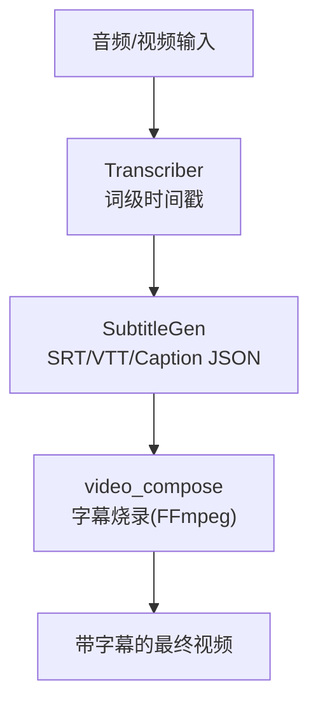
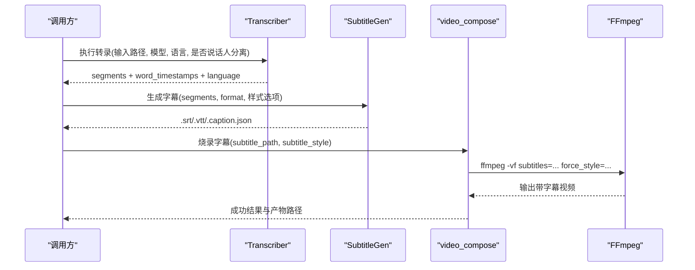
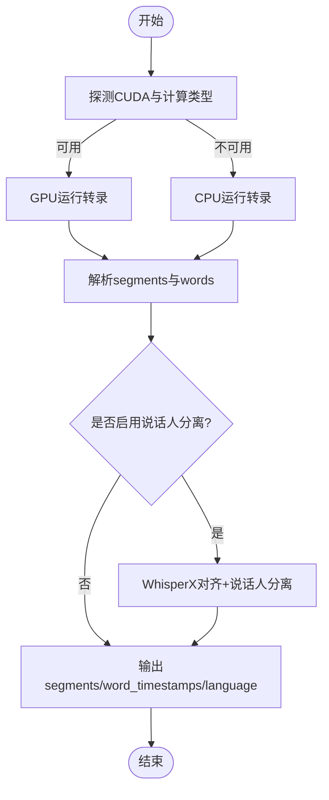
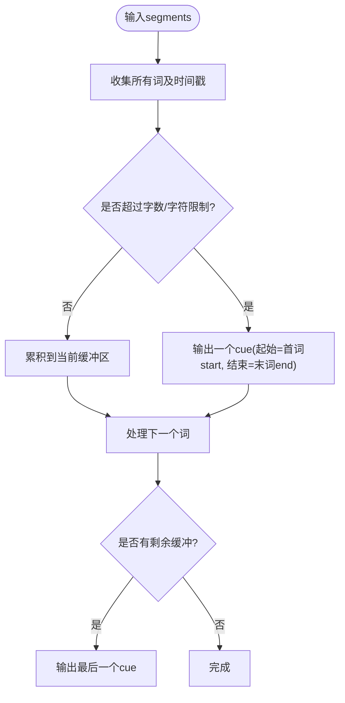
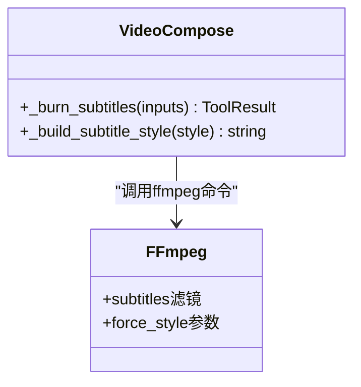
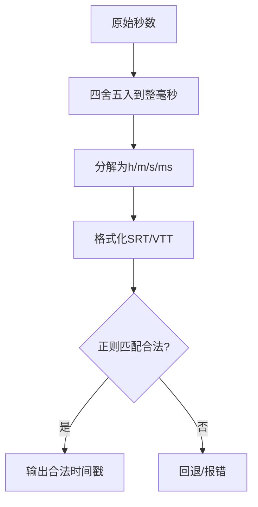

# 字幕生成

<cite>
**本文引用的文件**
- [tools/subtitle/subtitle_gen.py](file://tools/subtitle/subtitle_gen.py)
- [skills/core/subtitle-sync.md](file://skills/core/subtitle-sync.md)
- [tools/analysis/transcriber.py](file://tools/analysis/transcriber.py)
- [tools/video/video_compose.py](file://tools/video/video_compose.py)
- [tests/tools/test_subtitle_timestamps.py](file://tests/tools/test_subtitle_timestamps.py)
</cite>

## 目录
1. [简介](#简介)
2. [项目结构](#项目结构)
3. [核心组件](#核心组件)
4. [架构总览](#架构总览)
5. [详细组件分析](#详细组件分析)
6. [依赖关系分析](#依赖关系分析)
7. [性能考量](#性能考量)
8. [故障排查指南](#故障排查指南)
9. [结论](#结论)
10. [附录：API参考与使用示例](#附录api参考与使用示例)

## 简介
本技术文档面向OpenMontage项目的“字幕生成”子系统，聚焦从语音识别到字幕文件自动生成、样式定制、时间戳对齐、多语言支持以及质量检查的完整流程。系统提供SRT、VTT与Caption JSON三种输出格式，并支持与视频合成工具集成以完成字幕烧录（burn-in）。文档同时给出时序对齐算法、样式配置、API参考与端到端自动化示例，帮助开发者快速构建高质量、可维护的字幕流水线。

## 项目结构
与字幕生成相关的核心代码位于以下位置：
- 转录与词级时间戳：tools/analysis/transcriber.py
- 字幕生成与格式化：tools/subtitle/subtitle_gen.py
- 字幕烧录与样式：tools/video/video_compose.py
- 最佳实践与规范：skills/core/subtitle-sync.md
- 回归测试（时间戳边界）：tests/tools/test_subtitle_timestamps.py

图表来源
- [tools/analysis/transcriber.py:116-239](file://tools/analysis/transcriber.py#L116-L239)
- [tools/subtitle/subtitle_gen.py:82-129](file://tools/subtitle/subtitle_gen.py#L82-L129)
- [tools/video/video_compose.py:2709-2744](file://tools/video/video_compose.py#L2709-L2744)

章节来源
- [tools/analysis/transcriber.py:1-280](file://tools/analysis/transcriber.py#L1-L280)
- [tools/subtitle/subtitle_gen.py:1-336](file://tools/subtitle/subtitle_gen.py#L1-L336)
- [tools/video/video_compose.py:2600-2944](file://tools/video/video_compose.py#L2600-L2944)
- [skills/core/subtitle-sync.md:1-105](file://skills/core/subtitle-sync.md#L1-L105)
- [tests/tools/test_subtitle_timestamps.py:1-50](file://tests/tools/test_subtitle_timestamps.py#L1-L50)

## 核心组件
- 转录器（Transcriber）：基于faster-whisper/WhisperX，输出段落级文本与词级时间戳，支持可选说话人分离与自动语言检测。
- 字幕生成器（SubtitleGen）：将词级时间戳聚合成显示提示（cue），按SRT/VTT/Caption JSON格式渲染，支持逐词高亮与卡拉OK效果。
- 视频合成器（video_compose）：通过FFmpeg将字幕烧录进视频，支持ASS样式参数（字体、颜色、描边、阴影、位置等）。
- 技能文档（subtitle-sync）：提供不同画幅下的字数限制、显示时长、样式建议与时序对齐最佳实践。

章节来源
- [tools/analysis/transcriber.py:29-96](file://tools/analysis/transcriber.py#L29-L96)
- [tools/subtitle/subtitle_gen.py:26-80](file://tools/subtitle/subtitle_gen.py#L26-L80)
- [tools/video/video_compose.py:2911-2930](file://tools/video/video_compose.py#L2911-L2930)
- [skills/core/subtitle-sync.md:23-41](file://skills/core/subtitle-sync.md#L23-L41)

## 架构总览
下图展示了从音频到最终视频的端到端数据流，包括转录、字幕生成、样式烧录与质量校验的关键节点。

图表来源
- [tools/analysis/transcriber.py:116-239](file://tools/analysis/transcriber.py#L116-L239)
- [tools/subtitle/subtitle_gen.py:82-129](file://tools/subtitle/subtitle_gen.py#L82-L129)
- [tools/video/video_compose.py:2709-2744](file://tools/video/video_compose.py#L2709-L2744)

## 详细组件分析

### 转录器（Transcriber）
- 功能要点
  - 支持CPU/GPU自动选择与回退；默认int8量化，必要时回退至CPU。
  - 输出包含段落级文本、词级时间戳、检测到的语言与时长。
  - 可选WhisperX对齐与说话人分离（需要HF_TOKEN）。
- 关键实现
  - 设备探测与计算类型选择，确保CUDA可用时优先GPU。
  - 迭代解析faster-whisper返回的segments与words，构造统一数据结构。
  - 可选diarization：加载对齐模型与说话人分离管线，合并回segments。
- 复杂度与性能
  - 转录为I/O与模型推理密集型；CPU下约0.5x实时（估算）。
  - 词级时间戳粒度提升后续字幕对齐精度，但增加内存占用。

图表来源
- [tools/analysis/transcriber.py:136-210](file://tools/analysis/transcriber.py#L136-L210)
- [tools/analysis/transcriber.py:242-279](file://tools/analysis/transcriber.py#L242-L279)

章节来源
- [tools/analysis/transcriber.py:116-239](file://tools/analysis/transcriber.py#L116-L239)
- [tools/analysis/transcriber.py:242-279](file://tools/analysis/transcriber.py#L242-L279)

### 字幕生成器（SubtitleGen）
- 功能要点
  - 输入：词级时间戳或段落级时间戳；支持字面修正（corrections）。
  - 输出：SRT、VTT、Caption JSON；支持逐词高亮与卡拉OK模式。
  - 分组策略：按max_words_per_cue与max_chars_per_line聚合词为cue。
- 时间戳对齐算法
  - 收集所有词及其起止时间，按约束条件累积成cue；若无可用的词级时间戳则回退到段落级均匀分布。
  - 时间戳格式化采用毫秒进位策略，避免溢出导致非法时间戳。
- 样式与高亮
  - SRT/VTT中可通过HTML标签对当前词加粗，实现逐词或卡拉OK高亮。
  - Caption JSON保留words数组，便于自定义渲染器进行精细控制。

图表来源
- [tools/subtitle/subtitle_gen.py:168-227](file://tools/subtitle/subtitle_gen.py#L168-L227)
- [tools/subtitle/subtitle_gen.py:311-335](file://tools/subtitle/subtitle_gen.py#L311-L335)

章节来源
- [tools/subtitle/subtitle_gen.py:82-129](file://tools/subtitle/subtitle_gen.py#L82-L129)
- [tools/subtitle/subtitle_gen.py:131-166](file://tools/subtitle/subtitle_gen.py#L131-L166)
- [tools/subtitle/subtitle_gen.py:168-227](file://tools/subtitle/subtitle_gen.py#L168-L227)
- [tools/subtitle/subtitle_gen.py:229-309](file://tools/subtitle/subtitle_gen.py#L229-L309)
- [tools/subtitle/subtitle_gen.py:311-335](file://tools/subtitle/subtitle_gen.py#L311-L335)

### 视频合成与字幕烧录（video_compose）
- 功能要点
  - 通过FFmpeg的subtitles滤镜将SRT/VTT烧录进视频，支持ASS force_style样式。
  - 样式字段包括字体、字号、粗细、主色、描边色、背景色、边框样式、描边宽度、阴影、垂直边距、对齐方式。
- 关键实现
  - _build_subtitle_style将样式字典转换为ASS force_style字符串。
  - _burn_subtitles组装ffmpeg命令，传入force_style与字幕路径。
- 注意事项
  - ASS颜色格式必须为&HAABBGGRR（含Alpha通道），否则可能导致定位异常。
  - 不同画幅（竖屏/横屏）推荐不同的字号与边距，避免遮挡画面主体。

图表来源
- [tools/video/video_compose.py:2709-2744](file://tools/video/video_compose.py#L2709-L2744)
- [tools/video/video_compose.py:2911-2930](file://tools/video/video_compose.py#L2911-L2930)

章节来源
- [tools/video/video_compose.py:2709-2744](file://tools/video/video_compose.py#L2709-L2744)
- [tools/video/video_compose.py:2911-2930](file://tools/video/video_compose.py#L2911-L2930)

### 时间戳对齐与边界处理
- 对齐原则
  - cue起始应与词 onset 对齐，不提前出现；cue结束应略晚于末词（约200ms）以保证可读性。
  - 避免cue跨入下一说话人的时段。
- 边界保护
  - 毫秒进位逻辑确保0.9999秒正确进位到下一秒，避免产生“…,1000”的非法时间戳。
  - 单元测试覆盖分钟/小时边界进位，保证SRT/VTT严格合规。

图表来源
- [tools/subtitle/subtitle_gen.py:311-335](file://tools/subtitle/subtitle_gen.py#L311-L335)
- [tests/tools/test_subtitle_timestamps.py:24-49](file://tests/tools/test_subtitle_timestamps.py#L24-L49)

章节来源
- [tests/tools/test_subtitle_timestamps.py:1-50](file://tests/tools/test_subtitle_timestamps.py#L1-L50)

### 多语言支持与国际化
- 语言检测
  - Transcriber支持自动语言检测或指定ISO 639-1代码；检测到的语言会写入输出。
- 翻译与本地化
  - 项目内提供视频翻译能力（如video-translate），支持多种区域变体（如es-ES/es-MX、zh-CN等），可与字幕流程结合实现多语言版本。
- 字幕样式国际化
  - 通过ASS样式参数适配不同语言的阅读习惯（如字号、行宽、对齐）。

章节来源
- [tools/analysis/transcriber.py:54-78](file://tools/analysis/transcriber.py#L54-L78)
- [skills/core/subtitle-sync.md:23-41](file://skills/core/subtitle-sync.md#L23-L41)

## 依赖关系分析
- 外部依赖
  - faster-whisper/WhisperX：用于转录与可选说话人分离。
  - FFmpeg：用于字幕烧录与视频处理。
- 内部耦合
  - Transcriber输出结构与SubtitleGen输入契约一致（segments/word_timestamps）。
  - SubtitleGen输出（SRT/VTT）被video_compose直接消费。
- 风险点
  - WhisperX依赖HF_TOKEN；缺失时将跳过说话人分离。
  - FFmpeg未安装或路径问题会导致烧录失败。

图表来源
- [tools/analysis/transcriber.py:116-239](file://tools/analysis/transcriber.py#L116-L239)
- [tools/subtitle/subtitle_gen.py:82-129](file://tools/subtitle/subtitle_gen.py#L82-L129)
- [tools/video/video_compose.py:2709-2744](file://tools/video/video_compose.py#L2709-L2744)

章节来源
- [tools/analysis/transcriber.py:116-239](file://tools/analysis/transcriber.py#L116-L239)
- [tools/subtitle/subtitle_gen.py:82-129](file://tools/subtitle/subtitle_gen.py#L82-L129)
- [tools/video/video_compose.py:2709-2744](file://tools/video/video_compose.py#L2709-L2744)

## 性能考量
- 转录阶段
  - GPU可用时显著加速；CPU模式下int8量化降低内存与算力需求。
  - 长音频建议分段处理以降低峰值内存。
- 字幕生成
  - 词级时间戳聚合为O(n)复杂度；合理设置max_words_per_cue与max_chars_per_line可平衡显示密度与渲染开销。
- 烧录阶段
  - FFmpeg字幕烧录为CPU密集操作；CRF与编码参数影响速度与质量权衡。

[本节提供通用指导，无需特定文件引用]

## 故障排查指南
- 常见错误
  - 转录失败：检查faster-whisper/WhisperX安装与环境变量（如HF_TOKEN）。
  - 字幕时间戳非法：确认毫秒进位逻辑未被绕过；参考单元测试用例验证边界值。
  - 烧录失败：确认FFmpeg已安装且路径可达；ASS颜色格式必须为&HAABBGGRR。
- 诊断步骤
  - 查看transcriber输出的segments与word_timestamps是否完整。
  - 使用播放器验证SRT/VTT时间轴是否与音频同步。
  - 在video_compose中逐步缩小样式参数范围，定位样式导致的渲染问题。

章节来源
- [tools/analysis/transcriber.py:116-239](file://tools/analysis/transcriber.py#L116-L239)
- [tools/subtitle/subtitle_gen.py:311-335](file://tools/subtitle/subtitle_gen.py#L311-L335)
- [tools/video/video_compose.py:2709-2744](file://tools/video/video_compose.py#L2709-L2744)
- [tests/tools/test_subtitle_timestamps.py:24-49](file://tests/tools/test_subtitle_timestamps.py#L24-L49)

## 结论
OpenMontage的字幕生成系统以“转录—生成—烧录”为主线，提供了高精度的词级时间戳对齐、灵活的样式定制与严格的格式合规保障。通过合理的分组策略与边界保护，系统在多种画幅与场景下均能产出高质量字幕。结合多语言翻译能力，可实现端到端的国际化内容生产。

[本节总结性内容，无需特定文件引用]

## 附录：API参考与使用示例

### API参考
- Transcriber.execute
  - 输入：input_path, model_size, language, diarize, output_dir
  - 输出：segments, word_timestamps, language, duration_seconds, model_size, device, compute_type, gpu_fallback_reason
  - 副作用：写入_transcript.json
  - 参考路径：[tools/analysis/transcriber.py:116-239](file://tools/analysis/transcriber.py#L116-L239)

- SubtitleGen.execute
  - 输入：segments, format(srt/vtt/json), output_path, max_chars_per_line, max_words_per_cue, highlight_style, corrections
  - 输出：format, cue_count, output, artifacts
  - 副作用：写入字幕文件
  - 参考路径：[tools/subtitle/subtitle_gen.py:82-129](file://tools/subtitle/subtitle_gen.py#L82-L129)

- video_compose._burn_subtitles
  - 输入：input_path, subtitle_path, subtitle_style, codec, crf, output_path
  - 输出：operation, output, artifacts
  - 副作用：生成带字幕的视频
  - 参考路径：[tools/video/video_compose.py:2709-2744](file://tools/video/video_compose.py#L2709-L2744)

- video_compose._build_subtitle_style
  - 输入：style字典（font, font_size, bold, primary_color, outline_color, back_color, border_style, outline_width, shadow, margin_v, alignment）
  - 输出：ASS force_style字符串
  - 参考路径：[tools/video/video_compose.py:2911-2930](file://tools/video/video_compose.py#L2911-L2930)

### 使用示例（端到端自动化流程）
- 步骤一：转录
  - 调用Transcriber，获取segments与word_timestamps。
  - 参考路径：[tools/analysis/transcriber.py:116-239](file://tools/analysis/transcriber.py#L116-L239)

- 步骤二：生成字幕
  - 调用SubtitleGen，选择SRT/VTT或Caption JSON，设置max_words_per_cue与max_chars_per_line。
  - 如需逐词高亮，设置highlight_style为word_by_word或karaoke。
  - 参考路径：[tools/subtitle/subtitle_gen.py:82-129](file://tools/subtitle/subtitle_gen.py#L82-L129)

- 步骤三：烧录字幕
  - 调用video_compose._burn_subtitles，传入subtitle_path与subtitle_style。
  - 注意ASS颜色格式为&HAABBGGRR。
  - 参考路径：[tools/video/video_compose.py:2709-2744](file://tools/video/video_compose.py#L2709-L2744)

- 步骤四：质量检查
  - 播放验证时间轴与文本对齐；检查字幕是否在底部20%且不遮挡面部。
  - 参考最佳实践：[skills/core/subtitle-sync.md:82-105](file://skills/core/subtitle-sync.md#L82-L105)

章节来源
- [tools/analysis/transcriber.py:116-239](file://tools/analysis/transcriber.py#L116-L239)
- [tools/subtitle/subtitle_gen.py:82-129](file://tools/subtitle/subtitle_gen.py#L82-L129)
- [tools/video/video_compose.py:2709-2744](file://tools/video/video_compose.py#L2709-L2744)
- [skills/core/subtitle-sync.md:82-105](file://skills/core/subtitle-sync.md#L82-L105)