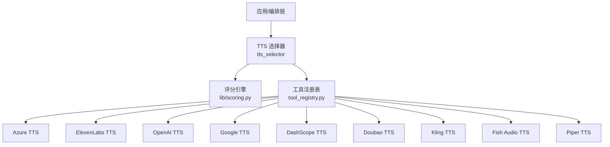
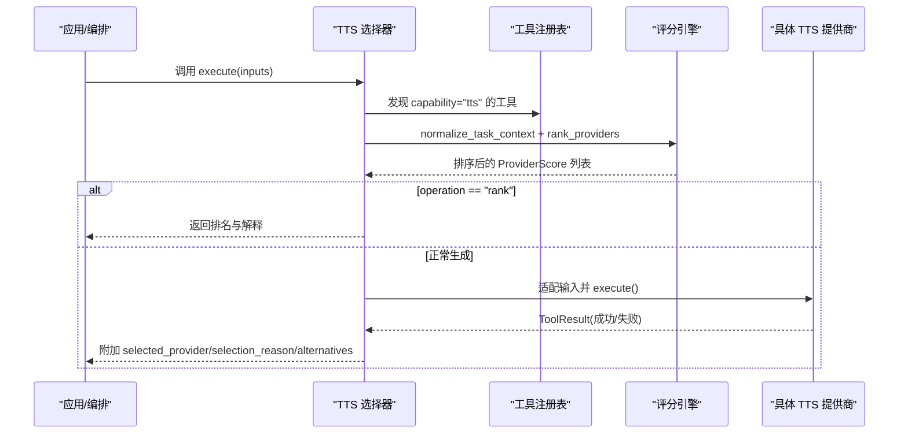
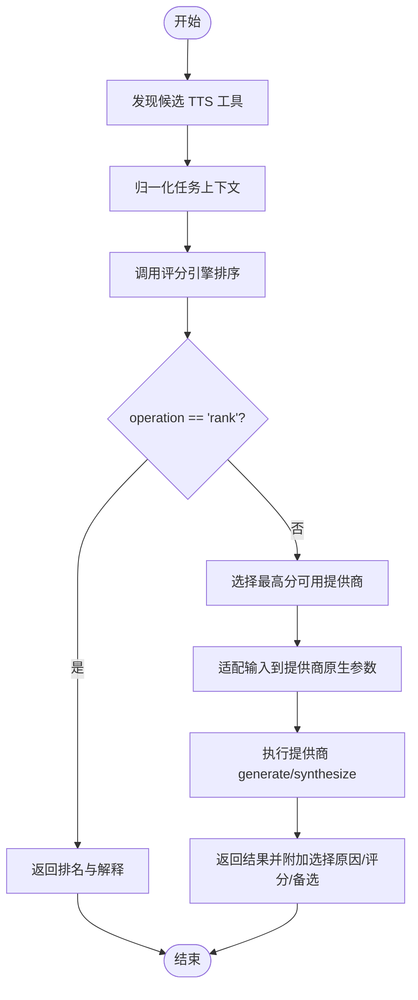
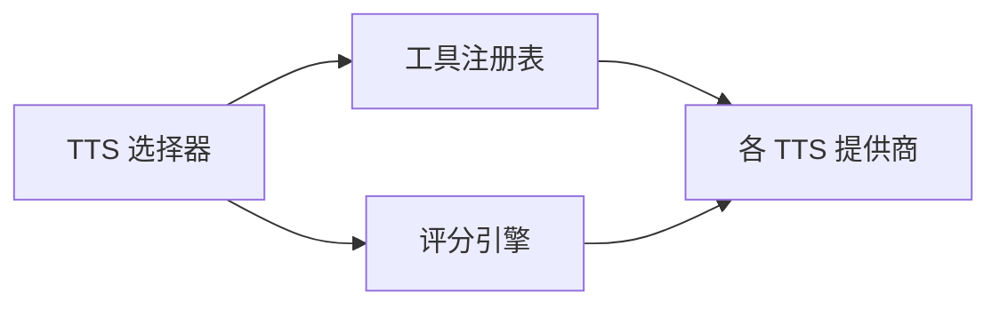
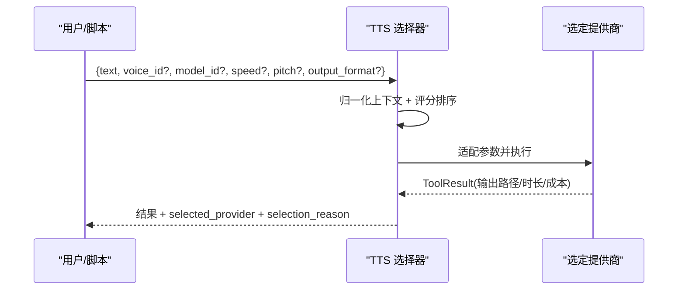

# 语音合成

<cite>
**本文引用的文件**
- [tools/audio/tts_selector.py](file://tools/audio/tts_selector.py)
- [lib/scoring.py](file://lib/scoring.py)
- [tools/base_tool.py](file://tools/base_tool.py)
- [tools/tool_registry.py](file://tools/tool_registry.py)
- [tools/audio/azure_tts.py](file://tools/audio/azure_tts.py)
- [tools/audio/elevenlabs_tts.py](file://tools/audio/elevenlabs_tts.py)
- [tools/audio/openai_tts.py](file://tools/audio/openai_tts.py)
- [tools/audio/google_tts.py](file://tools/audio/google_tts.py)
- [tools/audio/dashscope_tts.py](file://tools/audio/dashscope_tts.py)
- [tools/audio/doubao_tts.py](file://tools/audio/doubao_tts.py)
- [tools/audio/kling_tts.py](file://tools/audio/kling_tts.py)
- [tools/audio/fish_audio_tts.py](file://tools/audio/fish_audio_tts.py)
- [tools/audio/piper_tts.py](file://tools/audio/piper_tts.py)
</cite>

## 目录
1. [简介](#简介)
2. [项目结构](#项目结构)
3. [核心组件](#核心组件)
4. [架构总览](#架构总览)
5. [详细组件分析](#详细组件分析)
6. [依赖关系分析](#依赖关系分析)
7. [性能与成本优化](#性能与成本优化)
8. [故障排除指南](#故障排除指南)
9. [结论](#结论)
10. [附录：使用流程与最佳实践](#附录使用流程与最佳实践)

## 简介
本技术文档面向 OpenMontage 的语音合成（TTS）子系统，系统性梳理了系统如何统一接入并智能选择多家 TTS 提供商，包括 Azure TTS、ElevenLabs、OpenAI TTS、Google TTS、DashScope、Doubao、Kling、Fish Audio、Piper 等。文档重点说明：
- 多提供商的统一抽象与注册机制
- 基于任务上下文的多维评分与自动选择算法
- 各提供商的认证配置、参数调优与错误处理策略
- 从基础文本转语音到高级语音合成的完整调用流程
- 性能优化建议、故障排除指南与最佳实践
- 语音风格控制、情感表达与多语言支持的实现细节

## 项目结构
OpenMontage 将每个 TTS 提供商封装为独立的工具类，并通过统一的基类与注册表进行发现、状态检查与执行。TTS 选择器作为能力级入口，负责根据任务上下文对可用提供商进行评分排序，再委派给具体提供商执行。

**图表来源**
- [tools/audio/tts_selector.py:15-324](file://tools/audio/tts_selector.py#L15-L324)
- [lib/scoring.py:373-542](file://lib/scoring.py#L373-L542)
- [tools/tool_registry.py:118-167](file://tools/tool_registry.py#L118-L167)

**章节来源**
- [tools/audio/tts_selector.py:15-324](file://tools/audio/tts_selector.py#L15-L324)
- [tools/tool_registry.py:118-167](file://tools/tool_registry.py#L118-L167)

## 核心组件
- 工具基类与结果模型：定义统一的工具接口、资源需求、重试策略、幂等键、副作用与用户可见验证项，确保所有 TTS 提供商遵循一致契约。
- 工具注册表：自动发现 tools 包下的工具模块，按能力、提供商、稳定性、状态进行分组与查询，并提供“能力菜单”和“支持信封”报告。
- TTS 选择器：能力级入口，自动发现所有 capability="tts" 的工具，基于任务上下文调用评分引擎进行多维打分，返回最优提供商或直接生成。
- 评分引擎：将任务意图、风格关键词、预算、历史质量/延迟、提供商能力等归一化后计算加权得分，输出可解释的选择理由。

**章节来源**
- [tools/base_tool.py:110-139](file://tools/base_tool.py#L110-L139)
- [tools/tool_registry.py:55-167](file://tools/tool_registry.py#L55-L167)
- [tools/audio/tts_selector.py:15-324](file://tools/audio/tts_selector.py#L15-L324)
- [lib/scoring.py:21-70](file://lib/scoring.py#L21-L70)

## 架构总览
下图展示了从选择器到评分再到具体提供商执行的端到端流程。选择器通过注册表获取候选工具，构造任务上下文，调用评分引擎得到排序结果；若为“rank”模式则直接返回排名，否则选择最高分且可用的提供商执行，并将选择原因与备选信息回传。

**图表来源**
- [tools/audio/tts_selector.py:190-225](file://tools/audio/tts_selector.py#L190-L225)
- [lib/scoring.py:297-359](file://lib/scoring.py#L297-L359)
- [lib/scoring.py:533-542](file://lib/scoring.py#L533-L542)

## 详细组件分析

### TTS 选择器（智能选择机制）
- 自动发现：通过注册表扫描所有 capability="tts" 的工具，动态构建 fallback_tools 与 provider_matrix。
- 任务上下文归一化：将 intent、style、brief、goal、platform、needs 等合并为统一文本，提取风格关键词，推断资产类型与偏好。
- 评分维度：任务契合度、输出质量、可控性、可靠性、成本效率、延迟、连续性，分别赋予权重计算加权总分。
- 选择策略：优先满足 preferred_provider（若存在），否则按评分从高到低选择第一个可用的提供商；返回选择原因、评分明细与备选提供商列表。
- 输入适配：对不同提供商的参数进行标准化映射（如速度、音高、格式、SSML 等）。

**图表来源**
- [tools/audio/tts_selector.py:157-176](file://tools/audio/tts_selector.py#L157-L176)
- [tools/audio/tts_selector.py:190-225](file://tools/audio/tts_selector.py#L190-L225)
- [tools/audio/tts_selector.py:227-256](file://tools/audio/tts_selector.py#L227-L256)
- [lib/scoring.py:297-359](file://lib/scoring.py#L297-L359)
- [lib/scoring.py:373-542](file://lib/scoring.py#L373-L542)

**章节来源**
- [tools/audio/tts_selector.py:15-324](file://tools/audio/tts_selector.py#L15-L324)
- [lib/scoring.py:297-359](file://lib/scoring.py#L297-L359)
- [lib/scoring.py:373-542](file://lib/scoring.py#L373-L542)

### Azure TTS
- 认证配置：需要 AZURE_SPEECH_KEY 与 AZURE_SPEECH_REGION（或自定义 AZURE_TTS_ENDPOINT）。
- 能力与特性：支持 SSML、韵律控制（rate/pitch）、express-as 风格（如 calm/newscast）、多语言。
- 输出格式：MP3（48kHz 192kbit mono）或 WAV（48kHz 16-bit PCM）。
- 成本估算：按字符计费（约 $16/百万字符）。
- 错误处理：网络异常、HTTP 非 200 时返回明确错误；提供重试策略。

**章节来源**
- [tools/audio/azure_tts.py:42-171](file://tools/audio/azure_tts.py#L42-L171)
- [tools/audio/azure_tts.py:176-288](file://tools/audio/azure_tts.py#L176-L288)

### ElevenLabs TTS
- 认证配置：设置 ELEVENLABS_API_KEY。
- 能力与特性：支持声音克隆、多语言、发音控制、风格夸张、语速调节。
- 输出格式：mp3_44100_128/192、pcm_16000/24000。
- 成本估算：按字符计费（约 $0.0003/字符）。
- 错误处理：缺少 API Key 或请求失败时返回清晰错误；支持重试。

**章节来源**
- [tools/audio/elevenlabs_tts.py:24-145](file://tools/audio/elevenlabs_tts.py#L24-L145)
- [tools/audio/elevenlabs_tts.py:147-213](file://tools/audio/elevenlabs_tts.py#L147-L213)

### OpenAI TTS
- 认证配置：设置 OPENAI_API_KEY。
- 能力与特性：支持多语言、语音选择、指令式表达（gpt-4o-mini-tts 支持 instructions）、速度控制。
- 输出格式：mp3/wav/pcm/opu/aac/flac。
- 成本估算：按字符计费（约 $0.000015/字符）。
- 错误处理：未配置 API Key 或模型不支持指令时返回错误；支持重试。

**章节来源**
- [tools/audio/openai_tts.py:24-123](file://tools/audio/openai_tts.py#L24-L123)
- [tools/audio/openai_tts.py:129-198](file://tools/audio/openai_tts.py#L129-L198)

### Google TTS
- 认证配置：支持 GOOGLE_TTS_API_KEY / GOOGLE_API_KEY / GEMINI_API_KEY，或 GOOGLE_APPLICATION_CREDENTIALS 服务账号。
- 能力与特性：支持 SSML、多语言、语速与音调控制、多种音频编码。
- 输出格式：MP3、LINEAR16、OGG_OPUS、MULAW、ALAW。
- 成本估算：按不同语音类型（Chirp3-HD、Studio、Neural2/Journey、WaveNet、Standard）计费。
- 错误处理：参数范围校验（语速 0.25-2.0、音调 -20~20 semitones），鉴权失败或请求异常时返回安全脱敏错误。

**章节来源**
- [tools/audio/google_tts.py:33-163](file://tools/audio/google_tts.py#L33-L163)
- [tools/audio/google_tts.py:189-313](file://tools/audio/google_tts.py#L189-L313)

### DashScope TTS（阿里云百炼 Qwen-TTS）
- 认证配置：设置 DASHSCOPE_API_KEY。
- 能力与特性：自然中文与多语言叙述，支持指令式表达（qwen3-tts-instruct-flash）。
- 输出：返回临时音频 URL（WAV，约 24h 有效），需二次下载。
- 成本估算：保守按字符计费（约 $0.000015/字符）。
- 错误处理：无音频 URL 或请求失败时返回错误；敏感信息脱敏。

**章节来源**
- [tools/audio/dashscope_tts.py:29-147](file://tools/audio/dashscope_tts.py#L29-L147)
- [tools/audio/dashscope_tts.py:149-244](file://tools/audio/dashscope_tts.py#L149-L244)

### Doubao TTS（字节跳动火山引擎）
- 认证配置：设置 DOUBAO_SPEECH_API_KEY，可选默认声纹 DOUBAO_SPEECH_VOICE_TYPE。
- 能力与特性：长文本异步生成、句子/词级时间戳对齐、多语言。
- 输出：支持 mp3/ogg_opus/pcm，采样率可调。
- 成本估算：按字符计费（约 $0.000015/字符），可从 usage 中获取更精确用量。
- 错误处理：提交与轮询阶段错误诊断（授权、配额、并发限制等），超时与非法响应处理。

**章节来源**
- [tools/audio/doubao_tts.py:26-186](file://tools/audio/doubao_tts.py#L26-L186)
- [tools/audio/doubao_tts.py:188-421](file://tools/audio/doubao_tts.py#L188-L421)

### Kling TTS（官方 API）
- 认证配置：设置 KLING_API_KEY。
- 能力与特性：官方 TTS，支持多语言、语速控制、回调 URL 与外部任务 ID。
- 输出：可能同步返回 audios[]，也可能异步轮询；支持多种 URL 字段兼容。
- 成本估算：保守按字符计费（约 $0.000018/字符），可结合账户用量诊断。
- 错误处理：API 错误码、超时、缺失必要字段（text/voice_id）时返回结构化错误。

**章节来源**
- [tools/audio/kling_tts.py:30-125](file://tools/audio/kling_tts.py#L30-L125)
- [tools/audio/kling_tts.py:138-341](file://tools/audio/kling_tts.py#L138-L341)

### Fish Audio TTS
- 认证配置：设置 FISH_AUDIO_API_KEY。
- 能力与特性：高质量 S1/S2 模型，支持参考音色克隆（reference_id）、内联情感标签（S2 模型）、多语言。
- 输出：mp3/wav/pcm/opus，可配置比特率与采样率。
- 成本估算：按 UTF-8 字节计费（约 $15/百万字节），s2.1-pro-free 有促销期。
- 错误处理：未配置 API Key、模型无效或缺少 model/model_id 时返回错误；敏感信息脱敏。

**章节来源**
- [tools/audio/fish_audio_tts.py:31-256](file://tools/audio/fish_audio_tts.py#L31-L256)
- [tools/audio/fish_audio_tts.py:292-406](file://tools/audio/fish_audio_tts.py#L292-L406)

### Piper TTS（本地离线）
- 运行方式：本地命令行 piper，无需网络，适合隐私敏感场景。
- 能力与特性：离线生成、确定性输出、可配置长度比例与句间静音。
- 输出：WAV。
- 成本估算：免费。
- 错误处理：命令执行失败或输出文件缺失时返回错误。

**章节来源**
- [tools/audio/piper_tts.py:25-104](file://tools/audio/piper_tts.py#L25-L104)
- [tools/audio/piper_tts.py:106-156](file://tools/audio/piper_tts.py#L106-L156)

## 依赖关系分析
- 选择器依赖注册表与评分引擎，不直接耦合具体提供商。
- 各提供商独立实现 BaseTool，声明 dependencies、install_instructions、fallback 与 retry_policy。
- 注册表负责自动发现与分组，屏蔽底层差异，向上提供能力菜单与支持信封。

**图表来源**
- [tools/audio/tts_selector.py:157-176](file://tools/audio/tts_selector.py#L157-L176)
- [tools/tool_registry.py:118-167](file://tools/tool_registry.py#L118-L167)
- [lib/scoring.py:373-542](file://lib/scoring.py#L373-L542)

**章节来源**
- [tools/audio/tts_selector.py:157-176](file://tools/audio/tts_selector.py#L157-L176)
- [tools/tool_registry.py:118-167](file://tools/tool_registry.py#L118-L167)
- [lib/scoring.py:373-542](file://lib/scoring.py#L373-L542)

## 性能与成本优化
- 选择器层面
  - 使用 operation="rank" 预检，避免不必要的生成调用。
  - 通过 allowed_providers 限定候选集，减少评分与调用开销。
  - 利用 preferred_provider 在已知场景下快速路由。
- 提供商层面
  - 合理选择输出格式与采样率（如 MP3 vs WAV），平衡音质与体积。
  - 对于长文本，优先使用支持异步与时间戳的提供商（如 Doubao），便于字幕对齐与分段处理。
  - 利用各提供商的指令/风格参数（如 OpenAI instructions、ElevenLabs style/stability、Azure express-as）提升表现力，减少多次试错。
- 成本层面
  - 依据 estimate_cost 与 budget_remaining_usd 进行成本控制；必要时切换低成本提供商（如 Google Standard/WaveNet、OpenAI gpt-4o-mini-tts）。
  - 对高频重复内容启用幂等键（idempotency_key_fields）以减少重复生成。
- 延迟层面
  - 优先选择 latency_p50_seconds 较低的提供商（如 ElevenLabs、OpenAI、Piper）。
  - 对必须低延迟的场景，考虑本地 Piper 或 OpenAI 流式响应。

[本节为通用指导，不直接分析具体文件]

## 故障排除指南
- 认证与环境变量
  - Azure：确认 AZURE_SPEECH_KEY 与 AZURE_SPEECH_REGION（或 AZURE_TTS_ENDPOINT）。
  - ElevenLabs：确认 ELEVENLABS_API_KEY。
  - OpenAI：确认 OPENAI_API_KEY。
  - Google：确认 GOOGLE_TTS_API_KEY 或服务账号路径 GOOGLE_APPLICATION_CREDENTIALS。
  - DashScope：确认 DASHSCOPE_API_KEY。
  - Doubao：确认 DOUBAO_SPEECH_API_KEY 与默认声纹 DOUBAO_SPEECH_VOICE_TYPE。
  - Kling：确认 KLING_API_KEY 并显式传入 voice_id。
  - Fish Audio：确认 FISH_AUDIO_API_KEY 并指定 model/model_id。
  - Piper：安装 piper 命令与语音模型。
- 常见错误
  - 缺少 API Key 或未配置环境变量：返回明确安装指引。
  - 参数越界（如 Google 语速/音调范围）：返回参数校验错误。
  - 异步任务未完成或超时（Doubao/Kling）：调整 poll_interval 与 timeout_seconds。
  - 权限不足或配额耗尽（Doubao）：检查授权与配额。
  - 无音频 URL（DashScope/Kling）：检查响应结构与下载逻辑。
- 调试建议
  - 使用 operation="rank" 查看评分与选择原因。
  - 保存 metadata_path（Doubao）与 output_path，便于回放与审计。
  - 开启重试策略（retry_policy）以应对瞬时网络波动。

**章节来源**
- [tools/audio/azure_tts.py:176-181](file://tools/audio/azure_tts.py#L176-L181)
- [tools/audio/elevenlabs_tts.py:139-150](file://tools/audio/elevenlabs_tts.py#L139-L150)
- [tools/audio/openai_tts.py:117-131](file://tools/audio/openai_tts.py#L117-L131)
- [tools/audio/google_tts.py:158-215](file://tools/audio/google_tts.py#L158-L215)
- [tools/audio/dashscope_tts.py:140-201](file://tools/audio/dashscope_tts.py#L140-L201)
- [tools/audio/doubao_tts.py:178-212](file://tools/audio/doubao_tts.py#L178-L212)
- [tools/audio/kling_tts.py:138-164](file://tools/audio/kling_tts.py#L138-L164)
- [tools/audio/fish_audio_tts.py:287-339](file://tools/audio/fish_audio_tts.py#L287-L339)
- [tools/audio/piper_tts.py:98-117](file://tools/audio/piper_tts.py#L98-L117)

## 结论
OpenMontage 的 TTS 子系统通过统一抽象、自动发现与多维评分，实现了跨多家提供商的智能选择与稳定执行。选择器将任务意图、风格、预算与可用性转化为可解释的决策，各提供商则在认证、参数、错误处理与成本估算方面保持一致契约。该设计既保证了灵活性，又提升了生产环境的鲁棒性与可维护性。

[本节为总结，不直接分析具体文件]

## 附录：使用流程与最佳实践

### 基础文本转语音流程
- 准备环境：设置对应提供商的 API Key 或本地工具。
- 调用选择器：传入 text 与可选参数（voice_id、model_id、speed、pitch、output_format 等）。
- 查看排名：使用 operation="rank" 获取推荐与解释。
- 执行生成：选择器自动选择最优提供商并返回结果与选择原因。

**图表来源**
- [tools/audio/tts_selector.py:190-225](file://tools/audio/tts_selector.py#L190-L225)
- [tools/audio/tts_selector.py:227-256](file://tools/audio/tts_selector.py#L227-L256)

### 高级语音合成（风格控制与情感表达）
- ElevenLabs：使用 stability、similarity_boost、style、speed 精细控制表现力。
- OpenAI：使用 instructions 传递语气与节奏提示（gpt-4o-mini-tts）。
- Azure：使用 express-as 风格（calm/newscast）与 SSML 韵律（rate/pitch）。
- Fish Audio：使用 reference_id 克隆音色，S2 模型支持内联情感标签。
- Doubao：启用 enable_timestamp 获取词级时间戳，便于字幕与配音对齐。

**章节来源**
- [tools/audio/elevenlabs_tts.py:69-118](file://tools/audio/elevenlabs_tts.py#L69-L118)
- [tools/audio/openai_tts.py:67-107](file://tools/audio/openai_tts.py#L67-L107)
- [tools/audio/azure_tts.py:103-149](file://tools/audio/azure_tts.py#L103-L149)
- [tools/audio/fish_audio_tts.py:78-172](file://tools/audio/fish_audio_tts.py#L78-L172)
- [tools/audio/doubao_tts.py:72-134](file://tools/audio/doubao_tts.py#L72-L134)

### 多语言支持与最佳实践
- 多语言：Google（50+ 语言）、ElevenLabs（多语言模型）、DashScope（Auto/Chinese/English/Japanese/Korean）、Fish Audio（80+ 语言）。
- 最佳实践
  - 明确语言代码（Google language_code、Azure locale）。
  - 对长文本分段生成，结合时间戳进行字幕对齐（Doubao）。
  - 使用选择器的 preferred_provider 与 allowed_providers 进行业务路由。
  - 结合预算与质量目标，动态切换提供商（如预算紧张时选用 Google Standard/WaveNet）。

**章节来源**
- [tools/audio/google_tts.py:80-123](file://tools/audio/google_tts.py#L80-L123)
- [tools/audio/elevenlabs_tts.py:69-118](file://tools/audio/elevenlabs_tts.py#L69-L118)
- [tools/audio/dashscope_tts.py:75-118](file://tools/audio/dashscope_tts.py#L75-L118)
- [tools/audio/fish_audio_tts.py:78-172](file://tools/audio/fish_audio_tts.py#L78-L172)