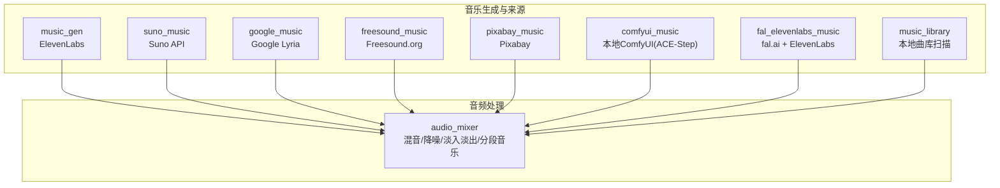
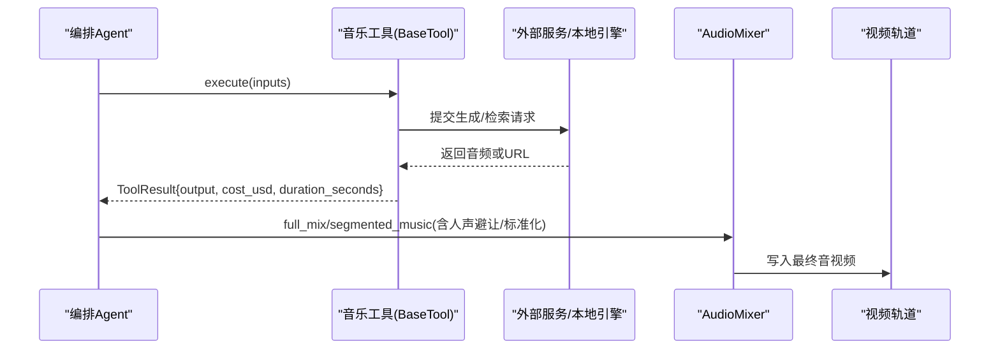
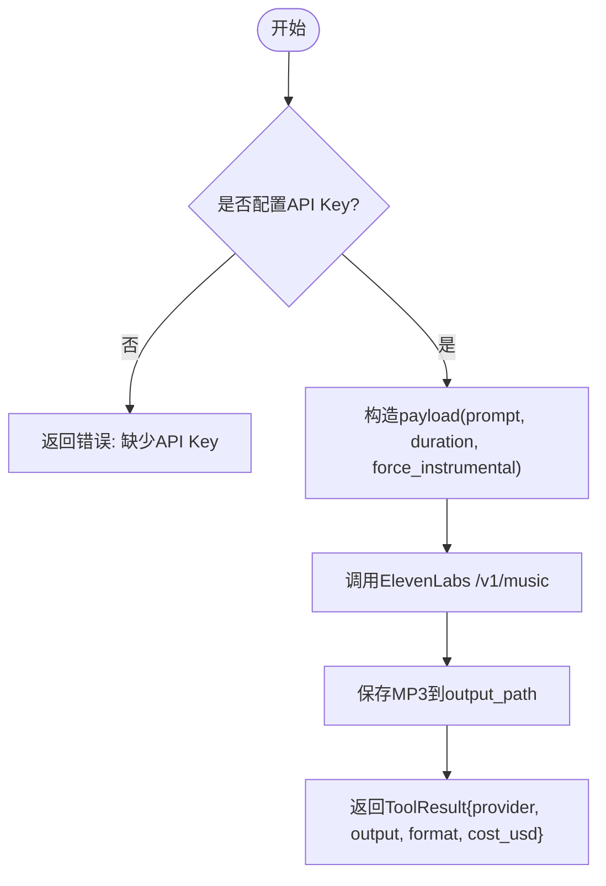
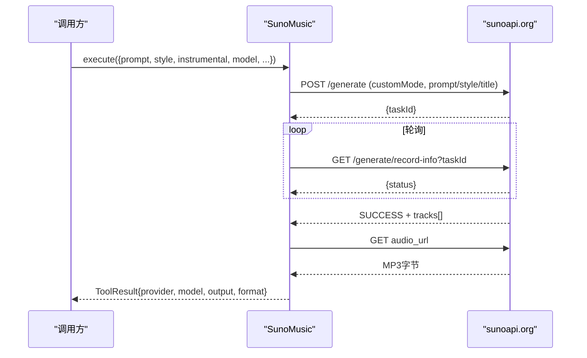
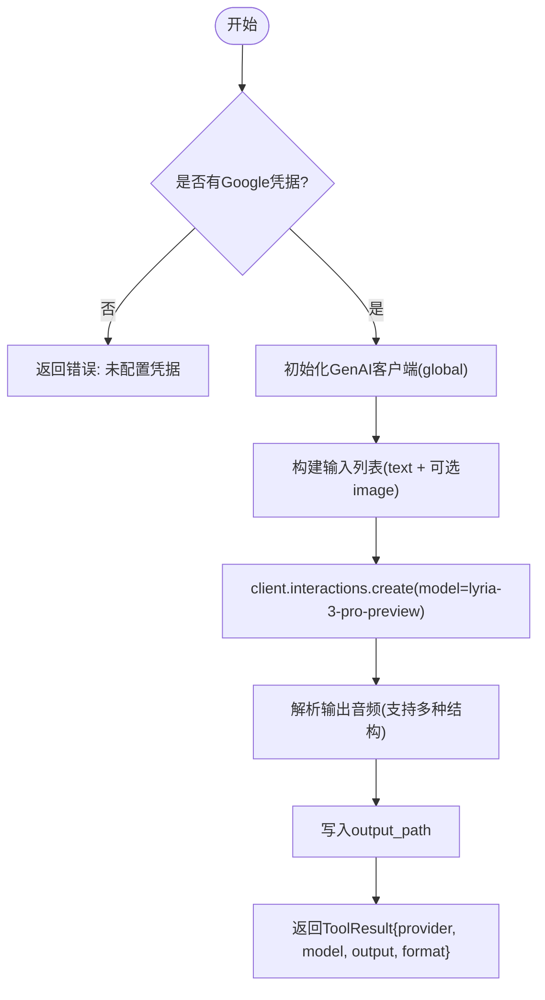
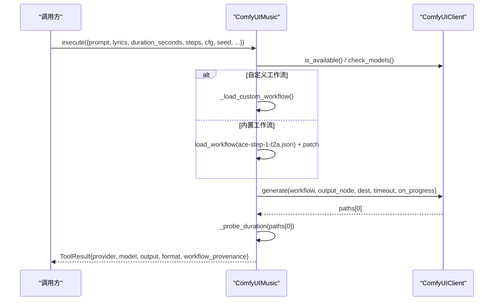
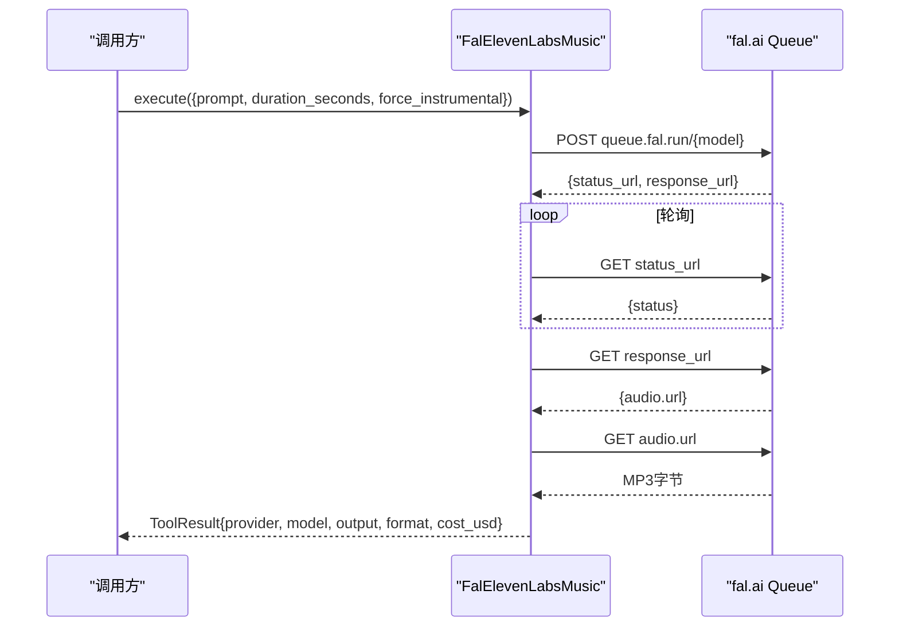
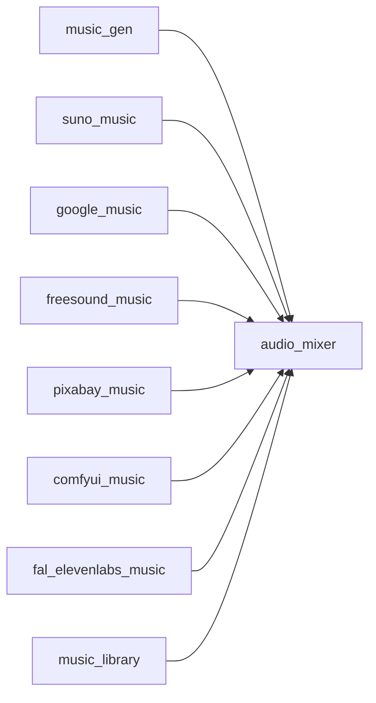

# 音乐生成

<cite>
**本文引用的文件**
- [music_library.py](file://tools/audio/music_library.py)
- [music_gen.py](file://tools/audio/music_gen.py)
- [suno_music.py](file://tools/audio/suno_music.py)
- [google_music.py](file://tools/audio/google_music.py)
- [freesound_music.py](file://tools/audio/freesound_music.py)
- [pixabay_music.py](file://tools/audio/pixabay_music.py)
- [comfyui_music.py](file://tools/audio/comfyui_music.py)
- [fal_elevenlabs_music.py](file://tools/audio/fal_elevenlabs_music.py)
- [audio_mixer.py](file://tools/audio/audio_mixer.py)
- [music-gen-usage.md](file://skills/creative/music-gen-usage.md)
</cite>

## 目录
1. [简介](#简介)
2. [项目结构](#项目结构)
3. [核心组件](#核心组件)
4. [架构总览](#架构总览)
5. [详细组件分析](#详细组件分析)
6. [依赖关系分析](#依赖关系分析)
7. [性能与成本考量](#性能与成本考量)
8. [故障排查指南](#故障排查指南)
9. [结论](#结论)
10. [附录：API参考与使用示例](#附录api参考与使用示例)

## 简介
本技术文档面向OpenMontage的音乐生成功能，系统性地介绍多种音乐生成与素材获取服务的集成实现，包括Suno AI、Google Music（Lyria）、FreeSound、Pixabay、ComfyUI（本地ACE-Step）以及Fal.ai ElevenLabs Music。文档同时覆盖音乐库管理（本地免版权曲库检索）、提示词工程、风格控制、时长管理、质量评估、版权合规检查、性能优化建议，以及与视频同步和音频混音的集成方案。目标是帮助开发者快速理解并正确使用各服务，构建从简单背景音乐到复杂音乐编排的完整工作流。

## 项目结构
OpenMontage将音乐相关能力以“工具”形式组织在 tools/audio 目录下，每个服务一个独立类，统一继承 BaseTool，提供一致的输入输出Schema、状态检测、重试策略、成本估算与副作用声明。音频处理与混音由 audio_mixer 提供，提示词与最佳实践由 skills/creative/music-gen-usage.md 给出。

图表来源
- [music_gen.py:28-94](file://tools/audio/music_gen.py#L28-L94)
- [suno_music.py:29-128](file://tools/audio/suno_music.py#L29-L128)
- [google_music.py:29-114](file://tools/audio/google_music.py#L29-L114)
- [freesound_music.py:31-108](file://tools/audio/freesound_music.py#L31-L108)
- [pixabay_music.py:35-109](file://tools/audio/pixabay_music.py#L35-L109)
- [comfyui_music.py:47-162](file://tools/audio/comfyui_music.py#L47-L162)
- [fal_elevenlabs_music.py:29-114](file://tools/audio/fal_elevenlabs_music.py#L29-L114)
- [music_library.py:53-130](file://tools/audio/music_library.py#L53-L130)
- [audio_mixer.py:26-43](file://tools/audio/audio_mixer.py#L26-L43)

章节来源
- [music_library.py:53-130](file://tools/audio/music_library.py#L53-L130)
- [music_gen.py:28-94](file://tools/audio/music_gen.py#L28-L94)
- [suno_music.py:29-128](file://tools/audio/suno_music.py#L29-L128)
- [google_music.py:29-114](file://tools/audio/google_music.py#L29-L114)
- [freesound_music.py:31-108](file://tools/audio/freesound_music.py#L31-L108)
- [pixabay_music.py:35-109](file://tools/audio/pixabay_music.py#L35-L109)
- [comfyui_music.py:47-162](file://tools/audio/comfyui_music.py#L47-L162)
- [fal_elevenlabs_music.py:29-114](file://tools/audio/fal_elevenlabs_music.py#L29-L114)
- [audio_mixer.py:26-43](file://tools/audio/audio_mixer.py#L26-L43)

## 核心组件
- 音乐生成器
  - music_gen：基于ElevenLabs Music API，支持精确时长、强制纯音乐模式，适合短视频背景乐。
  - suno_music：通过第三方代理调用Suno API，支持自定义歌词、风格、模型版本与长曲。
  - google_music：基于Google GenAI SDK调用Lyria 3 Pro，支持图像条件输入与时长限制自动修正。
  - comfyui_music：本地ComfyUI服务器驱动ACE-Step文本转音频，支持自定义工作流与种子可控。
  - fal_elevenlabs_music：通过fal.ai队列调用ElevenLabs Music，强调精确时长与共享账户成本。
- 音乐来源与检索
  - freesound_music：搜索并下载Freesound的CC授权音频，支持时长过滤与评分排序。
  - pixabay_music：无需API Key，抓取Pixabay音乐页面数据并下载MP3，稳定性受网站结构影响。
  - music_library：扫描本地 music_library 目录，列出可用曲目及时长，便于提案阶段选择。
- 音频混音与后期
  - audio_mixer：封装FFmpeg/pydub，提供多轨混合、人声避让（ducking）、淡入淡出、响度标准化、分段音乐注入等。

章节来源
- [music_gen.py:28-94](file://tools/audio/music_gen.py#L28-L94)
- [suno_music.py:29-128](file://tools/audio/suno_music.py#L29-L128)
- [google_music.py:29-114](file://tools/audio/google_music.py#L29-L114)
- [comfyui_music.py:47-162](file://tools/audio/comfyui_music.py#L47-L162)
- [fal_elevenlabs_music.py:29-114](file://tools/audio/fal_elevenlabs_music.py#L29-L114)
- [freesound_music.py:31-108](file://tools/audio/freesound_music.py#L31-L108)
- [pixabay_music.py:35-109](file://tools/audio/pixabay_music.py#L35-L109)
- [music_library.py:53-130](file://tools/audio/music_library.py#L53-L130)
- [audio_mixer.py:26-43](file://tools/audio/audio_mixer.py#L26-L43)

## 架构总览
OpenMontage采用统一的工具抽象，所有音乐生成与来源工具均暴露一致的接口：状态检测、执行、成本估算、重试策略、幂等键字段与副作用说明。生成的音频统一进入 audio_mixer 进行混音、降噪、响度标准化与视频时间轴对齐。

图表来源
- [music_gen.py:113-188](file://tools/audio/music_gen.py#L113-L188)
- [suno_music.py:146-200](file://tools/audio/suno_music.py#L146-L200)
- [google_music.py:133-335](file://tools/audio/google_music.py#L133-L335)
- [comfyui_music.py:198-303](file://tools/audio/comfyui_music.py#L198-L303)
- [fal_elevenlabs_music.py:134-232](file://tools/audio/fal_elevenlabs_music.py#L134-L232)
- [audio_mixer.py:257-667](file://tools/audio/audio_mixer.py#L257-L667)

## 详细组件分析

### 音乐生成器：music_gen（ElevenLabs）
- 功能要点
  - 通过ElevenLabs Music API生成背景乐，支持 prompt、duration_seconds、force_instrumental、output_path。
  - 默认强制纯音乐以避免与人声冲突；严格校验 duration_seconds，避免静默默认值。
  - 成本估算按时长线性近似；失败时返回错误信息。
- 关键流程
  - 校验API Key -> 构造payload -> 发起POST -> 保存MP3 -> 返回结果。
- 适用场景
  - 短视频背景乐、需要精确时长控制的场景。

图表来源
- [music_gen.py:96-188](file://tools/audio/music_gen.py#L96-L188)

章节来源
- [music_gen.py:28-188](file://tools/audio/music_gen.py#L28-L188)

### 音乐生成器：suno_music（Suno）
- 功能要点
  - 异步流程：提交任务 -> 轮询状态 -> 下载音频；支持自定义歌词、风格、标题、模型版本（V4/V4_5/V5）。
  - 每次生成两条音轨，可通过 track_index 选择。
  - 成本估算固定；失败时抛出异常并返回错误。
- 关键流程
  - 校验API Key -> 提交生成 -> 轮询完成 -> 下载音频 -> 返回结果。
- 适用场景
  - 高质量歌曲/纯音乐、长曲（最长可达8分钟）、风格化强需求。

图表来源
- [suno_music.py:146-289](file://tools/audio/suno_music.py#L146-L289)

章节来源
- [suno_music.py:29-289](file://tools/audio/suno_music.py#L29-L289)

### 音乐生成器：google_music（Google Lyria 3 Pro）
- 功能要点
  - 使用Google GenAI SDK调用 lyria-3-pro-preview，支持图像条件输入（URL或本地路径）。
  - 时长限制：最小5秒、最大184秒，可开启 auto_fix 自动修正。
  - 成本估算固定；失败时返回错误。
- 关键流程
  - 校验Google凭据 -> 初始化客户端 -> 构建输入列表（文本+可选图像）-> 创建交互 -> 解析音频数据 -> 保存MP3。
- 适用场景
  - 高质量背景乐、与Google生态集成、图像引导音乐生成。

图表来源
- [google_music.py:116-335](file://tools/audio/google_music.py#L116-L335)

章节来源
- [google_music.py:29-335](file://tools/audio/google_music.py#L29-L335)

### 音乐生成器：comfyui_music（本地ComfyUI ACE-Step）
- 功能要点
  - 通过ComfyUIClient连接本地或远程ComfyUI服务器，默认使用内置ACE-Step v1工作流。
  - 支持自定义工作流JSON/路径、输出节点指定、种子控制、步骤数、CFG、歌词强度等。
  - 成本为0（本地GPU），但需满足资源要求（CPU/RAM/VRAM/Disk）。
- 关键流程
  - 校验服务器可用性 -> 检查必需模型 -> 加载/修补工作流 -> 提交生成 -> 等待完成 -> 下载产物 -> 探测时长 -> 返回结果。
- 适用场景
  - 离线生成、无API费用、完全可控采样参数与模型栈。

图表来源
- [comfyui_music.py:164-303](file://tools/audio/comfyui_music.py#L164-L303)

章节来源
- [comfyui_music.py:47-368](file://tools/audio/comfyui_music.py#L47-L368)

### 音乐生成器：fal_elevenlabs_music（fal.ai + ElevenLabs）
- 功能要点
  - 通过fal.ai队列调用ElevenLabs Music，支持精确时长、强制纯音乐模式。
  - 成本按输出分钟向上取整计费；超时与失败有明确错误返回。
- 关键流程
  - 校验FAL_KEY -> 构造payload -> 提交队列 -> 轮询状态 -> 下载音频 -> 保存MP3 -> 返回结果。
- 适用场景
  - 共享账户下的高质量背景乐、短格式社交媒体视频配乐。

图表来源
- [fal_elevenlabs_music.py:121-232](file://tools/audio/fal_elevenlabs_music.py#L121-L232)

章节来源
- [fal_elevenlabs_music.py:29-232](file://tools/audio/fal_elevenlabs_music.py#L29-L232)

### 音乐来源：freesound_music（Freesound.org）
- 功能要点
  - 搜索Freesound的CC授权音频，支持时长过滤、评分排序、标签元数据。
  - 免费，但需FREESOUND_API_KEY；下载HQ/LQ MP3预览。
- 关键流程
  - 校验API Key -> 搜索 -> 选择Top结果 -> 下载MP3 -> 返回结果（含许可证信息）。
- 适用场景
  - 环境氛围音乐、Loops、纹理音频；注意个体声音的CC许可证条款。

章节来源
- [freesound_music.py:31-230](file://tools/audio/freesound_music.py#L31-L230)

### 音乐来源：pixabay_music（Pixabay）
- 功能要点
  - 无需API Key，通过网页抓取获取音乐；支持时长过滤。
  - 稳定性受网站HTML结构变化影响；提供bootstrap JSON优先解析与HTML回退。
- 关键流程
  - 构建搜索URL -> 获取HTML -> 提取__BOOTSTRAP_URL__ -> 获取JSON -> 过滤时长 -> 下载MP3 -> 返回结果。
- 适用场景
  - 快速零配置背景乐；商业项目可使用（遵循Pixabay内容许可）。

章节来源
- [pixabay_music.py:35-356](file://tools/audio/pixabay_music.py#L35-L356)

### 音乐库管理：music_library（本地曲库）
- 功能要点
  - 扫描本地 music_library 目录（支持环境变量覆盖），递归查找常见音频扩展名。
  - 可选使用ffprobe探测时长；返回曲目清单、数量、总时长等信息。
- 关键流程
  - 解析library_dir -> rglob扫描 -> 过滤音频扩展 -> 可选探测时长 -> 返回ToolResult。
- 适用场景
  - 提案阶段展示用户提供的免版权音乐选项；离线可用。

章节来源
- [music_library.py:53-222](file://tools/audio/music_library.py#L53-L222)

### 音频混音：audio_mixer（FFmpeg/pydub）
- 功能要点
  - 支持 mix、duck、extract、full_mix、segmented_music 等操作。
  - 人声避让（sidechaincompress）、淡入淡出、响度标准化（loudnorm）、目标时长对齐。
  - 分段音乐注入：仅在指定时间段播放音乐，边界平滑过渡。
- 关键流程
  - 根据operation构建FFmpeg filter_complex -> 执行命令 -> 返回结果。
- 适用场景
  - 将生成/检索的音乐与人声、音效混合，确保语音清晰度与平台响度标准。

章节来源
- [audio_mixer.py:26-776](file://tools/audio/audio_mixer.py#L26-L776)

## 依赖关系分析
- 工具层耦合
  - 所有音乐工具继承BaseTool，统一接口降低耦合；通过fallback_tools声明降级路径。
  - audio_mixer作为通用后端，被多个生成器间接依赖（生成后混音）。
- 外部依赖
  - ElevenLabs/Suno/Google/fal.ai/Freesound/Pixabay：网络API或网页抓取。
  - ComfyUI：本地GPU服务，需安装模型与工作流。
  - FFmpeg：混音与格式转换必需。
- 潜在循环依赖
  - 当前模块间无直接循环导入；工具之间通过编排层组合。

图表来源
- [music_gen.py:28-94](file://tools/audio/music_gen.py#L28-L94)
- [suno_music.py:29-128](file://tools/audio/suno_music.py#L29-L128)
- [google_music.py:29-114](file://tools/audio/google_music.py#L29-L114)
- [freesound_music.py:31-108](file://tools/audio/freesound_music.py#L31-L108)
- [pixabay_music.py:35-109](file://tools/audio/pixabay_music.py#L35-L109)
- [comfyui_music.py:47-162](file://tools/audio/comfyui_music.py#L47-L162)
- [fal_elevenlabs_music.py:29-114](file://tools/audio/fal_elevenlabs_music.py#L29-L114)
- [music_library.py:53-130](file://tools/audio/music_library.py#L53-L130)
- [audio_mixer.py:26-43](file://tools/audio/audio_mixer.py#L26-L43)

章节来源
- [music_gen.py:28-94](file://tools/audio/music_gen.py#L28-L94)
- [audio_mixer.py:26-43](file://tools/audio/audio_mixer.py#L26-L43)

## 性能与成本考量
- 生成耗时
  - ElevenLabs：约每30秒$0.05，时长越长成本越高；超时180秒。
  - Suno：固定成本约$0.05/次，轮询间隔30秒，最长等待5分钟。
  - Google Lyria：固定成本约$0.08/次，时长限制5-184秒。
  - ComfyUI：本地GPU，成本0，耗时取决于steps与硬件。
  - Fal.ai ElevenLabs：按输出分钟计费（向上取整），轮询间隔5秒，最长等待10分钟。
- 资源占用
  - ComfyUI需较高CPU/RAM/VRAM；其他工具多为网络IO。
  - audio_mixer依赖FFmpeg，内存与CPU随轨道数增加。
- 优化建议
  - 优先选择与视频时长匹配的生成器，避免循环拼接。
  - 使用分段音乐与淡入淡出减少突兀切换。
  - 合理设置ducking参数，确保语音清晰度。
  - 对长视频采用分段生成与拼接，降低单次请求失败风险。

章节来源
- [music_gen.py:101-111](file://tools/audio/music_gen.py#L101-L111)
- [suno_music.py:142-144](file://tools/audio/suno_music.py#L142-L144)
- [google_music.py:128-131](file://tools/audio/google_music.py#L128-L131)
- [comfyui_music.py:176-180](file://tools/audio/comfyui_music.py#L176-L180)
- [fal_elevenlabs_music.py:127-132](file://tools/audio/fal_elevenlabs_music.py#L127-L132)
- [audio_mixer.py:198-203](file://tools/audio/audio_mixer.py#L198-L203)

## 故障排查指南
- 常见错误
  - 缺少API Key：music_gen/google_music/freesound_music/fal_elevenlabs_music会返回明确错误。
  - 时长越界：google_music最小5秒、最大184秒；fal_elevenlabs_music 3-600秒。
  - 网络超时/限流：启用retry_policy重试；必要时调整timeout。
  - ComfyUI模型缺失：返回missing_models_payload，按提示下载模型。
- 调试步骤
  - 检查环境变量与凭据。
  - 查看ToolResult.error与data字段。
  - 对ComfyUI使用resume_prompt_id恢复长时间任务。
  - 使用audio_mixer的segmented_music验证片段混音效果。

章节来源
- [music_gen.py:96-126](file://tools/audio/music_gen.py#L96-L126)
- [google_music.py:116-195](file://tools/audio/google_music.py#L116-L195)
- [freesound_music.py:112-152](file://tools/audio/freesound_music.py#L112-L152)
- [fal_elevenlabs_music.py:121-150](file://tools/audio/fal_elevenlabs_music.py#L121-L150)
- [comfyui_music.py:168-227](file://tools/audio/comfyui_music.py#L168-L227)

## 结论
OpenMontage的音乐生成功能以统一工具抽象整合了多家服务，既支持云端高质量生成，也支持本地离线生成与免费素材检索。通过提示词工程与风格控制，结合时长管理与混音能力，可实现从简单背景乐到复杂音乐编排的完整工作流。建议在提案阶段优先使用本地曲库与免费来源，生成阶段根据预算与质量需求选择合适的服务，并通过audio_mixer确保最终输出的音质与平台标准一致。

## 附录：API参考与使用示例

### 提示词工程与风格控制
- 推荐结构：[风格/流派], [BPM], [调性/情绪], [乐器], [能量水平], [用途]
- 关键规则：始终包含“background/underscore”，强制纯音乐，明确BPM，避免高频繁忙元素，加入能量方向。
- 时长匹配：尽量按视频时长生成，避免循环；长视频可分段生成并交叉淡入淡出。

章节来源
- [music-gen-usage.md:41-136](file://skills/creative/music-gen-usage.md#L41-L136)

### 时长管理
- ElevenLabs：3-600秒，按毫秒传递。
- Suno：模型限制（V4最长4分钟，V4_5/V5最长8分钟）。
- Google Lyria：5-184秒，支持auto_fix自动修正。
- Fal.ai ElevenLabs：3-600秒，按分钟计费。
- ComfyUI：通过duration_seconds控制，依赖工作流与模型。

章节来源
- [music_gen.py:53-84](file://tools/audio/music_gen.py#L53-L84)
- [suno_music.py:75-117](file://tools/audio/suno_music.py#L75-L117)
- [google_music.py:69-99](file://tools/audio/google_music.py#L69-L99)
- [fal_elevenlabs_music.py:70-94](file://tools/audio/fal_elevenlabs_music.py#L70-L94)
- [comfyui_music.py:90-154](file://tools/audio/comfyui_music.py#L90-L154)

### 版权合规检查
- Freesound：Creative Commons，需检查具体声音许可证。
- Pixabay：Pixabay内容许可，通常免费商用。
- 本地曲库：用户自行负责版权；建议使用YouTube Audio Library、Jamendo、Freesound等来源。
- 生成服务：遵循各自服务的使用条款；ElevenLabs/Suno/Google/fal.ai需关注商用授权。

章节来源
- [freesound_music.py:51-68](file://tools/audio/freesound_music.py#L51-L68)
- [pixabay_music.py:55-70](file://tools/audio/pixabay_music.py#L55-L70)
- [music_library.py:65-88](file://tools/audio/music_library.py#L65-L88)

### 质量评估与混音集成
- 质量评估：试听生成音乐的情绪、风格准确性与音质；使用audio_mixer进行响度标准化与语音避让。
- 混音集成：使用full_mix或segmented_music将音乐与人声、音效混合，确保语音清晰度与平台响度标准（如-14 LUFS）。

章节来源
- [audio_mixer.py:479-667](file://tools/audio/audio_mixer.py#L479-L667)
- [music-gen-usage.md:123-136](file://skills/creative/music-gen-usage.md#L123-L136)

### 与视频同步与音频混音
- 分段音乐：仅在某些时间段播放音乐，边界平滑过渡，避免干扰展示片段。
- 人声避让：使用sidechaincompress在人声出现时降低音乐音量，确保语音清晰。
- 目标时长：通过target_duration对齐输出音频长度，避免过长或过短。

章节来源
- [audio_mixer.py:669-776](file://tools/audio/audio_mixer.py#L669-L776)
- [audio_mixer.py:340-445](file://tools/audio/audio_mixer.py#L340-L445)