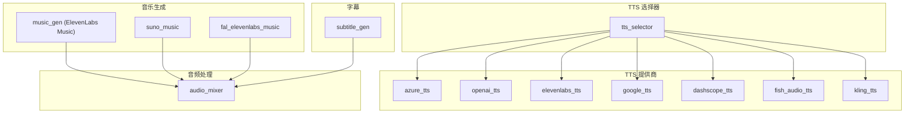
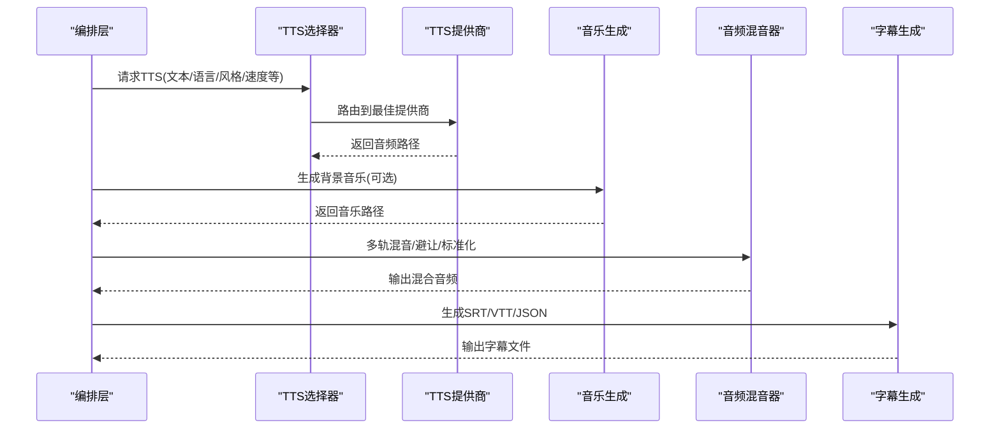
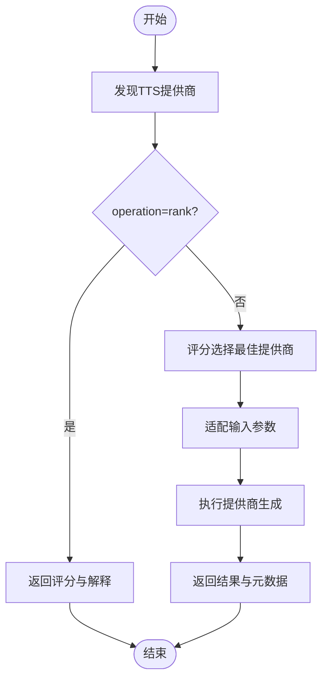
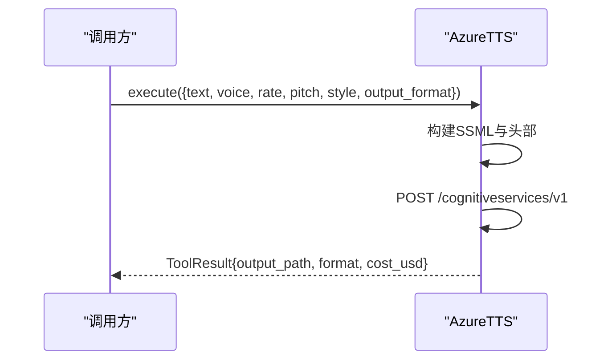
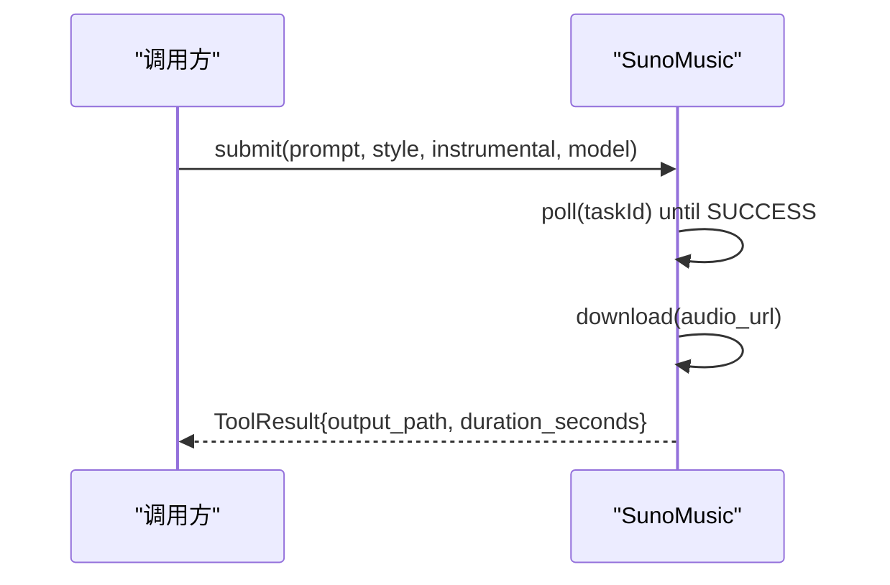
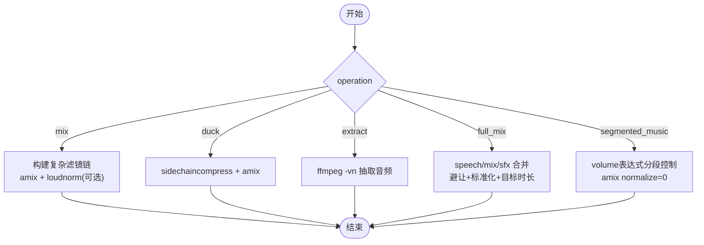
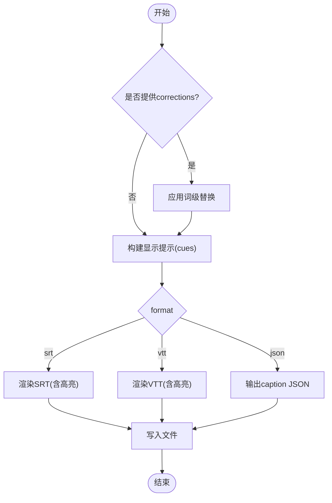
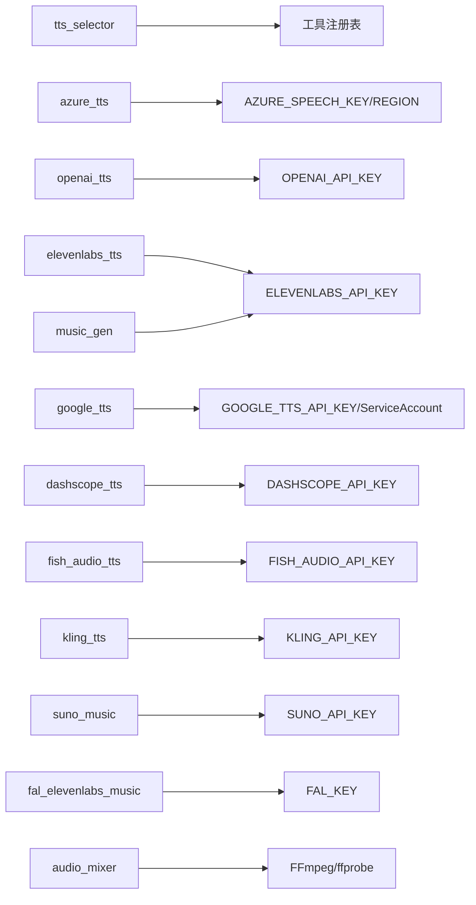

# 音频处理

<cite>
**本文引用的文件**
- [tools/audio/tts_selector.py](file://tools/audio/tts_selector.py)
- [tools/audio/azure_tts.py](file://tools/audio/azure_tts.py)
- [tools/audio/openai_tts.py](file://tools/audio/openai_tts.py)
- [tools/audio/elevenlabs_tts.py](file://tools/audio/elevenlabs_tts.py)
- [tools/audio/google_tts.py](file://tools/audio/google_tts.py)
- [tools/audio/dashscope_tts.py](file://tools/audio/dashscope_tts.py)
- [tools/audio/fish_audio_tts.py](file://tools/audio/fish_audio_tts.py)
- [tools/audio/kling_tts.py](file://tools/audio/kling_tts.py)
- [tools/audio/suno_music.py](file://tools/audio/suno_music.py)
- [tools/audio/music_gen.py](file://tools/audio/music_gen.py)
- [tools/audio/fal_elevenlabs_music.py](file://tools/audio/fal_elevenlabs_music.py)
- [tools/audio/audio_mixer.py](file://tools/audio/audio_mixer.py)
- [tools/subtitle/subtitle_gen.py](file://tools/subtitle/subtitle_gen.py)
- [tests/tools/test_subtitle_timestamps.py](file://tests/tools/test_subtitle_timestamps.py)
</cite>

## 目录
1. [简介](#简介)
2. [项目结构](#项目结构)
3. [核心组件](#核心组件)
4. [架构总览](#架构总览)
5. [详细组件分析](#详细组件分析)
6. [依赖关系分析](#依赖关系分析)
7. [性能考虑](#性能考虑)
8. [故障排除指南](#故障排除指南)
9. [结论](#结论)
10. [附录：API参考与使用示例](#附录api参考与使用示例)

## 简介
本技术文档系统性介绍 OpenMontage 的音频处理模块，覆盖文本转语音（TTS）、音乐生成、音频混音与降噪、字幕生成等能力。模块通过统一的工具抽象与选择器，集成 Azure TTS、ElevenLabs、OpenAI TTS、Google TTS、DashScope、Fish Audio、Kling 等十余家提供商；音乐生成支持 ElevenLabs Music、Suno AI、fal.ai ElevenLabs Music 等；混音器基于 FFmpeg/pydub 实现多轨混音、人声避让（ducking）、淡入淡出、响度标准化（loudnorm）；字幕生成支持 SRT/VTT/JSON，提供逐词高亮与时间戳对齐。

## 项目结构
音频相关代码主要位于 tools/audio 与 tools/subtitle 两个目录：
- tools/audio：TTS 提供商实现、音乐生成、音频混音、TTS 选择器
- tools/subtitle：字幕生成（SRT/VTT/JSON）
- tests/tools：针对字幕时间戳格式的正确性回归测试

图表来源
- [tools/audio/tts_selector.py:15-324](file://tools/audio/tts_selector.py#L15-L324)
- [tools/audio/audio_mixer.py:26-776](file://tools/audio/audio_mixer.py#L26-L776)
- [tools/subtitle/subtitle_gen.py:26-336](file://tools/subtitle/subtitle_gen.py#L26-L336)

章节来源
- [tools/audio/tts_selector.py:15-324](file://tools/audio/tts_selector.py#L15-L324)
- [tools/audio/audio_mixer.py:26-776](file://tools/audio/audio_mixer.py#L26-L776)
- [tools/subtitle/subtitle_gen.py:26-336](file://tools/subtitle/subtitle_gen.py#L26-L336)

## 核心组件
- TTS 选择器（tts_selector）：自动发现并评分选择最佳 TTS 提供商，统一输入参数，适配不同提供商的参数差异，支持“rank”模式返回候选排序。
- TTS 提供商：Azure TTS、OpenAI TTS、ElevenLabs TTS、Google TTS、DashScope TTS、Fish Audio TTS、Kling TTS。
- 音乐生成：ElevenLabs Music（music_gen）、Suno AI（suno_music）、fal.ai ElevenLabs Music（fal_elevenlabs_music）。
- 音频混音器（audio_mixer）：多轨混音、人声避让、淡入淡出、提取音频、分段音乐混合、响度标准化。
- 字幕生成（subtitle_gen）：将带词级时间戳的转录结果转换为 SRT/VTT/JSON，支持逐词高亮与校正。

章节来源
- [tools/audio/tts_selector.py:15-324](file://tools/audio/tts_selector.py#L15-L324)
- [tools/audio/azure_tts.py:42-288](file://tools/audio/azure_tts.py#L42-L288)
- [tools/audio/openai_tts.py:24-198](file://tools/audio/openai_tts.py#L24-L198)
- [tools/audio/elevenlabs_tts.py:24-213](file://tools/audio/elevenlabs_tts.py#L24-L213)
- [tools/audio/google_tts.py:33-313](file://tools/audio/google_tts.py#L33-L313)
- [tools/audio/dashscope_tts.py:29-244](file://tools/audio/dashscope_tts.py#L29-L244)
- [tools/audio/fish_audio_tts.py:31-406](file://tools/audio/fish_audio_tts.py#L31-L406)
- [tools/audio/kling_tts.py:30-341](file://tools/audio/kling_tts.py#L30-L341)
- [tools/audio/music_gen.py:28-188](file://tools/audio/music_gen.py#L28-L188)
- [tools/audio/suno_music.py:29-289](file://tools/audio/suno_music.py#L29-L289)
- [tools/audio/fal_elevenlabs_music.py:29-232](file://tools/audio/fal_elevenlabs_music.py#L29-L232)
- [tools/audio/audio_mixer.py:26-776](file://tools/audio/audio_mixer.py#L26-L776)
- [tools/subtitle/subtitle_gen.py:26-336](file://tools/subtitle/subtitle_gen.py#L26-L336)

## 架构总览
整体流程：上层编排调用 tts_selector，选择具体 TTS 提供商生成语音；根据需要调用音乐生成工具产出背景音乐；最后通过 audio_mixer 进行多轨混音、人声避让、标准化；字幕由 subtitle_gen 从转录结果生成并与音频对齐。

图表来源
- [tools/audio/tts_selector.py:190-225](file://tools/audio/tts_selector.py#L190-L225)
- [tools/audio/audio_mixer.py:257-278](file://tools/audio/audio_mixer.py#L257-L278)
- [tools/subtitle/subtitle_gen.py:82-129](file://tools/subtitle/subtitle_gen.py#L82-L129)

## 详细组件分析

### TTS 选择器（tts_selector）
- 自动发现所有 capability="tts" 的工具，按任务上下文评分选择最佳提供商。
- 支持 operation=rank 返回候选排序与解释；支持 preferred_provider/allowed_providers 限制候选集。
- 对 Azure TTS 做参数适配（如 speaking_rate -> rate、pitch -> st、style 映射等）。

图表来源
- [tools/audio/tts_selector.py:157-225](file://tools/audio/tts_selector.py#L157-L225)
- [tools/audio/tts_selector.py:227-256](file://tools/audio/tts_selector.py#L227-L256)

章节来源
- [tools/audio/tts_selector.py:15-324](file://tools/audio/tts_selector.py#L15-L324)

### Azure TTS
- 通过 REST v1 端点发送 SSML，支持 prosody 控制（rate/pitch）、express-as 风格、多语言。
- 默认输出为高质量 MP3/WAV；成本按字符估算；失败时返回结构化错误信息。

图表来源
- [tools/audio/azure_tts.py:203-288](file://tools/audio/azure_tts.py#L203-L288)

章节来源
- [tools/audio/azure_tts.py:42-288](file://tools/audio/azure_tts.py#L42-L288)

### OpenAI TTS
- 使用官方 SDK 流式生成音频，支持 model（如 gpt-4o-mini-tts）、voice、speed、instructions。
- 支持多种 response_format；失败时包含重试策略与错误信息。

章节来源
- [tools/audio/openai_tts.py:24-198](file://tools/audio/openai_tts.py#L24-L198)

### ElevenLabs TTS
- 直接调用 ElevenLabs API，支持 voice_id、model_id、stability/similarity_boost/style/speed 等声音设置。
- 输出 mp3/wav；成本按字符估算。

章节来源
- [tools/audio/elevenlabs_tts.py:24-213](file://tools/audio/elevenlabs_tts.py#L24-L213)

### Google TTS
- 支持 API Key 或服务账户两种认证方式；Chirp/Journey 语音走 v1beta1 端点。
- 支持 SSML、多语言、多种编码格式；成本按模型类型估算。

章节来源
- [tools/audio/google_tts.py:33-313](file://tools/audio/google_tts.py#L33-L313)

### DashScope TTS
- 通过阿里百炼的多模态生成端点合成语音，返回临时音频 URL 需二次下载。
- 支持指令优化、多语言；成本按字符估算。

章节来源
- [tools/audio/dashscope_tts.py:29-244](file://tools/audio/dashscope_tts.py#L29-L244)

### Fish Audio TTS
- 支持 S1/S2 系列模型与 reference_id 音色克隆；可配置采样温度、top_p、重复惩罚等。
- 成本按 UTF-8 字节计费；免费额度有有效期提示。

章节来源
- [tools/audio/fish_audio_tts.py:31-406](file://tools/audio/fish_audio_tts.py#L31-L406)

### Kling TTS
- 官方接口，支持异步任务创建与轮询；可携带回调与外部任务ID；输出多音频文件编号保存。
- 成本估算保守，支持账号用量诊断。

章节来源
- [tools/audio/kling_tts.py:30-341](file://tools/audio/kling_tts.py#L30-L341)

### 音乐生成
- ElevenLabs Music（music_gen）：按 prompt 与 duration_seconds 生成纯音乐，强制无歌词适合背景。
- Suno AI（suno_music）：支持简单描述或自定义歌词模式，异步提交+轮询+下载。
- fal.ai ElevenLabs Music（fal_elevenlabs_music）：通过 fal.ai 队列精确时长生成，按分钟计费。

图表来源
- [tools/audio/suno_music.py:146-200](file://tools/audio/suno_music.py#L146-L200)
- [tools/audio/suno_music.py:202-289](file://tools/audio/suno_music.py#L202-L289)

章节来源
- [tools/audio/music_gen.py:28-188](file://tools/audio/music_gen.py#L28-L188)
- [tools/audio/suno_music.py:29-289](file://tools/audio/suno_music.py#L29-L289)
- [tools/audio/fal_elevenlabs_music.py:29-232](file://tools/audio/fal_elevenlabs_music.py#L29-L232)

### 音频混音器（audio_mixer）
- 操作类型：mix（多轨混音）、duck（人声避让）、extract（视频抽音）、full_mix（一键混音+避让+标准化）、segmented_music（分段音乐混合）。
- 关键特性：
  - 每轨支持音量、延迟、淡入淡出；淡出长度通过 ffprobe 获取源时长计算。
  - 人声避让使用 sidechaincompress，支持 attack/release 与目标音量。
  - 标准化使用 loudnorm，I 目标可配置（默认 -16 LUFS，可按平台调整）。
  - segmented_music 使用 volume 表达式在指定时间段内平滑淡入淡出，避免 amix 归一化导致的人声衰减。

图表来源
- [tools/audio/audio_mixer.py:205-255](file://tools/audio/audio_mixer.py#L205-L255)
- [tools/audio/audio_mixer.py:280-338](file://tools/audio/audio_mixer.py#L280-L338)
- [tools/audio/audio_mixer.py:340-445](file://tools/audio/audio_mixer.py#L340-L445)
- [tools/audio/audio_mixer.py:479-667](file://tools/audio/audio_mixer.py#L479-L667)
- [tools/audio/audio_mixer.py:669-776](file://tools/audio/audio_mixer.py#L669-L776)

章节来源
- [tools/audio/audio_mixer.py:26-776](file://tools/audio/audio_mixer.py#L26-L776)

### 字幕生成（subtitle_gen）
- 输入：带词级时间戳的 segments；支持 corrections 修正常见识别错误。
- 输出：SRT/VTT/JSON；支持 word_by_word 与 karaoke 高亮。
- 时间戳格式化确保毫秒进位正确，避免 “…,1000” 非法格式。

图表来源
- [tools/subtitle/subtitle_gen.py:82-129](file://tools/subtitle/subtitle_gen.py#L82-L129)
- [tools/subtitle/subtitle_gen.py:131-166](file://tools/subtitle/subtitle_gen.py#L131-L166)
- [tools/subtitle/subtitle_gen.py:168-227](file://tools/subtitle/subtitle_gen.py#L168-L227)
- [tools/subtitle/subtitle_gen.py:229-336](file://tools/subtitle/subtitle_gen.py#L229-L336)

章节来源
- [tools/subtitle/subtitle_gen.py:26-336](file://tools/subtitle/subtitle_gen.py#L26-L336)
- [tests/tools/test_subtitle_timestamps.py:1-49](file://tests/tools/test_subtitle_timestamps.py#L1-L49)

## 依赖关系分析
- TTS 选择器依赖工具注册表动态发现所有 capability="tts" 的工具，并通过评分函数选择最优。
- 各 TTS 提供商依赖各自的环境变量（如 AZURE_SPEECH_KEY、OPENAI_API_KEY、ELEVENLABS_API_KEY、GOOGLE_TTS_API_KEY、DASHSCOPE_API_KEY、FISH_AUDIO_API_KEY、KLING_API_KEY）。
- 音乐生成依赖对应服务密钥（ELEVENLABS_API_KEY、SUNO_API_KEY、FAL_KEY）。
- 混音器依赖 FFmpeg（必需）与可选 pydub；使用 ffprobe 获取媒体时长。
- 字幕生成纯 Python 实现，无外部依赖。

图表来源
- [tools/audio/tts_selector.py:157-167](file://tools/audio/tts_selector.py#L157-L167)
- [tools/audio/azure_tts.py:176-181](file://tools/audio/azure_tts.py#L176-L181)
- [tools/audio/openai_tts.py:117-120](file://tools/audio/openai_tts.py#L117-L120)
- [tools/audio/elevenlabs_tts.py:139-142](file://tools/audio/elevenlabs_tts.py#L139-L142)
- [tools/audio/google_tts.py:151-163](file://tools/audio/google_tts.py#L151-L163)
- [tools/audio/dashscope_tts.py:140-143](file://tools/audio/dashscope_tts.py#L140-L143)
- [tools/audio/fish_audio_tts.py:284-290](file://tools/audio/fish_audio_tts.py#L284-L290)
- [tools/audio/kling_tts.py:41-45](file://tools/audio/kling_tts.py#L41-L45)
- [tools/audio/suno_music.py:134-140](file://tools/audio/suno_music.py#L134-L140)
- [tools/audio/fal_elevenlabs_music.py:121-125](file://tools/audio/fal_elevenlabs_music.py#L121-L125)
- [tools/audio/audio_mixer.py:36-41](file://tools/audio/audio_mixer.py#L36-L41)

章节来源
- [tools/audio/tts_selector.py:157-167](file://tools/audio/tts_selector.py#L157-L167)
- [tools/audio/audio_mixer.py:36-41](file://tools/audio/audio_mixer.py#L36-L41)

## 性能考虑
- TTS 提供商：
  - 合理选择模型与语音（如 Google Chirp3-HD、Azure Neural），平衡质量与成本。
  - 利用选择器的 rank 模式预评估候选，减少无效调用。
  - 对长文本分片生成，结合 provider 的 chunk/stream 能力降低超时风险。
- 音乐生成：
  - 明确 duration_seconds，避免过长生成造成资源浪费；Suno 异步轮询注意超时与最大等待时间。
  - fal.ai 按分钟计费，尽量匹配目标时长以减少费用。
- 混音：
  - 使用 full_mix 一次性完成多轨混音、避让与标准化，减少多次 FFmpeg 调用开销。
  - 合理设置 loudnorm_target 以匹配目标平台（播客 -16 LUFS，短视频 -14 LUFS）。
  - segmented_music 中避免 amix 的默认 normalize=1 导致人声被持续衰减，已显式关闭。
- 字幕：
  - 控制 max_words_per_cue 与 max_chars_per_line 提升可读性；垂直视频建议更短的行与词数。
  - 使用 corrections 修正常见 ASR 错误，减少后期人工校对。

[本节为通用指导，不直接分析具体文件]

## 故障排除指南
- 凭据缺失：
  - Azure：检查 AZURE_SPEECH_KEY 与 AZURE_SPEECH_REGION/AZURE_TTS_ENDPOINT。
  - OpenAI/ElevenLabs/Google/DashScope/Fish/Kling：确认对应环境变量已设置。
- 网络与限流：
  - 多数提供商定义了 RetryPolicy，遇到 rate_limit/timeout 会重试；若仍失败，检查网络与配额。
- 混音问题：
  - 人声避让无效：检查 tracks.role 是否正确标注 speech/music；确认 ducking.enabled 与参数。
  - 标准化异常：核对 loudnorm_target 范围 [-40, 0]；必要时关闭 normalize 调试。
- 字幕时间戳：
  - 验证 SRT/VTT 时间戳不会溢出毫秒字段；测试用例覆盖了边界进位场景。

章节来源
- [tools/audio/azure_tts.py:176-181](file://tools/audio/azure_tts.py#L176-L181)
- [tools/audio/openai_tts.py:117-120](file://tools/audio/openai_tts.py#L117-L120)
- [tools/audio/elevenlabs_tts.py:139-142](file://tools/audio/elevenlabs_tts.py#L139-L142)
- [tools/audio/google_tts.py:151-163](file://tools/audio/google_tts.py#L151-L163)
- [tools/audio/dashscope_tts.py:140-143](file://tools/audio/dashscope_tts.py#L140-L143)
- [tools/audio/fish_audio_tts.py:284-290](file://tools/audio/fish_audio_tts.py#L284-L290)
- [tools/audio/kling_tts.py:41-45](file://tools/audio/kling_tts.py#L41-L45)
- [tools/audio/audio_mixer.py:205-223](file://tools/audio/audio_mixer.py#L205-L223)
- [tests/tools/test_subtitle_timestamps.py:24-49](file://tests/tools/test_subtitle_timestamps.py#L24-L49)

## 结论
OpenMontage 音频处理模块通过统一的选择器与工具抽象，实现了跨多家 TTS 与音乐生成服务的灵活集成；混音器提供了工业级的多轨处理能力；字幕生成保证了时间与格式的严谨性。建议在生产环境中根据内容类型与平台规范选择合适的提供商与参数，并结合选择器的评分机制与混音器的标准化能力，获得稳定且高质量的音频产出。

[本节为总结，不直接分析具体文件]

## 附录：API参考与使用示例

### TTS 选择器
- 能力：text_to_speech、provider_selection
- 关键输入：
  - text（必填）
  - preferred_provider、allowed_providers（限制候选）
  - operation=rank（仅返回评分与解释）
  - 各提供商特定参数（如 voice、model、speed、pitch、style、language_code 等）
- 输出：ToolResult 包含 selected_tool/provider、selection_reason、provider_score、alternatives_considered 等

章节来源
- [tools/audio/tts_selector.py:39-155](file://tools/audio/tts_selector.py#L39-L155)
- [tools/audio/tts_selector.py:190-225](file://tools/audio/tts_selector.py#L190-L225)

### Azure TTS
- 输入：text、voice（支持别名）、rate、pitch、style、locale、output_format(mp3/wav)
- 输出：provider、voice、output、format、text_length
- 示例要点：
  - 设置 AZURE_SPEECH_KEY 与 AZURE_SPEECH_REGION
  - 使用 express-as 风格控制语气（如 calm/newscast）

章节来源
- [tools/audio/azure_tts.py:103-149](file://tools/audio/azure_tts.py#L103-L149)
- [tools/audio/azure_tts.py:221-288](file://tools/audio/azure_tts.py#L221-L288)

### OpenAI TTS
- 输入：text、model（如 gpt-4o-mini-tts）、voice、response_format、instructions、speed
- 输出：provider、model、voice、format、audio_duration_seconds、output
- 示例要点：
  - 设置 OPENAI_API_KEY
  - instructions 仅支持特定模型

章节来源
- [tools/audio/openai_tts.py:67-107](file://tools/audio/openai_tts.py#L67-L107)
- [tools/audio/openai_tts.py:129-198](file://tools/audio/openai_tts.py#L129-L198)

### ElevenLabs TTS
- 输入：text、voice_id、model_id、stability/similarity_boost/style/speed、output_format
- 输出：provider、model、voice_id、voice_settings、output、format
- 示例要点：
  - 设置 ELEVENLABS_API_KEY
  - 通过 voice_settings 精细控制情感与稳定性

章节来源
- [tools/audio/elevenlabs_tts.py:69-118](file://tools/audio/elevenlabs_tts.py#L69-L118)
- [tools/audio/elevenlabs_tts.py:147-213](file://tools/audio/elevenlabs_tts.py#L147-L213)

### Google TTS
- 输入：text、input_type(text/ssml)、voice、language_code、speaking_rate、pitch、audio_encoding
- 输出：provider、voice、language_code、input_type、output、format、speaking_rate、pitch
- 示例要点：
  - 支持 API Key 或服务账户认证
  - Chirp/Journey 语音走 v1beta1 端点

章节来源
- [tools/audio/google_tts.py:80-123](file://tools/audio/google_tts.py#L80-L123)
- [tools/audio/google_tts.py:189-313](file://tools/audio/google_tts.py#L189-L313)

### DashScope TTS
- 输入：text、model、voice、language_type、instructions
- 输出：provider、model、voice、language_type、audio_duration_seconds、output、audio_url、usage
- 示例要点：
  - 设置 DASHSCOPE_API_KEY
  - 二次下载临时音频 URL

章节来源
- [tools/audio/dashscope_tts.py:75-118](file://tools/audio/dashscope_tts.py#L75-L118)
- [tools/audio/dashscope_tts.py:149-244](file://tools/audio/dashscope_tts.py#L149-L244)

### Fish Audio TTS
- 输入：text、model(s1/s2-pro/s2.1-pro/s2.1-pro-free)、reference_id/voice_id、format/mp3_bitrate、latency、temperature/top_p/repetition_penalty
- 输出：provider、model、reference_id、format、text_length、output
- 示例要点：
  - 设置 FISH_AUDIO_API_KEY
  - 使用 reference_id 复用克隆音色

章节来源
- [tools/audio/fish_audio_tts.py:78-172](file://tools/audio/fish_audio_tts.py#L78-L172)
- [tools/audio/fish_audio_tts.py:301-406](file://tools/audio/fish_audio_tts.py#L301-L406)

### Kling TTS
- 输入：text、voice_id（必填）、voice_language、voice_speed、callback_url、external_task_id、timeout_seconds、poll_interval
- 输出：provider、model、task_id、remote_outputs、output、audio_paths、format、audio_duration_seconds
- 示例要点：
  - 设置 KLING_API_KEY
  - 支持异步任务与回调

章节来源
- [tools/audio/kling_tts.py:67-94](file://tools/audio/kling_tts.py#L67-L94)
- [tools/audio/kling_tts.py:138-341](file://tools/audio/kling_tts.py#L138-L341)

### 音乐生成
- ElevenLabs Music（music_gen）：prompt、duration_seconds、force_instrumental
- Suno AI（suno_music）：prompt、style/title、instrumental、custom_mode、model(V4/V4_5/V5)、track_index
- fal.ai ElevenLabs Music：prompt、duration_seconds、force_instrumental

章节来源
- [tools/audio/music_gen.py:53-84](file://tools/audio/music_gen.py#L53-L84)
- [tools/audio/suno_music.py:75-118](file://tools/audio/suno_music.py#L75-L118)
- [tools/audio/fal_elevenlabs_music.py:70-94](file://tools/audio/fal_elevenlabs_music.py#L70-L94)

### 音频混音器
- 操作：mix、duck、extract、full_mix、segmented_music
- 关键参数：
  - tracks（path、role、volume、start_seconds、fade_in/out）
  - primary_audio/secondary_audio（简单 duck 模式）
  - ducking（enabled、music_volume_during_speech、attack_ms、release_ms）
  - normalize、loudnorm_target、target_duration
  - video_path/music_path/segments/fade_duration（分段音乐）
- 输出：mixed_audio.wav 或最终视频（segmented_music）

章节来源
- [tools/audio/audio_mixer.py:45-196](file://tools/audio/audio_mixer.py#L45-L196)
- [tools/audio/audio_mixer.py:257-776](file://tools/audio/audio_mixer.py#L257-L776)

### 字幕生成
- 输入：segments（词级时间戳）、format(srt/vtt/json)、max_words_per_cue、max_chars_per_line、highlight_style、corrections
- 输出：字幕文件路径与 cue_count
- 示例要点：
  - 使用 corrections 修正常见识别错误
  - 垂直视频建议更短的 cue 与行宽

章节来源
- [tools/subtitle/subtitle_gen.py:42-73](file://tools/subtitle/subtitle_gen.py#L42-L73)
- [tools/subtitle/subtitle_gen.py:82-129](file://tools/subtitle/subtitle_gen.py#L82-L129)
- [tools/subtitle/subtitle_gen.py:168-336](file://tools/subtitle/subtitle_gen.py#L168-L336)