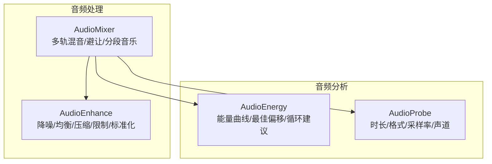
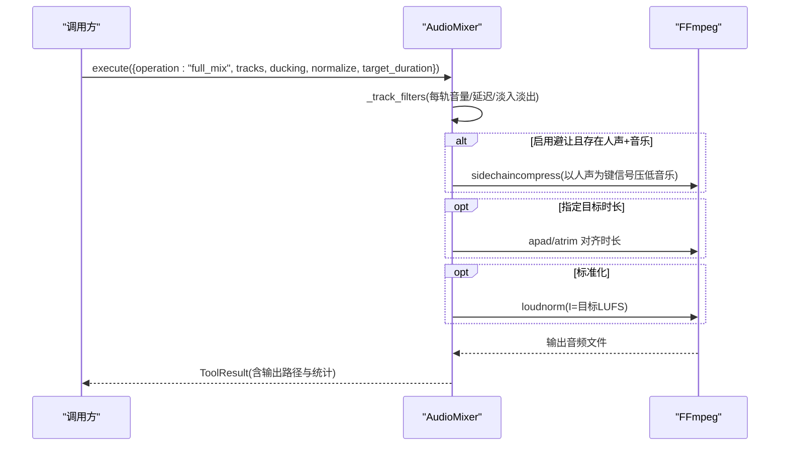
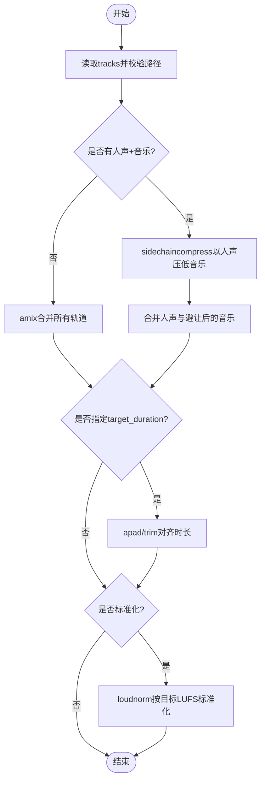
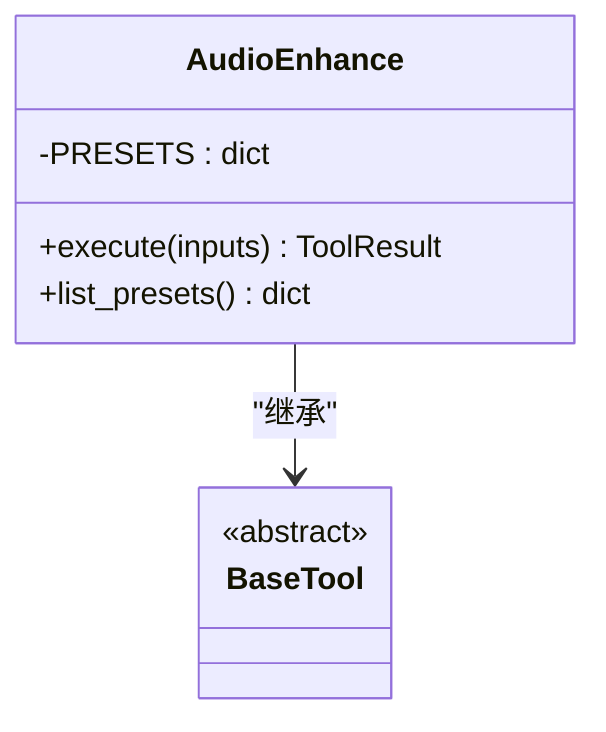
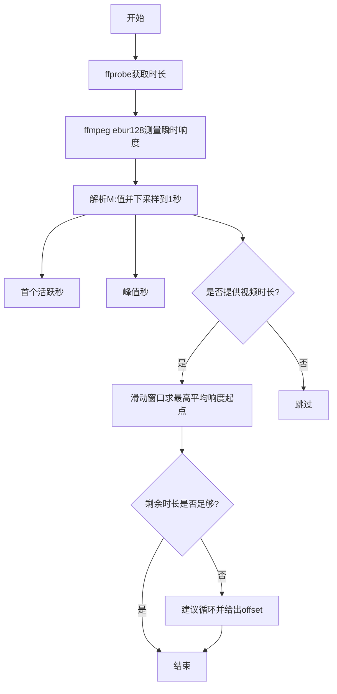
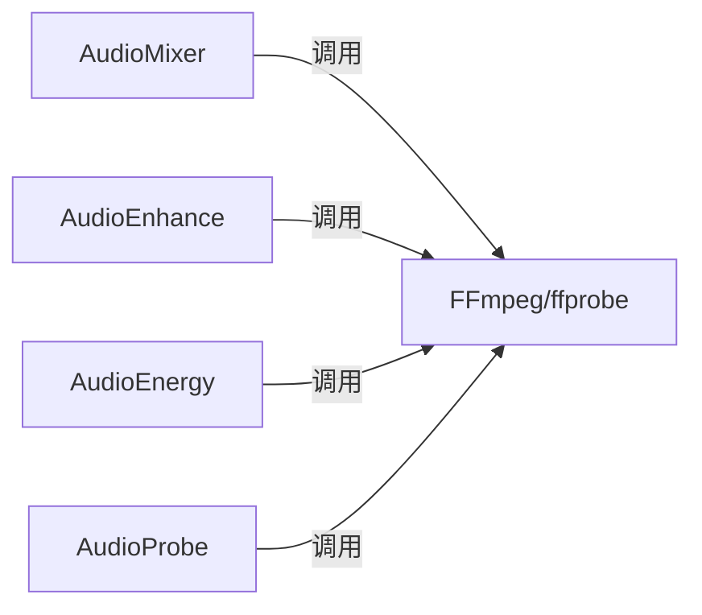

# 音频混音器

<cite>
**本文引用的文件**
- [tools/audio/audio_mixer.py](file://tools/audio/audio_mixer.py)
- [tools/audio/audio_enhance.py](file://tools/audio/audio_enhance.py)
- [tools/analysis/audio_energy.py](file://tools/analysis/audio_energy.py)
- [tools/analysis/audio_probe.py](file://tools/analysis/audio_probe.py)
- [tests/tools/test_audio_mixer_ducking.py](file://tests/tools/test_audio_mixer_ducking.py)
- [tests/tools/test_audio_mixer_target_duration.py](file://tests/tools/test_audio_mixer_target_duration.py)
- [tests/tools/test_audio_mixer_track_fades.py](file://tests/tools/test_audio_mixer_track_fades.py)
- [tests/tools/test_audio_mixer_segmented_music.py](file://tests/tools/test_audio_mixer_segmented_music.py)
- [tests/tools/test_audio_mixer_loudnorm_target.py](file://tests/tools/test_audio_mixer_loudnorm_target.py)
</cite>

## 目录
1. [简介](#简介)
2. [项目结构](#项目结构)
3. [核心组件](#核心组件)
4. [架构总览](#架构总览)
5. [详细组件分析](#详细组件分析)
6. [依赖关系分析](#依赖关系分析)
7. [性能考量](#性能考量)
8. [故障排查指南](#故障排查指南)
9. [结论](#结论)
10. [附录：API参考与使用示例](#附录api参考与使用示例)

## 简介
本技术文档围绕 OpenMontage 的音频混音与增强能力，系统阐述多轨道混音、音量平衡、淡入淡出、音效叠加、侧链压缩（人声避让）、响度标准化与目标响度控制等关键技术。同时覆盖音频增强（降噪、均衡、压缩、限制）与采样率/格式处理，并提供完整的 API 参考与端到端工作流示例，帮助从简单混合到专业级制作的完整落地。

## 项目结构
OpenMontage 将音频处理能力以“工具”形式组织，核心位于 tools/audio 与 tools/analysis：
- 混音与多轨合成：AudioMixer（mix、duck、full_mix、segmented_music、extract）
- 音频增强：AudioEnhance（预设与自定义滤镜链）
- 音频分析与探测：AudioEnergy（能量曲线与最佳偏移）、AudioProbe（时长/码率/声道/采样率等元信息）

图表来源
- [tools/audio/audio_mixer.py:26-43](file://tools/audio/audio_mixer.py#L26-L43)
- [tools/audio/audio_enhance.py:80-120](file://tools/audio/audio_enhance.py#L80-L120)
- [tools/analysis/audio_energy.py:38-90](file://tools/analysis/audio_energy.py#L38-L90)
- [tools/analysis/audio_probe.py:59-98](file://tools/analysis/audio_probe.py#L59-L98)

章节来源
- [tools/audio/audio_mixer.py:26-43](file://tools/audio/audio_mixer.py#L26-L43)
- [tools/audio/audio_enhance.py:80-120](file://tools/audio/audio_enhance.py#L80-L120)
- [tools/analysis/audio_energy.py:38-90](file://tools/analysis/audio_energy.py#L38-L90)
- [tools/analysis/audio_probe.py:59-98](file://tools/analysis/audio_probe.py#L59-L98)

## 核心组件
- AudioMixer：基于 FFmpeg filter_complex 的多轨混音、人声避让（侧链压缩）、分段背景音乐、提取音频、统一标准化与目标响度控制。支持 tracks 数组的高级参数（角色、音量、延迟、淡入淡出）。
- AudioEnhance：提供多种预设滤镜链（清洁人声、降噪、播客、广播标准、语音清晰度），也支持自定义 af 字符串；可处理音视频输入并保留视频流。
- AudioEnergy：通过 ebur128 测量瞬时响度，生成能量曲线，推荐跳过安静前奏的最佳偏移，并在短视频场景给出循环建议。
- AudioProbe：轻量 ffprobe 封装，返回时长、格式、采样率、声道、码率等关键元数据。

章节来源
- [tools/audio/audio_mixer.py:26-43](file://tools/audio/audio_mixer.py#L26-L43)
- [tools/audio/audio_enhance.py:80-120](file://tools/audio/audio_enhance.py#L80-L120)
- [tools/analysis/audio_energy.py:38-90](file://tools/analysis/audio_energy.py#L38-L90)
- [tools/analysis/audio_probe.py:59-98](file://tools/analysis/audio_probe.py#L59-L98)

## 架构总览
下图展示典型“全量混音”流程：多轨输入 → 逐轨滤波（音量/延迟/淡入淡出）→ 可选的人声避让（侧链压缩）→ 可选精确时长对齐 → 响度标准化 → 输出。

图表来源
- [tools/audio/audio_mixer.py:479-667](file://tools/audio/audio_mixer.py#L479-L667)
- [tools/audio/audio_mixer.py:205-255](file://tools/audio/audio_mixer.py#L205-L255)

章节来源
- [tools/audio/audio_mixer.py:479-667](file://tools/audio/audio_mixer.py#L479-L667)
- [tools/audio/audio_mixer.py:205-255](file://tools/audio/audio_mixer.py#L205-L255)

## 详细组件分析

### AudioMixer：多轨混音与人声避让
- 多轨混音（mix/full_mix）
  - 支持 tracks 数组：path、role（speech/music/sfx/primary/secondary）、volume、start_seconds、fade_in_seconds、fade_out_seconds。
  - 每轨先应用音量、淡入淡出、延迟，再进入 amix 合并。
  - full_mix 在单步中完成“人声+音乐+SFX + 避让 + 标准化”，适合导演式编排。
- 人声避让（duck）
  - 使用 sidechaincompress，以人声作为键信号对音乐进行压缩，实现“说话时音乐自动降低”。
  - 支持两种输入格式：simple（primary_audio/secondary_audio）与 advanced（tracks 带 role）。
- 分段背景音乐（segmented_music）
  - 仅在指定时间段内播放背景音乐，边界处平滑淡入淡出；无音乐时段保持人声原电平。
  - 通过 volume 表达式与 aformat 确保采样格式/声道一致，避免默认 amix normalize 导致的人声衰减。
- 标准化与目标响度
  - 内置 loudnorm，I 参数可通过 loudnorm_target 配置，适配不同平台（如播客 -16 LUFS、短视频 -14 LUFS）。
  - 支持 target_duration 精确对齐输出时长（apad/trim 组合）。

图表来源
- [tools/audio/audio_mixer.py:280-338](file://tools/audio/audio_mixer.py#L280-L338)
- [tools/audio/audio_mixer.py:340-445](file://tools/audio/audio_mixer.py#L340-L445)
- [tools/audio/audio_mixer.py:479-667](file://tools/audio/audio_mixer.py#L479-L667)
- [tools/audio/audio_mixer.py:669-776](file://tools/audio/audio_mixer.py#L669-L776)

章节来源
- [tools/audio/audio_mixer.py:280-338](file://tools/audio/audio_mixer.py#L280-L338)
- [tools/audio/audio_mixer.py:340-445](file://tools/audio/audio_mixer.py#L340-L445)
- [tools/audio/audio_mixer.py:479-667](file://tools/audio/audio_mixer.py#L479-L667)
- [tools/audio/audio_mixer.py:669-776](file://tools/audio/audio_mixer.py#L669-L776)

### AudioEnhance：降噪、均衡、压缩、限制与标准化
- 预设链路
  - clean_speech：高通/低通 + 噪声门 + 压缩 + 标准化
  - noise_reduce：强降噪 + 高通 + 标准化
  - podcast：高通 + 压缩 + 标准化
  - broadcast：高通/低通 + 压缩 + 限制 + 广播级标准化
  - voice_clarity：EQ提升人声频段 + 轻压 + 标准化
- 自定义滤镜：支持传入 custom_af 直接拼接任意 FFmpeg 音频滤镜链。
- 输入类型：自动识别音视频；若为视频则直通视频流，仅处理音频。

图表来源
- [tools/audio/audio_enhance.py:25-77](file://tools/audio/audio_enhance.py#L25-L77)
- [tools/audio/audio_enhance.py:80-187](file://tools/audio/audio_enhance.py#L80-L187)

章节来源
- [tools/audio/audio_enhance.py:25-77](file://tools/audio/audio_enhance.py#L25-L77)
- [tools/audio/audio_enhance.py:80-187](file://tools/audio/audio_enhance.py#L80-L187)

### AudioEnergy：能量曲线与最佳偏移
- 通过 ebur128 获取 100ms 粒度瞬时响度，聚合为每秒能量点。
- 计算首个“活跃”秒、峰值秒，并基于视频时长滑动窗口寻找平均响度最高的起始位置。
- 当可用时长不足时，给出循环建议（loop_info）。

图表来源
- [tools/analysis/audio_energy.py:107-304](file://tools/analysis/audio_energy.py#L107-L304)

章节来源
- [tools/analysis/audio_energy.py:107-304](file://tools/analysis/audio_energy.py#L107-L304)

### AudioProbe：媒体元数据探测
- 返回时长、格式、大小、码率、流数量，以及音频流的编解码器、采样率、声道数、布局等。
- 适用于渲染前的资源检查与质量评估。

章节来源
- [tools/analysis/audio_probe.py:31-57](file://tools/analysis/audio_probe.py#L31-L57)
- [tools/analysis/audio_probe.py:111-179](file://tools/analysis/audio_probe.py#L111-L179)

## 依赖关系分析
- 外部依赖
  - FFmpeg/ffprobe：混音、增强、能量分析、探测均依赖其命令行工具。
- 内部依赖
  - 各工具均继承 BaseTool，遵循统一的执行模型、结果结构与幂等键策略。
- 耦合与内聚
  - AudioMixer 与 AudioEnhance 解耦：前者负责多轨编排与响度控制，后者专注单轨增强。
  - AudioEnergy/AudioProbe 为纯分析工具，不产生副作用，便于前置决策。

图表来源
- [tools/audio/audio_mixer.py:26-43](file://tools/audio/audio_mixer.py#L26-L43)
- [tools/audio/audio_enhance.py:80-92](file://tools/audio/audio_enhance.py#L80-L92)
- [tools/analysis/audio_energy.py:49-55](file://tools/analysis/audio_energy.py#L49-L55)
- [tools/analysis/audio_probe.py:70-76](file://tools/analysis/audio_probe.py#L70-L76)

章节来源
- [tools/audio/audio_mixer.py:26-43](file://tools/audio/audio_mixer.py#L26-L43)
- [tools/audio/audio_enhance.py:80-92](file://tools/audio/audio_enhance.py#L80-L92)
- [tools/analysis/audio_energy.py:49-55](file://tools/analysis/audio_energy.py#L49-L55)
- [tools/analysis/audio_probe.py:70-76](file://tools/analysis/audio_probe.py#L70-L76)

## 性能考量
- 批处理与并行
  - 多轨混音尽量使用 single-pass filter_complex，减少多次转码开销（full_mix 已实现）。
  - 批量任务可并发执行多个独立工具实例（注意磁盘IO与CPU占用）。
- 内存与缓冲
  - 大文件处理建议使用管道或临时目录，避免一次性加载全部样本到内存。
  - 合理设置 amix dropout_transition 与 af 链长度，减少不必要的重采样与转换。
- 采样率与格式
  - 统一 aformat 至 fltp/44100/stereo 可减少后续混音时的隐式转换成本。
  - 输出编码选择 AAC 192k 兼顾体积与音质；无损需求可使用 PCM。
- 标准化成本
  - loudnorm 两遍模式较耗时，必要时可关闭或仅在最终输出阶段启用。
- 缓存与幂等
  - 利用 idempotency_key_fields 避免重复计算（如 mix/duck/full_mix 的输入指纹）。

[本节为通用指导，不直接分析具体文件]

## 故障排查指南
- 未找到 ffmpeg/ffprobe
  - 现象：执行失败或返回不可用状态。
  - 解决：安装 FFmpeg 并确保 PATH 可访问。
- 输入文件不存在
  - 现象：立即返回错误。
  - 解决：校验路径与权限。
- 目标时长非法
  - 现象：full_mix 拒绝非正数或非数字。
  - 解决：传入合法数值。
- 人声被意外衰减（分段音乐）
  - 现象：无音乐段的人声音量偏低。
  - 原因：amix 默认 normalize=1 会平分输入电平。
  - 解决：确保 segment 路径使用 normalize=0（已在实现中修复）。
- 淡入淡出与延迟顺序问题
  - 现象：延迟后淡入淡出作用于静音而非源音频。
  - 解决：先对源应用 afade，再添加 adelay（已在实现中修正）。
- 响度目标不生效
  - 现象：输出响度不符合平台预期。
  - 解决：显式设置 loudnorm_target（例如 -14 用于短视频平台）。

章节来源
- [tests/tools/test_audio_mixer_segmented_music.py:1-120](file://tests/tools/test_audio_mixer_segmented_music.py#L1-L120)
- [tests/tools/test_audio_mixer_track_fades.py:1-96](file://tests/tools/test_audio_mixer_track_fades.py#L1-L96)
- [tests/tools/test_audio_mixer_target_duration.py:1-95](file://tests/tools/test_audio_mixer_target_duration.py#L1-L95)
- [tests/tools/test_audio_mixer_loudnorm_target.py:1-50](file://tests/tools/test_audio_mixer_loudnorm_target.py#L1-L50)

## 结论
OpenMontage 的音频子系统以 FFmpeg 为核心，提供了从单轨增强到多轨混音、从响度标准化到平台化响度目标的完整能力。通过清晰的 API 设计、严格的输入校验与回归测试保障，既满足快速集成，又支撑专业级制作流程。结合能量分析与元数据探测，可在自动化管线中实现智能素材选择与质量控制。

[本节为总结性内容，不直接分析具体文件]

## 附录：API参考与使用示例

### AudioMixer API
- operation
  - mix：多轨混音，支持 per-track 音量/延迟/淡入淡出
  - duck：人声避让（simple 或 advanced tracks）
  - extract：从视频中提取音频（16kHz 单声道 PCM）
  - full_mix：一键混音（人声+音乐+SFX + 避让 + 标准化）
  - segmented_music：在视频指定时间段内插入背景音乐
- 关键参数
  - tracks：[{path, role, volume, start_seconds, fade_in_seconds, fade_out_seconds}]
  - primary_audio / secondary_audio：duck 的简易输入
  - ducking：{enabled, music_volume_during_speech, attack_ms, release_ms}
  - normalize：是否标准化
  - loudnorm_target：目标 LUFS（默认 -16）
  - video_path / music_path / segments / music_volume / fade_duration：segmented_music
  - target_duration：精确输出时长（full_mix）

章节来源
- [tools/audio/audio_mixer.py:45-196](file://tools/audio/audio_mixer.py#L45-L196)
- [tools/audio/audio_mixer.py:257-278](file://tools/audio/audio_mixer.py#L257-L278)

### AudioEnhance API
- preset：clean_speech / noise_reduce / normalize_only / podcast / broadcast / voice_clarity
- custom_af：自定义 FFmpeg 音频滤镜链
- audio_codec / audio_bitrate：输出编码与码率
- 输入：支持音视频；视频流直通

章节来源
- [tools/audio/audio_enhance.py:25-77](file://tools/audio/audio_enhance.py#L25-L77)
- [tools/audio/audio_enhance.py:102-120](file://tools/audio/audio_enhance.py#L102-L120)
- [tools/audio/audio_enhance.py:130-181](file://tools/audio/audio_enhance.py#L130-L181)

### AudioEnergy API
- input_path：音频文件
- video_duration_seconds：视频时长（用于窗口搜索与循环建议）
- energy_threshold_lufs：判定“活跃”的阈值（默认 -40）
- 输出：能量曲线、推荐偏移、峰值、循环建议等

章节来源
- [tools/analysis/audio_energy.py:69-90](file://tools/analysis/audio_energy.py#L69-L90)
- [tools/analysis/audio_energy.py:107-304](file://tools/analysis/audio_energy.py#L107-L304)

### AudioProbe API
- input_path：媒体文件
- 输出：时长、格式、大小、码率、流数量、音频流信息（编解码器、采样率、声道、布局）

章节来源
- [tools/analysis/audio_probe.py:85-98](file://tools/analysis/audio_probe.py#L85-L98)
- [tools/analysis/audio_probe.py:111-179](file://tools/analysis/audio_probe.py#L111-L179)

### 使用示例（端到端工作流）
- 简单混合
  - 步骤：准备 speech/music/sfx 三轨 → 调用 full_mix → 设置 normalize=true 与 loudnorm_target=-16 → 输出 WAV
  - 适用：播客/有声书
- 短视频配音+背景乐
  - 步骤：生成 speech → 选择音乐片段（可用 AudioEnergy 找最佳偏移）→ full_mix 设置 loudnorm_target=-14 → 输出 MP4/AAC
- 分段背景音乐
  - 步骤：已有视频 → 定义 segments（如开场/高潮/结尾）→ segmented_music 设置 music_volume 与 fade_duration → 输出 MP4
- 专业级后期
  - 步骤：AudioEnhance（broadcast/podcast 预设）→ AudioMixer full_mix（避让+标准化）→ 可选二次 loudnorm 微调

[本节为概念性示例，不直接分析具体文件]