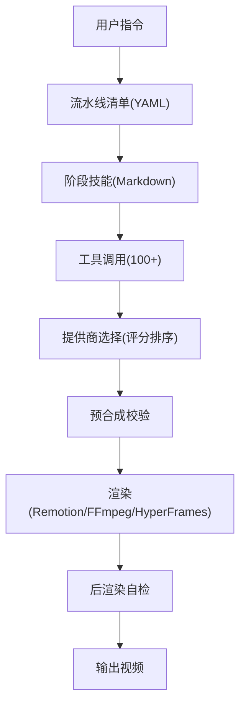
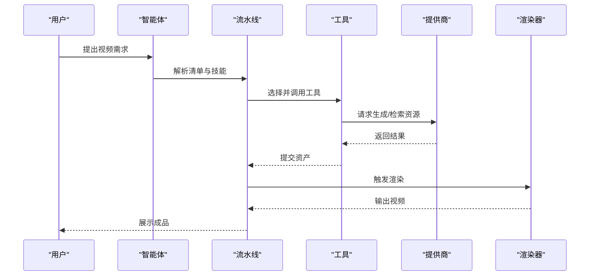
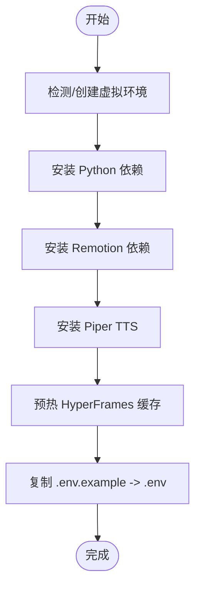
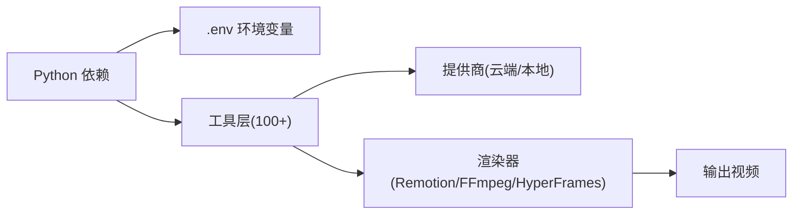

# 快速开始指南

<cite>
**本文引用的文件**
- [README.md](file://README.md)
- [README_zh-CN.md](file://README_zh-CN.md)
- [Makefile](file://Makefile)
- [.env.example](file://.env.example)
- [requirements.txt](file://requirements.txt)
- [config.yaml](file://config.yaml)
- [render_demo.py](file://render_demo.py)
</cite>

## 目录
1. [简介](#简介)
2. [项目结构](#项目结构)
3. [核心组件](#核心组件)
4. [架构总览](#架构总览)
5. [详细组件分析](#详细组件分析)
6. [依赖关系分析](#依赖关系分析)
7. [性能注意事项](#性能注意事项)
8. [故障排查指南](#故障排查指南)
9. [结论](#结论)
10. [附录](#附录)

## 简介
本指南面向首次接触 OpenMontage 的用户，目标是在 30 分钟内完成环境准备、安装配置，并成功运行第一个视频制作任务。内容涵盖：
- 环境要求（Python 3.10+、FFmpeg、Node.js 18+）
- 一键安装与手动安装（macOS/Linux 与 Windows）
- API 密钥配置（图像生成、视频生成、语音合成等）
- 零 API 密钥下的基础使用示例
- 提示词示例与快速体验路径

OpenMontage 是一个“代理化”的视频生产系统，既支持基于图像的动画视频，也支持从免费/开源素材库构建真实动态影像的纪录片蒙太奇工作流。即使不配置任何付费 API 密钥，也能通过内置能力产出成品视频。

**章节来源**
- [README.md:180-216](file://README.md#L180-L216)
- [README_zh-CN.md:113-149](file://README_zh-CN.md#L113-L149)

## 项目结构
OpenMontage 采用“工具 + 流水线 + 技能”的分层组织方式：
- tools：生产工具集合（视频、音频、图像、增强、分析、字幕等）
- pipeline_defs：YAML 流水线清单（编排流程）
- skills：Markdown 技能文件（指导智能体如何执行各阶段）
- remotion-composer：React/Remotion 渲染引擎
- lib：核心基础设施（配置、检查点、流水线加载器）
- backlot：本地可视化看板（实时查看生产进度）

**图表来源**
- [README.md:450-475](file://README.md#L450-L475)

**章节来源**
- [README.md:450-475](file://README.md#L450-L475)

## 核心组件
- 环境管理：通过 Makefile 提供一键 setup、GPU 安装、演示渲染等命令
- 运行时：Remotion（React 渲染）、HyperFrames（HTML/GSAP 渲染）、FFmpeg（编码/混音/字幕）
- 供应商集成：统一入口，按 7 维度评分自动选择最佳提供商
- 质量关卡：预合成校验、后渲染自检、预算控制、决策审计

**章节来源**
- [Makefile:52-77](file://Makefile#L52-L77)
- [README.md:652-686](file://README.md#L652-L686)

## 架构总览
OpenMontage 以“智能体优先”的架构驱动生产流程：
- 智能体读取 YAML 清单与 Markdown 技能，决定工具链
- 工具调用后端提供商（云端或本地），由评分器选择最优
- 每个阶段可保存检查点，支持恢复与审计
- 渲染前后均有严格的质量门禁

**图表来源**
- [README.md:408-444](file://README.md#L408-L444)

## 详细组件分析

### 环境要求与前置条件
- Python 3.10+
- FFmpeg（用于编码、字幕烧录、音频混合）
- Node.js 18+（用于 Remotion 渲染）
- AI 编程助手（Claude Code、Cursor、Copilot、Windsurf、Codex 等）

说明：
- 若未安装 make，可使用 Python venv + pip + npm 的手动步骤
- Windows 下如遇到 npm install 报错，可使用 npx --yes npm install 替代

**章节来源**
- [README.md:180-216](file://README.md#L180-L216)
- [README_zh-CN.md:113-149](file://README_zh-CN.md#L113-L149)

### 安装步骤（一键安装）
在终端中执行以下命令：
- git clone 仓库
- cd 进入项目目录
- make setup

该命令会：
- 创建/检测虚拟环境
- 安装 Python 依赖
- 安装 Remotion composer
- 安装 Piper TTS（离线语音）
- 预热 HyperFrames npx 缓存
- 复制 .env.example 为 .env（供填写 API 密钥）

**图表来源**
- [Makefile:52-77](file://Makefile#L52-L77)

**章节来源**
- [Makefile:52-77](file://Makefile#L52-L77)

### 手动安装（备选方案）
如果没有 make，可按平台执行以下步骤：
- macOS/Linux：
  - 创建并激活虚拟环境
  - 安装 requirements.txt
  - 进入 remotion-composer 执行 npm install
  - 安装 piper-tts
  - 复制 .env.example 为 .env
- Windows PowerShell：
  - 创建并激活虚拟环境
  - 安装 requirements.txt
  - 进入 remotion-composer 执行 npm install（如遇 ERR_INVALID_ARG_TYPE，改用 npx --yes npm install）
  - 安装 piper-tts
  - 复制 .env.example 为 .env

**章节来源**
- [README.md:211-216](file://README.md#L211-L216)
- [README_zh-CN.md:144-149](file://README_zh-CN.md#L144-L149)

### 配置 API 密钥（可选但推荐）
将 .env.example 复制为 .env，按需填入密钥。常见类别：
- 图像 + 视频网关：FAL_KEY、ATLASCLOUD_API_KEY
- 官方直连：KLING_API_KEY、ARK_API_KEY、HEYGEN_API_KEY、RUNWAY_API_KEY
- 免费素材库：PEXELS_API_KEY、PIXABAY_API_KEY、UNSPLASH_ACCESS_KEY
- 音乐：SUNO_API_KEY
- 语音与图像：ELEVENLABS_API_KEY、OPENAI_API_KEY、XAI_API_KEY、GOOGLE_API_KEY
- 本地视频生成：VIDEO_GEN_LOCAL_ENABLED、VIDEO_GEN_LOCAL_MODEL（需 GPU）

提示：
- 所有密钥均为可选；未配置时系统会使用免费/本地能力
- 有 GPU 时可启用本地视频生成以获得更多免费能力

**章节来源**
- [README.md:234-278](file://README.md#L234-L278)
- [.env.example:1-135](file://.env.example#L1-L135)

### 零 API 密钥基础使用
无需付费密钥即可体验完整流程：
- 旁白：Piper TTS（离线免费）
- 素材：Archive.org、NASA、Wikimedia Commons，以及可选的免费图库（Pexels、Unsplash、Pixabay）
- 合成：Remotion（React 动画场景、数据卡片、字幕等）或 HyperFrames（HTML/GSAP 动态排版）
- 后期：FFmpeg（编码、字幕烧录、音频混合）
- 字幕：内置自动生成（词级时间轴）

操作建议：
- 直接让 AI 编程助手执行流水线，或使用 make demo 渲染零密钥演示视频
- 提示词中明确要求“只使用真实素材”，可走纪录片蒙太奇路径

**章节来源**
- [README.md:282-305](file://README.md#L282-L305)
- [README_zh-CN.md:210-233](file://README_zh-CN.md#L210-L233)

### 提示词示例（快速体验）
以下为可直接复制到 AI 编程助手的示例：
- 从零开始：
  - “制作一个 45 秒的动画解说视频，解释为什么天空是蓝色的”
  - “创建一个 60 秒关于互联网历史的视频，包含旁白和字幕”
  - “制作一个关于全球咖啡消费情况的数据驱动型解说视频”
- 免费真实素材纪录片路径：
  - “制作一部 90 秒的纪录片蒙太奇，展现凌晨 4 点城市的感觉。只使用真实素材，无旁白，挽歌般的基调。”
  - “用纯真实素材剪辑一个关于雨中归家的梦幻般蒙太奇。需要音乐，不需要旁白。”
- 参考视频起步：
  - “这是一个我非常喜欢的 YouTube 短片。请给我制作一个类似的，但主题是面向高中生的 CRISPR 基因编辑技术。”

**章节来源**
- [README.md:308-352](file://README.md#L308-L352)
- [README_zh-CN.md:236-280](file://README_zh-CN.md#L236-L280)

### 使用 make 系列命令
- make setup：一键安装与初始化
- make install-gpu：安装 GPU 相关依赖（需 NVIDIA GPU）
- make demo：渲染零密钥演示视频（Remotion）
- make hyperframes-doctor：验证 HyperFrames 运行时
- make hyperframes-warm：刷新 HyperFrames npx 缓存

**章节来源**
- [Makefile:52-120](file://Makefile#L52-L120)

## 依赖关系分析
OpenMontage 的核心依赖包括：
- Python 包：pyyaml、pydantic、jsonschema、python-dotenv、Pillow、numpy、requests、google-auth、google-genai、openai
- 运行时：Node.js（Remotion）、FFmpeg（编码/混音/字幕）
- 可选：piper-tts（离线 TTS）、HyperFrames（npx 缓存）

**图表来源**
- [requirements.txt:1-17](file://requirements.txt#L1-L17)
- [Makefile:52-77](file://Makefile#L52-L77)

**章节来源**
- [requirements.txt:1-17](file://requirements.txt#L1-L17)
- [Makefile:52-77](file://Makefile#L52-L77)

## 性能注意事项
- 首次渲染可能较慢（npm 包拉取、模型下载等），可通过 make hyperframes-warm 预热缓存
- 启用本地视频生成需 GPU，且需正确配置 VIDEO_GEN_LOCAL_ENABLED 与 VIDEO_GEN_LOCAL_MODEL
- 合理使用预算控制（config.yaml 中的 budget 设置），避免意外开销
- 使用高质量提供商时注意延迟与成本权衡

**章节来源**
- [Makefile:64-68](file://Makefile#L64-L68)
- [config.yaml:9-14](file://config.yaml#L9-L14)

## 故障排查指南
常见问题与处理：
- Node.js/npm/npx 未找到：确保已安装 Node.js 并将命令行加入 PATH
- npm install 报错（Windows）：改用 npx --yes npm install
- 缺少 FFmpeg：安装 FFmpeg 并确保可被系统识别
- 虚拟环境问题：确认 Python 版本 >= 3.10，重新创建并激活虚拟环境
- 渲染失败：检查 .env 是否配置了必要的密钥，或尝试零密钥演示路径

调试命令：
- make preflight：查看可用提供商菜单
- make hyperframes-doctor：诊断 HyperFrames 运行时
- render_demo.py --list：列出可用的零密钥演示

**章节来源**
- [Makefile:100-120](file://Makefile#L100-L120)
- [render_demo.py:49-65](file://render_demo.py#L49-L65)

## 结论
通过本指南，你可以在 30 分钟内完成 OpenMontage 的安装与基础使用。即使不配置任何 API 密钥，也能利用内置免费能力制作出完整的视频。随着逐步添加密钥，你将解锁更多高质量图像/视频生成、语音合成与音乐创作能力。建议在初次体验后，根据需求选择性接入第三方服务，并结合提示词与流水线获得更丰富的创作效果。

## 附录
- 配置文件说明：config.yaml 定义了 LLM、预算、检查点策略、输出格式与路径等全局参数
- 演示脚本：render_demo.py 提供零密钥 Remotion 演示视频的渲染入口

**章节来源**
- [config.yaml:1-34](file://config.yaml#L1-L34)
- [render_demo.py:1-145](file://render_demo.py#L1-L145)