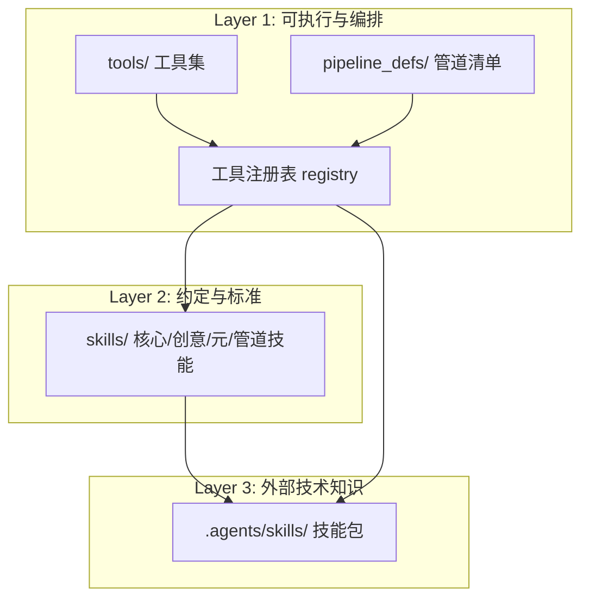
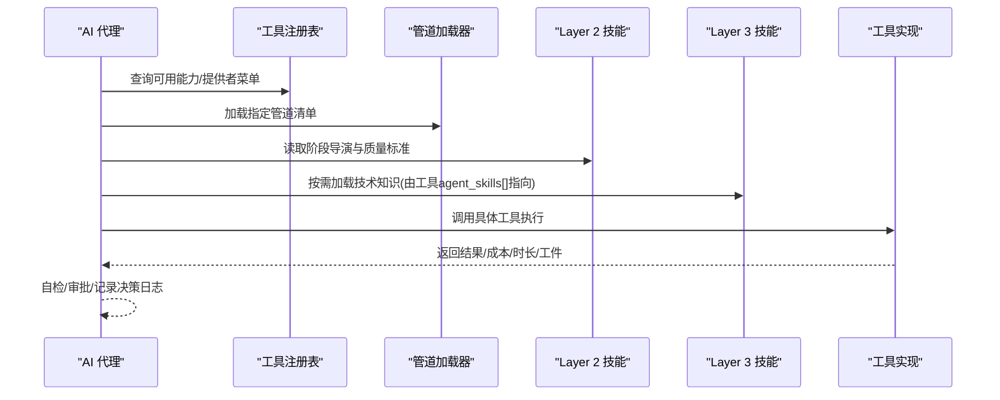
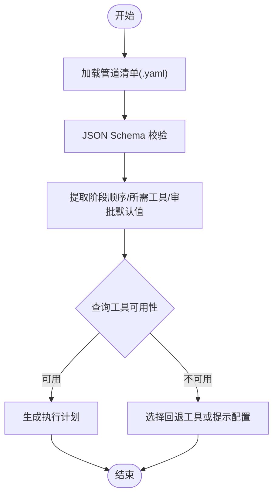
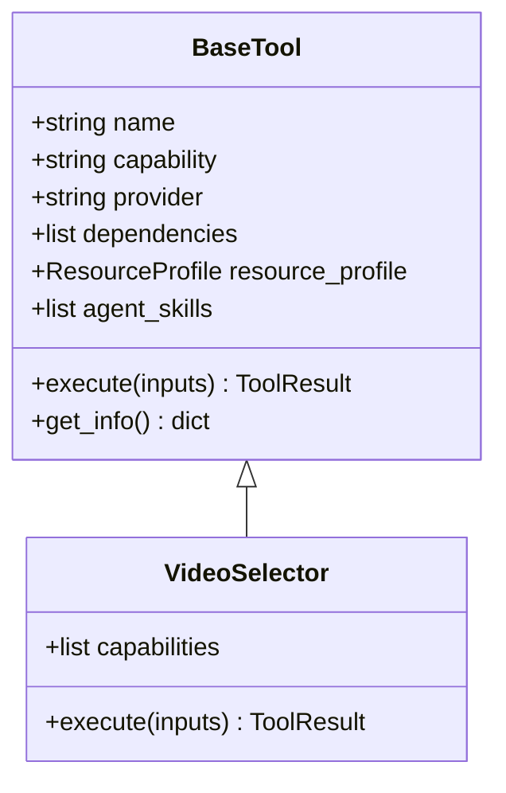
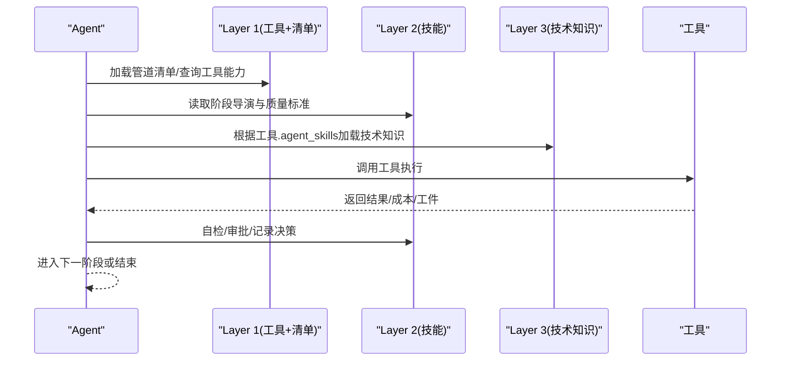
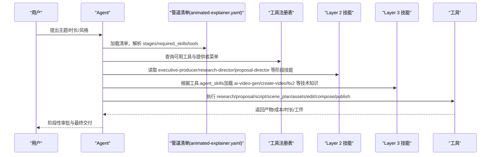

# 三层知识架构

<cite>
**本文引用的文件**
- [README.md](file://README.md)
- [tools/base_tool.py](file://tools/base_tool.py)
- [tools/tool_registry.py](file://tools/tool_registry.py)
- [lib/pipeline_loader.py](file://lib/pipeline_loader.py)
- [pipeline_defs/animated-explainer.yaml](file://pipeline_defs/animated-explainer.yaml)
- [pipeline_defs/cinematic.yaml](file://pipeline_defs/cinematic.yaml)
- [skills/INDEX.md](file://skills/INDEX.md)
- [skills/core/ffmpeg.md](file://skills/core/ffmpeg.md)
- [.agents/skills/ffmpeg/SKILL.md](file://.agents/skills/ffmpeg/SKILL.md)
- [tests/contracts/test_agent_skill_pointers.py](file://tests/contracts/test_agent_skill_pointers.py)
</cite>

## 目录
1. [简介](#简介)
2. [项目结构](#项目结构)
3. [核心组件](#核心组件)
4. [架构总览](#架构总览)
5. [详细组件分析](#详细组件分析)
6. [依赖关系分析](#依赖关系分析)
7. [性能与治理考量](#性能与治理考量)
8. [故障排查指南](#故障排查指南)
9. [结论](#结论)
10. [附录：示例协作流程](#附录示例协作流程)

## 简介
本文件系统化阐述 OpenMontage 的“三层知识架构”，聚焦以下目标：
- Layer 1（tools/ + pipeline_defs/）：可执行能力与编排定义，包括工具注册表机制与管道清单系统。
- Layer 2（skills/）：OpenMontage 约定与质量标准，涵盖核心技能、创意技能与元技能的作用。
- Layer 3（.agents/skills/）：外部技术知识库，说明如何为 AI 代理提供深度技术知识。
- 三层之间的依赖关系与数据流向，以及工具如何声明对 Layer 3 技能的依赖。
- 通过具体代码路径与流程图展示各层如何协作工作。

## 项目结构
OpenMontage 将“能力”“编排”“知识”分层解耦：
- Layer 1：tools/ 提供可执行工具；pipeline_defs/ 提供 YAML 编排清单。
- Layer 2：skills/ 提供生产规范、质量门槛与阶段导演技能。
- Layer 3：.agents/skills/ 提供通用 API/框架知识包，按需在运行时加载。



图表来源
- [tools/tool_registry.py:55-134](file://tools/tool_registry.py#L55-L134)
- [lib/pipeline_loader.py:49-70](file://lib/pipeline_loader.py#L49-L70)
- [skills/INDEX.md:7-31](file://skills/INDEX.md#L7-L31)

章节来源
- [README.md:450-486](file://README.md#L450-L486)
- [skills/INDEX.md:7-31](file://skills/INDEX.md#L7-L31)

## 核心组件
- BaseTool：所有工具的抽象基类，统一声明能力、依赖、资源画像、成本估算、状态检查、执行接口等。
- ToolRegistry：自动发现并注册 tools/ 下的工具，提供能力目录、提供者菜单、支持信封报告等查询接口。
- Pipeline Loader：加载并校验 pipeline_defs/*.yaml，暴露阶段顺序、所需工具、人类审批默认值等。
- Skills 索引：集中描述三层架构与技能分类，明确 agent_skills 指针到 .agents/skills/ 的映射。

章节来源
- [tools/base_tool.py:227-372](file://tools/base_tool.py#L227-L372)
- [tools/tool_registry.py:55-134](file://tools/tool_registry.py#L55-L134)
- [lib/pipeline_loader.py:49-70](file://lib/pipeline_loader.py#L49-L70)
- [skills/INDEX.md:7-31](file://skills/INDEX.md#L7-L31)

## 架构总览
OpenMontage 以“Agent 驱动”的方式组织生产：
- Agent 读取 Layer 1 的能力与编排（registry + manifests）。
- 依据 Layer 2 的约定与质量标准选择工具与步骤。
- 按需加载 Layer 3 的技术知识，指导提示词与参数选择。
- 在关键节点进行人类审批与质量门禁，最终产出视频。



图表来源
- [tools/tool_registry.py:198-314](file://tools/tool_registry.py#L198-L314)
- [lib/pipeline_loader.py:49-70](file://lib/pipeline_loader.py#L49-L70)
- [skills/INDEX.md:27-31](file://skills/INDEX.md#L27-L31)
- [tools/base_tool.py:277-281](file://tools/base_tool.py#L277-L281)

## 详细组件分析

### Layer 1：工具注册表与管道清单
- 工具注册表
  - 自动发现 tools/ 下所有继承自 BaseTool 的具体类，构建能力目录与提供者菜单。
  - 提供 support_envelope()、provider_menu()、capability_catalog() 等接口，供 Agent 预检与路由。
  - 支持 fallback_tools、dependencies、resource_profile 等声明，便于降级与资源评估。
- 管道清单
  - YAML 清单定义 stages、required_skills、tools_available、human_approval_default、review_focus、success_criteria 等。
  - 支持子阶段、条件激活、扩展开关（custom_scripts/playbooks/skills/tools）。
  - 通过 get_stage_order/get_required_tools/get_stage_skill 等函数暴露给上层编排。



图表来源
- [lib/pipeline_loader.py:49-70](file://lib/pipeline_loader.py#L49-L70)
- [lib/pipeline_loader.py:125-162](file://lib/pipeline_loader.py#L125-L162)
- [tools/tool_registry.py:198-314](file://tools/tool_registry.py#L198-L314)

章节来源
- [tools/tool_registry.py:55-134](file://tools/tool_registry.py#L55-L134)
- [lib/pipeline_loader.py:49-70](file://lib/pipeline_loader.py#L49-L70)
- [pipeline_defs/animated-explainer.yaml:61-270](file://pipeline_defs/animated-explainer.yaml#L61-L270)
- [pipeline_defs/cinematic.yaml:60-288](file://pipeline_defs/cinematic.yaml#L60-L288)

### Layer 2：OpenMontage 约定与质量标准
- 核心技能（core）：如 FFmpeg、Remotion、HyperFrames、WhisperX、字幕同步、色彩分级等，规定处理链顺序、平台目标、质量检查点。
- 创意技能（creative）：如视频剪辑、增强策略、数据可视化、视频拼接、提示词范式、声音设计、排版等，指导创作过程与风格一致性。
- 元技能（meta）：如评审协议、检查点协议、技能创建器、动画运行时选择器、品味方向等，贯穿全管道的治理与质量控制。
- 管道类型技能（pipelines/*）：针对特定视频格式的生产指导，独立于具体管道实现。

章节来源
- [skills/INDEX.md:83-143](file://skills/INDEX.md#L83-L143)
- [skills/core/ffmpeg.md:1-92](file://skills/core/ffmpeg.md#L1-L92)

### Layer 3：外部技术知识库
- 位置：.agents/skills/，每个技能包包含 SKILL.md（及可选 references/scripts/assets）。
- 作用：提供通用 API/框架知识（如 ffmpeg、remotion、hyperframes、ai-video-gen、kling-official 等），用于指导提示词构造、参数选择、错误处理与最佳实践。
- 绑定方式：工具通过 agent_skills[] 字段声明其依赖的 Layer 3 技能名称，Agent 在执行前按需加载对应技能。



图表来源
- [tools/base_tool.py:227-372](file://tools/base_tool.py#L227-L372)
- [tools/video/video_selector.py:15-24](file://tools/video/video_selector.py#L15-L24)

章节来源
- [skills/INDEX.md:7-31](file://skills/INDEX.md#L7-L31)
- [.agents/skills/ffmpeg/SKILL.md:1-433](file://.agents/skills/ffmpeg/SKILL.md#L1-L433)
- [tests/contracts/test_agent_skill_pointers.py:1-70](file://tests/contracts/test_agent_skill_pointers.py#L1-L70)

### 三层协作与数据流
- 数据流起点：Agent 根据需求选择管道（如 animated-explainer 或 cinematic），加载清单并解析阶段顺序与所需工具。
- 工具发现：通过 registry.discover() 扫描 tools/，收集能力目录与提供者菜单，结合依赖与环境变量判断可用性。
- 技能加载：工具声明 agent_skills[]，Agent 在执行前加载对应 Layer 3 技能，获取 API/框架细节。
- 执行与质检：工具执行后返回结果与成本/时长，Agent 依据 Layer 2 的质量标准进行自检与人类审批。
- 输出与归档：通过后进入渲染/导出阶段，并记录决策日志与审计轨迹。



图表来源
- [tools/tool_registry.py:198-314](file://tools/tool_registry.py#L198-L314)
- [lib/pipeline_loader.py:49-70](file://lib/pipeline_loader.py#L49-L70)
- [skills/INDEX.md:27-31](file://skills/INDEX.md#L27-L31)

## 依赖关系分析
- 工具对 Layer 3 的依赖通过 agent_skills[] 声明，测试用例确保这些指针都能解析到 .agents/skills/<skill>/SKILL.md。
- 管道清单通过 required_skills 声明所需的 Layer 2 技能，并通过 stages.tools_available 限定可用工具集合。
- 工具间的依赖通过 dependencies、fallback/fallback_tools、resource_profile 表达，注册表据此提供降级与资源评估。

```mermaid
graph LR
Tool["工具(BaseTool)"] --> |agent_skills[]| Skill3[".agents/skills/"]
Manifest["管道清单(YAML)"] --> |required_skills| Skill2["skills/"]
Manifest --> |stages.tools_available| Tool
Tool --> |dependencies/fallback| Tool
```

图表来源
- [tools/base_tool.py:246-281](file://tools/base_tool.py#L246-L281)
- [pipeline_defs/animated-explainer.yaml:29-43](file://pipeline_defs/animated-explainer.yaml#L29-L43)
- [tests/contracts/test_agent_skill_pointers.py:42-70](file://tests/contracts/test_agent_skill_pointers.py#L42-L70)

章节来源
- [tools/base_tool.py:246-281](file://tools/base_tool.py#L246-L281)
- [pipeline_defs/animated-explainer.yaml:29-43](file://pipeline_defs/animated-explainer.yaml#L29-L43)
- [tests/contracts/test_agent_skill_pointers.py:1-70](file://tests/contracts/test_agent_skill_pointers.py#L1-L70)

## 性能与治理考量
- 性能
  - 工具执行被装饰器包裹，向 Backlot 事件流发射 start/finish/error，便于看板实时追踪与成本汇总。
  - 管道清单加载使用缓存（lru_cache），避免重复解析与校验。
  - 注册表提供 GPU/网络需求工具列表，便于环境预检与资源规划。
- 治理
  - 管道清单中的 human_approval_default 与 review_focus 强制人类审批与质量关注点。
  - 渲染运行时（render_runtime）在提案阶段锁定，禁止静默切换，违反即视为严重治理违规。
  - 决策日志记录替代方案、评分与理由，形成可审计轨迹。

章节来源
- [tools/base_tool.py:148-224](file://tools/base_tool.py#L148-L224)
- [lib/pipeline_loader.py:27-46](file://lib/pipeline_loader.py#L27-L46)
- [tools/tool_registry.py:476-488](file://tools/tool_registry.py#L476-L488)
- [pipeline_defs/cinematic.yaml:229-266](file://pipeline_defs/cinematic.yaml#L229-L266)

## 故障排查指南
- 工具不可用
  - 检查 dependencies（env/cmd/binary/python）是否满足，查看 get_status() 与 provider_menu_summary() 提供的 setup_offers。
- 技能指针失效
  - 若工具声明的 agent_skills[] 无法解析到 .agents/skills/<skill>/SKILL.md，测试会失败；需修正技能名或安装对应技能包。
- 管道阶段失败
  - 核对 manifest 中 stages.review_focus 与 success_criteria，确认产物是否符合 schema 与质量要求。
- 渲染运行时不一致
  - 确保 edit_decisions 中的 render_runtime 与 proposal_packet 一致，避免静默切换导致治理违规。

章节来源
- [tools/tool_registry.py:198-314](file://tools/tool_registry.py#L198-L314)
- [tests/contracts/test_agent_skill_pointers.py:42-70](file://tests/contracts/test_agent_skill_pointers.py#L42-L70)
- [pipeline_defs/animated-explainer.yaml:198-249](file://pipeline_defs/animated-explainer.yaml#L198-L249)

## 结论
OpenMontage 的三层知识架构通过“能力—约定—知识”的清晰分层，实现了：
- 可扩展的工具生态（Layer 1）
- 稳定的生产规范与质量门槛（Layer 2）
- 丰富的外部技术知识注入（Layer 3）
三者协同，使 AI 代理能够像专业制作团队一样，从研究、提案、脚本、分镜、资产、剪辑到合成与发布，全流程可控、可审、可复现。

## 附录：示例协作流程
下面以“动画解说（animated-explainer）”为例，展示三层如何协作：



图表来源
- [pipeline_defs/animated-explainer.yaml:61-270](file://pipeline_defs/animated-explainer.yaml#L61-L270)
- [tools/tool_registry.py:198-314](file://tools/tool_registry.py#L198-L314)
- [skills/INDEX.md:148-162](file://skills/INDEX.md#L148-L162)

章节来源
- [pipeline_defs/animated-explainer.yaml:61-270](file://pipeline_defs/animated-explainer.yaml#L61-L270)
- [tools/tool_registry.py:198-314](file://tools/tool_registry.py#L198-L314)
- [skills/INDEX.md:148-162](file://skills/INDEX.md#L148-L162)