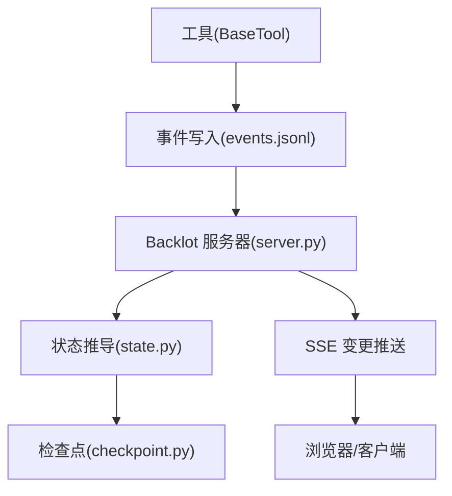
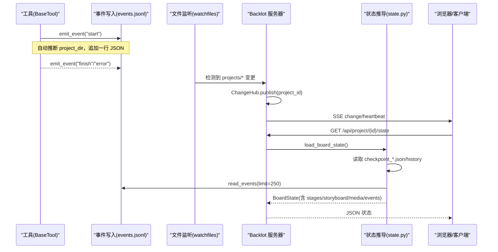
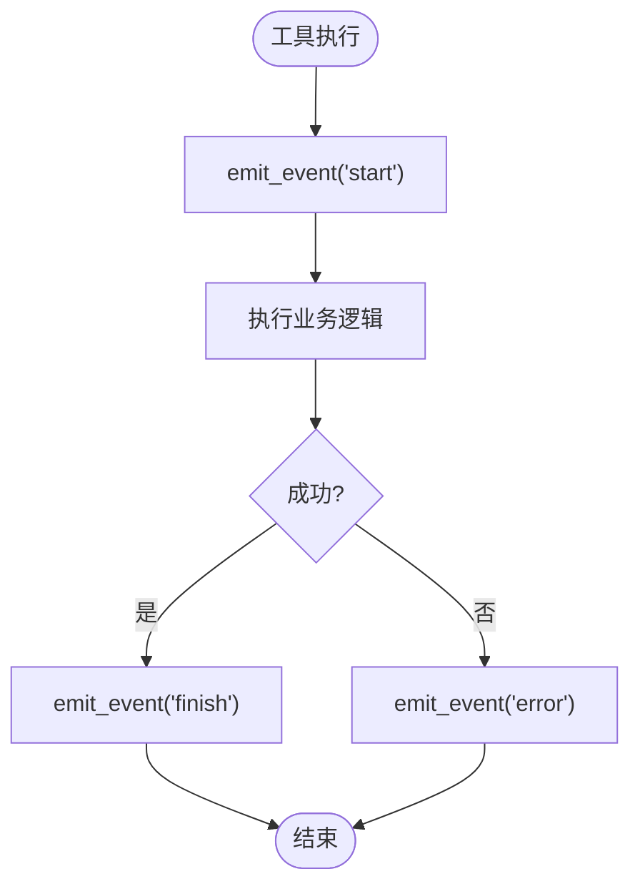
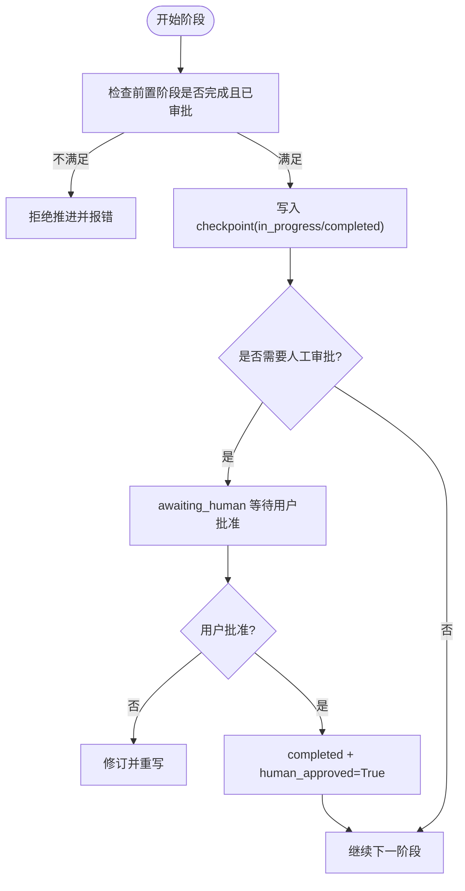
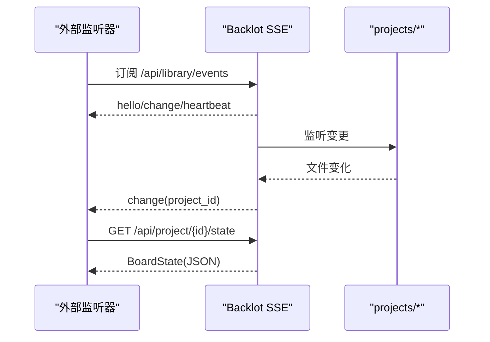
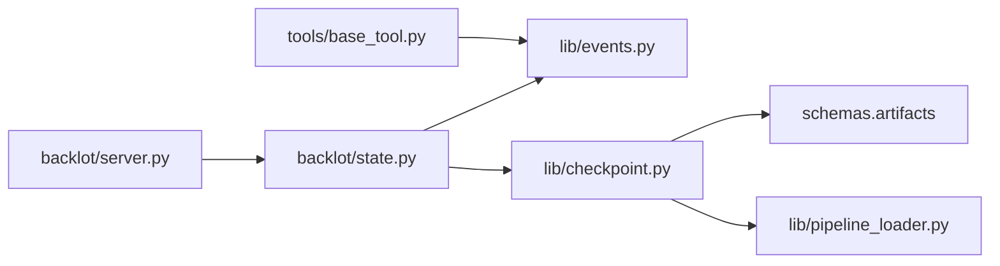

# 事件驱动执行系统

<cite>
**本文引用的文件**
- [lib/events.py](file://lib/events.py)
- [backlot/state.py](file://backlot/state.py)
- [backlot/server.py](file://backlot/server.py)
- [lib/checkpoint.py](file://lib/checkpoint.py)
- [skills/meta/checkpoint-protocol.md](file://skills/meta/checkpoint-protocol.md)
- [tools/base_tool.py](file://tools/base_tool.py)
- [scripts/backlot_watch_captures.py](file://scripts/backlot_watch_captures.py)
- [tests/contracts/test_backlot_contract.py](file://tests/contracts/test_backlot_contract.py)
</cite>

## 目录
1. [简介](#简介)
2. [项目结构](#项目结构)
3. [核心组件](#核心组件)
4. [架构总览](#架构总览)
5. [详细组件分析](#详细组件分析)
6. [依赖关系分析](#依赖关系分析)
7. [性能考量](#性能考量)
8. [故障排查指南](#故障排查指南)
9. [结论](#结论)
10. [附录](#附录)

## 简介
本文件系统性地阐述 OpenMontage 的事件驱动执行体系：以“工具调用即事件”的发布订阅模式为核心，结合 Backlot 的状态管理与检查点协议，实现可恢复、可审计、可观测的长时任务编排。文档覆盖以下主题：
- 基于事件的异步执行架构（事件发布/订阅、事件队列与处理器调度）
- Backlot 状态管理（阶段状态、工具调用状态、资源使用跟踪）
- 检查点协议（保存与恢复执行状态）
- 自定义事件监听器开发指南
- 事件调试与监控工具使用说明

## 项目结构
OpenMontage 的事件驱动执行由三层组成：
- 事件层：工具在执行前后写入追加式事件日志（events.jsonl），供观察端消费
- 状态层：Backlot 读取检查点、事件、媒体等，合成 BoardState 并对外提供 API/SSE
- 持久化层：检查点协议保证阶段推进、审批门控、历史归档与恢复能力



图表来源
- [tools/base_tool.py:162-191](file://tools/base_tool.py#L162-L191)
- [lib/events.py:77-118](file://lib/events.py#L77-L118)
- [backlot/server.py:165-240](file://backlot/server.py#L165-L240)
- [backlot/state.py:588-658](file://backlot/state.py#L588-L658)
- [lib/checkpoint.py:422-564](file://lib/checkpoint.py#L422-L564)

章节来源
- [lib/events.py:1-119](file://lib/events.py#L1-L119)
- [backlot/server.py:1-369](file://backlot/server.py#L1-L369)
- [backlot/state.py:1-716](file://backlot/state.py#L1-L716)
- [lib/checkpoint.py:1-634](file://lib/checkpoint.py#L1-L634)

## 核心组件
- 事件子系统（lib/events.py）：线程安全的追加写事件日志；自动推断项目归属；容错读取
- 状态推导（backlot/state.py）：聚合检查点、历史、事件、媒体，生成 BoardState；计算活跃/停滞状态
- 服务器与 SSE（backlot/server.py）：文件变更监听、变更广播、媒体/缩略图服务、SSE 心跳
- 检查点协议（lib/checkpoint.py + skills/meta/checkpoint-protocol.md）：阶段推进、门控审批、历史归档、恢复策略
- 工具事件注入（tools/base_tool.py）：在工具执行前后自动记录 start/finish/error 事件

章节来源
- [lib/events.py:1-119](file://lib/events.py#L1-L119)
- [backlot/state.py:588-658](file://backlot/state.py#L588-L658)
- [backlot/server.py:132-240](file://backlot/server.py#L132-L240)
- [lib/checkpoint.py:422-564](file://lib/checkpoint.py#L422-L564)
- [tools/base_tool.py:162-191](file://tools/base_tool.py#L162-L191)

## 架构总览
下图展示从工具调用到 UI 更新的端到端流程：



图表来源
- [tools/base_tool.py:162-191](file://tools/base_tool.py#L162-L191)
- [lib/events.py:77-118](file://lib/events.py#L77-L118)
- [backlot/server.py:132-240](file://backlot/server.py#L132-L240)
- [backlot/state.py:588-658](file://backlot/state.py#L588-L658)

## 详细组件分析

### 事件发布/订阅与队列管理
- 发布：BaseTool 在执行前后通过 lib/events.emit_event 写入 events.jsonl，包含 tool、scene_id、depth、event、output_path 等字段
- 订阅：Backlot server 通过 watchfiles 监听 projects/ 变更，将变更推送到 ChangeHub；SSE 接口按项目过滤推送
- 队列：ChangeHub 使用 asyncio.Queue 做 fan-out；每个订阅者独立队列，支持项目级过滤；队列满则丢弃多余通知（已保证至少一次唤醒）
- 事件读取：state.py 读取最近 N 条事件用于构建“正在生成”的场景卡片



图表来源
- [tools/base_tool.py:162-191](file://tools/base_tool.py#L162-L191)
- [lib/events.py:77-118](file://lib/events.py#L77-L118)

章节来源
- [lib/events.py:1-119](file://lib/events.py#L1-L119)
- [backlot/server.py:43-74](file://backlot/server.py#L43-L74)
- [backlot/server.py:132-240](file://backlot/server.py#L132-L240)
- [backlot/state.py:403-495](file://backlot/state.py#L403-L495)

### Backlot 状态管理系统
- 阶段轨道：根据 pipeline manifest 或回退顺序，为每个阶段生成条目，包含 gated、produces、status、timestamp、review、cost_snapshot、error、human_approved、partial_progress、versions、history_entries、gate_skipped
- 场景故事板：合并 scene_plan、script、asset_manifest，并结合事件流判断每场景是否“generating”，以及当前生成工具
- 媒体发现：扫描 renders/snapshots/music，并生成 poster
- 活动检测：统计 checkpoint/events/artifacts 最后修改时间，计算 live/stalled
- 成本汇总：优先取最新 checkpoint 的 cost_snapshot，否则回退到 asset_manifest 总计

```mermaid
classDiagram
class BoardState {
+project_id
+title
+pipeline
+stages[]
+artifacts{}
+storyboard
+media
+events[]
+cost
+last_activity
+live
+poster
}
class StageEntry {
+name
+gated
+produces[]
+status
+timestamp
+review
+cost_snapshot
+error
+human_approved
+partial_progress
+versions
+history_entries[]
+gate_skipped
}
BoardState --> StageEntry : "包含"
```

图表来源
- [backlot/state.py:145-224](file://backlot/state.py#L145-L224)
- [backlot/state.py:588-658](file://backlot/state.py#L588-L658)

章节来源
- [backlot/state.py:1-716](file://backlot/state.py#L1-L716)

### 检查点协议（Checkpoint Protocol）
- 初始化：init_project 创建标准目录结构与 project.json 标记
- 写入：write_checkpoint 校验阶段、状态、制品 schema，强制门控审批（awaiting_human → completed 需 human_approved=True），前置阶段必须已完成且通过审批
- 历史归档：覆盖前将非 in_progress 的历史拷贝至 history/，保留版本与门控轨迹
- 恢复：get_next_stage/read_checkpoint 支持从 in_progress 断点续跑，metadata.partial_progress 携带部分进度
- 决策日志：merge_decision_log 累计项目级 decision_log，并在相关制品中引用



图表来源
- [lib/checkpoint.py:284-346](file://lib/checkpoint.py#L284-L346)
- [lib/checkpoint.py:422-564](file://lib/checkpoint.py#L422-L564)
- [skills/meta/checkpoint-protocol.md:102-177](file://skills/meta/checkpoint-protocol.md#L102-L177)

章节来源
- [lib/checkpoint.py:1-634](file://lib/checkpoint.py#L1-L634)
- [skills/meta/checkpoint-protocol.md:1-247](file://skills/meta/checkpoint-protocol.md#L1-L247)

### 事件监听器开发指南（扩展系统功能）
- 目标：在不侵入生产路径的前提下，对工具调用进行观测、统计、告警或联动
- 推荐方式：
  - 直接消费 events.jsonl：使用 lib.events.read_events 读取指定项目的最近事件，适合轻量离线分析
  - 订阅 Backlot SSE：连接 /api/library/events 或 /api/project/{id}/events，接收变更通知后按需拉取 state
  - 集成外部系统：在收到事件后触发指标上报、消息队列投递、看板更新等
- 注意事项：
  - 事件写入失败静默降级，不会中断工具执行
  - 事件仅追加写，读取容忍损坏行
  - 项目归属通过输入参数推断，避免误写其他项目



图表来源
- [backlot/server.py:183-240](file://backlot/server.py#L183-L240)
- [lib/events.py:98-118](file://lib/events.py#L98-L118)

章节来源
- [lib/events.py:1-119](file://lib/events.py#L1-L119)
- [backlot/server.py:165-240](file://backlot/server.py#L165-L240)

### 事件调试与监控工具
- 实时捕获与快照：scripts/backlot_watch_captures.py 提供 capture_slug、state_fingerprint、active_stage 等辅助函数，便于截图对比与差异指纹
- 测试验证：tests/contracts/test_backlot_contract.py 验证 BaseTool 事件链路（start/finish/error）与不可归因调用的行为
- 常用操作：
  - 启动 Backlot：python -m backlot open <project_id>
  - 查看项目事件：GET /api/project/{id}/events（SSE）
  - 抓取状态快照：使用 capture_slug 生成安全文件名，state_fingerprint 比较关键状态变化

章节来源
- [scripts/backlot_watch_captures.py:64-94](file://scripts/backlot_watch_captures.py#L64-L94)
- [tests/contracts/test_backlot_contract.py:218-244](file://tests/contracts/test_backlot_contract.py#L218-L244)

## 依赖关系分析
- tools/base_tool.py 依赖 lib/events.py 进行事件发射
- backlot/server.py 依赖 watchfiles 监听文件系统，依赖 backlot/state.py 推导状态
- backlot/state.py 依赖 lib/events.py 读取事件，依赖 lib.checkpoint 的检查点文件（由 lib/checkpoint.py 写入）
- lib/checkpoint.py 依赖 schemas.artifacts 进行制品校验，依赖 pipeline_loader 解析阶段顺序与门控策略



图表来源
- [tools/base_tool.py:162-191](file://tools/base_tool.py#L162-L191)
- [backlot/server.py:165-240](file://backlot/server.py#L165-L240)
- [backlot/state.py:588-658](file://backlot/state.py#L588-L658)
- [lib/checkpoint.py:422-564](file://lib/checkpoint.py#L422-L564)

章节来源
- [tools/base_tool.py:162-191](file://tools/base_tool.py#L162-L191)
- [backlot/server.py:1-369](file://backlot/server.py#L1-L369)
- [backlot/state.py:1-716](file://backlot/state.py#L1-L716)
- [lib/checkpoint.py:1-634](file://lib/checkpoint.py#L1-L634)

## 性能考量
- 事件写入采用线程锁与 O_APPEND 追加写，跨进程未同步但容忍撕裂行，读端跳过损坏行，确保零阻塞
- 文件监听批量处理变更，仅提取项目级 ID 去重后广播，避免风暴
- SSE 队列有上限，满队丢弃重复通知，保证至少一次唤醒
- 缩略图缓存减少重复转码/缩放开销
- 状态推导限制事件读取数量（limit=250），降低大项目 IO 压力

[本节为通用指导，不直接分析具体文件]

## 故障排查指南
- 工具异常事件缺失：确认 BaseTool 包装生效，且输出路径属于 projects/ 下；不可归因调用不会写入事件
- 事件文件损坏：read_events 会跳过损坏行，不影响整体读取
- 阶段无法推进：检查前置阶段是否 completed 且已通过审批；关注 PREREQUISITE VIOLATION 错误
- 门控违规：若 stage 需要人工审批，不得直接写入 completed；必须先 awaiting_human 再 approved
- 卡顿/停滞：Backlot 根据 last_activity 与 STALL_WINDOW_SECONDS 判定 stalled；检查是否有 in_progress 心跳与事件产出
- 恢复执行：读取 next_stage 与对应 checkpoint，若 status=in_progress 则从 metadata.partial_progress 继续

章节来源
- [lib/checkpoint.py:284-346](file://lib/checkpoint.py#L284-L346)
- [lib/checkpoint.py:422-564](file://lib/checkpoint.py#L422-L564)
- [backlot/state.py:626-639](file://backlot/state.py#L626-L639)
- [tests/contracts/test_backlot_contract.py:218-244](file://tests/contracts/test_backlot_contract.py#L218-L244)

## 结论
OpenMontage 的事件驱动执行系统以“工具调用即事件”为核心，配合 Backlot 的状态推导与 SSE 推送，实现了高内聚、低耦合的可观测执行环境。检查点协议提供了强一致的门控与恢复能力，使长时任务具备鲁棒性与可审计性。通过事件监听器与调试工具，开发者可以低成本扩展系统能力并快速定位问题。

[本节为总结性内容，不直接分析具体文件]

## 附录
- 最佳实践
  - 在每个阶段开始时写入 in_progress 检查点，确保 UI 显示“进行中”而非“卡住”
  - 长循环阶段（如 assets/compose）持续写入 partial_progress，支持断点续跑
  - 严格遵循门控协议：需要审批的阶段先 awaiting_human，再 completed+human_approved
  - 使用 get_next_stage 决定下一步，避免硬编码阶段顺序
- 参考路径
  - 事件写入：[tools/base_tool.py:162-191](file://tools/base_tool.py#L162-L191)
  - 事件读写：[lib/events.py:77-118](file://lib/events.py#L77-L118)
  - 状态推导：[backlot/state.py:588-658](file://backlot/state.py#L588-L658)
  - 检查点写入：[lib/checkpoint.py:422-564](file://lib/checkpoint.py#L422-L564)
  - 协议说明：[skills/meta/checkpoint-protocol.md:74-195](file://skills/meta/checkpoint-protocol.md#L74-L195)