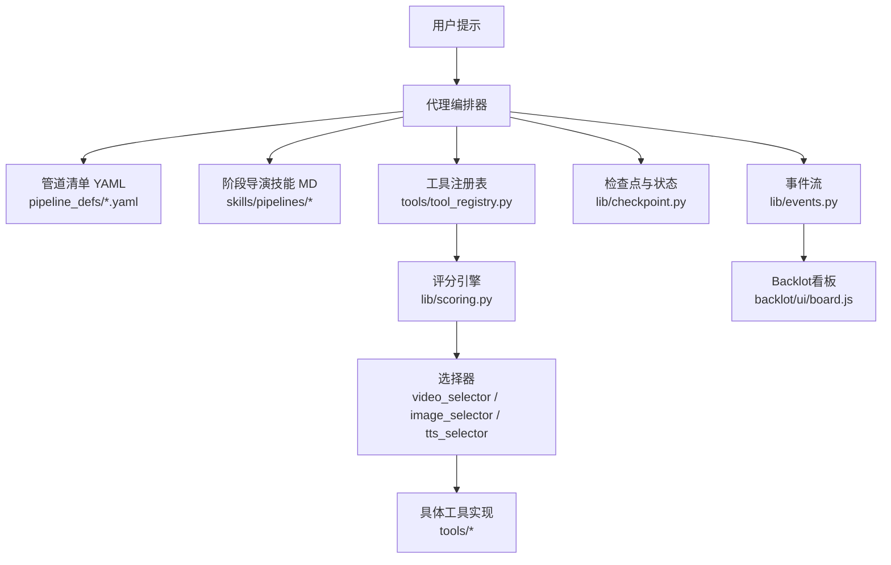
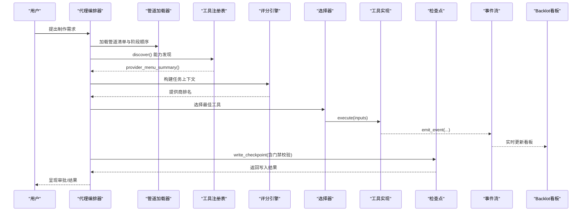
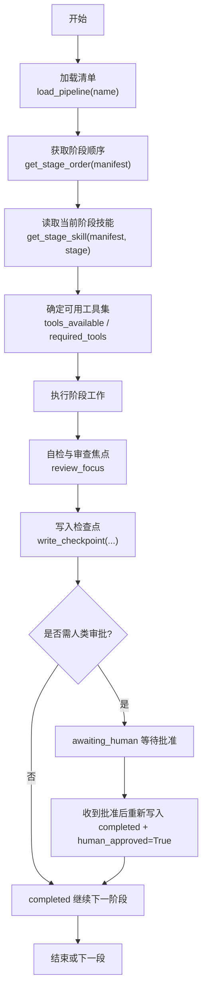
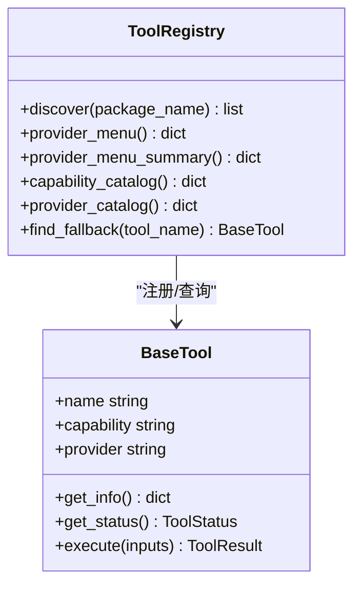
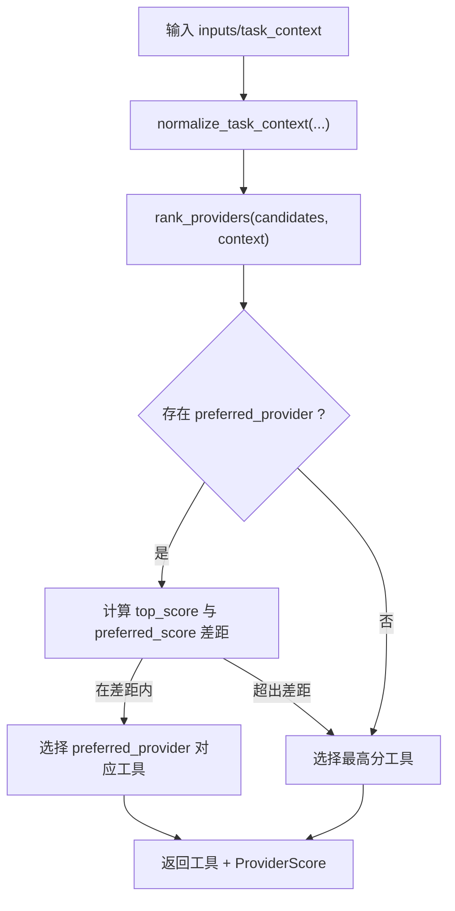
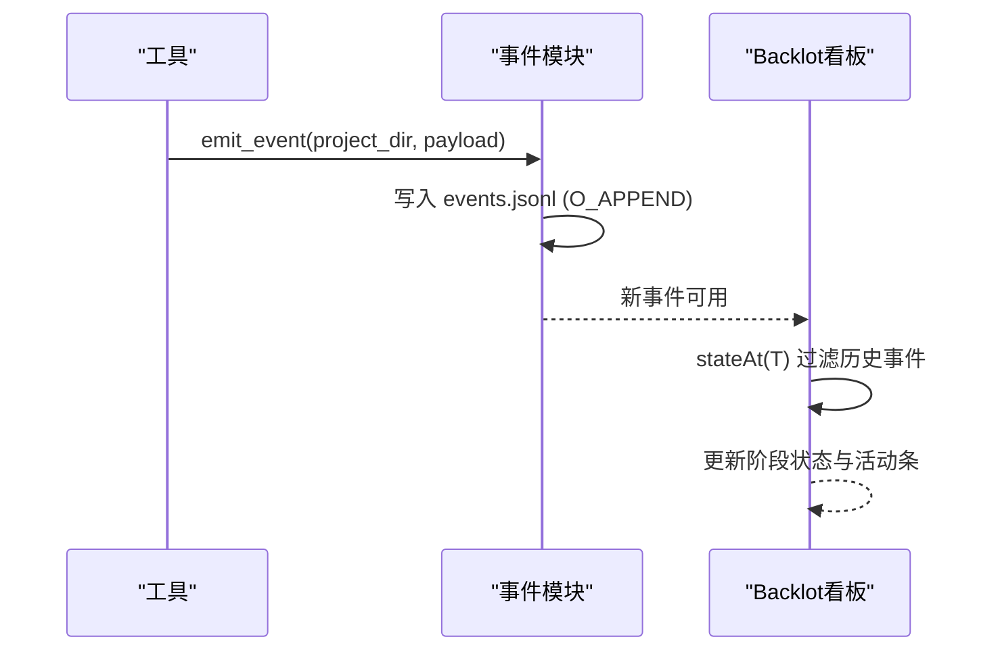
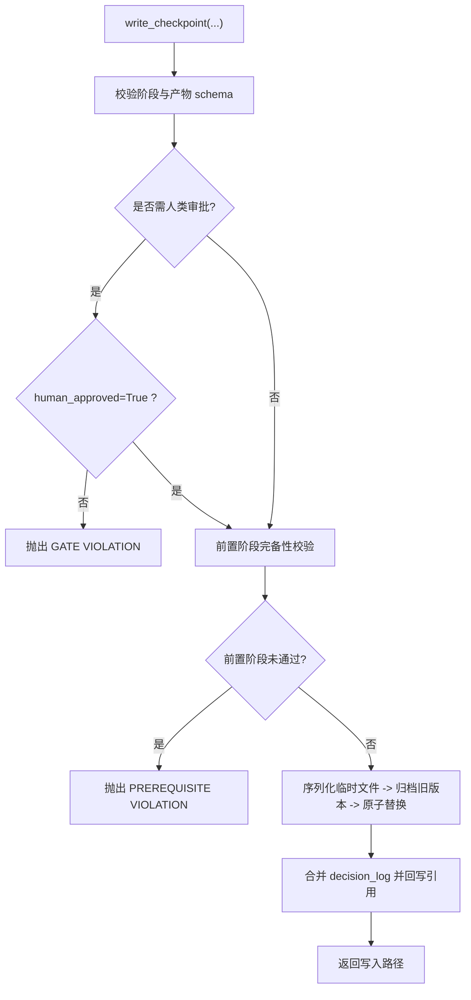
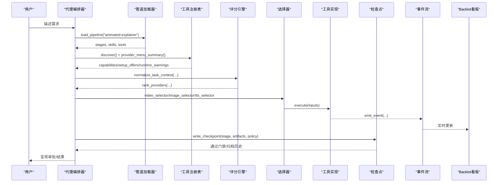
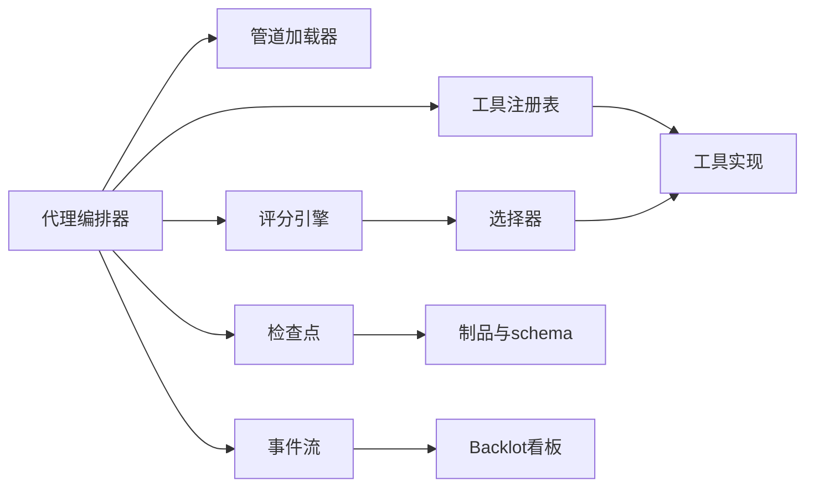

# 基于代理的编排架构

<cite>
**本文引用的文件**
- [README.md](file://README.md)
- [AGENT_GUIDE.md](file://AGENT_GUIDE.md)
- [tools/tool_registry.py](file://tools/tool_registry.py)
- [lib/scoring.py](file://lib/scoring.py)
- [lib/checkpoint.py](file://lib/checkpoint.py)
- [lib/pipeline_loader.py](file://lib/pipeline_loader.py)
- [lib/events.py](file://lib/events.py)
- [pipeline_defs/animated-explainer.yaml](file://pipeline_defs/animated-explainer.yaml)
- [tools/video/video_selector.py](file://tools/video/video_selector.py)
- [tools/graphics/image_selector.py](file://tools/graphics/image_selector.py)
- [tools/audio/tts_selector.py](file://tools/audio/tts_selector.py)
- [backlot/ui/board.js](file://backlot/ui/board.js)
- [tests/backlot/test_gate_scenarios.py](file://tests/backlot/test_gate_scenarios.py)
- [tests/tools/test_cost_tracker_governance.py](file://tests/tools/test_cost_tracker_governance.py)
</cite>

## 目录
1. [简介](#简介)
2. [项目结构](#项目结构)
3. [核心组件](#核心组件)
4. [架构总览](#架构总览)
5. [详细组件分析](#详细组件分析)
6. [依赖关系分析](#依赖关系分析)
7. [性能与可扩展性](#性能与可扩展性)
8. [故障排除指南](#故障排除指南)
9. [结论](#结论)
10. [附录](#附录)

## 简介
本文件面向OpenMontage的“基于代理的编排架构”，解释AI编码助手如何作为编排器驱动生产流程，而不是传统硬编码的编排器。系统以“指令驱动”为核心：代理读取管道清单（YAML）、阶段导演技能（Markdown），并调用Python工具完成研究、提案、脚本、场景规划、资产生成、剪辑、合成与发布。工具发现通过注册表完成；提供商选择由评分引擎驱动；执行过程事件化，支持检查点、质量保证门禁与预算控制。文档提供完整的请求处理流程图与关键组件交互图，并给出最佳实践与排障建议。

## 项目结构
OpenMontage采用“三层知识架构”：
- 第一层：工具与管道定义（可执行能力与编排）
- 第二层：技能（如何使用这些能力）
- 第三层：外部技术知识包（供应商或技术细节）

图表来源
- [README.md:450-486](file://README.md#L450-L486)
- [tools/tool_registry.py:118-134](file://tools/tool_registry.py#L118-L134)
- [lib/scoring.py:533-542](file://lib/scoring.py#L533-L542)
- [lib/checkpoint.py:422-564](file://lib/checkpoint.py#L422-L564)
- [lib/events.py:77-95](file://lib/events.py#L77-L95)
- [backlot/ui/board.js:921-934](file://backlot/ui/board.js#L921-L934)

章节来源
- [README.md:450-486](file://README.md#L450-L486)
- [AGENT_GUIDE.md:181-201](file://AGENT_GUIDE.md#L181-L201)

## 核心组件
- 代理编排器：遵循“规则零”——所有生产必须走管道；按阶段读取导演技能，调用工具，自检、检查点、人类审批。
- 管道清单加载器：加载并校验YAML，提取阶段顺序、所需工具、技能路径、人类审批默认值等。
- 工具注册表：自动发现工具，报告可用性、能力目录、提供商菜单与运行时警告。
- 评分引擎：对候选提供商进行七维加权评分，输出可解释的选择理由。
- 选择器：抽象多提供商能力（视频、图像、TTS），根据上下文路由到最佳工具。
- 检查点系统：持久化阶段状态、强制门禁、归档历史、合并决策日志。
- 事件流：记录工具执行事件，供Backlot看板实时展示。
- Backlot看板：从磁盘派生状态，呈现阶段进度、质量门禁、成本快照与回放。

章节来源
- [AGENT_GUIDE.md:49-80](file://AGENT_GUIDE.md#L49-L80)
- [lib/pipeline_loader.py:49-70](file://lib/pipeline_loader.py#L49-L70)
- [tools/tool_registry.py:198-314](file://tools/tool_registry.py#L198-L314)
- [lib/scoring.py:21-70](file://lib/scoring.py#L21-L70)
- [lib/checkpoint.py:422-564](file://lib/checkpoint.py#L422-L564)
- [lib/events.py:77-95](file://lib/events.py#L77-L95)

## 架构总览
OpenMontage将“编排逻辑”从代码迁移到“指令+工具”的组合：
- 代理是编排器：它读清单、读技能、调工具、写检查点、发事件、过门禁。
- Python负责工具与持久化：不承载创意决策与编排逻辑。
- 质量门禁贯穿始终：预合成校验、后渲染自检、交付承诺验证。
- 预算治理内置：估算、预留、结算、模式控制、单动作审批阈值。

图表来源
- [lib/pipeline_loader.py:125-149](file://lib/pipeline_loader.py#L125-L149)
- [tools/tool_registry.py:316-471](file://tools/tool_registry.py#L316-L471)
- [lib/scoring.py:533-542](file://lib/scoring.py#L533-L542)
- [tools/video/video_selector.py:352-440](file://tools/video/video_selector.py#L352-L440)
- [lib/checkpoint.py:422-564](file://lib/checkpoint.py#L422-L564)
- [lib/events.py:77-95](file://lib/events.py#L77-L95)
- [backlot/ui/board.js:921-934](file://backlot/ui/board.js#L921-L934)

## 详细组件分析

### 管道清单与阶段导演技能
- 清单（YAML）声明：名称、版本、类别、稳定性、参考输入支持、扩展权限、必需技能、编排配置、兼容风格、阶段序列、每阶段的技能、产物、可用工具、审查焦点、成功标准、人类审批默认值等。
- 阶段导演技能（Markdown）：指导代理在每个阶段“如何做”，包括工作流、质量门槛、评审要点与合规要求。
- 示例：动画解说管道的研究、提案、脚本、场景规划、资产、剪辑、合成、发布各阶段均有明确技能引用与产物约束。

图表来源
- [lib/pipeline_loader.py:49-70](file://lib/pipeline_loader.py#L49-L70)
- [lib/pipeline_loader.py:125-149](file://lib/pipeline_loader.py#L125-L149)
- [lib/pipeline_loader.py:165-182](file://lib/pipeline_loader.py#L165-L182)
- [pipeline_defs/animated-explainer.yaml:61-270](file://pipeline_defs/animated-explainer.yaml#L61-L270)
- [lib/checkpoint.py:422-564](file://lib/checkpoint.py#L422-L564)

章节来源
- [pipeline_defs/animated-explainer.yaml:1-270](file://pipeline_defs/animated-explainer.yaml#L1-L270)
- [lib/pipeline_loader.py:125-182](file://lib/pipeline_loader.py#L125-L182)
- [AGENT_GUIDE.md:181-201](file://AGENT_GUIDE.md#L181-L201)

### 工具发现机制
- 自动发现：扫描tools包下模块，注册所有继承自BaseTool的具体类。
- 能力目录：按能力分组（如video_generation、image_generation、tts）。
- 提供商菜单：按能力分组列出可用/不可用工具、安装说明、运行时警告。
- 摘要视图：composition_runtimes、capabilities、setup_offers、runtime_warnings，便于代理向用户呈现“N of M configured”。

图表来源
- [tools/tool_registry.py:55-134](file://tools/tool_registry.py#L55-L134)
- [tools/tool_registry.py:198-314](file://tools/tool_registry.py#L198-L314)
- [tools/tool_registry.py:316-471](file://tools/tool_registry.py#L316-L471)

章节来源
- [tools/tool_registry.py:118-134](file://tools/tool_registry.py#L118-L134)
- [tools/tool_registry.py:198-314](file://tools/tool_registry.py#L198-L314)
- [tools/tool_registry.py:316-471](file://tools/tool_registry.py#L316-L471)

### 提供商选择算法与评分引擎
- 七维评分：任务契合度（30%）、输出质量（20%）、控制特性（15%）、可靠性（15%）、成本效率（10%）、延迟（5%）、连续性（5%）。
- 上下文归一化：从松散brief中提取意图、风格关键词、资产类型、预算剩余、是否运动必需、是否需要参考条件或图像编辑等。
- 选择策略：尊重preferred_provider但受分数差距限制；否则取最高分；支持allowed_providers过滤。
- 输出：selected_tool、selected_provider、selection_reason、provider_score、alternatives_considered、fallback_tools。

图表来源
- [lib/scoring.py:21-70](file://lib/scoring.py#L21-L70)
- [lib/scoring.py:297-359](file://lib/scoring.py#L297-L359)
- [lib/scoring.py:373-530](file://lib/scoring.py#L373-L530)
- [lib/scoring.py:533-542](file://lib/scoring.py#L533-L542)
- [tools/video/video_selector.py:368-440](file://tools/video/video_selector.py#L368-L440)
- [tools/graphics/image_selector.py:334-375](file://tools/graphics/image_selector.py#L334-L375)
- [tools/audio/tts_selector.py:272-298](file://tools/audio/tts_selector.py#L272-L298)

章节来源
- [lib/scoring.py:21-70](file://lib/scoring.py#L21-L70)
- [lib/scoring.py:297-359](file://lib/scoring.py#L297-L359)
- [lib/scoring.py:373-530](file://lib/scoring.py#L373-L530)
- [tools/video/video_selector.py:352-440](file://tools/video/video_selector.py#L352-L440)
- [tools/graphics/image_selector.py:320-375](file://tools/graphics/image_selector.py#L320-L375)
- [tools/audio/tts_selector.py:272-298](file://tools/audio/tts_selector.py#L272-L298)

### 事件驱动的执行流程
- 事件写入：BaseTool在执行时通过events.emit_event追加事件，包含时间戳与负载字段。
- 项目归属推断：优先显式project_dir/project_path，其次从output/input路径推断projects根下的项目目录。
- 看板消费：Backlot UI读取events.jsonl并按时间线过滤，呈现活动流与阶段状态。

图表来源
- [lib/events.py:46-74](file://lib/events.py#L46-L74)
- [lib/events.py:77-95](file://lib/events.py#L77-L95)
- [backlot/ui/board.js:921-934](file://backlot/ui/board.js#L921-L934)

章节来源
- [lib/events.py:46-74](file://lib/events.py#L46-L74)
- [lib/events.py:77-95](file://lib/events.py#L77-L95)
- [backlot/ui/board.js:921-934](file://backlot/ui/board.js#L921-L934)

### 状态检查点、质量保证门禁与预算控制
- 检查点：每个阶段完成后写入checkpoint_<stage>.json，包含阶段、状态、产物、时间戳、人类审批标记、审查结果、成本快照等；支持归档历史、前置阶段校验、样式剧本校验。
- 门禁：manifest中human_approval_default为true的阶段，必须以awaiting_human暂停，待人类批准后以completed+human_approved=True重写；否则抛出GATE VIOLATION。
- 预算控制：CostTracker支持estimate/reserve/reconcile，模式observe/warn/cap，单动作审批阈值与总预算上限；测试覆盖越界告警与跨重启持久化。

图表来源
- [lib/checkpoint.py:124-191](file://lib/checkpoint.py#L124-L191)
- [lib/checkpoint.py:251-346](file://lib/checkpoint.py#L251-L346)
- [lib/checkpoint.py:422-564](file://lib/checkpoint.py#L422-L564)
- [tests/backlot/test_gate_scenarios.py:30-43](file://tests/backlot/test_gate_scenarios.py#L30-L43)
- [tests/tools/test_cost_tracker_governance.py:15-41](file://tests/tools/test_cost_tracker_governance.py#L15-L41)

章节来源
- [lib/checkpoint.py:124-191](file://lib/checkpoint.py#L124-L191)
- [lib/checkpoint.py:251-346](file://lib/checkpoint.py#L251-L346)
- [lib/checkpoint.py:422-564](file://lib/checkpoint.py#L422-L564)
- [tests/backlot/test_gate_scenarios.py:30-43](file://tests/backlot/test_gate_scenarios.py#L30-L43)
- [tests/tools/test_cost_tracker_governance.py:15-41](file://tests/tools/test_cost_tracker_governance.py#L15-L41)

### 完整请求处理流程（端到端）

图表来源
- [pipeline_defs/animated-explainer.yaml:61-270](file://pipeline_defs/animated-explainer.yaml#L61-L270)
- [lib/pipeline_loader.py:49-70](file://lib/pipeline_loader.py#L49-L70)
- [tools/tool_registry.py:316-471](file://tools/tool_registry.py#L316-L471)
- [lib/scoring.py:297-359](file://lib/scoring.py#L297-L359)
- [tools/video/video_selector.py:352-440](file://tools/video/video_selector.py#L352-L440)
- [lib/checkpoint.py:422-564](file://lib/checkpoint.py#L422-L564)
- [lib/events.py:77-95](file://lib/events.py#L77-L95)
- [backlot/ui/board.js:921-934](file://backlot/ui/board.js#L921-L934)

## 依赖关系分析
- 代理编排器依赖管道加载器与技能文件；通过注册表发现工具；使用评分引擎与选择器决定提供商；调用工具执行；通过检查点持久化状态；通过事件流驱动看板。
- 注册表依赖BaseTool与工具模块；选择器依赖注册表与评分引擎；检查点依赖管道清单与制品schema；事件流依赖路径约定与文件系统。

图表来源
- [lib/pipeline_loader.py:49-70](file://lib/pipeline_loader.py#L49-L70)
- [tools/tool_registry.py:118-134](file://tools/tool_registry.py#L118-L134)
- [lib/scoring.py:533-542](file://lib/scoring.py#L533-L542)
- [lib/checkpoint.py:422-564](file://lib/checkpoint.py#L422-L564)
- [lib/events.py:77-95](file://lib/events.py#L77-L95)

章节来源
- [tools/tool_registry.py:118-134](file://tools/tool_registry.py#L118-L134)
- [lib/scoring.py:533-542](file://lib/scoring.py#L533-L542)
- [lib/checkpoint.py:422-564](file://lib/checkpoint.py#L422-L564)
- [lib/events.py:77-95](file://lib/events.py#L77-L95)

## 性能与可扩展性
- 性能
  - 注册表缓存：manifest加载与工具发现使用缓存减少重复开销。
  - 事件写入：线程锁保护追加写，容忍部分损坏行，保证看板稳定。
  - 评分引擎：轻量文本归一化与关键词重叠计算，避免昂贵NLP。
- 可扩展性
  - 新增工具：只需继承BaseTool并在tools目录下注册，注册表自动发现。
  - 新增管道：添加YAML清单与阶段技能，无需修改核心代码。
  - 提供商扩展：通过选择器与评分引擎无缝接入，无需改动代理主循环。

[本节为通用指导，不直接分析具体文件]

## 故障排除指南
- 门禁违规
  - 症状：尝试将需要人类审批的阶段直接写为completed。
  - 原因：未设置human_approved=True或manifest要求审批。
  - 解决：先写awaiting_human，等待批准后再写completed+human_approved=True。
  - 参考：检查点写入时的门禁校验与前置阶段校验。
- 提供商不可用
  - 症状：选择器无法找到可用工具或运行时警告。
  - 原因：缺少API密钥、环境未配置、Node/npm缺失等。
  - 解决：查看provider_menu_summary中的setup_offers与runtime_warnings，按指引配置。
- 事件未显示
  - 症状：Backlot看板无活动。
  - 原因：工具未传入project_dir或路径不在projects根下；事件文件不存在。
  - 解决：确保工具调用包含output_path等路径提示，且位于projects目录内。
- 预算超支
  - 症状：reserve被拒绝或记录预算警告。
  - 原因：CAP模式下超过预算；WARN模式下记录警告。
  - 解决：调整预算上限、降低单次动作阈值或切换模式。

章节来源
- [lib/checkpoint.py:422-564](file://lib/checkpoint.py#L422-L564)
- [tools/tool_registry.py:316-471](file://tools/tool_registry.py#L316-L471)
- [lib/events.py:46-74](file://lib/events.py#L46-L74)
- [tests/tools/test_cost_tracker_governance.py:15-41](file://tests/tools/test_cost_tracker_governance.py#L15-L41)

## 结论
OpenMontage的基于代理的编排架构将“编排逻辑”从代码转移到“指令+工具”的可读、可审计、可组合的知识体系。代理作为编排器，严格遵循管道清单与阶段技能，借助注册表与评分引擎做出透明、可解释的提供商选择；通过检查点与事件流实现可恢复、可观测的执行；通过质量门禁与预算控制保障生产质量与成本可控。该设计使系统具备高可扩展性与强治理能力，适合复杂媒体生产的自动化与协作。

[本节为总结，不直接分析具体文件]

## 附录
- 快速上手
  - 运行能力发现：registry.discover() 后调用 provider_menu_summary() 获取能力概览。
  - 选择提供商：使用选择器（video_selector/image_selector/tts_selector）并传入task_context。
  - 执行与检查点：调用工具execute后，写入检查点并通过门禁。
  - 观察看板：启动Backlot，查看events.jsonl驱动的实时状态。
- 最佳实践
  - 始终先读清单与技能，再调用工具。
  - 在重大决策前告知用户并获得批准。
  - 使用评分引擎与选择器，而非硬编码提供商。
  - 利用检查点归档与决策日志，保持可追溯性。
  - 关注运行时警告与setup_offers，及时补齐环境。

[本节为补充信息，不直接分析具体文件]