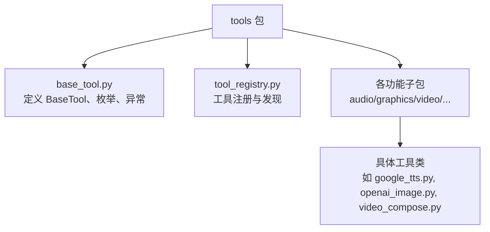
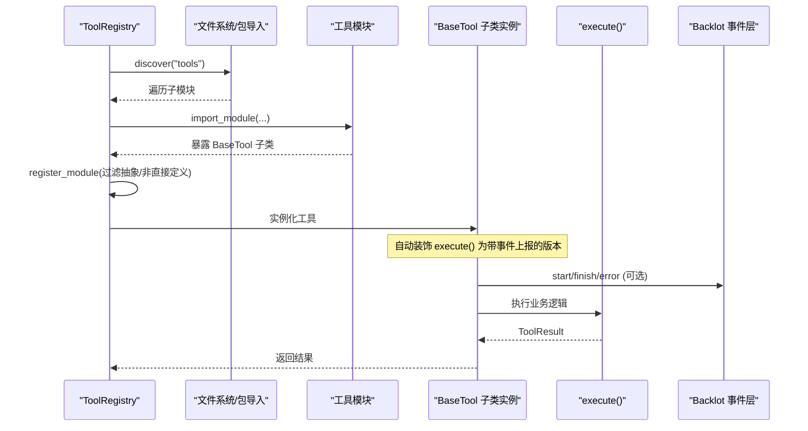
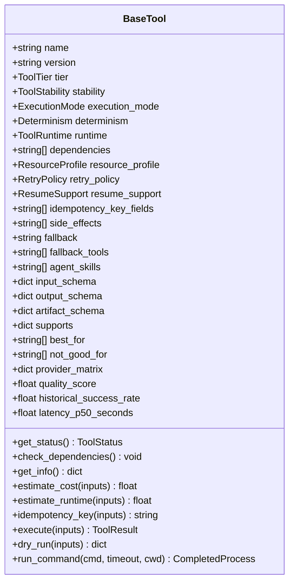
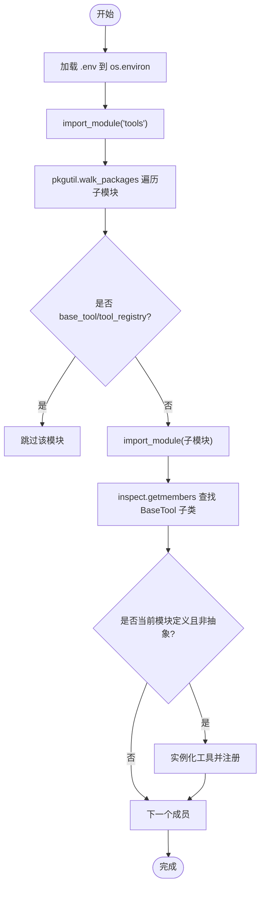
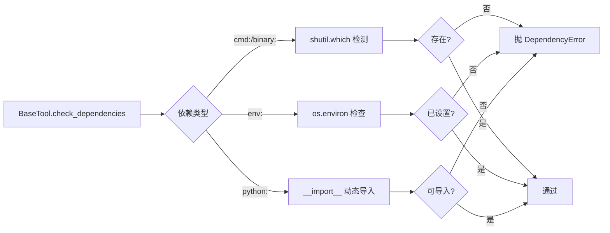

# 工具发现与注册机制

<cite>
**本文引用的文件**
- [tools/base_tool.py](file://tools/base_tool.py)
- [tools/tool_registry.py](file://tools/tool_registry.py)
- [tools/audio/google_tts.py](file://tools/audio/google_tts.py)
- [tools/graphics/openai_image.py](file://tools/graphics/openai_image.py)
- [tools/video/video_compose.py](file://tools/video/video_compose.py)
- [tests/tools/test_base_tool_dependencies.py](file://tests/tools/test_base_tool_dependencies.py)
- [tests/contracts/test_phase0_contracts.py](file://tests/contracts/test_phase0_contracts.py)
</cite>

## 目录
1. [简介](#简介)
2. [项目结构](#项目结构)
3. [核心组件](#核心组件)
4. [架构总览](#架构总览)
5. [详细组件分析](#详细组件分析)
6. [依赖关系分析](#依赖关系分析)
7. [性能考虑](#性能考虑)
8. [故障排查指南](#故障排查指南)
9. [结论](#结论)
10. [附录：工具开发指南与测试实践](#附录：工具开发指南与测试实践)

## 简介
本文件系统性阐述 OpenMontage 的工具发现与注册机制，覆盖以下主题：
- 工具类自动扫描、元数据提取与依赖解析
- BaseTool 抽象基类的设计模式（统一接口、生命周期管理、错误处理）
- 配置系统对环境变量注入、参数验证与类型检查的支持
- 自定义工具开发与集成流程
- 工具调试与测试最佳实践（单元测试与集成测试策略）

## 项目结构
OpenMontage 将“工具”以 Python 模块组织在 tools 包下。每个具体工具是一个继承自 BaseTool 的类，声明其能力、运行时、依赖、输入输出 Schema 等元信息。工具注册表通过反射扫描这些模块，自动发现并注册所有非抽象的具体工具子类。

图表来源
- [tools/base_tool.py:227-397](file://tools/base_tool.py#L227-L397)
- [tools/tool_registry.py:55-134](file://tools/tool_registry.py#L55-L134)
- [tools/audio/google_tts.py:33-140](file://tools/audio/google_tts.py#L33-L140)
- [tools/graphics/openai_image.py:25-92](file://tools/graphics/openai_image.py#L25-L92)
- [tools/video/video_compose.py:58-70](file://tools/video/video_compose.py#L58-L70)

章节来源
- [tools/base_tool.py:227-397](file://tools/base_tool.py#L227-L397)
- [tools/tool_registry.py:55-134](file://tools/tool_registry.py#L55-L134)

## 核心组件
- BaseTool：所有工具的抽象基类，提供统一接口、生命周期钩子、资源与重试策略、成本估算、幂等键、命令执行封装、状态报告等。
- ToolRegistry：集中式注册表，负责导入 tools 包树、反射发现具体工具类、去重注册、按能力/提供者/层级/状态查询、生成支持信封与提供商菜单等。
- 具体工具类：实现 execute() 并声明元数据（name、capability、provider、dependencies、input_schema 等），由注册表自动发现。

章节来源
- [tools/base_tool.py:227-397](file://tools/base_tool.py#L227-L397)
- [tools/tool_registry.py:55-230](file://tools/tool_registry.py#L55-L230)

## 架构总览
下图展示了从注册表扫描到工具实例化、再到执行与事件上报的整体流程。

图表来源
- [tools/tool_registry.py:118-134](file://tools/tool_registry.py#L118-L134)
- [tools/base_tool.py:148-224](file://tools/base_tool.py#L148-L224)
- [tools/base_tool.py:227-236](file://tools/base_tool.py#L227-L236)

## 详细组件分析

### BaseTool 抽象基类
- 统一接口：execute(inputs) -> ToolResult；dry_run(inputs) 预检；estimate_cost/estimate_runtime 用于成本与时延预估；idempotency_key 基于字段计算幂等键。
- 生命周期与自动包装：通过 __init_subclass__ 对每个非抽象 execute 进行装饰，自动注入 Backlot 事件上报（start/finish/error），且不影响业务逻辑。
- 依赖检查：check_dependencies 支持 cmd:/binary:、env:、python: 三类依赖校验，失败抛出 DependencyError。
- 状态报告：get_status 调用 check_dependencies 判定可用性；get_info 汇总完整契约信息供注册表与编排器使用。
- 命令执行：run_command 封装 subprocess 调用，统一 UTF-8 解码与错误包装为 ToolCommandError。

图表来源
- [tools/base_tool.py:110-139](file://tools/base_tool.py#L110-L139)
- [tools/base_tool.py:227-397](file://tools/base_tool.py#L227-L397)

章节来源
- [tools/base_tool.py:148-224](file://tools/base_tool.py#L148-L224)
- [tools/base_tool.py:227-397](file://tools/base_tool.py#L227-L397)
- [tools/base_tool.py:456-481](file://tools/base_tool.py#L456-L481)

### 工具注册表与自动发现
- 环境变量加载：_load_dotenv 在首次导入时尝试从仓库根 .env 注入缺失的环境变量，确保工具可访问 API Key。
- 模块扫描：discover(package_name="tools") 使用 pkgutil.walk_packages 遍历子模块，跳过 base_tool 与 tool_registry 自身，避免循环导入。
- 类过滤：register_module 仅注册当前模块中定义的、非抽象的、继承自 BaseTool 的具体类，防止误注册父类或跨模块同名类。
- 查询与报表：提供 get_by_tier/get_by_capability/get_by_provider/get_by_status/find_by_capability 等查询；support_envelope/capability_catalog/provider_catalog/provider_menu/provider_menu_summary 生成不同粒度的能力视图；gpu_required_tools/network_required_tools 快速筛选资源需求。

图表来源
- [tools/tool_registry.py:86-134](file://tools/tool_registry.py#L86-L134)

章节来源
- [tools/tool_registry.py:86-134](file://tools/tool_registry.py#L86-L134)
- [tools/tool_registry.py:136-230](file://tools/tool_registry.py#L136-L230)
- [tools/tool_registry.py:249-471](file://tools/tool_registry.py#L249-L471)

### 具体工具示例与元数据
- Google TTS：声明 voice、language_code、speaking_rate、pitch、audio_encoding 等输入 Schema；通过 GOOGLE_TTS_API_KEY / GOOGLE_APPLICATION_CREDENTIALS 认证；提供 estimate_cost、fallback 链、agent_skills 等元数据。
- OpenAI 图像生成：声明 prompt、model、size、quality、output_format、n 等输入 Schema；通过 OPENAI_API_KEY 认证；多输出路径生成与成本估算。
- Video Compose：声明 operation 枚举与多种操作（compose/render/remotion_render/burn_subtitles/overlay/encode）；依赖 ffmpeg；具备复杂编辑决策与资产清单处理能力。

章节来源
- [tools/audio/google_tts.py:33-140](file://tools/audio/google_tts.py#L33-L140)
- [tools/graphics/openai_image.py:25-92](file://tools/graphics/openai_image.py#L25-L92)
- [tools/video/video_compose.py:58-70](file://tools/video/video_compose.py#L58-L70)

## 依赖关系分析
- 运行时依赖：cmd:/binary: 通过 shutil.which 检测；env: 通过 os.environ 检查；python: 通过 __import__ 动态导入。
- 外部服务：API 工具依赖网络与密钥；本地 GPU 工具需要 VRAM；Hybrid 工具可在本地或 API 间切换。
- 资源画像：ResourceProfile 描述 CPU/RAM/VRAM/Disk/Network 需求，便于编排器做调度与提示。
- 回退机制：fallback/fallback_tools 允许在主工具不可用时自动降级。

图表来源
- [tools/base_tool.py:304-328](file://tools/base_tool.py#L304-L328)

章节来源
- [tools/base_tool.py:304-328](file://tools/base_tool.py#L304-L328)

## 性能考虑
- 延迟与成本估算：通过 estimate_runtime 与 estimate_cost 为编排器提供计划依据，减少盲目调用。
- 幂等性：idempotency_key_fields 控制缓存键字段，避免重复执行相同任务。
- 重试策略：RetryPolicy 限制最大重试次数与退避时间，提升鲁棒性。
- 资源画像：根据 ResourceProfile 选择合适执行环境（CPU/GPU/网络）。
- 事件开销：execute 的事件上报被设计为非致命，即使事件层失败也不影响工具执行。

[本节为通用指导，不直接分析具体文件]

## 故障排查指南
- 依赖缺失：若工具声明 env: 或 cmd: 依赖未满足，get_status 会返回 UNAVAILABLE；可通过 provider_menu_summary 获取 setup_offers 与安装指引。
- 环境变量未注入：确认 .env 位于仓库根目录且包含所需 KEY；注册表与 BaseTool 均会在导入阶段尝试加载。
- 命令执行失败：run_command 会将底层 CalledProcessError 包装为 ToolCommandError，并附带 stderr/stdout/detail，便于定位。
- 单元测试参考：
  - 二进制依赖检测与 run_command 错误保留行为见 tests/tools/test_base_tool_dependencies.py。
  - 注册表发现与能力查询见 tests/contracts/test_phase0_contracts.py。

章节来源
- [tools/base_tool.py:456-481](file://tools/base_tool.py#L456-L481)
- [tests/tools/test_base_tool_dependencies.py:20-49](file://tests/tools/test_base_tool_dependencies.py#L20-L49)
- [tests/contracts/test_phase0_contracts.py:407-439](file://tests/contracts/test_phase0_contracts.py#L407-L439)

## 结论
OpenMontage 通过 BaseTool 统一工具契约，结合 ToolRegistry 的自动发现与丰富查询能力，实现了“即插即用”的工具生态。工具仅需关注业务实现与元数据声明，即可被系统自动识别、评估与编排。配合环境变量注入、依赖校验、成本估算与回退机制，系统具备良好的可扩展性与健壮性。

[本节为总结性内容，不直接分析具体文件]

## 附录：工具开发指南与测试实践

### 如何创建自定义工具
- 新建模块：在 tools 下的对应能力子包中新建 Python 文件。
- 定义工具类：继承 BaseTool，至少实现 execute(inputs) -> ToolResult。
- 声明元数据：
  - 身份：name、version、tier、stability、runtime、execution_mode、determinism
  - 能力：capability、capabilities、supports、best_for、not_good_for
  - 依赖：dependencies（cmd:/binary:/env:/python:）、install_instructions
  - 资源：resource_profile、retry_policy
  - 幂等：idempotency_key_fields
  - 副作用：side_effects、user_visible_verification
  - 代理技能：agent_skills
  - 输入输出：input_schema、output_schema、artifact_schema
- 自动发现：无需手动注册，只要类在当前模块中定义且非抽象，就会被注册表发现。

章节来源
- [tools/tool_registry.py:73-84](file://tools/tool_registry.py#L73-L84)
- [skills/INDEX.md:74-81](file://skills/INDEX.md#L74-L81)

### 环境变量注入与配置
- .env 加载：BaseTool 与 ToolRegistry 均在导入阶段尝试从仓库根 .env 注入缺失变量，支持引号值与行内注释。
- 依赖声明：通过 dependencies 中的 env:KEY 显式声明必需环境变量，便于 get_status 与 provider_menu_summary 给出修复建议。
- 参数验证：input_schema 使用 JSON Schema 风格描述必填字段、类型、枚举、范围等，便于上层编排器进行预检与提示。

章节来源
- [tools/base_tool.py:25-60](file://tools/base_tool.py#L25-L60)
- [tools/tool_registry.py:86-117](file://tools/tool_registry.py#L86-L117)
- [tools/audio/google_tts.py:80-123](file://tools/audio/google_tts.py#L80-L123)
- [tools/graphics/openai_image.py:56-84](file://tools/graphics/openai_image.py#L56-L84)

### 错误处理与回退
- 依赖错误：check_dependencies 抛出 DependencyError，get_status 据此返回 UNAVAILABLE。
- 命令错误：run_command 捕获 CalledProcessError 并包装为 ToolCommandError，携带 returncode、stderr、detail。
- 回退工具：fallback/fallback_tools 允许在首选工具不可用时自动切换到备选方案。

章节来源
- [tools/base_tool.py:304-328](file://tools/base_tool.py#L304-L328)
- [tools/base_tool.py:456-481](file://tools/base_tool.py#L456-L481)
- [tools/audio/google_tts.py:53-55](file://tools/audio/google_tts.py#L53-L55)

### 调试与测试最佳实践
- 单元测试要点：
  - 依赖检测：模拟 shutil.which 或 __import__ 验证 check_dependencies 行为。
  - 命令执行：验证 run_command 在失败时保留返回码与 stderr 信息。
  - 注册表发现：构造临时包与工具类，验证 discover 能正确发现并注册。
- 集成测试策略：
  - 端到端场景：准备最小可用 .env 与必要二进制/库，运行关键工具链路（如 TTS -> 合成 -> 导出）。
  - 能力菜单：调用 provider_menu_summary 验证 capabilities/configured/total/setup_offers/runtime_warnings 是否符合预期。
  - 回退路径：故意使主工具不可用，验证 fallback_tools 是否生效。

章节来源
- [tests/tools/test_base_tool_dependencies.py:20-49](file://tests/tools/test_base_tool_dependencies.py#L20-L49)
- [tests/contracts/test_phase0_contracts.py:407-475](file://tests/contracts/test_phase0_contracts.py#L407-L475)
- [tools/tool_registry.py:316-471](file://tools/tool_registry.py#L316-L471)