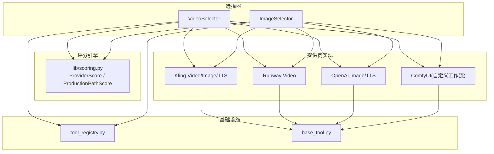
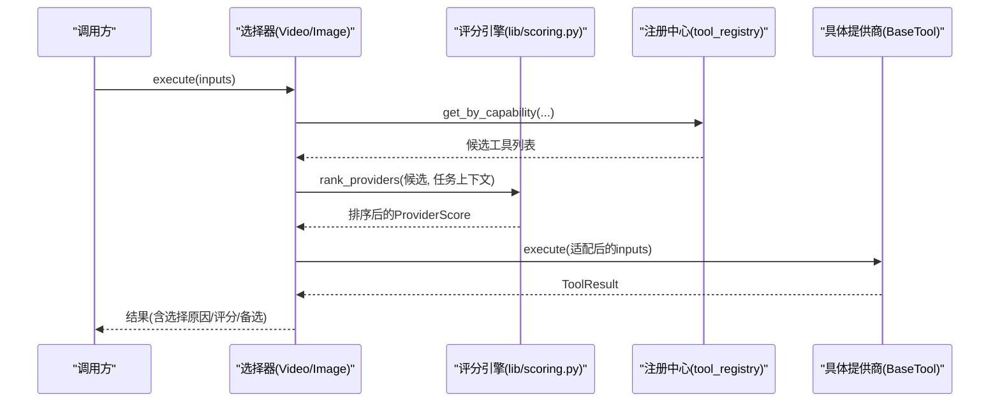
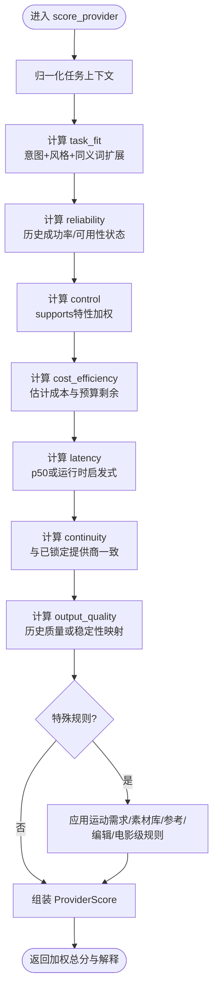
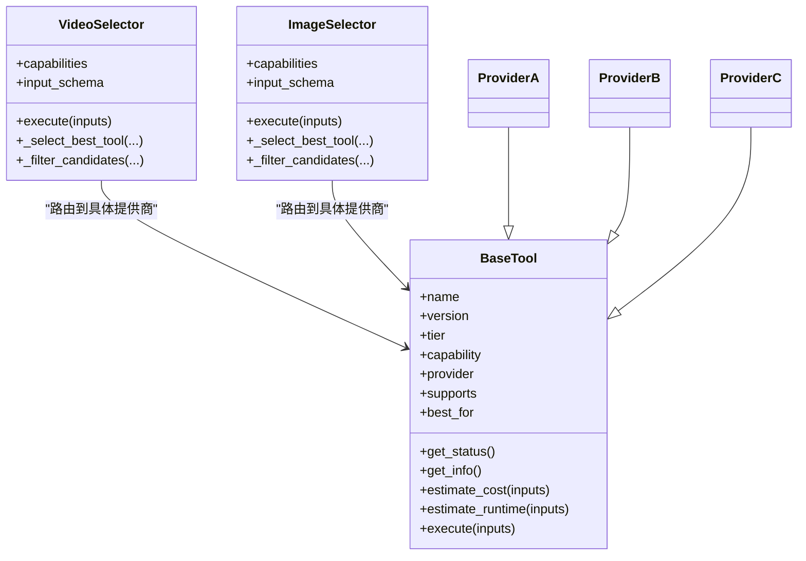
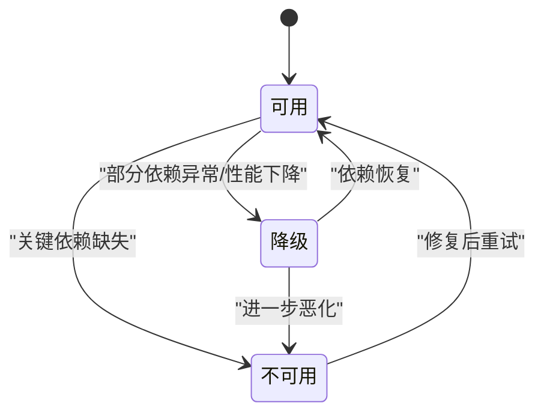
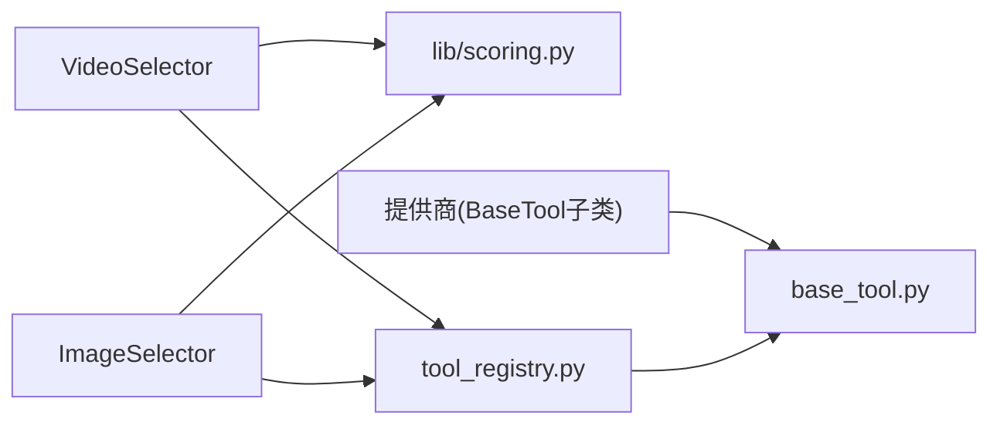

# 提供商选择与评分引擎

<cite>
**本文引用的文件**
- [lib/scoring.py](file://lib/scoring.py)
- [tools/video/video_selector.py](file://tools/video/video_selector.py)
- [tools/graphics/image_selector.py](file://tools/graphics/image_selector.py)
- [tools/base_tool.py](file://tools/base_tool.py)
- [tools/tool_registry.py](file://tools/tool_registry.py)
- [docs/comfyui-adapter-plan.md](file://docs/comfyui-adapter-plan.md)
- [.agents/skills/grok-media/SKILL.md](file://.agents/skills/grok-media/SKILL.md)
</cite>

## 目录
1. [简介](#简介)
2. [项目结构](#项目结构)
3. [核心组件](#核心组件)
4. [架构总览](#架构总览)
5. [详细组件分析](#详细组件分析)
6. [依赖关系分析](#依赖关系分析)
7. [性能考虑](#性能考虑)
8. [故障排查指南](#故障排查指南)
9. [结论](#结论)
10. [附录](#附录)

## 简介
本文件面向OpenMontage的“提供商选择与评分引擎”，系统性说明多维权重评分算法、提供商适配器模式、统一API路由、状态监控与故障转移、负载均衡策略，以及新增AI服务提供商的接入方式。同时给出性能优化建议（缓存、并发控制、资源管理），帮助读者在复杂的多供应商环境中稳定、可解释地选择最佳执行路径。

## 项目结构
OpenMontage采用“选择器 + 具体提供商”的分层设计：
- 能力级选择器：video_selector、image_selector，负责按任务上下文自动发现并筛选候选工具，调用评分引擎进行排序，最终委派到具体提供商执行。
- 提供商实现：每个AI服务（如Kling、Runway、OpenAI等）以独立工具类实现，遵循统一的BaseTool契约。
- 注册中心：tool_registry提供按能力、提供商、状态的查询与菜单汇总，支撑动态发现与可视化。
- 评分引擎：lib/scoring.py提供ProviderScore与ProductionPathScore，基于多维指标加权计算最优选择。

图示来源
- [tools/video/video_selector.py:15-45](file://tools/video/video_selector.py#L15-L45)
- [tools/graphics/image_selector.py:15-38](file://tools/graphics/image_selector.py#L15-L38)
- [lib/scoring.py:21-107](file://lib/scoring.py#L21-L107)
- [tools/tool_registry.py:153-171](file://tools/tool_registry.py#L153-L171)
- [tools/base_tool.py:227-372](file://tools/base_tool.py#L227-L372)

章节来源
- [tools/video/video_selector.py:15-45](file://tools/video/video_selector.py#L15-L45)
- [tools/graphics/image_selector.py:15-38](file://tools/graphics/image_selector.py#L15-L38)
- [tools/tool_registry.py:153-171](file://tools/tool_registry.py#L153-L171)
- [tools/base_tool.py:227-372](file://tools/base_tool.py#L227-L372)

## 核心组件
- ProviderScore：对单个提供商在特定任务上下文的七维评分（任务契合度、输出质量、可控性、可靠性、成本效率、延迟、连续性），并提供加权总分与可读解释。
- ProductionPathScore：对整条生产路径的综合评估（交付契合、质量契合、能力置信、回退完整性、预算契合、速度契合、可控性、一致性）。
- 选择器：video_selector与image_selector通过统一接口接收请求，标准化任务上下文，调用评分引擎排序，再委派到具体提供商执行；支持rank模式返回排名与解释。
- BaseTool：所有提供商的统一契约，包含状态检查、成本/时长估算、依赖校验、执行包装与事件埋点。
- ToolRegistry：按能力/提供商/状态检索工具，生成菜单与摘要，支撑动态发现与用户可见的可用性展示。

章节来源
- [lib/scoring.py:21-107](file://lib/scoring.py#L21-L107)
- [lib/scoring.py:373-542](file://lib/scoring.py#L373-L542)
- [tools/video/video_selector.py:308-466](file://tools/video/video_selector.py#L308-L466)
- [tools/graphics/image_selector.py:218-365](file://tools/graphics/image_selector.py#L218-L365)
- [tools/base_tool.py:227-372](file://tools/base_tool.py#L227-L372)
- [tools/tool_registry.py:153-171](file://tools/tool_registry.py#L153-L171)

## 架构总览
选择器作为能力入口，屏蔽底层提供商差异；评分引擎依据任务上下文与提供商元信息计算加权得分；具体提供商实现遵循BaseTool契约，暴露execute、estimate_cost、get_status等方法；注册中心提供动态发现与菜单聚合。

图示来源
- [tools/video/video_selector.py:308-366](file://tools/video/video_selector.py#L308-L366)
- [tools/graphics/image_selector.py:218-332](file://tools/graphics/image_selector.py#L218-L332)
- [lib/scoring.py:533-542](file://lib/scoring.py#L533-L542)
- [tools/tool_registry.py:153-171](file://tools/tool_registry.py#L153-L171)

## 详细组件分析

### 多维权重评分算法
- 维度定义与权重
  - 任务契合度(task_fit)：基于best_for与意图/风格关键词的语义匹配（含同义词扩展与重叠系数）。
  - 输出质量(output_quality)：优先使用历史质量分，否则基于稳定性与层级启发式。
  - 可控性(control)：根据supports中的创意控制特性加权（如controlnet、reference_image等）。
  - 可靠性(reliability)：历史成功率或可用性状态映射。
  - 成本效率(cost_efficiency)：结合预算剩余与估计成本映射为0-1分数。
  - 延迟(latency)：优先使用p50实测，否则按运行时代码类型启发式打分。
  - 连续性(continuity)：与已锁定提供商的一致性加分。
- 归一化任务上下文：将松散输入（intent/style/brief/needs/prompt等）标准化为评分器期望的结构，推导asset_type、motion_required、偏好生成视觉/参考条件/图像编辑等信号。
- 特殊规则：
  - 运动需求惩罚：视频任务需要运动但工具仅支持图片时大幅降低task_fit。
  - 素材库型提供商降权：当偏好生成视觉且为图/视频时，对stock-like提供商降权。
  - 参考条件增强：当需要参考条件且提供商支持reference_to_video/reference_image/multiple_reference_images时提升task_fit与控制力。
  - 图像编辑增强：当需要图像编辑且支持image_edit/style_transfer/multiple_reference_images时提升task_fit与控制力。
  - 电影级提示词奖励：当视频任务出现cinematic/film/trailer等信号，且提供商具备native_audio/multi_shot/camera_direction/lip_sync/cinematic_quality等高级特性时给予额外加分。

图示来源
- [lib/scoring.py:205-232](file://lib/scoring.py#L205-L232)
- [lib/scoring.py:234-295](file://lib/scoring.py#L234-L295)
- [lib/scoring.py:297-359](file://lib/scoring.py#L297-L359)
- [lib/scoring.py:373-530](file://lib/scoring.py#L373-L530)

章节来源
- [lib/scoring.py:21-107](file://lib/scoring.py#L21-L107)
- [lib/scoring.py:205-530](file://lib/scoring.py#L205-L530)

### 提供商适配器模式与统一API
- 统一契约：所有提供商继承BaseTool，必须实现execute，可选实现estimate_cost/estimate_runtime/get_status/check_dependencies等。BaseTool提供依赖校验、状态枚举、执行包装与事件埋点。
- 选择器路由：video_selector与image_selector通过capability自动发现候选工具，过滤操作能力（如image_to_video、reference_to_video、video_edit），并将共享输入键适配为各提供商所需字段（如prompt/query、image_url/images、model_name/model等）。
- 自定义工作流：当传入workflow_json/workflow_path与output_node时，选择器会路由到支持custom_workflow的提供商（如ComfyUI），依据后端可达性而非模型就绪度进行选择。

图示来源
- [tools/base_tool.py:227-372](file://tools/base_tool.py#L227-L372)
- [tools/video/video_selector.py:15-45](file://tools/video/video_selector.py#L15-L45)
- [tools/graphics/image_selector.py:15-38](file://tools/graphics/image_selector.py#L15-L38)

章节来源
- [tools/base_tool.py:227-372](file://tools/base_tool.py#L227-L372)
- [tools/video/video_selector.py:308-466](file://tools/video/video_selector.py#L308-L466)
- [tools/graphics/image_selector.py:218-365](file://tools/graphics/image_selector.py#L218-L365)

### 不同AI服务提供商集成方式
- Kling：提供视频、图像、TTS等多模态能力，作为具体工具类注册至registry，被选择器自动发现与路由。
- Runway：视频生成提供商，遵循BaseTool契约，支持operation过滤与参数透传。
- OpenAI：图像与TTS提供商，同样通过选择器路由，支持模型名、分辨率、水印等参数透传。
- ComfyUI：通过自定义工作流JSON与output_node接入，选择器依据supports.custom_workflow与后端可达性路由，不依赖本地模型就绪度。

章节来源
- [tools/video/video_selector.py:499-560](file://tools/video/video_selector.py#L499-L560)
- [tools/graphics/image_selector.py:414-459](file://tools/graphics/image_selector.py#L414-L459)
- [docs/comfyui-adapter-plan.md:31-49](file://docs/comfyui-adapter-plan.md#L31-L49)

### 提供商状态监控、故障转移与负载均衡
- 状态监控：BaseTool.get_status基于check_dependencies判断可用/不可用/降级；选择器聚合提供商状态，提供整体可用性视图。
- 故障转移：选择器维护fallback_tools_for，针对运动必需操作排除图片工具；当首选提供商不可用时，按评分排序回退到其他可用提供商。
- 负载均衡：评分引擎按多维加权排序，天然实现“质量/成本/延迟/可靠性”综合权衡；preferred_provider允许用户偏好，但需满足gap阈值才覆盖评分结果，避免劣化体验。

图示来源
- [tools/base_tool.py:296-303](file://tools/base_tool.py#L296-L303)
- [tools/video/video_selector.py:256-278](file://tools/video/video_selector.py#L256-L278)
- [tools/video/video_selector.py:416-438](file://tools/video/video_selector.py#L416-L438)

章节来源
- [tools/base_tool.py:296-303](file://tools/base_tool.py#L296-L303)
- [tools/video/video_selector.py:256-278](file://tools/video/video_selector.py#L256-L278)
- [tools/video/video_selector.py:416-438](file://tools/video/video_selector.py#L416-L438)

### 提供商配置管理与新增接入流程
- 配置加载：BaseTool在导入时加载.env环境变量，确保API密钥在工具实例化前可用。
- 注册与发现：新提供商只需继承BaseTool，声明name/version/tier/capability/provider/supports/best_for等字段，放入对应能力包（如tools/video/或tools/graphics/），即可被tool_registry自动发现。
- 选择器无侵入：选择器通过capability扫描注册表，无需修改路由逻辑即可纳入评分与路由。
- 自定义工作流：如需接入ComfyUI或其他外部后端，实现supports.custom_workflow并在选择器中满足output_node与可达性要求。

章节来源
- [tools/base_tool.py:25-60](file://tools/base_tool.py#L25-L60)
- [PROJECT_CONTEXT.md:114-124](file://PROJECT_CONTEXT.md#L114-L124)
- [tools/tool_registry.py:153-171](file://tools/tool_registry.py#L153-L171)
- [docs/comfyui-adapter-plan.md:31-49](file://docs/comfyui-adapter-plan.md#L31-L49)

## 依赖关系分析
- 选择器依赖评分引擎与注册中心：video_selector与image_selector均调用lib.scoring.rank_providers与tools.tool_registry.get_by_capability。
- 提供商依赖BaseTool契约：所有提供商实现execute、estimate_cost、get_status等，保证统一行为。
- 注册中心依赖工具元数据：通过get_info聚合能力、状态、支持特性，用于菜单与摘要。

图示来源
- [tools/video/video_selector.py:308-366](file://tools/video/video_selector.py#L308-L366)
- [tools/graphics/image_selector.py:218-332](file://tools/graphics/image_selector.py#L218-L332)
- [tools/tool_registry.py:153-171](file://tools/tool_registry.py#L153-L171)
- [tools/base_tool.py:227-372](file://tools/base_tool.py#L227-L372)

章节来源
- [tools/video/video_selector.py:308-366](file://tools/video/video_selector.py#L308-L366)
- [tools/graphics/image_selector.py:218-332](file://tools/graphics/image_selector.py#L218-L332)
- [tools/tool_registry.py:153-171](file://tools/tool_registry.py#L153-L171)
- [tools/base_tool.py:227-372](file://tools/base_tool.py#L227-L372)

## 性能考虑
- 缓存机制
  - 幂等键：BaseTool.idempotency_key基于指定字段生成哈希，可用于上层缓存去重（例如相同prompt/seed/模型的重复请求）。
  - 结果缓存：可在调用链上层基于idempotency_key缓存ToolResult，减少重复调用。
- 并发控制
  - 选择器串行评分：当前实现顺序计算rank_providers，适合中小规模候选集；若候选过多，可在选择器层引入并发评分与合并。
  - 提供商并发：具体提供商内部可并行发起网络请求（注意限流与重试）。
- 资源管理
  - 资源画像：BaseTool.resource_profile描述CPU/RAM/VRAM/Disk/Network需求，便于调度器做资源分配与隔离。
  - 超时与重试：可通过RetryPolicy与外层超时控制保护长耗时任务。
- 成本与延迟优化
  - 评分引擎已内置cost_efficiency与latency维度，结合预算剩余与p50延迟，自动倾向低成本/低延迟方案。
  - 自定义工作流：ComfyUI等后端可按硬件能力选择合适的工作流，避免本地模型就绪度限制。

章节来源
- [tools/base_tool.py:110-126](file://tools/base_tool.py#L110-L126)
- [tools/base_tool.py:374-390](file://tools/base_tool.py#L374-L390)
- [lib/scoring.py:259-282](file://lib/scoring.py#L259-L282)
- [lib/scoring.py:424-445](file://lib/scoring.py#L424-L445)

## 故障排查指南
- 提供商不可用
  - 检查BaseTool.check_dependencies是否抛出DependencyError（环境变量、命令、模块缺失）。
  - 查看选择器返回的alternatives_considered与fallback_tools_for，确认是否有可用替代。
- 评分异常
  - 检查任务上下文是否完整（intent/style/needs/prompt），必要时使用rank模式观察normalized_task_context。
  - 关注special rules是否导致降权（如素材库提供商在生成视觉场景下被降权）。
- 自定义工作流失败
  - 确认supports.custom_workflow为真、提供output_node，且后端状态非UNAVAILABLE。
- 错误处理规范
  - 遵循技能文档中的失败处理约定：保留端点、模式与提示摘要，避免静默替换已选提供商。

章节来源
- [tools/base_tool.py:296-327](file://tools/base_tool.py#L296-L327)
- [tools/video/video_selector.py:352-366](file://tools/video/video_selector.py#L352-L366)
- [tools/graphics/image_selector.py:320-332](file://tools/graphics/image_selector.py#L320-L332)
- [.agents/skills/grok-media/SKILL.md:127-132](file://.agents/skills/grok-media/SKILL.md#L127-L132)

## 结论
OpenMontage通过“选择器 + 评分引擎 + 统一契约”的架构，实现了跨AI服务提供商的智能选择与路由。多维权重评分确保每次选择都可解释、可追溯；适配器模式屏蔽了底层差异；状态监控与回退机制提升了鲁棒性；注册中心与自定义工作流支持灵活扩展。配合缓存、并发与资源管理策略，可在复杂环境中稳定高效地交付媒体生成任务。

## 附录
- 快速上手
  - 新增提供商：继承BaseTool，声明必要字段，放入对应能力包，即可被选择器自动发现与评分。
  - 使用rank模式：在选择器传入operation="rank"，获取评分排名与解释，辅助调试与调优。
  - 自定义工作流：传入workflow_json/workflow_path与output_node，路由到支持custom_workflow的后端。

章节来源
- [PROJECT_CONTEXT.md:114-124](file://PROJECT_CONTEXT.md#L114-L124)
- [tools/video/video_selector.py:313-326](file://tools/video/video_selector.py#L313-L326)
- [tools/graphics/image_selector.py:226-236](file://tools/graphics/image_selector.py#L226-L236)
- [docs/comfyui-adapter-plan.md:31-49](file://docs/comfyui-adapter-plan.md#L31-L49)