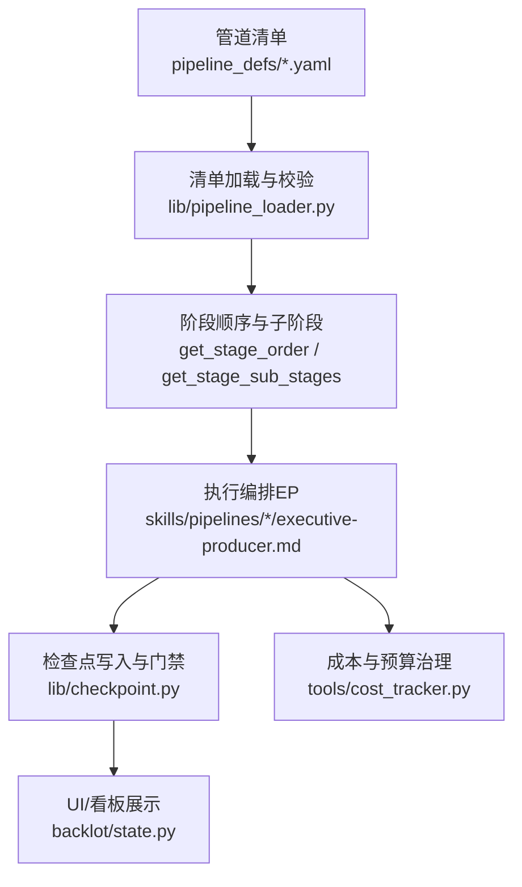
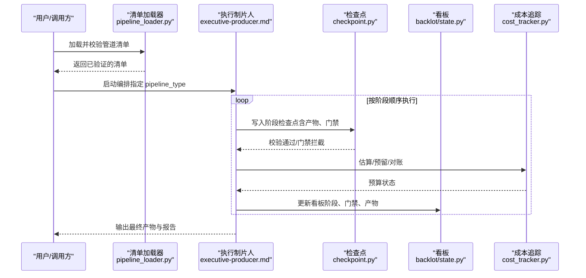
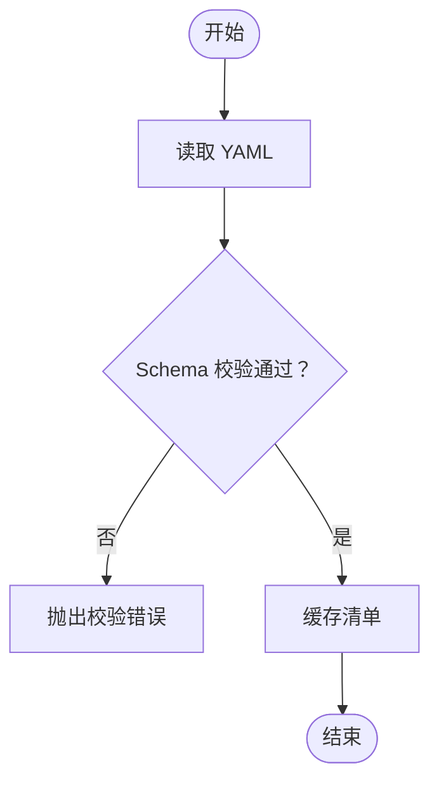
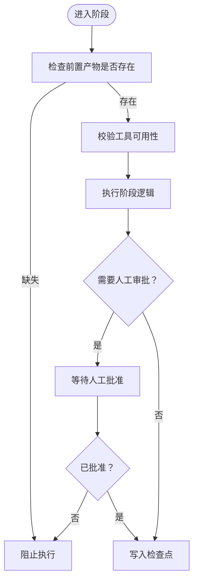
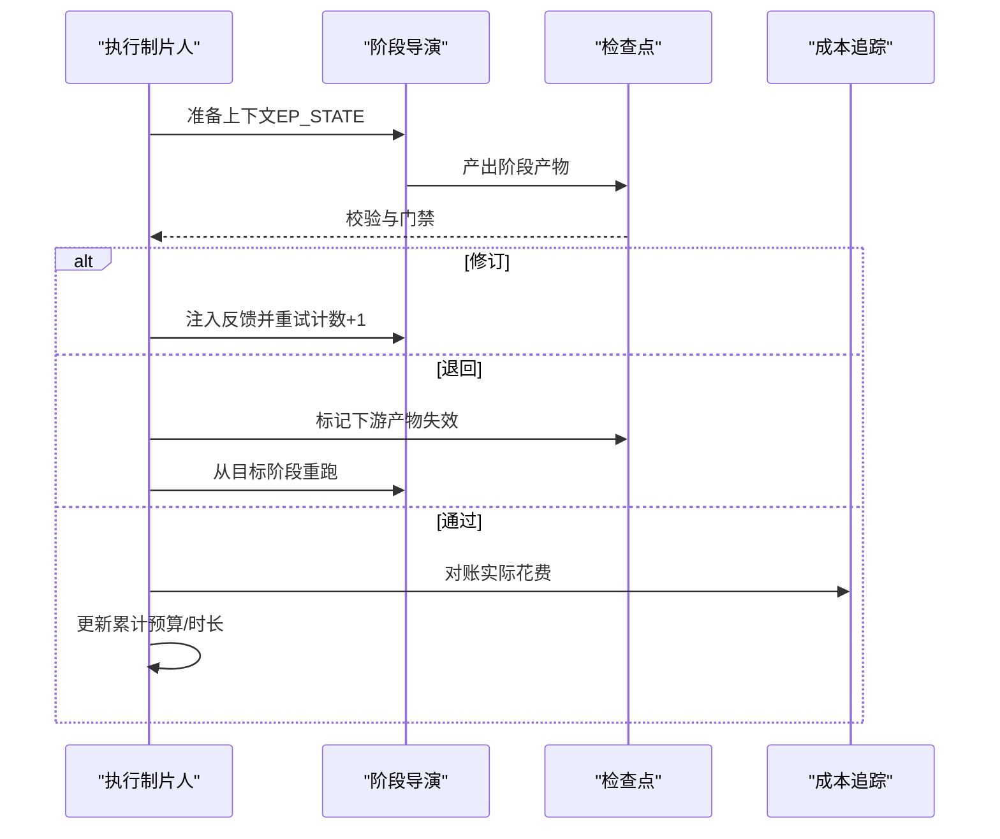
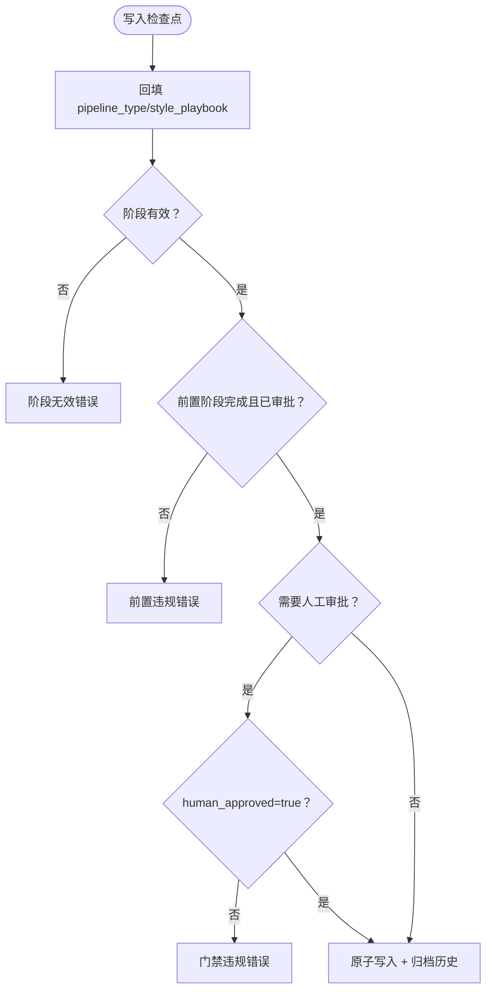
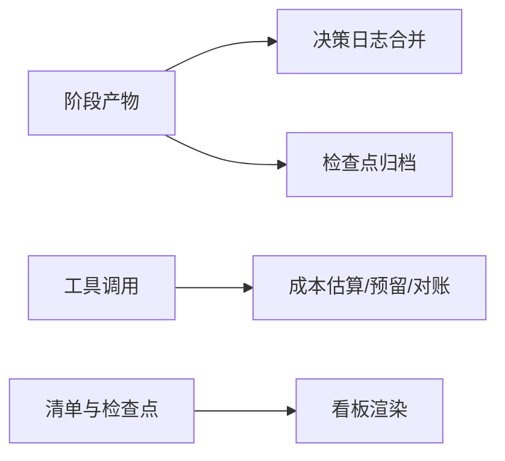
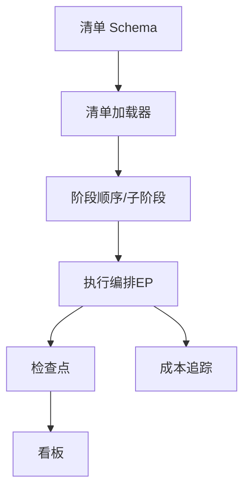

# 管道执行与编排

<cite>
**本文引用的文件**
- [pipeline_loader.py](file://lib/pipeline_loader.py)
- [checkpoint.py](file://lib/checkpoint.py)
- [pipeline_manifest.schema.json](file://schemas/pipelines/pipeline_manifest.schema.json)
- [talking-head.yaml](file://pipeline_defs/talking-head.yaml)
- [cinematic.yaml](file://pipeline_defs/cinematic.yaml)
- [executive-producer.md（说话人）](file://skills/pipelines/talking-head/executive-producer.md)
- [executive-producer.md（说明视频）](file://skills/pipelines/explainer/executive-producer.md)
- [state.py（Backlot）](file://backlot/state.py)
- [cost_tracker.py](file://tools/cost_tracker.py)
- [test_pipeline_catalog.py](file://tests/contracts/test_pipeline_catalog.py)
- [test_runtime_presentation_contract.py](file://tests/contracts/test_runtime_presentation_contract.py)
</cite>

## 目录
1. [简介](#简介)
2. [项目结构](#项目结构)
3. [核心组件](#核心组件)
4. [架构总览](#架构总览)
5. [详细组件分析](#详细组件分析)
6. [依赖关系分析](#依赖关系分析)
7. [性能考量](#性能考量)
8. [故障排查指南](#故障排查指南)
9. [结论](#结论)
10. [附录](#附录)

## 简介
本文件面向 OpenMontage 的“管道执行与编排系统”，聚焦以下目标：
- 解释管道清单（YAML）如何被解析、校验，以及阶段定义、依赖关系和执行顺序控制机制。
- 阐述执行引擎如何处理复杂工作流：串行/条件子阶段、人工门禁、错误恢复与回退。
- 说明管道模板系统与参数化配置方式，帮助创建可复用、可组合的管道。
- 提供调试工具与实践建议：日志、决策记录、成本追踪、性能瓶颈定位与资源使用。
- 总结最佳实践：错误处理、重试策略、超时管理与预算治理。

## 项目结构
OpenMontage 将“管道”以声明式 YAML 清单描述，并通过加载器与校验器在运行时解析；执行过程通过检查点（Checkpoint）持久化状态，结合“执行制片人（Executive Producer, EP）”技能进行编排。

图表来源
- [pipeline_loader.py:49-70](file://lib/pipeline_loader.py#L49-L70)
- [pipeline_loader.py:98-149](file://lib/pipeline_loader.py#L98-L149)
- [checkpoint.py:422-564](file://lib/checkpoint.py#L422-L564)
- [state.py:63-94](file://backlot/state.py#L63-L94)
- [cost_tracker.py:40-179](file://tools/cost_tracker.py#L40-L179)

章节来源
- [pipeline_loader.py:1-77](file://lib/pipeline_loader.py#L1-L77)
- [pipeline_manifest.schema.json:1-196](file://schemas/pipelines/pipeline_manifest.schema.json#L1-L196)
- [test_pipeline_catalog.py:1-36](file://tests/contracts/test_pipeline_catalog.py#L1-L36)

## 核心组件
- 清单加载与校验：读取 YAML，按 JSON Schema 校验，缓存结果避免重复解析。
- 阶段与子阶段：声明阶段顺序、前置产物、工具能力、审查焦点与成功标准；支持基于条件的子阶段。
- 执行编排（EP）：按阶段串行执行，内置修订、退回与上限控制，维护累计状态（预算、时长等）。
- 检查点与门禁：每个阶段产出检查点，强制前置完成与人工审批门禁，归档历史版本。
- 成本与预算：估算、预留、对账与超支保护，支持观察/警告/封顶模式。
- UI/看板：从清单与检查点推导当前阶段、门禁标记与产物，驱动可视化界面。

章节来源
- [pipeline_loader.py:49-149](file://lib/pipeline_loader.py#L49-L149)
- [checkpoint.py:51-76](file://lib/checkpoint.py#L51-L76)
- [checkpoint.py:251-346](file://lib/checkpoint.py#L251-L346)
- [checkpoint.py:422-564](file://lib/checkpoint.py#L422-L564)
- [cost_tracker.py:40-179](file://tools/cost_tracker.py#L40-L179)
- [state.py:63-94](file://backlot/state.py#L63-L94)

## 架构总览
下图展示了从清单到执行、再到持久化与可视化的整体流程。

图表来源
- [pipeline_loader.py:49-70](file://lib/pipeline_loader.py#L49-L70)
- [executive-producer.md（说话人）:103-150](file://skills/pipelines/talking-head/executive-producer.md#L103-L150)
- [checkpoint.py:422-564](file://lib/checkpoint.py#L422-L564)
- [cost_tracker.py:101-179](file://tools/cost_tracker.py#L101-L179)
- [state.py:63-94](file://backlot/state.py#L63-L94)

## 详细组件分析

### 清单解析与校验（YAML → 结构化清单）
- 清单路径与缓存：清单位于 pipeline_defs/*.yaml，加载后通过 JSON Schema 校验，并使用 lru_cache 缓存以避免重复 IO 与校验。
- 字段约束：name/version/stages 为必填；stages 内包含 name、produces、required_artifacts_in、optional_artifacts_in、tools_available、review_focus、success_criteria、human_approval_default、sub_stages 等。
- 扩展能力开关：extensions 控制是否允许自定义脚本、玩法、技能或工具。
- 参考输入：reference_input 声明是否支持参考视频及分析深度与工具。

图表来源
- [pipeline_loader.py:27-70](file://lib/pipeline_loader.py#L27-L70)
- [pipeline_manifest.schema.json:1-196](file://schemas/pipelines/pipeline_manifest.schema.json#L1-L196)

章节来源
- [pipeline_loader.py:27-70](file://lib/pipeline_loader.py#L27-L70)
- [pipeline_manifest.schema.json:1-196](file://schemas/pipelines/pipeline_manifest.schema.json#L1-L196)

### 阶段定义、依赖与执行顺序
- 阶段顺序：通过 get_stage_order 提取 stages 的顺序；当 include_sub_stages=True 时，会展开子阶段并以 stage.sub_stage 形式暴露给代理。
- 依赖关系：required_artifacts_in 声明前置产物；produces 声明本阶段产物；tools_available/required_tools/optional_tools 声明可用工具集合。
- 子阶段与条件：sub_stages 支持 condition 字段，由 _condition_is_active 根据上下文决定是否激活。
- 人类门禁：human_approval_default 决定该阶段是否需要人工批准；未满足前置或门禁不通过时，检查点写入会被拒绝。

图表来源
- [pipeline_loader.py:98-149](file://lib/pipeline_loader.py#L98-L149)
- [checkpoint.py:251-346](file://lib/checkpoint.py#L251-L346)
- [checkpoint.py:422-564](file://lib/checkpoint.py#L422-L564)

章节来源
- [pipeline_loader.py:98-149](file://lib/pipeline_loader.py#L98-L149)
- [checkpoint.py:251-346](file://lib/checkpoint.py#L251-L346)
- [checkpoint.py:422-564](file://lib/checkpoint.py#L422-L564)

### 执行编排（EP）与复杂工作流
- 串行执行：EP 按清单顺序依次执行各阶段，注入 EP_STATE（包括预算、风格锚点、前序产物）作为上下文。
- 评审与门禁：每阶段完成后进行 schema 校验、审查焦点与成功标准核对，必要时触发修订或退回。
- 修订与退回：支持 max_revisions_per_stage 与 max_send_backs 限制，防止无限循环；退回会失效下游产物并重跑。
- 条件分支：子阶段可通过 condition 在特定上下文中激活（如 reference video analysis brief 存在时生成样本预览）。

图表来源
- [executive-producer.md（说话人）:103-150](file://skills/pipelines/talking-head/executive-producer.md#L103-L150)
- [executive-producer.md（说明视频）:93-137](file://skills/pipelines/explainer/executive-producer.md#L93-L137)
- [cost_tracker.py:101-179](file://tools/cost_tracker.py#L101-L179)

章节来源
- [executive-producer.md（说话人）:103-150](file://skills/pipelines/talking-head/executive-producer.md#L103-L150)
- [executive-producer.md（说明视频）:93-137](file://skills/pipelines/explainer/executive-producer.md#L93-L137)

### 检查点与门禁机制
- 写入流程：write_checkpoint 先回填项目标识（pipeline_type/style_playbook），再校验阶段合法性、前置门禁与产物 schema，最后原子写入并归档历史。
- 门禁规则：若 human_approval_default=true 或 caller 显式要求，则必须 human_approved=true 才能写入 completed；否则抛出门禁违规错误。
- 前置检查：仅当状态为 awaiting_human/completed 时检查前置阶段是否已完成且已通过必要审批。
- 决策日志：合并 decision_log 到项目级文件，并在 proposal_packet/render_report 中引用。

图表来源
- [checkpoint.py:422-564](file://lib/checkpoint.py#L422-L564)
- [checkpoint.py:251-346](file://lib/checkpoint.py#L251-L346)

章节来源
- [checkpoint.py:251-346](file://lib/checkpoint.py#L251-L346)
- [checkpoint.py:422-564](file://lib/checkpoint.py#L422-L564)

### 管道模板与参数化配置
- 模板即清单：每个 pipeline_defs/*.yaml 是一个可复用的管道模板，包含名称、版本、类别、稳定性、兼容玩法、必需技能、编排配置与阶段定义。
- 参数化要点：
  - orchestration：mode/skill/budget_default_usd/max_revisions_per_stage/max_send_backs/max_wall_time_minutes。
  - extensions：控制是否允许自定义脚本/玩法/技能/工具。
  - reference_input：是否启用参考视频输入与分析深度。
  - stages.*：每个阶段的 skill、produces、required_artifacts_in、tools_available、review_focus、success_criteria、human_approval_default、sub_stages。
- 示例：
  - talking-head.yaml：定义了 idea→script→scene_plan→assets→edit→compose→publish 的串行流水线，并在 compose 阶段集成多种可选增强工具。
  - cinematic.yaml：支持参考视频输入（deep 分析）、proposal 子阶段 sample（条件激活），以及更丰富的工具链。

章节来源
- [pipeline_manifest.schema.json:1-196](file://schemas/pipelines/pipeline_manifest.schema.json#L1-L196)
- [talking-head.yaml:1-229](file://pipeline_defs/talking-head.yaml#L1-L229)
- [cinematic.yaml:1-288](file://pipeline_defs/cinematic.yaml#L1-L288)

### 调试工具与可观测性
- 决策日志：每个阶段可将决策写入 decision_log，并被合并到项目级 decision_log.json，便于审计与回放。
- 检查点历史：每次覆盖非 in_progress 的检查点都会归档至 history/，保留版本轨迹。
- 成本追踪：CostTracker 提供估算、预留、对账、退款与预算模式（观察/警告/封顶），支持单动作审批阈值与新付费工具首次使用审批。
- 看板状态：Backlot 从清单与检查点推导阶段顺序、门禁标记与产物，用于可视化呈现。

图表来源
- [checkpoint.py:388-419](file://lib/checkpoint.py#L388-L419)
- [checkpoint.py:349-386](file://lib/checkpoint.py#L349-L386)
- [cost_tracker.py:101-179](file://tools/cost_tracker.py#L101-L179)
- [state.py:63-94](file://backlot/state.py#L63-L94)

章节来源
- [checkpoint.py:349-419](file://lib/checkpoint.py#L349-L419)
- [cost_tracker.py:101-179](file://tools/cost_tracker.py#L101-L179)
- [state.py:63-94](file://backlot/state.py#L63-L94)

## 依赖关系分析
- 清单加载器依赖 JSON Schema 校验，确保所有清单结构一致。
- 检查点模块依赖清单的阶段顺序与门禁策略，保证执行一致性。
- 看板依赖清单与检查点，用于展示当前进度与门禁状态。
- 成本追踪独立于执行流，但被 EP 在关键节点调用，影响预算与审批。

图表来源
- [pipeline_manifest.schema.json:1-196](file://schemas/pipelines/pipeline_manifest.schema.json#L1-L196)
- [pipeline_loader.py:49-149](file://lib/pipeline_loader.py#L49-L149)
- [checkpoint.py:422-564](file://lib/checkpoint.py#L422-L564)
- [cost_tracker.py:40-179](file://tools/cost_tracker.py#L40-L179)
- [state.py:63-94](file://backlot/state.py#L63-L94)

章节来源
- [pipeline_loader.py:49-149](file://lib/pipeline_loader.py#L49-L149)
- [checkpoint.py:422-564](file://lib/checkpoint.py#L422-L564)
- [cost_tracker.py:40-179](file://tools/cost_tracker.py#L40-L179)
- [state.py:63-94](file://backlot/state.py#L63-L94)

## 性能考量
- 清单加载缓存：使用 lru_cache 缓存清单与 Schema，减少重复 IO 与校验开销。
- 子阶段按需展开：仅在 include_sub_stages=True 且 context 匹配时展开，避免不必要的计算。
- 检查点原子写入：临时文件 + os.replace 保证写入原子性，降低损坏风险。
- 成本预估缓冲：CostTracker 在估算中加入重试与浪费缓冲，避免低估导致频繁超支。
- 看板状态派生：对清单与检查点的读取采用缓存与容错降级，保障 UI 响应。

[本节为通用指导，无需具体文件引用]

## 故障排查指南
- 清单无法加载或校验失败：确认 pipeline_defs/*.yaml 存在且符合 Schema；查看加载器抛出的 FileNotFoundError 或 jsonschema.ValidationError。
- 阶段顺序异常：检查 manifest.stages 顺序与 required_artifacts_in；使用 get_stage_order 获取预期顺序。
- 门禁违规：若 human_approval_default=true，需先写 awaiting_human，待人工批准后写 completed 并设置 human_approved=true。
- 前置阶段未完成：检查前置阶段检查点是否存在且 status=completed；若有但未审批，需补齐审批。
- 成本超支：在 CAP 模式下会抛出 BudgetExceededError；在 WARN 模式下会记录预算警告；调整 budget_total_usd 或 reserve_pct。
- 看板显示不一致：确认 project marker 中的 pipeline_type 与 style_playbook；检查 Backlot 的状态派生逻辑。

章节来源
- [pipeline_loader.py:49-70](file://lib/pipeline_loader.py#L49-L70)
- [checkpoint.py:251-346](file://lib/checkpoint.py#L251-L346)
- [checkpoint.py:422-564](file://lib/checkpoint.py#L422-L564)
- [cost_tracker.py:101-179](file://tools/cost_tracker.py#L101-L179)
- [state.py:63-94](file://backlot/state.py#L63-L94)

## 结论
OpenMontage 的管道执行与编排系统通过“声明式清单 + 执行制片人 + 检查点门禁 + 成本治理”的组合，实现了可验证、可审计、可回滚、可预算控制的复杂媒体生产流水线。清单驱动的阶段顺序与依赖管理确保了执行的一致性；EP 的修订与退回机制提供了灵活的质量门控；检查点与决策日志提供了完整的可观测性与回溯能力；成本追踪保障了预算可控。遵循本文的最佳实践，可以构建稳定、高效、可复用的管道模板与参数化配置。

[本节为总结，无需具体文件引用]

## 附录
- 开发最佳实践
  - 错误处理：优先使用 schema 校验与门禁拦截，尽早失败；对不可重试的错误直接上报，对可重试错误采用指数退避与最大重试次数。
  - 重试策略：在工具层实现分类错误（可重试/不可重试），并结合 CostTracker 的重试缓冲；在 EP 层限制 max_revisions_per_stage 与 max_send_backs。
  - 超时管理：在 orchestration.max_wall_time_minutes 中设置全局超时；在长耗时阶段内部实现心跳与中断检测。
  - 预算治理：合理设置 budget_default_usd、reserve_pct 与 single_action_approval_usd；对新付费工具启用首次使用审批。
  - 可观测性：在每个阶段记录决策日志；利用检查点历史与成本日志进行问题定位与复盘。

[本节为通用指导，无需具体文件引用]