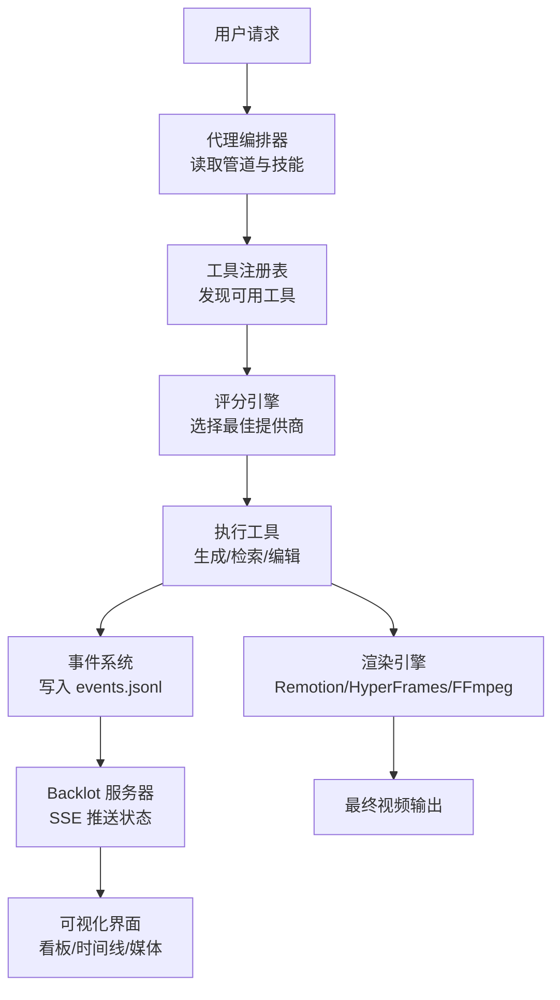
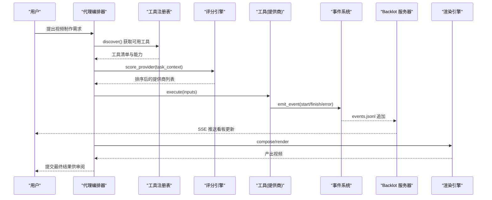
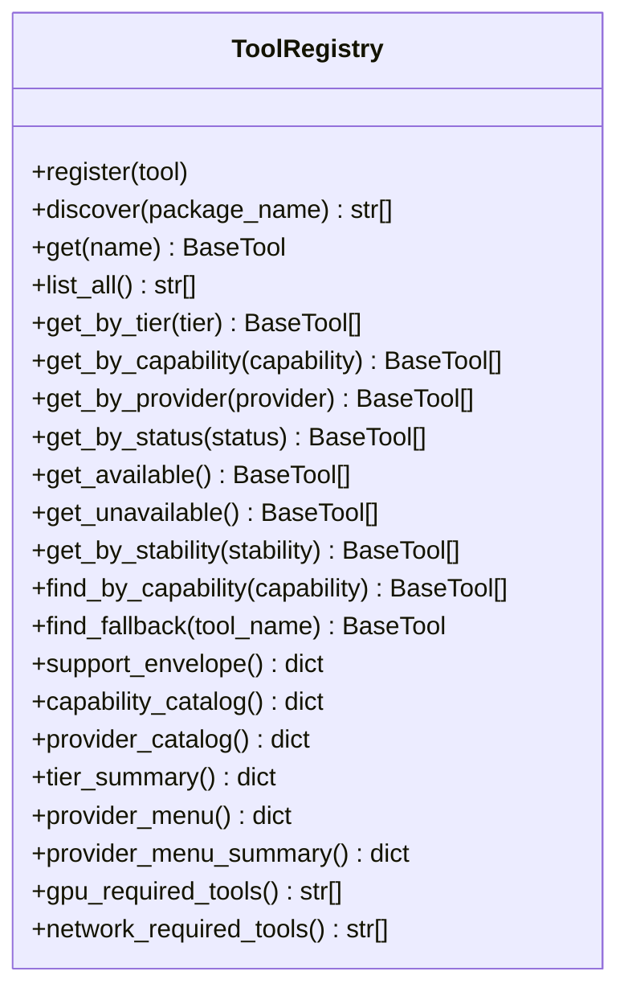
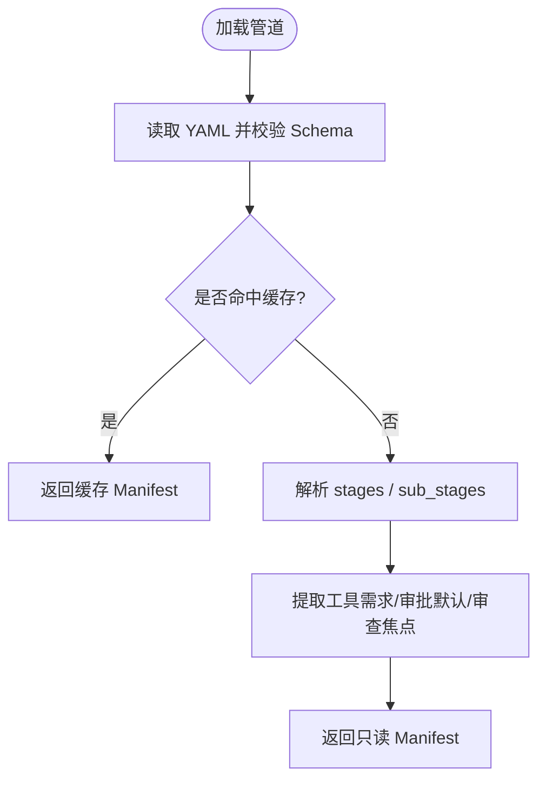
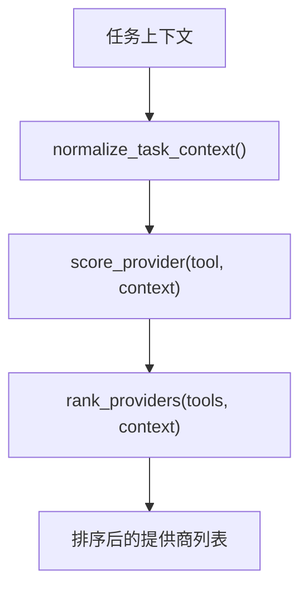
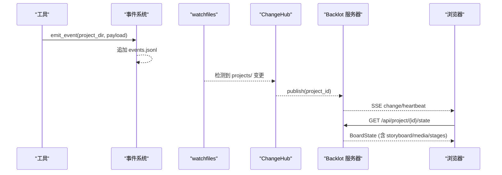
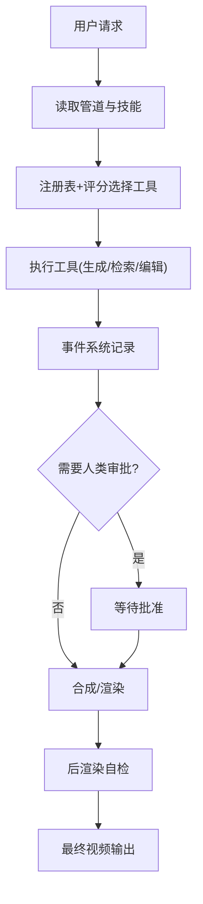
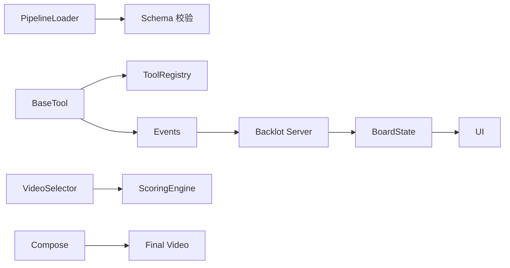

# 技术架构概览

<cite>
**本文引用的文件**
- [README.md](file://README.md)
- [tools/tool_registry.py](file://tools/tool_registry.py)
- [lib/pipeline_loader.py](file://lib/pipeline_loader.py)
- [lib/scoring.py](file://lib/scoring.py)
- [lib/events.py](file://lib/events.py)
- [tools/base_tool.py](file://tools/base_tool.py)
- [backlot/server.py](file://backlot/server.py)
- [backlot/state.py](file://backlot/state.py)
- [pipeline_defs/documentary-montage.yaml](file://pipeline_defs/documentary-montage.yaml)
- [tools/video/video_selector.py](file://tools/video/video_selector.py)
</cite>

## 目录
1. [简介](#简介)
2. [项目结构](#项目结构)
3. [核心组件](#核心组件)
4. [架构总览](#架构总览)
5. [详细组件分析](#详细组件分析)
6. [依赖关系分析](#依赖关系分析)
7. [性能考量](#性能考量)
8. [故障排查指南](#故障排查指南)
9. [结论](#结论)
10. [附录](#附录)

## 简介
OpenMontage 是一个以“代理优先”的开源视频生产系统。它把 AI 编码助手作为编排器，通过声明式管道（YAML）与技能（Markdown）驱动，自动完成从研究、提案、脚本、分镜、素材生成到剪辑、合成与发布的全流程。系统提供三层知识架构：工具层（tools/ + pipeline_defs/）、技能层（skills/）和外部技术知识层（.agents/skills/），并通过注册表、评分引擎、事件系统等基础设施实现可观测、可治理、可扩展的视频流水线。

## 项目结构
- 工具层（tools/ + pipeline_defs/）：定义“能做什么”与“如何编排”。工具按能力分类（video/audio/graphics/enhancement/analysis/avatar/subtitle），每个工具继承统一基类并声明契约；管道定义以 YAML 描述阶段、所需工具、审查要点与成功标准。
- 技能层（skills/）：定义“如何使用”。包含各管道的导演技能、创作技巧、核心工具使用指南以及元技能（评审、检查点协议）。
- 外部技术知识层（.agents/skills/）：定义“底层技术如何工作”。为具体模型/平台提供深度参考，工具可通过 agent_skills 引用这些知识包，辅助提示工程与调用策略。

图表来源
- [tools/tool_registry.py:118-134](file://tools/tool_registry.py#L118-L134)
- [lib/scoring.py:373-542](file://lib/scoring.py#L373-L542)
- [lib/events.py:77-95](file://lib/events.py#L77-L95)
- [backlot/server.py:165-240](file://backlot/server.py#L165-L240)
- [backlot/state.py:588-658](file://backlot/state.py#L588-L658)

章节来源
- [README.md:450-486](file://README.md#L450-L486)

## 核心组件
- 工具注册表机制：自动扫描 tools/ 包，发现所有继承自 BaseTool 的具体类并注册；支持按能力、提供商、稳定性、状态等维度查询；提供 provider_menu_summary 用于预检菜单展示。
- 管道加载器：加载并校验 pipeline_defs/*.yaml，缓存 manifest，提取阶段顺序、子阶段、必需工具、人类审批默认值与扩展权限。
- 评分引擎：对候选提供商进行七维加权评分（任务契合度、输出质量、可控性、可靠性、成本效率、延迟、连续性），并支持语义同义词扩展、预算约束、运动需求惩罚与“电影级”特性加分。
- 事件系统：BaseTool.execute 被装饰器自动注入事件发射；根据输入推断项目目录，追加 events.jsonl；Backlot 通过 SSE 实时推送变更。
- Backlot 监控界面：FastAPI 服务监听 projects/ 文件系统变化，聚合 checkpoint、artifacts、events，构建 BoardState，提供项目列表、单项目状态、事件流、缩略图与媒体访问。

章节来源
- [tools/tool_registry.py:55-134](file://tools/tool_registry.py#L55-L134)
- [lib/pipeline_loader.py:39-77](file://lib/pipeline_loader.py#L39-L77)
- [lib/scoring.py:21-107](file://lib/scoring.py#L21-L107)
- [tools/base_tool.py:148-235](file://tools/base_tool.py#L148-L235)
- [backlot/server.py:165-240](file://backlot/server.py#L165-L240)
- [backlot/state.py:588-658](file://backlot/state.py#L588-L658)

## 架构总览
OpenMontage 采用“代理编排 + 声明式管道 + 插件化工具”的架构。AI 编码助手充当编排器，按管道阶段依次读取技能、调用工具、自我评审、保存检查点并在创意决策点暂停等待人类批准。工具通过注册表动态发现，提供商选择由评分引擎决定，事件系统保证全链路可观测，Backlot 提供实时可视化。

图表来源
- [tools/tool_registry.py:118-134](file://tools/tool_registry.py#L118-L134)
- [lib/scoring.py:373-542](file://lib/scoring.py#L373-L542)
- [tools/base_tool.py:148-235](file://tools/base_tool.py#L148-L235)
- [lib/events.py:77-95](file://lib/events.py#L77-L95)
- [backlot/server.py:165-240](file://backlot/server.py#L165-L240)

## 详细组件分析

### 工具注册表机制
- 自动发现：discover(package_name="tools") 遍历子模块，跳过 base_tool 与 tool_registry，实例化每个非抽象的 BaseTool 子类并注册。
- 能力查询：支持按 tier、capability、provider、status、stability 过滤；find_by_capability 基于 capabilities 字段匹配。
- 支持信封与菜单：support_envelope() 汇总工具契约信息；provider_menu() 与 provider_menu_summary() 生成面向用户的预检菜单，包括可用/不可用提供商、安装提示、运行时警告。
- 回退工具：find_fallback() 根据工具的 fallback/fallback_tools 查找可用替代。

图表来源
- [tools/tool_registry.py:55-493](file://tools/tool_registry.py#L55-L493)

章节来源
- [tools/tool_registry.py:55-134](file://tools/tool_registry.py#L55-L134)
- [tools/tool_registry.py:198-314](file://tools/tool_registry.py#L198-L314)
- [tools/tool_registry.py:316-471](file://tools/tool_registry.py#L316-L471)

### 管道加载器
- 加载与校验：load_pipeline(name, defs_dir) 读取 YAML 并使用 schemas/pipelines/pipeline_manifest.schema.json 校验。
- 缓存：_load_pipeline_cached 使用 lru_cache 避免重复解析与验证。
- 阶段与子阶段：get_stage_order() 返回主阶段与可选子阶段顺序；get_stage_sub_stages() 支持条件过滤。
- 工具需求：get_required_tools() 收集 preferred_tools、fallback_tools、tools_available 及参考输入分析工具。
- 人类审批与审查焦点：get_stage_human_approval_default()、get_stage_review_focus()。
- 扩展权限：check_extension_permitted()、get_permitted_extensions() 控制 custom_scripts/playbooks/skills/tools 的使用。

图表来源
- [lib/pipeline_loader.py:27-77](file://lib/pipeline_loader.py#L27-L77)
- [lib/pipeline_loader.py:98-162](file://lib/pipeline_loader.py#L98-L162)
- [lib/pipeline_loader.py:165-241](file://lib/pipeline_loader.py#L165-L241)

章节来源
- [lib/pipeline_loader.py:39-77](file://lib/pipeline_loader.py#L39-L77)
- [lib/pipeline_loader.py:98-162](file://lib/pipeline_loader.py#L98-L162)
- [lib/pipeline_loader.py:165-241](file://lib/pipeline_loader.py#L165-L241)

### 评分引擎
- ProviderScore：封装七维评分与加权总分，支持解释输出。
- ProductionPathScore：评估整条生产路径的多维得分。
- normalize_task_context：将松散的任务上下文标准化为意图、风格关键词、资产类型、预算、锁定提供商等。
- 评分函数：score_provider() 综合 best_for、supports、历史成功率、估计成本、延迟、连续性、运动需求、图像编辑需求、电影级特性等计算分数；rank_providers() 排序；format_ranking() 格式化展示。

图表来源
- [lib/scoring.py:21-107](file://lib/scoring.py#L21-L107)
- [lib/scoring.py:297-359](file://lib/scoring.py#L297-L359)
- [lib/scoring.py:373-542](file://lib/scoring.py#L373-L542)

章节来源
- [lib/scoring.py:21-107](file://lib/scoring.py#L21-L107)
- [lib/scoring.py:373-542](file://lib/scoring.py#L373-L542)

### 事件系统与 Backlot 实时监控
- 事件写入：BaseTool.execute 被 _instrument_execute 包装，自动推断 project_dir 并写入 events.jsonl；失败不抛错，确保可观测性不影响生产。
- 事件读取：read_events() 容忍损坏行，返回最近 N 条事件。
- Backlot 服务器：FastAPI 应用提供健康检查、项目列表、项目状态、事件流（SSE）、缩略图与媒体访问；watchfiles 监听 projects/ 变更，去抖后通过 ChangeHub 广播。
- 看板状态：state.load_board_state() 聚合 checkpoint、history、artifacts、events，构建 storyboard、media、stage rail，检测空闲与停滞，输出完整 BoardState。

图表来源
- [tools/base_tool.py:148-235](file://tools/base_tool.py#L148-L235)
- [lib/events.py:46-119](file://lib/events.py#L46-L119)
- [backlot/server.py:132-149](file://backlot/server.py#L132-L149)
- [backlot/server.py:165-240](file://backlot/server.py#L165-L240)
- [backlot/state.py:588-658](file://backlot/state.py#L588-L658)

章节来源
- [lib/events.py:46-119](file://lib/events.py#L46-L119)
- [backlot/server.py:165-240](file://backlot/server.py#L165-L240)
- [backlot/state.py:588-658](file://backlot/state.py#L588-L658)

### 数据流：从用户请求到最终视频输出
- 用户向代理提出需求。
- 代理读取管道定义（YAML）与阶段技能（Markdown），确定当前阶段与所需工具。
- 通过工具注册表发现可用工具，使用评分引擎选择最佳提供商。
- 调用工具执行（如视频生成、素材检索、音频混音、字幕生成等），工具在执行前后写入事件。
- Backlot 实时显示进度与状态，必要时暂停等待人类审批。
- 进入合成阶段，选择渲染引擎（Remotion/HyperFrames/FFmpeg）产出最终视频。
- 通过后处理自检（ffprobe、帧采样、音频分析、承诺验证）输出成品。

图表来源
- [pipeline_defs/documentary-montage.yaml:45-179](file://pipeline_defs/documentary-montage.yaml#L45-L179)
- [tools/base_tool.py:148-235](file://tools/base_tool.py#L148-L235)
- [lib/scoring.py:373-542](file://lib/scoring.py#L373-L542)

章节来源
- [pipeline_defs/documentary-montage.yaml:45-179](file://pipeline_defs/documentary-montage.yaml#L45-L179)
- [tools/base_tool.py:148-235](file://tools/base_tool.py#L148-L235)
- [lib/scoring.py:373-542](file://lib/scoring.py#L373-L542)

### 模块化设计与插件化架构
- 工具发现机制：无需手动注册，新增工具只需在 tools/ 下创建继承 BaseTool 的类，即可被 discover() 自动发现。
- 提供商适配器模式：VideoSelector 作为能力级选择器，屏蔽不同提供商差异，统一输入输出；评分引擎提供一致的选择依据。
- 管道即配置：YAML 定义阶段、工具、审查焦点与成功标准；技能 Markdown 指导代理如何执行；两者解耦，便于扩展与维护。
- 扩展权限：管道 manifest 中的 extensions 控制是否允许自定义脚本、样式、技能与工具，保障安全与一致性。

章节来源
- [tools/tool_registry.py:118-134](file://tools/tool_registry.py#L118-L134)
- [tools/video/video_selector.py:1-200](file://tools/video/video_selector.py#L1-L200)
- [lib/pipeline_loader.py:197-241](file://lib/pipeline_loader.py#L197-L241)

## 依赖关系分析
- 工具与注册表：BaseTool 是所有工具的基类；ToolRegistry 负责发现与查询。
- 管道与加载器：pipeline_loader 依赖 schemas 校验 manifest，并提供阶段与工具需求查询。
- 评分与选择：scoring 依赖工具 get_info() 与 estimate_cost()；video_selector 调用 scoring 进行提供商排名。
- 事件与 Backlot：base_tool 注入事件；events 写入 JSONL；server 监听文件系统并推送 SSE；state 聚合状态。
- 渲染与输出：compose 阶段调用 Remotion/HyperFrames/FFmpeg，产出最终视频。

图表来源
- [tools/base_tool.py:227-372](file://tools/base_tool.py#L227-L372)
- [tools/tool_registry.py:55-134](file://tools/tool_registry.py#L55-L134)
- [lib/pipeline_loader.py:39-77](file://lib/pipeline_loader.py#L39-L77)
- [tools/video/video_selector.py:1-200](file://tools/video/video_selector.py#L1-L200)
- [lib/scoring.py:373-542](file://lib/scoring.py#L373-L542)
- [lib/events.py:77-95](file://lib/events.py#L77-L95)
- [backlot/server.py:165-240](file://backlot/server.py#L165-L240)
- [backlot/state.py:588-658](file://backlot/state.py#L588-L658)

章节来源
- [tools/base_tool.py:227-372](file://tools/base_tool.py#L227-L372)
- [tools/tool_registry.py:55-134](file://tools/tool_registry.py#L55-L134)
- [lib/pipeline_loader.py:39-77](file://lib/pipeline_loader.py#L39-L77)
- [tools/video/video_selector.py:1-200](file://tools/video/video_selector.py#L1-L200)
- [lib/scoring.py:373-542](file://lib/scoring.py#L373-L542)
- [lib/events.py:77-95](file://lib/events.py#L77-L95)
- [backlot/server.py:165-240](file://backlot/server.py#L165-L240)
- [backlot/state.py:588-658](file://backlot/state.py#L588-L658)

## 性能考量
- 缓存优化：pipeline_loader 使用 lru_cache 缓存 manifest 与 schema；Backlot 对项目摘要进行缓存并在变更时失效。
- 事件写入：events.jsonl 使用线程锁保护写操作，容忍损坏行，避免阻塞生产。
- 文件监听：watchfiles 批量处理变更，去抖后仅广播受影响项目，减少无效通知。
- 缩略图缓存：Backlot 对图片/视频封面进行缩放与缓存，提升 UI 加载速度。
- 评分与选择：评分引擎对文本进行分词与同义词扩展，避免精确匹配导致的误判；对预算与延迟进行启发式打分，提高选择效率。

[本节提供通用指导，不直接分析具体文件]

## 故障排查指南
- 工具不可用：检查 dependencies（env/cmd/binary/python）是否满足；通过 registry.get_status() 查看状态；使用 provider_menu_summary() 获取安装提示。
- 管道加载失败：确认 pipeline_defs/*.yaml 存在且符合 schema；使用 load_pipeline_readonly() 读取只读副本。
- 事件未更新：确认项目目录存在且 events.jsonl 可写；检查 infer_project_dir() 是否能正确推断项目；查看 Backlot 日志与 SSE 连接。
- Backlot 无响应：确认 watchfiles 已安装；检查 PROJECTS_DIR 是否存在；验证 /api/health 与健康检查。
- 提供商选择不理想：调整 task_context（intent/style_keywords/budget_remaining_usd/locked_providers/motion_required）；检查 supports 字段与 quality_score/historical_success_rate；使用 format_ranking() 查看评分明细。

章节来源
- [tools/base_tool.py:296-328](file://tools/base_tool.py#L296-L328)
- [tools/tool_registry.py:198-314](file://tools/tool_registry.py#L198-L314)
- [lib/pipeline_loader.py:39-77](file://lib/pipeline_loader.py#L39-L77)
- [lib/events.py:46-119](file://lib/events.py#L46-L119)
- [backlot/server.py:165-240](file://backlot/server.py#L165-L240)
- [lib/scoring.py:373-542](file://lib/scoring.py#L373-L542)

## 结论
OpenMontage 通过“代理编排 + 声明式管道 + 插件化工具”的架构，实现了端到端视频生产的自动化与可治理。工具注册表与评分引擎提供了强大的能力发现与选择机制；事件系统与 Backlot 保证了全链路的可观测性与实时可视化；管道与技能的解耦设计使得扩展与维护变得简单直观。对于架构师而言，该系统提供了清晰的层次划分与扩展点；对于开发者而言，新增工具、管道或技能只需遵循约定接口与规范，即可无缝融入生态。

[本节总结性内容，不直接分析具体文件]

## 附录
- 三层知识架构：
  - 工具层（tools/ + pipeline_defs/）：定义能力与编排。
  - 技能层（skills/）：指导如何使用工具与执行阶段。
  - 外部技术知识层（.agents/skills/）：提供底层技术知识与最佳实践。
- 关键扩展点：
  - 新增工具：继承 BaseTool，声明能力与依赖，自动被发现。
  - 新增管道：创建 YAML 与阶段技能，引用现有工具。
  - 新增提供商：实现工具类并通过注册表暴露，评分引擎自动纳入选择。
- 最佳实践：
  - 明确任务上下文，利用评分引擎获得更优选择。
  - 合理使用人类审批门控，确保创意决策可控。
  - 关注事件与看板，及时发现问题与瓶颈。

[本节提供通用指导，不直接分析具体文件]