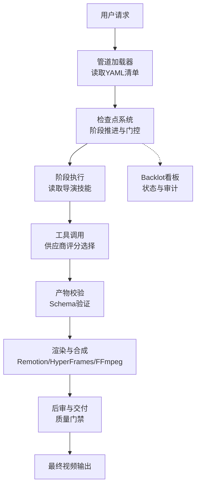
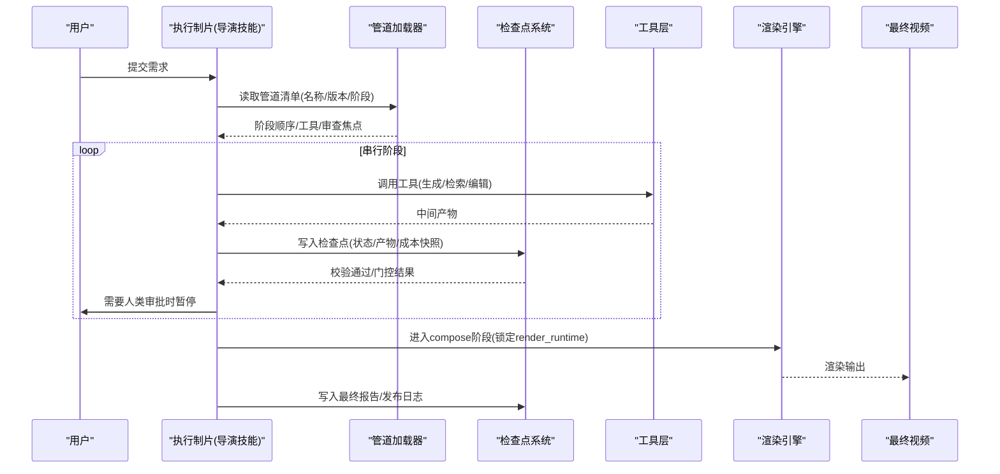
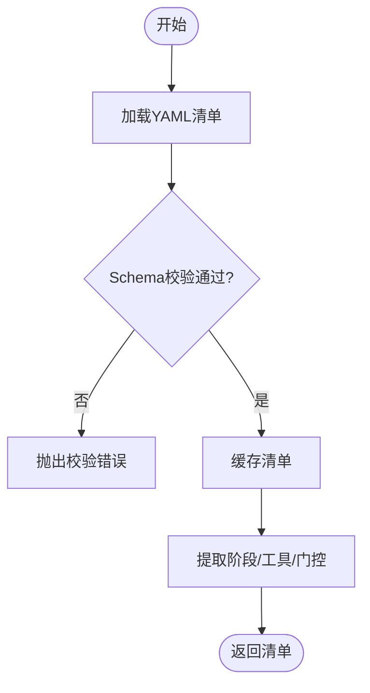
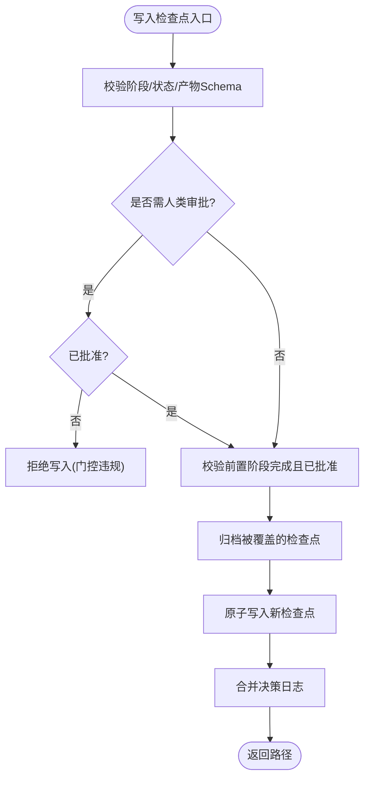
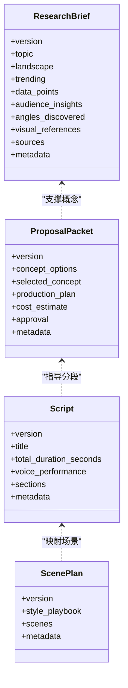
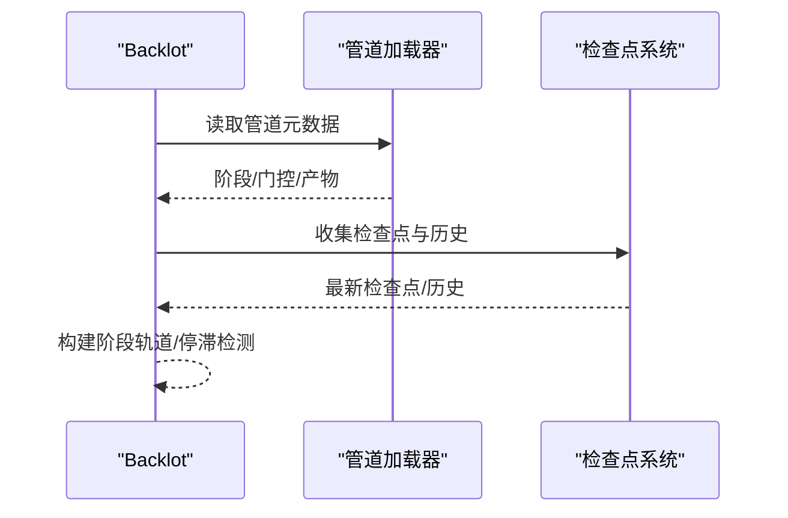
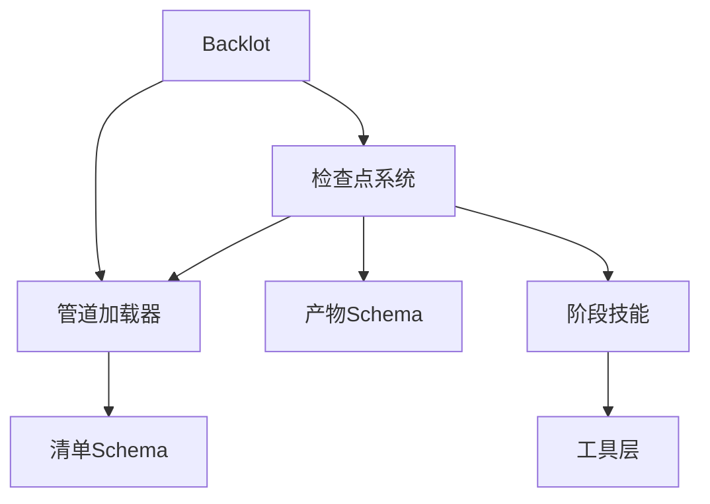
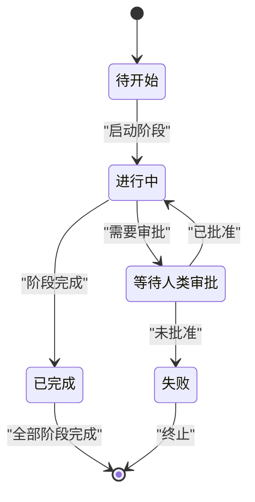

# 数据流和处理管道

<cite>
**本文引用的文件**
- [README.md](file://README.md)
- [pipeline_loader.py](file://lib/pipeline_loader.py)
- [checkpoint.py](file://lib/checkpoint.py)
- [pipeline_manifest.schema.json](file://schemas/pipelines/pipeline_manifest.schema.json)
- [research_brief.schema.json](file://schemas/artifacts/research_brief.schema.json)
- [proposal_packet.schema.json](file://schemas/artifacts/proposal_packet.schema.json)
- [script.schema.json](file://schemas/artifacts/script.schema.json)
- [scene_plan.schema.json](file://schemas/artifacts/scene_plan.schema.json)
- [documentary-montage.yaml](file://pipeline_defs/documentary-montage.yaml)
- [state.py](file://backlot/state.py)
</cite>

## 目录
1. [简介](#简介)
2. [项目结构](#项目结构)
3. [核心组件](#核心组件)
4. [架构总览](#架构总览)
5. [详细组件分析](#详细组件分析)
6. [依赖关系分析](#依赖关系分析)
7. [性能考虑](#性能考虑)
8. [故障排查指南](#故障排查指南)
9. [结论](#结论)
10. [附录](#附录)

## 简介
本文件面向OpenMontage的数据流与处理管道，系统化说明从用户请求到最终视频输出的完整流转过程。重点包括：
- 管道加载器如何解析并执行YAML定义的管道清单
- 各阶段输入输出格式（研究简报、提案包、脚本、场景规划等）
- 数据验证机制与Schema约束系统
- 错误处理与重试机制、降级策略与回滚方案
- 完整数据流图与状态转换图
- 调试与监控方法（基于Backlot看板与检查点历史）

## 项目结构
OpenMontage以“声明式管道 + 指令型技能 + 工具注册”的三层知识体系组织生产流程：
- pipeline_defs/*.yaml：声明式管道清单，定义阶段、产物、工具、审查焦点与人类审批门
- lib/*：核心基础设施（管道加载、检查点持久化、路径、事件等）
- schemas/*：JSON Schema约束，覆盖管道清单与各阶段产物
- skills/*：导演技能（Markdown），指导AI代理在每个阶段如何工作
- tools/*：生产工具（视频、音频、图像、后期、分析等）
- backlot/*：本地看板，实时展示运行状态、阶段进度与决策审计

图表来源
- [pipeline_loader.py:49-70](file://lib/pipeline_loader.py#L49-L70)
- [checkpoint.py:422-564](file://lib/checkpoint.py#L422-L564)
- [documentary-montage.yaml:45-179](file://pipeline_defs/documentary-montage.yaml#L45-L179)

章节来源
- [README.md:356-447](file://README.md#L356-L447)

## 核心组件
- 管道加载器：负责加载、缓存、校验管道清单，提取阶段顺序、子阶段、所需工具、扩展权限等
- 检查点系统：负责项目初始化、阶段前置条件校验、人类审批门控、归档历史、合并决策日志、原子写入
- 产物Schema：对每个阶段产物进行强类型校验，确保下游消费安全
- Backlot状态视图：将检查点与历史转换为可视化看板，支持回放与停滞检测

章节来源
- [pipeline_loader.py:1-241](file://lib/pipeline_loader.py#L1-L241)
- [checkpoint.py:1-634](file://lib/checkpoint.py#L1-L634)
- [pipeline_manifest.schema.json:1-197](file://schemas/pipelines/pipeline_manifest.schema.json#L1-L197)
- [state.py:63-94](file://backlot/state.py#L63-L94)

## 架构总览
OpenMontage采用“代理驱动的生产编排”，由AI编码助手作为编排器，按管道清单与导演技能逐步推进阶段，并在关键节点进行人类审批与质量门禁。

图表来源
- [documentary-montage.yaml:45-179](file://pipeline_defs/documentary-montage.yaml#L45-L179)
- [checkpoint.py:422-564](file://lib/checkpoint.py#L422-L564)
- [README.md:408-447](file://README.md#L408-L447)

## 详细组件分析

### 管道加载器（YAML清单解析与执行）
- 功能要点
  - 加载并校验管道清单（JSON Schema）
  - 提供只读缓存，避免重复解析
  - 提取阶段顺序、子阶段、所需工具、人类审批默认值、审查焦点
  - 能力扩展开关（自定义脚本/样式/技能/工具）
- 关键接口
  - load_pipeline / load_pipeline_readonly：加载与缓存
  - get_stage_order：获取阶段顺序（含可选子阶段）
  - get_required_tools：汇总可用工具集合
  - get_stage_skill / get_stage_human_approval_default：读取技能与门控
  - check_extension_permitted / get_permitted_extensions：扩展权限控制

图表来源
- [pipeline_loader.py:49-70](file://lib/pipeline_loader.py#L49-L70)
- [pipeline_loader.py:125-162](file://lib/pipeline_loader.py#L125-L162)
- [pipeline_loader.py:165-190](file://lib/pipeline_loader.py#L165-L190)
- [pipeline_loader.py:201-241](file://lib/pipeline_loader.py#L201-L241)

章节来源
- [pipeline_loader.py:1-241](file://lib/pipeline_loader.py#L1-L241)
- [pipeline_manifest.schema.json:1-197](file://schemas/pipelines/pipeline_manifest.schema.json#L1-L197)

### 检查点系统与阶段推进
- 功能要点
  - 项目初始化（创建标准目录结构与项目标记）
  - 阶段前置条件校验（必须的前序阶段完成且通过人类审批）
  - 人类审批门控（manifest或调用方要求时必须human_approved=True）
  - 历史归档（覆盖前复制旧检查点到history）
  - 决策日志合并（跨阶段累计审计）
  - 原子写入（临时文件+替换，避免损坏）
- 关键流程
  - write_checkpoint：校验→归档→写入→返回路径
  - read_checkpoint / get_latest_checkpoint：读取最新有效检查点
  - get_next_stage：根据已完成阶段计算下一步

图表来源
- [checkpoint.py:198-248](file://lib/checkpoint.py#L198-L248)
- [checkpoint.py:251-347](file://lib/checkpoint.py#L251-L347)
- [checkpoint.py:349-420](file://lib/checkpoint.py#L349-L420)
- [checkpoint.py:422-564](file://lib/checkpoint.py#L422-L564)

章节来源
- [checkpoint.py:1-634](file://lib/checkpoint.py#L1-L634)

### 产物Schema与数据验证
- 研究简报（research_brief）：结构化调研发现，包含现有内容、趋势、数据点、受众洞察、专家声音、角度候选、视觉参考与来源引用
- 提案包（proposal_packet）：概念选项、制作计划、成本估算、交付承诺、渲染运行时锁定、风格与口味画像、供应商评分排名
- 脚本（script）：带时间戳的分段文本、配音表现契约、增强提示、发音指南、来源引用
- 场景规划（scene_plan）：有序场景列表，包含镜头语言、叙事角色、信息角色、英雄时刻、纹理关键词、必要资产

图表来源
- [research_brief.schema.json:1-246](file://schemas/artifacts/research_brief.schema.json#L1-L246)
- [proposal_packet.schema.json:1-379](file://schemas/artifacts/proposal_packet.schema.json#L1-L379)
- [script.schema.json:1-105](file://schemas/artifacts/script.schema.json#L1-L105)
- [scene_plan.schema.json:1-118](file://schemas/artifacts/scene_plan.schema.json#L1-L118)

章节来源
- [research_brief.schema.json:1-246](file://schemas/artifacts/research_brief.schema.json#L1-L246)
- [proposal_packet.schema.json:1-379](file://schemas/artifacts/proposal_packet.schema.json#L1-L379)
- [script.schema.json:1-105](file://schemas/artifacts/script.schema.json#L1-L105)
- [scene_plan.schema.json:1-118](file://schemas/artifacts/scene_plan.schema.json#L1-L118)

### 管道清单示例（纪录片蒙太奇）
- 阶段序列：idea → scene_plan → assets → edit → compose
- 每阶段定义：技能路径、必需/可选工具、人类审批默认值、审查焦点、成功标准
- 编排配置：模式、预算默认值、最大修订次数、最大回退次数、最大耗时

图表来源
- [documentary-montage.yaml:45-179](file://pipeline_defs/documentary-montage.yaml#L45-L179)

章节来源
- [documentary-montage.yaml:1-179](file://pipeline_defs/documentary-montage.yaml#L1-L179)

### Backlot看板与状态视图
- 从清单与检查点构建阶段轨道（stage rail），显示状态、门控、产物、成本快照、错误、人类审批、版本数
- 支持回放：历史条目按时间线排列
- 停滞检测：长时间无活动则标记stalled

图表来源
- [state.py:63-94](file://backlot/state.py#L63-L94)
- [state.py:145-170](file://backlot/state.py#L145-L170)
- [state.py:608-638](file://backlot/state.py#L608-L638)

章节来源
- [state.py:63-94](file://backlot/state.py#L63-L94)
- [state.py:145-170](file://backlot/state.py#L145-L170)
- [state.py:608-638](file://backlot/state.py#L608-L638)

## 依赖关系分析
- 管道加载器依赖JSON Schema校验清单结构
- 检查点系统依赖产物Schema与清单阶段顺序
- Backlot依赖清单与检查点构建可视化状态
- 各阶段依赖工具层（视频/音频/图像/后期/分析）

图表来源
- [pipeline_loader.py:49-70](file://lib/pipeline_loader.py#L49-L70)
- [checkpoint.py:124-191](file://lib/checkpoint.py#L124-L191)
- [state.py:63-94](file://backlot/state.py#L63-L94)

章节来源
- [pipeline_loader.py:1-241](file://lib/pipeline_loader.py#L1-L241)
- [checkpoint.py:1-634](file://lib/checkpoint.py#L1-L634)
- [state.py:63-94](file://backlot/state.py#L63-L94)

## 性能考虑
- 清单加载缓存：使用LRU缓存减少重复解析与校验开销
- 原子写入：临时文件+替换避免损坏当前检查点
- 历史归档：仅归档非in_progress检查点，降低I/O压力
- 阶段前置校验：尽早失败，避免无效执行
- 工具选择评分：在提案阶段锁定render_runtime与渲染家族，减少compose阶段的切换成本

[本节为通用指导，不直接分析具体文件]

## 故障排查指南
- 清单校验失败：检查pipeline manifest schema字段与枚举值
- 阶段门控违规：确认human_approval_default与human_approved标志
- 前置阶段未完成：补齐缺失的前序阶段检查点
- 产物Schema校验失败：对照对应schema修正字段与类型
- Backlot停滞：检查长时间无活动的阶段，查看错误与成本快照
- 渲染失败：确认render_runtime与renderer_family一致，检查compose阶段成功标准

章节来源
- [pipeline_manifest.schema.json:1-197](file://schemas/pipelines/pipeline_manifest.schema.json#L1-L197)
- [checkpoint.py:251-347](file://lib/checkpoint.py#L251-L347)
- [checkpoint.py:422-564](file://lib/checkpoint.py#L422-L564)
- [state.py:608-638](file://backlot/state.py#L608-L638)

## 结论
OpenMontage通过声明式管道清单、严格的Schema约束与检查点门控，实现了可审计、可恢复、可回滚的视频生产流水线。结合Backlot看板与决策日志，用户可在每个创意与技术决策点保持掌控，确保最终视频质量与成本可控。

[本节为总结性内容，不直接分析具体文件]

## 附录
- 端到端数据流图（从请求到输出）
- 状态转换图（检查点生命周期）
- 调试与监控建议

图表来源
- [checkpoint.py:422-564](file://lib/checkpoint.py#L422-L564)