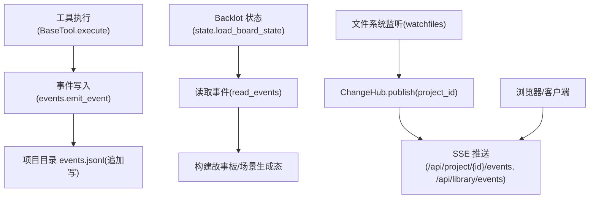
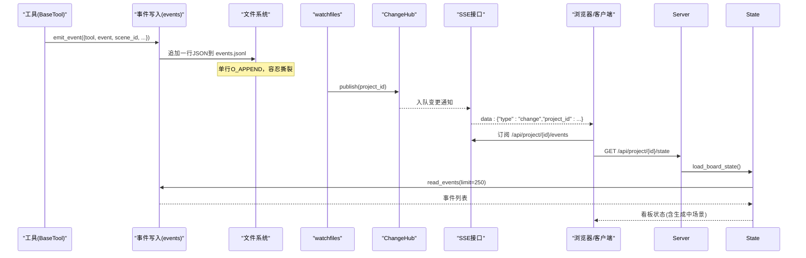
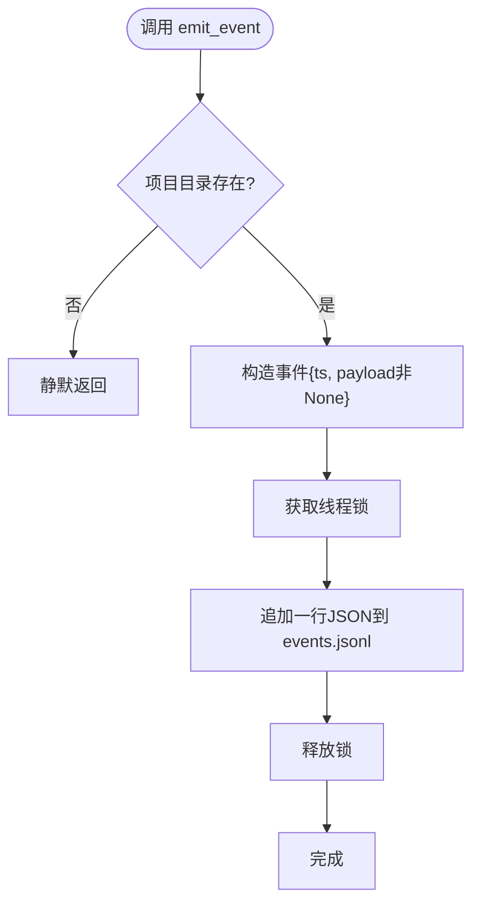
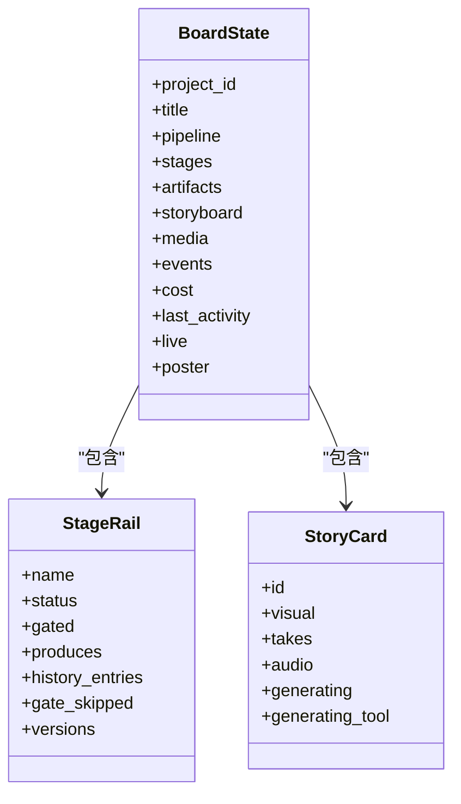
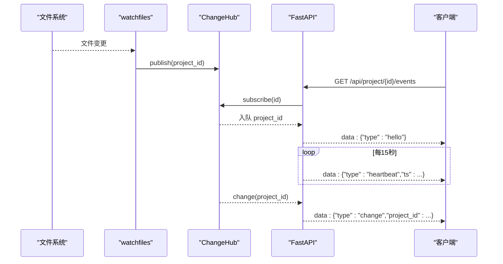
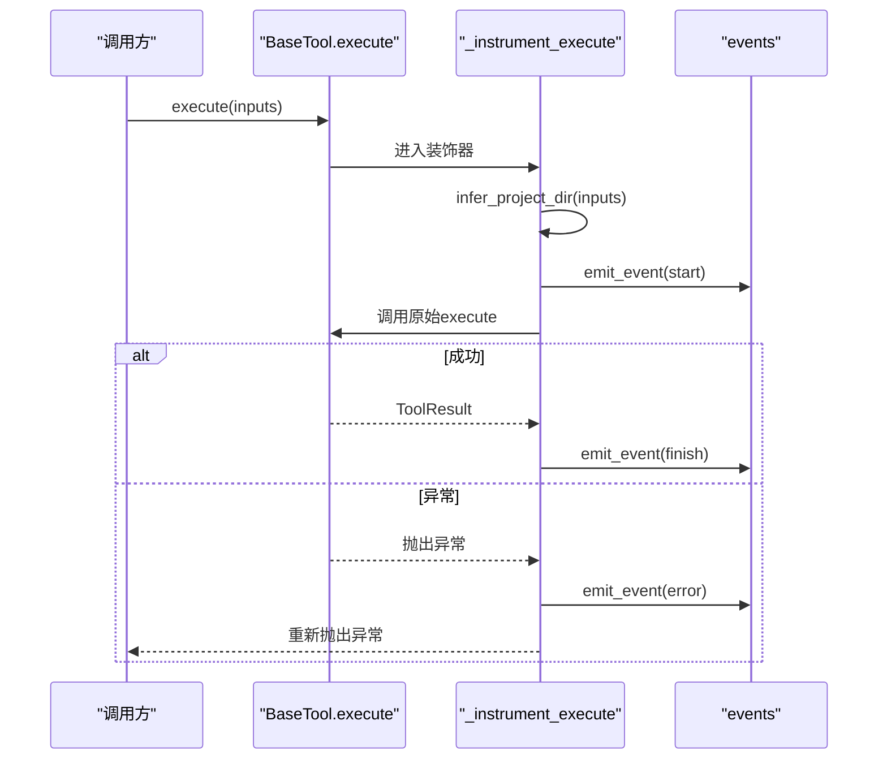
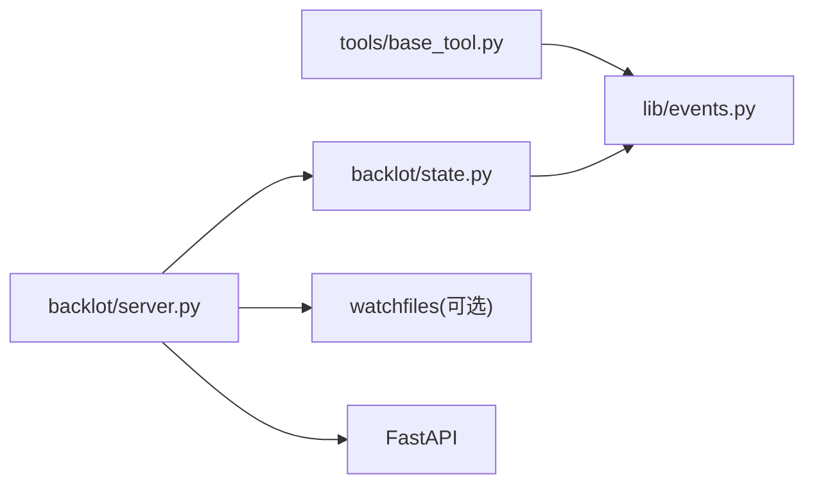

# 事件系统

<cite>
**本文引用的文件**
- [lib/events.py](file://lib/events.py)
- [backlot/state.py](file://backlot/state.py)
- [backlot/server.py](file://backlot/server.py)
- [tools/base_tool.py](file://tools/base_tool.py)
- [scripts/backlot_simulate_run.py](file://scripts/backlot_simulate_run.py)
- [tests/contracts/test_backlot_contract.py](file://tests/contracts/test_backlot_contract.py)
</cite>

## 目录
1. [简介](#简介)
2. [项目结构](#项目结构)
3. [核心组件](#核心组件)
4. [架构总览](#架构总览)
5. [详细组件分析](#详细组件分析)
6. [依赖关系分析](#依赖关系分析)
7. [性能考量](#性能考量)
8. [故障排查指南](#故障排查指南)
9. [结论](#结论)
10. [附录](#附录)

## 简介
本文件系统化梳理 OpenMontage 的事件系统，围绕“发布-订阅”模式、Backlot 集成的事件流（实时状态更新、项目监控、活动追踪）、事件数据结构与持久化方案、性能优化策略（批量处理、异步、内存管理），以及调试、监控与排障方法展开。同时提供自定义事件开发示例与最佳实践，帮助读者在不侵入业务逻辑的前提下，为工具执行过程注入可观测性并驱动 Backlot 看板实时更新。

## 项目结构
事件系统由以下关键部分组成：
- 事件写入与读取：lib/events.py
- 事件消费与看板状态派生：backlot/state.py
- 实时推送与 SSE 服务：backlot/server.py
- 自动埋点与事件发射：tools/base_tool.py
- 演示脚本与测试用例：scripts/backlot_simulate_run.py、tests/contracts/test_backlot_contract.py

图表来源
- [tools/base_tool.py:148-224](file://tools/base_tool.py#L148-L224)
- [lib/events.py:77-118](file://lib/events.py#L77-L118)
- [backlot/state.py:588-658](file://backlot/state.py#L588-L658)
- [backlot/server.py:132-149](file://backlot/server.py#L132-L149)
- [backlot/server.py:183-240](file://backlot/server.py#L183-L240)

章节来源
- [lib/events.py:1-119](file://lib/events.py#L1-L119)
- [backlot/state.py:1-716](file://backlot/state.py#L1-L716)
- [backlot/server.py:1-369](file://backlot/server.py#L1-L369)
- [tools/base_tool.py:148-224](file://tools/base_tool.py#L148-L224)
- [scripts/backlot_simulate_run.py:1-162](file://scripts/backlot_simulate_run.py#L1-L162)
- [tests/contracts/test_backlot_contract.py:167-245](file://tests/contracts/test_backlot_contract.py#L167-L245)

## 核心组件
- 事件写入层（lib/events.py）
  - emit_event：向项目目录的 events.jsonl 追加一行 JSON 事件，包含时间戳与负载字段；线程安全写入，跨进程无锁设计，容忍单行撕裂。
  - read_events：顺序读取 events.jsonl，跳过损坏行，支持 limit 限制返回条数。
  - infer_project_dir：从输入参数推断归属项目目录，仅允许 projects/ 根下的路径，避免误写。
- 状态派生层（backlot/state.py）
  - load_board_state：聚合 checkpoint、artifacts、media、pipeline meta，并读取最近 N 条事件用于构建“正在生成”的场景状态。
  - summarize_project/list_projects：轻量摘要与库视图，结合 last_activity 计算 live/stalled 状态。
- 实时推送层（backlot/server.py）
  - ChangeHub：基于 asyncio.Queue 的 fan-out 通知中心，按 project_id 过滤订阅者。
  - watch-loop：watchfiles 监听 projects/ 变更，去重后失效缓存并发布到 Hub。
  - SSE 接口：/api/project/{project_id}/events 与 /api/library/events，心跳保活与合并突发。
- 自动埋点（tools/base_tool.py）
  - _instrument_execute：对每个 BaseTool.execute 包装，自动发射 start/finish/error 事件，记录 tool、scene_id、depth、cost_usd、duration_s 等。

章节来源
- [lib/events.py:46-118](file://lib/events.py#L46-L118)
- [backlot/state.py:588-658](file://backlot/state.py#L588-L658)
- [backlot/server.py:43-74](file://backlot/server.py#L43-L74)
- [backlot/server.py:132-149](file://backlot/server.py#L132-L149)
- [backlot/server.py:183-240](file://backlot/server.py#L183-L240)
- [tools/base_tool.py:148-224](file://tools/base_tool.py#L148-L224)

## 架构总览
事件系统采用“追加日志 + 拉取消费 + 实时推送”的组合：
- 工具执行时通过 BaseTool 自动埋点，将事件以 JSONL 形式追加到项目目录。
- Backlot 服务端周期性或按需读取事件，派生看板状态（如场景“正在生成”）。
- 文件系统变更触发 watchfiles，经 ChangeHub 广播给所有订阅了该项目的 SSE 客户端，实现近实时刷新。

图表来源
- [tools/base_tool.py:148-224](file://tools/base_tool.py#L148-L224)
- [lib/events.py:77-118](file://lib/events.py#L77-L118)
- [backlot/server.py:132-149](file://backlot/server.py#L132-L149)
- [backlot/server.py:183-240](file://backlot/server.py#L183-L240)
- [backlot/state.py:588-658](file://backlot/state.py#L588-L658)

## 详细组件分析

### 事件写入与读取（lib/events.py）
- 设计原则
  - 可观测性不破坏生产：所有公开函数吞掉异常，失败即静默丢弃。
  - 零代理负担：项目归属从工具输入推断，无需显式传入 project_dir。
- 关键能力
  - infer_project_dir：优先匹配显式键（project_dir/project_path），其次从输出/输入路径推断，且必须位于 PROJECTS_DIR 下。
  - emit_event：构造带 ts 的事件对象，过滤 None 值，使用线程锁串行写入，确保同一进程内有序。
  - read_events：逐行解析 JSON，忽略损坏行，支持 limit 返回最新 N 条。
- 复杂度与健壮性
  - 写入 O(1) 追加；读取 O(N) 线性扫描；容忍损坏行与 OSError。
  - 跨进程并发写入依赖 OS 的 O_APPEND 语义，单行撕裂在读取时被跳过。

图表来源
- [lib/events.py:77-95](file://lib/events.py#L77-L95)

章节来源
- [lib/events.py:46-118](file://lib/events.py#L46-L118)

### 状态派生与故事板（backlot/state.py）
- 事件参与的状态推导
  - 读取最近最多 250 条事件，识别未完成的 start，结合 finish/error 清理，得到“正在生成”的场景集合。
  - 深度过滤：depth>0 的嵌套 provider 事件不计入顶层生成态，避免重复。
- 其他状态
  - 阶段轨道：从 manifest 或回退阶段表构建 stages，结合 checkpoint/history 推导 status、gate_skipped、versions。
  - 媒体发现：扫描 renders/snapshots/music，生成可渲染资源列表。
  - 活跃与停滞：基于 last_activity 与 STALL_WINDOW_SECONDS 标记 stalled。
- 性能
  - 使用 lru_cache 缓存 pipeline meta；只读防御式解析，任何异常降级而非崩溃。

图表来源
- [backlot/state.py:145-224](file://backlot/state.py#L145-L224)
- [backlot/state.py:403-495](file://backlot/state.py#L403-L495)
- [backlot/state.py:588-658](file://backlot/state.py#L588-L658)

章节来源
- [backlot/state.py:1-716](file://backlot/state.py#L1-L716)

### 实时推送与 SSE（backlot/server.py）
- ChangeHub
  - 订阅：返回固定容量队列，可选绑定 project_id 进行过滤。
  - 发布：遍历订阅者，若绑定则仅推送匹配项目；队列满时丢弃多余通知（已保证至少一次唤醒）。
- 文件监听
  - watchfiles 递归监听 projects/，映射变更到项目 id，去重后失效缓存并发布到 Hub。
- SSE 接口
  - /api/project/{project_id}/events：订阅特定项目，发送 hello/heartbeat/change。
  - /api/library/events：订阅全部项目，广播变更。
  - 心跳间隔 15s，合并突发消息，减少网络抖动。

图表来源
- [backlot/server.py:43-74](file://backlot/server.py#L43-L74)
- [backlot/server.py:132-149](file://backlot/server.py#L132-L149)
- [backlot/server.py:183-240](file://backlot/server.py#L183-L240)

章节来源
- [backlot/server.py:1-369](file://backlot/server.py#L1-L369)

### 自动埋点与事件发射（tools/base_tool.py）
- 机制
  - 子类 execute 被装饰器包裹，自动捕获开始/结束/错误，推断 project_dir，发射事件。
  - 记录 depth（selector→provider 嵌套），便于上层消费端去重与聚合。
  - 异常情况下仍会发射 error 事件，再抛出异常，保证可观测性。
- 数据字段
  - tool、event、scene_id、depth、output_path、success、cost_usd、duration_s、error。

图表来源
- [tools/base_tool.py:148-224](file://tools/base_tool.py#L148-L224)
- [lib/events.py:77-95](file://lib/events.py#L77-L95)

章节来源
- [tools/base_tool.py:148-224](file://tools/base_tool.py#L148-L224)

### 事件数据结构与序列化
- 存储格式
  - 项目目录下 events.jsonl，每行一个 JSON 对象，包含 ts 与负载字段。
  - 读取时容错：跳过无法解析的行，避免污染结果。
- 典型字段
  - tool：工具名
  - event：start/finish/error
  - scene_id：场景标识
  - depth：调用深度（selector/provider）
  - output_path：输出路径
  - success：是否成功
  - cost_usd：成本（USD）
  - duration_s：耗时（秒）
  - error：错误信息（截断长度）

章节来源
- [lib/events.py:77-118](file://lib/events.py#L77-L118)
- [tests/contracts/test_backlot_contract.py:167-187](file://tests/contracts/test_backlot_contract.py#L167-L187)

### 持久化与一致性
- 写入：线程锁串行，单行追加；跨进程无锁，依赖 OS 原子追加。
- 读取：顺序扫描，容忍损坏行；limit 控制返回规模，降低内存占用。
- 安全：仅允许写入 PROJECTS_DIR 下的项目目录，防止越权写入。

章节来源
- [lib/events.py:24-30](file://lib/events.py#L24-L30)
- [lib/events.py:77-118](file://lib/events.py#L77-L118)

## 依赖关系分析
- 模块耦合
  - tools/base_tool.py 依赖 lib/events.py 进行埋点。
  - backlot/state.py 依赖 lib/events.py 读取事件。
  - backlot/server.py 依赖 backlot/state.py 提供状态，并通过 watchfiles 驱动 ChangeHub。
- 外部依赖
  - watchfiles：文件系统监听（可选，缺失时不影响功能）。
  - FastAPI：Web 框架与 SSE 流式响应。
  - PIL/ffmpeg：缩略图生成（与事件系统间接相关）。

图表来源
- [tools/base_tool.py:148-224](file://tools/base_tool.py#L148-L224)
- [backlot/state.py:588-658](file://backlot/state.py#L588-L658)
- [backlot/server.py:132-149](file://backlot/server.py#L132-L149)

章节来源
- [tools/base_tool.py:148-224](file://tools/base_tool.py#L148-L224)
- [backlot/state.py:588-658](file://backlot/state.py#L588-L658)
- [backlot/server.py:132-149](file://backlot/server.py#L132-L149)

## 性能考量
- 批量处理
  - 事件读取支持 limit，默认限制最近 250 条，避免大文件全量加载。
  - SSE 合并突发：队列空转时快速 drain，减少多次推送。
- 异步处理
  - watch-loop 与 SSE 基于 asyncio，非阻塞等待；心跳保活避免连接超时。
  - 状态派生在请求时执行，必要时可考虑后台预计算与缓存（当前已有 summary 缓存）。
- 内存管理
  - 事件读取逐行解析，不一次性加载整个文件。
  - ChangeHub 队列大小有限（64），满时丢弃多余通知，防止内存膨胀。
- I/O 优化
  - 事件写入使用 O_APPEND 追加，避免随机写开销。
  - 缩略图缓存至磁盘，减少重复计算。

[本节为通用指导，不直接分析具体文件]

## 故障排查指南
- 事件未出现
  - 检查 infer_project_dir 是否能正确推断项目目录（仅接受 projects/ 下的路径）。
  - 确认 emit_event 目标目录存在且可写；异常会被静默吞掉，需查看日志或文件系统权限。
- 看板不更新
  - 确认 watchfiles 可用；不可用时仍可手动刷新。
  - 检查 SSE 心跳是否正常（15s），浏览器是否断开连接。
  - 验证 ChangeHub 是否收到 publish 通知（可通过 library/events 观察）。
- 事件损坏
  - read_events 会跳过损坏行；若怀疑数据污染，检查 events.jsonl 内容。
- 卡顿/停滞
  - 关注 last_activity 与 STALL_WINDOW_SECONDS；超过阈值会标记 stalled。
- 调试建议
  - 使用 scripts/backlot_simulate_run.py 模拟运行，观察事件与看板变化。
  - 通过 tests/contracts/test_backlot_contract.py 中的断言验证事件往返与推断逻辑。

章节来源
- [lib/events.py:46-118](file://lib/events.py#L46-L118)
- [backlot/server.py:132-149](file://backlot/server.py#L132-L149)
- [backlot/server.py:183-240](file://backlot/server.py#L183-L240)
- [backlot/state.py:565-658](file://backlot/state.py#L565-L658)
- [scripts/backlot_simulate_run.py:113-151](file://scripts/backlot_simulate_run.py#L113-L151)
- [tests/contracts/test_backlot_contract.py:167-245](file://tests/contracts/test_backlot_contract.py#L167-L245)

## 结论
OpenMontage 的事件系统以极简、健壮的 JSONL 追加日志为核心，配合 BaseTool 自动埋点与 Backlot 的 SSE 实时推送，实现了“低侵入、高可观测”的工具执行追踪。通过 infer_project_dir 与严格的项目目录约束，保证了事件归属与安全；通过 limit、队列限流与心跳合并，保障了性能与稳定性。对于扩展与定制，建议在遵循现有字段约定的基础上，利用 BaseTool 的自动埋点能力，快速接入新的工具与流程。

[本节为总结，不直接分析具体文件]

## 附录

### 自定义事件开发示例
- 在工具中直接使用 emit_event 发射自定义事件（例如截图阶段）：
  - 参考：scripts/backlot_simulate_run.py 中对 flux_image 的 start/finish 事件发射。
- 在 BaseTool 中扩展埋点：
  - 如需额外字段，可在 _instrument_execute 中扩展 base 字典并写入事件负载。
- 在 Backlot 中消费事件：
  - 在 state._build_storyboard 中根据 event 类型与 scene_id 维护生成态；可新增字段以支持更细粒度展示。

章节来源
- [scripts/backlot_simulate_run.py:113-151](file://scripts/backlot_simulate_run.py#L113-L151)
- [tools/base_tool.py:148-224](file://tools/base_tool.py#L148-L224)
- [backlot/state.py:403-495](file://backlot/state.py#L403-L495)

### 集成最佳实践
- 保持事件幂等与最小化负载：仅写入必要字段，避免过大 payload。
- 使用 scene_id 关联事件与场景，便于看板聚合。
- 谨慎使用 depth：仅在 selector/provider 嵌套场景需要区分时使用。
- 监控与告警：关注 stalled 标志与 last_activity，及时定位卡住的任务。
- 测试覆盖：通过 test_backlot_contract.py 验证事件往返与推断逻辑。

章节来源
- [tests/contracts/test_backlot_contract.py:167-245](file://tests/contracts/test_backlot_contract.py#L167-L245)
- [backlot/state.py:565-658](file://backlot/state.py#L565-L658)