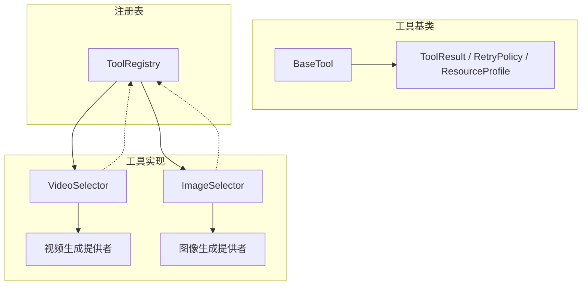
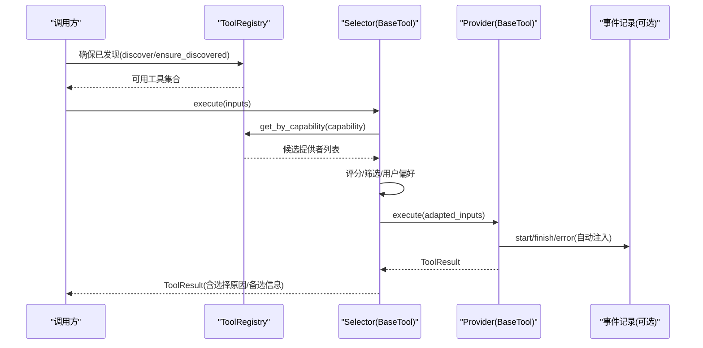
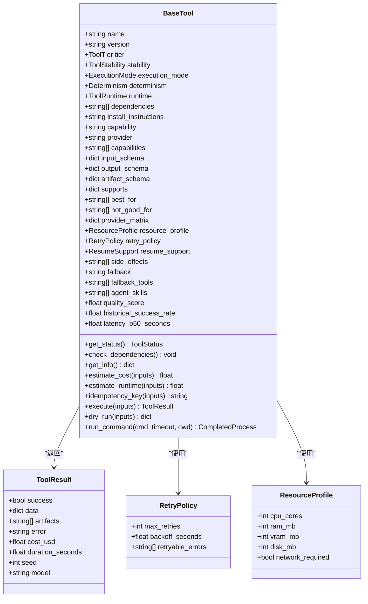
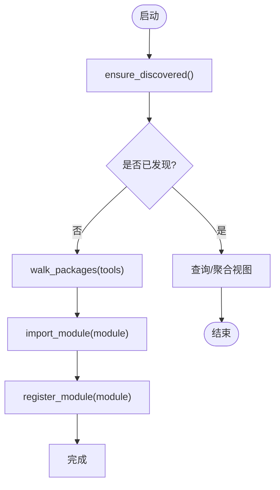
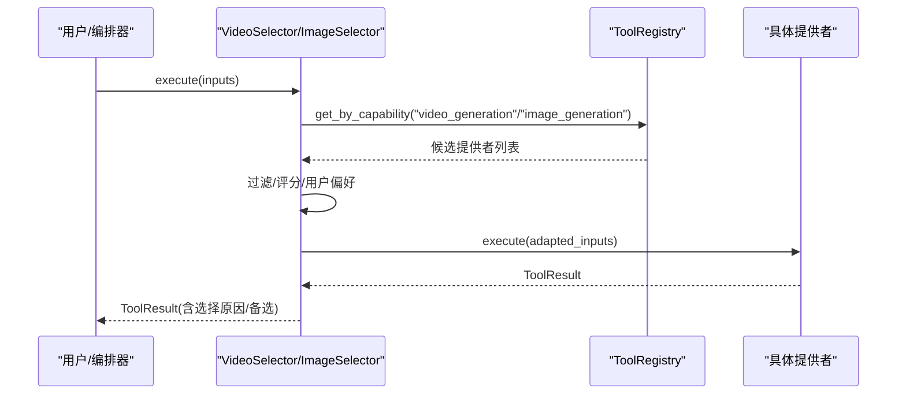
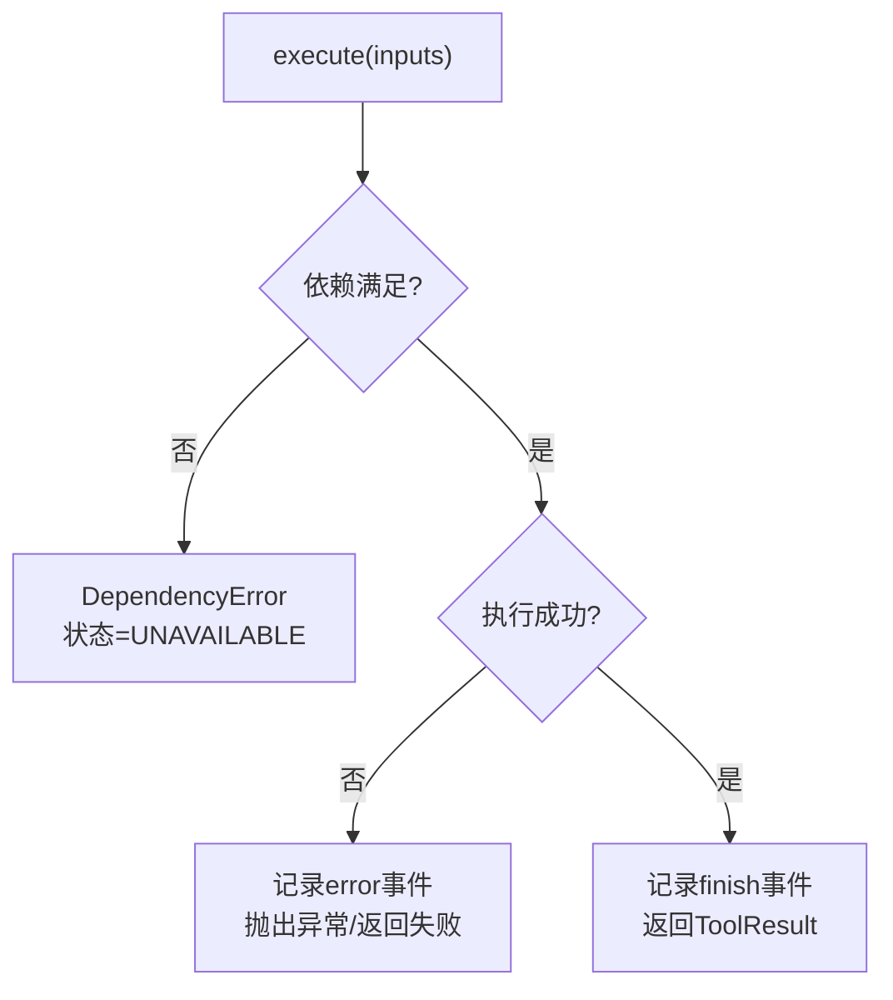
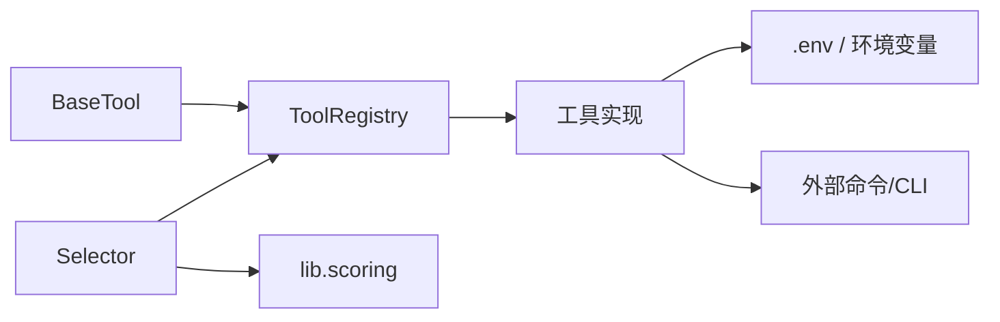
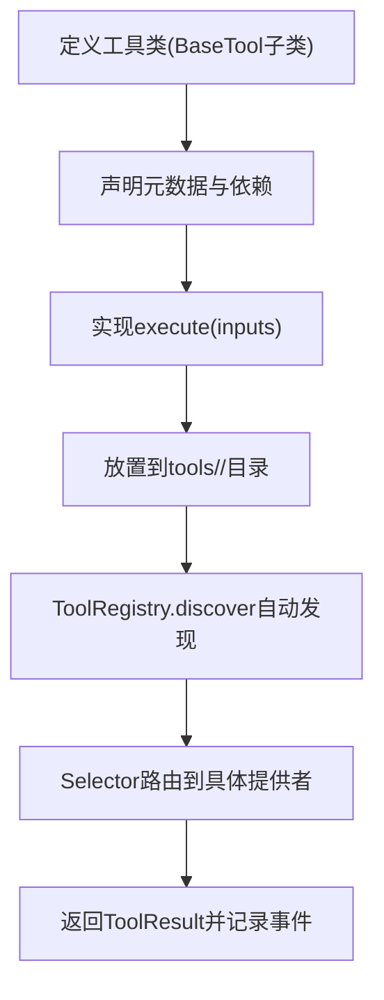

# 工具系统架构

<cite>
**本文引用的文件**
- [base_tool.py](file://tools/base_tool.py)
- [tool_registry.py](file://tools/tool_registry.py)
- [video_selector.py](file://tools/video/video_selector.py)
- [image_selector.py](file://tools/graphics/image_selector.py)
- [scoring.py](file://lib/scoring.py)
- [test_base_tool_dependencies.py](file://tests/tools/test_base_tool_dependencies.py)
</cite>

## 目录
1. [简介](#简介)
2. [项目结构](#项目结构)
3. [核心组件](#核心组件)
4. [架构总览](#架构总览)
5. [详细组件分析](#详细组件分析)
6. [依赖关系分析](#依赖关系分析)
7. [性能考量](#性能考量)
8. [故障排查指南](#故障排查指南)
9. [结论](#结论)
10. [附录：工具开发指南与最佳实践](#附录工具开发指南与最佳实践)

## 简介
本文件系统性阐述 OpenMontage 的工具系统架构，聚焦以下目标：
- BaseTool 抽象基类的设计模式：统一接口、生命周期管理、依赖检查、状态报告。
- 工具注册表的动态发现与加载机制：插件化原理、元数据管理与版本控制。
- 分类体系与执行模型：ToolTier、ToolStability、ExecutionMode 的设计决策。
- 工具间通信协议、错误处理与重试策略。
- 工具开发指南、最佳实践与扩展示例。

该文档面向希望理解或扩展 OpenMontage 工具系统的工程师与集成者，兼顾高层概览与代码级细节。

## 项目结构
OpenMontage 的工具系统以“基类 + 注册表 + 具体工具”的三层组织方式构建：
- 基类层：定义统一的工具契约（BaseTool）与通用数据结构（ToolResult、RetryPolicy、ResourceProfile 等）。
- 注册表层：负责自动发现、注册、查询工具能力与状态（ToolRegistry）。
- 实现层：按能力域分目录组织的具体工具（如 video、graphics、audio、analysis 等），以及选择器工具（selector）用于路由到具体提供者。

图表来源
- [base_tool.py:63-108](file://tools/base_tool.py#L63-L108)
- [base_tool.py:110-139](file://tools/base_tool.py#L110-L139)
- [tool_registry.py:55-134](file://tools/tool_registry.py#L55-L134)
- [video_selector.py:15-46](file://tools/video/video_selector.py#L15-L46)
- [image_selector.py:15-38](file://tools/graphics/image_selector.py#L15-L38)

章节来源
- [base_tool.py:63-108](file://tools/base_tool.py#L63-L108)
- [tool_registry.py:55-134](file://tools/tool_registry.py#L55-L134)
- [video_selector.py:15-46](file://tools/video/video_selector.py#L15-L46)
- [image_selector.py:15-38](file://tools/graphics/image_selector.py#L15-L38)

## 核心组件
- BaseTool：所有工具的抽象基类，提供统一身份、能力声明、依赖检查、状态报告、成本估算、幂等键、执行入口、干跑、子进程命令封装等能力。
- ToolRegistry：集中式工具注册与发现中心，支持按能力、提供者、层级、稳定性、可用性进行查询，并提供支持包络、能力目录、提供者菜单等聚合视图。
- Selector 工具（如 VideoSelector、ImageSelector）：能力级路由工具，自动发现并选择最合适的底层提供者执行任务。

章节来源
- [base_tool.py:227-418](file://tools/base_tool.py#L227-L418)
- [tool_registry.py:55-210](file://tools/tool_registry.py#L55-L210)
- [video_selector.py:15-46](file://tools/video/video_selector.py#L15-L46)
- [image_selector.py:15-38](file://tools/graphics/image_selector.py#L15-L38)

## 架构总览
下图展示了从调用方到具体提供者的完整流程，包括自动发现、选择、执行与结果回传。

图表来源
- [tool_registry.py:118-134](file://tools/tool_registry.py#L118-L134)
- [tool_registry.py:149-182](file://tools/tool_registry.py#L149-L182)
- [video_selector.py:185-200](file://tools/video/video_selector.py#L185-L200)
- [base_tool.py:148-224](file://tools/base_tool.py#L148-L224)

## 详细组件分析

### BaseTool 抽象基类
- 统一接口与生命周期
  - 通过 __init_subclass__ 自动为每个具体工具的 execute 方法注入 Backlot 事件埋点，记录 start/finish/error，便于 UI 实时活动追踪与统计。
  - 提供 dry_run 预检、estimate_cost/estimate_runtime 估算、idempotency_key 幂等键计算。
- 依赖检查与状态报告
  - check_dependencies 支持三类依赖：外部命令/二进制（cmd:/binary:）、环境变量（env:）、Python 模块（python:）。
  - get_status 基于依赖检查结果返回 AVAILABLE/UNAVAILABLE/DEGRADED。
- 元数据与能力描述
  - name/version/tier/stability/runtime/execution_mode/determinism/capabilities/provider/input_schema/output_schema/artifact_schema/supports/best_for/not_good_for/provider_matrix 等字段构成工具契约。
  - get_info 将上述元数据与运行时状态打包为字典，供注册表与编排器消费。
- 资源与重试
  - ResourceProfile 描述 CPU/RAM/VRAM/Disk/Network 需求；RetryPolicy 描述最大重试次数、退避时间、可重试错误类型。
- 子进程命令封装
  - run_command 在 Windows 上解析 .cmd/.bat 包装器，强制 UTF-8 解码输出，并将 CalledProcessError 包装为 ToolCommandError，附带 stderr/stdout/detail。

图表来源
- [base_tool.py:63-108](file://tools/base_tool.py#L63-L108)
- [base_tool.py:110-139](file://tools/base_tool.py#L110-L139)
- [base_tool.py:227-418](file://tools/base_tool.py#L227-L418)

章节来源
- [base_tool.py:148-224](file://tools/base_tool.py#L148-L224)
- [base_tool.py:227-418](file://tools/base_tool.py#L227-L418)
- [base_tool.py:411-453](file://tools/base_tool.py#L411-L453)

### 工具注册表（ToolRegistry）
- 动态发现与加载
  - discover 通过 importlib 与 pkgutil.walk_packages 遍历 tools 包树，跳过 base_tool 与 tool_registry 自身，对每个模块中的 BaseTool 子类实例化并注册。
  - ensure_discovered 保证仅发现一次，避免重复导入。
- 元数据管理与版本控制
  - 工具通过 get_info 暴露 name/version/tier/stability/runtime/execution_mode/determinism/capabilities/provider/input_schema/output_schema/artifact_schema/supports/best_for/not_good_for/provider_matrix/resource_profile/resume_support/side_effects/fallback/fallback_tools/agent_skills/user_visible_verification/quality_score/historical_success_rate/latency_p50_seconds 等元数据。
  - 注册表提供 support_envelope、capability_catalog、provider_catalog 聚合视图，便于编排器与 UI 展示。
- 查询与筛选
  - get_by_tier/get_by_capability/get_by_provider/get_by_stability/get_by_status/get_available/get_unavailable/find_by_capability/find_fallback 等便捷查询。
- 提供者菜单与支持包络
  - provider_menu 与 provider_menu_summary 生成面向用户的“能力-提供者”菜单，包含可用/不可用数量、安装提示、运行时警告、一键修复建议（如缺失 env var）。
  - gpu_required_tools 与 network_required_tools 快速列出需要 GPU 或网络的工具。

图表来源
- [tool_registry.py:118-134](file://tools/tool_registry.py#L118-L134)
- [tool_registry.py:149-210](file://tools/tool_registry.py#L149-L210)
- [tool_registry.py:249-314](file://tools/tool_registry.py#L249-L314)
- [tool_registry.py:316-471](file://tools/tool_registry.py#L316-L471)

章节来源
- [tool_registry.py:55-134](file://tools/tool_registry.py#L55-L134)
- [tool_registry.py:149-210](file://tools/tool_registry.py#L149-L210)
- [tool_registry.py:249-314](file://tools/tool_registry.py#L249-L314)
- [tool_registry.py:316-471](file://tools/tool_registry.py#L316-L471)

### 选择器工具（VideoSelector / ImageSelector）
- 自动发现与路由
  - 通过 registry.get_by_capability 获取同能力的所有提供者，结合输入约束（preferred_provider、allowed_providers、operation 等）进行筛选与评分。
  - 使用 lib.scoring.rank_providers 对候选提供者打分，考虑任务匹配度、可靠性、控制性、成本效率等维度。
- 失败回退
  - 若首选提供者不可用，find_fallback 会按 fallback_tools/fallback 顺序寻找可用替代。
- 结果增强
  - 在 ToolResult.data 中附加 selected_tool、selected_provider、selection_reason、provider_score、alternatives_considered 等上下文信息，便于审计与调试。

图表来源
- [video_selector.py:185-200](file://tools/video/video_selector.py#L185-L200)
- [image_selector.py:185-200](file://tools/graphics/image_selector.py#L185-L200)
- [tool_registry.py:184-196](file://tools/tool_registry.py#L184-L196)
- [scoring.py:398-422](file://lib/scoring.py#L398-L422)

章节来源
- [video_selector.py:15-46](file://tools/video/video_selector.py#L15-L46)
- [image_selector.py:15-38](file://tools/graphics/image_selector.py#L15-L38)
- [scoring.py:398-422](file://lib/scoring.py#L398-L422)

### 分类体系与执行模型设计决策
- ToolTier（工具层级）
  - CORE/VOICE/ENHANCE/GENERATE/SOURCE/ANALYZE/PUBLISH：用于区分工具在流水线中的角色与优先级，便于编排器做分层调度与资源规划。
- ToolStability（稳定性级别）
  - EXPERIMENTAL/BETA/PRODUCTION：影响可靠性基线（例如 scoring 中对 production 赋予更高可靠性权重），指导生产环境选型。
- ExecutionMode（执行模式）
  - SYNC/ASYNC：标识工具执行语义，便于上层并发与超时控制策略。
- Determinism（确定性）
  - DETERMINISTIC/SEEDED/STOCHASTIC：帮助评估可复现性与缓存策略。
- ToolRuntime（运行环境）
  - LOCAL/LOCAL_GPU/API/HYBRID：反映资源与网络需求，配合 ResourceProfile 进行部署与配额管理。

章节来源
- [base_tool.py:63-108](file://tools/base_tool.py#L63-L108)
- [scoring.py:398-422](file://lib/scoring.py#L398-L422)

### 工具间通信协议、错误处理与重试策略
- 通信协议
  - 统一输入/输出契约：execute(inputs) -> ToolResult。ToolResult 包含 success/data/artifacts/error/cost_usd/duration_seconds/seed/model 等字段，作为跨工具的标准消息体。
  - 元数据契约：get_info 暴露能力、提供者、依赖、资源、稳定性等，供注册表与编排器消费。
- 错误处理
  - 依赖缺失：check_dependencies 抛出 DependencyError，get_status 据此标记 UNAVAILABLE。
  - 子进程错误：run_command 捕获 CalledProcessError 并包装为 ToolCommandError，保留 returncode/cmd/output/stderr/detail，便于诊断。
  - 事件埋点：_instrument_execute 在 execute 前后记录 start/finish/error，异常不影响工具执行本身。
- 重试策略
  - RetryPolicy 提供 max_retries/backoff_seconds/retryable_errors 配置。具体工具可在 execute 内部根据业务逻辑实现指数退避与条件重试。
  - 选择器工具在首选提供者失败时，通过 find_fallback 自动切换到备用提供者，提升鲁棒性。

图表来源
- [base_tool.py:148-224](file://tools/base_tool.py#L148-L224)
- [base_tool.py:304-327](file://tools/base_tool.py#L304-L327)
- [base_tool.py:411-453](file://tools/base_tool.py#L411-L453)
- [tool_registry.py:184-196](file://tools/tool_registry.py#L184-L196)

章节来源
- [base_tool.py:304-327](file://tools/base_tool.py#L304-L327)
- [base_tool.py:411-453](file://tools/base_tool.py#L411-L453)
- [tool_registry.py:184-196](file://tools/tool_registry.py#L184-L196)

## 依赖关系分析
- 组件耦合
  - BaseTool 被所有工具继承，提供统一契约与通用能力。
  - ToolRegistry 依赖 BaseTool 的 get_info 与 get_status 进行聚合与查询。
  - Selector 工具依赖 ToolRegistry 的能力发现与评分库（lib.scoring）进行路由决策。
- 直接/间接依赖
  - 工具实现通常依赖第三方 API/CLI（通过 dependencies 声明），并通过 check_dependencies 在运行前验证。
  - 事件埋点依赖 lib.events（可选），不影响工具主流程。
- 循环依赖
  - 未发现循环依赖；注册表与工具之间通过接口解耦。
- 外部依赖与集成点
  - 环境变量（.env）自动加载，API Key 在工具初始化前注入。
  - 子进程命令（ffmpeg、npx 等）通过 run_command 安全调用。

图表来源
- [base_tool.py:25-60](file://tools/base_tool.py#L25-L60)
- [tool_registry.py:86-117](file://tools/tool_registry.py#L86-L117)
- [video_selector.py:185-200](file://tools/video/video_selector.py#L185-L200)
- [image_selector.py:185-200](file://tools/graphics/image_selector.py#L185-L200)

章节来源
- [base_tool.py:25-60](file://tools/base_tool.py#L25-L60)
- [tool_registry.py:86-117](file://tools/tool_registry.py#L86-L117)
- [video_selector.py:185-200](file://tools/video/video_selector.py#L185-L200)
- [image_selector.py:185-200](file://tools/graphics/image_selector.py#L185-L200)

## 性能考量
- 自动发现开销
  - discover 使用 walk_packages 扫描模块，建议在应用启动时一次性调用 ensure_discovered，避免重复导入。
- 事件埋点
  - _instrument_execute 在每次 execute 前后写入事件，属于轻量操作且异常吞掉，不影响主流程性能。
- 资源感知
  - ResourceProfile 与 ToolRuntime 可用于编排器进行资源预估与调度（GPU/内存/网络）。
- 重试与超时
  - 长耗时工具应设置合理的 estimate_runtime 与超时策略；外部 API 调用建议使用指数退避与最大重试限制。

[本节为通用指导，不直接分析具体文件]

## 故障排查指南
- 依赖缺失
  - 现象：get_status 返回 unavailable，check_dependencies 抛出 DependencyError。
  - 排查：检查 dependencies 声明（cmd:/binary:/env:/python:），确认命令行/环境变量/Python 模块已安装。
- 子进程错误
  - 现象：run_command 抛出 ToolCommandError，包含 returncode/stderr/detail。
  - 排查：查看 stderr/stdout，确认命令路径与参数正确；Windows 下注意 .cmd/.bat 包装器解析。
- 事件未记录
  - 现象：UI 无 start/finish/error 事件。
  - 排查：确认 lib.events 可导入；若不可用，工具仍正常执行但无事件。
- 选择器未选中预期提供者
  - 现象：selected_provider 非期望值。
  - 排查：检查 preferred_provider/allowed_providers、评分依据（task_fit/reliability/control/cost_efficiency）、提供者状态（availability）。

章节来源
- [base_tool.py:304-327](file://tools/base_tool.py#L304-L327)
- [base_tool.py:411-453](file://tools/base_tool.py#L411-L453)
- [base_tool.py:148-224](file://tools/base_tool.py#L148-L224)
- [video_selector.py:185-200](file://tools/video/video_selector.py#L185-L200)
- [image_selector.py:185-200](file://tools/graphics/image_selector.py#L185-L200)

## 结论
OpenMontage 的工具系统通过 BaseTool 统一契约、ToolRegistry 动态发现与聚合、Selector 智能路由，构建了高内聚、低耦合、可扩展的工具生态。其设计强调：
- 标准化接口与元数据，便于自动化编排与可视化。
- 强依赖检查与状态报告，提升系统鲁棒性。
- 灵活的分类与执行模型，适配多样化场景。
- 完善的错误处理与重试策略，保障端到端可靠性。
- 清晰的开发指南与最佳实践，降低扩展门槛。

[本节为总结，不直接分析具体文件]

## 附录：工具开发指南与最佳实践

### 新增工具步骤
- 创建工具类
  - 继承 BaseTool，实现 execute(inputs) -> ToolResult。
  - 声明必要元数据：name/version/tier/stability/runtime/execution_mode/determinism/capabilities/provider/input_schema/output_schema/artifact_schema/supports/best_for/not_good_for/provider_matrix。
  - 声明依赖：dependencies（cmd:/binary:/env:/python:），必要时提供 install_instructions。
  - 可选：resource_profile、retry_policy、resume_support、side_effects、fallback/fallback_tools、agent_skills、quality_score/historical_success_rate/latency_p50_seconds。
- 注册与发现
  - 将工具文件放入 tools/<capability>/ 目录下，无需手动注册；ToolRegistry.discover 会自动发现并实例化。
- 测试与验证
  - 编写单元测试覆盖依赖检查、execute、dry_run、错误路径。
  - 使用 tests/tools/test_base_tool_dependencies.py 的模式验证依赖与命令行为。

章节来源
- [base_tool.py:227-418](file://tools/base_tool.py#L227-L418)
- [tool_registry.py:118-134](file://tools/tool_registry.py#L118-L134)
- [test_base_tool_dependencies.py:20-48](file://tests/tools/test_base_tool_dependencies.py#L20-L48)

### 最佳实践
- 明确能力边界
  - 使用 capability/capabilities 精确描述工具能做什么，避免模糊声明。
- 合理声明依赖
  - 将外部命令/环境变量/模块依赖显式声明，便于预检与引导用户安装。
- 提供友好的安装提示
  - install_instructions 应简洁明确，指向官方文档或一键脚本。
- 成本与性能估算
  - 实现 estimate_cost/estimate_runtime，帮助编排器做预算与时序规划。
- 幂等与可恢复
  - 设置 idempotency_key_fields，支持断点续跑与去重。
- 错误与重试
  - 对外部 API 调用采用指数退避与最大重试；对不可重试错误（如权限不足）直接失败。
- 事件与可观测性
  - 依赖 _instrument_execute 自动埋点；如需额外日志，保持结构化输出。
- 选择器集成
  - 若为提供者，确保 get_info 中 best_for/supports/provider_matrix 准确，便于 selector 正确路由。

章节来源
- [base_tool.py:227-418](file://tools/base_tool.py#L227-L418)
- [tool_registry.py:249-314](file://tools/tool_registry.py#L249-L314)
- [video_selector.py:185-200](file://tools/video/video_selector.py#L185-L200)
- [image_selector.py:185-200](file://tools/graphics/image_selector.py#L185-L200)

### 扩展开发示例（概念流程）

[本节为概念流程，不直接映射具体文件]