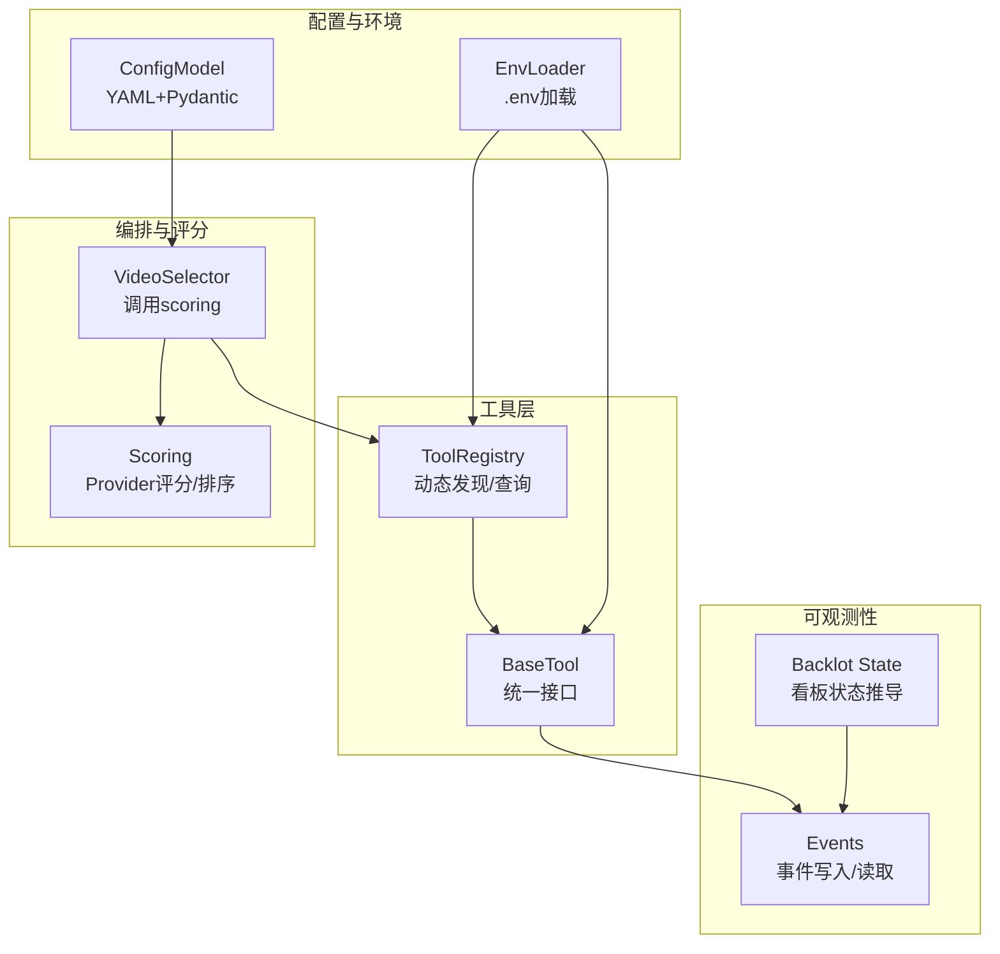
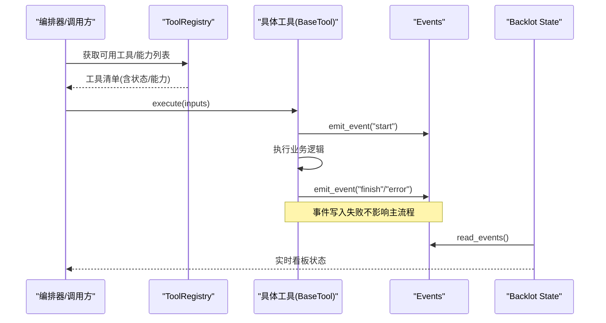
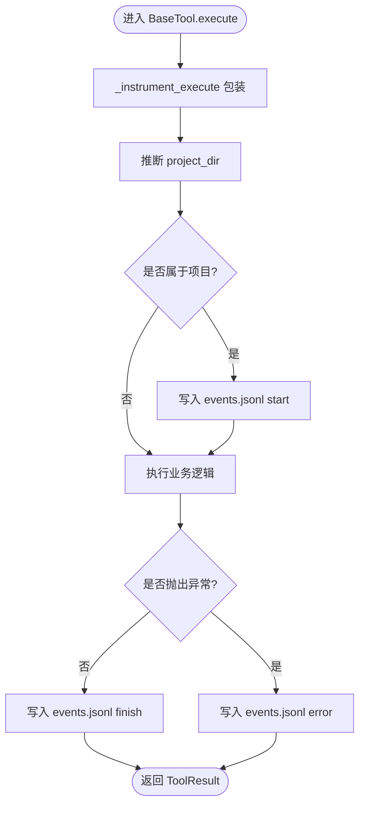
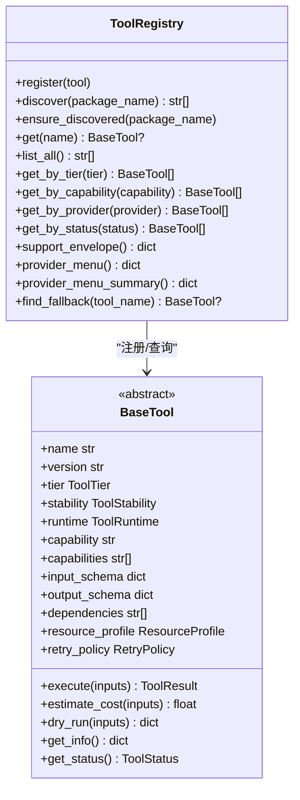
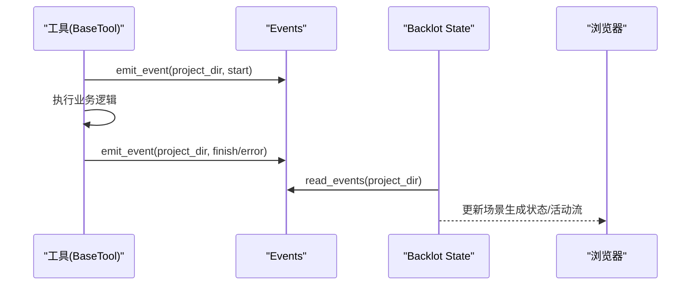
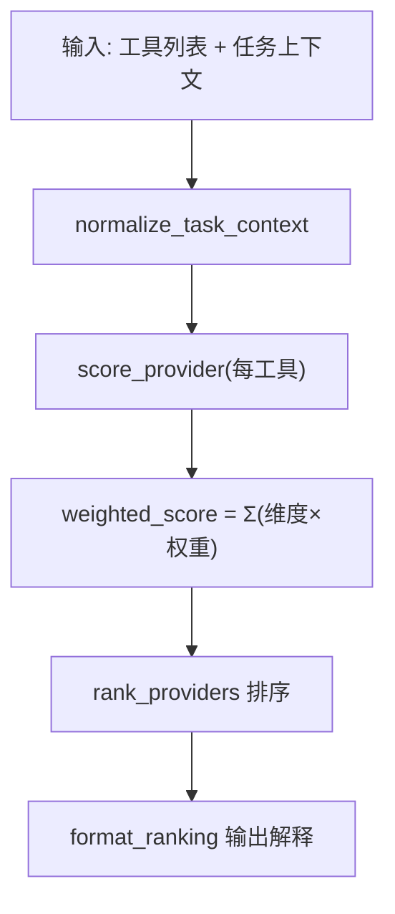
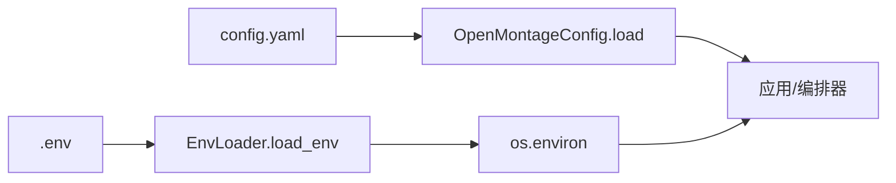
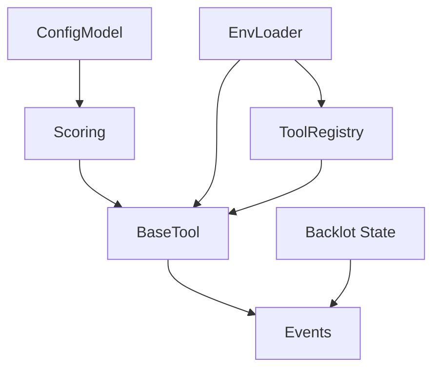

# 核心组件设计

<cite>
**本文引用的文件**
- [tools/base_tool.py](file://tools/base_tool.py)
- [tools/tool_registry.py](file://tools/tool_registry.py)
- [lib/events.py](file://lib/events.py)
- [lib/scoring.py](file://lib/scoring.py)
- [lib/config_model.py](file://lib/config_model.py)
- [lib/env_loader.py](file://lib/env_loader.py)
- [backlot/state.py](file://backlot/state.py)
- [config.yaml](file://config.yaml)
</cite>

## 目录
1. [简介](#简介)
2. [项目结构](#项目结构)
3. [核心组件](#核心组件)
4. [架构总览](#架构总览)
5. [详细组件分析](#详细组件分析)
6. [依赖关系分析](#依赖关系分析)
7. [性能考量](#性能考量)
8. [故障排查指南](#故障排查指南)
9. [结论](#结论)
10. [附录：扩展开发指南](#附录：扩展开发指南)

## 简介
本文件面向OpenMontage的核心组件设计，聚焦以下目标：
- BaseTool抽象基类的设计模式与统一接口定义
- 工具注册表的动态发现与加载机制（插件化）
- 事件系统架构（发布/订阅、实时状态更新、Backlot集成）
- 评分引擎的多维度加权算法（7个评估维度与决策逻辑）
- 配置管理与环境变量处理机制
- 组件间依赖关系图与扩展开发指南

## 项目结构
OpenMontage将“工具能力”“编排选择”“可视化看板”“配置与环境”解耦为独立模块：
- tools/base_tool.py：所有工具的抽象基类与统一执行契约
- tools/tool_registry.py：工具注册、动态发现、能力汇总
- lib/events.py：基于项目的追加式事件日志，驱动Backlot实时视图
- lib/scoring.py：Provider与生产路径的加权评分与排序
- lib/config_model.py + config.yaml：运行时配置模型与默认值
- lib/env_loader.py：.env加载与必需环境变量校验
- backlot/state.py：从磁盘状态推导BoardState，消费events.jsonl

图表来源
- [tools/base_tool.py:227-397](file://tools/base_tool.py#L227-L397)
- [tools/tool_registry.py:55-134](file://tools/tool_registry.py#L55-L134)
- [lib/events.py:46-119](file://lib/events.py#L46-L119)
- [lib/scoring.py:373-542](file://lib/scoring.py#L373-L542)
- [lib/config_model.py:65-93](file://lib/config_model.py#L65-L93)
- [lib/env_loader.py:15-35](file://lib/env_loader.py#L15-L35)
- [backlot/state.py:588-658](file://backlot/state.py#L588-L658)

章节来源
- [tools/base_tool.py:227-397](file://tools/base_tool.py#L227-L397)
- [tools/tool_registry.py:55-134](file://tools/tool_registry.py#L55-L134)
- [lib/events.py:46-119](file://lib/events.py#L46-L119)
- [lib/scoring.py:373-542](file://lib/scoring.py#L373-L542)
- [lib/config_model.py:65-93](file://lib/config_model.py#L65-L93)
- [lib/env_loader.py:15-35](file://lib/env_loader.py#L15-L35)
- [backlot/state.py:588-658](file://backlot/state.py#L588-L658)

## 核心组件
- BaseTool：定义统一的工具契约（身份、能力、资源、重试、成本估算、幂等键、执行入口、CLI封装），并通过元编程自动注入Backlot事件埋点。
- ToolRegistry：扫描tools包树，自动发现并注册所有具体工具；提供按能力、提供者、稳定性、可用性等多维查询与菜单生成。
- Events：以项目为单位的事件追加日志，支持推断归属项目、线程安全写入、容错读取；被Backlot消费用于实时更新。
- Scoring：对候选Provider进行多维度加权评分（任务契合度、输出质量、可控性、可靠性、成本效率、延迟、连续性），并输出可解释的排名。
- ConfigModel：基于Pydantic的强类型配置模型，加载config.yaml并提供路径解析；配合.env实现环境覆盖。
- EnvLoader：加载根目录.env，提供get/require访问器，确保API密钥在工具实例化前可用。

章节来源
- [tools/base_tool.py:25-60](file://tools/base_tool.py#L25-L60)
- [tools/base_tool.py:148-236](file://tools/base_tool.py#L148-L236)
- [tools/base_tool.py:227-397](file://tools/base_tool.py#L227-L397)
- [tools/tool_registry.py:55-134](file://tools/tool_registry.py#L55-L134)
- [lib/events.py:46-119](file://lib/events.py#L46-L119)
- [lib/scoring.py:21-70](file://lib/scoring.py#L21-L70)
- [lib/scoring.py:373-542](file://lib/scoring.py#L373-L542)
- [lib/config_model.py:65-93](file://lib/config_model.py#L65-L93)
- [lib/env_loader.py:15-35](file://lib/env_loader.py#L15-L35)

## 架构总览
OpenMontage采用“插件化工具 + 动态注册 + 评分选择 + 事件可观测 + 配置驱动”的架构：
- 工具通过继承BaseTool暴露统一execute接口，并在子类中声明能力、依赖、资源、成本估算等元数据。
- ToolRegistry在启动时扫描tools包，自动发现并注册所有工具，屏蔽新增工具带来的耦合。
- 编排侧（如视频选择器）根据任务上下文调用scoring对候选Provider打分，选择最优路径。
- BaseTool在执行前后向项目级events.jsonl追加start/finish/error事件，Backlot通过watcher读取并渲染实时看板。
- 配置由config.yaml集中管理，结合.env环境变量覆盖，保证不同环境一致运行。

图表来源
- [tools/tool_registry.py:118-134](file://tools/tool_registry.py#L118-L134)
- [tools/base_tool.py:148-236](file://tools/base_tool.py#L148-L236)
- [lib/events.py:77-119](file://lib/events.py#L77-L119)
- [backlot/state.py:588-658](file://backlot/state.py#L588-L658)

## 详细组件分析

### BaseTool抽象基类与统一接口
- 设计要点
  - 统一身份与能力描述：name/version/tier/stability/runtime/capabilities/input_schema/output_schema等。
  - 依赖检查：支持cmd/binary/env/python三类依赖检测，不满足时报DependencyError。
  - 成本与耗时估算：estimate_cost/estimate_runtime供评分与预算控制使用。
  - 幂等键：idempotency_key_fields组合后哈希，便于缓存或去重。
  - 执行包装：_instrument_execute自动包裹execute，注入start/finish/error事件到events.jsonl，且对异常透明。
  - CLI辅助：run_command封装跨平台子进程调用，统一UTF-8解码与错误信息。
- 关键流程
  - 子类化时自动注入事件埋点，无需手动调用emit_event。
  - get_status/check_dependencies在注册阶段即可判断可用性。
  - dry_run提供预检能力，避免不必要的付费调用。

图表来源
- [tools/base_tool.py:148-236](file://tools/base_tool.py#L148-L236)
- [lib/events.py:77-119](file://lib/events.py#L77-L119)

章节来源
- [tools/base_tool.py:25-60](file://tools/base_tool.py#L25-L60)
- [tools/base_tool.py:148-236](file://tools/base_tool.py#L148-L236)
- [tools/base_tool.py:227-397](file://tools/base_tool.py#L227-L397)

### 工具注册表与插件化发现
- 动态发现
  - discover(package_name="tools")递归遍历包内模块，跳过base_tool与tool_registry自身，导入每个模块并扫描其中继承自BaseTool的具体类，实例化后注册。
  - ensure_discovered保证只发现一次，避免重复导入。
- 查询与报告
  - 按tier/capability/provider/status/stability过滤。
  - support_envelope聚合所有工具的完整契约信息。
  - provider_menu/provider_menu_summary生成用户友好的能力菜单与“N of M已配置”提示，帮助快速补齐缺失的环境变量。
- 回退策略
  - find_fallback根据工具声明的回退工具链查找可用的替代工具。

图表来源
- [tools/tool_registry.py:55-134](file://tools/tool_registry.py#L55-L134)
- [tools/tool_registry.py:141-196](file://tools/tool_registry.py#L141-L196)
- [tools/tool_registry.py:198-471](file://tools/tool_registry.py#L198-L471)
- [tools/base_tool.py:227-397](file://tools/base_tool.py#L227-L397)

章节来源
- [tools/tool_registry.py:55-134](file://tools/tool_registry.py#L55-L134)
- [tools/tool_registry.py:141-196](file://tools/tool_registry.py#L141-L196)
- [tools/tool_registry.py:198-471](file://tools/tool_registry.py#L198-L471)

### 事件系统与Backlot集成
- 事件写入
  - BaseTool在执行前后自动写入start/finish/error事件，包含tool、scene_id、depth、duration_s、cost_usd等字段。
  - infer_project_dir根据inputs中的显式键或路径线索推断项目目录，仅允许projects根下的路径归属。
  - emit_event线程安全追加写入events.jsonl，失败静默忽略，保证生产稳定。
- 事件读取与看板
  - Backlot state读取events.jsonl，结合checkpoint/artifacts构建storyboard，标记“generating”场景与当前工具。
  - 通过watchfiles监听项目目录变更，SSE推送至前端，实现“活的故事板”。

图表来源
- [tools/base_tool.py:148-236](file://tools/base_tool.py#L148-L236)
- [lib/events.py:46-119](file://lib/events.py#L46-L119)
- [backlot/state.py:403-495](file://backlot/state.py#L403-L495)
- [backlot/state.py:588-658](file://backlot/state.py#L588-L658)

章节来源
- [lib/events.py:46-119](file://lib/events.py#L46-L119)
- [backlot/state.py:403-495](file://backlot/state.py#L403-L495)
- [backlot/state.py:588-658](file://backlot/state.py#L588-L658)

### 评分引擎：多维度加权算法
- ProviderScore七维权重
  - task_fit(0.30)：任务契合度，基于best_for与意图/风格关键词的语义重叠与同义词扩展。
  - output_quality(0.20)：输出质量，优先使用quality_score，否则按stability/tier映射。
  - control(0.15)：可控性，基于supports特征（controlnet/reference_image/style_transfer等）加权。
  - reliability(0.15)：可靠性，优先historical_success_rate，否则按status/stability设定基线。
  - cost_efficiency(0.10)：成本效率，考虑estimated_cost与剩余预算。
  - latency(0.05)：延迟，优先latency_p50_seconds，否则按runtime类别估计。
  - continuity(0.05)：连续性，倾向与已锁定provider一致的方案。
- 决策逻辑
  - normalize_task_context将松散上下文标准化，提取intent/style_keywords/asset_type/motion_required等。
  - 特殊信号增强：偏好生成视觉时对素材库型provider降权；需要参考条件/图像编辑时给予支持能力加分；电影感视频任务对具备高级特性的provider加分。
  - rank_providers对所有候选Provider计算加权得分并排序，format_ranking输出可读解释。

图表来源
- [lib/scoring.py:21-70](file://lib/scoring.py#L21-L70)
- [lib/scoring.py:297-359](file://lib/scoring.py#L297-L359)
- [lib/scoring.py:373-542](file://lib/scoring.py#L373-L542)

章节来源
- [lib/scoring.py:21-70](file://lib/scoring.py#L21-L70)
- [lib/scoring.py:297-359](file://lib/scoring.py#L297-L359)
- [lib/scoring.py:373-542](file://lib/scoring.py#L373-L542)

### 配置管理系统与环境变量处理
- 配置模型
  - OpenMontageConfig以Pydantic BaseModel组织LLM、预算、检查点、输出、路径等配置，提供load方法从config.yaml加载并验证。
  - resolve_path支持相对路径在项目根下解析。
- 环境变量
  - base_tool与tool_registry在import时加载根目录.env，确保API密钥在工具实例化前可用。
  - env_loader提供load_env/get_env/require_env统一访问器，便于其他模块按需读取。
- 默认与覆盖
  - config.yaml提供全局默认值；.env与运行时环境变量可覆盖关键参数（如API密钥）。

图表来源
- [lib/config_model.py:65-93](file://lib/config_model.py#L65-L93)
- [lib/env_loader.py:15-35](file://lib/env_loader.py#L15-L35)
- [tools/base_tool.py:25-60](file://tools/base_tool.py#L25-L60)
- [tools/tool_registry.py:86-117](file://tools/tool_registry.py#L86-L117)
- [config.yaml:1-34](file://config.yaml#L1-L34)

章节来源
- [lib/config_model.py:65-93](file://lib/config_model.py#L65-L93)
- [lib/env_loader.py:15-35](file://lib/env_loader.py#L15-L35)
- [tools/base_tool.py:25-60](file://tools/base_tool.py#L25-L60)
- [tools/tool_registry.py:86-117](file://tools/tool_registry.py#L86-L117)
- [config.yaml:1-34](file://config.yaml#L1-L34)

## 依赖关系分析
- 松耦合
  - BaseTool与ToolRegistry通过约定（继承BaseTool、声明元数据）解耦，新增工具无需修改注册逻辑。
  - Events与BaseTool通过函数调用耦合，但写失败不影响主流程，保证鲁棒性。
  - Backlot仅消费events.jsonl与checkpoint/artifacts，不反向影响工具执行。
- 潜在循环
  - 未发现循环依赖；BaseTool不依赖registry，registry不依赖具体工具实现细节。
- 外部依赖
  - Pydantic/YAML用于配置；dotenv用于.env；watchfiles用于Backlot热更新（在server层）。

图表来源
- [tools/base_tool.py:227-397](file://tools/base_tool.py#L227-L397)
- [tools/tool_registry.py:55-134](file://tools/tool_registry.py#L55-L134)
- [lib/events.py:46-119](file://lib/events.py#L46-L119)
- [lib/scoring.py:373-542](file://lib/scoring.py#L373-L542)
- [lib/config_model.py:65-93](file://lib/config_model.py#L65-L93)
- [lib/env_loader.py:15-35](file://lib/env_loader.py#L15-L35)
- [backlot/state.py:588-658](file://backlot/state.py#L588-L658)

章节来源
- [tools/base_tool.py:227-397](file://tools/base_tool.py#L227-L397)
- [tools/tool_registry.py:55-134](file://tools/tool_registry.py#L55-L134)
- [lib/events.py:46-119](file://lib/events.py#L46-L119)
- [lib/scoring.py:373-542](file://lib/scoring.py#L373-L542)
- [lib/config_model.py:65-93](file://lib/config_model.py#L65-L93)
- [lib/env_loader.py:15-35](file://lib/env_loader.py#L15-L35)
- [backlot/state.py:588-658](file://backlot/state.py#L588-L658)

## 性能考量
- 事件写入
  - 单行追加写events.jsonl，线程锁保护；跨进程未同步，容忍偶发撕裂行，读端跳过坏行。
- 工具执行
  - _instrument_execute仅在project_dir可归属时写入事件，减少IO开销；嵌套深度用于去重统计。
- 评分计算
  - 文本分词与同义词扩展轻量；对stock-like provider与电影感任务的额外分支仅在必要时生效。
- 配置加载
  - config.yaml一次性加载；resolve_path避免重复解析。

[本节为通用指导，不直接分析具体文件]

## 故障排查指南
- 工具不可用
  - 检查dependencies是否满足（cmd/binary/env/python），get_status会返回unavailable。
  - 确认.env已正确加载，API密钥存在。
- 事件未显示
  - 确认inputs包含可推断的项目路径或显式project_dir；确保项目目录存在且位于projects根下。
  - 查看events.jsonl是否存在，read_events是否报错。
- 评分不合理
  - 检查工具元数据（best_for/supports/quality_score/historical_success_rate/latency_p50_seconds）是否完善。
  - 核对任务上下文是否包含intent/style_keywords/asset_type/motion_required等关键字段。
- 配置未生效
  - 确认config.yaml路径与字段名；检查环境变量是否覆盖了预期项。

章节来源
- [tools/base_tool.py:296-327](file://tools/base_tool.py#L296-L327)
- [lib/events.py:46-119](file://lib/events.py#L46-L119)
- [lib/scoring.py:373-542](file://lib/scoring.py#L373-L542)
- [lib/config_model.py:74-93](file://lib/config_model.py#L74-L93)

## 结论
OpenMontage通过BaseTool统一工具契约、ToolRegistry实现插件化发现、Scoring提供可解释的多维选择、Events与Backlot构建实时可观测性、ConfigModel与环境变量保障可配置性，形成高内聚、低耦合、可扩展的视频制作流水线核心。

[本节为总结，不直接分析具体文件]

## 附录：扩展开发指南
- 新增工具
  - 继承BaseTool，实现execute，声明name/tier/capabilities/dependencies/resource_profile/retry_policy等元数据。
  - 可选：实现estimate_cost/estimate_runtime/dry_run以支持预算与预检。
  - 在tools包下新建模块，ToolRegistry会自动发现并注册。
- 接入评分
  - 完善best_for/supports/quality_score/historical_success_rate/latency_p50_seconds，使scoring能准确打分。
- 事件与看板
  - 无需手动埋点；只要inputs包含项目路径线索，BaseTool会自动写入事件，Backlot将实时展示。
- 配置与环境
  - 在config.yaml添加新配置项，或在.env设置环境变量；必要时在工具中通过env_loader读取。

章节来源
- [tools/base_tool.py:227-397](file://tools/base_tool.py#L227-L397)
- [tools/tool_registry.py:118-134](file://tools/tool_registry.py#L118-L134)
- [lib/scoring.py:373-542](file://lib/scoring.py#L373-L542)
- [lib/env_loader.py:15-35](file://lib/env_loader.py#L15-L35)
- [config.yaml:1-34](file://config.yaml#L1-L34)