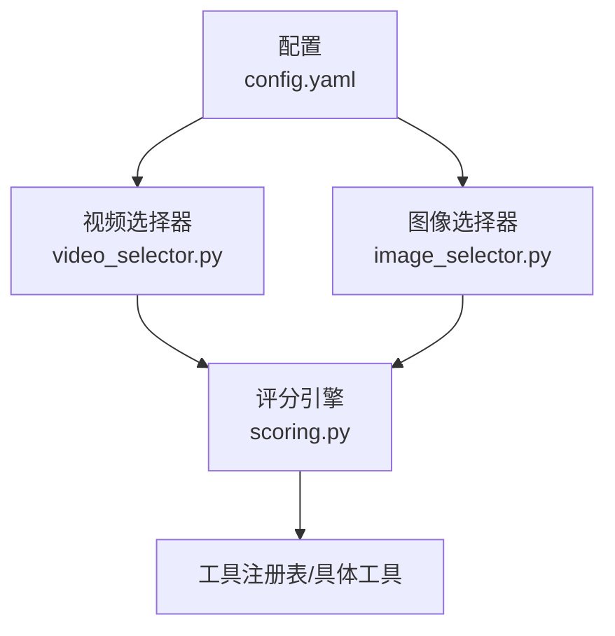
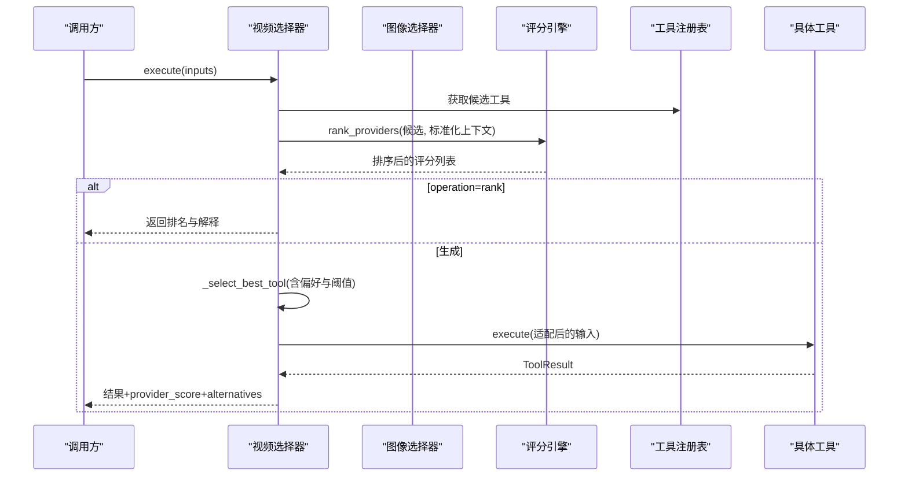
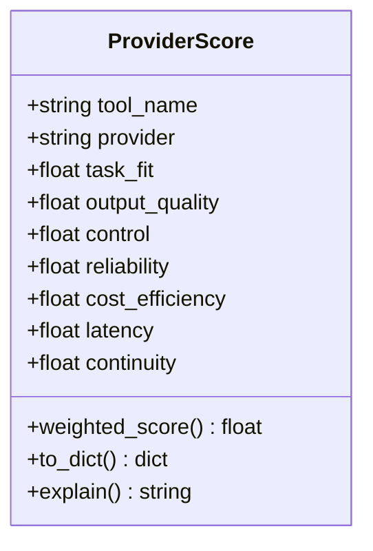
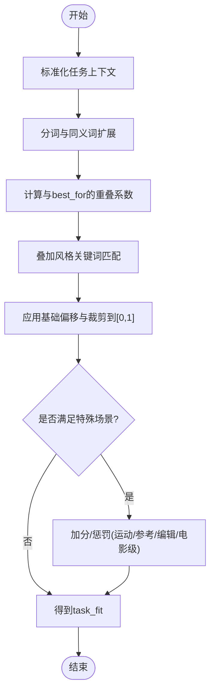
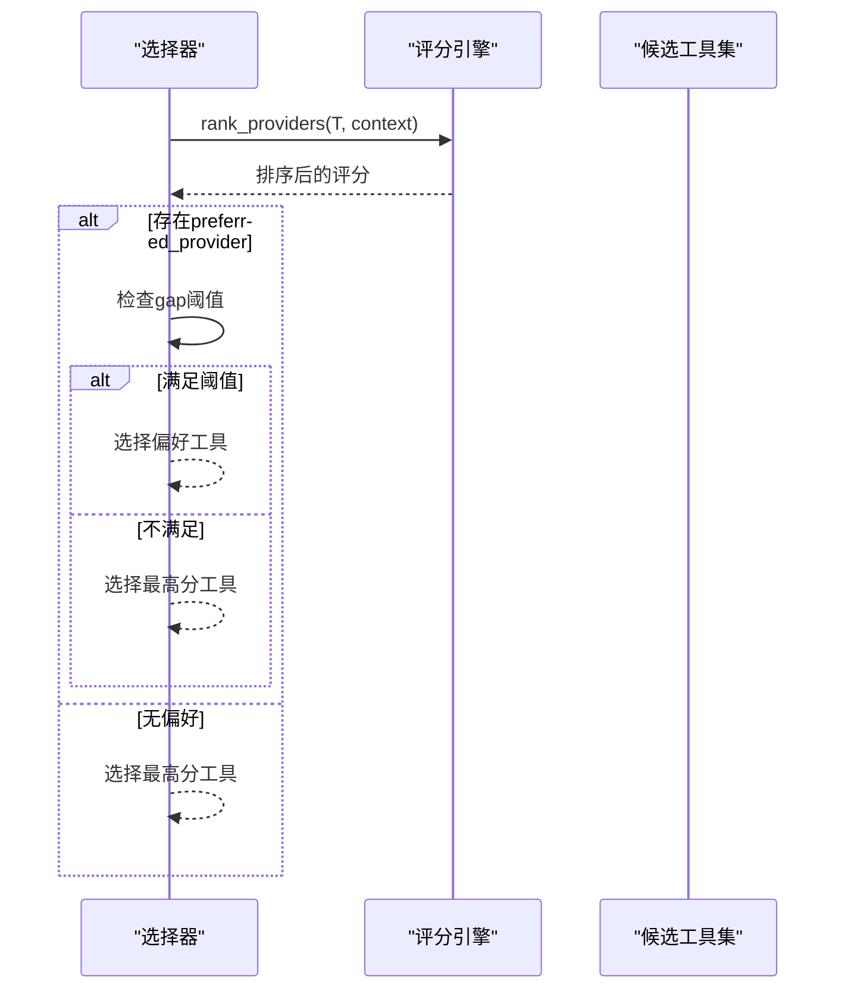
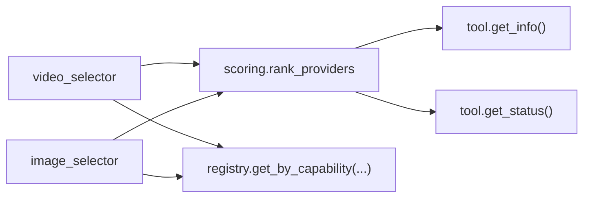

# 评分引擎

<cite>
**本文引用的文件**
- [lib/scoring.py](file://lib/scoring.py)
- [tools/video/video_selector.py](file://tools/video/video_selector.py)
- [tools/graphics/image_selector.py](file://tools/graphics/image_selector.py)
- [tests/tools/test_scoring.py](file://tests/tools/test_scoring.py)
- [config.yaml](file://config.yaml)
</cite>

## 目录
1. [简介](#简介)
2. [项目结构](#项目结构)
3. [核心组件](#核心组件)
4. [架构总览](#架构总览)
5. [详细组件分析](#详细组件分析)
6. [依赖关系分析](#依赖关系分析)
7. [性能与缓存](#性能与缓存)
8. [可配置性与扩展](#可配置性与扩展)
9. [可视化、报告与调优](#可视化报告与调优)
10. [API参考与集成示例](#api参考与集成示例)
11. [故障排查指南](#故障排查指南)
12. [结论](#结论)

## 简介
本文件为 OpenMontage 的“评分引擎”提供系统化文档，聚焦多维度加权算法、提供商选择策略、评分可视化与解释、以及可扩展的评分规则。该引擎将原本“首个可用即选择”的朴素策略替换为基于任务上下文的多维打分与排序，使每次提供商选择都可解释、可审计、可调优。

## 项目结构
评分引擎的核心位于 lib/scoring.py，由视频与图像的选择器在运行时调用：
- 视频选择器 tools/video/video_selector.py
- 图像选择器 tools/graphics/image_selector.py
- 测试覆盖 tests/tools/test_scoring.py
- 全局预算配置 config.yaml（影响成本效率维度）

图表来源
- [tools/video/video_selector.py:308-366](file://tools/video/video_selector.py#L308-L366)
- [tools/graphics/image_selector.py:218-332](file://tools/graphics/image_selector.py#L218-L332)
- [lib/scoring.py:533-542](file://lib/scoring.py#L533-L542)
- [config.yaml:9-14](file://config.yaml#L9-L14)

章节来源
- [tools/video/video_selector.py:1-568](file://tools/video/video_selector.py#L1-L568)
- [tools/graphics/image_selector.py:1-467](file://tools/graphics/image_selector.py#L1-L467)
- [lib/scoring.py:1-557](file://lib/scoring.py#L1-L557)
- [config.yaml:1-34](file://config.yaml#L1-L34)

## 核心组件
- ProviderScore：对单个提供商在特定任务上下文下的多维评分（任务契合度、输出质量、可控性、可靠性、成本效率、延迟、连续性），并提供加权总分与人类可读解释。
- ProductionPathScore：对整条生产路径的综合评分（交付契合、质量契合、能力置信、回退完整性、预算契合、速度契合、可控性、一致性）。
- 评分函数族：任务契合度、控制力、成本效率、连续性、标准化任务上下文等。
- 排名与格式化：rank_providers 与 format_ranking 用于排序与展示。

章节来源
- [lib/scoring.py:21-70](file://lib/scoring.py#L21-L70)
- [lib/scoring.py:77-107](file://lib/scoring.py#L77-L107)
- [lib/scoring.py:114-359](file://lib/scoring.py#L114-L359)
- [lib/scoring.py:533-556](file://lib/scoring.py#L533-L556)

## 架构总览
评分引擎通过选择器在运行时被调用，完成“候选发现 → 上下文标准化 → 多维打分 → 排序 → 选择/返回排名”。

图表来源
- [tools/video/video_selector.py:308-366](file://tools/video/video_selector.py#L308-L366)
- [tools/video/video_selector.py:368-440](file://tools/video/video_selector.py#L368-L440)
- [lib/scoring.py:533-542](file://lib/scoring.py#L533-L542)

章节来源
- [tools/video/video_selector.py:248-568](file://tools/video/video_selector.py#L248-L568)
- [tools/graphics/image_selector.py:185-467](file://tools/graphics/image_selector.py#L185-L467)
- [lib/scoring.py:373-542](file://lib/scoring.py#L373-L542)

## 详细组件分析

### ProviderScore 与加权算法
- 七维指标与权重：
  - 任务契合度 task_fit 权重 0.30
  - 输出质量 output_quality 权重 0.20
  - 可控性 control 权重 0.15
  - 可靠性 reliability 权重 0.15
  - 成本效率 cost_efficiency 权重 0.10
  - 延迟 latency 权重 0.05
  - 连续性 continuity 权重 0.05
- 加权总分 = Σ(维度值 × 对应权重)，范围 0-1，越高越好。
- 支持 to_dict() 与 explain() 输出结构化数据与人类可读解释（Top-3 贡献维度）。

图表来源
- [lib/scoring.py:21-70](file://lib/scoring.py#L21-L70)

章节来源
- [lib/scoring.py:21-70](file://lib/scoring.py#L21-L70)

### 任务契合度计算
- 使用同义词簇与分词器进行语义近似匹配，避免严格字面匹配导致的误判。
- 结合“意图文本”和“风格关键词”，对 best_for 描述做重叠系数计算，并加入基础偏移。
- 针对“运动需求”、“参考条件”、“图像编辑”、“电影级特性”等场景进行加分或惩罚。

图表来源
- [lib/scoring.py:193-231](file://lib/scoring.py#L193-L231)
- [lib/scoring.py:467-519](file://lib/scoring.py#L467-L519)

章节来源
- [lib/scoring.py:193-231](file://lib/scoring.py#L193-L231)
- [lib/scoring.py:467-519](file://lib/scoring.py#L467-L519)

### 其他维度计算
- 可控性 control：依据 supports 中的特征（如 controlnet、reference_image、style_transfer 等）加权求和并归一化。
- 成本效率 cost_efficiency：考虑估计成本与剩余预算；无预算时按绝对成本启发式打分。
- 延迟 latency：优先使用历史 p50 延迟映射到 0-1；否则按运行类型（local/hybrid/api）启发式打分。
- 连续性 continuity：若与已锁定提供商一致则高分，否则降权以维持风格一致性。
- 输出质量 output_quality：优先使用 measured quality；否则按稳定性与 tier 启发式估算。

章节来源
- [lib/scoring.py:234-295](file://lib/scoring.py#L234-L295)
- [lib/scoring.py:424-451](file://lib/scoring.py#L424-L451)
- [lib/scoring.py:453-466](file://lib/scoring.py#L453-L466)

### 提供商选择策略
- 首选策略：基于评分引擎的加权排序选择最高分工具。
- 用户偏好：允许指定 preferred_provider，但仅当其与当前最佳分差距不超过可配置的 gap（默认 0.15）时才生效。
- 环境提示：可通过环境变量（如 VIDEO_GEN_LOCAL_MODEL）自动切换本地模型路由。
- 操作过滤：根据 operation（text_to_video / image_to_video / reference_to_video / video_edit）与 supports/input_schema 动态筛选候选。
- 回退策略：对于需要运动的场景，禁止回退到仅图像的工具。

图表来源
- [tools/video/video_selector.py:368-440](file://tools/video/video_selector.py#L368-L440)
- [lib/scoring.py:533-542](file://lib/scoring.py#L533-L542)

章节来源
- [tools/video/video_selector.py:368-440](file://tools/video/video_selector.py#L368-L440)
- [tools/graphics/image_selector.py:334-365](file://tools/graphics/image_selector.py#L334-L365)

### 生产路径评分（ProductionPathScore）
- 面向整条生产路径的八维评分（交付契合、质量契合、能力置信、回退完整性、预算契合、速度契合、可控性、一致性），加权后用于路径级决策。
- 适用于多阶段流水线中不同阶段工具组合的评估与比较。

章节来源
- [lib/scoring.py:77-107](file://lib/scoring.py#L77-L107)

## 依赖关系分析
- 选择器依赖评分引擎进行排序与解释。
- 评分引擎依赖工具的元信息（best_for、supports、stability、tier、runtime、latency_p50_seconds、quality_score、historical_success_rate）与运行时状态（get_status）。
- 选择器还依赖工具注册表进行能力发现与候选过滤。

图表来源
- [tools/video/video_selector.py:248-253](file://tools/video/video_selector.py#L248-L253)
- [tools/graphics/image_selector.py:185-190](file://tools/graphics/image_selector.py#L185-L190)
- [lib/scoring.py:373-451](file://lib/scoring.py#L373-L451)

章节来源
- [tools/video/video_selector.py:248-568](file://tools/video/video_selector.py#L248-L568)
- [tools/graphics/image_selector.py:185-467](file://tools/graphics/image_selector.py#L185-L467)
- [lib/scoring.py:373-542](file://lib/scoring.py#L373-L542)

## 性能与缓存
- 当前实现未内置评分缓存层。每次执行都会重新计算评分。
- 建议优化方向：
  - 对“任务上下文指纹 → 评分结果”建立短期内存缓存（例如 LRU），键包含 intent、style_keywords、asset_type、operation、budget_remaining_usd、locked_providers 等稳定字段。
  - 对工具元信息（best_for、supports、stability、tier、runtime、latency_p50_seconds、quality_score、historical_success_rate）进行进程内缓存，减少重复 get_info() 开销。
  - 批量评分时复用分词与同义词扩展结果，避免重复计算。
  - 在高并发场景下，为缓存增加线程安全与过期策略。

[本节为通用性能建议，不直接分析具体文件]

## 可配置性与扩展
- 全局预算与审批策略：config.yaml 定义了预算模式、总额、保留比例与单动作审批阈值，间接影响成本效率维度与整体策略。
- 评分权重与阈值：
  - 权重集中在 ProviderScore.weighted_score 与 ProductionPathScore.weighted_score 中，可按业务目标调整。
  - 偏好提供商的容忍阈值 preferred_provider_gap 可在选择器输入中配置（默认 0.15）。
- 自定义评分规则扩展：
  - 在 score_provider 中新增维度或调整现有维度逻辑，保持分数归一化到 [0,1]。
  - 通过 supports 字段声明新能力（如新的参考条件或编辑能力），并在评分函数中赋予相应权重。
  - 通过 best_for 与 style_keywords 增强语义匹配，必要时扩展同义词簇。

章节来源
- [config.yaml:9-14](file://config.yaml#L9-L14)
- [tools/video/video_selector.py:57-69](file://tools/video/video_selector.py#L57-L69)
- [lib/scoring.py:35-45](file://lib/scoring.py#L35-L45)
- [lib/scoring.py:134-148](file://lib/scoring.py#L134-L148)

## 可视化、报告与调优
- 可视化与解释：
  - ProviderScore.explain() 提供人类可读的解释，列出 Top-3 贡献维度及权重。
  - format_ranking() 可将排名列表格式化为易读文本。
  - 选择器的 rank 模式会返回 rankings、explanation 与 normalized_task_context，便于前端或日志系统渲染。
- 分析报告：
  - 建议在外部系统中持久化 provider_score、alternatives_considered、selection_reason，以便事后分析与回溯。
- 调优指南：
  - 若某类任务频繁选择不符合预期，检查 best_for 与 style_keywords 的覆盖度，必要时扩展同义词簇。
  - 若成本敏感，提高 cost_efficiency 权重或收紧 budget_remaining_usd。
  - 若质量敏感，提升 output_quality 权重或引入 measured quality。
  - 若一致性重要，扩大 locked_providers 集合以提升 continuity 的影响。

章节来源
- [lib/scoring.py:52-70](file://lib/scoring.py#L52-L70)
- [lib/scoring.py:545-556](file://lib/scoring.py#L545-L556)
- [tools/video/video_selector.py:314-326](file://tools/video/video_selector.py#L314-L326)
- [tools/graphics/image_selector.py:227-236](file://tools/graphics/image_selector.py#L227-L236)

## API参考与集成示例

### 评分引擎 API
- normalize_task_context(task_context, prompt="", capability="", operation="")
  - 作用：将松散的上下文标准化为评分引擎期望的形状，合并 intent/style/platform/needs/prompt 等文本片段，推导 style_keywords、asset_type、motion_required、prefers_generated_visuals、wants_reference_conditioning、wants_image_editing 等标志。
- score_provider(tool, task_context) -> ProviderScore
  - 作用：对单个工具在给定上下文中计算多维评分。
- rank_providers(tools, task_context) -> list[ProviderScore]
  - 作用：对候选工具列表进行评分并排序（从高到低）。
- format_ranking(rankings, top_n=5) -> str
  - 作用：将排名列表格式化为人类可读字符串。

章节来源
- [lib/scoring.py:297-359](file://lib/scoring.py#L297-L359)
- [lib/scoring.py:373-530](file://lib/scoring.py#L373-L530)
- [lib/scoring.py:533-556](file://lib/scoring.py#L533-L556)

### 选择器集成要点
- 视频选择器：
  - execute(inputs) 支持 operation=rank 返回评分排名与解释。
  - _select_best_tool 实现偏好提供商与 gap 阈值控制。
  - estimate_cost/estimate_runtime 委托给所选工具。
- 图像选择器：
  - 同样支持 operation=rank 与偏好提供商选择。
  - 对图像编辑场景进行候选过滤与参数透传。

章节来源
- [tools/video/video_selector.py:294-366](file://tools/video/video_selector.py#L294-L366)
- [tools/video/video_selector.py:368-440](file://tools/video/video_selector.py#L368-L440)
- [tools/graphics/image_selector.py:218-332](file://tools/graphics/image_selector.py#L218-L332)
- [tools/graphics/image_selector.py:334-365](file://tools/graphics/image_selector.py#L334-L365)

### 集成示例（概念流程）
- 步骤1：收集 inputs（prompt、operation、task_context、preferred_provider、allowed_providers 等）。
- 步骤2：调用选择器 execute(inputs)。
- 步骤3：如需透明决策，设置 operation=rank 获取 rankings 与 explanation。
- 步骤4：解析 result.data 中的 selected_tool、selected_provider、provider_score、alternatives_considered、fallback_tools。
- 步骤5：将结果写入日志或监控系统，用于可视化与后续调优。

[本节为概念流程说明，不直接分析具体文件]

## 故障排查指南
- 令牌化与标点问题：
  - 测试用例验证了分词器能正确剥离尾部标点，确保“cinematic.”与“cinematic”等价匹配。
- 偏好提供商未生效：
  - 检查 preferred_provider_gap 是否过小导致偏好被忽略；确认所选工具确实在候选集中且状态可用。
- 运动需求被降级：
  - 对于 image_to_video/reference_to_video/video_edit，选择器会禁止回退到仅图像工具；请确认 operation 与 supports 配置。
- 成本效率异常：
  - 检查 estimated_cost 与 budget_remaining_usd；若无预算信息，将按绝对成本启发式打分。
- 可靠性与质量：
  - 若工具未提供 historical_success_rate 或 quality_score，将回退到 stability/tier 启发式；建议完善工具元信息。

章节来源
- [tests/tools/test_scoring.py:35-48](file://tests/tools/test_scoring.py#L35-L48)
- [tools/video/video_selector.py:264-278](file://tools/video/video_selector.py#L264-L278)
- [lib/scoring.py:259-282](file://lib/scoring.py#L259-L282)
- [lib/scoring.py:400-410](file://lib/scoring.py#L400-L410)
- [lib/scoring.py:453-466](file://lib/scoring.py#L453-L466)

## 结论
OpenMontage 的评分引擎通过七维加权与丰富的上下文感知，实现了可解释、可审计、可调优的提供商选择机制。选择器在运行时将评分结果与用户偏好、环境提示相结合，既尊重业务目标又保证鲁棒性。未来可通过引入缓存、在线学习（基于历史成功率与质量反馈）以及更细粒度的维度权重配置，进一步提升选择质量与系统性能。