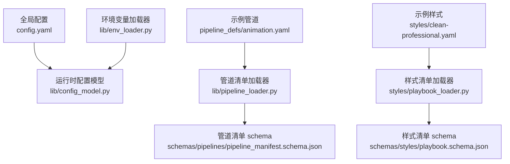
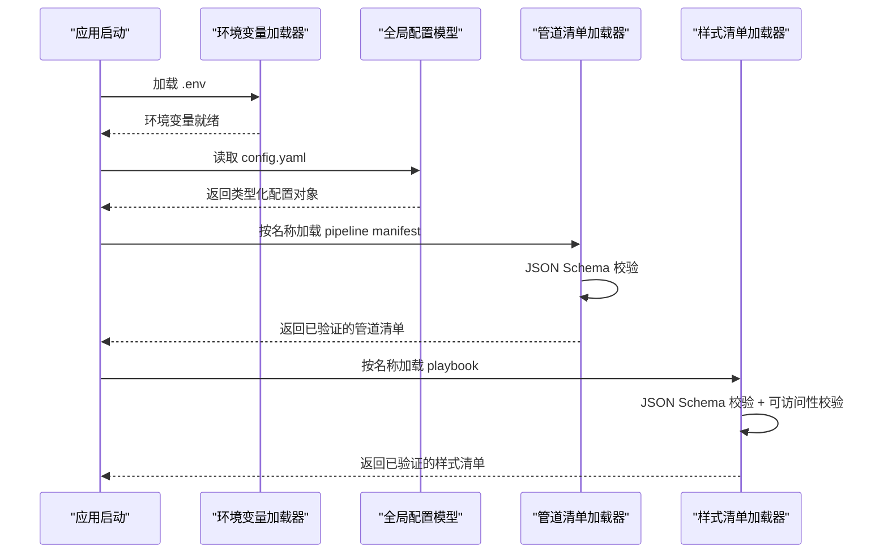
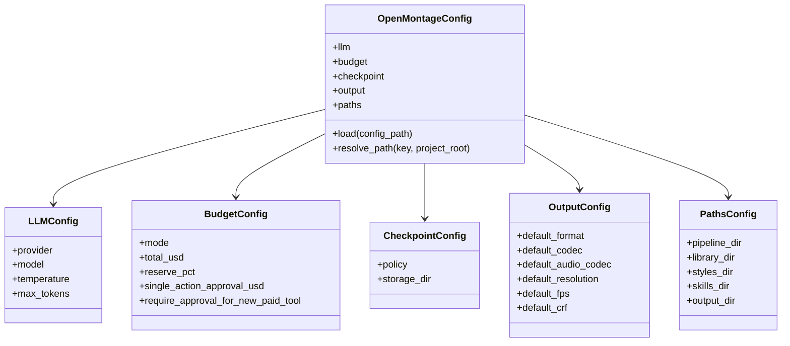
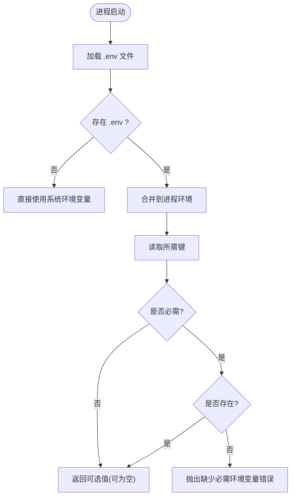
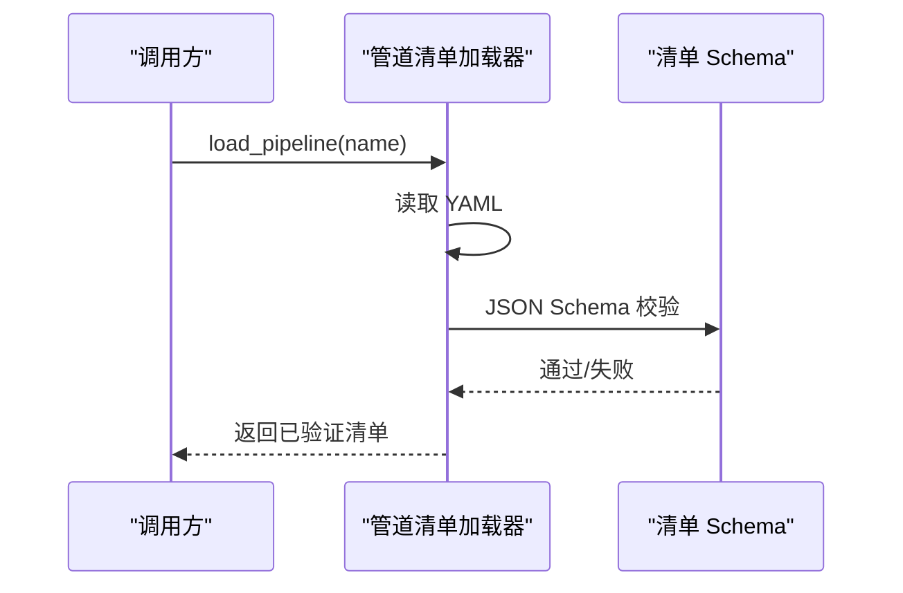
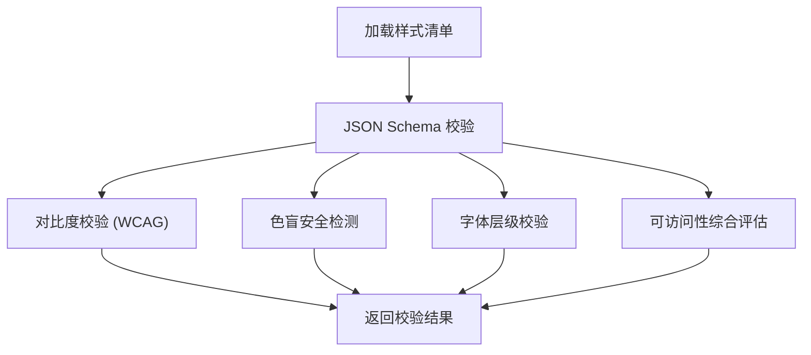
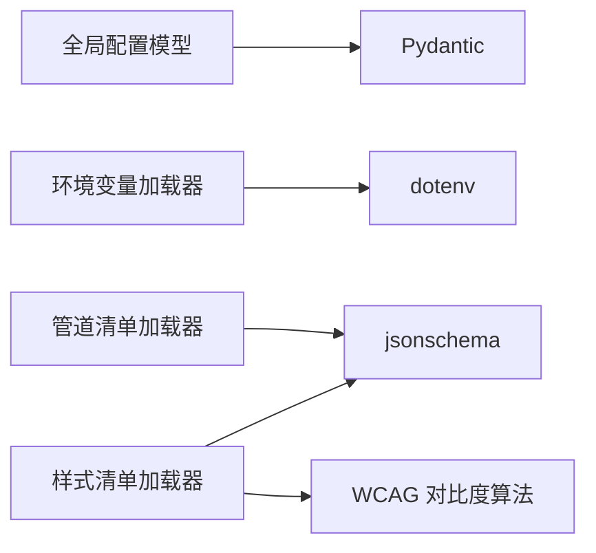

# 配置管理

<cite>
**本文引用的文件**
- [config.yaml](file://config.yaml)
- [lib/config_model.py](file://lib/config_model.py)
- [lib/env_loader.py](file://lib/env_loader.py)
- [lib/pipeline_loader.py](file://lib/pipeline_loader.py)
- [schemas/pipelines/pipeline_manifest.schema.json](file://schemas/pipelines/pipeline_manifest.schema.json)
- [styles/playbook_loader.py](file://styles/playbook_loader.py)
- [pipeline_defs/animation.yaml](file://pipeline_defs/animation.yaml)
- [styles/clean-professional.yaml](file://styles/clean-professional.yaml)
- [tests/contracts/test_env_example.py](file://tests/contracts/test_env_example.py)
</cite>

## 目录
1. [简介](#简介)
2. [项目结构](#项目结构)
3. [核心组件](#核心组件)
4. [架构总览](#架构总览)
5. [详细组件分析](#详细组件分析)
6. [依赖关系分析](#依赖关系分析)
7. [性能考虑](#性能考虑)
8. [故障排查指南](#故障排查指南)
9. [结论](#结论)
10. [附录：模板与示例](#附录模板与示例)

## 简介
本文件面向OpenMontage的配置管理系统，系统性说明以下方面：
- 配置文件层次：全局配置、管道配置、样式配置的来源、结构与职责。
- 环境变量处理：.env解析、优先级顺序与安全校验。
- 配置验证框架：JSON Schema验证、默认值处理、运行时热重载能力。
- 迁移策略、版本兼容性与备份恢复建议。
- 最佳实践、安全建议与故障排查。
- 配置模板与示例（以仓库现有文件为基准）。

## 项目结构
OpenMontage的配置由三部分构成：
- 全局配置：位于根目录的YAML文件，定义LLM、预算、检查点策略、输出参数与路径等。
- 管道配置：位于pipeline_defs下的YAML清单，声明阶段、工具、产物、审批策略与扩展能力。
- 样式配置：位于styles下的Playbook YAML，定义视觉语言、排版、动效、音频与质量规则，并附带可访问性校验。

图表来源
- [lib/config_model.py:1-93](file://lib/config_model.py#L1-L93)
- [lib/env_loader.py:1-35](file://lib/env_loader.py#L1-L35)
- [lib/pipeline_loader.py:1-241](file://lib/pipeline_loader.py#L1-L241)
- [schemas/pipelines/pipeline_manifest.schema.json:1-197](file://schemas/pipelines/pipeline_manifest.schema.json#L1-L197)
- [styles/playbook_loader.py:1-845](file://styles/playbook_loader.py#L1-L845)
- [pipeline_defs/animation.yaml:1-300](file://pipeline_defs/animation.yaml#L1-L300)
- [styles/clean-professional.yaml:1-105](file://styles/clean-professional.yaml#L1-L105)

章节来源
- [config.yaml:1-34](file://config.yaml#L1-L34)
- [lib/config_model.py:1-93](file://lib/config_model.py#L1-L93)
- [lib/env_loader.py:1-35](file://lib/env_loader.py#L1-L35)
- [lib/pipeline_loader.py:1-241](file://lib/pipeline_loader.py#L1-L241)
- [styles/playbook_loader.py:1-845](file://styles/playbook_loader.py#L1-L845)

## 核心组件
- 全局配置模型：提供类型化字段、默认值与路径解析能力，统一读取根配置。
- 环境变量加载器：从项目根加载.env，并提供必需/可选环境变量的获取接口。
- 管道清单加载器：加载并校验pipeline manifest，支持只读缓存、条件子阶段、扩展权限控制。
- 样式清单加载器：加载并校验playbook，内置对比度、色盲安全、字体层级与可访问性校验。

章节来源
- [lib/config_model.py:1-93](file://lib/config_model.py#L1-L93)
- [lib/env_loader.py:1-35](file://lib/env_loader.py#L1-L35)
- [lib/pipeline_loader.py:1-241](file://lib/pipeline_loader.py#L1-L241)
- [styles/playbook_loader.py:1-845](file://styles/playbook_loader.py#L1-L845)

## 架构总览
下图展示配置在运行时的装配流程：全局配置与环境变量合并为运行时配置；管道清单与样式清单分别通过Schema校验后注入到执行链路中。

图表来源
- [lib/env_loader.py:1-35](file://lib/env_loader.py#L1-L35)
- [lib/config_model.py:1-93](file://lib/config_model.py#L1-L93)
- [lib/pipeline_loader.py:1-241](file://lib/pipeline_loader.py#L1-L241)
- [styles/playbook_loader.py:1-845](file://styles/playbook_loader.py#L1-L845)

## 详细组件分析

### 全局配置与运行时模型
- 配置来源：根目录YAML文件，包含LLM、预算、检查点策略、输出参数与路径等。
- 类型与默认值：使用Pydantic模型定义各子配置段，提供默认值与枚举约束。
- 路径解析：支持将相对路径基于项目根解析为绝对路径，便于后续读写。
- 热重载：当前实现为进程内按需加载；若需热重载，可在外部进程或模块级缓存失效时重新调用加载函数。

图表来源
- [lib/config_model.py:1-93](file://lib/config_model.py#L1-L93)

章节来源
- [config.yaml:1-34](file://config.yaml#L1-L34)
- [lib/config_model.py:1-93](file://lib/config_model.py#L1-L93)

### 环境变量处理机制
- .env解析：在项目根目录下查找.env并加载到进程环境。
- 读取接口：提供可选与必需的环境变量读取方法；缺失必需变量会抛出错误。
- 优先级：进程环境优先于.env；代码中未显式覆盖时，环境变量直接生效。
- 安全校验：测试用例确保示例.env不包含注释误解析为凭据；生产环境中应严格管理密钥。

图表来源
- [lib/env_loader.py:1-35](file://lib/env_loader.py#L1-L35)
- [tests/contracts/test_env_example.py:1-19](file://tests/contracts/test_env_example.py#L1-L19)

章节来源
- [lib/env_loader.py:1-35](file://lib/env_loader.py#L1-L35)
- [tests/contracts/test_env_example.py:1-19](file://tests/contracts/test_env_example.py#L1-L19)

### 管道配置与清单验证
- 清单结构：声明名称、版本、阶段、产物、工具、审批策略、参考输入支持与扩展权限。
- 加载与校验：读取YAML后通过JSON Schema进行强校验，确保结构正确。
- 只读缓存：对清单加载结果进行缓存，避免重复解析与校验带来的开销。
- 条件子阶段：根据上下文条件激活子阶段，支持细粒度流程控制。
- 扩展权限：限制自定义脚本、样式、技能与工具的启用范围，保障安全性。

图表来源
- [lib/pipeline_loader.py:1-241](file://lib/pipeline_loader.py#L1-L241)
- [schemas/pipelines/pipeline_manifest.schema.json:1-197](file://schemas/pipelines/pipeline_manifest.schema.json#L1-L197)

章节来源
- [lib/pipeline_loader.py:1-241](file://lib/pipeline_loader.py#L1-L241)
- [schemas/pipelines/pipeline_manifest.schema.json:1-197](file://schemas/pipelines/pipeline_manifest.schema.json#L1-L197)
- [pipeline_defs/animation.yaml:1-300](file://pipeline_defs/animation.yaml#L1-L300)

### 样式配置与可访问性校验
- Playbook结构：定义身份、视觉语言、排版、动效、音频、资产生成与质量规则。
- 加载与校验：读取YAML并通过Schema校验；同时运行对比度、色盲安全、字体层级与可访问性检查。
- 智能辅助：提供配色调和、字体搭配建议与WCAG对比度计算。
- 定制覆盖：允许在custom子目录生成并覆盖预设样式，保持向后兼容。

图表来源
- [styles/playbook_loader.py:1-845](file://styles/playbook_loader.py#L1-L845)

章节来源
- [styles/playbook_loader.py:1-845](file://styles/playbook_loader.py#L1-L845)
- [styles/clean-professional.yaml:1-105](file://styles/clean-professional.yaml#L1-L105)

### 配置热重载与缓存
- 管道清单：使用LRU缓存提升热路径性能；如需热重载，可通过清除缓存或重启进程实现。
- 样式清单：加载时进行Schema与可访问性校验；建议在变更时显式刷新或重启服务。
- 全局配置：当前按需加载；若需热重载，可在外部触发重新实例化配置对象。

章节来源
- [lib/pipeline_loader.py:1-241](file://lib/pipeline_loader.py#L1-L241)
- [styles/playbook_loader.py:1-845](file://styles/playbook_loader.py#L1-L845)
- [lib/config_model.py:1-93](file://lib/config_model.py#L1-L93)

## 依赖关系分析
- 全局配置依赖Pydantic进行类型校验与默认值处理。
- 环境变量加载依赖dotenv库，读取项目根.env。
- 管道清单依赖jsonschema进行结构校验，并引用对应Schema文件。
- 样式清单依赖jsonschema与内置可访问性算法，确保视觉质量。

图表来源
- [lib/config_model.py:1-93](file://lib/config_model.py#L1-L93)
- [lib/env_loader.py:1-35](file://lib/env_loader.py#L1-L35)
- [lib/pipeline_loader.py:1-241](file://lib/pipeline_loader.py#L1-L241)
- [styles/playbook_loader.py:1-845](file://styles/playbook_loader.py#L1-L845)

章节来源
- [lib/config_model.py:1-93](file://lib/config_model.py#L1-L93)
- [lib/env_loader.py:1-35](file://lib/env_loader.py#L1-L35)
- [lib/pipeline_loader.py:1-241](file://lib/pipeline_loader.py#L1-L241)
- [styles/playbook_loader.py:1-845](file://styles/playbook_loader.py#L1-L845)

## 性能考虑
- 清单加载缓存：对管道清单进行LRU缓存，减少重复解析与校验成本。
- 只读访问：对外暴露只读视图，避免并发修改导致的状态不一致。
- 最小化IO：仅在必要时读取YAML与Schema，避免频繁磁盘访问。
- 校验前置：在关键路径前完成Schema与可访问性校验，尽早失败以减少后续开销。

[本节为通用性能建议，不直接分析具体文件]

## 故障排查指南
- 环境变量缺失：当必需环境变量未设置时，加载器会抛出错误；请检查.env与系统环境。
- 清单校验失败：若管道清单不符合Schema，加载器将拒绝；请对照Schema修正字段。
- 样式校验失败：若对比度或可访问性不达标，样式加载会报告问题；请调整配色与字体。
- 示例.env安全：确保示例.env不包含被误解析为凭据的注释内容。

章节来源
- [lib/env_loader.py:1-35](file://lib/env_loader.py#L1-L35)
- [lib/pipeline_loader.py:1-241](file://lib/pipeline_loader.py#L1-L241)
- [styles/playbook_loader.py:1-845](file://styles/playbook_loader.py#L1-L845)
- [tests/contracts/test_env_example.py:1-19](file://tests/contracts/test_env_example.py#L1-L19)

## 结论
OpenMontage的配置体系通过类型化模型、JSON Schema与可访问性校验，实现了高可靠、可扩展且安全的配置管理。全局配置、管道清单与样式清单各司其职，配合环境变量与缓存机制，满足生产环境的稳定性与性能需求。建议在生产中遵循最佳实践与安全建议，并结合监控与日志快速定位问题。

[本节为总结性内容，不直接分析具体文件]

## 附录：模板与示例
- 全局配置模板：参考根目录YAML文件中的字段与默认值。
- 管道清单模板：参考示例管道清单，了解阶段、产物、工具与审批策略的组织方式。
- 样式清单模板：参考示例样式清单，了解视觉语言、排版、动效与质量规则的定义方式。
- 环境变量模板：参考测试用例中对示例.env的安全要求，确保无敏感信息泄露。

章节来源
- [config.yaml:1-34](file://config.yaml#L1-L34)
- [pipeline_defs/animation.yaml:1-300](file://pipeline_defs/animation.yaml#L1-L300)
- [styles/clean-professional.yaml:1-105](file://styles/clean-professional.yaml#L1-L105)
- [tests/contracts/test_env_example.py:1-19](file://tests/contracts/test_env_example.py#L1-L19)