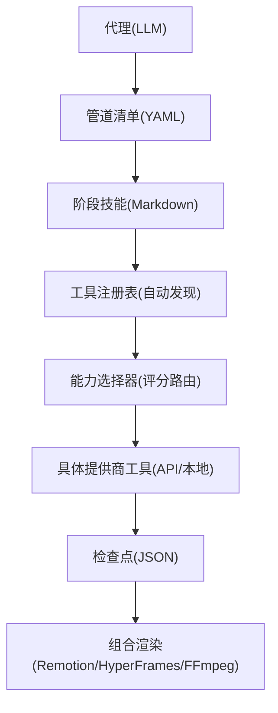
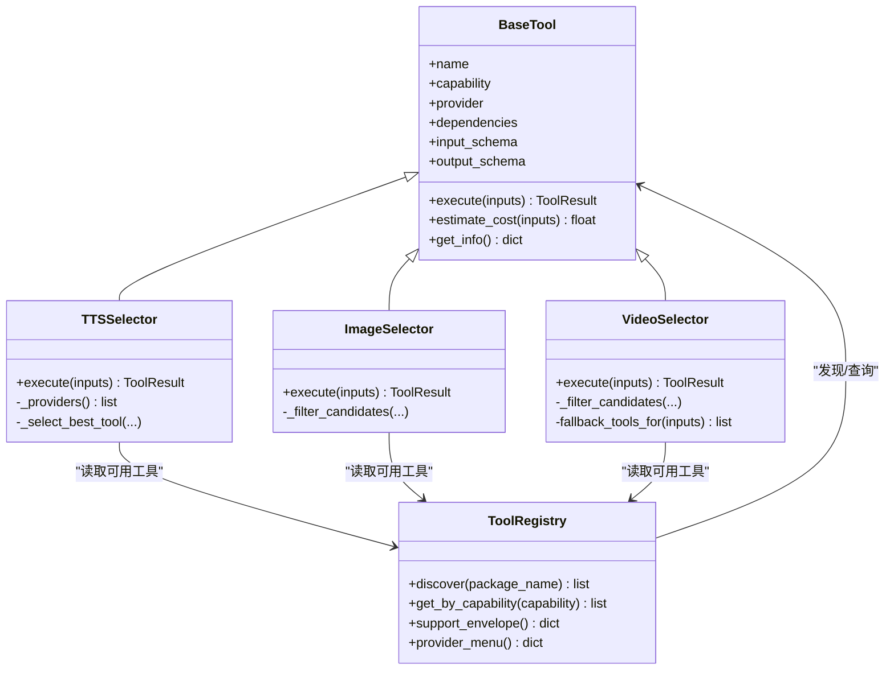
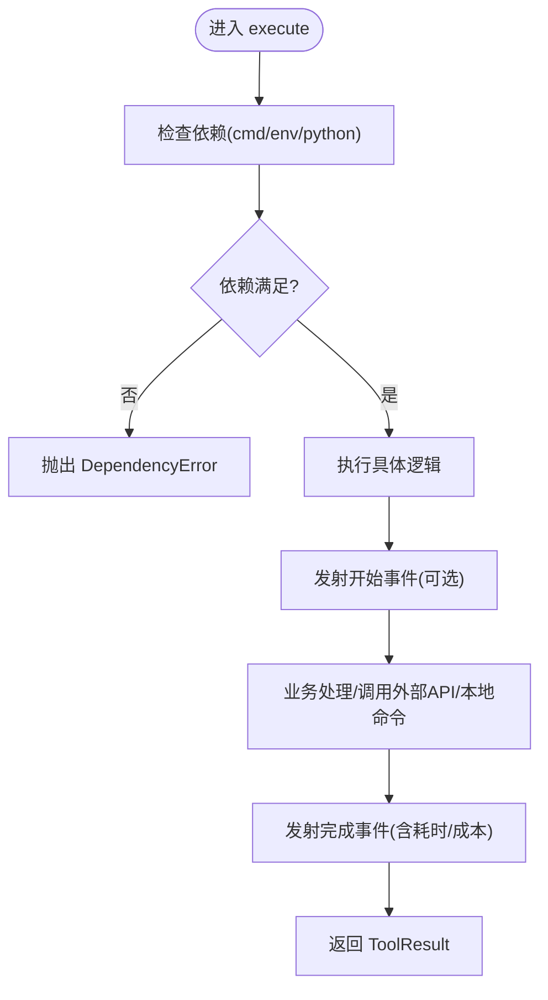
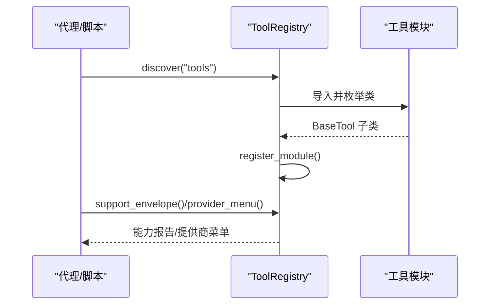
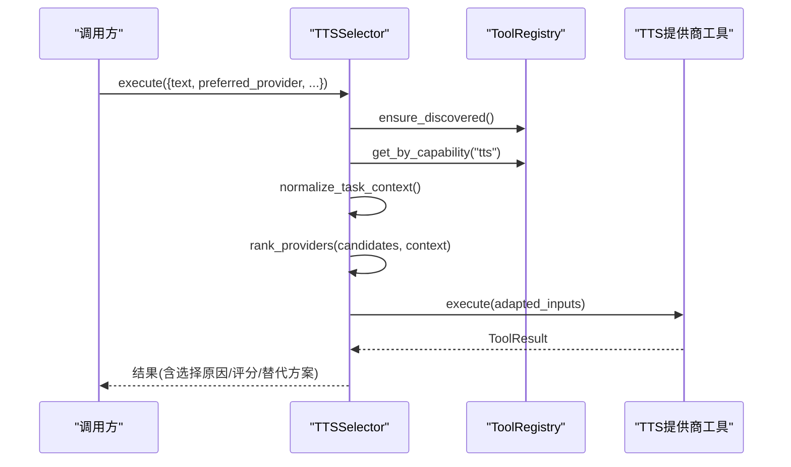
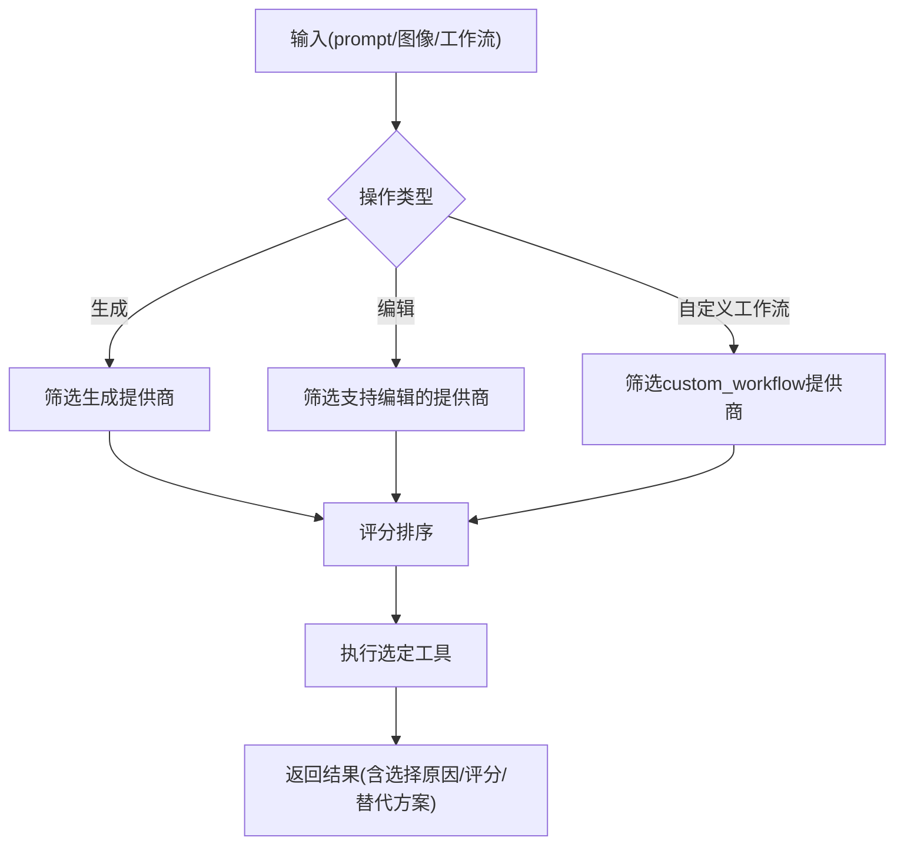
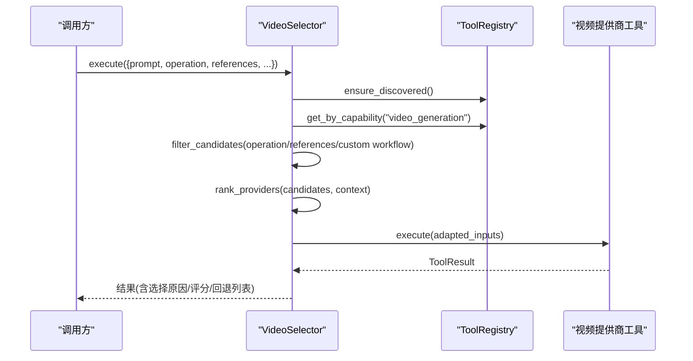
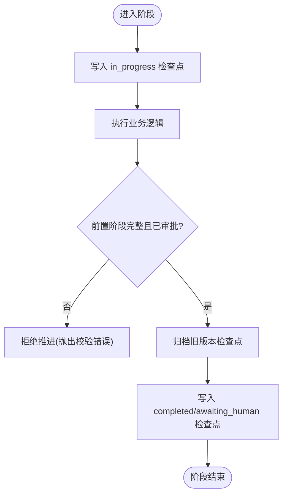
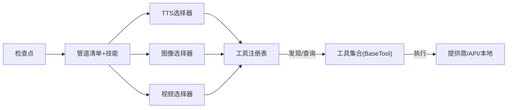

# 模块化与插件化架构

<cite>
**本文引用的文件**
- [README.md](file://README.md)
- [ARCHITECTURE.md](file://docs/ARCHITECTURE.md)
- [PROVIDERS.md](file://docs/PROVIDERS.md)
- [base_tool.py](file://tools/base_tool.py)
- [tool_registry.py](file://tools/tool_registry.py)
- [tts_selector.py](file://tools/audio/tts_selector.py)
- [image_selector.py](file://tools/graphics/image_selector.py)
- [video_selector.py](file://tools/video/video_selector.py)
- [checkpoint.py](file://lib/checkpoint.py)
- [delivery_promise.py](file://lib/delivery_promise.py)
</cite>

## 目录
1. [简介](#简介)
2. [项目结构](#项目结构)
3. [核心组件](#核心组件)
4. [架构总览](#架构总览)
5. [详细组件分析](#详细组件分析)
6. [依赖关系分析](#依赖关系分析)
7. [性能考量](#性能考量)
8. [故障排查指南](#故障排查指南)
9. [结论](#结论)
10. [附录：扩展点与插件开发示例](#附录：扩展点与插件开发示例)

## 简介
本文件面向希望理解并扩展 OpenMontage 模块化与插件化能力的开发者。OpenMontage 采用“代理编排 + 工具注册表 + 能力选择器”的架构，将 AI 服务、本地模型、素材库等异构能力统一抽象为可发现、可评分、可回退的工具；通过管道清单与阶段技能驱动生产流程，并以检查点机制保障可恢复性与质量门禁。

## 项目结构
OpenMontage 的核心由三层知识体系与两层运行时组成：
- 能力层（tools/）：以 BaseTool 为契约的统一工具集合，包含音视频生成、增强、分析、字幕、发布等能力。
- 编排层（pipeline_defs/ + skills/）：YAML 管道清单定义阶段顺序与产物；Markdown 技能文件指导代理如何执行每个阶段。
- 基础设施层（lib/）：配置、检查点、媒体规格、环境加载、交付承诺分类等。
- 渲染层（remotion-composer/ 与 HyperFrames）：多运行时组合引擎，按提案锁定并在 compose 阶段执行。

图表来源
- [ARCHITECTURE.md:10-27](file://docs/ARCHITECTURE.md#L10-L27)
- [ARCHITECTURE.md:102-168](file://docs/ARCHITECTURE.md#L102-L168)
- [ARCHITECTURE.md:448-475](file://docs/ARCHITECTURE.md#L448-L475)

章节来源
- [ARCHITECTURE.md:31-76](file://docs/ARCHITECTURE.md#L31-L76)
- [ARCHITECTURE.md:170-240](file://docs/ARCHITECTURE.md#L170-L240)

## 核心组件
- 工具契约与基类：所有工具继承自 BaseTool，声明身份、能力、依赖、资源需求、输入输出 Schema、回退链、Agent 技能引用等，并提供统一的 execute() 接口与结果 ToolResult。
- 工具注册表：单例 ToolRegistry，自动扫描 tools/ 包下所有 BaseTool 子类完成热插拔式发现；提供按能力/提供商/状态查询、支持信封报告、提供商菜单汇总等。
- 能力选择器：针对 tts、image_generation、video_generation 三大能力提供统一入口，基于评分引擎 rank_providers 进行多维权重选择，并支持用户偏好与允许列表过滤。
- 检查点系统：JSON 持久化管道状态，强制前置阶段完成与审批门禁，归档历史版本，支持中断恢复。
- 交付承诺：在提案阶段对“运动主导/源素材主导/数据解释/屏幕演示/混合/本地化”等类型进行分类，防止静默降级到不符合承诺的输出。

章节来源
- [base_tool.py:227-397](file://tools/base_tool.py#L227-L397)
- [tool_registry.py:55-134](file://tools/tool_registry.py#L55-L134)
- [tool_registry.py:198-314](file://tools/tool_registry.py#L198-L314)
- [tts_selector.py:15-225](file://tools/audio/tts_selector.py#L15-L225)
- [image_selector.py:15-332](file://tools/graphics/image_selector.py#L15-L332)
- [video_selector.py:15-366](file://tools/video/video_selector.py#L15-L366)
- [checkpoint.py:293-369](file://lib/checkpoint.py#L293-L369)
- [delivery_promise.py:1-26](file://lib/delivery_promise.py#L1-L26)

## 架构总览
OpenMontage 的模块化与插件化围绕以下原则展开：
- 职责分离：工具只负责单一能力实现；选择器负责跨提供商路由；注册表负责发现与元数据；检查点负责状态与门禁；渲染层负责最终合成。
- 松耦合组件：通过 BaseTool 契约与 JSON Schema 解耦上游调用方与下游实现；选择器屏蔽提供商差异，向上暴露统一输入。
- 动态加载与热插拔：新增工具只需放入对应子目录并继承 BaseTool，无需修改选择器或注册表即可被自动发现。
- 提供商适配器模式：选择器作为适配器，将通用任务上下文与参数适配为各提供商原生输入，并返回统一 ToolResult。
- 模块通信协议：以结构化 JSON 工件（检查点、制品清单、成本日志等）和 ToolResult 字段在阶段间传递；选择器在结果中记录所选工具、评分、替代方案与所需 Agent 技能。

图表来源
- [base_tool.py:227-397](file://tools/base_tool.py#L227-L397)
- [tool_registry.py:55-134](file://tools/tool_registry.py#L55-L134)
- [tts_selector.py:15-225](file://tools/audio/tts_selector.py#L15-L225)
- [image_selector.py:15-332](file://tools/graphics/image_selector.py#L15-L332)
- [video_selector.py:15-366](file://tools/video/video_selector.py#L15-L366)

## 详细组件分析

### 工具契约与基类（BaseTool）
- 设计要点
  - 统一身份与能力描述：name、version、tier、capability、provider、runtime、stability。
  - 依赖与环境：cmd/binary/env/python 依赖检测；.env 自动加载；install_instructions 提示。
  - 资源与重试：ResourceProfile 描述 CPU/RAM/VRAM/Disk/Network；RetryPolicy 控制重试策略。
  - 幂等与恢复：idempotency_key_fields 与 resume_support 支持幂等与断点续跑。
  - 执行与结果：execute(inputs) -> ToolResult，附带 success/data/artifacts/cost_usd/duration_seconds/model/seed。
  - 可观测性：execute 自动包装 Backlot 事件发射，记录 start/finish/error，便于看板追踪。
- 复杂度与影响
  - 依赖检查 O(n)，n 为依赖项数量；工具发现通过反射遍历模块类，时间复杂度与工具数量线性相关。
  - 事件包装非致命，异常不影响主执行路径。

图表来源
- [base_tool.py:227-397](file://tools/base_tool.py#L227-L397)
- [base_tool.py:148-224](file://tools/base_tool.py#L148-L224)

章节来源
- [base_tool.py:25-60](file://tools/base_tool.py#L25-L60)
- [base_tool.py:110-139](file://tools/base_tool.py#L110-L139)
- [base_tool.py:227-397](file://tools/base_tool.py#L227-L397)

### 工具注册表（ToolRegistry）
- 设计要点
  - 自动发现：discover(package_name) 使用 pkgutil.walk_packages 扫描 tools/ 包，跳过 base_tool 与 tool_registry 自身，注册所有 BaseTool 子类实例。
  - 查询接口：按 tier/capability/provider/status/stability 获取工具；find_fallback 根据 fallback/fallback_tools 查找可用回退。
  - 能力报告：support_envelope 返回全量工具契约；capability_catalog/provider_catalog 分组聚合；provider_menu 生成用户友好的能力菜单。
  - 预检摘要：provider_menu_summary 汇总 composition_runtimes、capabilities、setup_offers、runtime_warnings，供代理在预检时展示。
- 复杂度与影响
  - discover 一次扫描后缓存 _discovered_packages；后续查询 O(N)。
  - provider_menu_summary 会读取 video_compose/hyperframes_compose 的元信息，用于运行时可用性判断。

图表来源
- [tool_registry.py:118-134](file://tools/tool_registry.py#L118-L134)
- [tool_registry.py:198-314](file://tools/tool_registry.py#L198-L314)

章节来源
- [tool_registry.py:55-134](file://tools/tool_registry.py#L55-L134)
- [tool_registry.py:198-471](file://tools/tool_registry.py#L198-L471)

### 文本转语音选择器（TTSSelector）
- 职责：统一 TTS 能力入口，自动发现所有 capability="tts" 的工具，基于评分选择最佳提供商，并将通用参数适配到目标提供商。
- 关键行为
  - operation=rank 返回评分排名与解释；operation=generate 执行生成。
  - 支持 preferred_provider 与 allowed_providers 过滤。
  - 结果中包含 selected_tool、selected_provider、selection_reason、provider_score、alternatives_considered、agent_skills 等。
- 适配逻辑：例如将 speaking_rate/speed/pitch/output_format 等统一键映射到 Azure TTS 的 rate/pitch/output_format。

图表来源
- [tts_selector.py:15-225](file://tools/audio/tts_selector.py#L15-L225)
- [tts_selector.py:227-324](file://tools/audio/tts_selector.py#L227-L324)

章节来源
- [tts_selector.py:15-324](file://tools/audio/tts_selector.py#L15-L324)

### 图像生成选择器（ImageSelector）
- 职责：统一 image_generation 能力入口，覆盖生成与图库两类提供商；支持编辑模式与自定义 ComfyUI 工作流路由。
- 关键行为
  - 自动将 prompt/query、images/images_paths/image_urls 等统一键适配为目标工具 schema。
  - 支持 model/model_name、watermark、callback_url、workflow_json/workflow_path/output_node 等透传。
  - 自定义工作流仅路由至具备 custom_workflow 支持且后端可达的工具。
- 过滤策略：按 generation_mode、是否提供图像参考、是否指定 exact model 等过滤候选集。

图表来源
- [image_selector.py:15-332](file://tools/graphics/image_selector.py#L15-L332)
- [image_selector.py:403-467](file://tools/graphics/image_selector.py#L403-L467)

章节来源
- [image_selector.py:15-467](file://tools/graphics/image_selector.py#L15-L467)

### 视频生成选择器（VideoSelector）
- 职责：统一 video_generation 能力入口，覆盖云 API、本地模型与图库；严格区分需要运动的场景，避免静默降级为静态图片。
- 关键行为
  - 支持 text_to_video、image_to_video、reference_to_video、video_edit 等操作；operation=rank 返回评分。
  - 支持 preferred_provider_gap 阈值，仅在评分差距内尊重用户偏好。
  - 自动将 reference_image_path 上传为 URL（当目标提供商要求 URL）。
  - fallback_tools_for 在需要运动的场景中排除 image_selector 作为回退。
- 过滤策略：按 operation、supports 标志、is_operation_available、exact model、自定义工作流等过滤候选。

图表来源
- [video_selector.py:15-366](file://tools/video/video_selector.py#L15-L366)
- [video_selector.py:368-568](file://tools/video/video_selector.py#L368-L568)

章节来源
- [video_selector.py:15-568](file://tools/video/video_selector.py#L15-L568)

### 检查点与质量门禁（Checkpoint）
- 职责：持久化管道状态，强制执行前置阶段完成与审批门禁，归档历史版本，支持中断恢复。
- 关键行为
  - 推进到 awaiting_human/completed 前校验前置阶段是否 completed 且已审批。
  - 写入 checkpoint 前先归档旧版本，保留审计轨迹。
  - in_progress 心跳保持可观测，失败仍可继续检查与恢复。

图表来源
- [checkpoint.py:293-369](file://lib/checkpoint.py#L293-L369)

章节来源
- [checkpoint.py:293-369](file://lib/checkpoint.py#L293-L369)

### 交付承诺（Delivery Promise）
- 职责：在提案阶段对产出类型进行分类，确保 compose 阶段不会静默降级到违背承诺的输出（如将“运动主导”降级为“幻灯片式”）。
- 作用：与质量门禁结合，阻止不合规的渲染计划进入生产。

章节来源
- [delivery_promise.py:1-26](file://lib/delivery_promise.py#L1-L26)

## 依赖关系分析
- 组件耦合
  - 选择器强依赖注册表进行工具发现与状态查询；弱依赖评分引擎（按需导入），降低启动开销。
  - 工具之间无直接耦合，均通过 BaseTool 契约与 ToolResult 交互。
  - 检查点与管道清单解耦，仅通过 pipeline_type 与 stage 名称关联。
- 外部依赖
  - 提供商 API（云）、本地二进制（FFmpeg）、Node.js（Remotion/HyperFrames）、GPU（本地模型）。
  - .env 环境变量注入密钥与开关。

图表来源
- [tool_registry.py:118-134](file://tools/tool_registry.py#L118-L134)
- [tts_selector.py:157-167](file://tools/audio/tts_selector.py#L157-L167)
- [image_selector.py:185-195](file://tools/graphics/image_selector.py#L185-L195)
- [video_selector.py:248-253](file://tools/video/video_selector.py#L248-L253)

章节来源
- [tool_registry.py:118-134](file://tools/tool_registry.py#L118-L134)
- [tts_selector.py:157-167](file://tools/audio/tts_selector.py#L157-L167)
- [image_selector.py:185-195](file://tools/graphics/image_selector.py#L185-L195)
- [video_selector.py:248-253](file://tools/video/video_selector.py#L248-L253)

## 性能考量
- 工具发现与查询：首次 discover 扫描包树，后续查询为内存索引，O(N) 线性；建议复用 registry 单例。
- 选择器评分：按候选数与维度计算加权分，通常 N 较小；可通过 allowed_providers 缩小候选集提升性能。
- 事件发射：execute 包装的事件发射为非致命，异常被吞掉，不影响主流程；在高并发场景注意 I/O 开销。
- 自定义工作流：仅路由至后端可达的提供商，避免无效尝试；建议在预检阶段验证 output_node 与服务器连通性。
- 本地 GPU：VRAM 需求高的工具应通过 resource_profile 声明，以便调度与预算治理。

[本节为通用指导，不直接分析具体文件]

## 故障排查指南
- 工具不可用
  - 现象：get_status() 返回 unavailable/degraded。
  - 排查：检查 dependencies（cmd/env/python）是否满足；查看 install_instructions；确认 .env 变量是否正确加载。
- 选择器未选中期望提供商
  - 现象：结果中的 selected_provider 非预期。
  - 排查：检查 preferred_provider 与 preferred_provider_gap；确认 allowed_providers；查看 provider_score 与 selection_reason。
- 视频生成静默降级为图片
  - 现象：需要运动的场景输出了静态图。
  - 排查：确认 operation 是否为 image_to_video/reference_to_video/video_edit；检查 fallback_tools_for 是否排除了 image_selector。
- 检查点无法推进
  - 现象：推进到 awaiting_human/completed 时报错。
  - 排查：检查前置阶段是否 completed 且 human_approved=True；查看历史检查点与流水线阶段顺序。

章节来源
- [base_tool.py:296-328](file://tools/base_tool.py#L296-L328)
- [video_selector.py:264-278](file://tools/video/video_selector.py#L264-L278)
- [checkpoint.py:293-369](file://lib/checkpoint.py#L293-L369)

## 结论
OpenMontage 通过 BaseTool 契约、工具注册表与能力选择器实现了高度模块化与插件化的架构。新增工具即插即用，选择器屏蔽提供商差异，检查点保障流程可控与可恢复，交付承诺与质量门禁确保输出符合预期。该设计使系统既能灵活接入新 AI 服务，又能稳定支撑复杂的多阶段视频生产。

[本节为总结，不直接分析具体文件]

## 附录：扩展点与插件开发示例

### 扩展点识别
- 新增工具
  - 在 tools/ 对应子目录下创建 Python 文件，继承 BaseTool，实现 execute()，声明 input_schema/output_schema、dependencies、resource_profile、fallback_tools 等。
  - 无需修改选择器或注册表，discover() 会自动发现。
- 新增提供商
  - 遵循 BaseTool 契约，设置 provider 与 capability；若需自定义工作流，声明 supports.custom_workflow 并确保后端可达。
- 新增管道
  - 在 pipeline_defs/ 添加 YAML 清单，定义 stages、produces、tools_available、review_focus、success_criteria 等。
  - 在 skills/pipelines/ 添加阶段技能 Markdown，指导代理如何执行。

章节来源
- [ARCHITECTURE.md:170-240](file://docs/ARCHITECTURE.md#L170-L240)
- [README.md:707-724](file://README.md#L707-L724)

### 插件开发示例（文本转语音）
- 步骤
  - 新建 tools/audio/my_tts.py，继承 BaseTool，设置 name、capability="tts"、provider="my_tts"、dependencies（如 env:MY_TTS_API_KEY）。
  - 实现 execute(inputs) -> ToolResult，返回 data.artifacts（音频路径）、cost_usd、duration_seconds 等。
  - 可选：实现 estimate_cost/estimate_runtime、dry_run、idempotency_key。
  - 运行 registry.discover() 后，可在 tts_selector 中自动被发现与评分选择。
- 注意事项
  - 输入键名尽量兼容 selector 的通用键（如 text、voice_id、language_code、timestamps）。
  - 若需自定义工作流或特殊参数，请在 input_schema 中声明，并在选择器适配逻辑中考虑透传。

章节来源
- [tts_selector.py:15-225](file://tools/audio/tts_selector.py#L15-L225)
- [base_tool.py:227-397](file://tools/base_tool.py#L227-L397)

### 提供商适配器模式说明
- 选择器作为适配器，将通用任务上下文与参数转换为各提供商原生输入，并返回统一 ToolResult。
- 典型适配
  - TTS：speaking_rate/speed/pitch/output_format -> Azure TTS 的 rate/pitch/output_format。
  - 图像：prompt/query、images/image_paths/image_urls -> images 数组；model_name -> model。
  - 视频：reference_image_path -> 自动上传为 URL；operation -> supports 标志与 is_operation_available 检查。
- 优势：上层调用方无需感知提供商差异；新增提供商仅需实现 BaseTool 契约。

章节来源
- [tts_selector.py:227-256](file://tools/audio/tts_selector.py#L227-L256)
- [image_selector.py:243-318](file://tools/graphics/image_selector.py#L243-L318)
- [video_selector.py:334-352](file://tools/video/video_selector.py#L334-L352)

### 模块间通信协议与数据交换格式
- 工具间通信：ToolResult 字段（success/data/artifacts/cost_usd/duration_seconds/model/seed）。
- 阶段间通信：检查点 JSON（stage/status/artifacts/review/cost_snapshot 等），受 JSON Schema 约束。
- 选择器结果：包含 selected_tool、selected_provider、selection_reason、provider_score、alternatives_considered、agent_skills 等，便于代理决策与审计。

章节来源
- [base_tool.py:128-139](file://tools/base_tool.py#L128-L139)
- [ARCHITECTURE.md:243-287](file://docs/ARCHITECTURE.md#L243-L287)
- [tts_selector.py:190-225](file://tools/audio/tts_selector.py#L190-L225)
- [image_selector.py:218-332](file://tools/graphics/image_selector.py#L218-L332)
- [video_selector.py:308-366](file://tools/video/video_selector.py#L308-L366)

### 提供商与能力概览（参考）
- 视频、图像、TTS、音乐、增强、分析、字幕、发布等能力均有多个提供商实现，可通过 provider_menu_summary 查看当前可用与待配置项。
- 推荐从免费能力起步，逐步添加付费提供商以获得更高质量与更多功能。

章节来源
- [PROVIDERS.md:7-81](file://docs/PROVIDERS.md#L7-L81)
- [tool_registry.py:316-471](file://tools/tool_registry.py#L316-L471)