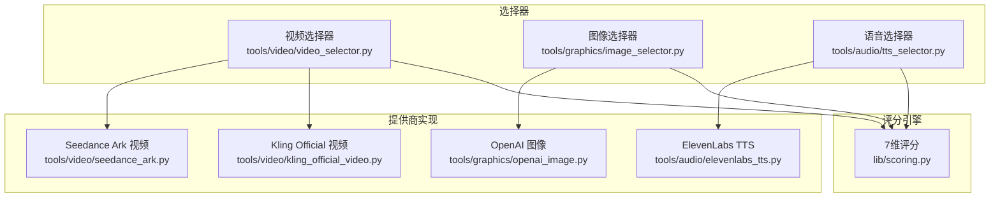
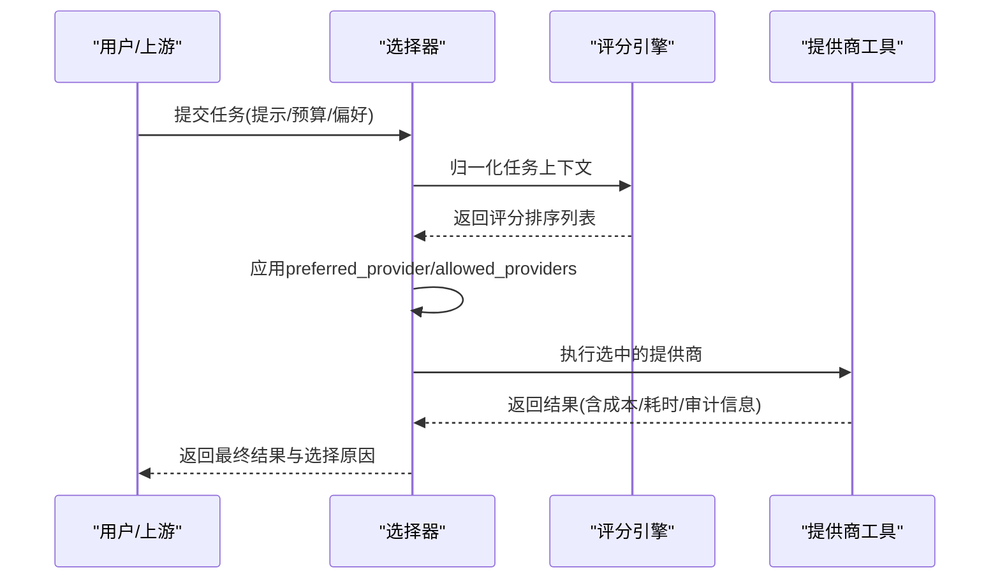
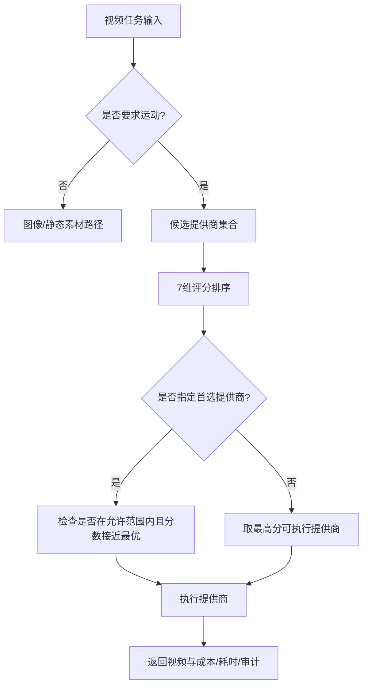
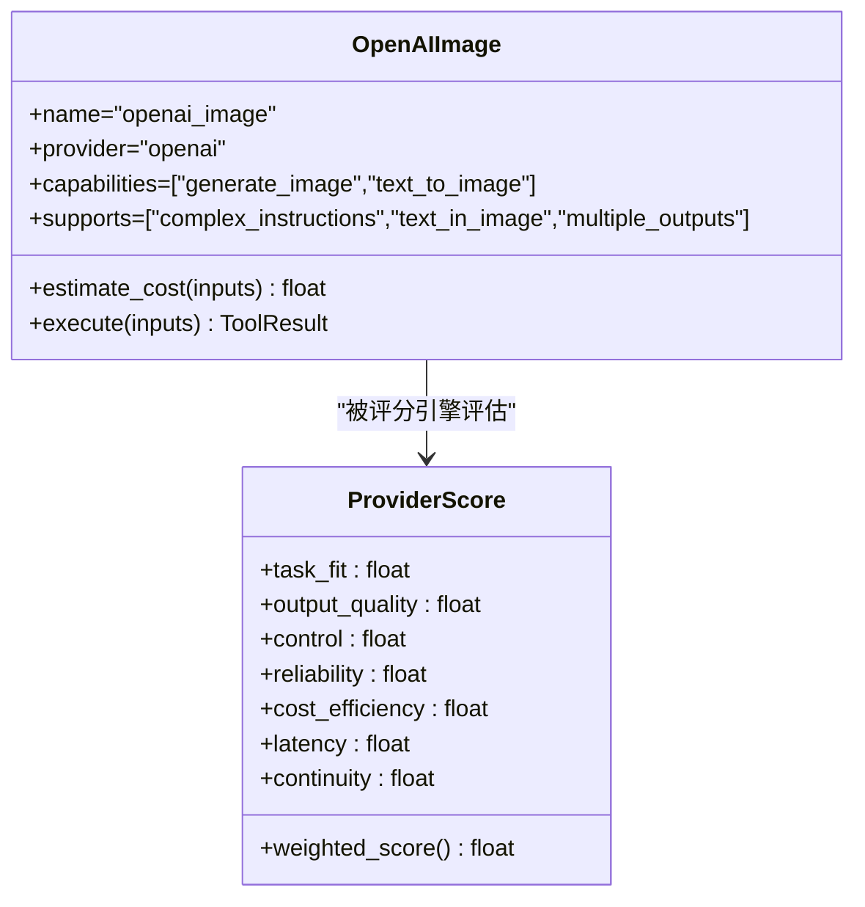
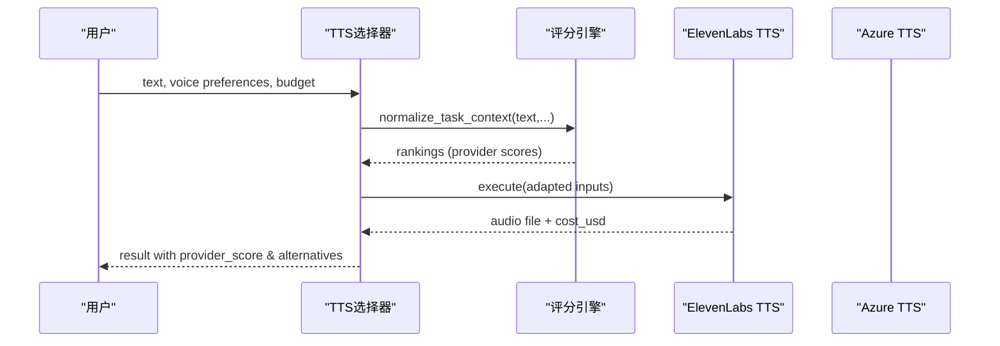
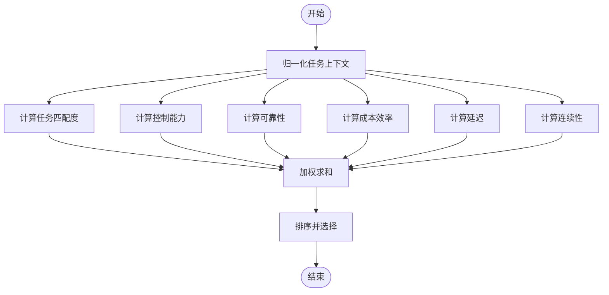
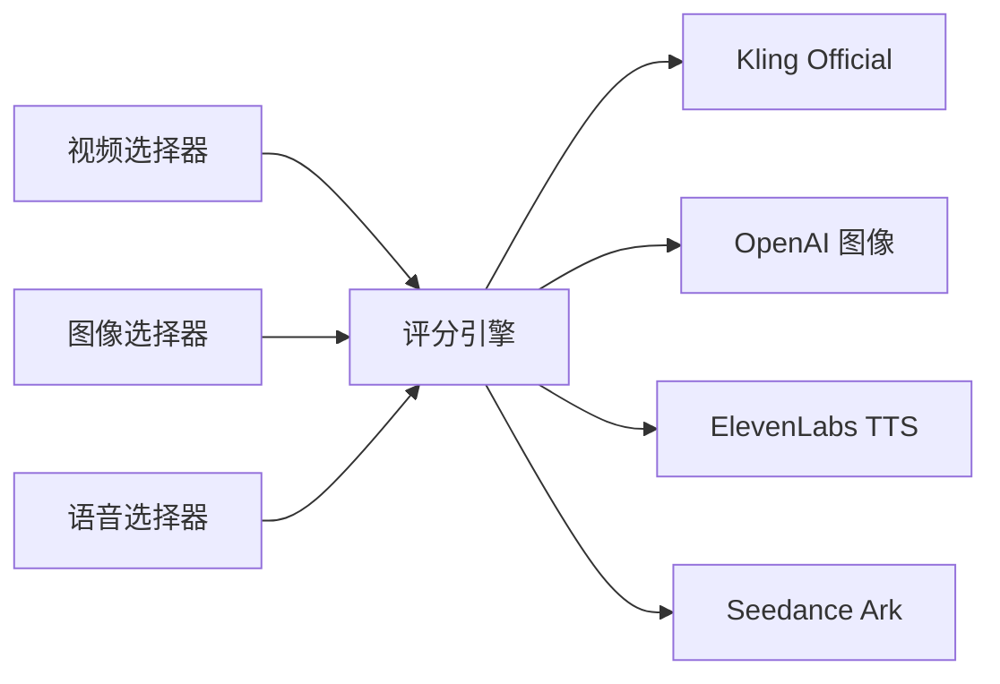

# 支持的提供商

<cite>
**本文引用的文件**
- [docs/PROVIDERS.md](file://docs/PROVIDERS.md)
- [.env.example](file://.env.example)
- [lib/scoring.py](file://lib/scoring.py)
- [tools/video/video_selector.py](file://tools/video/video_selector.py)
- [tools/graphics/image_selector.py](file://tools/graphics/image_selector.py)
- [tools/audio/tts_selector.py](file://tools/audio/tts_selector.py)
- [tools/video/kling_official_video.py](file://tools/video/kling_official_video.py)
- [tools/graphics/openai_image.py](file://tools/graphics/openai_image.py)
- [tools/audio/elevenlabs_tts.py](file://tools/audio/elevenlabs_tts.py)
- [tools/video/seedance_ark.py](file://tools/video/seedance_ark.py)
- [README.md](file://README.md)
</cite>

## 目录
1. [简介](#简介)
2. [项目结构](#项目结构)
3. [核心组件](#核心组件)
4. [架构总览](#架构总览)
5. [详细组件分析](#详细组件分析)
6. [依赖关系分析](#依赖关系分析)
7. [性能与成本考量](#性能与成本考量)
8. [故障排除指南](#故障排除指南)
9. [结论](#结论)
10. [附录：快速配置清单](#附录快速配置清单)

## 简介
本文件为 OpenMontage 的“提供商支持”权威文档，覆盖视频生成、图像生成、语音合成（TTS）、音乐与音效等能力，并给出各提供商的特点、价格区间、免费额度与技术限制。同时说明如何配置 API 密钥与连接参数，解释智能提供商选择机制（7 维度评分算法），并提供本地模型与云端 API 的选择策略、常见问题解决方案与使用建议，帮助用户按需组合最佳提供商。

## 项目结构
OpenMontage 将“提供商能力”以工具（BaseTool）形式注册，并通过选择器（Selector）在运行时自动发现、打分与路由。关键路径如下：
- 提供商实现：位于 tools/video、tools/graphics、tools/audio 下，每个文件对应一个具体提供商或网关。
- 选择器：video_selector、image_selector、tts_selector 负责候选过滤、任务上下文归一化、7 维评分与最终执行。
- 评分引擎：lib/scoring.py 提供统一的评分与排序逻辑。
- 环境配置：.env.example 集中列出所有环境变量；docs/PROVIDERS.md 提供按提供商的配置与定价说明。

**图示来源**
- [tools/video/video_selector.py:294-440](file://tools/video/video_selector.py#L294-L440)
- [tools/graphics/image_selector.py:218-375](file://tools/graphics/image_selector.py#L218-L375)
- [tools/audio/tts_selector.py:157-324](file://tools/audio/tts_selector.py#L157-L324)
- [lib/scoring.py:21-70](file://lib/scoring.py#L21-L70)

**章节来源**
- [docs/PROVIDERS.md:1-800](file://docs/PROVIDERS.md#L1-L800)
- [.env.example:1-135](file://.env.example#L1-L135)

## 核心组件
- 7 维评分引擎：任务匹配度（30%）、输出质量（20%）、控制能力（15%）、可靠性（15%）、成本效率（10%）、延迟（5%）、连续性（5%）。通过 normalize_task_context 将松散提示词扩展为结构化意图与风格关键词，再计算加权得分并排序。
- 选择器：视频/图像/TTS 三类选择器统一调用评分引擎，支持 preferred_provider 与 allowed_providers 约束，并在结果中记录 selected_tool、selected_provider、provider_score、alternatives_considered 等审计字段。
- 提供商工具：每个提供商实现声明 dependencies、capabilities、supports、best_for、not_good_for、resource_profile、retry_policy、estimate_cost 等元数据，供选择器评估与预算控制。

**章节来源**
- [lib/scoring.py:21-70](file://lib/scoring.py#L21-L70)
- [lib/scoring.py:297-359](file://lib/scoring.py#L297-L359)
- [lib/scoring.py:373-542](file://lib/scoring.py#L373-L542)
- [tools/video/video_selector.py:294-440](file://tools/video/video_selector.py#L294-L440)
- [tools/graphics/image_selector.py:218-375](file://tools/graphics/image_selector.py#L218-L375)
- [tools/audio/tts_selector.py:157-324](file://tools/audio/tts_selector.py#L157-L324)

## 架构总览
下图展示从用户输入到提供商执行的完整流程，包括选择器的候选过滤、评分排序、偏好优先、实际执行与结果回传。

**图示来源**
- [tools/video/video_selector.py:294-440](file://tools/video/video_selector.py#L294-L440)
- [tools/graphics/image_selector.py:218-375](file://tools/graphics/image_selector.py#L218-L375)
- [tools/audio/tts_selector.py:190-225](file://tools/audio/tts_selector.py#L190-L225)
- [lib/scoring.py:533-542](file://lib/scoring.py#L533-L542)

## 详细组件分析

### 视频生成提供商（20+）
OpenMontage 已集成大量视频生成能力，涵盖直接官方 API、多模型网关与本地推理。以下为主要类别与代表提供商：
- 官方直连
  - Kling Official：文本/图像/参考条件视频，Omni 系列，支持多镜头、相机控制、原生音频等高级特性。
  - Volcengine Ark（Seedance 2.0/2.5）：官方直连 Seedance，支持文本/图像/多模态参考，异步任务与取消。
  - Tencent Hunyuan Cloud Video：TokenHub Bearer 认证，中文友好，T2V/I2V。
  - Volcengine Jimeng（即梦 AI）：HMAC-SHA256 V4 签名，TI2V v3.0 Pro。
- 多模型网关
  - fal.ai：FLUX/Recraft/Seedream 图像，Kling/Veo/MiniMax/Gemini Omni/Seedance/WAN 视频。
  - Atlas Cloud：统一入口聚合 Seedance、Gemini Omni、MiniMax H3、GPT Image 2、Nano Banana 等。
  - Runway：Gen-4、Seedance 2.5、Gemini Omni、MiniMax H3。
  - HeyGen：Avatar 视频网关。
- 其他与本地
  - MiniMax 官方直连（图像与视频）。
  - ComfyUI 节点（部分托管、部分本地权重）。
  - 本地模型：WAN 2.1/2.2、Hunyuan、CogVideo、LTX-2 等（需 GPU）。

**图示来源**
- [lib/scoring.py:205-232](file://lib/scoring.py#L205-L232)
- [lib/scoring.py:373-542](file://lib/scoring.py#L373-L542)
- [tools/video/video_selector.py:294-440](file://tools/video/video_selector.py#L294-L440)

**章节来源**
- [docs/PROVIDERS.md:85-103](file://docs/PROVIDERS.md#L85-L103)
- [docs/PROVIDERS.md:144-189](file://docs/PROVIDERS.md#L144-L189)
- [docs/PROVIDERS.md:191-254](file://docs/PROVIDERS.md#L191-L254)
- [docs/PROVIDERS.md:311-358](file://docs/PROVIDERS.md#L311-L358)
- [docs/PROVIDERS.md:407-431](file://docs/PROVIDERS.md#L407-L431)
- [docs/PROVIDERS.md:433-473](file://docs/PROVIDERS.md#L433-L473)
- [docs/PROVIDERS.md:584-655](file://docs/PROVIDERS.md#L584-L655)
- [tools/video/kling_official_video.py:45-79](file://tools/video/kling_official_video.py#L45-L79)
- [tools/video/seedance_ark.py:492-514](file://tools/video/seedance_ark.py#L492-L514)

### 图像生成提供商（15+）
- 多模型网关：fal.ai（FLUX、Recraft、Seedream）、Atlas Cloud（GPT Image 2、Nano Banana 2、Seedream 5.0 Pro）。
- 官方直连：OpenAI（GPT Image 2）、Google Imagen（Imagen 4/Gemini 2.5 Flash Image）、MiniMax（图像-01/01-live）、Tencent Hunyuan（TokenHub）。
- 其他：ComfyUI、本地扩散（Stable Diffusion）。

**图示来源**
- [tools/graphics/openai_image.py:25-54](file://tools/graphics/openai_image.py#L25-L54)
- [lib/scoring.py:21-70](file://lib/scoring.py#L21-L70)

**章节来源**
- [docs/PROVIDERS.md:109-142](file://docs/PROVIDERS.md#L109-L142)
- [docs/PROVIDERS.md:256-291](file://docs/PROVIDERS.md#L256-L291)
- [docs/PROVIDERS.md:293-309](file://docs/PROVIDERS.md#L293-L309)
- [docs/PROVIDERS.md:311-358](file://docs/PROVIDERS.md#L311-L358)
- [docs/PROVIDERS.md:360-405](file://docs/PROVIDERS.md#L360-L405)
- [docs/PROVIDERS.md:407-431](file://docs/PROVIDERS.md#L407-L431)
- [tools/graphics/openai_image.py:25-184](file://tools/graphics/openai_image.py#L25-L184)

### 语音合成（TTS）与音乐（10+）
- TTS：ElevenLabs、Google TTS、OpenAI TTS、Azure TTS、Doubao Speech、DashScope Qwen-TTS、fish.audio、Kling TTS、fal.ai ElevenLabs、Piper（本地）。
- 音乐/音效：ElevenLabs Music、Suno、fal.ai ElevenLabs Music、Pixabay/Freesound 等。

**图示来源**
- [tools/audio/tts_selector.py:190-225](file://tools/audio/tts_selector.py#L190-L225)
- [tools/audio/elevenlabs_tts.py:24-68](file://tools/audio/elevenlabs_tts.py#L24-L68)
- [lib/scoring.py:297-359](file://lib/scoring.py#L297-L359)

**章节来源**
- [docs/PROVIDERS.md:475-501](file://docs/PROVIDERS.md#L475-L501)
- [docs/PROVIDERS.md:503-536](file://docs/PROVIDERS.md#L503-L536)
- [docs/PROVIDERS.md:538-582](file://docs/PROVIDERS.md#L538-L582)
- [docs/PROVIDERS.md:657-703](file://docs/PROVIDERS.md#L657-L703)
- [docs/PROVIDERS.md:705-761](file://docs/PROVIDERS.md#L705-L761)
- [tools/audio/elevenlabs_tts.py:24-200](file://tools/audio/elevenlabs_tts.py#L24-L200)

### 智能提供商选择机制（7 维度评分算法）
- 任务匹配度（30%）：基于 best_for 与意图/风格关键词的语义重叠与同义词簇扩展。
- 输出质量（20%）：优先使用 measured quality，否则按稳定性与 tier 推断。
- 控制能力（15%）：根据 supports 中的 controlnet/reference_image/style_transfer 等特征加权。
- 可靠性（15%）：历史成功率或可用性状态（production/beta/experimental）。
- 成本效率（10%）：结合预算剩余与估计成本，避免超支。
- 延迟（5%）：p50 延迟映射或运行类型启发式（local/hybrid/api）。
- 连续性（5%）：与已锁定提供商一致时加分，保持风格一致性。

**图示来源**
- [lib/scoring.py:21-70](file://lib/scoring.py#L21-L70)
- [lib/scoring.py:205-232](file://lib/scoring.py#L205-L232)
- [lib/scoring.py:234-295](file://lib/scoring.py#L234-L295)
- [lib/scoring.py:373-542](file://lib/scoring.py#L373-L542)

**章节来源**
- [README.md:664-675](file://README.md#L664-L675)
- [lib/scoring.py:21-70](file://lib/scoring.py#L21-L70)
- [lib/scoring.py:373-542](file://lib/scoring.py#L373-L542)

### 各提供商优缺点对比与使用建议
- 视频
  - Kling Official：优势在于官方直连、Omni 多参考与高级控制；适合高质量电影感短片。注意 Omni 引用与 4K 模式成本较高。
  - Seedance Ark：官方直连 Seedance 2.0/2.5，支持多模态参考与异步任务；适合需要稳定合同与可控流程的项目。
  - fal.ai：单 Key 覆盖广，适合快速实验与多模型对比；注意不同端点定价差异。
  - Tencent Hunyuan Cloud：中文理解强、认证简单；适合国内场景与预算透明。
- 图像
  - OpenAI GPT Image 2：擅长复杂指令与图文排版；适合品牌物料与信息图。
  - Google Imagen：共享 Google Key，生态整合好；适合已有 Google 云资源的项目。
  - fal.ai/Atlas：多模型一站式；适合需要灵活切换供应商的场景。
- 语音
  - ElevenLabs：音质与情感表达优秀；适合旁白与口播。
  - Google TTS：多语言与高免费额度；适合国际化内容。
  - Azure TTS：SSML 与多语种；适合企业级合规与可重复渲染。
  - Doubao/DashScope/fish.audio：中文与自然度表现突出；适合中文解说与创意配音。

[本节为概念性总结，不直接引用具体代码行]

### 本地模型与云端 API 的选择策略
- 本地模型（WAN/Hunyuan/CogVideo/LTX-2、Stable Diffusion）：零网络依赖、离线可用、无订阅费；需要 GPU 与部署成本，适合隐私敏感与批量生产。
- 云端 API：开箱即用、质量与功能领先、付费按量；适合快速迭代与高质量产出。
- 混合策略：先用云端进行创意探索与质量验证，再用本地模型进行规模化生产；或通过 ComfyUI 节点桥接托管服务与本地工作流。

[本节为概念性指导，不直接引用具体代码行]

## 依赖关系分析
- 选择器依赖评分引擎，评分引擎依赖各工具的 get_info()/get_status()/estimate_cost()。
- 提供商工具声明 dependencies（如 env:KLING_API_KEY），用于可用性检测与安装指引。
- 选择器支持 preferred_provider 与 allowed_providers，可在评分基础上做策略性偏置。

**图示来源**
- [tools/video/video_selector.py:294-440](file://tools/video/video_selector.py#L294-L440)
- [tools/graphics/image_selector.py:218-375](file://tools/graphics/image_selector.py#L218-L375)
- [tools/audio/tts_selector.py:157-324](file://tools/audio/tts_selector.py#L157-L324)
- [lib/scoring.py:533-542](file://lib/scoring.py#L533-L542)

**章节来源**
- [tools/video/kling_official_video.py:56-61](file://tools/video/kling_official_video.py#L56-L61)
- [tools/graphics/openai_image.py:36-41](file://tools/graphics/openai_image.py#L36-L41)
- [tools/audio/elevenlabs_tts.py:35-45](file://tools/audio/elevenlabs_tts.py#L35-L45)

## 性能与成本考量
- 成本估算：各提供商工具实现 estimate_cost，选择器在执行前可预估成本；预算控制支持 observe/warn/cap 模式与总预算上限。
- 延迟优化：评分引擎考虑 p50 延迟与运行类型；对长任务采用异步与轮询（如 Seedance Ark）。
- 质量权衡：对“电影感/预告片”类任务，具备 native_audio/multi_shot/camera_direction/lip_sync/cinematic_quality 的提供商会获得额外加分。

**章节来源**
- [README.md:664-685](file://README.md#L664-L685)
- [lib/scoring.py:424-446](file://lib/scoring.py#L424-L446)
- [lib/scoring.py:495-519](file://lib/scoring.py#L495-L519)
- [tools/video/seedance_ark.py:492-514](file://tools/video/seedance_ark.py#L492-L514)

## 故障排除指南
- 未设置 API Key：多数工具在 get_status 或 execute 中检查环境变量，缺失时会返回不可用或错误消息。请参照 .env.example 配置。
- 认证失败：确保 Key 格式正确（例如 Ark 不需要 Bearer 前缀；Jimeng 使用 HMAC-SHA256 V4 签名而非 Bearer）。
- 配额不足：检查各控制台余额与套餐；必要时切换到备选提供商或降低分辨率/时长。
- 超时与限流：利用 retry_policy 与 preferred_provider_gap 调整重试与偏好策略；对长任务使用异步接口与合理轮询间隔。
- 本地模型不可用：确认 GPU 驱动与依赖安装；启用 VIDEO_GEN_LOCAL_ENABLED 并设置 VIDEO_GEN_LOCAL_MODEL。

**章节来源**
- [.env.example:1-135](file://.env.example#L1-L135)
- [tools/video/kling_official_video.py:56-61](file://tools/video/kling_official_video.py#L56-L61)
- [tools/graphics/openai_image.py:113-131](file://tools/graphics/openai_image.py#L113-L131)
- [tools/audio/elevenlabs_tts.py:139-150](file://tools/audio/elevenlabs_tts.py#L139-L150)
- [docs/PROVIDERS.md:144-189](file://docs/PROVIDERS.md#L144-L189)
- [docs/PROVIDERS.md:191-254](file://docs/PROVIDERS.md#L191-L254)

## 结论
OpenMontage 通过统一的评分引擎与选择器，将数十个视频、图像与语音提供商无缝整合，既支持云端高质量产出，也兼容本地离线生产。用户可根据预算、质量、延迟与连续性需求，灵活组合最佳提供商。建议在起步阶段优先配置免费与低成本选项，逐步引入付费能力以获得更高品质与更强控制。

[本节为总结性内容，不直接引用具体代码行]

## 附录：快速配置清单
- 免费起步
  - 图库：PEXELS_API_KEY、PIXABAY_API_KEY
  - 语音：GOOGLE_API_KEY（TTS 免费额度大）、ELEVENLABS_API_KEY（10K 字符/月）
  - 本地 TTS：安装 Piper（无需 Key）
- 图像与视频增强
  - FAL_KEY（多模型网关）
  - OPENAI_API_KEY（GPT Image 2）
  - GOOGLE_API_KEY（Imagen 4）
  - KLING_API_KEY（官方 Kling）
  - ARK_API_KEY（Seedance 官方直连）
  - RUNWAY_API_KEY（Gen-4）
  - HEYGEN_API_KEY（Avatar 网关）
  - SUNO_API_KEY（音乐）
  - TENCENT_TOKENHUB_API_KEY（混元视频/图像）
  - VOLC_ACCESSKEY/VOLC_SECRETKEY（即梦 AI）
- 本地视频/图像
  - VIDEO_GEN_LOCAL_ENABLED=true
  - VIDEO_GEN_LOCAL_MODEL=wan2.2-ti2v-5b|wan2.1-1.3b|wan2.1-14b|hunyuan-1.5|ltx2-local|cogvideo-5b
  - COMFYUI_SERVER_URL（可选）

**章节来源**
- [.env.example:1-135](file://.env.example#L1-L135)
- [docs/PROVIDERS.md:7-28](file://docs/PROVIDERS.md#L7-L28)