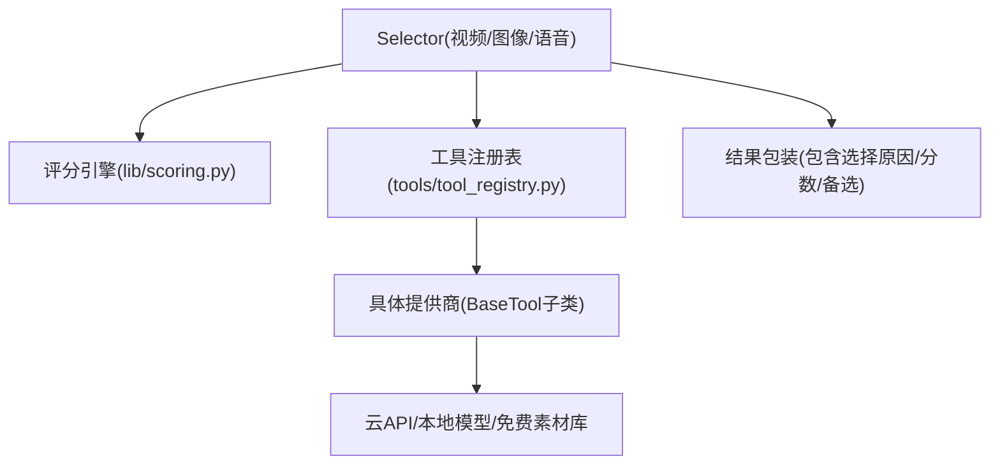
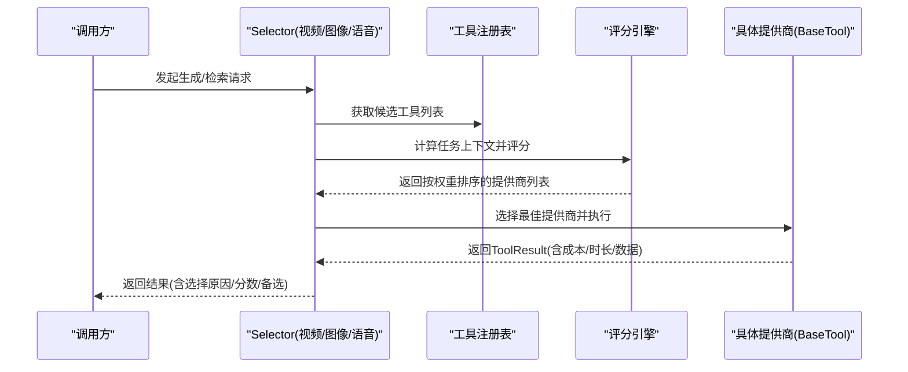
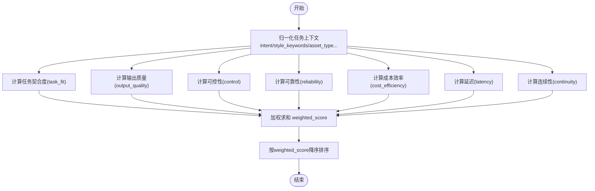
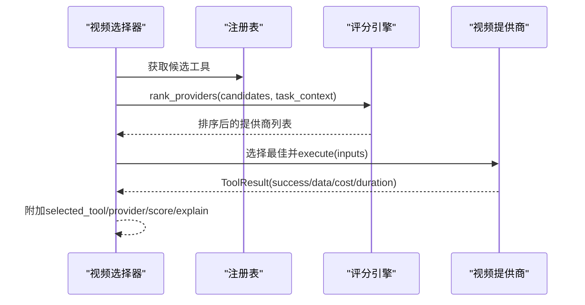
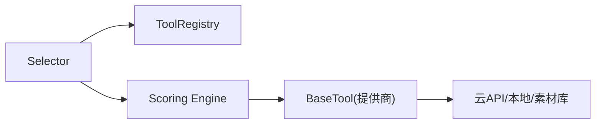

# AI提供商集成

<cite>
**本文引用的文件**
- [lib/scoring.py](file://lib/scoring.py)
- [tools/base_tool.py](file://tools/base_tool.py)
- [tools/tool_registry.py](file://tools/tool_registry.py)
- [tools/video/video_selector.py](file://tools/video/video_selector.py)
- [tools/graphics/image_selector.py](file://tools/graphics/image_selector.py)
- [tools/audio/tts_selector.py](file://tools/audio/tts_selector.py)
- [docs/PROVIDERS.md](file://docs/PROVIDERS.md)
- [tools/video/stock_sources/pixabay_video.py](file://tools/video/stock_sources/pixabay_video.py)
- [skills/creative/stock-sourcing-usage.md](file://skills/creative/stock-sourcing-usage.md)
- [.agents/skills/bfl-api/references/rate-limiting.md](file://.agents/skills/bfl-api/references/rate-limiting.md)
- [.agents/skills/bfl-api/references/error-handling.md](file://.agents/skills/bfl-api/references/error-handling.md)
- [tests/tools/test_video_selector_routing.py](file://tests/tools/test_video_selector_routing.py)
</cite>

## 目录
1. [简介](#简介)
2. [项目结构](#项目结构)
3. [核心组件](#核心组件)
4. [架构总览](#架构总览)
5. [详细组件分析](#详细组件分析)
6. [依赖关系分析](#依赖关系分析)
7. [性能与限流](#性能与限流)
8. [故障排查指南](#故障排查指南)
9. [结论](#结论)
10. [附录：新提供商接入与适配器规范](#附录：新提供商接入与适配器规范)

## 简介
本文件面向OpenMontage的AI提供商集成系统，系统性说明如何统一接入60+提供商（云API、本地模型、免费素材库），并重点解释“基于7个维度的加权评分引擎”如何自动选择最佳提供商。同时覆盖提供商配置管理、认证设置、限流处理与错误恢复机制，并提供新提供商接入指南与适配器开发规范，确保系统的可扩展性与稳定性。

## 项目结构
OpenMontage将“能力路由 + 具体提供商实现”解耦：
- 能力路由层：视频、图像、语音等Selector，负责候选工具收集、任务上下文归一化、评分排序与最终选择。
- 提供商实现层：每个Provider以BaseTool子类形式注册，声明能力、支持特性、成本估算、运行时信息等。
- 注册与发现：ToolRegistry统一扫描、注册、查询工具，提供按能力/提供商/状态筛选与菜单汇总。
- 评分引擎：lib/scoring.py提供7维度加权评分，驱动Selector选择最优路径。
- 免费素材库：stock_sources下多源适配器统一接入Pexels、Pixabay等免费素材。

图表来源
- [tools/video/video_selector.py:294-440](file://tools/video/video_selector.py#L294-L440)
- [lib/scoring.py:373-542](file://lib/scoring.py#L373-L542)
- [tools/tool_registry.py:118-134](file://tools/tool_registry.py#L118-L134)

章节来源
- [tools/video/video_selector.py:294-440](file://tools/video/video_selector.py#L294-L440)
- [tools/graphics/image_selector.py:243-349](file://tools/graphics/image_selector.py#L243-L349)
- [tools/audio/tts_selector.py:272-298](file://tools/audio/tts_selector.py#L272-L298)
- [tools/tool_registry.py:118-134](file://tools/tool_registry.py#L118-L134)

## 核心组件
- BaseTool：所有提供商的统一抽象，定义身份、能力、依赖、资源、重试策略、执行接口、成本/时长估算、状态报告等。
- ToolRegistry：工具发现、注册、查询与菜单生成，屏蔽底层差异，向上暴露能力视图。
- Selector（视频/图像/语音）：聚合候选工具、构建任务上下文、调用评分引擎、返回最佳工具及选择理由。
- 评分引擎（lib/scoring.py）：基于7维度加权评分，输出可解释的排名与解释文本。
- 免费素材库适配：stock_sources下的各源适配器遵循统一协议，便于被Selector纳入候选集。

章节来源
- [tools/base_tool.py:227-397](file://tools/base_tool.py#L227-L397)
- [tools/tool_registry.py:55-134](file://tools/tool_registry.py#L55-L134)
- [tools/video/video_selector.py:294-440](file://tools/video/video_selector.py#L294-L440)
- [lib/scoring.py:21-70](file://lib/scoring.py#L21-L70)

## 架构总览
下图展示了从请求到提供商执行的端到端流程，包括评分、选择、执行与结果回传。

图表来源
- [tools/video/video_selector.py:294-440](file://tools/video/video_selector.py#L294-L440)
- [lib/scoring.py:373-542](file://lib/scoring.py#L373-L542)
- [tools/base_tool.py:374-397](file://tools/base_tool.py#L374-L397)

## 详细组件分析

### 提供商选择算法（7维度加权评分引擎）
评分引擎对每个候选工具计算7个维度得分，并按固定权重加权得到总分，用于排序与择优：
- 任务契合度(task_fit, 权重0.30)：结合意图、风格关键词与工具best_for语义匹配，考虑同义词簇与token级重叠。
- 输出质量(output_quality, 权重0.20)：优先使用质量分，否则根据稳定性与tier推断。
- 可控性(control, 权重0.15)：依据supports中的控制能力（如reference_image、style_transfer、negative_prompt等）加权。
- 可靠性(reliability, 权重0.15)：历史成功率或可用性状态映射为分数。
- 成本效率(cost_efficiency, 权重0.10)：结合估计成本与剩余预算，或绝对成本启发式。
- 延迟(latency, 权重0.05)：优先使用历史p50延迟，否则按runtime类型启发。
- 连续性(continuity, 权重0.05)：与已锁定提供商一致时加分，保持风格一致性。

此外，针对特定场景有额外调整：
- 需要运动但工具仅支持图片：大幅降低task_fit。
- 偏好生成视觉内容且为素材类提供商：降低task_fit与output_quality。
- 需要参考条件或图像编辑：若supports满足则提升task_fit与控制力。
- 电影感/高质量视频任务：具备原生音频、多镜头、镜头控制、口型同步、电影级质量等特性的提供商获得加成。

图表来源
- [lib/scoring.py:21-70](file://lib/scoring.py#L21-L70)
- [lib/scoring.py:205-232](file://lib/scoring.py#L205-L232)
- [lib/scoring.py:234-295](file://lib/scoring.py#L234-L295)
- [lib/scoring.py:297-359](file://lib/scoring.py#L297-L359)
- [lib/scoring.py:373-530](file://lib/scoring.py#L373-L530)

章节来源
- [lib/scoring.py:21-70](file://lib/scoring.py#L21-L70)
- [lib/scoring.py:205-232](file://lib/scoring.py#L205-L232)
- [lib/scoring.py:234-295](file://lib/scoring.py#L234-L295)
- [lib/scoring.py:297-359](file://lib/scoring.py#L297-L359)
- [lib/scoring.py:373-530](file://lib/scoring.py#L373-L530)

### 选择器与执行流程（视频/图像/语音）
- 视频选择器：收集候选工具，构造任务上下文，调用rank_providers排序；支持preferred_provider与gap阈值，避免次优偏好干扰。
- 图像选择器：统一输入键（如query/prompt、images数组、model_name/model、n/num_images），剥离selector-only字段后转发给具体提供商。
- 语音选择器：类似流程，过滤可用工具，按评分选择TTS提供商。

图表来源
- [tools/video/video_selector.py:294-440](file://tools/video/video_selector.py#L294-L440)
- [tools/graphics/image_selector.py:243-349](file://tools/graphics/image_selector.py#L243-L349)
- [tools/audio/tts_selector.py:272-298](file://tools/audio/tts_selector.py#L272-L298)

章节来源
- [tools/video/video_selector.py:294-440](file://tools/video/video_selector.py#L294-L440)
- [tools/graphics/image_selector.py:243-349](file://tools/graphics/image_selector.py#L243-L349)
- [tools/audio/tts_selector.py:272-298](file://tools/audio/tts_selector.py#L272-L298)

### 提供商配置管理与认证
- .env加载：BaseTool在导入时加载根目录.env，确保API密钥在工具实例化前可用。
- 依赖声明：通过dependencies声明环境变量、命令、Python模块等依赖，get_status/check_dependencies据此判断可用性。
- 提供商文档：docs/PROVIDERS.md集中列出各提供商的环境变量、能力、定价与注意事项，便于快速配置。

章节来源
- [tools/base_tool.py:25-60](file://tools/base_tool.py#L25-L60)
- [tools/base_tool.py:296-328](file://tools/base_tool.py#L296-L328)
- [docs/PROVIDERS.md:29-81](file://docs/PROVIDERS.md#L29-L81)

### 免费素材库整合
- stock_sources提供多个免费素材源的适配器（如Pexels、Pixabay），遵循统一协议，便于被Selector纳入候选集。
- 使用建议：根据需求（类别、分辨率、动画/实拍、语言）选择合适源；注意各源速率限制与授权条款。

章节来源
- [tools/video/stock_sources/pixabay_video.py:1-35](file://tools/video/stock_sources/pixabay_video.py#L1-L35)
- [skills/creative/stock-sourcing-usage.md:1-60](file://skills/creative/stock-sourcing-usage.md#L1-L60)

## 依赖关系分析
- Selector依赖ToolRegistry获取候选工具，依赖评分引擎进行排序。
- 评分引擎依赖工具的元信息（best_for、supports、stability、tier、quality_score、historical_success_rate、latency_p50_seconds）与估计成本。
- BaseTool提供统一的执行接口与状态报告，使不同提供商可被同等对待。
- 测试用例验证了选择器在自定义ranking下的行为与preferred_provider gap逻辑。

图表来源
- [tools/tool_registry.py:118-134](file://tools/tool_registry.py#L118-L134)
- [lib/scoring.py:373-542](file://lib/scoring.py#L373-L542)
- [tools/base_tool.py:227-397](file://tools/base_tool.py#L227-L397)

章节来源
- [tests/tools/test_video_selector_routing.py:76-112](file://tests/tools/test_video_selector_routing.py#L76-L112)

## 性能与限流
- 延迟评分：优先使用历史p50延迟，否则按runtime类型启发赋值，影响整体加权得分。
- 成本效率：结合预算与估计成本，避免超支；无预算信息时使用绝对成本启发式。
- 限流与重试：
  - 通用实践：指数退避重试、监控429响应、记录命中率、队列缓冲高并发。
  - 区域分发：在高并发场景可按区域轮询或多端点负载。
- 供应商特定限流：例如Pixabay Video免费层为每分钟100次请求，适配器信任API侧限流。

章节来源
- [lib/scoring.py:424-445](file://lib/scoring.py#L424-L445)
- [lib/scoring.py:259-282](file://lib/scoring.py#L259-L282)
- [.agents/skills/bfl-api/references/rate-limiting.md:67-87](file://.agents/skills/bfl-api/references/rate-limiting.md#L67-L87)
- [.agents/skills/bfl-api/references/rate-limiting.md:197-247](file://.agents/skills/bfl-api/references/rate-limiting.md#L197-L247)
- [tools/video/stock_sources/pixabay_video.py:1-35](file://tools/video/stock_sources/pixabay_video.py#L1-L35)

## 故障排查指南
- 认证失败：检查.env中对应API Key是否设置，依赖声明是否正确；查看提供商文档确认所需环境变量。
- 限流触发：捕获429响应，读取Retry-After头，采用指数退避重试；监控命中率并适当降级或排队。
- 错误分类：区分认证错误、余额不足、参数校验错误、服务端错误等，分别采取重试、提示用户充值或修正参数。
- 选择器行为：当指定preferred_provider时，需确保其评分与最高分差距在允许范围内（gap阈值），否则会被更优选项替代。

章节来源
- [.agents/skills/bfl-api/references/error-handling.md:199-264](file://.agents/skills/bfl-api/references/error-handling.md#L199-L264)
- [.agents/skills/bfl-api/references/rate-limiting.md:67-87](file://.agents/skills/bfl-api/references/rate-limiting.md#L67-L87)
- [tools/video/video_selector.py:413-440](file://tools/video/video_selector.py#L413-L440)

## 结论
OpenMontage通过“Selector + 评分引擎 + BaseTool + Registry”的架构，实现了60+提供商的统一接入与智能选择。7维度加权评分引擎不仅考虑任务契合与质量，还兼顾可控性、可靠性、成本、延迟与连续性，使得选择过程透明、可解释、可优化。配合完善的配置管理、限流与错误恢复机制，系统在扩展性与稳定性方面具备良好基础。

## 附录：新提供商接入与适配器规范
- 继承BaseTool：实现name、capability、provider、supports、best_for、dependencies、input/output schema等契约字段。
- 注册与发现：放入对应能力包（video/audio/graphics等），由ToolRegistry自动发现并纳入候选集。
- 成本与时长估算：实现estimate_cost与estimate_runtime，供评分引擎评估成本效率与延迟。
- 状态与健康：通过check_dependencies与get_status声明可用性；必要时提供quality_score、historical_success_rate、latency_p50_seconds以提升评分准确性。
- 输入适配：遵循Selector的输入键约定（如prompt/query、images数组、model_name/model、n/num_images），并在execute中转换为提供商原生格式。
- 错误与限流：捕获并分类异常，支持重试与退避；遵守提供商速率限制，必要时降级或排队。
- 文档与配置：在docs/PROVIDERS.md补充环境配置、能力说明与定价；在技能文档中提供使用指南与最佳实践。

章节来源
- [PROJECT_CONTEXT.md:114-126](file://PROJECT_CONTEXT.md#L114-L126)
- [tools/base_tool.py:227-397](file://tools/base_tool.py#L227-L397)
- [tools/tool_registry.py:118-134](file://tools/tool_registry.py#L118-L134)
- [docs/PROVIDERS.md:29-81](file://docs/PROVIDERS.md#L29-L81)