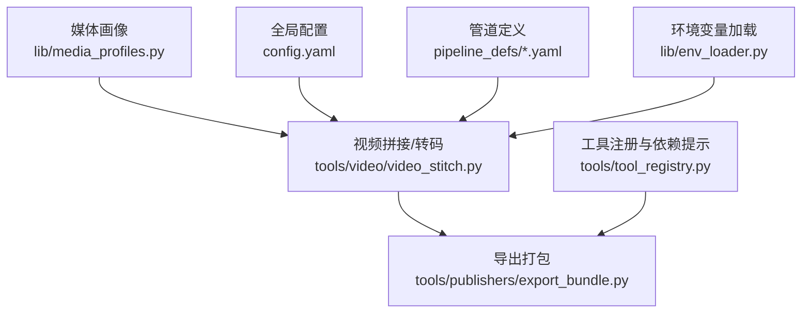
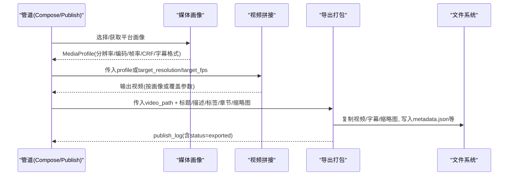
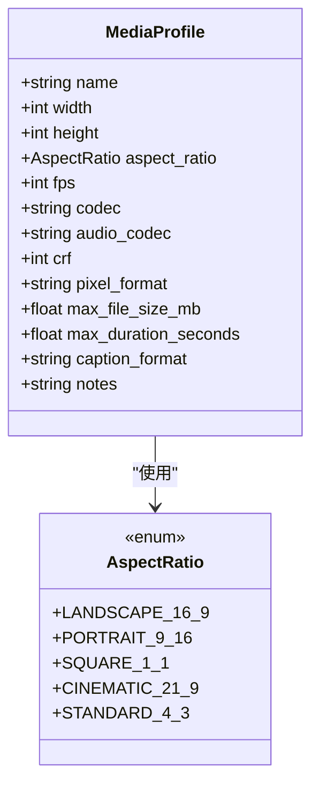
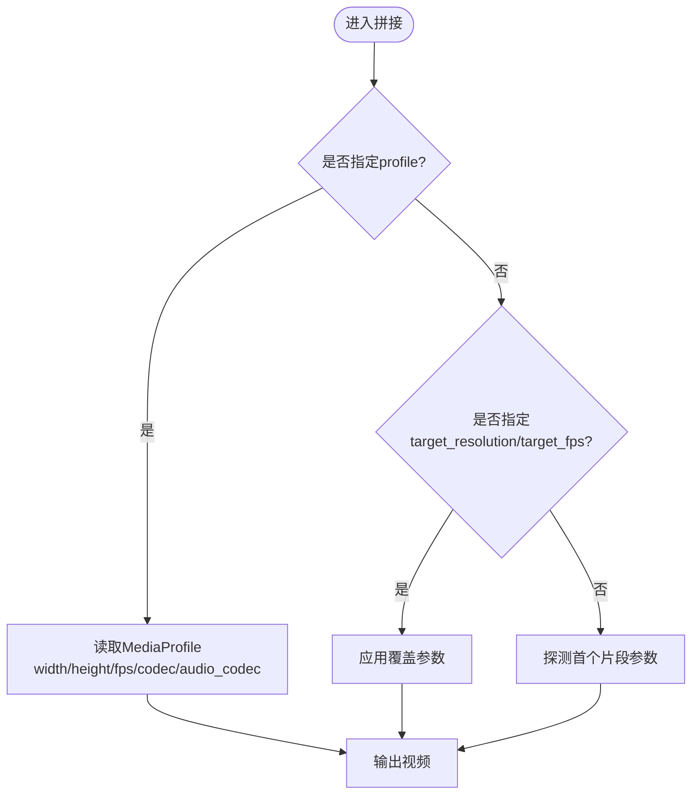
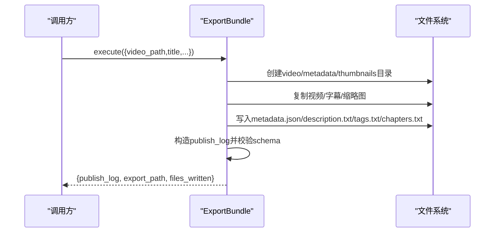
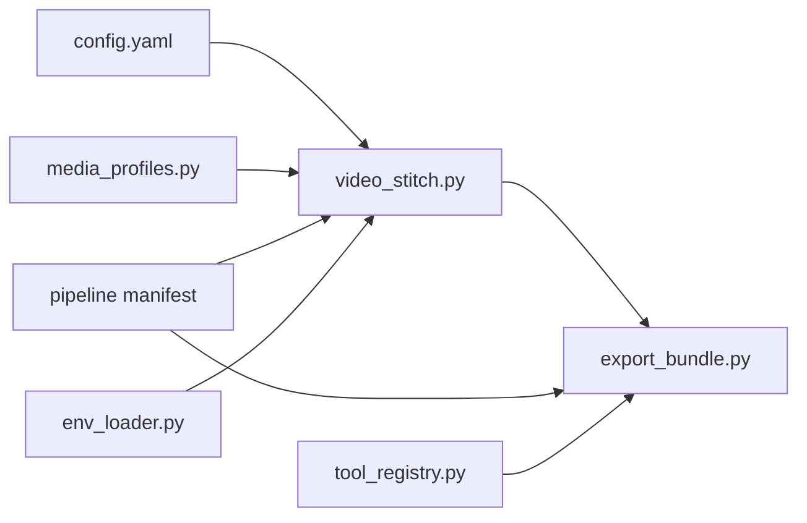

# 平台输出配置

<cite>
**本文引用的文件**
- [lib/media_profiles.py](file://lib/media_profiles.py)
- [tools/video/video_stitch.py](file://tools/video/video_stitch.py)
- [tools/publishers/export_bundle.py](file://tools/publishers/export_bundle.py)
- [config.yaml](file://config.yaml)
- [pipeline_defs/talking-head.yaml](file://pipeline_defs/talking-head.yaml)
- [pipeline_defs/documentary-montage.yaml](file://pipeline_defs/documentary-montage.yaml)
- [lib/env_loader.py](file://lib/env_loader.py)
- [tools/tool_registry.py](file://tools/tool_registry.py)
- [.agents/skills/ffmpeg/reference.md](file://.agents/skills/ffmpeg/reference.md)
- [skills/pipelines/explainer/publish-director.md](file://skills/pipelines/explainer/publish-director.md)
</cite>

## 目录
1. [简介](#简介)
2. [项目结构](#项目结构)
3. [核心组件](#核心组件)
4. [架构总览](#架构总览)
5. [详细组件分析](#详细组件分析)
6. [依赖关系分析](#依赖关系分析)
7. [性能考量](#性能考量)
8. [故障排查指南](#故障排查指南)
9. [结论](#结论)
10. [附录](#附录)

## 简介
本文件面向OpenMontage的“平台输出配置”能力，系统化说明如何为多平台（社交媒体、专业视频平台、企业内部系统）生成标准化视频输出。内容覆盖：
- 多平台发布支持：YouTube、TikTok、Instagram等主流平台的预设与适配要点
- 输出格式规范：视频编码参数、分辨率、帧率、音频格式与质量策略
- 批量处理机制：模板化配置、参数继承与环境变量管理
- 最佳实践：内容优化建议、元数据设置、SEO策略与章节标记

## 项目结构
OpenMontage将“平台输出配置”拆分为三层：
- 媒体画像层：集中定义各平台的分辨率、宽高比、编码、帧率、CRF、字幕格式等（MediaProfile）
- 渲染装配层：在剪辑/合成阶段按画像或输入覆盖确定最终输出参数
- 打包发布层：将成品视频与元数据、章节、标签、缩略图等打包成可交付的导出包，并生成schema校验通过的publish_log

图表来源
- [lib/media_profiles.py:1-166](file://lib/media_profiles.py#L1-L166)
- [tools/video/video_stitch.py:410-439](file://tools/video/video_stitch.py#L410-L439)
- [tools/publishers/export_bundle.py:39-127](file://tools/publishers/export_bundle.py#L39-L127)
- [config.yaml:20-26](file://config.yaml#L20-L26)
- [pipeline_defs/talking-head.yaml:213-229](file://pipeline_defs/talking-head.yaml#L213-L229)
- [lib/env_loader.py:15-34](file://lib/env_loader.py#L15-L34)
- [tools/tool_registry.py:420-451](file://tools/tool_registry.py#L420-L451)

章节来源
- [lib/media_profiles.py:1-166](file://lib/media_profiles.py#L1-L166)
- [tools/video/video_stitch.py:410-439](file://tools/video/video_stitch.py#L410-L439)
- [tools/publishers/export_bundle.py:39-127](file://tools/publishers/export_bundle.py#L39-L127)
- [config.yaml:20-26](file://config.yaml#L20-L26)
- [pipeline_defs/talking-head.yaml:213-229](file://pipeline_defs/talking-head.yaml#L213-L229)
- [lib/env_loader.py:15-34](file://lib/env_loader.py#L15-L34)
- [tools/tool_registry.py:420-451](file://tools/tool_registry.py#L420-L451)

## 核心组件
- 媒体画像（MediaProfile）：以平台为单位固化分辨率、宽高比、帧率、视频/音频编码、CRF、像素格式、最大时长/大小、字幕格式等，并提供FFmpeg输出参数生成
- 视频拼接器（video_stitch）：优先使用媒体画像；若未指定则从输入片段探测或显式目标覆盖；默认回退到常见HD参数
- 导出打包器（export_bundle）：将成品视频、字幕、描述、标签、章节、缩略图概念等打包为本地导出目录，并写入schema校验的publish_log
- 全局配置（config.yaml）：提供默认输出格式、编码、分辨率、帧率、CRF等基线值
- 管道定义（pipeline manifest）：通过stages编排，确保compose阶段产出render_report，publish阶段产出publish_log

章节来源
- [lib/media_profiles.py:22-166](file://lib/media_profiles.py#L22-L166)
- [tools/video/video_stitch.py:410-439](file://tools/video/video_stitch.py#L410-L439)
- [tools/publishers/export_bundle.py:39-127](file://tools/publishers/export_bundle.py#L39-L127)
- [config.yaml:20-26](file://config.yaml#L20-L26)
- [pipeline_defs/talking-head.yaml:213-229](file://pipeline_defs/talking-head.yaml#L213-L229)

## 架构总览
下图展示从“媒体画像”到“导出打包”的端到端流程，以及管道中compose与publish阶段的衔接。

图表来源
- [lib/media_profiles.py:142-166](file://lib/media_profiles.py#L142-L166)
- [tools/video/video_stitch.py:410-439](file://tools/video/video_stitch.py#L410-L439)
- [tools/publishers/export_bundle.py:158-285](file://tools/publishers/export_bundle.py#L158-L285)
- [pipeline_defs/talking-head.yaml:162-229](file://pipeline_defs/talking-head.yaml#L162-L229)

## 详细组件分析

### 媒体画像与平台适配
- 内置平台画像：YouTube横屏/4K/Shorts、Instagram Reels/Feed、TikTok、LinkedIn、电影宽屏、通用HD等
- 关键属性：名称、宽高、宽高比、帧率、视频编码、音频编码、CRF、像素格式、最大文件大小/时长、字幕格式、备注
- FFmpeg参数生成：根据画像自动组装-c:v/-c:a/-crf/-pix_fmt/-r/-vf scale

图表来源
- [lib/media_profiles.py:14-38](file://lib/media_profiles.py#L14-L38)
- [lib/media_profiles.py:42-139](file://lib/media_profiles.py#L42-L139)

章节来源
- [lib/media_profiles.py:14-166](file://lib/media_profiles.py#L14-L166)

### 视频拼接与参数继承
- 优先级：显式profile > target_resolution/target_fps > 首片段探测
- 默认回退：宽度/高度/帧率/编码采用合理默认值，保证无配置时仍可输出
- 与媒体画像集成：当传入profile时，直接读取对应分辨率/帧率/编码/音频编码

图表来源
- [tools/video/video_stitch.py:410-439](file://tools/video/video_stitch.py#L410-L439)

章节来源
- [tools/video/video_stitch.py:410-439](file://tools/video/video_stitch.py#L410-L439)

### 导出打包与发布日志
- 输入：video_path、title、可选description/tags/hashtags/chapters/subtitles_path/thumbnail_path/thumbnail_concept/platform/visibility/timestamp
- 输出：export_path、files_written、publish_log（经schema校验）
- 行为：复制视频与可选字幕/缩略图；写入metadata.json、description.txt、tags.txt、chapters.txt；生成publish_log条目status=exported

图表来源
- [tools/publishers/export_bundle.py:71-127](file://tools/publishers/export_bundle.py#L71-L127)
- [tools/publishers/export_bundle.py:158-285](file://tools/publishers/export_bundle.py#L158-L285)

章节来源
- [tools/publishers/export_bundle.py:39-308](file://tools/publishers/export_bundle.py#L39-L308)

### 管道中的输出与发布阶段
- compose阶段：负责渲染与合成，产出render_report，需满足分辨率/时长/音乐混音/结尾卡片等成功标准
- publish阶段：负责准备元数据与导出包，产出publish_log，确保导出包结构正确

章节来源
- [pipeline_defs/talking-head.yaml:162-229](file://pipeline_defs/talking-head.yaml#L162-L229)
- [pipeline_defs/documentary-montage.yaml:141-179](file://pipeline_defs/documentary-montage.yaml#L141-L179)

### 模板化配置与参数继承
- 全局默认：config.yaml提供default_format/default_codec/default_audio_codec/default_resolution/default_fps/default_crf作为基线
- 平台画像：通过MediaProfile对特定平台进行覆盖（分辨率/宽高比/编码/CRF/字幕格式等）
- 运行时覆盖：video_stitch支持target_resolution/target_fps/profile，实现细粒度控制
- 管道约束：各pipeline manifest在compose阶段对输出尺寸/时长/音乐/结尾卡片的成功标准进行约束，确保一致性

章节来源
- [config.yaml:20-26](file://config.yaml#L20-L26)
- [lib/media_profiles.py:42-139](file://lib/media_profiles.py#L42-L139)
- [tools/video/video_stitch.py:410-439](file://tools/video/video_stitch.py#L410-L439)
- [pipeline_defs/talking-head.yaml:162-229](file://pipeline_defs/talking-head.yaml#L162-L229)

### 环境变量管理
- .env加载：通过load_env在项目根目录加载.env，统一注入环境变量
- 取值与必填：get_env提供带默认值的读取；require_env用于强制要求的环境变量
- 工具依赖提示：tool_registry会扫描工具的dependencies与install_instructions，识别缺失的env key并给出修复建议

章节来源
- [lib/env_loader.py:15-34](file://lib/env_loader.py#L15-L34)
- [tools/tool_registry.py:420-451](file://tools/tool_registry.py#L420-L451)

## 依赖关系分析
- 媒体画像被视频拼接器引用，决定最终输出的分辨率/帧率/编码
- 导出打包器依赖成品视频路径与元数据，生成可交付的导出包与publish_log
- 管道manifest驱动compose与publish阶段，确保输出符合业务成功标准
- 全局配置提供默认值，媒体画像与运行时覆盖共同决定最终参数

图表来源
- [config.yaml:20-26](file://config.yaml#L20-L26)
- [lib/media_profiles.py:142-166](file://lib/media_profiles.py#L142-L166)
- [tools/video/video_stitch.py:410-439](file://tools/video/video_stitch.py#L410-L439)
- [tools/publishers/export_bundle.py:158-285](file://tools/publishers/export_bundle.py#L158-L285)
- [lib/env_loader.py:15-34](file://lib/env_loader.py#L15-L34)
- [tools/tool_registry.py:420-451](file://tools/tool_registry.py#L420-L451)

章节来源
- [lib/media_profiles.py:142-166](file://lib/media_profiles.py#L142-L166)
- [tools/video/video_stitch.py:410-439](file://tools/video/video_stitch.py#L410-L439)
- [tools/publishers/export_bundle.py:158-285](file://tools/publishers/export_bundle.py#L158-L285)
- [config.yaml:20-26](file://config.yaml#L20-L26)
- [lib/env_loader.py:15-34](file://lib/env_loader.py#L15-L34)
- [tools/tool_registry.py:420-451](file://tools/tool_registry.py#L420-L451)

## 性能考量
- CRF与编码：x264/x265的CRF影响画质与体积，生产常用18-22区间；更高CRF适合预览/草稿
- 帧率与分辨率：高帧率/高分辨率提升观感但增加编码时间与体积；短视频平台通常30fps即可
- 像素格式：yuv420p兼容性最好，避免部分平台播放问题
- 容器与流式：Web场景可使用faststart标志改善首开体验
- 批量渲染：优先复用同一profile减少参数抖动，便于缓存与流水线优化

章节来源
- [.agents/skills/ffmpeg/reference.md:59-122](file://.agents/skills/ffmpeg/reference.md#L59-L122)

## 故障排查指南
- 导出失败（视频不存在）：确认video_path指向有效的渲染产物；export_bundle会在找不到文件时返回错误
- 缺少必需环境：某些工具需要API Key或环境变量；tool_registry会提示缺失项及修复方式
- 管道校验失败：compose/publish阶段的成功标准不满足（如分辨率不符、时长偏差、缺少结尾卡片等），需检查pipeline manifest与渲染配置
- 元数据不完整：导出包要求title、description、tags/hashtags、chapters等；确保publish阶段传入完整元数据

章节来源
- [tools/publishers/export_bundle.py:158-171](file://tools/publishers/export_bundle.py#L158-L171)
- [tools/tool_registry.py:420-451](file://tools/tool_registry.py#L420-L451)
- [pipeline_defs/talking-head.yaml:162-229](file://pipeline_defs/talking-head.yaml#L162-L229)

## 结论
OpenMontage通过“媒体画像—渲染装配—导出打包”的分层设计，实现了跨平台视频输出的标准化与可配置化。借助全局默认、平台画像与运行时覆盖的组合，既能快速适配主流社交平台，也能满足专业与企业内部系统的严格规范。配合管道阶段的成功标准与publish_log的可追溯性，团队可以高效地批量生成符合各平台要求的视频内容。

## 附录

### 各平台最佳实践（基于内置画像与通用规范）
- YouTube
  - 横屏16:9（HD/4K）、30fps、H.264+AAC、CRF约18-20、SRT字幕
  - 建议：长视频注重章节标记与描述；封面图对比度高、文字简洁
- TikTok/Instagram Reels/Shorts
  - 竖屏9:16、30fps、H.264+AAC、注意时长与文件大小限制
  - 建议：前3秒抓人；字幕醒目；标签与话题词精准
- LinkedIn
  - 横屏16:9、30fps、H.264+AAC、注意时长与文件大小上限
  - 建议：专业主题、清晰结构与可操作信息
- 企业内网/私有平台
  - 可沿用通用HD或自定义MediaProfile，确保像素格式与编码兼容
  - 建议：统一命名与目录结构，便于归档与检索

章节来源
- [lib/media_profiles.py:42-139](file://lib/media_profiles.py#L42-L139)
- [skills/pipelines/explainer/publish-director.md:41-84](file://skills/pipelines/explainer/publish-director.md#L41-L84)