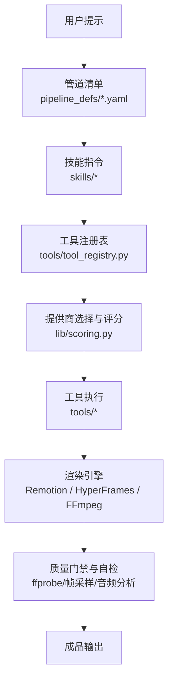
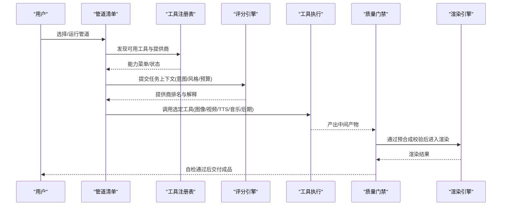
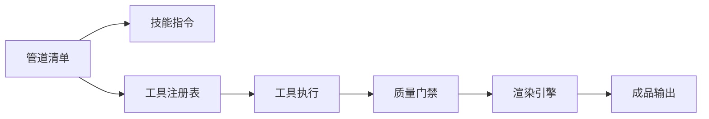

# 核心功能特性

<cite>
**本文引用的文件**
- [README.md](file://README.md)
- [PROVIDERS.md](file://docs/PROVIDERS.md)
- [animated-explainer.yaml](file://pipeline_defs/animated-explainer.yaml)
- [animation.yaml](file://pipeline_defs/animation.yaml)
- [cinematic.yaml](file://pipeline_defs/cinematic.yaml)
- [documentary-montage.yaml](file://pipeline_defs/documentary-montage.yaml)
- [screen-demo.yaml](file://pipeline_defs/screen-demo.yaml)
- [hybrid.yaml](file://pipeline_defs/hybrid.yaml)
- [talking-head.yaml](file://pipeline_defs/talking-head.yaml)
- [scoring.py](file://lib/scoring.py)
- [tool_registry.py](file://tools/tool_registry.py)
</cite>

## 目录
1. [简介](#简介)
2. [项目结构](#项目结构)
3. [核心组件](#核心组件)
4. [架构总览](#架构总览)
5. [详细组件分析](#详细组件分析)
6. [依赖关系分析](#依赖关系分析)
7. [性能考量](#性能考量)
8. [故障排查指南](#故障排查指南)
9. [结论](#结论)
10. [附录](#附录)

## 简介
OpenMontage 是一个以“代理驱动”的端到端视频生产系统。它通过可配置的管道（Pipeline）编排研究、提案、脚本、分镜、资产生成、剪辑与合成等阶段，并在每个关键节点设置质量门禁与预算控制，确保最终输出可播放、风格一致且成本可控。系统内置多种预定义管道类型、100+ 生产工具与 60+ 提供商集成，支持云 API、本地模型与素材库的统一接入；同时提供风格系统与平台输出配置文件，以及 Remotion 与 HyperFrames 两种渲染引擎的选择策略。

## 项目结构
OpenMontage 的核心由“工具层 + 管道清单 + 技能知识 + 质量治理”构成：
- 工具层：video/audio/graphics/enhancement/analysis/avatar/subtitle 等子模块，注册到统一工具注册表，暴露能力与状态。
- 管道清单：YAML 描述各管道的阶段、所需技能、产出物、成功标准与人类审批点。
- 技能知识：按“管道/创作/核心/元”组织，指导代理如何正确使用工具与遵循质量标准。
- 质量治理：评分引擎、预算控制、质量门禁、决策审计追踪。

图表来源
- [tool_registry.py:118-134](file://tools/tool_registry.py#L118-L134)
- [scoring.py:373-542](file://lib/scoring.py#L373-L542)
- [README.md:450-475](file://README.md#L450-L475)

章节来源
- [README.md:450-475](file://README.md#L450-L475)

## 核心组件
- 管道编排器：基于 YAML 的阶段化工作流，包含研究、提案、脚本、分镜、资产、剪辑、合成、发布等阶段，每阶段有明确输入/产出、可用工具、检查点与人类审批默认值。
- 工具注册表：自动发现 tools 包下的 BaseTool 子类，提供按能力/提供商/稳定性/状态的查询与汇总，并生成“能力菜单”供代理在预检时展示。
- 提供商评分引擎：对候选提供商进行七维加权打分（任务契合度、输出质量、可控性、可靠性、成本效率、延迟、连续性），并输出可解释的排名与理由。
- 质量门禁：提案/脚本/分镜/资产/发布等多处强制人类审批；预合成校验阻止违反交付承诺的计划；渲染后自检（ffprobe、帧采样、音频分析、字幕检查）保障成品质量。
- 预算控制：执行前估算、预留、结算；支持观察/警告/封顶模式；可按动作阈值触发审批；支持总预算上限。

章节来源
- [animated-explainer.yaml:61-270](file://pipeline_defs/animated-explainer.yaml#L61-L270)
- [tool_registry.py:118-134](file://tools/tool_registry.py#L118-L134)
- [scoring.py:21-70](file://lib/scoring.py#L21-L70)
- [README.md:652-686](file://README.md#L652-L686)

## 架构总览
OpenMontage 采用“代理即编排器”的架构：代理读取管道清单与技能指令，调用工具注册表获取可用能力，使用评分引擎选择最佳提供商，执行工具链，并通过质量门禁与预算控制保证产出质量与成本可控。

图表来源
- [tool_registry.py:198-230](file://tools/tool_registry.py#L198-L230)
- [scoring.py:373-542](file://lib/scoring.py#L373-L542)
- [README.md:408-444](file://README.md#L408-L444)

## 详细组件分析

### 预定义管道类型（10+）
以下管道均遵循“研究→提案→脚本→分镜→资产→剪辑→合成→发布”的结构化流程，并在关键阶段设置人类审批与质量检查。

- 动画解释器（Animated Explainer）
  - 用途：从主题/想法生成完整的 AI 解说视频，含研究、配音、画面与音乐。
  - 适用场景：教育内容、教程、主题拆解。
  - 关键点：支持参考视频输入；推荐风格为“干净专业/扁平动效”；强调配音表现计划与视觉一致性。
  - 章节来源
    - [animated-explainer.yaml:1-270](file://pipeline_defs/animated-explainer.yaml#L1-L270)

- 动画（Animation）
  - 用途：动效图形、数据可视化、动态排版、数学可视化、Three.js 世界与插画序列。
  - 适用场景：社交媒体、产品演示、抽象概念表达。
  - 关键点：提案阶段需明确动画模式与复用策略；强调文本可读性与节奏留白；可选 Three.js/Blender/Atlas 3D。
  - 章节来源
    - [animation.yaml:1-300](file://pipeline_defs/animation.yaml#L1-L300)

- 电影预告片（Cinematic）
  - 用途：情绪驱动的预告片、品牌片、蒙太奇、短剧式剪辑，支持显式 3D 世界漫游。
  - 适用场景：品牌宣传片、预告、情绪向短片。
  - 关键点：强调情感弧线、色彩与灯光方向、运动承诺诚实；建议优先使用真实片段或高质量生成素材。
  - 章节来源
    - [cinematic.yaml:1-288](file://pipeline_defs/cinematic.yaml#L1-L288)

- 纪录片蒙太奇（Documentary Montage）
  - 用途：检索优先的主题蒙太奇，构建来自免费素材与开放档案的语料库，用 CLIP 检索填充槽位，按叙事节拍剪辑并统一调色。
  - 适用场景：视频论文、情绪作品、无需付费视频模型的“真实素材”视频。
  - 关键点：必须包含音乐与结尾标签计划；严格限制转场词汇；强调时长与节拍匹配。
  - 章节来源
    - [documentary-montage.yaml:1-179](file://pipeline_defs/documentary-montage.yaml#L1-L179)

- 屏幕演示（Screen Demo）
  - 用途：录制真实桌面/浏览器操作或合成终端动画，添加标注、缩放裁剪、字幕与降噪。
  - 适用场景：软件演示、教程、文档录屏。
  - 关键点：区分“真实录制”和“合成终端”两种模式；强调 UI 可读性与静音处理；推荐 Remotion TerminalScene 用于可重复渲染。
  - 章节来源
    - [screen-demo.yaml:1-247](file://pipeline_defs/screen-demo.yaml#L1-L247)

- 混合（Hybrid）
  - 用途：将源素材与设计/生成的支撑素材组合，如访谈+图示、产品拍摄+叠加、录屏+伴图。
  - 适用场景：增强现有素材、信息补充、多媒介混剪。
  - 关键点：明确“锚定媒体”与“支撑层”的边界；避免覆盖度过高；保持跨介质一致性。
  - 章节来源
    - [hybrid.yaml:1-228](file://pipeline_defs/hybrid.yaml#L1-L228)

- 口播（Talking Head）
  - 用途：对人物说话原始素材进行转录、剪辑、字幕、混音与合成。
  - 适用场景：演讲、Vlog、采访。
  - 关键点：强依赖转录准确性与时间戳对齐；支持静音跳切、自动重框、面部增强与彩色校正。
  - 章节来源
    - [talking-head.yaml:1-229](file://pipeline_defs/talking-head.yaml#L1-L229)

- 角色动画（Character Animation）
  - 用途：将脚本与分镜转化为角色设定、绑定计划、姿势库、动作时间线，并以 SVG/Canvas/Remotion/HyperFrames 渲染。
  - 适用场景：可复用的卡通角色动画、角色表演与动作排演。
  - 关键点：强调本地确定性运动而非远程视频生成替代；要求样本先行验证角色风格与绑定完整性。
  - 章节来源
    - [character-animation.yaml:1-303](file://pipeline_defs/character-animation.yaml#L1-L303)

- 其他管道（根据 README 概览）
  - 头像发言人（Avatar Spokesperson）：面向企业沟通、培训、公告的虚拟发言人视频。
  - 片段工厂（Clip Factory）：将长内容批量拆分为短视频片段。
  - 本地化与配音（Localization & Dub）：字幕、配音与翻译，支持多语言分发。
  - 播客再利用（Podcast Repurpose）：播客高光转视频。
  - 章节来源
    - [README.md:356-373](file://README.md#L356-L373)

### 生产工具分类与功能（100+）
OpenMontage 的工具按能力域划分，涵盖视频生成、图像处理、音频处理、字幕生成、后期制作与分析等。

- 视频生成（20+ 提供商）
  - 包括云 API（Kling、Runway、Gemini Omni、Veo、Seedance、MiniMax、Higgsfield、HeyGen 等）、本地 GPU（WAN、Hunyuan、CogVideo、LTX-Video）与素材库（Pexels、Pixabay、Wikimedia）。
  - 特点：统一通过选择器与评分引擎挑选；支持文本/图像/参考条件生成；部分提供商具备原生音频、多镜头、镜头控制、唇同步等高级能力。
  - 章节来源
    - [README.md:494-518](file://README.md#L494-L518)
    - [PROVIDERS.md:85-104](file://docs/PROVIDERS.md#L85-L104)

- 图像处理（15+ 提供商）
  - 包括 FLUX、Google Imagen、Grok、GPT Image 2、Seedream、Nano Banana、Recraft、Kling Official、本地扩散、Pexels/Pixabay/Unsplash、ManimCE。
  - 特点：支持文本生成、编辑、风格迁移、多图合成；与视频生成协同用于支撑画面与转场元素。
  - 章节来源
    - [README.md:520-540](file://README.md#L520-L540)

- 音频处理（10+ 提供商）
  - 文本转语音：ElevenLabs、Google TTS、Kling Official TTS、OpenAI TTS、Piper（本地离线）、Azure Speech、DashScope/Doubao/Fish Audio。
  - 音乐与音效：Suno、ElevenLabs Music/SFX、Freesound/Pixabay 音乐。
  - 特点：多语种、情感表达、词级时间戳对齐字幕；支持云端与本地路径。
  - 章节来源
    - [README.md:542-555](file://README.md#L542-L555)
    - [PROVIDERS.md:475-582](file://docs/PROVIDERS.md#L475-L582)

- 字幕生成
  - 支持 SRT/VTT 生成与词级时间戳；可与 ASR（WhisperX/Azure/DashScope）结合实现精准对齐。
  - 章节来源
    - [README.md:568-579](file://README.md#L568-L579)

- 后期制作
  - FFmpeg：编码、字幕烧录、音频混音、彩色校正。
  - Video Stitch/Trimmer：多片段组装、交叉淡入淡出、画中画、空间布局、精确裁剪。
  - Audio Mixer/Enhance：多轨混音、旁白避让、淡入淡出、降噪、标准化。
  - 章节来源
    - [README.md:568-579](file://README.md#L568-L579)

- 增强与分析
  - 增强：超分、背景移除、人脸增强/修复。
  - 分析：转写、场景检测、帧采样、视频理解（CLIP/BLIP-2）。
  - 章节来源
    - [README.md:580-597](file://README.md#L580-L597)

- 头像与唇同步
  - Talking Head、Lip Sync、Kling Avatar/Lip Sync。
  - 章节来源
    - [README.md:598-605](file://README.md#L598-L605)

### 提供商集成优势（60+）
- 统一接入：通过工具注册表与选择器，将云 API、本地模型、素材库与开源归档整合为一致的“能力菜单”，代理可在预检阶段呈现“N/M 已配置”。
- 评分选择：七维加权评分（任务契合度 30%、输出质量 20%、可控性 15%、可靠性 15%、成本效率 10%、延迟 5%、连续性 5%），输出可解释排名与理由。
- 供应商多样性：覆盖主流云厂商与本地方案，支持多路回退与降级策略，避免单点依赖。
- 章节来源
  - [README.md:394-405](file://README.md#L394-L405)
  - [scoring.py:21-70](file://lib/scoring.py#L21-L70)
  - [tool_registry.py:249-314](file://tools/tool_registry.py#L249-L314)

### 质量治理系统
- 评分引擎：ProviderScore 与 ProductionPathScore 提供细粒度与整体路径评估；支持语义同义词扩展与关键词重叠计算；对“运动需求”“参考条件”“图像编辑”“电影级信号”等进行加权调整。
- 预算控制：执行前估算、预留、结算；支持 observe/warn/cap 模式；按动作阈值触发审批；支持总预算上限。
- 质量门禁：提案/脚本/分镜/资产/发布多阶段人类审批；预合成校验阻止违反交付承诺的计划；渲染后自检（ffprobe、帧采样、音频分析、字幕检查）确保成品质量。
- 决策审计：所有重大创意与技术选择记录替代方案、置信度与推理过程，形成可追溯的决策日志。
- 章节来源
  - [scoring.py:205-542](file://lib/scoring.py#L205-L542)
  - [README.md:652-686](file://README.md#L652-L686)

### 风格系统与平台输出配置文件
- 风格系统：Playbook 控制字体、配色、动效、音频配置与质量规则；代理在所有生成资产中保持一致风格。
- 平台输出：内置 YouTube/Shorts/Reels/Feed/TikTok/LinkedIn/Cinematic 等平台分辨率与画幅预设，便于一键适配。
- 章节来源
  - [README.md:621-650](file://README.md#L621-L650)

### 渲染引擎：Remotion 与 HyperFrames
- Remotion：基于 React 的程序化视频，擅长数据驱动的解释类视频、统计揭示、标题卡、逐字字幕、场景过渡与 TalkingHead 合成；当无视频生成提供商时，可将静态图片转为全动画视频。
- HyperFrames：基于 HTML/CSS/GSAP 的程序化视频，擅长动态排版、产品宣传、启动快剪、注册块（数据图表、颗粒叠加、着色器过渡）、网站转视频与 rigged SVG 角色动画。
- 选择策略：在提案阶段锁定 render_runtime；禁止静默切换；HyperFrames 渲染前必须通过 lint/validate；Remotion 适合数据与 React 场景栈，HyperFrames 适合 HTML/GSAP 原生动效。
- 章节来源
  - [README.md:296-305](file://README.md#L296-L305)
  - [README.md:607-616](file://README.md#L607-L616)

## 依赖关系分析
OpenMontage 的关键依赖关系如下：
- 管道清单依赖技能指令与工具注册表；工具注册表负责发现与分组能力；评分引擎依赖工具信息与任务上下文；渲染引擎依赖工具产出的媒体与样式配置。
- 质量门禁贯穿全流程，依赖 ffprobe、帧采样、音频分析与字幕检查。

图表来源
- [tool_registry.py:118-134](file://tools/tool_registry.py#L118-L134)
- [scoring.py:373-542](file://lib/scoring.py#L373-L542)
- [README.md:408-444](file://README.md#L408-L444)

章节来源
- [tool_registry.py:118-134](file://tools/tool_registry.py#L118-L134)
- [scoring.py:373-542](file://lib/scoring.py#L373-L542)
- [README.md:408-444](file://README.md#L408-L444)

## 性能考量
- 提供商选择优化：评分引擎考虑历史成功率、稳定性、延迟与成本，避免低效或不可靠路径。
- 渲染性能：Remotion 适合数据驱动与 React 生态；HyperFrames 适合 HTML/GSAP 动效；FFmpeg 作为底层编解码与后期处理。
- 资源约束：注册表可识别 GPU/网络需求工具，帮助代理在预检阶段规避环境不满足导致的失败。
- 章节来源
- [README.md:450-475](file://README.md#L450-L475)
- [tool_registry.py:476-488](file://tools/tool_registry.py#L476-L488)

## 故障排查指南
- 提供商不可用：检查 .env 环境变量与密钥；查看注册表的“能力菜单”与“运行时警告”；必要时启用回退提供商。
- 渲染失败：确认 render_runtime 与管道约定一致；HyperFrames 需先通过 lint/validate；Remotion 需 Node.js 与依赖安装完成。
- 质量门禁失败：检查交付承诺是否被违反（如“运动主导”却大量静态图）；查看渲染后自检报告（ffprobe、帧采样、音频分析、字幕）。
- 预算超限：启用 cap 模式或降低提供商等级；在提案阶段比较不同提供商的成本与质量权衡。
- 章节来源
- [README.md:652-686](file://README.md#L652-L686)
- [tool_registry.py:316-471](file://tools/tool_registry.py#L316-L471)

## 结论
OpenMontage 通过结构化管道、丰富工具与提供商集成、严格的评分与质量治理，以及灵活的渲染引擎选择，为用户提供从创意到成品的完整视频生产能力。用户可根据需求选择合适的管道与工具组合，借助风格系统与平台输出配置快速适配多平台，同时享受预算控制与质量门禁带来的工程化保障。

## 附录
- 快速开始与零键路径：可使用 Piper TTS、Archive.org/NASA/Wikimedia 素材、Remotion/HyperFrames 与 FFmpeg 完成基础视频制作。
- 提供商指南：详见 PROVIDERS.md，包含设置步骤、定价与免费额度说明。
- 章节来源
- [README.md:282-305](file://README.md#L282-L305)
- [PROVIDERS.md:1-82](file://docs/PROVIDERS.md#L1-L82)