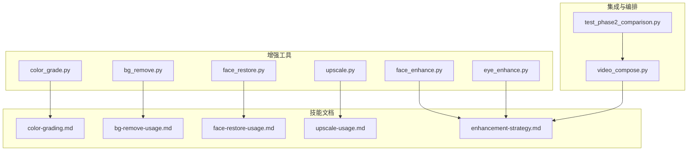
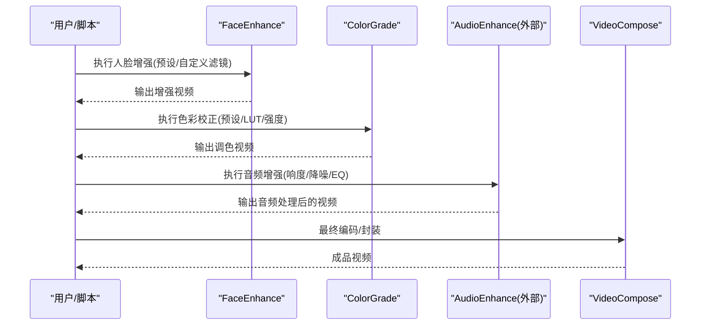
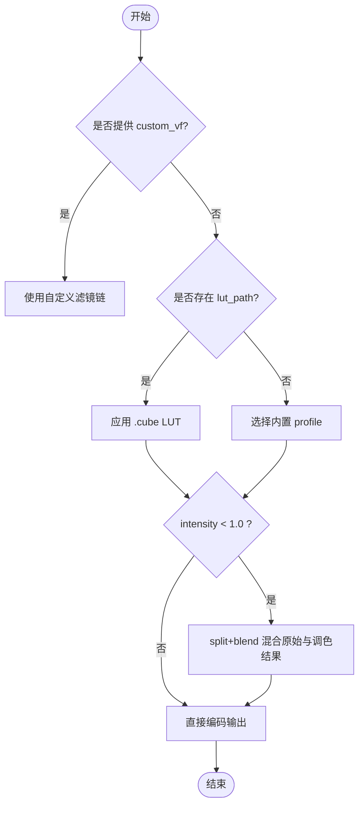
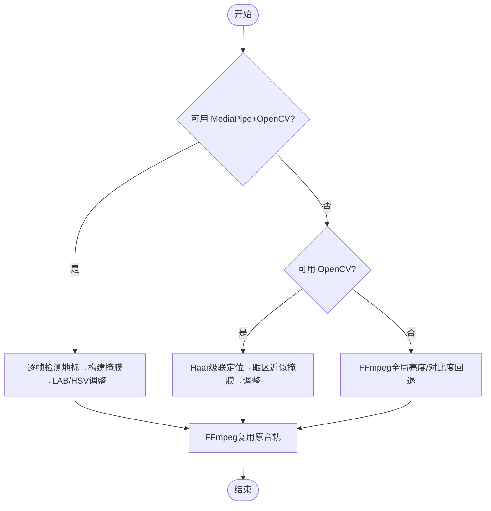
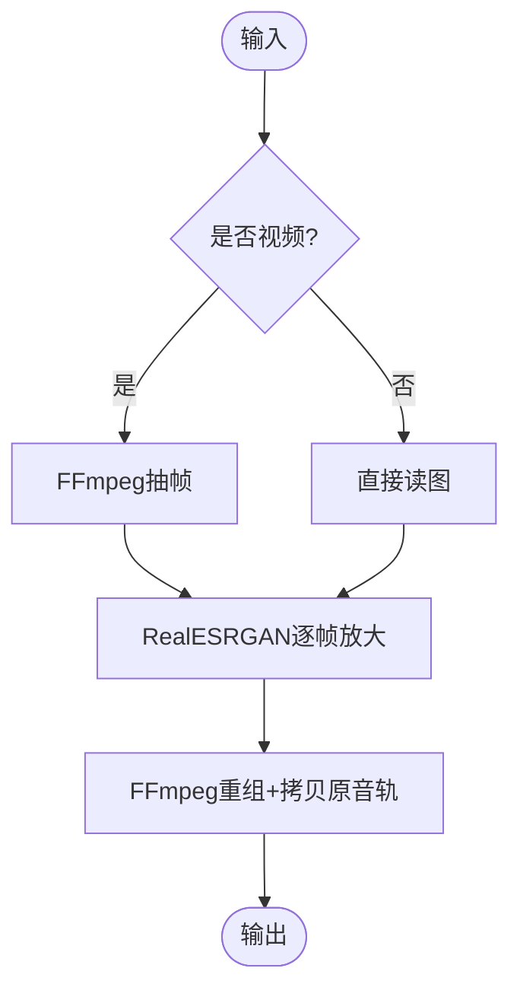
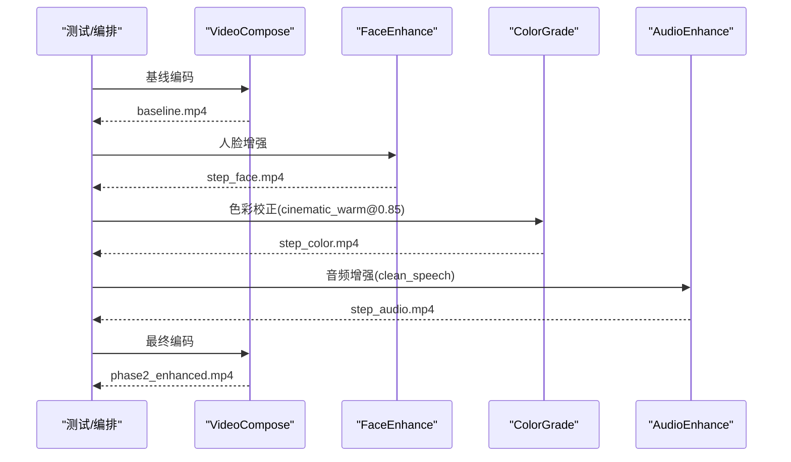
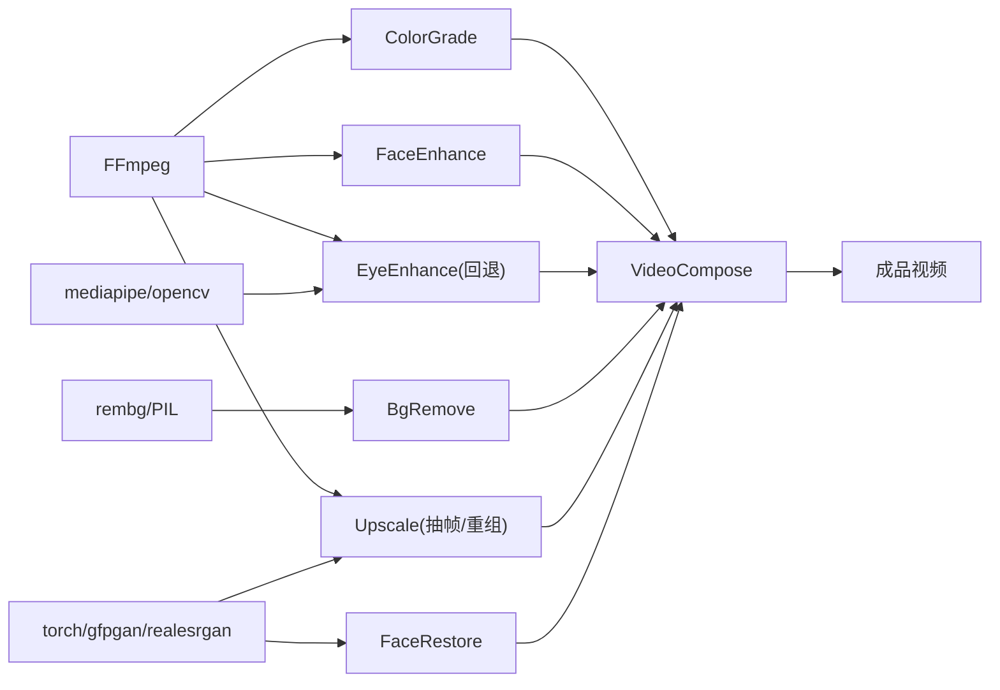

# 后期制作工具

<cite>
**本文引用的文件**
- [tools/enhancement/color_grade.py](file://tools/enhancement/color_grade.py)
- [tools/enhancement/face_enhance.py](file://tools/enhancement/face_enhance.py)
- [tools/enhancement/eye_enhance.py](file://tools/enhancement/eye_enhance.py)
- [tools/enhancement/bg_remove.py](file://tools/enhancement/bg_remove.py)
- [tools/enhancement/upscale.py](file://tools/enhancement/upscale.py)
- [tools/enhancement/face_restore.py](file://tools/enhancement/face_restore.py)
- [skills/core/color-grading.md](file://skills/core/color-grading.md)
- [skills/creative/bg-remove-usage.md](file://skills/creative/bg-remove-usage.md)
- [skills/creative/face-restore-usage.md](file://skills/creative/face-restore-usage.md)
- [skills/creative/upscale-usage.md](file://skills/creative/upscale-usage.md)
- [skills/creative/enhancement-strategy.md](file://skills/creative/enhancement-strategy.md)
- [tests/contracts/test_phase2_comparison.py](file://tests/contracts/test_phase2_comparison.py)
- [tools/video/video_compose.py](file://tools/video/video_compose.py)
</cite>

## 目录
1. [简介](#简介)
2. [项目结构](#项目结构)
3. [核心组件](#核心组件)
4. [架构总览](#架构总览)
5. [详细组件分析](#详细组件分析)
6. [依赖关系分析](#依赖关系分析)
7. [性能考量](#性能考量)
8. [故障排查指南](#故障排查指南)
9. [结论](#结论)
10. [附录](#附录)

## 简介
本文件面向OpenMontage的后期制作工具，系统梳理色彩校正、人脸增强、超分辨率、背景移除、面部修复与眼部增强等能力。文档覆盖技术原理、参数配置、质量控制方法、批量流水线编排、质量评估标准与性能优化技巧，并给出不同应用场景下的工具组合最佳实践。内容严格基于仓库中的实现与技能说明，便于工程化落地与团队协作。

## 项目结构
OpenMontage将“增强类”工具集中在 tools/enhancement 目录下，每个工具以独立类封装，遵循统一的 BaseTool 接口（输入输出、资源画像、幂等键、状态检查等）。配套的技能文档位于 skills/ 下，提供操作指引、工作流与质量清单。测试用例展示了端到端的增强链路与对比验证。

图表来源
- [tools/enhancement/color_grade.py:1-213](file://tools/enhancement/color_grade.py#L1-L213)
- [tools/enhancement/face_enhance.py:1-194](file://tools/enhancement/face_enhance.py#L1-L194)
- [tools/enhancement/eye_enhance.py:1-579](file://tools/enhancement/eye_enhance.py#L1-L579)
- [tools/enhancement/bg_remove.py:1-162](file://tools/enhancement/bg_remove.py#L1-L162)
- [tools/enhancement/upscale.py:1-363](file://tools/enhancement/upscale.py#L1-L363)
- [tools/enhancement/face_restore.py:1-246](file://tools/enhancement/face_restore.py#L1-L246)
- [skills/core/color-grading.md:1-162](file://skills/core/color-grading.md#L1-L162)
- [skills/creative/bg-remove-usage.md:1-114](file://skills/creative/bg-remove-usage.md#L1-L114)
- [skills/creative/face-restore-usage.md:1-97](file://skills/creative/face-restore-usage.md#L1-L97)
- [skills/creative/upscale-usage.md:1-131](file://skills/creative/upscale-usage.md#L1-L131)
- [skills/creative/enhancement-strategy.md:1-112](file://skills/creative/enhancement-strategy.md#L1-L112)
- [tools/video/video_compose.py:1500-1529](file://tools/video/video_compose.py#L1500-L1529)
- [tests/contracts/test_phase2_comparison.py:50-140](file://tests/contracts/test_phase2_comparison.py#L50-L140)

章节来源
- [tools/enhancement/color_grade.py:1-213](file://tools/enhancement/color_grade.py#L1-L213)
- [tools/enhancement/face_enhance.py:1-194](file://tools/enhancement/face_enhance.py#L1-L194)
- [tools/enhancement/eye_enhance.py:1-579](file://tools/enhancement/eye_enhance.py#L1-L579)
- [tools/enhancement/bg_remove.py:1-162](file://tools/enhancement/bg_remove.py#L1-L162)
- [tools/enhancement/upscale.py:1-363](file://tools/enhancement/upscale.py#L1-L363)
- [tools/enhancement/face_restore.py:1-246](file://tools/enhancement/face_restore.py#L1-L246)
- [skills/core/color-grading.md:1-162](file://skills/core/color-grading.md#L1-L162)
- [skills/creative/bg-remove-usage.md:1-114](file://skills/creative/bg-remove-usage.md#L1-L114)
- [skills/creative/face-restore-usage.md:1-97](file://skills/creative/face-restore-usage.md#L1-L97)
- [skills/creative/upscale-usage.md:1-131](file://skills/creative/upscale-usage.md#L1-L131)
- [skills/creative/enhancement-strategy.md:1-112](file://skills/creative/enhancement-strategy.md#L1-L112)
- [tools/video/video_compose.py:1500-1529](file://tools/video/video_compose.py#L1500-L1529)
- [tests/contracts/test_phase2_comparison.py:50-140](file://tests/contracts/test_phase2_comparison.py#L50-L140)

## 核心组件
- 色彩校正（ColorGrade）：内置多套电影级调色曲线与色温预设，支持外部 .cube LUT 与强度混合；通过 FFmpeg 滤镜链执行，适合成片风格统一与品牌一致性。
- 人脸增强（FaceEnhance）：基于 FFmpeg 滤镜链的皮肤平滑、锐化、冷暖色调与降噪预设，适用于口播/讲解类视频的快速美化。
- 眼部增强（EyeEnhance）：使用 MediaPipe Face Mesh + OpenCV 精准定位眼周区域，进行黑眼圈淡化、眼部提亮与局部锐化；无 MediaPipe 时回退到 OpenCV 或 FFmpeg 通用方案。
- 背景移除（BgRemove）：基于 rembg/U2Net 系列模型的人像与物体抠图，支持 alpha matting 精细边缘与纯色背景替换，常用于合成前素材准备。
- 超分辨率（Upscale）：Real-ESRGAN 图像/视频放大（2x/4x），可选人脸增强（GFPGAN）与降噪强度控制；视频路径会抽帧、逐帧放大后重组并保留原音频。
- 面部修复（FaceRestore）：CodeFormer/GFPGAN 重建退化人脸细节，支持保真度调节与背景同步放大，用于老旧/压缩严重素材修复。

章节来源
- [tools/enhancement/color_grade.py:24-75](file://tools/enhancement/color_grade.py#L24-L75)
- [tools/enhancement/face_enhance.py:25-67](file://tools/enhancement/face_enhance.py#L25-L67)
- [tools/enhancement/eye_enhance.py:32-44](file://tools/enhancement/eye_enhance.py#L32-L44)
- [tools/enhancement/bg_remove.py:27-50](file://tools/enhancement/bg_remove.py#L27-L50)
- [tools/enhancement/upscale.py:31-44](file://tools/enhancement/upscale.py#L31-L44)
- [tools/enhancement/face_restore.py:27-51](file://tools/enhancement/face_restore.py#L27-L51)

## 架构总览
增强工具统一通过 BaseTool 暴露 execute() 入口，返回 ToolResult 包含成功标志、产物路径、耗时与元数据。多数工具依赖外部命令或库（FFmpeg、rembg、torch/gfpgan/realesrgan、mediapipe/opencv），并在 get_status() 中检测可用性。视频合成器 video_compose 作为最终汇聚点，负责编码、转码与多轨合成。

图表来源
- [tests/contracts/test_phase2_comparison.py:71-120](file://tests/contracts/test_phase2_comparison.py#L71-L120)
- [tools/video/video_compose.py:1517-1529](file://tools/video/video_compose.py#L1517-L1529)

章节来源
- [tests/contracts/test_phase2_comparison.py:71-120](file://tests/contracts/test_phase2_comparison.py#L71-L120)
- [tools/video/video_compose.py:1517-1529](file://tools/video/video_compose.py#L1517-L1529)

## 详细组件分析

### 色彩校正（ColorGrade）
- 技术原理：内置多套 FFmpeg 滤镜链（colorbalance/curves/eq/lut3d），支持外部 .cube LUT 与强度混合（split+blend）。
- 关键参数：profile（内置预设）、lut_path（外部 LUT）、intensity（0-1 混合强度）、custom_vf（高级自定义滤镜链）、codec/crf。
- 质量控制：皮肤色调保护、对比度与饱和度上限建议、按内容类型选择 profile、统一全片 profile。
- 典型流程：先白平衡/归一化 → 色相/明暗调整 → 曲线塑造 → 最后应用创意 LUT。

图表来源
- [tools/enhancement/color_grade.py:181-207](file://tools/enhancement/color_grade.py#L181-L207)
- [skills/core/color-grading.md:18-45](file://skills/core/color-grading.md#L18-L45)

章节来源
- [tools/enhancement/color_grade.py:24-75](file://tools/enhancement/color_grade.py#L24-L75)
- [tools/enhancement/color_grade.py:98-128](file://tools/enhancement/color_grade.py#L98-L128)
- [tools/enhancement/color_grade.py:134-179](file://tools/enhancement/color_grade.py#L134-L179)
- [tools/enhancement/color_grade.py:181-207](file://tools/enhancement/color_grade.py#L181-L207)
- [skills/core/color-grading.md:18-45](file://skills/core/color-grading.md#L18-L45)
- [skills/core/color-grading.md:87-106](file://skills/core/color-grading.md#L87-L106)
- [skills/core/color-grading.md:108-120](file://skills/core/color-grading.md#L108-L120)

### 人脸增强（FaceEnhance）
- 技术原理：FFmpeg 滤镜链组合（smartblur/unsharp/colorbalance/hqdn3d 等），无需 GPU。
- 关键参数：preset/presets（可叠加多个预设）、custom_vf、codec/crf。
- 质量控制：避免过度平滑导致塑料感；保持肤色自然；在暗光场景优先降噪与提亮。
- 推荐预设：talking_head_standard（默认）、soft_skin、sharpen、brighten、denoise。

章节来源
- [tools/enhancement/face_enhance.py:25-67](file://tools/enhancement/face_enhance.py#L25-L67)
- [tools/enhancement/face_enhance.py:93-116](file://tools/enhancement/face_enhance.py#L93-L116)
- [tools/enhancement/face_enhance.py:126-188](file://tools/enhancement/face_enhance.py#L126-L188)
- [skills/creative/enhancement-strategy.md:33-41](file://skills/creative/enhancement-strategy.md#L33-L41)

### 眼部增强（EyeEnhance）
- 技术原理：MediaPipe Face Mesh 精确标注眼周区域，结合 OpenCV 在 LAB/HSV 空间做亮度与饱和度调整；无 MediaPipe 时回退到 Haar 级联或全局 FFmpeg 调整。
- 关键参数：operations（dark_circles/brighten_eyes/sharpen_eyes）、各强度参数、codec/crf。
- 质量控制：仅对眼周区域微调，避免过曝或色偏；确保不破坏眼神光与自然纹理。

图表来源
- [tools/enhancement/eye_enhance.py:127-147](file://tools/enhancement/eye_enhance.py#L127-L147)
- [tools/enhancement/eye_enhance.py:176-268](file://tools/enhancement/eye_enhance.py#L176-L268)
- [tools/enhancement/eye_enhance.py:425-574](file://tools/enhancement/eye_enhance.py#L425-L574)

章节来源
- [tools/enhancement/eye_enhance.py:32-44](file://tools/enhancement/eye_enhance.py#L32-L44)
- [tools/enhancement/eye_enhance.py:72-125](file://tools/enhancement/eye_enhance.py#L72-L125)
- [tools/enhancement/eye_enhance.py:176-268](file://tools/enhancement/eye_enhance.py#L176-L268)
- [tools/enhancement/eye_enhance.py:270-423](file://tools/enhancement/eye_enhance.py#L270-L423)
- [tools/enhancement/eye_enhance.py:425-574](file://tools/enhancement/eye_enhance.py#L425-L574)

### 背景移除（BgRemove）
- 技术原理：rembg 调用 U2Net/isnet 模型生成遮罩，支持 alpha matting 精细边缘；可输出透明 PNG 或合成至指定纯色背景。
- 关键参数：model（u2net/u2net_human_seg/isnet-general-use）、alpha_matting、bg_color。
- 质量控制：边缘干净无光晕、细发丝/毛发保留、透明度完整、主体完整性。

章节来源
- [tools/enhancement/bg_remove.py:27-50](file://tools/enhancement/bg_remove.py#L27-L50)
- [tools/enhancement/bg_remove.py:52-89](file://tools/enhancement/bg_remove.py#L52-L89)
- [tools/enhancement/bg_remove.py:99-161](file://tools/enhancement/bg_remove.py#L99-L161)
- [skills/creative/bg-remove-usage.md:27-47](file://skills/creative/bg-remove-usage.md#L27-L47)
- [skills/creative/bg-remove-usage.md:94-114](file://skills/creative/bg-remove-usage.md#L94-L114)

### 超分辨率（Upscale）
- 技术原理：Real-ESRGAN 图像/视频放大；视频路径通过 FFmpeg 抽帧→逐帧放大→重组并拷贝原音频；可选 GFPGAN 人脸增强与 DNI 降噪强度。
- 关键参数：scale（2/4）、model（RealESRGAN_x4plus/anime_6B/RealESRNet）、face_enhance、denoise_strength。
- 质量控制：避免过度锐化与幻觉细节；动漫/图形用 anime_6B；长视频谨慎全量放大。

图表来源
- [tools/enhancement/upscale.py:206-259](file://tools/enhancement/upscale.py#L206-L259)
- [tools/enhancement/upscale.py:265-337](file://tools/enhancement/upscale.py#L265-L337)

章节来源
- [tools/enhancement/upscale.py:31-44](file://tools/enhancement/upscale.py#L31-L44)
- [tools/enhancement/upscale.py:72-109](file://tools/enhancement/upscale.py#L72-L109)
- [tools/enhancement/upscale.py:126-173](file://tools/enhancement/upscale.py#L126-L173)
- [tools/enhancement/upscale.py:206-259](file://tools/enhancement/upscale.py#L206-L259)
- [tools/enhancement/upscale.py:265-337](file://tools/enhancement/upscale.py#L265-L337)
- [skills/creative/upscale-usage.md:16-63](file://skills/creative/upscale-usage.md#L16-L63)
- [skills/creative/upscale-usage.md:72-131](file://skills/creative/upscale-usage.md#L72-L131)

### 面部修复（FaceRestore）
- 技术原理：CodeFormer/GFPGAN 重建退化人脸细节；支持保真度权重（CodeFormer）与背景 Real-ESRGAN 同步放大。
- 关键参数：model（CodeFormer/GFPGAN）、fidelity（0-1）、upscale、bg_upsampler。
- 质量控制：身份一致性、无幻觉特征、皮肤纹理自然、跨帧稳定无闪烁。

章节来源
- [tools/enhancement/face_restore.py:27-51](file://tools/enhancement/face_restore.py#L27-L51)
- [tools/enhancement/face_restore.py:53-99](file://tools/enhancement/face_restore.py#L53-L99)
- [tools/enhancement/face_restore.py:108-245](file://tools/enhancement/face_restore.py#L108-L245)
- [skills/creative/face-restore-usage.md:16-41](file://skills/creative/face-restore-usage.md#L16-L41)
- [skills/creative/face-restore-usage.md:76-97](file://skills/creative/face-restore-usage.md#L76-L97)

### 增强链路与编排
- 推荐顺序：字幕烧录 → 人脸增强 → 色彩校正 → 音频增强 → 最终编码。
- 测试用例演示了从基线编码到增强链路的对比流程，保证时长一致性与链路可复现。

图表来源
- [tests/contracts/test_phase2_comparison.py:71-120](file://tests/contracts/test_phase2_comparison.py#L71-L120)
- [skills/creative/enhancement-strategy.md:20-31](file://skills/creative/enhancement-strategy.md#L20-L31)

章节来源
- [tests/contracts/test_phase2_comparison.py:71-120](file://tests/contracts/test_phase2_comparison.py#L71-L120)
- [skills/creative/enhancement-strategy.md:20-31](file://skills/creative/enhancement-strategy.md#L20-L31)

## 依赖关系分析
- 外部命令/库：
  - FFmpeg：色彩校正、人脸增强、眼部增强（回退）、超分辨率（抽帧/重组）。
  - rembg/PIL：背景移除。
  - torch/gfpgan/realesrgan/basicsr：超分辨率与面部修复。
  - mediapipe/opencv/numpy：眼部增强（高精度路径）。
- 工具间耦合：
  - 增强链通常串联多个工具，最终由 VideoCompose 统一编码封装。
  - 工具均声明 dependencies/install_instructions，便于环境自检与安装指引。

图表来源
- [tools/enhancement/color_grade.py:88-90](file://tools/enhancement/color_grade.py#L88-L90)
- [tools/enhancement/face_enhance.py:80-82](file://tools/enhancement/face_enhance.py#L80-L82)
- [tools/enhancement/eye_enhance.py:57-63](file://tools/enhancement/eye_enhance.py#L57-L63)
- [tools/enhancement/bg_remove.py:38-43](file://tools/enhancement/bg_remove.py#L38-L43)
- [tools/enhancement/upscale.py:58-64](file://tools/enhancement/upscale.py#L58-L64)
- [tools/enhancement/face_restore.py:38-43](file://tools/enhancement/face_restore.py#L38-L43)

章节来源
- [tools/enhancement/color_grade.py:88-90](file://tools/enhancement/color_grade.py#L88-L90)
- [tools/enhancement/face_enhance.py:80-82](file://tools/enhancement/face_enhance.py#L80-L82)
- [tools/enhancement/eye_enhance.py:57-63](file://tools/enhancement/eye_enhance.py#L57-L63)
- [tools/enhancement/bg_remove.py:38-43](file://tools/enhancement/bg_remove.py#L38-L43)
- [tools/enhancement/upscale.py:58-64](file://tools/enhancement/upscale.py#L58-L64)
- [tools/enhancement/face_restore.py:38-43](file://tools/enhancement/face_restore.py#L38-L43)

## 性能考量
- 视频超分：逐帧放大开销大，建议仅在必要片段启用；GPU 上可关闭 tile 以提升吞吐，CPU/MPS 上启用 tile 降低内存峰值。
- 眼部增强：MediaPipe 路径为逐帧推理，注意分辨率与帧率影响；无 MediaPipe 时回退路径更快但精度较低。
- 色彩校正：滤镜链较短，CPU 即可高效运行；LUT 应用需确保路径正确与格式兼容。
- 背景移除：alpha matting 提升边缘质量但耗时约 2x；人像优先 u2net_human_seg。
- 面部修复：CodeFormer 保真度越高越接近原貌，但可能减弱修复力度；必要时开启 bg_upsampler 同时改善背景。

[本节为通用性能指导，不直接分析具体文件]

## 故障排查指南
- 依赖缺失：
  - FFmpeg 未安装：色彩/人脸/眼部/超分相关步骤失败。
  - rembg/PIL 未安装：背景移除不可用。
  - gfpgan/torch/realesrgan 未安装：超分/面部修复不可用。
  - mediapipe/opencv 未安装：眼部增强降级为回退路径。
- 常见错误：
  - 输入路径不存在：所有工具在执行前校验输入。
  - FFmpeg 命令失败：检查滤镜链语法、LUT 路径、编码参数。
  - 模型加载失败：网络下载或本地权重路径问题。
  - 音频复用失败：临时视频与源音频轨道映射异常。
- 诊断建议：
  - 使用工具的 get_status() 快速判断可用性。
  - 单帧/短片段先行验证，再扩展至整段视频。
  - 对比基线与增强输出，确认时长一致与视觉合理。

章节来源
- [tools/enhancement/color_grade.py:134-163](file://tools/enhancement/color_grade.py#L134-L163)
- [tools/enhancement/face_enhance.py:126-156](file://tools/enhancement/face_enhance.py#L126-L156)
- [tools/enhancement/eye_enhance.py:127-147](file://tools/enhancement/eye_enhance.py#L127-L147)
- [tools/enhancement/bg_remove.py:92-125](file://tools/enhancement/bg_remove.py#L92-L125)
- [tools/enhancement/upscale.py:115-120](file://tools/enhancement/upscale.py#L115-L120)
- [tools/enhancement/face_restore.py:101-134](file://tools/enhancement/face_restore.py#L101-L134)

## 结论
OpenMontage 的后期制作工具以模块化、可组合的方式提供从基础美化到 AI 增强的完整能力。通过标准化的工具接口与技能文档，可在不同场景下灵活编排增强链路，兼顾质量与效率。建议在工程中遵循“先修复、再增强、后调色”的顺序，配合质量清单与回退策略，确保产出稳定可靠。

[本节为总结性内容，不直接分析具体文件]

## 附录
- 常用工作流速查：
  - 口播视频：字幕烧录 → 人脸增强(talking_head_standard) → 色彩校正(cinematic_warm@0.85) → 音频增强(clean_speech) → 编码。
  - 低清素材：背景移除（人像用 u2net_human_seg，复杂边缘开 alpha_matting）→ 超分辨率（RealESRGAN_x4plus，必要时 face_enhance）→ 色彩校正 → 编码。
  - 老旧素材：面部修复（CodeFormer fidelity 0.3-0.5，必要时 bg_upsampler）→ 人脸增强 → 色彩校正 → 编码。
- 质量检查要点：
  - 肤色自然、对比度适中、文字可读性满足 WCAG 要求。
  - 超分无幻觉细节、眼部增强不过曝、背景移除边缘干净。
  - 增强前后时长一致、音画同步、无黑场开场。

[本节为补充信息，不直接分析具体文件]