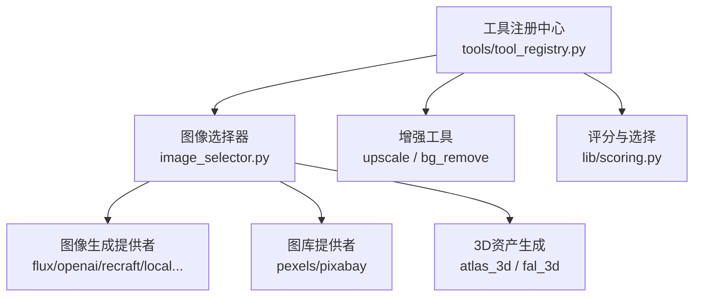
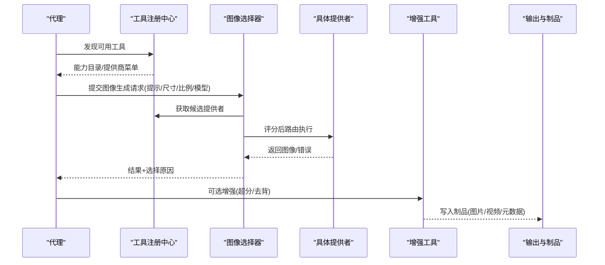
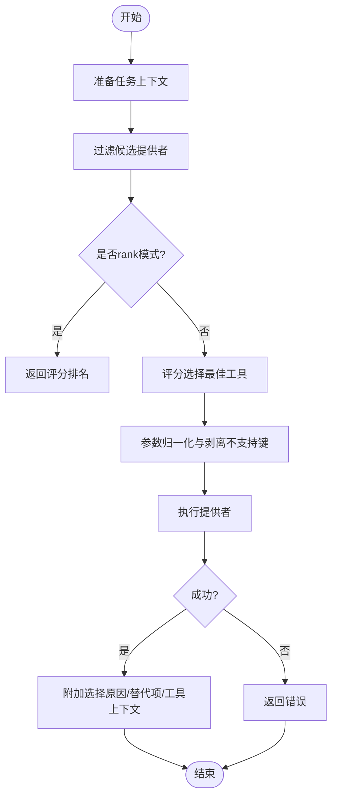
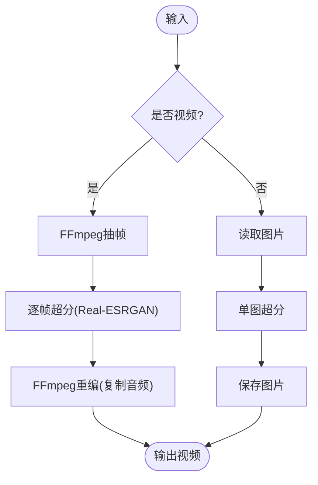
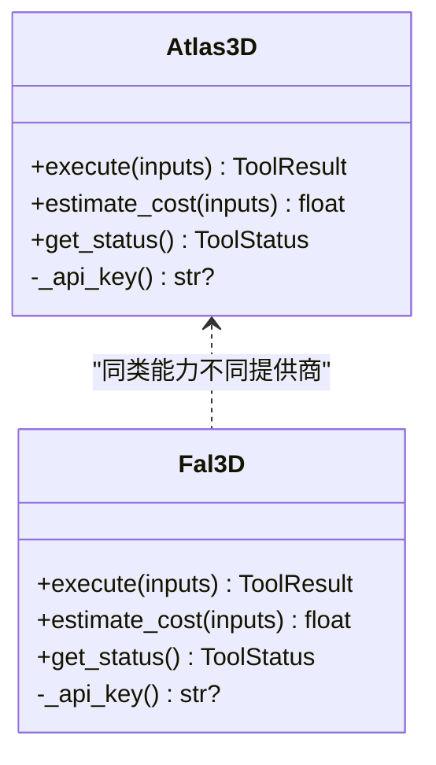
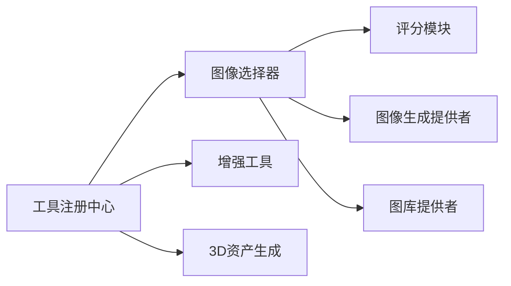

# 图像处理工具

<cite>
**本文引用的文件**
- [README.md](file://README.md)
- [tools/tool_registry.py](file://tools/tool_registry.py)
- [tools/graphics/image_selector.py](file://tools/graphics/image_selector.py)
- [tools/graphics/atlas_3d.py](file://tools/graphics/atlas_3d.py)
- [tools/graphics/fal_3d.py](file://tools/graphics/fal_3d.py)
- [tools/enhancement/upscale.py](file://tools/enhancement/upscale.py)
- [tools/enhancement/bg_remove.py](file://tools/enhancement/bg_remove.py)
- [lib/scoring.py](file://lib/scoring.py)
- [.agents/skills/3d-asset-generation/SKILL.md](file://.agents/skills/3d-asset-generation/SKILL.md)
- [skills/creative/image-provider-usage.md](file://skills/creative/image-provider-usage.md)
</cite>

## 目录
1. [简介](#简介)
2. [项目结构](#项目结构)
3. [核心组件](#核心组件)
4. [架构总览](#架构总览)
5. [详细组件分析](#详细组件分析)
6. [依赖关系分析](#依赖关系分析)
7. [性能与成本优化](#性能与成本优化)
8. [故障排查指南](#故障排查指南)
9. [结论](#结论)
10. [附录：提示词工程与风格控制最佳实践](#附录：提示词工程与风格控制最佳实践)

## 简介
本文件面向OpenMontage的图像处理工具链，覆盖图像生成、编辑、增强、超分辨率与3D资产生成的完整能力。系统通过统一的工具注册与评分选择机制，将多种云API与本地模型整合为可编排的生产流水线，支持批量处理、格式转换、尺寸调整与质量门禁，并提供提示词工程、风格控制与后期处理的实践建议。

## 项目结构
OpenMontage以“工具+技能+管道”三层知识组织：
- tools：生产工具（图像、视频、音频、增强、分析等）
- skills：使用指南与创作技巧（含外部技术知识包）
- pipeline_defs：管道清单（阶段、工具、评审标准、成功门禁）

图表来源
- [tools/tool_registry.py:118-134](file://tools/tool_registry.py#L118-L134)
- [tools/graphics/image_selector.py:185-204](file://tools/graphics/image_selector.py#L185-L204)
- [lib/scoring.py:212-256](file://lib/scoring.py#L212-L256)

章节来源
- [README.md:450-486](file://README.md#L450-L486)

## 核心组件
- 工具注册中心：自动发现并登记所有BaseTool子类，提供按能力、状态、提供商的查询与菜单汇总。
- 图像选择器：根据任务上下文与用户偏好，对可用图像生成/图库提供者进行评分排序并路由执行。
- 增强工具：包括超分辨率（Real-ESRGAN）、背景移除（rembg/U2Net）等，支持图片与视频帧级处理。
- 3D资产生成：Atlas Cloud与fal.ai接口封装，支持文本到3D、图像到3D、多对象重建与PBR材质输出。
- 评分系统：基于任务契合度、输出质量、可控性、可靠性、成本、延迟与连续性等多维打分，驱动最优提供者选择。

章节来源
- [tools/tool_registry.py:55-167](file://tools/tool_registry.py#L55-L167)
- [tools/graphics/image_selector.py:15-467](file://tools/graphics/image_selector.py#L15-L467)
- [tools/enhancement/upscale.py:47-173](file://tools/enhancement/upscale.py#L47-L173)
- [tools/enhancement/bg_remove.py:27-162](file://tools/enhancement/bg_remove.py#L27-L162)
- [tools/graphics/atlas_3d.py:51-228](file://tools/graphics/atlas_3d.py#L51-L228)
- [tools/graphics/fal_3d.py:52-214](file://tools/graphics/fal_3d.py#L52-L214)
- [lib/scoring.py:212-256](file://lib/scoring.py#L212-L256)

## 架构总览
OpenMontage采用“代理优先”的编排方式：代理读取管道清单与技能文件，调用工具完成生产；工具通过注册中心统一发现，由评分系统选择最优提供者，最终产出符合质量门禁的内容。

图表来源
- [tools/tool_registry.py:249-314](file://tools/tool_registry.py#L249-L314)
- [tools/graphics/image_selector.py:218-332](file://tools/graphics/image_selector.py#L218-L332)
- [tools/enhancement/upscale.py:126-173](file://tools/enhancement/upscale.py#L126-L173)
- [tools/enhancement/bg_remove.py:99-162](file://tools/enhancement/bg_remove.py#L99-L162)

## 详细组件分析

### 图像选择器（ImageSelector）
- 功能：统一入口，自动发现图像生成与图库提供者，支持编辑模式、参考图输入、工作流JSON（ComfyUI）透传、批量参数适配与降级回退。
- 关键流程：准备任务上下文→过滤候选→评分排序→选择最佳工具→参数归一化→执行→记录选择原因与替代项。
- 扩展性：新增提供者只需实现BaseTool并声明能力，无需修改选择器。

图表来源
- [tools/graphics/image_selector.py:218-332](file://tools/graphics/image_selector.py#L218-L332)
- [tools/graphics/image_selector.py:334-467](file://tools/graphics/image_selector.py#L334-L467)

章节来源
- [tools/graphics/image_selector.py:1-467](file://tools/graphics/image_selector.py#L1-L467)

### 超分辨率（Upscale）
- 功能：基于Real-ESRGAN的图片/视频超分辨率，支持人脸增强与降噪强度调节；视频路径通过FFmpeg抽帧、逐帧放大、再编码合成。
- 关键点：设备检测（CUDA/MPS/CPU）、分块推理避免OOM、保留原音频、输出宽高与帧率信息。
- 适用场景：提升AI生成图像的清晰度、修复低清素材、批量后期增强。

图表来源
- [tools/enhancement/upscale.py:126-173](file://tools/enhancement/upscale.py#L126-L173)
- [tools/enhancement/upscale.py:206-259](file://tools/enhancement/upscale.py#L206-L259)
- [tools/enhancement/upscale.py:265-337](file://tools/enhancement/upscale.py#L265-L337)

章节来源
- [tools/enhancement/upscale.py:1-363](file://tools/enhancement/upscale.py#L1-L363)

### 背景移除（BgRemove）
- 功能：基于rembg/U2Net的背景移除，支持透明PNG或自定义背景色合成，支持Alpha遮罩精细边缘。
- 关键点：依赖检查（rembg/PIL），默认输出命名规则，支持批量处理。
- 适用场景：产品图抠图、角色分离、合成前置。

章节来源
- [tools/enhancement/bg_remove.py:1-162](file://tools/enhancement/bg_remove.py#L1-L162)

### 3D资产生成（Atlas3D / Fal3D）
- Atlas3D：文本到3D、纹理/PBR GLB、面数限制、种子控制、异步轮询下载与溯源清单。
- Fal3D：文本到3D、图像到3D、多对象重建（SAM 3D Objects），支持PBR与GLB导出，带请求ID与溯源。
- 最佳实践：重复元素走本地授权库，独特道具用文本/图像条件生成；先出样再批量；明确成本估算与质量验收点。

图表来源
- [tools/graphics/atlas_3d.py:51-228](file://tools/graphics/atlas_3d.py#L51-L228)
- [tools/graphics/fal_3d.py:52-214](file://tools/graphics/fal_3d.py#L52-L214)

章节来源
- [tools/graphics/atlas_3d.py:1-228](file://tools/graphics/atlas_3d.py#L1-L228)
- [tools/graphics/fal_3d.py:1-214](file://tools/graphics/fal_3d.py#L1-L214)
- [.agents/skills/3d-asset-generation/SKILL.md:1-37](file://.agents/skills/3d-asset-generation/SKILL.md#L1-L37)

### 图像生成提供者概览
- 生成类：FLUX、GPT Image 2、Recraft、本地扩散模型等
- 图库类：Pexels、Pixabay
- 选择策略：按场景类型匹配首选与回退（如真实照片优先图库，抽象概念优先AI生成）

章节来源
- [skills/creative/image-provider-usage.md:1-47](file://skills/creative/image-provider-usage.md#L1-L47)

## 依赖关系分析
- 工具注册中心负责扫描与登记，暴露能力目录与提供商菜单，供上层编排与预检。
- 图像选择器依赖注册中心获取候选，并调用评分模块进行多维打分。
- 增强工具依赖外部库（Real-ESRGAN、rembg、FFmpeg）与设备检测逻辑。
- 3D资产生成依赖云端API与网络访问，包含异步轮询与产物下载。

图表来源
- [tools/tool_registry.py:118-167](file://tools/tool_registry.py#L118-L167)
- [tools/graphics/image_selector.py:185-204](file://tools/graphics/image_selector.py#L185-L204)
- [lib/scoring.py:212-256](file://lib/scoring.py#L212-L256)

章节来源
- [tools/tool_registry.py:1-493](file://tools/tool_registry.py#L1-L493)
- [tools/graphics/image_selector.py:1-467](file://tools/graphics/image_selector.py#L1-L467)
- [lib/scoring.py:212-256](file://lib/scoring.py#L212-L256)

## 性能与成本优化
- 提供者选择：结合任务契合度、质量、可控性、可靠性、成本、延迟与连续性进行综合评分，优先选择性价比最优者。
- 批处理与缓存：利用工具的幂等键字段减少重复计算；对相同输入复用结果。
- 设备与内存：超分在CPU/MPS启用分块推理避免OOM；GPU优先以提升吞吐。
- 成本治理：每个工具提供成本估算；建议在批量前抽样验证质量与成本。
- 格式与尺寸：统一通过选择器与增强工具进行尺寸调整与格式转换，确保输出一致性与兼容性。

章节来源
- [lib/scoring.py:212-256](file://lib/scoring.py#L212-L256)
- [tools/enhancement/upscale.py:265-337](file://tools/enhancement/upscale.py#L265-L337)
- [tools/graphics/atlas_3d.py:122-130](file://tools/graphics/atlas_3d.py#L122-L130)
- [tools/graphics/fal_3d.py:108-111](file://tools/graphics/fal_3d.py#L108-L111)

## 故障排查指南
- 工具不可用：检查依赖安装与环境变量（如API Key），查看注册中心的可用性状态。
- 生成失败：核对输入参数（提示词、参考图、尺寸、比例），确认提供商配额与网络可达。
- 超分失败：确认FFmpeg与Real-ESRGAN安装，检查设备与显存；必要时降低scale或启用分块。
- 背景移除失败：确认rembg与Pillow已安装；尝试切换模型或开启Alpha遮罩。
- 3D资产失败：核对密钥与网络；关注异步轮询超时与产物URL有效性；检查溯源清单。

章节来源
- [tools/tool_registry.py:118-167](file://tools/tool_registry.py#L118-L167)
- [tools/enhancement/upscale.py:115-121](file://tools/enhancement/upscale.py#L115-L121)
- [tools/enhancement/bg_remove.py:92-98](file://tools/enhancement/bg_remove.py#L92-L98)
- [tools/graphics/atlas_3d.py:119-135](file://tools/graphics/atlas_3d.py#L119-L135)
- [tools/graphics/fal_3d.py:105-123](file://tools/graphics/fal_3d.py#L105-L123)

## 结论
OpenMontage将多源图像与3D资产生成、增强与后期处理整合为可编排、可审计、可治理的生产工具链。通过统一的注册与评分机制，系统能动态选择最优提供者，保障质量与成本效益；同时提供丰富的增强能力与3D资产生成选项，满足从创意到落地的全流程需求。

## 附录：提示词工程与风格控制最佳实践
- 场景匹配：真实照片优先图库，抽象/概念优先AI生成；Logo/品牌资产优先矢量渲染能力强的模型。
- 风格保持：在图像到图像任务中强调构图、光照与色彩一致性，避免风格漂移。
- 环境变换：时间、天气、季节等变换需明确约束，保持主体与细节稳定。
- 艺术风格迁移：指定流派、艺术家或媒介转换，配合负向提示排除不期望元素。
- 批量与抽样：先小批量试产，评估质量与成本后再扩大规模；记录提示词与参数以便复现。
- 后期处理：超分提升清晰度，背景移除便于合成，颜色分级与字幕增强整体观感。

章节来源
- [skills/creative/image-provider-usage.md:1-47](file://skills/creative/image-provider-usage.md#L1-L47)
- [.agents/skills/3d-asset-generation/SKILL.md:1-37](file://.agents/skills/3d-asset-generation/SKILL.md#L1-L37)
- [README.md:489-617](file://README.md#L489-L617)