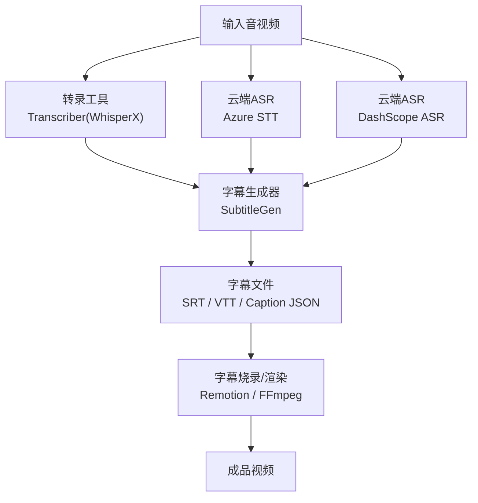
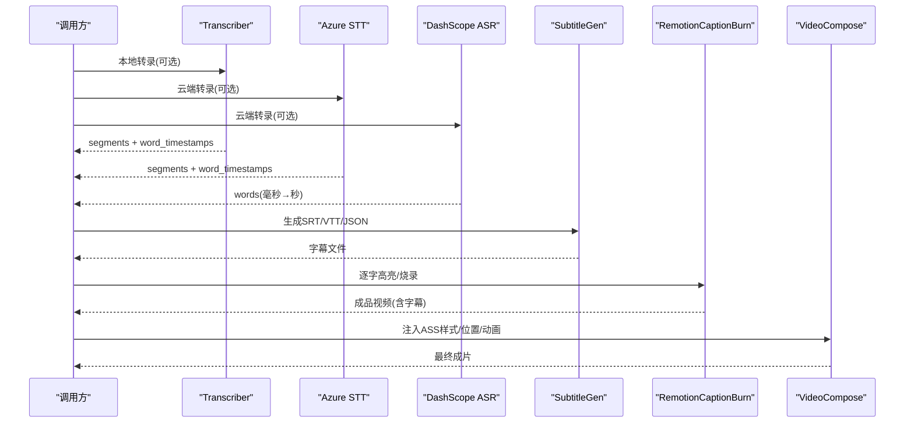
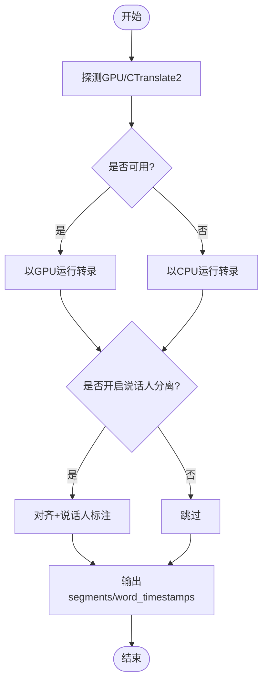
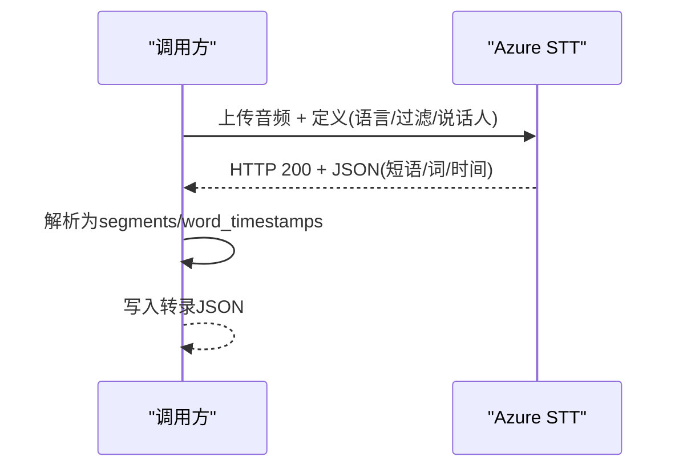
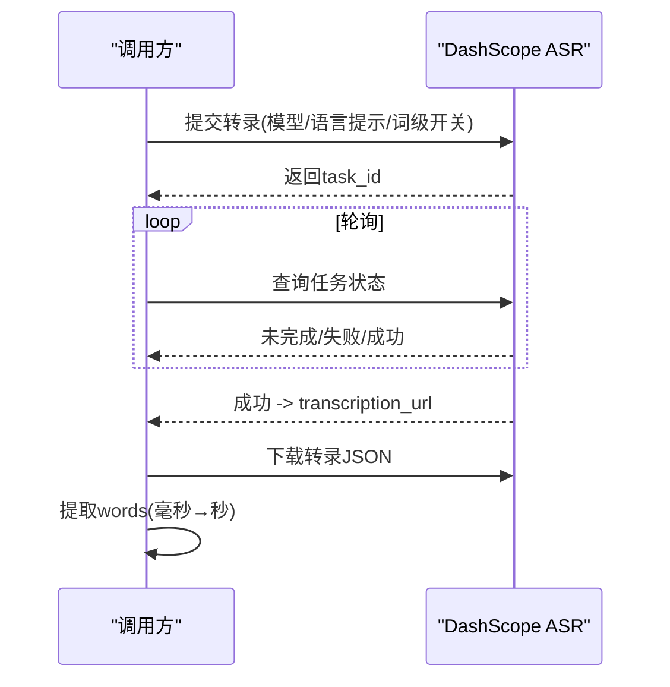
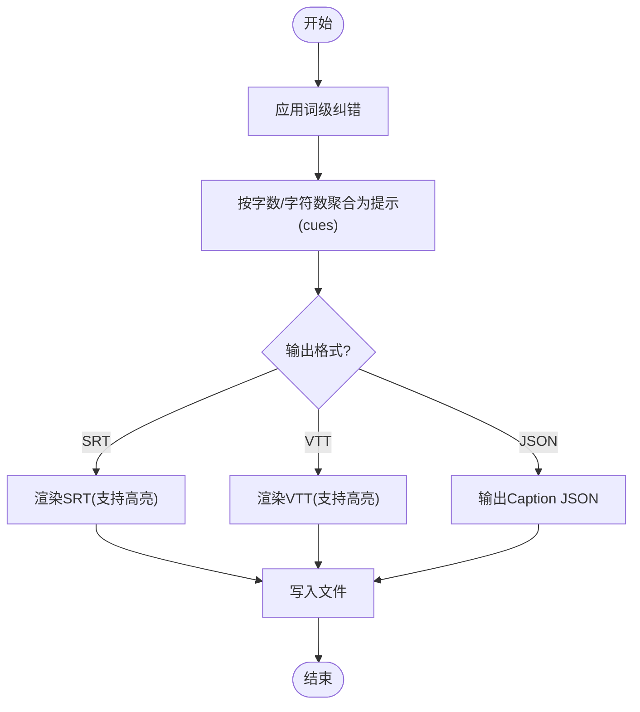
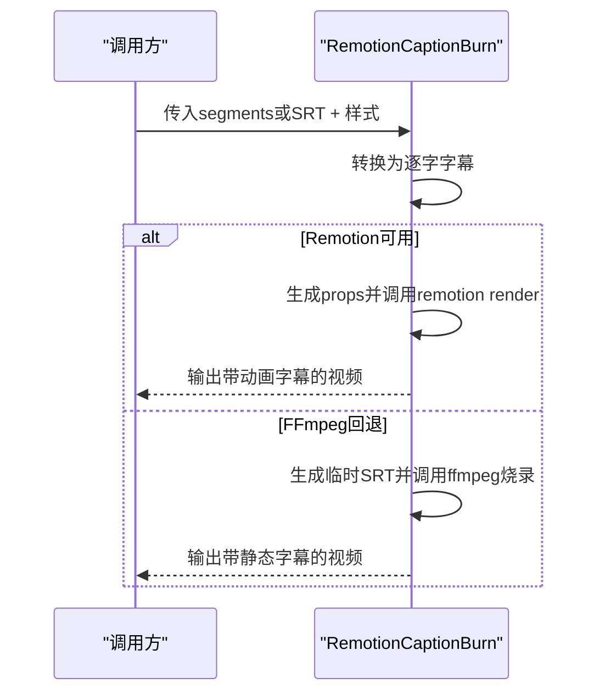
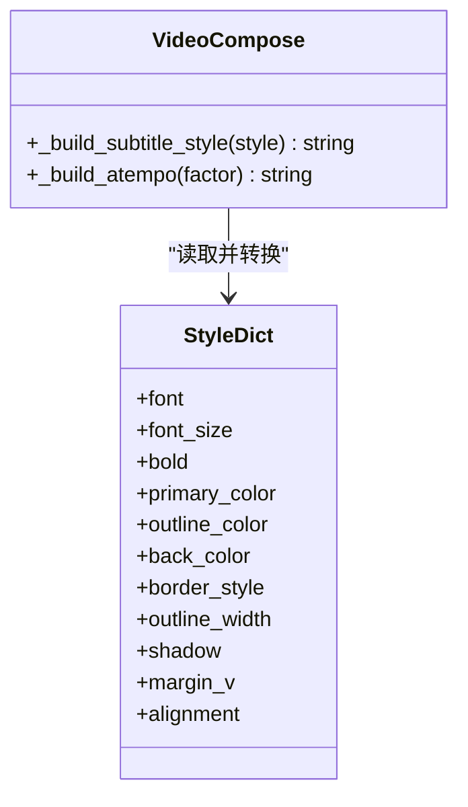
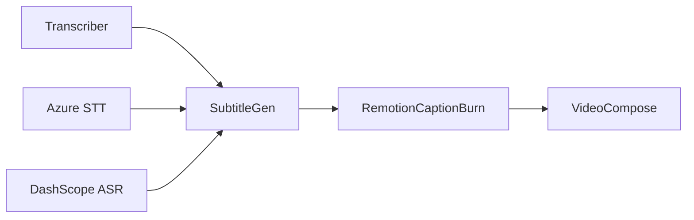

# 字幕生成工具

<cite>
**本文引用的文件**
- [tools/subtitle/subtitle_gen.py](file://tools/subtitle/subtitle_gen.py)
- [tools/analysis/transcriber.py](file://tools/analysis/transcriber.py)
- [tools/analysis/azure_stt.py](file://tools/analysis/azure_stt.py)
- [tools/analysis/dashscope_asr.py](file://tools/analysis/dashscope_asr.py)
- [tools/video/remotion_caption_burn.py](file://tools/video/remotion_caption_burn.py)
- [tools/video/video_compose.py](file://tools/video/video_compose.py)
- [skills/core/subtitle-sync.md](file://skills/core/subtitle-sync.md)
- [tests/tools/test_subtitle_timestamps.py](file://tests/tools/test_subtitle_timestamps.py)
- [.agents/skills/video-translate/SKILL.md](file://.agents/skills/video-translate/SKILL.md)
</cite>

## 目录
1. [简介](#简介)
2. [项目结构](#项目结构)
3. [核心组件](#核心组件)
4. [架构总览](#架构总览)
5. [详细组件分析](#详细组件分析)
6. [依赖关系分析](#依赖关系分析)
7. [性能考虑](#性能考虑)
8. [故障排查指南](#故障排查指南)
9. [结论](#结论)
10. [附录](#附录)

## 简介
本文件面向OpenMontage的字幕生成工具链，系统阐述自动转录、多语言字幕生成、时间轴同步、与ASR服务（Azure Speech-to-Text、DashScope等）的集成实现、字幕格式支持（SRT、VTT、Caption JSON）、翻译与配音工作流、以及字幕样式定制与动画效果。文档同时提供多语言项目的字幕工作流与质量管理策略，帮助读者从入门到进阶掌握高质量字幕生产。

## 项目结构
OpenMontage将字幕相关能力拆分为“转录”、“字幕生成”、“字幕烧录/渲染”三大模块，并通过统一工具接口串联：
- 转录层：本地WhisperX路径（transcriber）与云端ASR（Azure、DashScope）并行可选
- 字幕生成层：基于词级时间戳构建SRT/VTT/Caption JSON
- 渲染层：Remotion动态逐字高亮或FFmpeg回退烧录；视频合成时支持ASS样式注入

图表来源
- [tools/analysis/transcriber.py:116-240](file://tools/analysis/transcriber.py#L116-L240)
- [tools/analysis/azure_stt.py:223-311](file://tools/analysis/azure_stt.py#L223-L311)
- [tools/analysis/dashscope_asr.py:159-281](file://tools/analysis/dashscope_asr.py#L159-L281)
- [tools/subtitle/subtitle_gen.py:82-129](file://tools/subtitle/subtitle_gen.py#L82-L129)
- [tools/video/remotion_caption_burn.py:443-488](file://tools/video/remotion_caption_burn.py#L443-L488)

章节来源
- [tools/subtitle/subtitle_gen.py:1-129](file://tools/subtitle/subtitle_gen.py#L1-L129)
- [tools/analysis/transcriber.py:1-240](file://tools/analysis/transcriber.py#L1-L240)
- [tools/analysis/azure_stt.py:1-311](file://tools/analysis/azure_stt.py#L1-L311)
- [tools/analysis/dashscope_asr.py:1-281](file://tools/analysis/dashscope_asr.py#L1-L281)
- [tools/video/remotion_caption_burn.py:1-488](file://tools/video/remotion_caption_burn.py#L1-L488)

## 核心组件
- 转录工具（Transcriber）：基于faster-whisper/WhisperX，输出带词级时间戳的段落与词列表，支持说话人分离（可选）。
- Azure Speech-to-Text：通过Fast Transcription REST API上传音频并返回结构化结果，兼容下游字幕生成。
- DashScope ASR：异步提交+轮询任务，下载转录JSON并提取词级时间戳，毫秒转秒以适配下游。
- 字幕生成器（SubtitleGen）：将词级时间戳聚合成显示提示（cue），输出SRT/VTT/Caption JSON，支持逐字/卡拉OK高亮。
- 字幕烧录/渲染（RemotionCaptionBurn）：优先使用Remotion进行逐字高亮动画，否则回退到FFmpeg烧录。
- 视频合成（VideoCompose）：在合成阶段注入ASS样式参数，控制字体、描边、阴影、位置等。

章节来源
- [tools/analysis/transcriber.py:29-96](file://tools/analysis/transcriber.py#L29-L96)
- [tools/analysis/azure_stt.py:80-179](file://tools/analysis/azure_stt.py#L80-L179)
- [tools/analysis/dashscope_asr.py:36-75](file://tools/analysis/dashscope_asr.py#L36-L75)
- [tools/subtitle/subtitle_gen.py:26-80](file://tools/subtitle/subtitle_gen.py#L26-L80)
- [tools/video/remotion_caption_burn.py:52-151](file://tools/video/remotion_caption_burn.py#L52-L151)
- [tools/video/video_compose.py:2911-2930](file://tools/video/video_compose.py#L2911-L2930)

## 架构总览
下图展示从输入到成品的端到端流程，包括多路ASR选择、字幕生成与渲染路径。

图表来源
- [tools/analysis/transcriber.py:116-240](file://tools/analysis/transcriber.py#L116-L240)
- [tools/analysis/azure_stt.py:223-311](file://tools/analysis/azure_stt.py#L223-L311)
- [tools/analysis/dashscope_asr.py:159-281](file://tools/analysis/dashscope_asr.py#L159-L281)
- [tools/subtitle/subtitle_gen.py:82-129](file://tools/subtitle/subtitle_gen.py#L82-L129)
- [tools/video/remotion_caption_burn.py:443-488](file://tools/video/remotion_caption_burn.py#L443-L488)
- [tools/video/video_compose.py:2911-2930](file://tools/video/video_compose.py#L2911-L2930)

## 详细组件分析

### 转录工具（Transcriber）
- 功能要点
  - 基于faster-whisper/WhisperX，启用词级时间戳与VAD过滤
  - 自动检测GPU可用性并回退CPU执行，保证稳定性
  - 可选说话人分离（需HF_TOKEN）
  - 输出标准化segments与word_timestamps，供下游字幕生成
- 关键实现
  - 设备与计算类型探测、异常捕获与回退
  - 迭代器消费避免CUDA库缺失导致的延迟错误
  - 写入转录JSON便于追溯

图表来源
- [tools/analysis/transcriber.py:136-240](file://tools/analysis/transcriber.py#L136-L240)
- [tools/analysis/transcriber.py:242-280](file://tools/analysis/transcriber.py#L242-L280)

章节来源
- [tools/analysis/transcriber.py:29-96](file://tools/analysis/transcriber.py#L29-L96)
- [tools/analysis/transcriber.py:116-240](file://tools/analysis/transcriber.py#L116-L240)
- [tools/analysis/transcriber.py:242-280](file://tools/analysis/transcriber.py#L242-L280)

### Azure Speech-to-Text
- 功能要点
  - 使用Fast Transcription REST API，直接上传音频并返回同步JSON
  - 支持多候选区域语言识别、脏话过滤、说话人数限制
  - 输出结构与Transcriber一致，可无缝替换
- 关键实现
  - 环境变量校验（密钥、区域/自定义端点）
  - 请求构造、错误处理、结果解析为segments/word_timestamps
  - 成本估算基于音频时长

图表来源
- [tools/analysis/azure_stt.py:223-311](file://tools/analysis/azure_stt.py#L223-L311)
- [tools/analysis/azure_stt.py:313-366](file://tools/analysis/azure_stt.py#L313-L366)

章节来源
- [tools/analysis/azure_stt.py:80-179](file://tools/analysis/azure_stt.py#L80-L179)
- [tools/analysis/azure_stt.py:223-311](file://tools/analysis/azure_stt.py#L223-L311)
- [tools/analysis/azure_stt.py:313-366](file://tools/analysis/azure_stt.py#L313-L366)

### DashScope ASR
- 功能要点
  - 异步提交+轮询任务模式，仅qwen3-asr-flash-filetrans返回词级时间戳
  - 将毫秒时间戳归一化为秒，确保与下游兼容
  - 支持语言提示以提升准确率
- 关键实现
  - 提交payload、轮询task状态、下载transcription_url
  - 提取words列表并保存完整转录JSON

图表来源
- [tools/analysis/dashscope_asr.py:159-281](file://tools/analysis/dashscope_asr.py#L159-L281)
- [tools/analysis/dashscope_asr.py:299-332](file://tools/analysis/dashscope_asr.py#L299-L332)
- [tools/analysis/dashscope_asr.py:338-358](file://tools/analysis/dashscope_asr.py#L338-L358)

章节来源
- [tools/analysis/dashscope_asr.py:36-75](file://tools/analysis/dashscope_asr.py#L36-L75)
- [tools/analysis/dashscope_asr.py:159-281](file://tools/analysis/dashscope_asr.py#L159-L281)
- [tools/analysis/dashscope_asr.py:299-332](file://tools/analysis/dashscope_asr.py#L299-L332)
- [tools/analysis/dashscope_asr.py:338-358](file://tools/analysis/dashscope_asr.py#L338-L358)

### 字幕生成器（SubtitleGen）
- 功能要点
  - 将词级时间戳聚合成显示提示（cue），支持max_words_per_cue与max_chars_per_line
  - 输出SRT/VTT/Caption JSON，支持none/word_by_word/karaoke高亮
  - 支持词级纠错（corrections），保留标点并修正段文本
- 关键实现
  - 时间戳格式化采用整毫秒进位，避免溢出导致非法时间戳
  - 无词级时间戳时回退到段落级均匀分配

图表来源
- [tools/subtitle/subtitle_gen.py:82-129](file://tools/subtitle/subtitle_gen.py#L82-L129)
- [tools/subtitle/subtitle_gen.py:131-166](file://tools/subtitle/subtitle_gen.py#L131-L166)
- [tools/subtitle/subtitle_gen.py:168-227](file://tools/subtitle/subtitle_gen.py#L168-L227)
- [tools/subtitle/subtitle_gen.py:229-335](file://tools/subtitle/subtitle_gen.py#L229-L335)

章节来源
- [tools/subtitle/subtitle_gen.py:26-80](file://tools/subtitle/subtitle_gen.py#L26-L80)
- [tools/subtitle/subtitle_gen.py:82-129](file://tools/subtitle/subtitle_gen.py#L82-L129)
- [tools/subtitle/subtitle_gen.py:131-166](file://tools/subtitle/subtitle_gen.py#L131-L166)
- [tools/subtitle/subtitle_gen.py:168-227](file://tools/subtitle/subtitle_gen.py#L168-L227)
- [tools/subtitle/subtitle_gen.py:229-335](file://tools/subtitle/subtitle_gen.py#L229-L335)
- [tests/tools/test_subtitle_timestamps.py:1-50](file://tests/tools/test_subtitle_timestamps.py#L1-L50)

### 字幕烧录/渲染（RemotionCaptionBurn）
- 功能要点
  - 优先使用Remotion进行逐字高亮动画（TalkingHead场景）
  - 若不可用则回退到FFmpeg烧录底部字幕
  - 支持从segments或SRT构建词级字幕，支持覆盖物（overlays）
- 关键实现
  - 转换segments/SRT为WordCaption JSON
  - 调用npx remotion render渲染，或ffmpeg subtitles滤镜烧录
  - 自动检测视频尺寸与帧数，设置编码参数

图表来源
- [tools/video/remotion_caption_burn.py:182-261](file://tools/video/remotion_caption_burn.py#L182-L261)
- [tools/video/remotion_caption_burn.py:267-356](file://tools/video/remotion_caption_burn.py#L267-L356)
- [tools/video/remotion_caption_burn.py:362-429](file://tools/video/remotion_caption_burn.py#L362-L429)
- [tools/video/remotion_caption_burn.py:443-488](file://tools/video/remotion_caption_burn.py#L443-L488)

章节来源
- [tools/video/remotion_caption_burn.py:52-151](file://tools/video/remotion_caption_burn.py#L52-L151)
- [tools/video/remotion_caption_burn.py:182-261](file://tools/video/remotion_caption_burn.py#L182-L261)
- [tools/video/remotion_caption_burn.py:267-356](file://tools/video/remotion_caption_burn.py#L267-L356)
- [tools/video/remotion_caption_burn.py:362-429](file://tools/video/remotion_caption_burn.py#L362-L429)
- [tools/video/remotion_caption_burn.py:443-488](file://tools/video/remotion_caption_burn.py#L443-L488)

### 视频合成中的字幕样式（VideoCompose）
- 功能要点
  - 将样式字典转换为ASS force_style字符串，控制字体、粗细、颜色、描边、阴影、边距、对齐
  - 与字幕烧录配合，确保在不同分辨率下可读性
- 关键实现
  - 合并默认/主题/显式样式优先级
  - 构建force_style参数用于FFmpeg/ASS渲染

图表来源
- [tools/video/video_compose.py:2900-2930](file://tools/video/video_compose.py#L2900-L2930)

章节来源
- [tools/video/video_compose.py:2900-2930](file://tools/video/video_compose.py#L2900-L2930)

## 依赖关系分析
- 转录层
  - Transcriber依赖faster-whisper/WhisperX（可选GPU）
  - Azure STT依赖网络与API密钥
  - DashScope ASR依赖网络、API密钥与公网音频URL
- 字幕生成层
  - SubtitleGen纯Python，无外部依赖
- 渲染层
  - RemotionCaptionBurn依赖npx/Remotion环境或FFmpeg
  - VideoCompose依赖FFmpeg/ASS渲染能力

图表来源
- [tools/analysis/transcriber.py:39-45](file://tools/analysis/transcriber.py#L39-L45)
- [tools/analysis/azure_stt.py:91-103](file://tools/analysis/azure_stt.py#L91-L103)
- [tools/analysis/dashscope_asr.py:47-54](file://tools/analysis/dashscope_asr.py#L47-L54)
- [tools/subtitle/subtitle_gen.py:36-40](file://tools/subtitle/subtitle_gen.py#L36-L40)
- [tools/video/remotion_caption_burn.py:62-68](file://tools/video/remotion_caption_burn.py#L62-L68)

章节来源
- [tools/analysis/transcriber.py:39-45](file://tools/analysis/transcriber.py#L39-L45)
- [tools/analysis/azure_stt.py:91-103](file://tools/analysis/azure_stt.py#L91-L103)
- [tools/analysis/dashscope_asr.py:47-54](file://tools/analysis/dashscope_asr.py#L47-L54)
- [tools/subtitle/subtitle_gen.py:36-40](file://tools/subtitle/subtitle_gen.py#L36-L40)
- [tools/video/remotion_caption_burn.py:62-68](file://tools/video/remotion_caption_burn.py#L62-L68)

## 性能考虑
- 转录性能
  - WhisperX在CPU上约0.5x实时；GPU可显著加速
  - Azure Fast Transcription通常低于实时，适合云端批量
  - DashScope异步任务需合理设置轮询间隔与超时
- 字幕生成
  - 词级聚合复杂度近似O(N)，N为词数；合理设置每行字数与字符上限提升可读性
  - 时间戳格式化采用整毫秒进位，避免边界溢出
- 渲染性能
  - Remotion渲染质量更高但依赖Node环境；FFmpeg回退更快更稳定
  - ASS样式参数影响渲染开销，建议精简必要项

[本节为通用指导，不直接分析具体文件]

## 故障排查指南
- 转录失败
  - 检查本地依赖（faster-whisper/whisperx）与GPU驱动
  - 云端ASR检查密钥、区域/端点、网络连通性与限流
- 时间戳异常
  - 确认毫秒→秒归一化正确；测试用例覆盖边界值（如0.9999s进位）
- 字幕格式错误
  - SRT/VTT时间戳必须严格符合规范；使用内置格式化函数
- 渲染失败
  - Remotion环境未安装或路径不正确；回退到FFmpeg
  - FFmpeg路径与环境变量配置是否正确

章节来源
- [tools/analysis/transcriber.py:98-104](file://tools/analysis/transcriber.py#L98-L104)
- [tools/analysis/azure_stt.py:185-190](file://tools/analysis/azure_stt.py#L185-L190)
- [tools/analysis/dashscope_asr.py:150-153](file://tools/analysis/dashscope_asr.py#L150-L153)
- [tests/tools/test_subtitle_timestamps.py:24-49](file://tests/tools/test_subtitle_timestamps.py#L24-L49)
- [tools/video/remotion_caption_burn.py:157-176](file://tools/video/remotion_caption_burn.py#L157-L176)

## 结论
OpenMontage的字幕生成工具链提供了从本地到云端的多源转录、标准化的字幕生成与高质量的渲染烧录能力。通过统一的segments/word_timestamps数据契约，各ASR服务可灵活替换；字幕生成器确保时间轴精确与可读性；渲染层兼顾动画效果与兼容性。结合翻译与配音工作流，可实现多语言项目的端到端字幕生产与质量管理。

[本节为总结，不直接分析具体文件]

## 附录

### 多语言项目字幕工作流
- 推荐流程
  - 使用Azure STT或DashScope ASR进行多语言识别（支持候选语言/语言提示）
  - 通过SubtitleGen生成目标语言字幕（如需翻译，可在转录后对文本进行翻译再入字幕生成）
  - 使用Remotion或FFmpeg烧录字幕，并注入ASS样式
  - 通过视频合成工具验证字幕位置、对比度与可读性
- 质量检查清单
  - 每个口语词出现在字幕中
  - 单行字符数与每提示词数符合平台规范
  - 字幕位于画面底部20%且不遮挡人脸
  - 时间轴与语音对齐，无提前或延后
  - 不同分辨率下可读性良好

章节来源
- [skills/core/subtitle-sync.md:1-105](file://skills/core/subtitle-sync.md#L1-L105)
- [tools/subtitle/subtitle_gen.py:42-73](file://tools/subtitle/subtitle_gen.py#L42-L73)
- [tools/video/video_compose.py:2911-2930](file://tools/video/video_compose.py#L2911-L2930)

### 翻译与配音集成（HeyGen）
- 支持多语言视频翻译与配音，保留口型同步与音色克隆
- 支持音频-only翻译、多说话人、自定义词汇表与SRT输入
- 可与字幕工作流组合：先生成源语言字幕，再作为输入参与翻译

章节来源
- [.agents/skills/video-translate/SKILL.md:1-411](file://.agents/skills/video-translate/SKILL.md#L1-L411)

### 字幕样式与动画效果
- 样式定制
  - 使用VideoCompose的样式字典构建ASS force_style，控制字体、粗细、颜色、描边、阴影、边距、对齐
  - 垂直与水平视频分别调整字号与边距，确保移动端可读性
- 动画效果
  - Remotion支持逐字高亮与卡拉OK效果；FFmpeg回退提供静态烧录
  - 通过overlays叠加信息卡片、图表等元素增强表现力

章节来源
- [skills/core/subtitle-sync.md:42-105](file://skills/core/subtitle-sync.md#L42-L105)
- [tools/video/video_compose.py:2911-2930](file://tools/video/video_compose.py#L2911-L2930)
- [tools/video/remotion_caption_burn.py:123-141](file://tools/video/remotion_caption_burn.py#L123-L141)