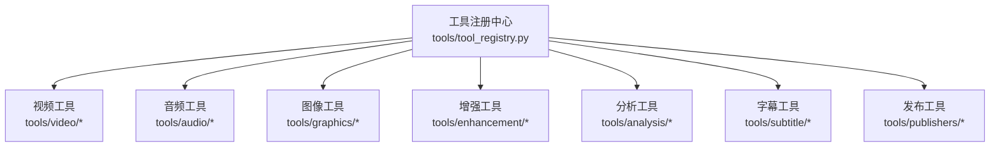
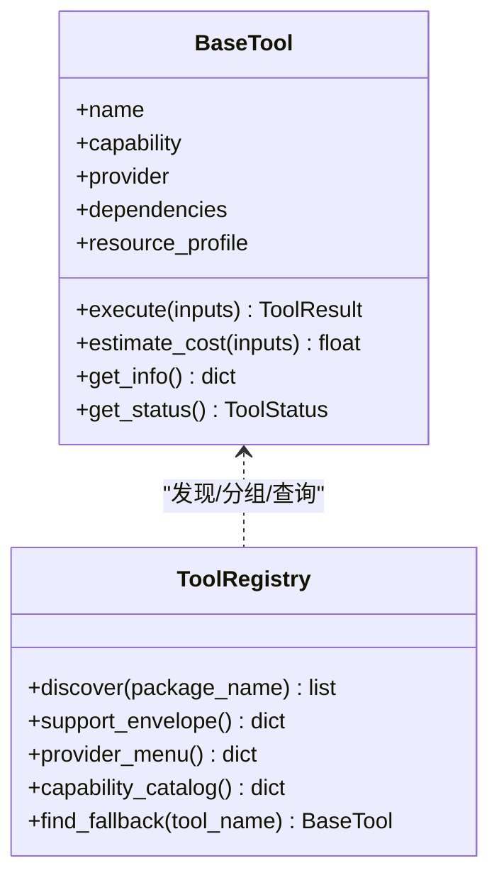
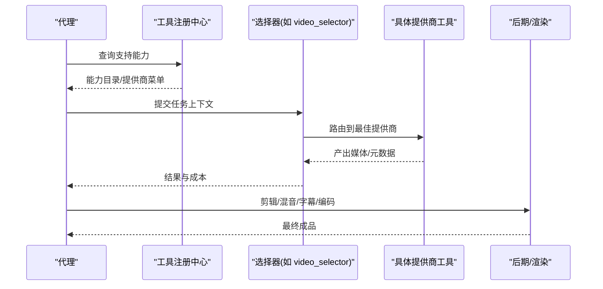
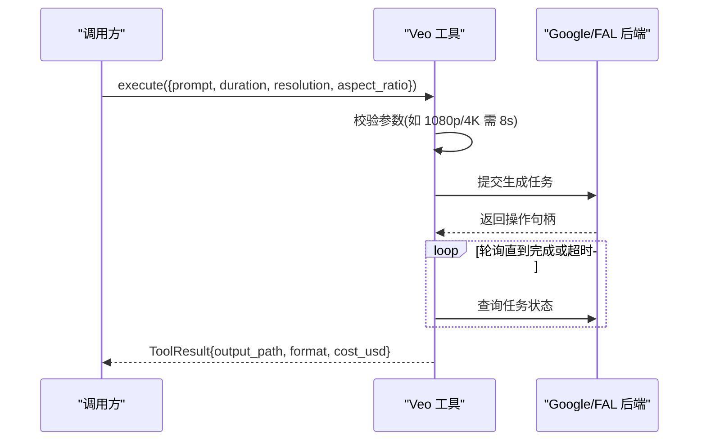
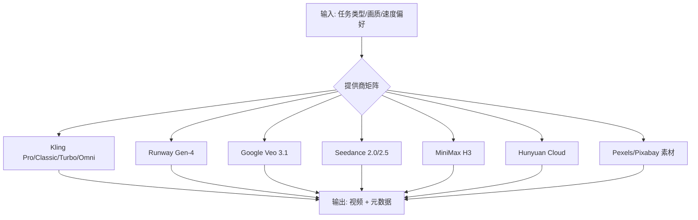
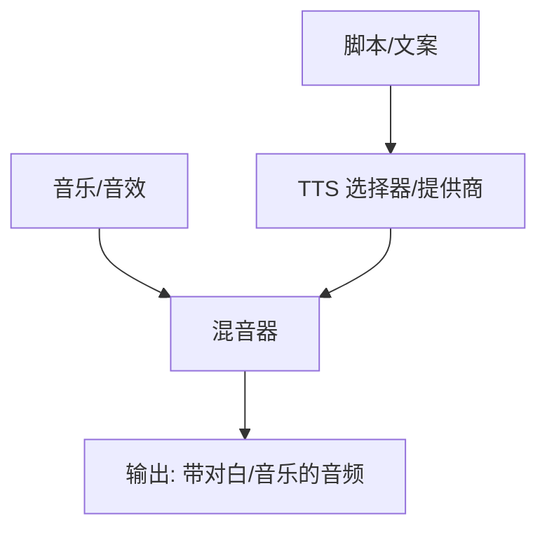
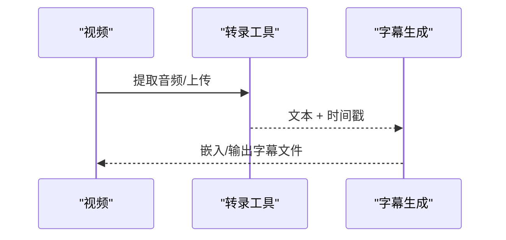
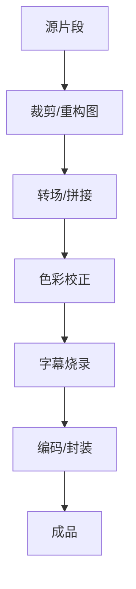

# 生产工具集

<cite>
**本文引用的文件**
- [README.md](file://README.md)
- [PROVIDERS.md](file://docs/PROVIDERS.md)
- [tool_registry.py](file://tools/tool_registry.py)
- [base_tool.py](file://tools/base_tool.py)
- [INDEX.md](file://skills/INDEX.md)
- [video_compose.py](file://tools/video/video_compose.py)
- [color_grade.py](file://tools/enhancement/color_grade.py)
- [audio_mixer.py](file://tools/audio/audio_mixer.py)
- [subtitle_gen.py](file://tools/subtitle/subtitle_gen.py)
- [veo_video.py](file://tools/video/veo_video.py)
- [_shared.py](file://tools/video/_shared.py)
</cite>

## 目录
1. [简介](#简介)
2. [项目结构](#项目结构)
3. [核心组件](#核心组件)
4. [架构总览](#架构总览)
5. [详细组件分析](#详细组件分析)
6. [依赖关系分析](#依赖关系分析)
7. [性能考量](#性能考量)
8. [故障排查指南](#故障排查指南)
9. [结论](#结论)
10. [附录：工具选择与组合模式](#附录工具选择与组合模式)

## 简介
本文件为 OpenMontage 的生产工具集提供系统化、可操作的文档。OpenMontage 是一个以“代理驱动”的视频生产系统，围绕统一的工具注册与能力发现机制，将视频生成、图像处理、音频处理、字幕生成、后期制作等 100+ 工具串联成可编排的流水线。其目标是让开发者根据需求快速选择合适的工具链，并以一致的方式调用、评估成本、控制质量与预算。

## 项目结构
OpenMontage 的工具体系按能力域组织在 tools/ 下，并通过 registry 自动发现与分组。关键目录与职责如下：
- tools/video：视频生成（20+ 提供商）、剪辑、拼接、转码、绿幕合成等
- tools/audio：TTS（10+ 提供商）、音乐生成、混音、降噪、增强
- tools/graphics：图像生成（15+ 提供商）、图表、代码片段、3D 资产
- tools/enhancement：超分、抠图、人脸增强/修复、色彩校正
- tools/analysis：转录、场景检测、帧采样、视频理解
- tools/avatar：数字人、口型同步
- tools/subtitle：SRT/VTT 字幕生成
- tools/publishers：导出打包

图示来源
- [tool_registry.py:118-134](file://tools/tool_registry.py#L118-L134)

章节来源
- [README.md:450-475](file://README.md#L450-L475)
- [INDEX.md:33-82](file://skills/INDEX.md#L33-L82)

## 核心组件
- BaseTool：所有工具的抽象基类，统一声明能力、依赖、资源画像、成本估算、执行接口、状态报告等
- ToolRegistry：自动扫描并注册工具，提供按能力/提供商/稳定性/状态的查询与菜单汇总
- Provider Menu：面向用户的“已配置/未配置”能力清单，便于预检与引导安装

图示来源
- [base_tool.py:227-372](file://tools/base_tool.py#L227-L372)
- [tool_registry.py:55-134](file://tools/tool_registry.py#L55-L134)

章节来源
- [base_tool.py:227-481](file://tools/base_tool.py#L227-L481)
- [tool_registry.py:1-493](file://tools/tool_registry.py#L1-L493)

## 架构总览
OpenMontage 采用“三层知识架构”：
- Layer 1：工具与流水线定义（tools/ + pipeline_defs/）
- Layer 2：OpenMontage 使用规范与最佳实践（skills/）
- Layer 3：外部技术知识包（.agents/skills/），按需加载

代理通过 registry 发现可用能力，结合评分器（任务契合度、输出质量、可控性、可靠性、成本、延迟、连续性）选择最优提供商，并在每个阶段进行质量门禁与审计。

图示来源
- [INDEX.md:33-82](file://skills/INDEX.md#L33-L82)
- [README.md:652-686](file://README.md#L652-L686)

章节来源
- [README.md:408-486](file://README.md#L408-L486)
- [README.md:652-686](file://README.md#L652-L686)

## 详细组件分析

### 视频生成工具（20+ 提供商）
覆盖云 API、本地 GPU、免费素材库等路径，包括 Kling、Runway、Google Veo、Seedance、MiniMax、Hunyuan、CogVideo、LTX、HeyGen、Grok、Pexels/Pixabay 等。

- 典型能力
  - 文本到视频、图像到视频、参考视频编辑
  - 分辨率/时长/画幅约束校验
  - 异步任务轮询与超时保护
  - 输出探测与元数据回传

- 示例流程（Google Veo 3.1）

图示来源
- [veo_video.py:325-351](file://tools/video/veo_video.py#L325-L351)
- [veo_video.py:459-543](file://tools/video/veo_video.py#L459-L543)

- 提供商映射与质量/速度标签

图示来源
- [_shared.py:15-33](file://tools/video/_shared.py#L15-L33)

章节来源
- [README.md:494-518](file://README.md#L494-L518)
- [PROVIDERS.md:85-104](file://docs/PROVIDERS.md#L85-L104)
- [PROVIDERS.md:311-358](file://docs/PROVIDERS.md#L311-L358)
- [PROVIDERS.md:433-473](file://docs/PROVIDERS.md#L433-L473)
- [PROVIDERS.md:584-655](file://docs/PROVIDERS.md#L584-L655)

### 图像处理工具（15+ 提供商）
涵盖 FLUX、Google Imagen、OpenAI GPT Image 2、Recraft、Kling Official、Atlas Cloud、MiniMax、本地 Diffusion 以及 Pexels/Pixabay/Unsplash 等图库。

- 典型能力
  - 文生图、图编辑、风格迁移、多参考合成
  - 分辨率/画幅/种子控制
  - 成本估算与可用性检查

- 选择建议
  - 高质量写实：FLUX / Google Imagen
  - 品牌/矢量：Recraft
  - 中文友好：DashScope/Qwen-Image、Hunyuan
  - 低成本批量：fal.ai 多模型网关

章节来源
- [README.md:520-540](file://README.md#L520-L540)
- [PROVIDERS.md:256-309](file://docs/PROVIDERS.md#L256-L309)
- [PROVIDERS.md:407-431](file://docs/PROVIDERS.md#L407-L431)

### 音频处理工具（语音合成、音乐生成、混音）
- TTS（10+ 提供商）：ElevenLabs、Google TTS、Kling Official TTS、OpenAI TTS、Piper（离线）、Azure Speech、DashScope/Doubao/Fish Audio
- 音乐：Suno、ElevenLabs Music、ComfyUI Music、Freesound、Pixabay
- 混音与增强：AudioMixer（多轨、淡入淡出、ducking、响度归一化）、AudioEnhance（降噪、标准化）

图示来源
- [audio_mixer.py](file://tools/audio/audio_mixer.py)

章节来源
- [README.md:542-579](file://README.md#L542-L579)
- [PROVIDERS.md:475-501](file://docs/PROVIDERS.md#L475-L501)
- [PROVIDERS.md:503-582](file://docs/PROVIDERS.md#L503-L582)
- [PROVIDERS.md:657-760](file://docs/PROVIDERS.md#L657-L760)

### 字幕生成工具（自动转录、多语言支持）
- 转录：WhisperX（默认离线）、Azure STT（云端，词级时间戳）、DashScope ASR（词级）
- 字幕：SubtitleGen（SRT/VTT 生成与对齐）

章节来源
- [README.md:589-597](file://README.md#L589-L597)
- [PROVIDERS.md:657-703](file://docs/PROVIDERS.md#L657-L703)
- [PROVIDERS.md:256-291](file://docs/PROVIDERS.md#L256-L291)

### 后期制作工具（转场特效、色彩校正、画面裁剪）
- 转场/拼接：VideoStitch（多片段组装、交叉淡化、画中画、空间布局）
- 裁剪/缩放：VideoTrimmer（精确截取）、AutoReframe（智能重构图）
- 色彩校正：ColorGrade（预设/LUT/自定义滤镜、强度混合）
- 编码/封装：VideoCompose（Remotion/FFmpeg 渲染、字幕烧录、平台规格）

图示来源
- [color_grade.py:78-124](file://tools/enhancement/color_grade.py#L78-L124)
- [video_compose.py:2845-2880](file://tools/video/video_compose.py#L2845-L2880)

章节来源
- [README.md:568-617](file://README.md#L568-L617)

## 依赖关系分析
- 工具注册与发现
  - registry.discover() 递归导入 tools 包，跳过 base_tool 与 tool_registry 自身，自动注册所有继承自 BaseTool 的具体类
  - 支持按 capability/provider/tier/status/stability 查询，并提供 provider_menu 汇总

- 依赖检查与环境加载
  - BaseTool.check_dependencies() 检查 cmd/binary/env/python 依赖
  - 自动从 .env 加载环境变量，避免硬编码密钥

- 供应商菜单与能力包络
  - support_envelope() 返回所有工具的契约信息
  - provider_menu() 聚合“已配置/未配置”能力，便于用户预检

图示来源
- [tool_registry.py:118-134](file://tools/tool_registry.py#L118-L134)
- [base_tool.py:304-328](file://tools/base_tool.py#L304-L328)

章节来源
- [tool_registry.py:1-493](file://tools/tool_registry.py#L1-L493)
- [base_tool.py:25-60](file://tools/base_tool.py#L25-L60)

## 性能考量
- 本地 vs 云端
  - 本地 GPU：WAN/Hunyuan/CogVideo/LTX 等可离线生成，适合隐私与成本控制
  - 云端 API：质量/速度更优，但需考虑延迟与配额
- 资源画像
  - 每个工具声明 CPU/RAM/VRAM/Disk/网络需求，便于调度与容量规划
- 重试策略
  - 可配置最大重试次数、退避间隔、可重试错误集合
- 成本估算
  - estimate_cost() 用于预评估，配合预算治理（预估/预留/对账/阈值审批）

章节来源
- [base_tool.py:110-126](file://tools/base_tool.py#L110-L126)
- [base_tool.py:374-382](file://tools/base_tool.py#L374-L382)
- [README.md:676-686](file://README.md#L676-L686)

## 故障排查指南
- 常见环境问题
  - FFmpeg 未安装：颜色校正/编码失败
  - 环境变量缺失：API Key 未设置导致工具不可用
  - 远程服务超时：长时任务需调整超时与轮询间隔
- 诊断步骤
  - 使用 registry.provider_menu_summary() 查看“已配置/未配置”能力与安装提示
  - 检查 get_status() 与 dependencies 是否满足
  - 查看 ToolResult.error 与日志定位失败点
- 恢复策略
  - 优先启用 fallback_tools；必要时切换提供商或降级分辨率/时长

章节来源
- [tool_registry.py:249-314](file://tools/tool_registry.py#L249-L314)
- [base_tool.py:296-328](file://tools/base_tool.py#L296-L328)
- [README.md:652-686](file://README.md#L652-L686)

## 结论
OpenMontage 通过统一的工具基类与注册中心，将 100+ 工具纳入一致的契约与生命周期管理，使代理能够基于能力、成本与质量进行智能选择与编排。借助多层技能知识与严格的质量门禁，开发者可以高效构建从创意到成品的端到端视频生产管线。

## 附录：工具选择与组合模式

### 工具选择指南
- 视频生成
  - 追求最高质量：Runway Gen-4、Google Veo 3.1、Kling Official Omni
  - 性价比与易用：fal.ai 多模型网关（Kling/Veo/Seedance/MiniMax）
  - 中文友好：Hunyuan Cloud、Jimeng、DashScope
  - 免费/离线：WAN/Hunyuan/CogVideo/LTX（需 GPU）
- 图像生成
  - 通用写实：FLUX、Google Imagen
  - 品牌/矢量：Recraft
  - 中文优化：DashScope/Qwen-Image、Hunyuan
- 语音合成
  - 多语言/本地化：Google TTS（700+ 声音）
  - 高品质旁白：ElevenLabs、Azure Neural TTS
  - 完全离线：Piper
- 字幕与转录
  - 词级时间戳：Azure STT、DashScope ASR
  - 离线首选：WhisperX
- 后期制作
  - 色彩校正：ColorGrade（预设/LUT/自定义）
  - 拼接/转场：VideoStitch
  - 编码/字幕：VideoCompose（Remotion/FFmpeg）

### 组合使用模式
- 动画解说视频
  - 研究 → 提案 → 脚本 → 图像生成（FLUX/Imagen）→ TTS（Google/ElevenLabs）→ Remotion 合成 → 字幕烧录
- 真实素材纪录片
  - 素材检索（Pexels/Pixabay/Archive.org）→ 场景检测 → 剪辑拼接 → 混音降噪 → 编码输出
- 产品宣传片
  - 图像生成（Recraft/FLUX）→ 视频生成（Kling/Runway/Veo）→ 转场/调色 → 音乐（Suno/ElevenLabs）→ 字幕/编码
- 多语种本地化
  - 转录（Azure/DashScope）→ 翻译脚本 → 多语言 TTS → 唇形同步（可选）→ 多版本编码

章节来源
- [README.md:356-383](file://README.md#L356-L383)
- [README.md:489-617](file://README.md#L489-L617)
- [PROVIDERS.md:1-82](file://docs/PROVIDERS.md#L1-L82)