# 视频生成工具

<cite>
**本文引用的文件**
- [PROVIDERS.md](file://docs/PROVIDERS.md)
- [kling_official_video.py](file://tools/video/kling_official_video.py)
- [runway_video.py](file://tools/video/runway_video.py)
- [veo_video.py](file://tools/video/veo_video.py)
- [sora_video.py](file://tools/video/sora_video.py)
- [hunyuan_cloud_video.py](file://tools/video/hunyuan_cloud_video.py)
- [jimeng_video.py](file://tools/video/jimeng_video.py)
- [minimax_video.py](file://tools/video/minimax_video.py)
- [seedance_ark.py](file://tools/video/seedance_ark.py)
</cite>

## 目录
1. [简介](#简介)
2. [项目结构](#项目结构)
3. [核心组件](#核心组件)
4. [架构总览](#架构总览)
5. [详细组件分析](#详细组件分析)
6. [依赖关系分析](#依赖关系分析)
7. [性能与成本优化](#性能与成本优化)
8. [故障排查指南](#故障排查指南)
9. [结论](#结论)
10. [附录：最佳实践与选型指南](#附录：最佳实践与选型指南)

## 简介
本文件面向OpenMontage的视频生成能力，系统梳理并深入说明已集成的20+视频生成提供商（含Kling、Runway、Google Veo、Sora、Hunyuan等）的API接口、参数配置、质量设置、成本控制策略与性能特点。同时提供提示词优化、分辨率选择、时长控制、格式转换等最佳实践，以及错误处理、重试策略与降级方案，帮助在不同场景下选择合适的工具与使用模式。

## 项目结构
OpenMontage将每个视频生成提供商封装为独立的“工具”模块，统一继承自BaseTool，暴露一致的输入输出契约（prompt、operation、模型、分辨率、时长、参考媒体、回调、超时、输出路径等），并通过统一的执行流程完成提交任务、轮询状态、下载结果与探测元数据。

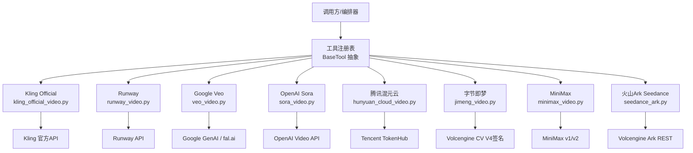

图表来源
- [kling_official_video.py:45-78](file://tools/video/kling_official_video.py#L45-L78)
- [runway_video.py:80-134](file://tools/video/runway_video.py#L80-L134)
- [veo_video.py:33-76](file://tools/video/veo_video.py#L33-L76)
- [sora_video.py:35-68](file://tools/video/sora_video.py#L35-L68)
- [hunyuan_cloud_video.py:43-80](file://tools/video/hunyuan_cloud_video.py#L43-L80)
- [jimeng_video.py:49-81](file://tools/video/jimeng_video.py#L49-L81)
- [minimax_video.py:58-105](file://tools/video/minimax_video.py#L58-L105)
- [seedance_ark.py:39-180](file://tools/video/seedance_ark.py#L39-L180)

章节来源
- [kling_official_video.py:45-78](file://tools/video/kling_official_video.py#L45-L78)
- [runway_video.py:80-134](file://tools/video/runway_video.py#L80-L134)
- [veo_video.py:33-76](file://tools/video/veo_video.py#L33-L76)
- [sora_video.py:35-68](file://tools/video/sora_video.py#L35-L68)
- [hunyuan_cloud_video.py:43-80](file://tools/video/hunyuan_cloud_video.py#L43-L80)
- [jimeng_video.py:49-81](file://tools/video/jimeng_video.py#L49-L81)
- [minimax_video.py:58-105](file://tools/video/minimax_video.py#L58-L105)
- [seedance_ark.py:39-180](file://tools/video/seedance_ark.py#L39-L180)

## 核心组件
- 统一工具基类与契约：所有视频生成工具均实现execute、estimate_cost、estimate_runtime、input_schema、retry_policy等，保证可插拔与一致的错误/成本/运行时估计。
- 异步任务与轮询：多数提供商采用“提交任务→轮询状态→下载结果”的模式，并提供超时、退避与重试策略。
- 多后端/多模型路由：如Veo支持Google与fal.ai双后端；Runway聚合Seedance/Gemini Omni/MiniMax等多模型；MiniMax区分v1/v2两套API。
- 资源与成本估算：各工具内置按秒/按分辨率/按引用数量/按token的计费估算，便于预算控制与dry-run校验。

章节来源
- [kling_official_video.py:179-214](file://tools/video/kling_official_video.py#L179-L214)
- [runway_video.py:223-237](file://tools/video/runway_video.py#L223-L237)
- [veo_video.py:187-239](file://tools/video/veo_video.py#L187-L239)
- [sora_video.py:132-139](file://tools/video/sora_video.py#L132-L139)
- [hunyuan_cloud_video.py:207-241](file://tools/video/hunyuan_cloud_video.py#L207-L241)
- [jimeng_video.py:176-182](file://tools/video/jimeng_video.py#L176-L182)
- [minimax_video.py:271-295](file://tools/video/minimax_video.py#L271-L295)
- [seedance_ark.py:369-420](file://tools/video/seedance_ark.py#L369-L420)

## 架构总览
下图展示一个典型视频生成的端到端流程：构建请求→提交任务→轮询→下载→探测输出→返回结构化结果。

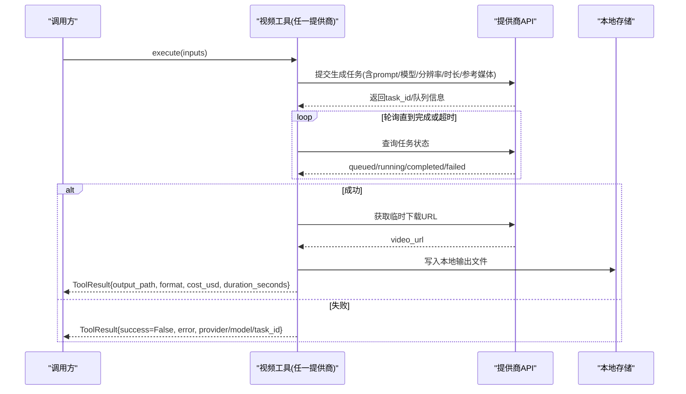

图表来源
- [runway_video.py:394-454](file://tools/video/runway_video.py#L394-L454)
- [hunyuan_cloud_video.py:412-492](file://tools/video/hunyuan_cloud_video.py#L412-L492)
- [jimeng_video.py:278-322](file://tools/video/jimeng_video.py#L278-L322)
- [minimax_video.py:517-626](file://tools/video/minimax_video.py#L517-L626)
- [seedance_ark.py:597-667](file://tools/video/seedance_ark.py#L597-L667)

## 详细组件分析

### Kling Official（Kling 官方直连）
- 能力：文本/图像/参考到视频，Classic/Turbo/Omni三套协议，支持多镜头、元素列表、回调、水印控制。
- 关键参数：operation、api_family、model_name、duration、aspect_ratio、resolution、mode、sound、negative_prompt、cfg_scale、reference_*、element_list、multi_shot、shot_type、multi_prompt、callback_url、timeout_seconds、poll_interval、output_path。
- 成本估算：按api_family与mode、分辨率、是否开启声音、Omni引用数量与多提示词加权估算。
- 重试策略：针对特定错误码进行有限重试。
- 执行流：根据api_family选择Classic/Turbo/Omni路径，创建任务后轮询并下载视频。

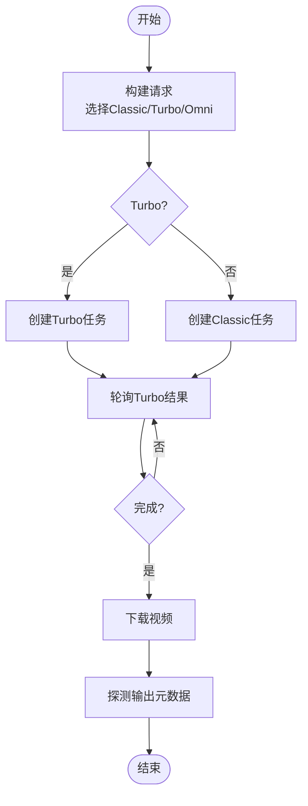

图表来源
- [kling_official_video.py:216-287](file://tools/video/kling_official_video.py#L216-L287)
- [kling_official_video.py:289-449](file://tools/video/kling_official_video.py#L289-L449)
- [kling_official_video.py:595-621](file://tools/video/kling_official_video.py#L595-L621)

章节来源
- [kling_official_video.py:45-177](file://tools/video/kling_official_video.py#L45-L177)
- [kling_official_video.py:179-214](file://tools/video/kling_official_video.py#L179-L214)
- [kling_official_video.py:216-287](file://tools/video/kling_official_video.py#L216-L287)
- [kling_official_video.py:289-449](file://tools/video/kling_official_video.py#L289-L449)
- [kling_official_video.py:595-621](file://tools/video/kling_official_video.py#L595-L621)

### Runway（聚合多模型）
- 能力：原生Runway模型及Seedance 2.5、Gemini Omni Flash、MiniMax Hailuo 3等。
- 关键参数：model、operation、duration、ratio、image_url/video_url、reference_*、resolution、generate_audio、mode、output_path。
- 成本估算：按模型与分辨率/操作类型计算每秒单价×时长。
- 执行流：构造payload→POST提交→轮询任务→下载视频。

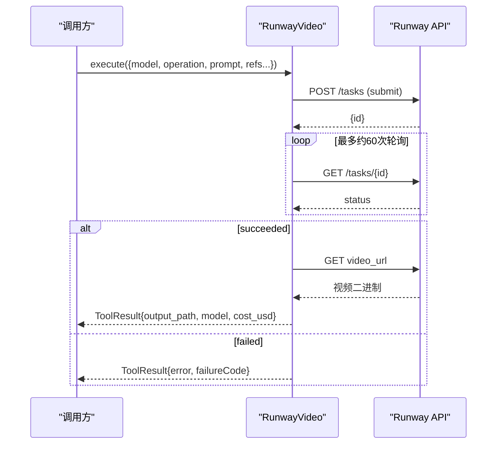

图表来源
- [runway_video.py:239-454](file://tools/video/runway_video.py#L239-L454)

章节来源
- [runway_video.py:80-213](file://tools/video/runway_video.py#L80-L213)
- [runway_video.py:223-237](file://tools/video/runway_video.py#L223-L237)
- [runway_video.py:239-454](file://tools/video/runway_video.py#L239-L454)

### Google Veo（Google GenAI 与 fal.ai 双后端）
- 能力：文本/图像/参考到视频，首尾帧插值，原生音频与对话生成。
- 关键参数：backend、operation、model_variant、duration、aspect_ratio、resolution、generate_audio、negative_prompt、seed、auto_fix、safety_tolerance、first/last frame、reference images、output_path。
- 成本估算：Google后端固定每秒单价；fal.ai后端按variant/resolution/audio开关估算。
- 执行流：自动选择后端→提交→轮询→下载→探测输出。

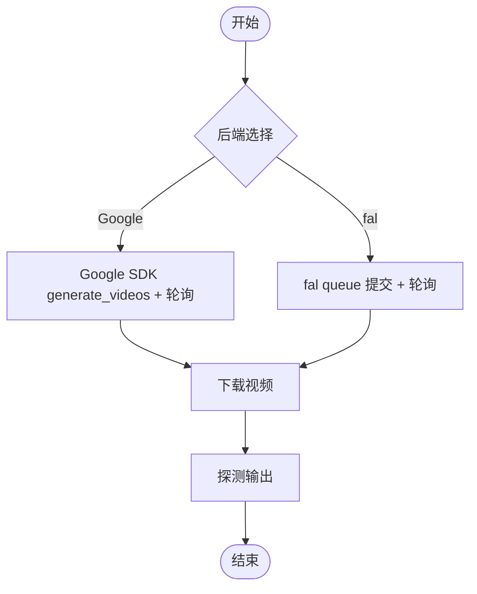

图表来源
- [veo_video.py:187-239](file://tools/video/veo_video.py#L187-L239)
- [veo_video.py:282-543](file://tools/video/veo_video.py#L282-L543)
- [veo_video.py:545-723](file://tools/video/veo_video.py#L545-L723)

章节来源
- [veo_video.py:33-76](file://tools/video/veo_video.py#L33-L76)
- [veo_video.py:187-239](file://tools/video/veo_video.py#L187-L239)
- [veo_video.py:282-543](file://tools/video/veo_video.py#L282-L543)
- [veo_video.py:545-723](file://tools/video/veo_video.py#L545-L723)

### OpenAI Sora
- 能力：文本/图像到视频，短片段社交广告风格，原生环境音/对话。
- 关键参数：model、size、aspect_ratio、seconds/duration、input_reference_path、output_path。
- 成本估算：按秒线性估算（占位）。
- 执行流：校验SDK版本→提交并轮询→下载内容→写出文件。

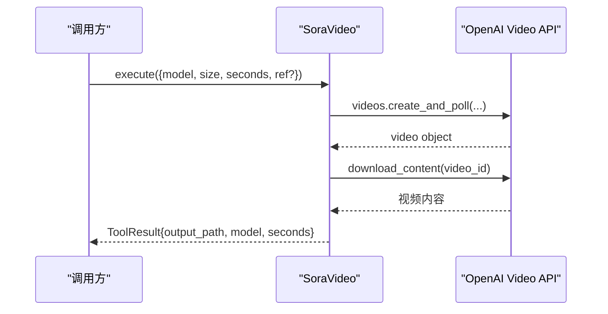

图表来源
- [sora_video.py:141-211](file://tools/video/sora_video.py#L141-L211)
- [sora_video.py:213-293](file://tools/video/sora_video.py#L213-L293)

章节来源
- [sora_video.py:35-68](file://tools/video/sora_video.py#L35-L68)
- [sora_video.py:132-139](file://tools/video/sora_video.py#L132-L139)
- [sora_video.py:141-211](file://tools/video/sora_video.py#L141-L211)
- [sora_video.py:213-293](file://tools/video/sora_video.py#L213-L293)

### 腾讯混元云（TokenHub）
- 能力：文本/图像到视频，简单Bearer鉴权，中文提示理解友好。
- 关键参数：operation、model、image_url/image_path、resolution、logo_add、poll_interval_seconds、timeout_seconds、output_path。
- 成本估算：按模型与分辨率换算credits为USD。
- 执行流：提交→轮询→下载→探测输出。

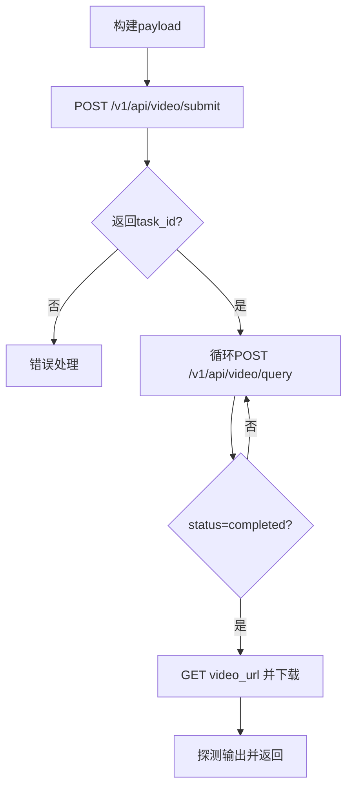

图表来源
- [hunyuan_cloud_video.py:294-341](file://tools/video/hunyuan_cloud_video.py#L294-L341)
- [hunyuan_cloud_video.py:412-492](file://tools/video/hunyuan_cloud_video.py#L412-L492)

章节来源
- [hunyuan_cloud_video.py:43-80](file://tools/video/hunyuan_cloud_video.py#L43-L80)
- [hunyuan_cloud_video.py:207-241](file://tools/video/hunyuan_cloud_video.py#L207-L241)
- [hunyuan_cloud_video.py:294-341](file://tools/video/hunyuan_cloud_video.py#L294-L341)
- [hunyuan_cloud_video.py:412-492](file://tools/video/hunyuan_cloud_video.py#L412-L492)

### 字节即梦（Volcengine Jimeng）
- 能力：文本/图像到视频，HMAC-SHA256 V4签名，中文提示友好。
- 关键参数：operation、image_url、frames（121/241）、aspect_ratio、seed、poll_interval_seconds、timeout_seconds、output_path。
- 成本估算：按帧数换算时长×单价。
- 执行流：V4签名提交→轮询→下载→探测输出。

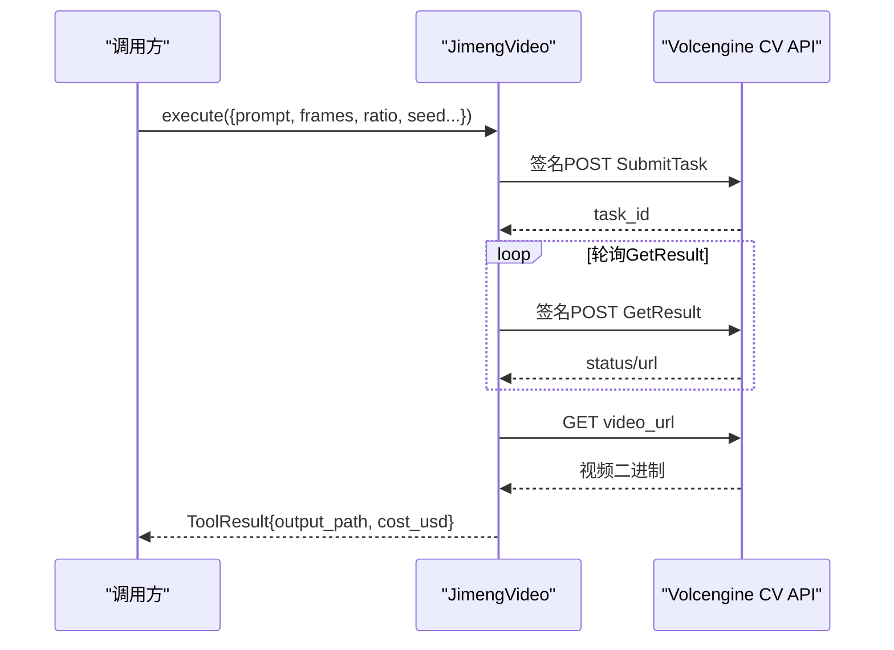

图表来源
- [jimeng_video.py:212-253](file://tools/video/jimeng_video.py#L212-L253)
- [jimeng_video.py:278-322](file://tools/video/jimeng_video.py#L278-L322)
- [jimeng_video.py:325-375](file://tools/video/jimeng_video.py#L325-L375)

章节来源
- [jimeng_video.py:49-81](file://tools/video/jimeng_video.py#L49-L81)
- [jimeng_video.py:176-182](file://tools/video/jimeng_video.py#L176-L182)
- [jimeng_video.py:212-253](file://tools/video/jimeng_video.py#L212-L253)
- [jimeng_video.py:278-322](file://tools/video/jimeng_video.py#L278-L322)
- [jimeng_video.py:325-375](file://tools/video/jimeng_video.py#L325-L375)

### MiniMax（官方直连，v1/v2）
- 能力：文本/图像/首尾帧/参考到视频，支持全球与中国大陆路由。
- 关键参数：operation、model、first/last frame、reference_*、duration、resolution、ratio、callback_url、aigc_watermark、poll_interval_seconds、timeout_seconds、output_path。
- 成本估算：H3按秒与额外参考图数量；其他模型按固定档位。
- 执行流：选择v1/v2→提交→轮询→下载→探测输出。

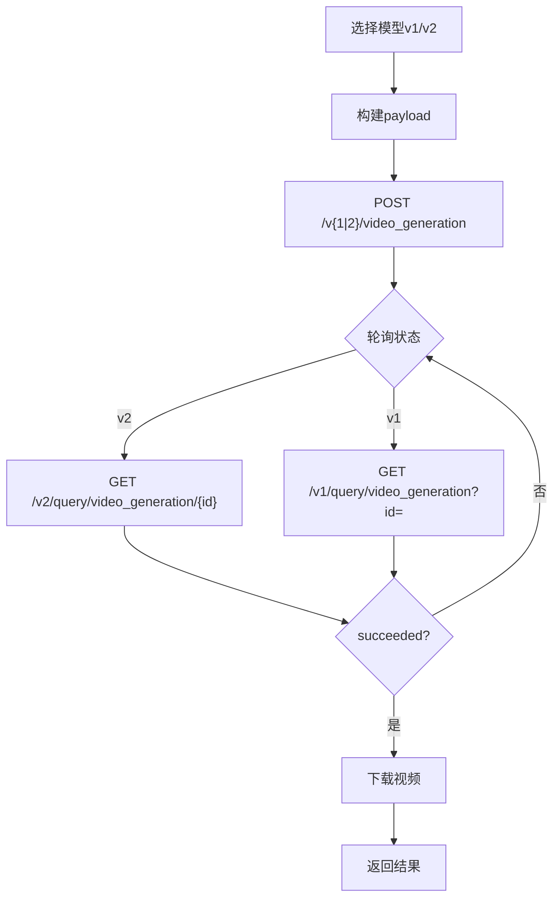

图表来源
- [minimax_video.py:323-422](file://tools/video/minimax_video.py#L323-L422)
- [minimax_video.py:424-454](file://tools/video/minimax_video.py#L424-L454)
- [minimax_video.py:517-626](file://tools/video/minimax_video.py#L517-L626)

章节来源
- [minimax_video.py:58-105](file://tools/video/minimax_video.py#L58-L105)
- [minimax_video.py:271-295](file://tools/video/minimax_video.py#L271-L295)
- [minimax_video.py:323-422](file://tools/video/minimax_video.py#L323-L422)
- [minimax_video.py:424-454](file://tools/video/minimax_video.py#L424-L454)
- [minimax_video.py:517-626](file://tools/video/minimax_video.py#L517-L626)

### 火山Ark Seedance（直接对接）
- 能力：文本/图像/参考到视频，支持Native音频、Web搜索、Last Frame返回、任务管理（create/query/cancel）。
- 关键参数：task_action、prompt、operation、model_variant/model、custom_price_cny_per_million_tokens、duration、aspect_ratio、resolution、generate_audio、watermark、return_last_frame、reference_*、poll_interval_seconds、timeout_seconds、output_path。
- 成本估算：基于官方公式估算token用量×单价（CNY→USD），未知模型需自定义价格。
- 执行流：dry_run/validate→创建任务→轮询→下载→探测输出。

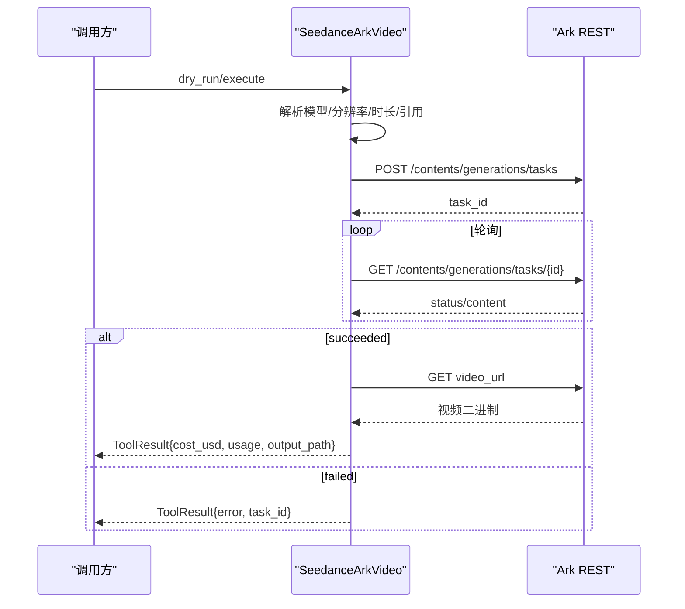

图表来源
- [seedance_ark.py:369-420](file://tools/video/seedance_ark.py#L369-L420)
- [seedance_ark.py:463-528](file://tools/video/seedance_ark.py#L463-L528)
- [seedance_ark.py:530-667](file://tools/video/seedance_ark.py#L530-L667)
- [seedance_ark.py:687-800](file://tools/video/seedance_ark.py#L687-L800)

章节来源
- [seedance_ark.py:39-180](file://tools/video/seedance_ark.py#L39-L180)
- [seedance_ark.py:369-420](file://tools/video/seedance_ark.py#L369-L420)
- [seedance_ark.py:463-528](file://tools/video/seedance_ark.py#L463-L528)
- [seedance_ark.py:530-667](file://tools/video/seedance_ark.py#L530-L667)
- [seedance_ark.py:687-800](file://tools/video/seedance_ark.py#L687-L800)

## 依赖关系分析
- 环境变量与密钥：各工具通过环境变量注入密钥（如KLING_API_KEY、RUNWAY_API_KEY、GEMINI_API_KEY/GOOGLE_API_KEY、OPENAI_API_KEY、TENCENT_TOKENHUB_API_KEY、VOLC_ACCESSKEY/VOLC_SECRETKEY、MINIMAX_API_KEY、ARK_API_KEY）。
- 外部服务：Kling、Runway、Google、OpenAI、Tencent、Volcengine、MiniMax、Ark等。
- 内部依赖：BaseTool抽象、重试策略、输出探测、成本估算、ID幂等键字段。

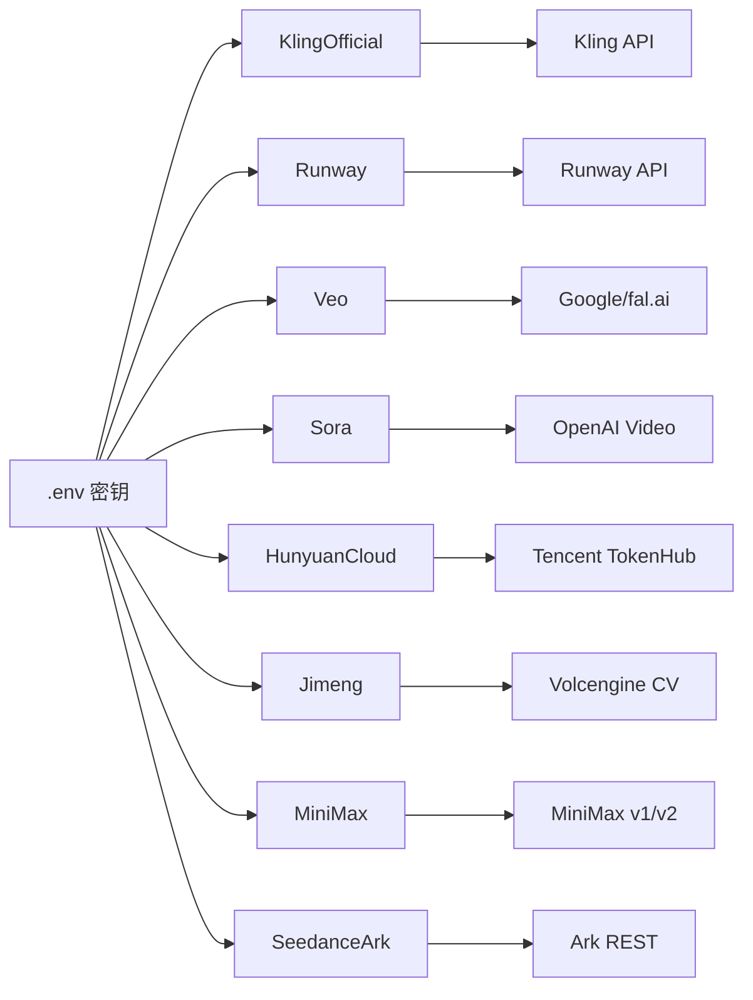

图表来源
- [kling_official_video.py:56-61](file://tools/video/kling_official_video.py#L56-L61)
- [runway_video.py:91-95](file://tools/video/runway_video.py#L91-L95)
- [veo_video.py:44-52](file://tools/video/veo_video.py#L44-L52)
- [sora_video.py:46-51](file://tools/video/sora_video.py#L46-L51)
- [hunyuan_cloud_video.py:56-61](file://tools/video/hunyuan_cloud_video.py#L56-L61)
- [jimeng_video.py:60-65](file://tools/video/jimeng_video.py#L60-L65)
- [minimax_video.py:69-77](file://tools/video/minimax_video.py#L69-L77)
- [seedance_ark.py:139-144](file://tools/video/seedance_ark.py#L139-L144)

章节来源
- [kling_official_video.py:56-61](file://tools/video/kling_official_video.py#L56-L61)
- [runway_video.py:91-95](file://tools/video/runway_video.py#L91-L95)
- [veo_video.py:44-52](file://tools/video/veo_video.py#L44-L52)
- [sora_video.py:46-51](file://tools/video/sora_video.py#L46-L51)
- [hunyuan_cloud_video.py:56-61](file://tools/video/hunyuan_cloud_video.py#L56-L61)
- [jimeng_video.py:60-65](file://tools/video/jimeng_video.py#L60-L65)
- [minimax_video.py:69-77](file://tools/video/minimax_video.py#L69-L77)
- [seedance_ark.py:139-144](file://tools/video/seedance_ark.py#L139-L144)

## 性能与成本优化
- 分辨率与时长控制
  - 优先选择满足业务的最小分辨率（如480p/720p）以降低费用与延迟。
  - 合理缩短时长（如4–8秒）以平衡质量与成本；长片段建议分镜拼接。
- 模型与后端选择
  - 高质量需求：Runway（Gen4/Seedance2.5）、Google Veo、Kling Omni。
  - 性价比：MiniMax H3、Seedance Fast/Mini、Jimeng 3.0 Pro。
  - 中文友好：Hunyuan、Jimeng、DashScope（TTS/ASR）。
- 引用媒体与多模态
  - 合理使用首尾帧/参考图/参考视频提升一致性；注意各提供商对引用数量与类型的限制。
- 成本估算与Dry-run
  - 利用estimate_cost与dry_run在提交前评估成本与合法性，避免无效付费。
- 重试与退避
  - 遵循各工具的RetryPolicy，结合rate_limit/timeout错误进行指数退避重试。
- 格式与转码
  - 输出统一为MP4；必要时使用FFmpeg进行分辨率/FPS/码率标准化与裁剪。

[本节为通用指导，不直接分析具体文件]

## 故障排查指南
- 常见错误分类
  - 认证失败：检查环境变量与密钥格式（如ARK_API_KEY不应包含“Bearer ”前缀）。
  - 参数校验失败：分辨率/比例/时长/模型组合不符合要求时，依据错误信息修正。
  - 网络/限流：触发rate_limit/timeout时启用重试与退避。
  - 任务失败：记录task_id与failureCode，必要时查询任务详情或取消。
- 日志与诊断
  - 保留provider/model/operation/task_id/cost_usd/duration_seconds等上下文。
  - 对敏感信息（密钥）进行脱敏输出。
- 降级策略
  - 主提供商失败时，按fallback_tools顺序切换（如Kling→Seedance→Veo→MiniMax）。
  - 对长耗时任务设置更保守的超时与轮询间隔。

章节来源
- [kling_official_video.py:138-142](file://tools/video/kling_official_video.py#L138-L142)
- [runway_video.py:206-208](file://tools/video/runway_video.py#L206-L208)
- [veo_video.py:161-163](file://tools/video/veo_video.py#L161-L163)
- [sora_video.py:120-121](file://tools/video/sora_video.py#L120-L121)
- [hunyuan_cloud_video.py:164-168](file://tools/video/hunyuan_cloud_video.py#L164-L168)
- [jimeng_video.py:138-142](file://tools/video/jimeng_video.py#L138-L142)
- [minimax_video.py:219-221](file://tools/video/minimax_video.py#L219-L221)
- [seedance_ark.py:323-327](file://tools/video/seedance_ark.py#L323-L327)

## 结论
OpenMontage通过统一工具抽象与多提供商集成，覆盖了从低成本快速迭代到高质量专业生产的多种视频生成需求。借助完善的成本估算、重试与降级机制，可在不同预算与质量目标下灵活选择模型与后端，稳定产出可用视频片段。

[本节为总结性内容，不直接分析具体文件]

## 附录：最佳实践与选型指南
- 提示词优化
  - 明确主体、动作、场景与风格；避免过长导致理解偏差。
  - 对需要强一致性的镜头，优先使用首尾帧/参考图/参考视频。
- 分辨率与时长
  - 社交媒体短视频：720p、4–8秒；横屏16:9或竖屏9:16按需选择。
  - 长片分镜：拆分为多个短片段，后期拼接与转场。
- 格式转换
  - 统一输出MP4；必要时用FFmpeg调整分辨率、FPS、码率与色彩空间。
- 成本控制
  - 优先使用Fast/Mini或较低分辨率；批量任务前务必dry-run估算成本。
- 错误处理与重试
  - 捕获rate_limit/timeout并指数退避；记录task_id以便恢复。
- 场景选型
  - 高质量电影感：Runway Gen4/Seedance2.5、Google Veo、Kling Omni。
  - 中文友好与性价比：Hunyuan、Jimeng、MiniMax H3。
  - 快速原型：Seedance Fast/Mini、fal.ai网关。

[本节为通用指导，不直接分析具体文件]