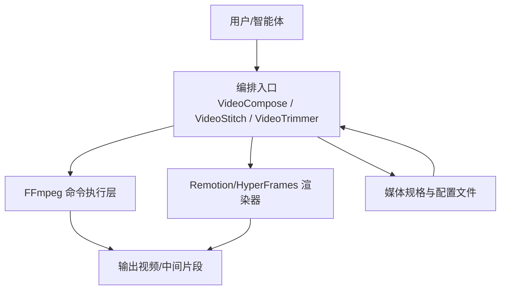
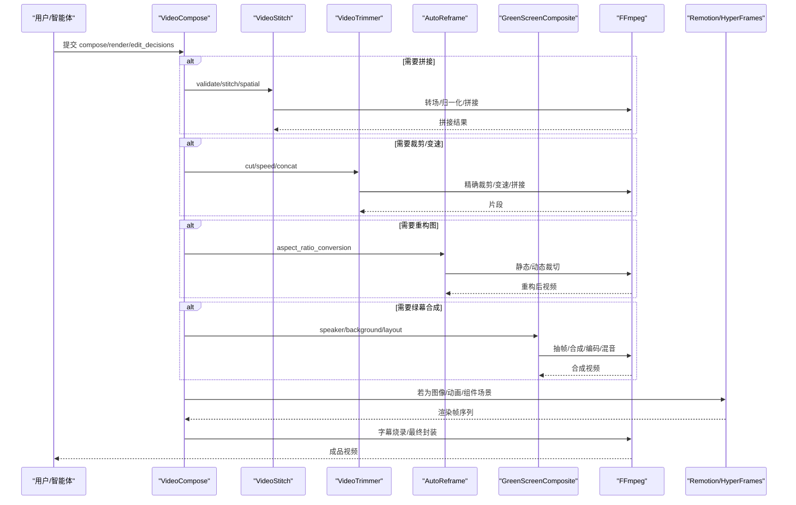
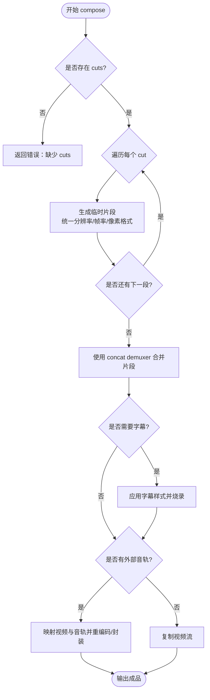
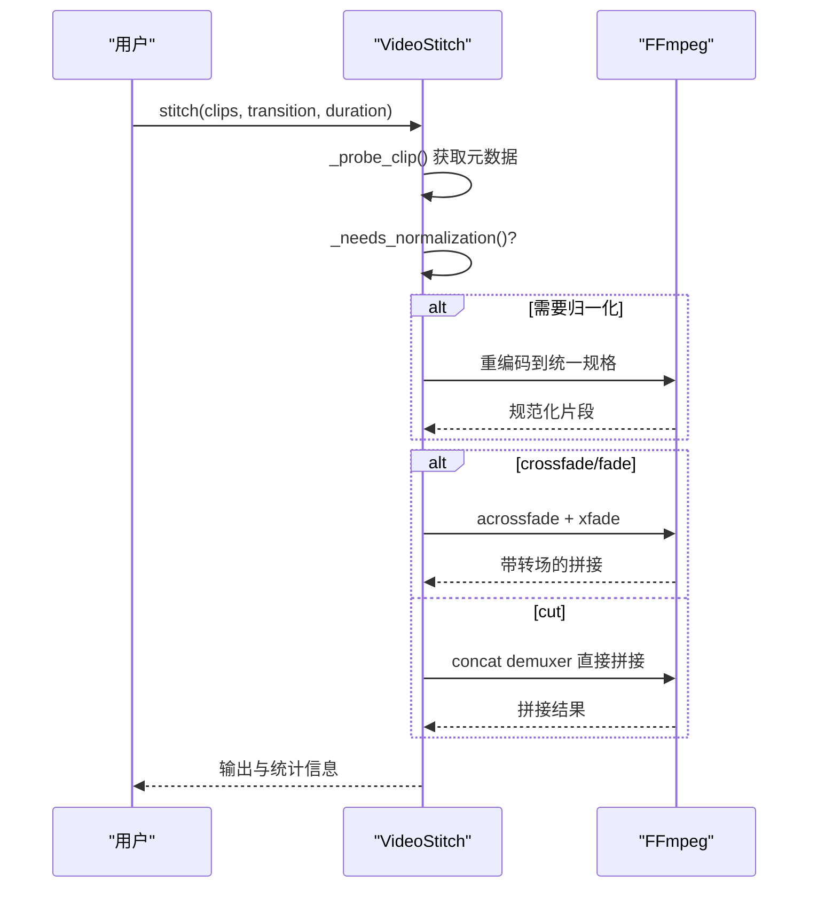
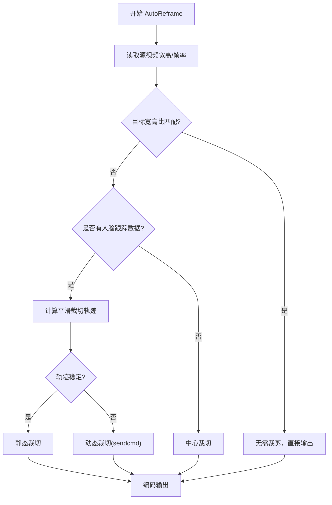
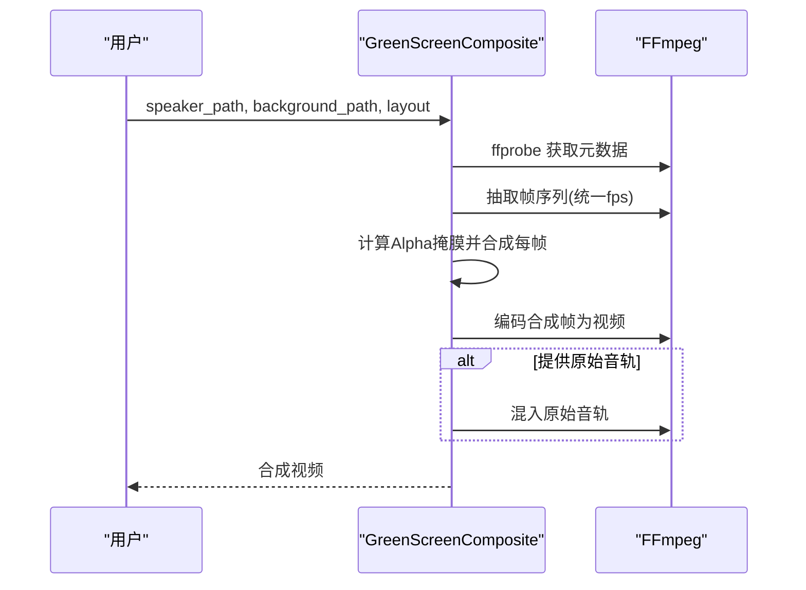
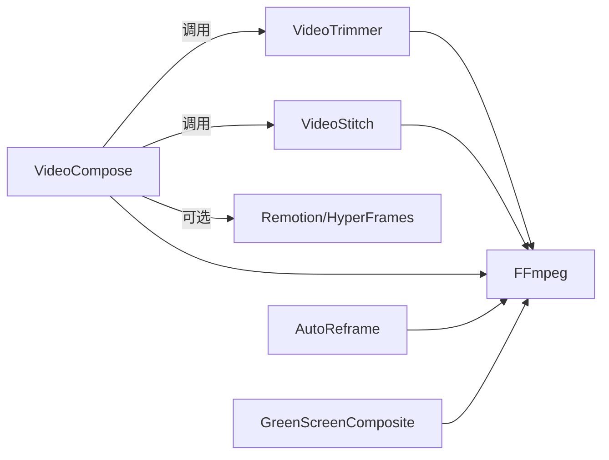

# 视频编辑工具

<cite>
**本文引用的文件**
- [README.md](file://README.md)
- [README_zh-CN.md](file://README_zh-CN.md)
- [tools/video/video_compose.py](file://tools/video/video_compose.py)
- [tools/video/video_stitch.py](file://tools/video/video_stitch.py)
- [tools/video/video_trimmer.py](file://tools/video/video_trimmer.py)
- [tools/video/auto_reframe.py](file://tools/video/auto_reframe.py)
- [tools/video/green_screen_composite.py](file://tools/video/green_screen_composite.py)
- [skills/creative/video-stitching.md](file://skills/creative/video-stitching.md)
- [tests/qa/test_08_end_to_end.py](file://tests/qa/test_08_end_to_end.py)
</cite>

## 目录
1. [简介](#简介)
2. [项目结构](#项目结构)
3. [核心组件](#核心组件)
4. [架构总览](#架构总览)
5. [详细组件分析](#详细组件分析)
6. [依赖关系分析](#依赖关系分析)
7. [性能与资源管理](#性能与资源管理)
8. [故障排查指南](#故障排查指南)
9. [结论](#结论)
10. [附录](#附录)

## 简介
本文件面向OpenMontage的视频编辑能力，系统梳理并深入说明以下核心功能：视频合成、拼接、裁剪、自动重构图（自适应裁切）、静音检测与音频处理、绿幕合成等。文档重点阐述FFmpeg的深度集成方式、转场效果实现路径、多轨道编辑策略，以及格式转换、编码优化、批量处理等实用方法。同时给出剪辑工作流设计、自动化脚本思路与质量控制手段，并提供性能调优与资源管理建议，帮助读者在本地或云端稳定高效地生产高质量视频。

## 项目结构
OpenMontage将视频编辑能力以“工具+流水线+技能”的方式组织：
- tools/video：视频编辑核心工具（合成、拼接、裁剪、自动重构图、绿幕合成等）
- skills/creative：创意技巧与最佳实践（如视频拼接规范、转场选择、常见问题）
- tests/qa：端到端质量验证与回归测试
- README/README_zh-CN：项目概览、能力清单、平台输出配置、治理与质量关卡

图表来源
- [tools/video/video_compose.py:1-800](file://tools/video/video_compose.py#L1-L800)
- [tools/video/video_stitch.py:1-200](file://tools/video/video_stitch.py#L1-L200)
- [tools/video/video_trimmer.py:1-120](file://tools/video/video_trimmer.py#L1-L120)

章节来源
- [README.md:450-475](file://README.md#L450-L475)
- [README_zh-CN.md:377-402](file://README_zh-CN.md#L377-L402)

## 核心组件
- 视频合成（VideoCompose）：负责compose/render/remotion_render/burn_subtitles/overlay/encode等操作；根据edit_decisions与资产清单路由到Remotion或FFmpeg；支持字幕烧录、外部音轨混音、目标分辨率与帧率适配、码率与预设控制。
- 视频拼接（VideoStitch）：提供validate/stitch/spatial操作，支持cut/crossfade/fade-through-black转场、空间布局（左右分屏、上下堆叠、画中画），并内置属性校验与归一化流程。
- 视频裁剪（VideoTrimmer）：提供cut/speed/concat操作，支持按时间范围精确裁剪、变速（音视频同步）、多段拼接。
- 自动重构图（AutoReframe）：基于人脸跟踪或中心裁切进行宽高比转换，支持静态与动态裁切（sendcmd），用于横转竖等场景。
- 绿幕合成（GreenScreenComposite）：对已抠像的主讲人视频与背景视频进行逐帧Alpha合成，支持多种布局（新闻主播、全屏背后、画中画、分屏）。

章节来源
- [tools/video/video_compose.py:58-232](file://tools/video/video_compose.py#L58-L232)
- [tools/video/video_stitch.py:29-146](file://tools/video/video_stitch.py#L29-L146)
- [tools/video/video_trimmer.py:28-84](file://tools/video/video_trimmer.py#L28-L84)
- [tools/video/auto_reframe.py:44-129](file://tools/video/auto_reframe.py#L44-L129)
- [tools/video/green_screen_composite.py:35-122](file://tools/video/green_screen_composite.py#L35-L122)

## 架构总览
OpenMontage采用“工具即能力”的架构：每个工具声明依赖、输入输出Schema、资源画像与重试策略；上层通过edit_decisions与asset_manifest驱动具体执行。视频合成阶段可选择Remotion（React场景）或HyperFrames（HTML/CSS/GSAP）作为渲染引擎，纯视频路径则走FFmpeg直编。所有关键步骤具备可恢复性、幂等键与用户可见验证项，便于流水线编排与质量门禁。

图表来源
- [tools/video/video_compose.py:337-714](file://tools/video/video_compose.py#L337-L714)
- [tools/video/video_stitch.py:481-735](file://tools/video/video_stitch.py#L481-L735)
- [tools/video/video_trimmer.py:86-241](file://tools/video/video_trimmer.py#L86-L241)
- [tools/video/auto_reframe.py:131-219](file://tools/video/auto_reframe.py#L131-L219)
- [tools/video/green_screen_composite.py:124-244](file://tools/video/green_screen_composite.py#L124-L244)

## 详细组件分析

### 视频合成（VideoCompose）
- 能力与路由：支持compose（纯视频拼接+字幕+音轨）、render（自动识别图像/动画走Remotion）、remotion_render（直接调用Remotion）、burn_subtitles（字幕烧录）、overlay（叠加）、encode（重编码至目标规格）。
- 运行时治理：在提案阶段锁定render_runtime（remotion/hyperframes/ffmpeg），禁止静默切换；提供get_info暴露各引擎可用性。
- 关键实现要点：
  - compose内部对每段素材进行统一分辨率/帧率/像素格式归一化，确保concat-copy安全。
  - 无音频流的素材会注入静音轨道，保证后续滤镜链一致。
  - 支持profile（媒体规格）与compose_target（宽/高/fit模式）灵活控制输出。
  - 外部混音通过原子替换临时文件避免损坏原文件。

图表来源
- [tools/video/video_compose.py:438-714](file://tools/video/video_compose.py#L438-L714)

章节来源
- [tools/video/video_compose.py:58-232](file://tools/video/video_compose.py#L58-L232)
- [tools/video/video_compose.py:395-436](file://tools/video/video_compose.py#L395-L436)
- [tools/video/video_compose.py:438-714](file://tools/video/video_compose.py#L438-L714)

### 视频拼接（VideoStitch）
- 能力：validate（属性校验）、stitch（顺序拼接）、spatial（空间布局：side_by_side/vertical_stack/picture_in_picture）。
- 转场：cut（硬切）、crossfade（交叉淡入淡出）、fade（黑场过渡）。
- 关键点：
  - 自动探测音频流，缺失时注入静音轨道，避免xfade/acrossfail失败。
  - 当clip属性不一致且未开启auto_normalize时，明确提示需归一化。
  - 支持preview_stitch快速预览低分辨率结果。

图表来源
- [tools/video/video_stitch.py:481-735](file://tools/video/video_stitch.py#L481-L735)

章节来源
- [tools/video/video_stitch.py:29-146](file://tools/video/video_stitch.py#L29-L146)
- [tools/video/video_stitch.py:200-250](file://tools/video/video_stitch.py#L200-L250)
- [tools/video/video_stitch.py:314-399](file://tools/video/video_stitch.py#L314-L399)
- [tools/video/video_stitch.py:481-735](file://tools/video/video_stitch.py#L481-L735)

### 视频裁剪（VideoTrimmer）
- 能力：cut（按起止时间裁剪）、speed（变速，音视频同步）、concat（多段拼接）。
- 关键点：
  - cut默认copy，速度变化时重编码以保证帧准确。
  - speed使用setpts与atempo链，支持极端倍速的分段组合。
  - concat先对含起止时间的片段做临时裁剪，再写列表拼接。

章节来源
- [tools/video/video_trimmer.py:28-84](file://tools/video/video_trimmer.py#L28-L84)
- [tools/video/video_trimmer.py:105-180](file://tools/video/video_trimmer.py#L105-L180)
- [tools/video/video_trimmer.py:182-241](file://tools/video/video_trimmer.py#L182-L241)
- [tools/video/video_trimmer.py:255-271](file://tools/video/video_trimmer.py#L255-L271)

### 自动重构图（AutoReframe）
- 能力：aspect_ratio_conversion、face_tracked_crop、smart_reframe、center_crop。
- 关键点：
  - 支持预设宽高比（portrait/square/landscape/cinematic/vertical_4_5）。
  - 优先使用人脸跟踪轨迹计算平滑裁切框；若无跟踪数据则回退为中心裁切。
  - 动态裁切通过FFmpeg sendcmd更新crop位置；若失败回退为静态平均裁切。

图表来源
- [tools/video/auto_reframe.py:131-219](file://tools/video/auto_reframe.py#L131-L219)
- [tools/video/auto_reframe.py:334-401](file://tools/video/auto_reframe.py#L334-L401)
- [tools/video/auto_reframe.py:412-525](file://tools/video/auto_reframe.py#L412-L525)

章节来源
- [tools/video/auto_reframe.py:44-129](file://tools/video/auto_reframe.py#L44-L129)
- [tools/video/auto_reframe.py:221-298](file://tools/video/auto_reframe.py#L221-L298)
- [tools/video/auto_reframe.py:300-401](file://tools/video/auto_reframe.py#L300-L401)
- [tools/video/auto_reframe.py:412-525](file://tools/video/auto_reframe.py#L412-L525)

### 绿幕合成（GreenScreenComposite）
- 能力：green_screen_composite、speaker_overlay、layout_preset、alpha_composite。
- 关键点：
  - 基于PIL/numpy进行逐帧Alpha合成，支持news_anchor/full_behind/pip/split布局。
  - 抽取两路视频帧，计算背景色距离得到Alpha通道，合成后编码为MP4并可混入原始音轨。
  - 输出尺寸由背景决定，帧率取较低者，时长取较短者。

图表来源
- [tools/video/green_screen_composite.py:124-244](file://tools/video/green_screen_composite.py#L124-L244)
- [tools/video/green_screen_composite.py:298-418](file://tools/video/green_screen_composite.py#L298-L418)

章节来源
- [tools/video/green_screen_composite.py:35-122](file://tools/video/green_screen_composite.py#L35-L122)
- [tools/video/green_screen_composite.py:249-330](file://tools/video/green_screen_composite.py#L249-L330)
- [tools/video/green_screen_composite.py:388-418](file://tools/video/green_screen_composite.py#L388-L418)

### 转场与拼接最佳实践（来自技能文档）
- 叙事拼接：按叙事顺序排序→精确裁剪→选择转场→concat或compose→校验音频连续性。
- 空间拼接：侧边、垂直堆叠、画中画、网格布局对应不同FFmpeg滤镜。
- 常见问题：长拼接音频漂移（VFR→CFR、-async 1）、混合宽高比（pad/crop不拉伸）、concat copy失败（回退重编码CRF≈18）。

章节来源
- [skills/creative/video-stitching.md:42-67](file://skills/creative/video-stitching.md#L42-L67)
- [skills/creative/video-stitching.md:228-260](file://skills/creative/video-stitching.md#L228-L260)

## 依赖关系分析
- 工具间耦合：
  - VideoCompose依赖VideoStitch/VideoTrimmer完成前置准备（裁剪、拼接、转场），再进入最终合成。
  - AutoReframe可与VideoTrimmer配合，先重构图再拼接。
  - GreenScreenComposite独立于主流程，常用于TalkingHead管线。
- 外部依赖：
  - FFmpeg/ffprobe：贯穿所有工具的核心。
  - Remotion/HyperFrames：仅在图像/动画/组件场景下启用。
  - MediaPipe/OpenCV：可选，用于人脸跟踪增强自动重构图。

图表来源
- [tools/video/video_compose.py:1-800](file://tools/video/video_compose.py#L1-L800)
- [tools/video/video_stitch.py:1-200](file://tools/video/video_stitch.py#L1-L200)
- [tools/video/video_trimmer.py:1-120](file://tools/video/video_trimmer.py#L1-L120)
- [tools/video/auto_reframe.py:1-120](file://tools/video/auto_reframe.py#L1-L120)
- [tools/video/green_screen_composite.py:1-120](file://tools/video/green_screen_composite.py#L1-L120)

章节来源
- [tools/video/video_compose.py:58-232](file://tools/video/video_compose.py#L58-L232)
- [tools/video/video_stitch.py:29-146](file://tools/video/video_stitch.py#L29-L146)
- [tools/video/video_trimmer.py:28-84](file://tools/video/video_trimmer.py#L28-L84)
- [tools/video/auto_reframe.py:44-129](file://tools/video/auto_reframe.py#L44-L129)
- [tools/video/green_screen_composite.py:35-122](file://tools/video/green_screen_composite.py#L35-L122)

## 性能与资源管理
- 编码与质量平衡：
  - 使用libx264 + CRF控制质量；compose中对每段重编码保证精准裁剪与concat安全。
  - 拼接时若属性不一致，优先归一化后再concat-copy，减少重复重编码。
- 帧率与一致性：
  - 统一fps=30、yuv420p、setsar=1，避免非单调DTS与兼容性问题。
  - 对VFR源转换为CFR，避免长拼接导致的音画漂移。
- 内存与磁盘：
  - 大量片段拼接时使用临时目录与列表文件，完成后清理。
  - 绿幕合成逐帧处理，注意释放临时目录。
- 并行与批处理：
  - 批量任务可按片段拆分并行调用工具，最后统一拼接。
  - 使用preview_stitch快速验证拼接逻辑，降低全量渲染成本。

[本节为通用指导，不直接分析具体文件]

## 故障排查指南
- 拼接失败或输出异常：
  - 检查clip属性差异（分辨率、fps、codec、像素格式），必要时开启auto_normalize。
  - 确认所有clip存在且可读；使用validate操作获取详细差异报告。
- 转场失败：
  - crossfade/fade要求每段都有音频流；缺失时会自动注入静音轨道。
  - 长链xfade建议使用chain_xfade实现，避免复杂滤镜串错误。
- 字幕烧录问题：
  - 确认字幕路径有效，样式优先级解析正确（显式 > edit_decisions > playbook > 默认）。
- 自动重构图抖动或偏移：
  - 调整smoothing_window与face_padding；若跟踪点过少，回退为静态平均裁切。
- 绿幕合成边缘伪影：
  - 调整背景色阈值与缩放比例；确保背景与主讲人分辨率一致。
- 端到端验证：
  - 参考测试用例对最终视频进行ffprobe校验、时长/流信息检查。

章节来源
- [tools/video/video_stitch.py:314-399](file://tools/video/video_stitch.py#L314-L399)
- [tools/video/video_stitch.py:609-735](file://tools/video/video_stitch.py#L609-L735)
- [tools/video/video_compose.py:438-714](file://tools/video/video_compose.py#L438-L714)
- [tools/video/auto_reframe.py:439-525](file://tools/video/auto_reframe.py#L439-L525)
- [tools/video/green_screen_composite.py:308-386](file://tools/video/green_screen_composite.py#L308-L386)
- [tests/qa/test_08_end_to_end.py:501-540](file://tests/qa/test_08_end_to_end.py#L501-L540)

## 结论
OpenMontage的视频编辑体系以FFmpeg为核心，结合Remotion/HyperFrames提供灵活的渲染后端，并通过标准化工具接口与严格的治理机制保障质量与可维护性。借助VideoCompose、VideoStitch、VideoTrimmer、AutoReframe与GreenScreenComposite等组件，可实现从素材预处理、转场拼接、自动重构图到绿幕合成的完整工作流。配合技能文档中的最佳实践与测试用例，可在本地或云端构建稳定高效的批量视频生产流水线。

[本节为总结性内容，不直接分析具体文件]

## 附录
- 平台输出配置：内置YouTube/TikTok/Instagram等平台分辨率与宽高比，可通过profile快速套用。
- 质量门禁：合成前验证、渲染后自检（ffprobe、抽帧、音频电平、承诺校验）确保交付质量。
- 预算与治理：提供商选择评分、决策审计、预算上限与审批阈值，避免意外开销。

章节来源
- [README.md:635-650](file://README.md#L635-L650)
- [README.md:652-687](file://README.md#L652-L687)
- [README_zh-CN.md:549-599](file://README_zh-CN.md#L549-L599)